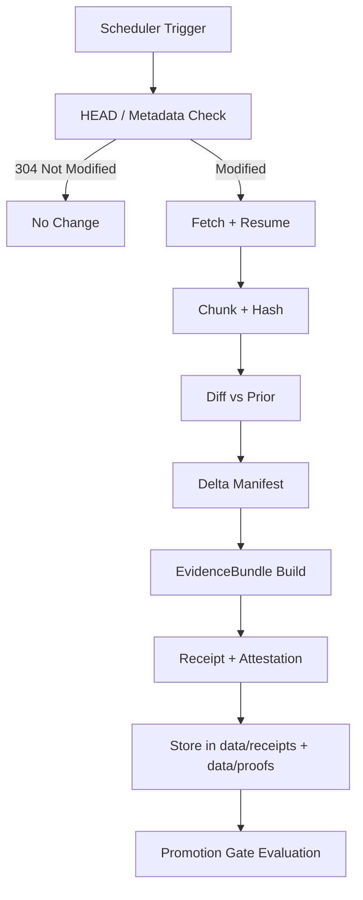

<!-- [KFM_META_BLOCK_V2]
doc_id: kfm://doc/<NEEDS_VERIFICATION_UUID>
title: Soil & Air Quality Watchers (Evidence-First Polling Connectors)
type: standard
version: v1
status: draft
owners: @bartytime4life
created: <NEEDS_VERIFICATION_CREATED_DATE>
updated: 2026-04-25
policy_label: <NEEDS_VERIFICATION_POLICY_LABEL>
related: [
  ../../../data/raw/README.md,
  ../../../data/work/README.md,
  ../../../data/processed/README.md,
  ../../../data/receipts/README.md,
  ../../../data/proofs/README.md,
  ../../../tools/validators/promotion_gate/README.md,
  ../../../tools/attest/README.md,
  ../../../schemas/contracts/v1/runtime/runtime_response_envelope.schema.json
]
tags: [kfm, watchers, soil, air-quality, evidence-first, polling, receipts, spec-hash]
notes: [
  "Defines watcher-first ingestion pattern for soil + air quality sources.",
  "Emit-only design: no direct publishing, only EvidenceBundles + receipts.",
  "All claims remain subordinate to EvidenceBundle resolution at runtime."
]
[/KFM_META_BLOCK_V2] -->

<a id="top"></a>

# Soil & Air Quality Watchers

Evidence-first polling connectors for soil and air-quality data sources.  
These watchers ingest, diff, and attest external data into KFM as **EvidenceBundles**, not publishable claims.

---

## Status

| Field | Value |
|------|------|
| Status | draft |
| Owners | @bartytime4life |
| Enforcement | FAIL-CLOSED (intended; NEEDS VERIFICATION for CI wiring) |

---

## Purpose

Provide a **deterministic, auditable ingestion layer** that:

- polls authoritative environmental data sources,
- detects changes using diff-friendly hashing,
- emits **EvidenceBundles + receipts**,
- never directly publishes claims,
- enables downstream Promotion Gate A–G decisions.

---

## Repo Fit

**Path:**  
`pipelines/watchers/soil_air_quality/`

**Upstream Inputs:**
- External APIs / files (SoilGrids, SSURGO, AQS, AirNow)

**Downstream Outputs:**
- `data/raw/` → fetched artifacts
- `data/work/` → normalized + chunked
- `data/receipts/` → run receipts (DSSE)
- `data/proofs/` → EvidenceBundles
- Promotion Gate → publish eligibility

---

## Accepted Inputs

| Source | Type | Mode |
|-------|------|------|
| SoilGrids | REST | point / tile query |
| SSURGO / SDA | SQL/REST | tabular / spatial |
| EPA AQS | REST | historical validated |
| AirNow | API / file | real-time + hourly |

---

## Exclusions

- No direct writes to `data/published/`
- No transformation into claims or narratives
- No bypass of Promotion Gate
- No UI-facing outputs

---

## Watcher Architecture



---

## Polling Strategy (Spec-Compliant)

### Step 1 — Metadata Probe
- Use:
  - `ETag`
  - `Last-Modified`
- Send:
  - `If-None-Match`
  - `If-Modified-Since`

### Step 2 — Fetch
- Range requests for large files
- Resume support REQUIRED

### Step 3 — Hashing
- Chunk-level hashing (recommended: xxh3 or SHA256)
- Stable canonicalization required before hashing

### Step 4 — Diff
Generate:

```json
{
  "added": [],
  "modified": [],
  "deleted": []
}
```

---

## Spec Hash (Identity Anchor)

Each run MUST produce:

```
spec_hash = hash(
  normalized_request_spec +
  source_identifiers +
  time_window +
  schema_version
)
```

Properties:

- deterministic
- collision-resistant
- promotion identity anchor
- used across receipts, proofs, and runtime resolution

---

## EvidenceBundle (Minimum Contract)

```yaml
spec_hash: "<hash>"
run_receipt: "dsse://..."
source_uris: []
dataset_version: ""
extraction_timestamp: ""
license_name: ""
license_url: ""
qa_flags: []
uncertainty:
  type: "quantile" # or source-specific
  fields: [q05, q50, q95]

tile_chunk_hash_map: {}
delta_manifest_uri: ""
signer: ""
fail_closed_reason: null

promotion_cadence:
  airnow: "15m"
  aqs: "monthly"
  ssurgo: "annual"
  soilgrids: "monthly"
```

---

## Source-Specific Requirements

### SoilGrids
- Capture depth-resolved variables
- Include quantiles (q05/q50/q95)
- Preserve uncertainty metadata

### SSURGO / SDA
- Record survey version
- Preserve tabular relationships
- Maintain NRCS attribution

### EPA AQS
- Distinguish:
  - preliminary vs validated
- Capture QA flags + parameter codes

### AirNow
- Mark data as preliminary
- Track NowCast vs hourly
- Preserve file timestamps

---

## Update Cadence

| Source | Cadence |
|------|--------|
| AirNow | 5–15 min |
| AQS | daily metadata, monthly ingest |
| SSURGO | weekly check, annual refresh |
| SoilGrids | monthly check |

---

## Receipts vs Proofs

| Layer | Meaning |
|------|--------|
| Receipt | execution proof (what ran) |
| EvidenceBundle | claim substrate (what exists) |

Both REQUIRED for promotion eligibility.

---

## Fail-Closed Conditions

Watcher MUST halt (no publish eligibility) if:

- missing license metadata
- missing QA flags (when expected)
- inconsistent hash counts
- malformed delta manifest
- unverifiable source identity

---

## Promotion Gate Integration

Watchers DO NOT publish.

They only:

- produce EvidenceBundles
- emit receipts
- surface diff + QA signals

Promotion Gate decides:

- promote
- deny
- hold
- require correction

---

## Directory Structure

```
soil_air_quality/
├── README.md
├── connectors/
│   ├── soilgrids.py
│   ├── ssurgo.py
│   ├── aqs.py
│   └── airnow.py
├── core/
│   ├── fetch.py
│   ├── hash.py
│   ├── diff.py
│   └── evidencebundle.py
├── schedules/
│   └── polling.yaml
└── tests/
    └── test_watcher_runs.py
```

---

## Minimal Connector Skeleton (Illustrative)

```python
def run(source):
    meta = head(source.url, conditional_headers())

    if meta.status == 304:
        return "no_change"

    blob = fetch_with_resume(source.url)

    chunks = chunk(blob)
    hashes = hash_chunks(chunks)

    delta = diff(hashes, load_previous())

    eb = build_evidencebundle(
        source=source,
        meta=meta,
        hashes=hashes,
        delta=delta
    )

    write_receipt(eb)
    store_proof(eb)

    return eb.spec_hash
```

---

## Task Checklist

- [ ] Define source descriptors
- [ ] Implement HEAD/etag logic
- [ ] Implement chunk hashing
- [ ] Emit delta_manifest
- [ ] Build EvidenceBundle contract
- [ ] Write DSSE receipt
- [ ] Wire Promotion Gate validation
- [ ] Add CI validation (NEEDS VERIFICATION)

---

## FAQ

**Q: Do watchers create claims?**  
No. They create evidence substrates only.

**Q: Can watchers publish data?**  
No. Only Promotion Gate allows publishing.

**Q: What is the primary identity?**  
`spec_hash`.

---

## Appendix

### Diagram Omitted
Further architecture diagrams require branch verification.  
(NEEDS VERIFICATION)

---

[Back to top](#top)
