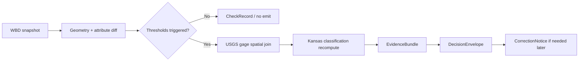

<!-- [KFM_META_BLOCK_V2]
doc_id: kfm://doc/UUID-NEEDS-VERIFICATION
title: WBD HUC-12 Watcher Pipeline
type: standard
version: v1
status: draft
owners: @bartytime4life
created: YYYY-MM-DD
updated: YYYY-MM-DD
policy_label: NEEDS VERIFICATION
related: [pipelines/wbd-huc12-watcher/README.md, pipelines/README.md, docs/domains/hydrology/wbd-huc12-watcher.md, docs/operations/emit-only-watchers/REGISTRY.md, docs/operations/emit-only-watchers/SCHEMA_STUBS.md]
tags: [kfm, hydrology, pipeline, watcher, wbd, huc12]
notes: [doc_id and dates need verification; current public main shows this lane as README-only; domain-path alignment still needs reconciliation]
[/KFM_META_BLOCK_V2] -->

# WBD HUC-12 Watcher Pipeline

Verification-first lane README for the hydrology watcher that detects meaningful WBD HUC-12 change, links affected USGS gages, and carries evidence into finite watcher outputs.

> **Status:** experimental lane · draft README revision  
> **Owners:** `@bartytime4life` *(global fallback via `.github/CODEOWNERS`; narrower lane ownership needs verification)*  
>      
> **Quick jumps:** [Scope](#scope) · [Repo fit](#repo-fit) · [Inputs](#inputs) · [Exclusions](#exclusions) · [Directory tree](#directory-tree) · [Quickstart](#quickstart) · [Usage](#usage) · [Diagram](#diagram) · [Current lane map](#current-lane-map) · [Task list](#task-list--lane-graduation-gates) · [FAQ](#faq)  
> **Repo fit:** `pipelines/wbd-huc12-watcher/README.md` · upstream [pipeline family index](../README.md) · upstream [domain spec](../../docs/domains/hydrology/wbd-huc12-watcher.md) · watcher registry [REGISTRY](../../docs/operations/emit-only-watchers/REGISTRY.md) · schema stubs [SCHEMA_STUBS](../../docs/operations/emit-only-watchers/SCHEMA_STUBS.md) · gatehouse clues [../../.github/watchers/README.md](../../.github/watchers/README.md) / [../../.github/workflows/README.md](../../.github/workflows/README.md)  
> **Accepted here:** lane-local purpose, public-tree truth boundary, current lane inventory, watcher proof expectations, and branch-first inspection guidance  
> **Not here:** unverified runtime certainty, canonical policy meaning, full schema ownership, or live API/catalog claims not surfaced on the branch

> [!IMPORTANT]
> Current public `main` proves that this lane exists and that the visible checked-in inventory for `pipelines/wbd-huc12-watcher/` is `README.md`. It does **not** yet prove that `watcher.yaml`, `src/`, `tests/`, workflow YAMLs, catalog writers, or API routes are checked in.

> [!NOTE]
> The hydrology domain spec is the richer authority for thresholds, data shapes, and Kansas classification logic. This README stays lane-local: it should tell readers what public `main` proves, what the lane is for, and which implementation details still remain **PROPOSED**.

> [!CAUTION]
> The domain spec currently names a **different proposed pipeline path** (`pipelines/wbd-watcher/`) than the visible public lane path (`pipelines/wbd-huc12-watcher/`). Reconcile that path drift before adding code, CI references, or release-bearing links.

---

## Scope

`pipelines/wbd-huc12-watcher/` is the lane-local execution surface for a watcher-oriented hydrology slice in KFM.

Use this README to:

- understand the watcher’s intended role in the repo
- distinguish **CONFIRMED** public-tree evidence from **INFERRED** or **PROPOSED** runtime shape
- route implementers to the governing hydrology and emit-only watcher docs
- keep future implementation work aligned to emit-only, evidence-first, correction-preserving behavior

Do **not** use this README to claim that the public branch already contains a runnable watcher implementation, live workflow automation, or promoted outward API/catalog surfaces.

---

## Repo fit

| Surface | Path | Why it matters here | Status |
|---|---|---|---|
| Root posture | [`../../README.md`](../../README.md) | Defines KFM’s governed, evidence-first, map-first, time-aware identity and truth path. | **CONFIRMED** |
| Pipeline family index | [`../README.md`](../README.md) | Explains what belongs in `pipelines/` and warns against bypassing governance. | **CONFIRMED** |
| Domain authority | [`../../docs/domains/hydrology/wbd-huc12-watcher.md`](../../docs/domains/hydrology/wbd-huc12-watcher.md) | Carries the richer hydrology logic, diff model, classification rule set, and proposed outward shape. | **CONFIRMED** doc |
| Watcher registry | [`../../docs/operations/emit-only-watchers/REGISTRY.md`](../../docs/operations/emit-only-watchers/REGISTRY.md) | Describes the proposed dataset / threshold / policy / snapshot registry model for emit-only watchers. | **CONFIRMED** doc, **PROPOSED** runtime surface |
| Schema stubs | [`../../docs/operations/emit-only-watchers/SCHEMA_STUBS.md`](../../docs/operations/emit-only-watchers/SCHEMA_STUBS.md) | Defines the proposed watcher contract set, including `CheckRecord`, `EvidenceBundle`, `DecisionEnvelope`, and `CorrectionNotice`. | **CONFIRMED** doc, **PROPOSED** real schema files |
| Workflow lane | [`../../.github/workflows/README.md`](../../.github/workflows/README.md) | Keeps workflow certainty honest and documents the current README-only workflow lane. | **CONFIRMED** docs-only surface |
| Watcher gatehouse lane | [`../../.github/watchers/README.md`](../../.github/watchers/README.md) | Preserves emit-only watcher posture and current public inventory rules. | **CONFIRMED** docs-only surface |

---

## Inputs

### Runtime / source inputs

| Input | Role in this lane | Status |
|---|---|---|
| WBD HUC-12 snapshots (USGS TNM) | Authoritative watershed boundary subject under watch. | **CONFIRMED** in lane and domain docs |
| USGS streamgage index | Impact join target for affected gages. | **CONFIRMED** in lane and domain docs |
| NWIS daily flow | Classification input for perennial / ephemeral recomputation. | **CONFIRMED** in lane and domain docs |
| Optional NHD / NHDPlus flowlines | Optional hydro-network context. | **CONFIRMED** in domain doc as optional |

### Lane-local contents that belong here

- a lane README that states purpose, boundaries, and proof posture
- deterministic diff, join, classification, validation, and emit helpers
- lane-local fixtures, thresholds, smoke tests, and receipt emitters
- starter configs or orchestrator shims **only when they are actually checked in on the branch**
- lane-local notes about correction, rollback, or catalog closure **only when tied to real artifacts**

---

## Exclusions

| Exclusion | Why it does not belong here as settled fact | Where it belongs instead |
|---|---|---|
| Silent geometry override or uncited hydrologic truth | Violates WBD authority and KFM’s evidence-first posture. | Nowhere |
| Repository-wide contract ownership | This lane may use contracts, but it should not quietly become their sovereign home. | `../../contracts/`, `../../schemas/`, `../../policy/` |
| Unverified runtime commands, file trees, or API certainty | Public `main` does not prove those surfaces yet. | Add them only after exact-branch verification |
| Public shell / route behavior | This README is lane-local, not the public product shell. | `../../apps/`, `../../docs/` |
| Free-form watcher policy meaning | Watcher doctrine may live near this lane, but canonical policy remains separate. | `../../policy/` and watcher ops docs |

---

## Directory tree

### Current public-main snapshot

```text
pipelines/
└── wbd-huc12-watcher/
    └── README.md
```

### Proposed starter tree for later implementation

<details>
<summary><strong>Show PROPOSED starter tree</strong></summary>

```text
pipelines/wbd-huc12-watcher/
├── README.md
├── watcher.yaml
├── src/
│   └── wbd_huc12_watcher/
│       ├── runner.py
│       ├── ingest/
│       ├── diff/
│       ├── joins/
│       ├── classify/
│       └── evidence/
└── tests/
```

This tree is a **starter shape**, not current public-main proof. Only promote these paths from **PROPOSED** to **CONFIRMED** when they are visible on the exact branch under review.

</details>

---

## Quickstart

There is no verified runnable CLI quickstart on current public `main`. The safe quickstart today is **inspection-first**.

```bash
# From repo root, inspect the lane and its governing neighbors
sed -n '1,260p' pipelines/README.md
sed -n '1,260p' pipelines/wbd-huc12-watcher/README.md
sed -n '1,320p' docs/domains/hydrology/wbd-huc12-watcher.md
sed -n '1,240p' docs/operations/emit-only-watchers/REGISTRY.md
sed -n '1,320p' docs/operations/emit-only-watchers/SCHEMA_STUBS.md
```

```bash
# Verify what the working branch actually contains
find pipelines/wbd-huc12-watcher -maxdepth 3 -type f | sort
```

```bash
# Reconcile path drift before keeping any hard-coded references
grep -R "pipelines/wbd-watcher\|pipelines/wbd-huc12-watcher" -n docs pipelines
```

> [!CAUTION]
> Do not keep `pip install -e .`, `python -m ...`, or `watcher.yaml` examples in this README unless the exact branch contains the files and entrypoints they refer to.

---

## Usage

When you touch this lane:

1. verify the exact branch tree first; local branch evidence outranks public `main`
2. keep the **current lane map** honest before adding new implementation detail
3. route thresholds, data shapes, and classification rules back to the domain spec instead of duplicating them inconsistently
4. surface proof objects before widening claims about automation, publication, or API exposure
5. preserve the emit-only posture: no silent mutation, no evidence-free outward claim, no hidden supersession

A good edit makes the lane **more trustworthy**, not merely more detailed.

---

## Diagram



---

## Current lane map

### Current public state

| Surface | What public `main` proves | Reading posture |
|---|---|---|
| `pipelines/wbd-huc12-watcher/` | The lane directory exists and visibly contains `README.md` only. | **CONFIRMED** |
| `pipelines/wbd-huc12-watcher/README.md` | The current README names the watcher purpose, inputs, exclusions, and a richer internal tree / quickstart than the visible lane directory proves. | **CONFIRMED** doc |
| `docs/domains/hydrology/wbd-huc12-watcher.md` | The domain spec exists and carries the richer data model, diff rules, classification thresholds, trust rules, and task list. | **CONFIRMED** doc |
| Path alignment | The domain spec still names proposed pipeline path `pipelines/wbd-watcher/`, while the visible public lane path is `pipelines/wbd-huc12-watcher/`. | **NEEDS VERIFICATION** |
| `docs/operations/emit-only-watchers/REGISTRY.md` | A watcher registry model is documented for datasets, thresholds, policies, and snapshots. | **CONFIRMED** doc / **PROPOSED** runtime config |
| `docs/operations/emit-only-watchers/SCHEMA_STUBS.md` | Proposed watcher contract shapes exist for `CheckRecord`, `ThresholdEvaluation`, `EvidenceRef`, `EvidenceBundle`, `DecisionEnvelope`, and `CorrectionNotice`. | **CONFIRMED** doc / **PROPOSED** real schemas |
| `.github/watchers/` and `.github/workflows/` | Both lanes are documented, and current public `main` shows them as README-only surfaces rather than checked-in watcher jobs or workflow YAMLs. | **CONFIRMED** docs-only |
| `watcher.yaml`, `src/`, `tests/`, publish code, live API routes | These are not surfaced in the current public lane tree. | **UNKNOWN** on public `main` / **PROPOSED** starter shape |

### Authority-carried execution model

> [!NOTE]
> The table below is intentionally split from the public-tree state. These items are carried by the hydrology domain spec and watcher contract docs, but they are not yet proven as checked-in runtime code inside this lane.

| Concern | Authority source | Current reading |
|---|---|---|
| HUC baseline record (`huc12`, `spec_hash`, `product_version`, `last_modified`, `geom_hash`, `attrs_hash`) | domain spec | **PROPOSED** runtime object |
| Change event with `affected_gages`, `classification_update`, and finite `outcome` | domain spec | **PROPOSED** runtime object |
| Geometry diff rules: area change, centroid shift, topology change, and watched attributes | domain spec | **PROPOSED** threshold / diff logic |
| Kansas flow-persistence classification (`median daily flow`, `zero-flow days`, `monthly persistence`) | domain spec | **PROPOSED** lane rule set |
| Finite outcomes `ANSWER`, `ABSTAIN`, `DENY`, `ERROR` | watcher schema stubs | **PROPOSED** contract invariant |
| Visible correction lineage via `CorrectionNotice` | watcher schema stubs | **PROPOSED** correction contract |

### Watcher proof objects

> [!NOTE]
> These come from `SCHEMA_STUBS.md`, not from checked-in JSON Schema files in this lane.

| Proof object | Why this lane eventually needs it | Status |
|---|---|---|
| `CheckRecord` | Keeps no-change or routine checks visible instead of silently disappearing. | **PROPOSED** |
| `ThresholdEvaluation` | Makes trigger logic machine-checkable when meaningful change is detected. | **PROPOSED** |
| `EvidenceRef` | Gives consequential decisions a stable machine-resolvable pointer. | **PROPOSED** |
| `EvidenceBundle` | Packages the consequential proof payload for emitted hydrologic claims. | **PROPOSED** |
| `DecisionEnvelope` | Keeps watcher outcomes finite, auditable, and downstream-consumable. | **PROPOSED** |
| `CorrectionNotice` | Preserves lineage if a later run narrows, withdraws, or replaces a prior decision. | **PROPOSED** |

---

## Task list / lane graduation gates

- [ ] Reconcile the path mismatch between `pipelines/wbd-watcher/` in the domain spec and `pipelines/wbd-huc12-watcher/` in the public lane tree.
- [ ] Verify the exact branch tree and update this README from branch evidence before claiming any runnable files.
- [ ] Surface a real lane-local config or entrypoint only when it is checked in.
- [ ] Check in deterministic geometry-hash and attribute-diff fixtures.
- [ ] Prove threshold evaluation and Kansas classification reproducibility with tests.
- [ ] Surface sample or real `CheckRecord`, `ThresholdEvaluation`, `EvidenceBundle`, `DecisionEnvelope`, and `CorrectionNotice` artifacts or schemas.
- [ ] Add source-intake receipts / validation docs for WBD, streamgage, and NWIS inputs.
- [ ] Document catalog/API surfaces only when the lane actually emits outward artifacts.

---

## FAQ

### What is actually confirmed today?

The lane directory, the lane README, the hydrology domain spec, the watcher registry docs, the watcher schema-stub docs, and docs-only watcher / workflow gatehouse lanes are all visible on current public `main`.

### Why is the starter tree still shown?

Because it is useful design intent already carried by the current README, but the visible lane directory does not prove those files are checked in yet. Keeping it under a proposed section preserves the idea without overstating reality.

### Which path is canonical right now?

For current public-tree inventory, the visible lane path is `pipelines/wbd-huc12-watcher/`. The domain doc still names `pipelines/wbd-watcher/` as a proposed pipeline path. Treat that mismatch as a real reconciliation task, not as a harmless naming detail.

### When does quickstart become runnable?

When the exact branch under review surfaces real lane-local files, tests, schemas, or receipts. At that point, promote commands and paths from **PROPOSED** to **CONFIRMED** and tighten this README accordingly.

---

## Appendix

<details>
<summary><strong>Authority-carried data model reference</strong></summary>

### HUC baseline record

```json
{
  "huc12": "string",
  "spec_hash": "string",
  "product_version": "string",
  "last_modified": "timestamp",
  "geom_hash": "string",
  "attrs_hash": "string"
}
```

### Change event / decision surface

```json
{
  "event_id": "uuid",
  "huc12": "string",
  "detected_at": "timestamp",
  "deltas": {
    "area_pct": "number",
    "centroid_shift_m": "number",
    "topology_changed": "boolean",
    "attrs_changed": ["string"]
  },
  "thresholds_triggered": ["string"],
  "evidence_refs": [
    { "product": "WBD", "version": "string", "id": "string" }
  ],
  "affected_gages": [
    {
      "site_no": "string",
      "name": "string",
      "nwis_url": "string"
    }
  ],
  "classification_update": {
    "previous": "PERENNIAL|EPHEMERAL",
    "new": "PERENNIAL|EPHEMERAL",
    "confidence": "number"
  },
  "outcome": "ANSWER|ABSTAIN|DENY|ERROR"
}
```

</details>

<details>
<summary><strong>Illustrative <code>watcher.yaml</code> carried forward from the current README</strong></summary>

This is preserved as an **illustrative example**, not as current public-main proof that `watcher.yaml` exists in this lane.

```yaml
dataset: wbd_huc12

source:
  type: usgs_tnm
  product: wbd

thresholds:
  area_pct: 0.1
  centroid_shift_m: 25
  topology_change: true

classification:
  zero_flow_pct_max: 5
  min_active_months: 8

outputs:
  event_store: data/catalog/hydrology/events/
  baseline_store: data/catalog/hydrology/baselines/
```

</details>

<details>
<summary><strong>Authority-carried change rules and Kansas classification sketch</strong></summary>

### Geometry / attribute diff triggers

- area change above threshold
- centroid shift above threshold
- topology changed
- watched attributes changed (`NAME`, `HUType`, parent linkage)

### Kansas classification sketch

```text
IF median daily flow > 0
AND zero-flow days <= 5%
AND monthly persistence >= 8 active months
THEN PERENNIAL
ELSE EPHEMERAL
```

### Trace rule

```text
Snapshot -> Diff -> ThresholdEvaluation -> EvidenceBundle -> DecisionEnvelope -> CorrectionNotice (if needed later)
```

</details>

<p align="right"><a href="#wbd-huc-12-watcher-pipeline">Back to top ↑</a></p>
