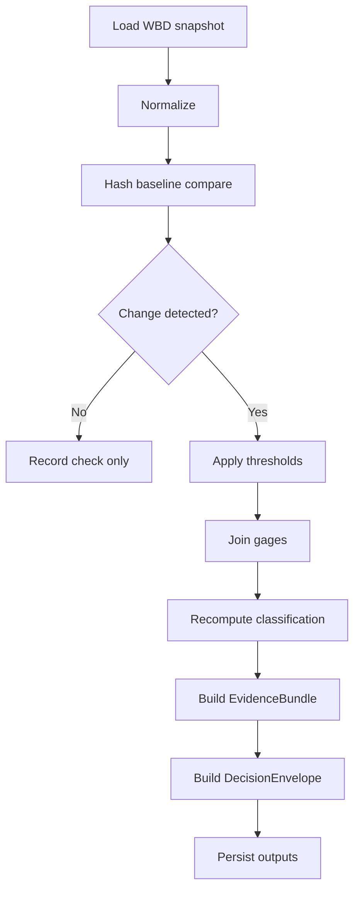

<!--
doc_id: KFM-HYDRO-WBD-WATCHER-PIPELINE
title: WBD HUC-12 Watcher Pipeline
type: standard
version: v1
status: draft
owners: [@bartytime4life]  # NEEDS VERIFICATION
created: 2026-04-02
updated: 2026-04-02
policy_label: restricted
related:
  - docs/domains/hydrology/wbd-huc12-watcher.md
  - docs/governance/ROOT_GOVERNANCE.md
  - docs/operations/emit-only-watchers/REGISTRY.md
  - docs/operations/emit-only-watchers/SCHEMA_STUBS.md
tags: [kfm, hydrology, pipeline, watcher, wbd, huc12]
notes:
  - Pipeline path is PROPOSED until verified in repo
-->

# 🌊 WBD HUC-12 Watcher Pipeline

**Purpose:** Runtime pipeline that detects meaningful WBD HUC-12 changes and emits evidence-backed hydrologic impact events.

---

## 🚦 Status

| Field | Value |
|------|------|
| Status | 🧪 draft |
| Owners | @bartytime4life *(NEEDS VERIFICATION)* |
| Runtime Path | `pipelines/wbd-huc12-watcher/` *(PROPOSED)* |
| Trust Mode | Emit-only / Evidence-first |

---

## ⚡ Quick Navigation

- [Scope](#scope)
- [Repo Fit](#repo-fit)
- [Inputs](#inputs)
- [Exclusions](#exclusions)
- [Directory Structure](#directory-structure)
- [Quickstart](#quickstart)
- [Execution Flow](#execution-flow)
- [Configuration](#configuration)
- [Outputs](#outputs)
- [Trust & Governance](#trust--governance)
- [Definition of Done](#definition-of-done)

---

# 📌 Scope

This pipeline:

- Watches **WBD HUC-12 snapshots**
- Detects **geometry + attribute changes**
- Applies **threshold gating**
- Joins **USGS gages to impacted HUCs**
- Recomputes **Kansas perennial vs ephemeral classification**
- Emits:
  - EvidenceBundle
  - DecisionEnvelope

---

# 🔗 Repo Fit

| Layer | Path | Role |
|------|------|------|
| Domain Spec | `docs/domains/hydrology/wbd-huc12-watcher.md` | Authority + rules |
| Pipeline | `pipelines/wbd-huc12-watcher/` | Runtime execution |
| Catalog | `data/catalog/hydrology/` *(PROPOSED)* | Evidence persistence |
| API | `services/hydrology-api/` *(PROPOSED)* | External access |

---

# 📥 Inputs

| Source | Type |
|-------|------|
| WBD snapshot | Polygon dataset |
| USGS gage index | Point dataset |
| NWIS daily flow | Time series |

---

# 🚫 Exclusions

- No silent updates
- No direct geometry overrides
- No derived truth replacing authoritative WBD
- No emit without threshold trigger

---

# 📂 Directory Structure

```text
pipelines/wbd-huc12-watcher/
├── README.md
├── watcher.yaml
├── src/
│   └── wbd_huc12_watcher/
│       ├── runner.py
│       ├── ingest/
│       ├── diff/
│       ├── joins/
│       ├── classify/
│       └── evidence/
└── tests/
```

---

# ⚙️ Quickstart

```bash
# install deps (PROPOSED)
pip install -e .

# run watcher
python -m wbd_huc12_watcher.cli run --config watcher.yaml
```

---

# 🔄 Execution Flow



---

# ⚙️ Configuration

## `watcher.yaml` (example)

```yaml
dataset: wbd_huc12

source:
  type: usgs_tnm
  product: wbd

thresholds:
  area_pct: 0.1
  centroid_shift_m: 25
  topology_change: true

classification:
  zero_flow_pct_max: 5
  min_active_months: 8

outputs:
  event_store: data/catalog/hydrology/events/
  baseline_store: data/catalog/hydrology/baselines/
```

---

# 📦 Outputs

## 1. Change Event

- HUC-12 ID
- delta metrics
- affected gages
- classification update
- outcome (ANSWER / ABSTAIN / ERROR)

## 2. EvidenceBundle

- snapshot references
- diff metrics
- classification inputs
- lineage

---

# 🧠 Core Logic

```python
def run():
    snapshot = load_wbd()
    baseline = load_baseline()

    delta = diff(snapshot, baseline)

    if not triggers(delta):
        return no_emit()

    gages = join_gages(snapshot)
    classification = classify(snapshot, gages)

    evidence = build_evidence(snapshot, delta, classification)
    decision = build_decision(delta, evidence)

    persist(evidence, decision)
```

---

# 🔐 Trust & Governance

## Truth Labels

| Label | Meaning |
|------|--------|
| CONFIRMED | Source datasets |
| INFERRED | Classification outputs |
| PROPOSED | Thresholds + pipeline design |
| NEEDS VERIFICATION | Paths / owners |

---

## Rules

- Emit-only behavior (no silent mutation)
- Evidence required for every event
- Finite outcomes enforced:
  - ANSWER
  - ABSTAIN
  - DENY
  - ERROR

---

# 🧪 Tests

Minimum required:

- deterministic geometry hash
- geometry diff correctness
- attribute diff correctness
- no-change → no emit
- change → emit
- classification reproducibility

---

# ✅ Definition of Done

- [ ] Pipeline executes end-to-end
- [ ] Deterministic diffs validated
- [ ] EvidenceBundle emitted
- [ ] DecisionEnvelope emitted
- [ ] No false-positive events
- [ ] No silent updates
- [ ] Reproducible classification

---

# 📎 Notes

- Pipeline is subordinate to domain spec
- Domain spec defines truth — pipeline enforces it
- All outputs must be traceable

---

⬆️ Back to top
