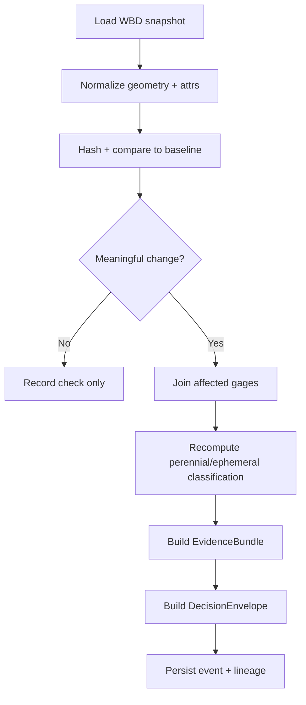

<!--
doc_id: NEEDS VERIFICATION
title: Proposed Pipeline Folder — WBD HUC-12 Watcher
type: standard
version: v1
status: draft
owners: [@bartytime4life, NEEDS VERIFICATION]
created: 2026-04-02
updated: 2026-04-02
policy_label: restricted
related:
  - docs/domains/hydrology/wbd-huc12-watcher.md
  - docs/operations/emit-only-watchers/README.md
  - docs/operations/emit-only-watchers/REGISTRY.md
  - docs/operations/emit-only-watchers/SCHEMA_STUBS.md
  - docs/operations/emit-only-watchers/NEXT_STEPS.md
notes:
  - Runtime paths below are PROPOSED.
  - Exact schema/contract homes remain NEEDS VERIFICATION.
-->

# Proposed pipeline folder

**Recommended path:** `pipelines/wbd-huc12-watcher/`

This keeps the runtime shape short, dataset-specific, and aligned with the watcher framing already present in `docs/operations/emit-only-watchers/`, where registry, contract stubs, and implementation sequencing are already being defined as watcher-oriented governance material. The watcher docs explicitly describe registry inputs, EvidenceBundle outputs, DecisionEnvelope records, and correction lineage as the expected operational substrate rather than direct public publication. :contentReference[oaicite:0]{index=0} :contentReference[oaicite:1]{index=1}

---

## Directory tree

```text
pipelines/
└── wbd-huc12-watcher/
    ├── README.md
    ├── pyproject.toml
    ├── Makefile
    ├── .env.example
    ├── watcher.yaml
    │
    ├── src/
    │   └── wbd_huc12_watcher/
    │       ├── __init__.py
    │       ├── cli.py
    │       ├── config.py
    │       ├── runner.py
    │       ├── logging.py
    │       │
    │       ├── ingest/
    │       │   ├── __init__.py
    │       │   ├── wbd_snapshot.py
    │       │   ├── gages.py
    │       │   └── nwis_daily.py
    │       │
    │       ├── normalize/
    │       │   ├── __init__.py
    │       │   ├── geometry.py
    │       │   ├── attributes.py
    │       │   └── ids.py
    │       │
    │       ├── diff/
    │       │   ├── __init__.py
    │       │   ├── geom_diff.py
    │       │   ├── attr_diff.py
    │       │   ├── thresholds.py
    │       │   └── hashes.py
    │       │
    │       ├── classify/
    │       │   ├── __init__.py
    │       │   ├── perennial_ephemeral.py
    │       │   └── metrics.py
    │       │
    │       ├── evidence/
    │       │   ├── __init__.py
    │       │   ├── bundle.py
    │       │   ├── refs.py
    │       │   ├── decision.py
    │       │   └── correction.py
    │       │
    │       ├── joins/
    │       │   ├── __init__.py
    │       │   └── gage_join.py
    │       │
    │       ├── storage/
    │       │   ├── __init__.py
    │       │   ├── baseline_store.py
    │       │   ├── snapshot_store.py
    │       │   └── event_store.py
    │       │
    │       └── schemas/
    │           ├── change_event.schema.json
    │           ├── classification_artifact.schema.json
    │           └── watcher_config.schema.json
    │
    ├── tests/
    │   ├── conftest.py
    │   ├── fixtures/
    │   │   ├── wbd/
    │   │   │   ├── unchanged/
    │   │   │   ├── geom_changed/
    │   │   │   └── attrs_changed/
    │   │   ├── nwis/
    │   │   │   ├── perennial/
    │   │   │   └── ephemeral/
    │   │   └── expected/
    │   │       ├── decision_envelopes/
    │   │       ├── evidence_bundles/
    │   │       └── classification_artifacts/
    │   ├── test_hashes.py
    │   ├── test_geom_diff.py
    │   ├── test_attr_diff.py
    │   ├── test_thresholds.py
    │   ├── test_gage_join.py
    │   ├── test_classification.py
    │   ├── test_evidence_bundle.py
    │   └── test_runner_no_emit.py
    │
    ├── data/
    │   ├── raw/              # local/dev only; do not treat as sovereign
    │   ├── work/
    │   ├── processed/
    │   └── baselines/
    │
    ├── scripts/
    │   ├── run_local.sh
    │   ├── seed_baseline.py
    │   └── replay_fixture.py
    │
    └── docs/
        ├── CONTRACTS.md
        ├── FIXTURES.md
        ├── RUNBOOK.md
        └── CHANGELOG.md
```

---

## Why this shape

### 1) It matches the watcher doctrine already visible in-repo
The current watcher planning docs separate:
- registry / dataset identity,
- threshold evaluation,
- EvidenceBundle,
- DecisionEnvelope,
- correction lineage.  

That means the runtime folder should not just be a poller with one script; it should carry explicit seams for diffing, evidence packaging, and finite outcomes. :contentReference[oaicite:2]{index=2} :contentReference[oaicite:3]{index=3}

### 2) It keeps hydrology-specific logic small and movable
The `classify/`, `joins/`, and `ingest/` modules are hydrology-lane specifics.  
The `evidence/`, `storage/`, and `schemas/` parts are generic watcher substrate that can later be copied or extracted for soils, air, or vegetation watchers. That follows the “one authoritative pilot lane first, then generalize” sequencing described in the watcher next-steps document. :contentReference[oaicite:4]{index=4}

### 3) It respects the truth path
The repo doctrine repeatedly treats source-edge → RAW → WORK/QUARANTINE → PROCESSED → CATALOG → PUBLISHED as the governing lifecycle, and warns against letting derived layers silently become sovereign truth. The `data/` and `storage/` split above is meant to preserve that posture instead of collapsing fetch, baseline, and publication into one opaque runtime cache. :contentReference[oaicite:5]{index=5} :contentReference[oaicite:6]{index=6}

---

## Minimum file contents to create first

### `README.md`
Use this as the runtime-facing entrypoint:
- title
- one-line purpose
- repo fit
- accepted inputs
- exclusions
- directory tree
- quickstart
- one mermaid control-flow diagram
- trust notes

### `watcher.yaml`
Keep this as the human-editable runtime config:
- dataset id
- source locator
- threshold values
- authority class
- policy class
- Kansas classifier settings
- output store locations

### `src/wbd_huc12_watcher/runner.py`
Single orchestration path:
1. fetch or load WBD snapshot
2. load accepted baseline
3. normalize + hash
4. diff
5. threshold gate
6. join gages
7. recompute classification
8. build evidence bundle
9. build decision envelope
10. persist immutable outputs

### `tests/fixtures/`
Start here before expanding runtime complexity:
- unchanged WBD fixture
- geometry-changed fixture
- attribute-changed fixture
- perennial flow fixture
- ephemeral flow fixture

---

## Recommended first-create subset

If you do **not** want to create the whole tree yet, create this thinner slice first:

```text
pipelines/wbd-huc12-watcher/
├── README.md
├── watcher.yaml
├── src/wbd_huc12_watcher/
│   ├── cli.py
│   ├── runner.py
│   ├── ingest/wbd_snapshot.py
│   ├── diff/geom_diff.py
│   ├── diff/attr_diff.py
│   ├── diff/hashes.py
│   ├── joins/gage_join.py
│   ├── classify/perennial_ephemeral.py
│   └── evidence/bundle.py
└── tests/
    ├── fixtures/
    ├── test_geom_diff.py
    ├── test_classification.py
    └── test_runner_no_emit.py
```

That is the best first thin slice because it proves:
- deterministic diffs,
- emit-vs-no-emit behavior,
- evidence packaging,
- Kansas hydrology-specific recomputation.

---

## Naming notes

### Folder name
**Use:** `wbd-huc12-watcher`

### Python package name
**Use:** `wbd_huc12_watcher`

### Config file
**Use:** `watcher.yaml`

These keep path names human-readable while preserving Python import safety.

---

## Example control flow



---

## Recommended adjacent doc link

Add this line to `docs/domains/hydrology/wbd-huc12-watcher.md`:

```md
**Implementation path (PROPOSED):** `pipelines/wbd-huc12-watcher/`
```

And add this line to the pipeline `README.md`:

```md
**Domain specification:** `docs/domains/hydrology/wbd-huc12-watcher.md`
```

---

## Definition of done for folder creation

- [ ] folder exists at `pipelines/wbd-huc12-watcher/`
- [ ] runtime `README.md` exists
- [ ] config stub exists
- [ ] one runner entrypoint exists
- [ ] deterministic hash tests exist
- [ ] no-emit fixture test exists
- [ ] one emitted EvidenceBundle example exists
- [ ] one emitted DecisionEnvelope example exists
- [ ] all path claims remain marked `PROPOSED` or `NEEDS VERIFICATION` until live-verified
