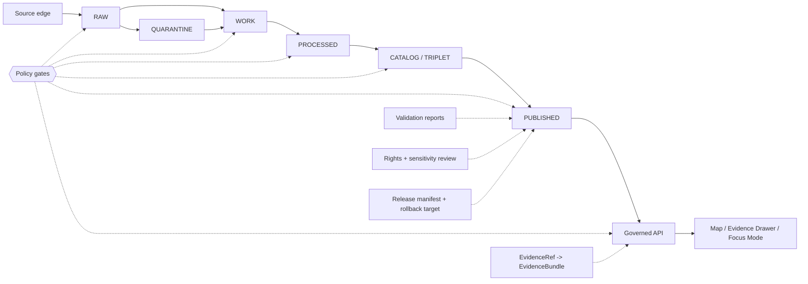

<!-- [KFM_META_BLOCK_V2]
doc_id: kfm://doc/NEEDS-VERIFICATION
title: Policies
type: standard
version: v1
status: draft
owners: OWNER_TBD_AFTER_REPO_INSPECTION
created: NEEDS_VERIFICATION_DATE_ON_COMMIT
updated: NEEDS_VERIFICATION_DATE_ON_COMMIT
policy_label: NEEDS_VERIFICATION_POLICY_LABEL
related: [NEEDS_VERIFICATION_RELATED_LINKS]
tags: [kfm, policies, governance, evidence, promotion, sensitivity]
notes: [Target path requested as policies/README.md; repo implementation depth UNKNOWN; prior KFM lineage often uses policy/ as the policy home; resolve path authority before creating parallel homes.]
[/KFM_META_BLOCK_V2] -->

# Policies

Policy rules, gates, and review obligations for KFM’s evidence-first publication lifecycle.

> [!IMPORTANT]
> **Status:** experimental / NEEDS VERIFICATION  
> **Owners:** OWNER_TBD_AFTER_REPO_INSPECTION  
> **Path:** `policies/README.md`  
> **Truth posture:** CONFIRMED doctrine / PROPOSED directory placement / UNKNOWN repo implementation depth  
>
> 
> 
> 
> 
>
> **Quick jumps:** [Scope](#scope) · [Repo fit](#repo-fit) · [Inputs](#accepted-inputs) · [Exclusions](#exclusions) · [Policy gates](#policy-gates) · [Validation](#validation) · [Rollback](#rollback) · [Verification backlog](#verification-backlog)

> [!NOTE]
> This README states KFM policy doctrine where supported by the project corpus. Current repository implementation depth remains **UNKNOWN** until a mounted checkout, tests, workflows, policy engine, emitted artifacts, dashboards, runtime logs, and branch protections are inspected.

## Scope

This directory is the proposed home for policy material that controls whether a KFM claim, artifact, source, runtime response, map surface, export, or release candidate may proceed.

KFM policy is not decorative guidance. It is the decision layer that keeps the trust membrane intact:

```text
RAW -> WORK / QUARANTINE -> PROCESSED -> CATALOG / TRIPLET -> PUBLISHED
```

Policy decisions should protect:

- Evidence resolution before consequential claims.
- Rights, source-role, and sensitivity constraints.
- Promotion as a governed state transition.
- Public clients and UI surfaces behind governed APIs.
- Cite-or-abstain behavior.
- Fail-closed handling for sensitive, unsupported, rights-uncertain, or policy-blocked outputs.
- Correction, withdrawal, rollback, and supersession lineage.

## Repo fit

**Target path:** `policies/README.md`  
**Placement status:** PROPOSED because the target path was requested, but repo topology was not verified in this session.

> [!WARNING]
> **Path authority needs verification.** Prior KFM lineage often uses `policy/` as the policy home. The requested path is `policies/README.md`. Do not keep both `policy/` and `policies/` as competing authorities. If the mounted repo already uses `policy/`, either adapt this README to `policy/README.md` or record an ADR before creating a plural `policies/` directory.

### Upstream and downstream links

| Link target | Relationship | Status |
| --- | --- | --- |
| `../docs/README.md` | Upstream documentation landing and authority register | NEEDS VERIFICATION |
| `../contracts/README.md` | Human semantic object definitions | NEEDS VERIFICATION |
| `../schemas/README.md` | Machine-checkable object shapes | NEEDS VERIFICATION |
| `../tests/fixtures/README.md` | Valid/invalid policy fixtures and regression examples | NEEDS VERIFICATION |
| `../data/receipts/` | Emitted process-memory instances, not policy definitions | NEEDS VERIFICATION |
| `../data/proofs/` | Emitted proof objects, not policy definitions | NEEDS VERIFICATION |
| `../release/` | Release candidates, manifests, and rollback targets | NEEDS VERIFICATION |

## Accepted inputs

This directory may hold policy material when the mounted repo confirms this path as the policy home.

| Input | Belongs here when | Required posture |
| --- | --- | --- |
| Policy docs | They define release/runtime admissibility, obligations, denial logic, rights, sensitivity, or promotion requirements | Normative policy |
| Policy-as-code modules | The repo convention assigns executable policy rules here | Executable policy / NEEDS VERIFICATION |
| Policy fixtures | They demonstrate allow, abstain, deny, quarantine, redact, generalize, or error outcomes | Validation support |
| Policy test notes | They define expected negative paths and fail-closed behavior | Verification support |
| Policy decision registers | They track rule families, owners, reviewer burden, and supersession | Governance/control |
| Policy-linked runbook notes | They explain how a reviewer applies a gate without redefining the gate | Operational support |

## Exclusions

| Do not put here | Why | Prefer |
| --- | --- | --- |
| RAW, WORK, or QUARANTINE data | Policy docs must not become data storage | `../data/` lifecycle homes after repo verification |
| EvidenceBundle instances | Evidence instances are emitted or resolved objects, not policy definitions | `../data/` or verified evidence artifact home |
| Receipts, proof packs, release manifests | Emitted artifacts are separate object families | `../data/receipts/`, `../data/proofs/`, `../release/` after verification |
| Contract semantics | Contracts own object meaning and lifecycle semantics | `../contracts/` |
| JSON Schemas or executable shape only | Schemas own machine-checkable structure | `../schemas/` |
| UI-only policy decisions | UI may display policy state but must not be the enforcement authority | Governed API + backend policy engine |
| Model prompts or raw model output | AI is interpretive and evidence-subordinate | Verified prompt/runtime home with policy checks |
| Secrets, tokens, credentials, or source keys | Policy docs must not store secrets | Secret manager / deployment config, never plaintext repo docs |
| Exact sensitive locations or protected records | Public policy docs should not expose sensitive details | Restricted review records, generalized outputs, or quarantine |
| Emergency, legal, medical, financial, or title advice | KFM can cite official sources or abstain; it must not become an authority for high-stakes instructions | Governed public guidance with official-source links and DENY/ABSTAIN rules |

## Directory tree

PROPOSED shape only. Confirm actual repo convention before creating files.

```text
policies/
├── README.md
├── POLICY_INDEX.md
├── source-activation.md
├── rights-and-sensitivity.md
├── evidence-and-citation.md
├── promotion-and-release.md
├── public-ui-access.md
├── ai-runtime.md
├── correction-and-rollback.md
├── security-and-exposure.md
├── fixtures/
│   └── README.md
└── tests/
    └── README.md
```

### File responsibilities

| File | Purpose | Status |
| --- | --- | --- |
| `POLICY_INDEX.md` | Register policy families, owners, review burden, and supersession state | PROPOSED |
| `source-activation.md` | Define minimum checks before a source can affect KFM outputs | PROPOSED |
| `rights-and-sensitivity.md` | Define rights, sovereignty, cultural, ecological, archaeological, living-person, DNA, land/title, and geoprivacy controls | PROPOSED |
| `evidence-and-citation.md` | Define cite-or-abstain, EvidenceRef resolution, and claim support requirements | PROPOSED |
| `promotion-and-release.md` | Define promotion gates from processed candidate to published artifact | PROPOSED |
| `public-ui-access.md` | Define what public clients may see and what governed API boundaries must hold | PROPOSED |
| `ai-runtime.md` | Define model-runtime admissibility, finite outcomes, citation validation, and no-direct-client-model rules | PROPOSED |
| `correction-and-rollback.md` | Define correction, supersession, withdrawal, rollback target, and notice requirements | PROPOSED |
| `security-and-exposure.md` | Define deny-by-default local exposure, reverse proxy/VPN, audit, and least-privilege posture | PROPOSED |
| `fixtures/README.md` | Explain valid and invalid policy examples | PROPOSED |
| `tests/README.md` | Explain policy test expectations and negative-path coverage | PROPOSED |

## Policy gates

Policy should appear at every consequential boundary. A passed visual render is not a passed release.



### Gate matrix

| Gate | Required inputs | Pass means | Fail-safe outcome |
| --- | --- | --- | --- |
| Source activation | Source role, rights, terms, cadence, sensitivity, access method, steward/reviewer | Source may enter governed lifecycle | DENY or QUARANTINE |
| Ingest boundary | Source descriptor, source identity, retrieval receipt, initial validation | Candidate can move into WORK | QUARANTINE or ERROR |
| Evidence closure | EvidenceRef, EvidenceBundle, source role, scope, time basis, policy labels | Claim has inspectable support | ABSTAIN or ERROR |
| Sensitivity review | Rights, sensitivity class, location precision, living-person and steward constraints | Public-safe release class selected | DENY, REDACT, GENERALIZE, or QUARANTINE |
| Promotion | Validation report, catalog/provenance closure, review state, release manifest, rollback target | Candidate can become PUBLISHED | DENY |
| Public API | Released artifact, policy decision, EvidenceBundle resolution, review state | Governed response may be emitted | ABSTAIN, DENY, or ERROR |
| UI rendering | Governed API payload, policy label, source role, review state, correction state | UI may render trust-visible state | Empty state, ABSTAIN, DENY, or ERROR |
| AI runtime | Released policy-safe context, citations, response envelope, audit reference | Model may assist with bounded synthesis | ABSTAIN, DENY, or ERROR |
| Correction / rollback | Target object, correction notice, supersession rule, rollback target | Correction path is inspectable | DENY until lineage is complete |

## Policy outcomes

| Outcome | Meaning | Use when |
| --- | --- | --- |
| `ALLOW` | A bounded action may proceed under stated scope | Evidence, rights, sensitivity, review, validation, and release requirements are satisfied |
| `ABSTAIN` | KFM cannot make or publish the claim | Evidence is missing, ambiguous, conflicted, stale, or insufficient |
| `DENY` | Policy blocks the action | Rights, sensitivity, review, release scope, safety, or access rules prohibit it |
| `QUARANTINE` | Candidate material is held away from normal processing or public release | Source identity, integrity, rights, sensitivity, or validation is unresolved |
| `REDACT` | Public output may proceed only after removal of disallowed detail | Specific fields, geometry, identity, source details, or exact locations are unsafe |
| `GENERALIZE` | Public output may proceed only at lower precision or coarser scope | Exact geometry, temporal precision, or feature identity creates exposure risk |
| `ERROR` | A process failed and must not be smoothed into success | Tooling, validation, resolver, policy engine, runtime, or artifact generation failed |

## Required policy families

| Policy family | Controls | Minimum first rule |
| --- | --- | --- |
| Source activation | Whether a source may enter KFM at all | Unknown rights or source role blocks public activation |
| Rights and sensitivity | Whether material can be public, restricted, generalized, redacted, delayed, or denied | Unknown rights or unresolved sensitivity fails closed |
| Evidence and citation | Whether a claim has enough support to be stated | Consequential claims require EvidenceRef -> EvidenceBundle resolution |
| Promotion and release | Whether a candidate can become PUBLISHED | Promotion requires validation, catalog/provenance closure, review state, release manifest, and rollback target |
| Public UI access | Whether a public surface can show a layer, popup, drawer, story, scene, or export | Public clients consume governed APIs and released artifacts only |
| AI runtime | Whether a model may help answer, summarize, classify, or explain | Model runtime receives released, policy-safe context only and emits finite outcomes |
| Correction and rollback | How mistakes, supersession, withdrawal, and reversions are handled | Corrections require target, rationale, effective time, and linkage to affected artifacts |
| Security and exposure | How local or semi-public access is constrained | Deny by default; no direct public access to canonical/internal stores or model endpoints |

## Enforcement rules

1. **Policy is backend-enforced.** UI state may display policy decisions, but it must not be the only place they are enforced.
2. **Policy does not own object meaning.** Contracts own semantic object definitions; schemas own executable shape; policy owns admissibility and obligations.
3. **No direct public store access.** Public clients and normal UI surfaces use governed APIs and released artifacts.
4. **No source-role laundering.** Aggregators, model outputs, screenshots, tiles, summaries, and graph projections cannot silently become authority.
5. **No evidence-free success states.** Missing support produces ABSTAIN, DENY, QUARANTINE, or ERROR, not fluent certainty.
6. **No unreviewed sensitive precision.** Sensitive location, cultural, ecological, archaeological, living-person, DNA, land/title, and security-relevant detail fails closed unless release support is explicit.
7. **No model bypass.** AI does not read RAW, WORK, QUARANTINE, canonical/internal stores, or unpublished candidates for public-facing answers.
8. **Receipts and proofs remain separate.** Process memory, proof objects, catalog records, release manifests, review records, correction notices, and rollback targets must not collapse into one file family.

## Review burden

| Change class | Minimum reviewer burden | Why |
| --- | --- | --- |
| Policy or gate change | Policy owner + architecture reviewer | Changes runtime or release admissibility |
| Rights/sensitivity rule change | Policy owner + domain/steward reviewer | Can expose restricted or harmful detail |
| AI-runtime rule change | Policy owner + governed-AI reviewer | Can weaken cite-or-abstain or model boundary |
| Public UI access rule change | Policy owner + shell/UI reviewer | Can weaken trust visibility or bypass governed APIs |
| Promotion rule change | Policy owner + release/review steward | Can publish unsupported or insufficiently reviewed claims |
| Source activation rule change | Policy owner + source/domain steward | Can admit sources with unclear authority or terms |
| Fixture-only addition | Policy-aware reviewer | Adds regression pressure without changing policy |

## Validation

NEEDS VERIFICATION: replace these with repo-native commands after package manager, policy engine, schema home, and test framework are confirmed.

```bash
# Inspect path authority.
git status --short
find policy policies -maxdepth 3 -type f 2>/dev/null | sort

# Confirm this README does not create a parallel policy authority.
test ! -d policy || test ! -d policies || {
  echo "CONFLICTED: both policy/ and policies/ exist; resolve with ADR before merge."
  exit 1
}

# Confirm no obvious secrets were placed in policy docs.
grep -RInE '(api[_-]?key|secret|token|password|private key)' policy policies 2>/dev/null && {
  echo "WARNING: possible secret-like text found."
  exit 1
} || true
```

TODO(owner): add repo-native checks for:

- [ ] Policy schema validation.
- [ ] Policy-as-code evaluation.
- [ ] ALLOW / ABSTAIN / DENY / QUARANTINE / REDACT / GENERALIZE / ERROR fixtures.
- [ ] EvidenceRef -> EvidenceBundle failure behavior.
- [ ] Public API no-direct-store-access tests.
- [ ] UI no-direct-raw-source-call tests.
- [ ] AI no-direct-model-client tests.
- [ ] Promotion deny tests for missing rights, missing review, missing rollback target, missing catalog closure, and unresolved sensitivity.

## Maintenance checklist

- [ ] Confirm whether the canonical policy directory is `policy/` or `policies/`.
- [ ] Confirm owners and reviewer groups.
- [ ] Confirm policy engine and test runner.
- [ ] Confirm policy docs cross-link to contracts, schemas, fixtures, runbooks, receipts, proofs, release manifests, and correction notices.
- [ ] Confirm every policy has at least one passing fixture and one failing fixture.
- [ ] Confirm rights and sensitivity defaults fail closed.
- [ ] Confirm public UI surfaces use governed APIs and released artifacts only.
- [ ] Confirm AI runtime policy uses finite outcomes and citation validation.
- [ ] Confirm rollback target for policy changes.
- [ ] Update drift register when policy terminology, path homes, or object names conflict.

## Rollback

Rollback is required when this directory weakens source integrity, creates duplicate policy authority, hides uncertainty, bypasses policy gates, publishes unsupported claims, or breaks stable governance links.

Rollback target: `ROLLBACK_TARGET_TBD_AFTER_REPO_INSPECTION`

Rollback steps:

1. Revert the policy README change.
2. Remove any newly created `policies/` files if the repo canonical home is `policy/`.
3. Restore previous cross-links from docs, contracts, schemas, tests, runbooks, and release docs.
4. Record the rollback in the drift register or correction log after the appropriate home is verified.
5. Re-run policy, schema, fixture, and no-public-bypass checks.

## Verification backlog

| Item | Status | Needed evidence |
| --- | --- | --- |
| Canonical path: `policy/` vs `policies/` | CONFLICTED / NEEDS VERIFICATION | Mounted repo tree and ADR history |
| Owners | UNKNOWN | CODEOWNERS, maintainers, or governance register |
| Policy engine | UNKNOWN | Tooling, CI workflow, or policy runner config |
| Policy test runner | UNKNOWN | Test config and executed results |
| Contract/schema homes | UNKNOWN / NEEDS VERIFICATION | Repo directories, object map, ADR |
| Runtime policy enforcement | UNKNOWN | API code, middleware, tests, logs, or emitted decisions |
| Public UI enforcement | UNKNOWN | UI code, governed API traces, no-direct-source-call tests |
| AI-runtime enforcement | UNKNOWN | Adapter code, response envelope examples, citation validation tests |
| Source-rights process | UNKNOWN | Source registry, source descriptors, rights review records |
| Sensitive-location process | UNKNOWN | Redaction/generalization policy, transform receipts, steward review |
| Promotion evidence | UNKNOWN | Release manifests, proof packs, validation reports, review records |
| Rollback evidence | UNKNOWN | Rollback cards, correction notices, supersession records |

<details>
<summary>Evidence ledger for this README</summary>

| Source | Status | Supports | Limits |
| --- | --- | --- | --- |
| Current task request | CONFIRMED | Target file path `policies/README.md`; requirement to proceed safely with missing implementation evidence | Does not prove the path exists in repo |
| KFM Components Pass 24 | CONFIRMED doctrine / UNKNOWN repo implementation | Inspectable claim, artifactization, policy posture, review state, release state, correction lineage | Does not prove implementation files exist |
| KFM Pipeline Living Implementation Manual v0.3 | CONFIRMED doctrine / PROPOSED implementation | Lifecycle invariant, promotion as governed transition, policy/validation register, repo-depth boundary | Does not prove current repo topology |
| KFM Documentation Architecture materials | CONFIRMED doctrine / PROPOSED structure | Separation of contracts, schemas, policy, fixtures, emitted artifacts, canon/lineage/exploratory intake | Prior path names need repo verification |
| KFM MapLibre UI materials | CONFIRMED interface doctrine / UNKNOWN implementation | Public UI as downstream trust surface; no renderer authority | Does not prove UI components exist |
| Ollama / Governed AI materials | CONFIRMED AI doctrine / PROPOSED implementation | AI behind governed API; EvidenceBundle and policy outrank model output; finite negative outcomes | Does not prove runtime adapter exists |

</details>

[Back to top](#policies)
