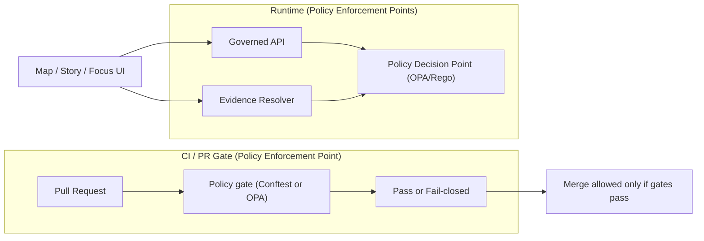

<!-- [KFM_META_BLOCK_V2]
doc_id: kfm://doc/8f4c5db9-1cc2-4a2f-b5b3-fb8c6a9a8e7d
title: policy/README.md
type: standard
version: v1
status: draft
owners: KFM Governance + Policy Stewards (TODO)
created: 2026-02-26
updated: 2026-02-26
policy_label: public
related:
  - kfm://doc/KFM-GDG-2026 (TODO: link to in-repo copy of the Governance Guide)
tags: [kfm, policy, governance, opa, rego, ci, promotion-contract]
notes:
  - Directory README for the policy bundle (CI + runtime semantics).
  - Replace <ORG>/<REPO> badge placeholders once repo metadata is known.
[/KFM_META_BLOCK_V2] -->

<a id="top"></a>

# `policy/` — Governed, fail-closed policy-as-code for KFM

**Purpose:** This directory holds the **policy bundle** (OPA/Rego or equivalent) that enforces KFM governance: **access control**, **licensing/rights**, **sensitivity/redaction**, and **promotion gates**—with the **same semantics in CI and at runtime**.


<!-- TODO(repo): Replace <ORG>/<REPO> and workflow filenames -->
<!--  -->
<!--  -->

## Quick navigation

- [What lives here](#what-lives-here)
- [Where policy sits in KFM](#where-policy-sits-in-kfm)
- [Policy decision model](#policy-decision-model)
- [Policy labels](#policy-labels)
- [Promotion Contract alignment](#promotion-contract-alignment)
- [Making changes](#making-changes)
- [Testing](#testing)
- [Directory layout](#directory-layout)
- [FAQ](#faq)

---

## What lives here

✅ **Acceptable inputs (what belongs in `policy/`)**
- **Rego policy packages** (authorization, license enforcement, sensitivity, promotion gates).
- **Fixtures** representing policy decisions: allow/deny + obligations.
- **Policy tests** (OPA unit tests; and/or Conftest policy tests).
- **Rubrics** used as policy inputs (licensing classification rubric; sensitivity rubric + generalization guidance).
- **Controlled vocabularies** referenced by policy (e.g., `policy_label`).

🚫 **Exclusions (what must NOT go in `policy/`)**
- Secrets (API keys, credentials, private tokens).
- Raw datasets / restricted artifacts (policy should reference *metadata*, not embed sensitive content).
- Ad hoc one-off exceptions without fixtures/tests (exceptions must become governed, testable policy).
- UI logic (UI may display policy outcomes, but must not decide policy).

> [!WARNING]
> If a rule cannot be tested (fixtures + tests), it is not policy—it's a suggestion. Policy must be deterministic and CI-enforced.

[Back to top](#top)

---

## Where policy sits in KFM

KFM treats policy as part of the **trust membrane**: clients never access storage directly; **governed APIs** apply policy; the UI shows badges/notices but does not decide.



**Key posture**
- CI must **block merges** when policy denies.
- Runtime must **fail closed** when policy cannot evaluate or evidence cannot be resolved.
- UI must **display** policy outcomes (labels/obligations) but **never** make authorization decisions.

[Back to top](#top)

---

## Policy decision model

A KFM policy evaluation returns:

- `decision`: `allow` or `deny` (default deny)
- `policy_label`: the label attached to the resource (dataset/story/evidence bundle)
- `obligations[]`: **required follow-up actions** (UI notices, redaction constraints, export-attribution requirements, etc.)
- (optional but recommended) `reason_codes[]`: stable identifiers for audit + debuggability

### Obligations examples

Obligations are how we keep “allowed” from becoming “unsafe”.

- `show_notice`: UI must show a banner (e.g., generalized geometry).
- `redact_fields`: evidence resolver must redact fields before returning cards.
- `force_generalization`: API must serve the `public_generalized` variant only.
- `require_attribution`: exports must include license + attribution text automatically.

> [!NOTE]
> Obligations are part of the decision and must be logged in receipts/audit trails.

[Back to top](#top)

---

## Policy labels

Policy labels are controlled vocabulary values attached to datasets, stories, and evidence bundles.

| `policy_label` | Meaning | Default posture | Typical obligations |
|---|---|---|---|
| `public` | Safe for public display/download | Allow (for public role) | attribution, rate limits |
| `public_generalized` | Public-safe *derived* representation | Allow (public) | show_notice, provenance link to redaction |
| `internal` | Visible to authenticated org users | Deny to public | audit logging, least privilege |
| `restricted` | Access limited to stewards/authorized roles | Deny by default | redact metadata from errors, strict logging |
| `restricted_sensitive_location` | Restricted + location-sensitive | Deny by default | no precise coords, generalization required |
| `embargoed` | Temporarily hidden until date/review | Deny by default | embargo timer, steward-only |
| `quarantine` | Not promotable/servable | Deny always | remediation hints for maintainers |

> [!WARNING]
> **Never leak restricted existence** via different error behavior (e.g., 404 vs 403 differences) or verbose messages.

[Back to top](#top)

---

## Promotion Contract alignment

Policy is a hard dependency of the KFM Promotion Contract:

- Promotion must be **blocked** unless required artifacts exist and validate.
- Policy contributes to: **license gate**, **sensitivity gate**, **policy tests gate**, and **evidence resolvability** checks.

### Gate map (what policy participates in)

| Promotion gate | What policy enforces (examples) |
|---|---|
| Identity & versioning | Deny promotion if `dataset_version_id` is not derived from stable `spec_hash` |
| Licensing & rights | Deny promotion if license/rights holder missing or unclear |
| Sensitivity & redaction plan | Deny promotion if restricted/sensitive lacks a recorded redaction/generalization plan |
| Catalog triplet validation | (Usually validator tool) but policy can deny if required catalog fields missing |
| Run receipt & checksums | Deny serving if receipt missing policy fields or checksums incomplete |
| Policy tests & contract tests | Deny merge/promotion if fixtures-driven tests fail, or evidence cannot resolve in CI |
| Optional production posture | Gate on SBOM/provenance/attestations, perf/accessibility smoke checks |

[Back to top](#top)

---

## Making changes

### Change rules (non-negotiable)

- **No silent changes:** every change must add/modify **fixtures** and **tests**.
- **Fail closed:** if a new label/field is introduced without policy handling, decision must default to **deny**.
- **CI and runtime parity:** policy outcomes must match across CI and production evaluation.

### PR checklist

- [ ] Rego change includes a clear `reason_code` (or documented rationale).
- [ ] Fixtures include at least one **allow** and one **deny** case (where applicable).
- [ ] Tests cover: decision + obligations (not just allow/deny).
- [ ] If labels/vocab changed: update the controlled vocabulary list + downstream fixtures.
- [ ] Steward review recorded (policy changes are governance changes).

[Back to top](#top)

---

## Testing

> [!TIP]
> Wire these into `make test-policy` (or equivalent) so local + CI runs are identical.

### Option A — OPA unit tests (Rego)

```bash
# Example: run all rego tests (adjust paths to your repo conventions)
opa test -v policy/rego policy/tests
```

### Option B — Conftest gate (policy-as-PR-gate)

```bash
# Example: validate a directory of inputs/manifests against rego policies
conftest test -p policy/rego path/to/fixtures-or-manifests
```

### Required CI behavior

- Policy tests **must run in CI** and **block merges** on failure.
- A “deny” must emit actionable output (reason code + remediation hint).

[Back to top](#top)

---

## Directory layout

This README assumes a minimal, conventional starting structure. Adjust if your repo differs.

```text
policy/
  README.md

  rego/                  # Policy packages (authorization, licensing, promotion, etc.)
    kfm.rego             # Root package (example)

  fixtures/              # Inputs for allow/deny decisions (+ obligations)
    public_user.json
    steward_user.json
    dataset_public.json
    dataset_restricted.json

  tests/                 # Rego unit tests (or Conftest tests)
    kfm_test.rego

  vocab/                 # Controlled vocabulary lists (versioned)
    policy_label.yml     # Optional: YAML list mirroring the table above

  rubrics/               # Human-defined inputs used by policy
    licensing.md         # Classification rubric (spdx, attribution rules, etc.)
    sensitivity.md       # Sensitivity rubric + generalization guidelines
```

> [!NOTE]
> If you add a new `policy_label`, treat it like a schema change:
> update vocab → update fixtures → update tests → update any validators that rely on it.

[Back to top](#top)

---

## FAQ

**Why “default deny”?**  
Because “unknown” is not the same as “allowed.” Default deny prevents leakage and forces explicit governance decisions.

**Why do we need obligations?**  
Some “allowed” results are only safe when accompanied by required safeguards (notices, generalization, redaction).

**Can the UI decide policy?**  
No. UI can only render policy outcomes and surface them as trust badges/notices.

---

## Appendix (optional reference)

<details>
<summary><strong>Suggested input shape (illustrative)</strong></summary>

```json
{
  "user": {
    "principal": "user:alice",
    "role": "public",
    "groups": []
  },
  "action": "read",
  "resource": {
    "type": "dataset",
    "dataset_version_id": "2026-02.abcd1234",
    "policy_label": "public"
  },
  "context": {
    "purpose": "browse",
    "view_state": { "bbox": [-102.0, 36.9, -94.6, 40.0], "time_window": {"start":"1950-01-01","end":"2024-12-31"} }
  }
}
```
</details>

<details>
<summary><strong>Minimal Rego skeleton (illustrative)</strong></summary>

```rego
package kfm.authz

default allow := false

allow {
  input.user.role == "steward"
}

allow {
  input.user.role == "public"
  input.action == "read"
  input.resource.policy_label == "public"
}

obligations[o] {
  input.resource.policy_label == "public_generalized"
  o := {"type": "show_notice", "message": "Geometry generalized due to policy."}
}
```
</details>

[Back to top](#top)
