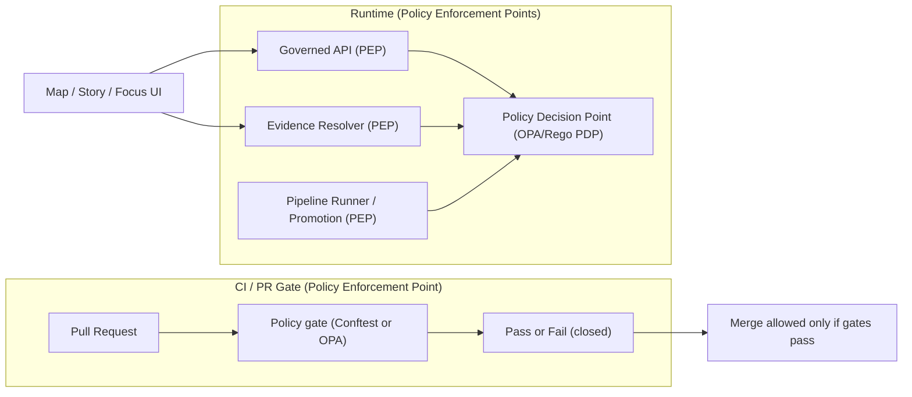

<!-- [KFM_META_BLOCK_V2]
doc_id: kfm://doc/8f4c5db9-1cc2-4a2f-b5b3-fb8c6a9a8e7d
title: policy/README.md
type: standard
version: v1
status: draft
owners: KFM Governance + Policy Stewards (TODO: set via CODEOWNERS)
created: 2026-02-26
updated: 2026-02-28
policy_label: public
related:
  - kfm://doc/KFM-GDG-2026  # TODO: link to in-repo copy of the Governance Guide
tags: [kfm, policy, governance, opa, rego, ci, promotion-contract]
notes:
  - Directory README for the policy bundle (CI + runtime semantics).
  - Replace <ORG>/<REPO> badge placeholders once repo metadata is known.
[/KFM_META_BLOCK_V2] -->

<a id="top"></a>

# `policy/` — Governed, fail-closed policy-as-code for KFM

**Purpose:** This directory contains the **policy bundle** (OPA/Rego or equivalent) that enforces KFM governance:
**access control**, **licensing/rights**, **sensitivity/redaction**, and **promotion gates** — with **the same semantics in CI and at runtime**.


<!-- TODO(repo): Replace <ORG>/<REPO> and workflow filenames -->
<!--  -->
<!--  -->

> **TL;DR:** In KFM, **security is governance**. Policy is the shared source of truth for what is allowed to be served, exported, or claimed — and it must be **deterministic**, **test-covered**, and **fail-closed**.

## Key references (normative intent)

- **KFM Governance Guide**: `kfm://doc/KFM-GDG-2026` *(TODO: add in-repo path link)*  
  Source of truth for: CI/runtime parity, policy labels + obligations, promotion contract gates, and safety defaults.
- **Tooling / Delivery Plan** *(TODO: link in-repo)*  
  Source of truth for: evidence resolver contract, cite-or-abstain gates, and how CI gates block promotion/merge.

---

## Quick navigation

- [What lives here](#what-lives-here)
- [Non-negotiable invariants](#non-negotiable-invariants)
- [Where policy sits in KFM](#where-policy-sits-in-kfm)
- [Policy decision model](#policy-decision-model)
- [Versioning and toolchain pins](#versioning-and-toolchain-pins)
- [Policy labels](#policy-labels)
- [Promotion Contract alignment](#promotion-contract-alignment)
- [Making changes](#making-changes)
- [Testing](#testing)
- [Directory layout](#directory-layout)
- [FAQ](#faq)

---

## What lives here

### ✅ Acceptable inputs

What belongs in `policy/`:

- **Policy code** (e.g., Rego packages) for:
  - authorization (role/label/action rules)
  - rights/licensing enforcement *(“online availability” ≠ permission to reuse)*
  - sensitivity + redaction/generalization obligations
  - promotion gating decisions (fail closed)
  - policy-safe error shaping (no restricted inference)
- **Fixtures** representing policy decisions:
  - allow/deny outcomes
  - obligations arrays
  - stable reason codes for auditability
- **Policy tests**:
  - OPA unit tests (`opa test`)
  - and/or Conftest tests used as PR gates
- **Rubrics** used as policy inputs:
  - licensing classification rubric
  - sensitivity rubric + generalization guidance
- **Controlled vocabularies** referenced by policy:
  - `policy_label` list
  - obligation types and reason codes (recommended)

### 🚫 Exclusions

What must **not** go in `policy/`:

- **Secrets** (API keys, credentials, private tokens).
- **Raw datasets** or restricted artifacts (policy should reference **metadata**, not embed sensitive content).
- **UI logic** (UI may display policy outcomes but must not decide policy).
- **One-off exceptions** without fixtures + tests (exceptions must become governed, testable policy).

> [!WARNING]
> If a rule cannot be tested (fixtures + tests), it is not policy — it’s a suggestion. Policy must be deterministic and CI-enforced.

[Back to top](#top)

---

## Non-negotiable invariants

These invariants align to KFM north stars. Policy must **enforce** them, not merely describe them.

### 1) Default deny

- Unknown = **deny**.
- Missing metadata = **deny** (or quarantine).
- Unhandled `policy_label` = **deny**.

### 2) Trust membrane

- Clients/UI must never gain access to storage/DB/indexes by policy loophole.
- Policy must assume access happens only through governed surfaces (API, evidence resolver, pipeline runner).
- “Allowed” must not imply “bypass”: obligations must still apply.

### 3) Evidence-first

- Any “allowed to claim/serve” decision must be compatible with evidence-first UX:
  - evidence must be resolvable (or UI must degrade/abstain)
  - license/rights must be present where required
  - provenance/receipts must be linkable where policy allows

### 4) Cite-or-abstain

- If citations cannot be verified and policy-allowed, Focus Mode must **abstain** or reduce scope.
- Policy must support (and tests must cover) abstention reasons and safe alternatives.

### 5) Promotion Contract support

- Policy participates in promotion gates and must be able to deny promotion for:
  - missing license/rights
  - missing/unclear sensitivity handling
  - missing receipts/checksums policy fields
  - missing catalogs required for the dataset class (when applicable)

### 6) Canonical vs rebuildable

- Policy must treat projections/caches as rebuildable and never as authoritative truth.
- If a projection contradicts canonical catalogs/receipts, policy should bias toward **deny** or **degrade** until resolved.

### 7) Deterministic identity and hashing

- Policy cannot depend on unstable, non-deterministic fields as decision inputs.
- Policy rules that touch identity/versioning must operate on stable identifiers (`dataset_version_id`, `spec_hash`) and be test-covered.

### 8) Policy-safe errors (no restricted inference)

- A public caller must not infer the existence of restricted resources through:
  - 403 vs 404 differences
  - different error messages
  - different payload shapes
  - “helpful” metadata in errors
- Policy should support an indistinguishable, safe error posture for restricted objects.

### 9) Versioned policy pack (audit reconstructability)

- Every governed run (pipeline run, story publish, Focus Mode request) must be able to record:
  - **which policy pack** was used (bundle digest / version identifier)
  - **what decision** was returned (decision + obligations + reason codes)
- If a run receipt/promotion manifest cannot answer “which policy rules were applied?”, treat it as **non-auditable** and **deny/quarantine**.

[Back to top](#top)

---

## Where policy sits in KFM

Policy is part of the **trust membrane**. It is enforced in CI (PR gates) and at runtime (API + evidence resolver).



**Key posture**
- CI must **block merges** when policy denies.
- Runtime must **fail closed** when policy cannot evaluate or evidence cannot be resolved.
- UI must **display** policy outcomes (labels/obligations) but **never** decide authorization.

[Back to top](#top)

---

## Policy decision model

A policy evaluation should return a **decision envelope** that is stable, auditable, and easy to test.

### Required decision fields

- `decision`: `allow | deny` *(default deny)*
- `policy_label`: controlled vocabulary string for the resource
- `obligations[]`: required follow-up actions (redaction, notices, export constraints)
- `reason_codes[]`: stable identifiers (for audit + debugging without leaking sensitive info)

### Recommended decision fields (strongly encouraged)

- `decision_id`: stable identifier for correlation in receipts/PROV (may be derived)
- `policy_pack_id`: policy bundle version/digest used for evaluation
- `audit_ref`: correlation ID for policy-safe error responses and steward debugging

> [!NOTE]
> Obligations are part of the decision and must be captured in run receipts/audit logs (and referenced from PROV where applicable).

### Obligations (examples)

Obligations make “allowed” safe:

- `show_notice`: UI must show a banner (e.g., “generalized due to policy”).
- `redact_fields`: evidence resolver must redact before returning.
- `force_generalization`: serve a `public_generalized` derivative only.
- `suppress_export`: block downloads/exports for the caller/action.
- `require_attribution`: exports must include license + attribution text.
- `rate_limit_class`: apply stricter limits for public endpoints.
- `log_audit`: require audit emission for this action.

### Policy-safe error shaping

Policy should support a safe error model that avoids restricted inference. A common approach:

- **Public caller:** return a “not found or not permitted” generic error for restricted targets.
- **Authorized steward/operator:** return explicit deny with reason codes and remediation hints.

> [!WARNING]
> Do not include restricted labels, precise coordinates, or rights-holder details in public error responses.

[Back to top](#top)

---

## Versioning and toolchain pins

This directory is not just “policy source”; it is an **auditable contract**.

### Policy pack versioning

- Treat the **policy pack** as a versioned artifact.
- Record `policy_pack_id` (bundle digest/version) in:
  - pipeline run receipts
  - promotion manifests
  - Story publish receipts
  - Focus Mode receipts

This is what makes governance **reconstructable** during audits and incident response.

### Toolchain drift (pin versions)

Toolchain drift can silently invalidate CI gates. To keep CI and runtime outcomes aligned:

- Pin **OPA** and **Conftest** versions in CI.
- Treat toolchain upgrades as governed changes:
  - add/refresh fixtures
  - run policy regression suite
  - steward review

### Maintainability guidelines

- Keep policies small and composable (one file per concern).
- Always add `_test.rego` coverage for new rules to prevent silent drift.

[Back to top](#top)

---

## Policy labels

Policy labels are controlled vocabulary values attached to datasets, stories, and evidence bundles.

| `policy_label` | Meaning | Default posture | Typical obligations |
|---|---|---|---|
| `public` | Safe for public display/download | allow for public `read` | require_attribution, rate_limit_class |
| `public_generalized` | Public-safe derived representation | allow for public `read` | show_notice, provenance link to redaction |
| `internal` | Visible to authenticated org users | deny to public | log_audit |
| `restricted` | Access limited to stewards/authorized roles | deny by default | policy_safe_error, log_audit |
| `restricted_sensitive_location` | Restricted + location-sensitive | deny by default | force_generalization, redact_fields, policy_safe_error |
| `embargoed` | Hidden until date/review | deny by default | embargo_until, log_audit |
| `quarantine` | Not promotable/servable | deny always | remediation_hint |

> [!IMPORTANT]
> Adding a new `policy_label` is a governance change:
> update vocabulary → update fixtures → update tests → update dependent validators/exports.

[Back to top](#top)

---

## Promotion Contract alignment

Policy is a hard dependency of the KFM Promotion Contract. Promotion must be **blocked** unless required artifacts exist and validate.

### Gate map (Promotion Contract v1)

| Gate | Promotion gate | Policy participation (examples) |
|---:|---|---|
| A | Identity & versioning | deny if required IDs/spec-hash inputs missing or invalid |
| B | Licensing & rights metadata | deny if license/rights/attribution missing or incompatible with intended distribution |
| C | Sensitivity classification & redaction plan | deny if restricted/sensitive lacks a recorded generalization/redaction plan (and dual-output policy where required) |
| D | Catalog triplet validation | policy can deny serving/promotion if required catalog fields/cross-links are missing (even if schema-valid) |
| E | QA & thresholds | deny (or quarantine) if required QA report is missing or thresholds failed |
| F | Run receipt & audit record | deny if receipts lack required policy decision fields (decision + obligations + policy_pack_id) |
| G | Release manifest | deny if promotion is not recorded as a release manifest referencing artifact digests |

### Promotion-critical rule of thumb

If the system cannot answer **“Is it safe and permitted to publish?”** deterministically, the correct result is **deny/quarantine**.

[Back to top](#top)

---

## Making changes

Policy changes are governance changes. Treat them with the same discipline as schema/API changes.

### Change rules (non-negotiable)

- **No silent changes:** every change must add/modify **fixtures** and **tests**.
- **Fail closed:** unhandled labels/actions default to **deny**.
- **CI/runtime parity:** outcomes must match between CI evaluation and runtime PDP evaluation.
- **Policy-safe outputs:** no restricted inference through error models or payload differences.

### PR checklist (policy)

- [ ] Rego change includes stable `reason_codes` (or documented rationale).
- [ ] Fixtures cover decision **and obligations** (not just allow/deny).
- [ ] Tests cover at least:
  - public role (deny-by-default posture)
  - steward role (explicit allows where intended)
  - restricted existence inference protections
  - export/download constraints (rights + obligations)
- [ ] If vocab changed: update vocab files + downstream fixtures.
- [ ] Steward review requested and recorded (via CODEOWNERS / reviewers).

> [!TIP]
> Prefer adding new rules behind fixtures, then expanding coverage, before widening allow conditions.

[Back to top](#top)

---

## Testing

Wire these into `make test-policy` (or equivalent) so local + CI runs are identical.

### Option A — OPA unit tests (Rego)

```bash
opa version
opa test -v policy/rego policy/tests
```

### Option B — Conftest gate (PR gate)

```bash
conftest --version
conftest test -p policy/rego policy/fixtures
```

### Required CI behavior

- Policy tests **must run in CI** and **block merges** on failure.
- Denies must emit actionable output:
  - stable `reason_code`
  - policy-safe remediation hint (no leaks)
- CI should log (and ideally assert) policy tool versions so regressions are diagnosable.

[Back to top](#top)

---

## Directory layout

This is a recommended, validator-friendly starting structure. Adjust if your repo differs, but preserve:
**rego + fixtures + tests + vocab + rubrics**.

```text
policy/
├─ README.md
├─ conftest.toml                                 # Optional: conftest config (namespaces, output, ignore rules)
│
├─ registry/                                     # Machine-readable registry + schemas + fixtures (small)
│  ├─ policy_bundle.v1.json                      # Policy bundle manifest (packages, versions, entrypoints, required tests)
│  ├─ schemas/                                   # Schemas for registries + decision/fixture shapes (optional, recommended)
│  │  ├─ policy_bundle.v1.schema.json
│  │  ├─ decision_envelope.v1.schema.json        # {decision, policy_label, obligations[], reason_codes[], policy_pack_id?}
│  │  ├─ fixture_input.v1.schema.json            # {user, action, resource, context}
│  │  ├─ obligation.v1.schema.json               # obligation object shape(s)
│  │  ├─ reason_codes.v1.schema.json             # reason code enumerations / structure
│  │  └─ vocab_list.v1.schema.json               # schema for YAML vocab lists (if validated)
│  └─ fixtures/
│     ├─ valid/
│     │  ├─ policy_bundle.minimal.json
│     │  └─ decision_envelope.minimal.json
│     └─ invalid/
│        ├─ decision_envelope.missing_reason_codes.json
│        └─ fixture_input.missing_policy_label.json
│
├─ rego/                                         # Policy packages (OPA/Rego)
│  ├─ kfm/                                       # Namespace root (recommended)
│  │  ├─ decision.rego                           # Canonical decision envelope builder (default deny)
│  │  ├─ authz.rego                              # allow/deny rules (role/action/resource)
│  │  ├─ labels.rego                             # label semantics helpers (public vs restricted, etc.)
│  │  ├─ obligations.rego                        # obligation derivation (show_notice, redact_fields, suppress_export…)
│  │  ├─ rights.rego                             # license/rights enforcement rules (export, attribution, redistribution)
│  │  ├─ sensitivity.rego                        # sensitive-location + PII posture + generalization requirements
│  │  ├─ promotion.rego                          # promotion gate participation (deny if missing required artifacts)
│  │  ├─ evidence.rego                           # EvidenceRef/EvidenceBundle rules (resolvability requirements, obligations)
│  │  ├─ exports.rego                            # download/export policy (policy_label + rights + obligations)
│  │  ├─ focus.rego                              # cite-or-abstain rules (citation verification hard gate outcomes)
│  │  ├─ audit.rego                              # audit/logging obligations + required fields (audit_ref, run_id, reason_codes)
│  │  ├─ errors.rego                             # policy-safe error shaping (no restricted inference)
│  │  └─ versioning.rego                         # bundle/version pins + compatibility checks (optional)
│  │
│  ├─ _shared/                                   # Common helpers (pure functions; no policy decisions)
│  │  ├─ canonical_json.rego                     # deterministic/canonical JSON helpers (avoid hash drift)
│  │  ├─ strings.rego                            # string helpers (normalize, trim, safe messages)
│  │  ├─ sets.rego                               # set helpers (union/intersect/diff)
│  │  ├─ time.rego                               # time-window helpers (inclusive/exclusive, parsing guards)
│  │  ├─ geo.rego                                # bbox/geometry guards (policy-safe bounding, no precise leakage)
│  │  ├─ uri.rego                                # URI/EvidenceRef scheme parsing helpers
│  │  ├─ spdx.rego                               # SPDX/license normalization helpers (if used)
│  │  └─ hashing.rego                            # digest/spec_hash helpers (inputs only; no secret material)
│  │
│  └─ vendor/                                    # Optional: vendored rego libs (pin versions; keep tiny)
│     └─ README.md
│
├─ fixtures/                                     # Deterministic decision fixtures (synthetic; safe-by-default)
│  ├─ README.md                                  # How fixtures are structured + naming conventions
│  ├─ inputs/                                    # Inputs to policy evaluation (user/action/resource/context)
│  │  ├─ authz/
│  │  │  ├─ public_read_public_dataset.json
│  │  │  ├─ public_read_restricted_dataset.json
│  │  │  └─ steward_read_restricted_dataset.json
│  │  ├─ rights/
│  │  │  ├─ public_export_public_dataset.json
│  │  │  ├─ public_export_public_dataset_missing_attribution.json
│  │  │  └─ steward_export_restricted_dataset.json
│  │  ├─ sensitivity/
│  │  │  ├─ public_read_public_generalized_dataset.json
│  │  │  ├─ public_read_sensitive_location_dataset.json
│  │  │  └─ steward_read_sensitive_location_dataset.json
│  │  ├─ promotion/
│  │  │  ├─ promote_dataset_missing_license.json
│  │  │  ├─ promote_dataset_missing_receipt.json
│  │  │  └─ promote_dataset_all_gates_present.json
│  │  ├─ evidence/
│  │  │  ├─ resolve_evidence_allowed.json
│  │  │  ├─ resolve_evidence_denied.json
│  │  │  └─ resolve_evidence_unresolvable.json
│  │  ├─ focus/
│  │  │  ├─ focus_public_query_public_context.json
│  │  │  ├─ focus_public_query_restricted_context.json
│  │  │  └─ focus_steward_query_restricted_context.json
│  │  └─ errors/
│  │     ├─ public_request_unknown_resource.json
│  │     └─ public_request_restricted_resource.json
│  │
│  └─ expected/                                  # Expected decision envelopes (goldens)
│     ├─ authz/
│     │  ├─ public_read_public_dataset.decision.json
│     │  ├─ public_read_restricted_dataset.decision.json
│     │  └─ steward_read_restricted_dataset.decision.json
│     ├─ rights/
│     │  ├─ public_export_public_dataset.decision.json
│     │  ├─ public_export_public_dataset_missing_attribution.decision.json
│     │  └─ steward_export_restricted_dataset.decision.json
│     ├─ sensitivity/
│     │  ├─ public_read_public_generalized_dataset.decision.json
│     │  ├─ public_read_sensitive_location_dataset.decision.json
│     │  └─ steward_read_sensitive_location_dataset.decision.json
│     ├─ promotion/
│     │  ├─ promote_dataset_missing_license.decision.json
│     │  ├─ promote_dataset_missing_receipt.decision.json
│     │  └─ promote_dataset_all_gates_present.decision.json
│     ├─ evidence/
│     │  ├─ resolve_evidence_allowed.decision.json
│     │  ├─ resolve_evidence_denied.decision.json
│     │  └─ resolve_evidence_unresolvable.decision.json
│     ├─ focus/
│     │  ├─ focus_public_query_public_context.decision.json
│     │  ├─ focus_public_query_restricted_context.decision.json
│     │  └─ focus_steward_query_restricted_context.decision.json
│     └─ errors/
│        ├─ public_request_unknown_resource.decision.json
│        └─ public_request_restricted_resource.decision.json
│
├─ tests/                                        # Rego unit tests (or conftest rules)
│  ├─ README.md                                  # How to run tests; what must be covered
│  ├─ decision_envelope_test.rego                # decision shape invariants (reason_codes required, obligations well-formed)
│  ├─ authz_test.rego
│  ├─ obligations_test.rego
│  ├─ rights_test.rego
│  ├─ sensitivity_test.rego
│  ├─ promotion_test.rego
│  ├─ evidence_test.rego
│  ├─ exports_test.rego
│  ├─ focus_test.rego
│  ├─ audit_test.rego
│  ├─ policy_safe_errors_test.rego               # indistinguishable errors for restricted vs missing (public role)
│  ├─ vocab_test.rego                            # ensure labels/obligations/reason codes match vocab files
│  └─ fixtures_roundtrip_test.rego               # optional: verify fixtures inputs → decision matches expected goldens
│
├─ vocab/                                        # Controlled vocabulary lists (versioned; referenced by policy + CI)
│  ├─ README.md
│  ├─ policy_labels.v1.yml                       # allowed policy labels + semantics hints
│  ├─ obligations.v1.yml                         # allowed obligation types + required fields
│  ├─ reason_codes.v1.yml                        # stable reason codes used by policy + receipts
│  ├─ roles.v1.yml                               # roles (public, internal, steward, operator, service)
│  ├─ actions.v1.yml                             # actions (read, search, export, promote, resolve_evidence, administer)
│  ├─ resource_types.v1.yml                      # dataset, dataset_version, story_node, evidence_bundle, export_job, …
│  └─ media_types.v1.yml                         # optional: whitelisted export media types
│
├─ rubrics/                                      # Human-readable + machine-referenced policy inputs
│  ├─ README.md
│  ├─ licensing.md                               # SPDX handling + attribution requirements (human)
│  ├─ licensing.v1.yml                           # machine-readable licensing rubric (optional)
│  ├─ sensitivity.md                             # sensitivity rubric + generalization guidance (human)
│  ├─ sensitivity.v1.yml                         # machine-readable sensitivity rubric (optional)
│  └─ generalization_guidance.md                 # how to generalize safely (no precise coords in public)
│
└─ scripts/                                      # Optional: deterministic helpers (CI + local parity)
   ├─ fmt.sh                                     # opa fmt (and any policy file formatting)
   ├─ test.sh                                    # opa test runner wrapper
   ├─ conftest.sh                                # conftest wrapper (if used)
   └─ validate_fixtures.sh                       # optional: schema-check fixtures + ensure goldens exist
```

> [!NOTE]
> If your repo keeps label/obligation definitions under `configs/policy/**`, keep this directory as **enforcement logic** and treat `configs/` as **inputs** (still validated + versioned).

[Back to top](#top)

---

## FAQ

### Why “default deny”?

Because “unknown” is not the same as “allowed.” Default deny prevents accidental leakage and forces explicit governance decisions.

### Why obligations?

Some “allowed” results are only safe when accompanied by safeguards (notices, generalization, redaction, export controls). Obligations make those safeguards enforceable.

### Can the UI decide policy?

No. UI can only render policy outcomes and trust badges/notices. Authorization, redaction, and export decisions happen behind the trust membrane.

### What happens when evidence can’t be verified?

For Focus Mode and other citation-bearing surfaces: **abstain or reduce scope**. Do not guess; do not fabricate citations; do not bypass the evidence resolver.

[Back to top](#top)

---

## Appendix (optional reference)

<details>
<summary><strong>Suggested policy input shape (illustrative)</strong></summary>

```json
{
  "user": { "principal": "user:alice", "role": "public", "groups": [] },
  "action": "read",
  "resource": {
    "type": "dataset",
    "dataset_version_id": "2026-02.abcd1234",
    "policy_label": "public"
  },
  "context": {
    "purpose": "browse",
    "view_state": {
      "bbox": [-102.0, 36.9, -94.6, 40.0],
      "time_window": { "start": "1950-01-01", "end": "2024-12-31" }
    }
  }
}
```
</details>

<details>
<summary><strong>Minimal Rego skeleton (illustrative)</strong></summary>

```rego
package kfm.authz

default decision := {
  "decision": "deny",
  "policy_label": input.resource.policy_label,
  "obligations": [],
  "reason_codes": ["DEFAULT_DENY"]
}

decision := out {
  allow
  out := {
    "decision": "allow",
    "policy_label": input.resource.policy_label,
    "obligations": obligations,
    "reason_codes": ["ALLOW_MATCHED_RULE"]
  }
}

allow {
  input.user.role == "steward"
}

allow {
  input.user.role == "public"
  input.action == "read"
  input.resource.policy_label == "public"
}

obligations[o] {
  input.resource.policy_label == "public_generalized"
  o := {"type": "show_notice", "message": "Geometry generalized due to policy."}
}
```
</details>

[Back to top](#top)
