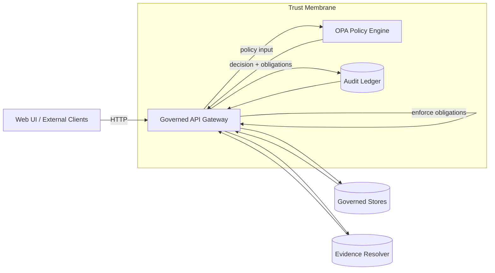

<!--
File: policy/README.md
Purpose: KFM Policy Library (OPA/Rego) — authorization, output governance, and CI gates.
Status: Governed, security-critical documentation.
-->

# 🛡️ KFM Policy Library (OPA/Rego)

[](#-kfm-policy-library-oparego)
[](#default-deny--fail-closed)
[](#default-deny--fail-closed)
[](#trust-membrane-where-policy-runs)
[](#focus-mode-output-governance-cite-or-abstain)
[](#sensitivity--redaction)
[](#ci-governance-gates)

<!-- Repo-scoped badges (optional) -->
<!--
> [!TIP]
> If you know the GitHub org/repo slug, uncomment and replace `ORG/REPO` and workflow filenames.

[](https://github.com/ORG/REPO/actions/workflows/ci.yml)
[](https://github.com/ORG/REPO/actions/workflows/codeql.yml)
[](https://codecov.io/gh/ORG/REPO)
[](../LICENSE)
-->

---

## Why this directory exists

KFM is a governed system. That governance is **not** a document or a promise—it is **enforced behavior**.

This `policy/` directory is the **policy source of truth** for:

- **Authorization**: who can access what (datasets, layers, stories, evidence objects)
- **Sensitivity enforcement**: location precision rules, field-level restrictions, embargoes
- **Output governance**: Focus Mode & Story Nodes must be *evidence-first* (cite-or-abstain)
- **Promotion gates**: Raw → Work → Processed publication requirements (catalogs + provenance)
- **CI governance**: merge-blocking checks that prevent policy drift and governance regressions

> [!IMPORTANT]
> Policies are part of KFM’s **trust membrane**. Treat changes here like changes to authentication, encryption, or production routing.

---

<details>
<summary><strong>Table of contents</strong></summary>

- [Design goals and invariants](#design-goals-and-invariants)
- [Trust membrane: where policy runs](#trust-membrane-where-policy-runs)
- [Default deny + fail closed](#default-deny--fail-closed)
- [Policy domains](#policy-domains)
- [Focus Mode output governance: cite-or-abstain](#focus-mode-output-governance-cite-or-abstain)
- [Sensitivity + redaction](#sensitivity--redaction)
- [Policy contracts: input, decision, obligations](#policy-contracts-input-decision-obligations)
- [Folder layout](#folder-layout)
- [Local development](#local-development)
- [CI governance gates](#ci-governance-gates)
- [Auditing + versioning](#auditing--versioning)
- [Emergency deny switch](#emergency-deny-switch)
- [Contributing](#contributing)
- [Troubleshooting](#troubleshooting)
- [Glossary](#glossary)

</details>

---

## Design goals and invariants

KFM’s credibility comes from a small set of **non-negotiable invariants**.

### Non-negotiables (MUST remain true)

- **Trust membrane is real**: external clients never directly access databases or object storage.
- **Fail closed**: missing data, missing inputs, unknown labels, or policy engine errors ⇒ deny.
- **Processed-only truth**: only promoted, cataloged artifacts are servable.
- **Promotion is gated**: Raw → Work → Processed requires receipts + checksums + catalogs (STAC/DCAT/PROV).
- **Evidence-first outputs**: Story Nodes and Focus Mode must *cite or abstain*.
- **Sensitive data is handled intentionally**: redaction/generalization is a governed transformation with lineage.

> [!NOTE]
> If a change weakens an invariant, treat it as a governance event and expect redesign requests.

---

## Trust membrane: where policy runs

Policy must execute at the **boundary** between “outside” (UI/external clients) and “inside” (governed stores/services).



### The “no bypass” rule

Any code path that:
- fetches data from a store **and**
- returns it to a client **without** a policy decision

…is a **policy bypass** and should be treated as a Sev‑0 security bug.

> [!WARNING]
> “We meant to add policy later” is not a valid state for endpoints that serve data.

---

## Default deny + fail closed

**Default deny** is the baseline stance:

- deny unless explicitly allowed
- deny if inputs are missing
- deny if labels are unknown
- deny if OPA is unavailable
- deny if obligation enforcement is not implemented

Minimal example:

```rego
package kfm.example

default allow := false

allow if {
  input.actor.role == "admin"
}
```

### Determinism requirement

Policies MUST be:
- **deterministic** (same input → same decision)
- **testable** (unit tests + fixtures)
- **portable** (same modules run in CI and at runtime)

> [!TIP]
> Avoid time-based or environment-dependent behavior unless time is passed explicitly through `input`.

---

## Policy domains

KFM policy is easiest to reason about when policies are organized by **what they govern** and **where they are enforced**.

| Domain | What it governs | Where it is enforced | Typical decision artifacts |
|---|---|---|---|
| **Authz** | dataset/layer/story access | API gateway before data fetch | allow/deny + reason codes |
| **Sensitivity** | restricted fields, location precision, embargoes | response shaping + redaction pipeline | obligations (redact/generalize) |
| **Promotion** | Raw→Work→Processed prerequisites | CI + promotion workflow | deny merge/promotion |
| **Output validation** | cite-or-abstain rules for AI/stories | before response is returned | allow/abstain + audit requirements |
| **Audit integrity** | required audit fields, hashes, policy version | response wrapper + CI | obligations (attach audit_ref) |
| **Emergency controls** | kill-switches and rapid denies | OPA data doc + API | deny with incident code |

---

## Focus Mode output governance: cite-or-abstain

Focus Mode is governed output. It is **not allowed** to return ungrounded claims.

### What “cite-or-abstain” means in KFM

A Focus Mode response MUST either:

1) **Cite** evidence objects that resolve to KFM-served artifacts (documents, datasets, STAC items, etc.), **or**
2) **Abstain** with a structured explanation and an audit reference.

> [!IMPORTANT]
> “Abstain” is a **successful safety outcome**. It preserves trust and keeps the audit trail intact.

### Suggested policy checks for Focus Mode

At minimum, allow a “claimful” answer only when all are true:

- citations exist
- citations are resolvable (evidence resolver can fetch each citation target)
- sensitivity checks pass (no restricted content / precision leakage)
- audit metadata is attached (audit_ref + policy bundle hash)

Illustrative Rego shape:

```rego
package kfm.ai

default allow := false

allow if {
  input.resource.kind == "focus_answer"
  input.answer.has_citations == true
  count(input.answer.citations) > 0
  input.answer.citations_resolved == true
  input.answer.sensitivity_ok == true
  input.audit.required_fields_present == true
}
```

### “Abstain” contract (recommended)

When evidence cannot be resolved, the API should return a response like:

```json
{
  "mode": "abstain",
  "message": "Insufficient evidence available in governed datasets to answer this safely.",
  "missing": ["resolvable_citations", "dataset_access"],
  "audit_ref": "audit_...",
  "policy": { "bundle_hash": "sha256:..." }
}
```

---

## Sensitivity + redaction

KFM assumes some data is inherently sensitive: private ownership attributes, precise archaeological site locations, embargoed materials, and other restricted fields.

### Sensitivity classes (recommended baseline)

| Class | Meaning | Default behavior |
|---|---|---|
| `public` | safe to publish | serve as-is |
| `restricted` | role/scoped access required | deny or remove restricted fields |
| `sensitive-location` | coordinates must be generalized/suppressed | serve only generalized derivative |
| `aggregate-only` | publish only above thresholds | suppress small counts, serve aggregates |

### Redaction is a first-class transformation

If KFM redacts or generalizes:
- the **raw dataset remains immutable**
- the output becomes a **derived dataset/version**
- the transformation MUST be recorded in provenance (PROV lineage)

> [!IMPORTANT]
> Redaction is not a view hack. It is governed data production with receipts and lineage.

### Obligations (how policy tells the API what to do)

Policies should return **obligations** rather than embedding “how to redact” inside app code.

Examples:
- `redact_fields`: remove specific attributes
- `generalize_geometry`: reduce coordinate precision / snap-to-grid
- `require_aggregate`: only allow grouped output
- `deny_export`: block downloads while allowing map tiles

```json
{
  "allow": true,
  "reason_codes": ["ALLOW_REDACTED"],
  "obligations": [
    { "type": "generalize_geometry", "precision": "coarse" },
    { "type": "redact_fields", "fields": ["owner_name", "phone"] }
  ]
}
```

> [!WARNING]
> If the API does not implement an obligation type, it MUST fail closed (deny).

---

## Policy contracts: input, decision, obligations

KFM policy must be portable across CI and runtime. That requires stable contracts.

### Policy input envelope (recommended)

This is the object the API passes to OPA.

```json
{
  "actor": {
    "id": "user_123",
    "role": "public|reviewer|admin",
    "scopes": ["dataset:read", "story:publish"],
    "attributes": { "org": "example", "teams": ["historians"] }
  },
  "request": {
    "id": "req_abc",
    "method": "POST",
    "path": "/api/v1/focus/query",
    "ip_class": "public|internal",
    "time": "2026-02-16T12:34:56Z"
  },
  "resource": {
    "kind": "dataset|layer|story|evidence|focus_answer|promotion",
    "id": "dataset_...",
    "version": "2026-02-12",
    "labels": ["public", "sensitive-location"],
    "license": "CC0|CC-BY|restricted"
  },
  "context": {
    "bbox": [-102.0, 36.9, -94.6, 40.0],
    "time_range": ["1854-01-01", "1870-12-31"],
    "format": "geojson|parquet|tiles|html"
  },
  "answer": {
    "text": "optional; for output validation paths",
    "citations": [{ "ref": "evidence:..." }],
    "has_citations": true,
    "citations_resolved": false,
    "sensitivity_ok": false
  },
  "audit": {
    "required_fields_present": false,
    "candidate_audit_ref": "optional"
  },
  "system": {
    "policy_bundle_hash": "sha256:...",
    "deployment": "local|staging|prod"
  }
}
```

### Policy decision envelope (recommended)

OPA should return a single decision object the API can act on.

```json
{
  "allow": false,
  "reason_codes": ["DEFAULT_DENY", "MISSING_SCOPE"],
  "obligations": [],
  "decision_id": "opa_decision_...",
  "policy": {
    "bundle_hash": "sha256:...",
    "package": "kfm.data"
  }
}
```

### Reason codes (recommended practice)

Reason codes should be **stable** (machine-actionable) and mapped to user-safe messages in the API/UI.

Examples:
- `DEFAULT_DENY`
- `MISSING_SCOPE`
- `SENSITIVITY_RESTRICTED`
- `SENSITIVE_LOCATION_PRECISION_TOO_FINE`
- `OPA_UNAVAILABLE`
- `MISSING_CATALOGS_STAC_DCAT_PROV`
- `MISSING_AUDIT_FIELDS`
- `CITATIONS_UNRESOLVED`

---

## Folder layout

This layout is recommended even if the repo is still scaffolded. Adapt as needed, but keep the responsibilities intact.

```text
policy/                                                      # Policy-as-code source of truth (OPA/Rego)
├── README.md                                                 # (this file) policy purpose, invariants, runbooks
│
├── rego/                                                     # Authoritative Rego modules
│   └── kfm/                                                  # package kfm.*
│       ├── authz.rego                                        # Actor → scopes/roles → allow/deny
│       ├── data.rego                                         # Dataset + layer access (default-deny)
│       ├── sensitivity.rego                                  # Field and geometry precision obligations
│       ├── ai.rego                                           # Focus Mode output validation (cite-or-abstain)
│       ├── promotion.rego                                    # Raw→Work→Processed publication gates
│       ├── audit.rego                                        # Audit requirements (audit_ref, hashes, bundle ids)
│       └── emergency.rego                                    # Kill-switch / incident denies
│
├── data/                                                     # OPA "data documents" (configuration as data)
│   ├── roles.json                                            # Role → scopes mapping (avoid hardcoding in rego)
│   ├── datasets.json                                         # Dataset labels/sensitivity metadata (or pointers)
│   └── controls.json                                         # Emergency deny switches and incident flags
│
├── tests/                                                    # OPA unit tests + fixtures (deterministic)
│   ├── *_test.rego                                           # Unit tests per policy domain
│   └── fixtures/
│       ├── inputs/                                           # Policy inputs (synthetic, minimal, redacted)
│       └── expected/                                         # Expected decisions (golden snapshots)
│
├── schemas/                                                  # JSON Schemas for inputs/decisions/audit envelopes
│   ├── policy_input.schema.json
│   ├── policy_decision.schema.json
│   └── audit_record.schema.json
│
├── conftest/                                                 # Optional: repo-wide governance checks (CI)
│   ├── metadata.rego                                         # Enforce required catalogs/receipts on changed files
│   └── promotion_contract.rego                               # Merge-blocking checks for promotion workflow
│
├── bundles/                                                  # Built bundles (CI-produced artifacts only)
│   └── (generated)                                           # Do not edit by hand
│
└── tools/                                                    # Dev helpers (optional)
    ├── Makefile                                              # opa test, fmt, bundle build, conftest
    └── scripts/                                              # fixture generators, golden test helpers
```

> [!NOTE]
> If you add a new `obligation` type, you MUST add the API handler + tests. Otherwise you’ve created a “paper control.”

---

## Local development

### Prerequisites

- OPA CLI installed (for `opa test`, `opa eval`, `opa fmt`)
- Optional: Conftest installed (for repository-wide checks)

### Common commands

```bash
# Format policy (consistent diffs)
opa fmt -w ./policy/rego ./policy/tests

# Run unit tests
opa test -v ./policy/rego ./policy/tests

# Evaluate a single decision locally (debugging)
opa eval -f pretty \
  -d ./policy/rego \
  -d ./policy/data \
  "data.kfm.data.decision" \
  -i ./policy/tests/fixtures/inputs/example_allow.json
```

### Building a deployable bundle (optional but recommended)

```bash
# Build an OPA bundle that can be shipped to runtime as an immutable artifact
opa build -b ./policy/rego -b ./policy/data -o ./policy/bundles/kfm-policy-bundle.tar.gz
```

> [!TIP]
> Treat the bundle as a release artifact: version it, hash it, and record the bundle hash in audit events.

---

## CI governance gates

Policy must be enforced in CI so governance can’t silently regress.

### Required gates (merge-blocking)

- ✅ `opa test` must pass (unit tests)
- ✅ `opa fmt` must be clean (or run as a formatter step)
- ✅ `conftest test` must pass (repo governance checks)
- ✅ bundle build must succeed (if you ship bundles)
- ✅ policy regression suite must pass (golden deny tests)

### What the regression suite should cover

- **Forever-deny leaks**: tests that encode past incidents (these must never pass again)
- **Sensitive-location precision**: unauthorized roles cannot receive fine-grain coordinates
- **Field-level redaction**: restricted fields are always removed
- **Promotion contract**: processed artifacts missing catalogs/provenance fail CI
- **Focus Mode cite-or-abstain**: any “claimful” answer requires resolvable citations + audit metadata

> [!WARNING]
> If CI passes without running policy checks, governance becomes optional. Treat that as a build break.

---

## Auditing + versioning

Every governed interaction should be traceable to:

- `audit_ref` (append-only audit ledger pointer)
- `policy_bundle_hash` (which policy version made the decision)
- `evidence_pack_hash` (what evidence set was used)
- `reason_codes` (why allow/deny/abstain happened)

### Logging guidance (privacy-safe)

Prefer logging:
- reason codes
- decision id
- bundle hash
- resource id/version

Avoid logging:
- raw sensitive request payloads
- private fields
- unredacted coordinates

---

## Emergency deny switch

KFM should support an emergency switch that can deny:
- public endpoints
- Focus Mode responses
- specific datasets/layers

…without deploying application code.

Recommended pattern:
- store emergency controls in an OPA data document (`policy/data/controls.json`)
- require tests proving the switch works
- require CI to protect modifications to this file

Example data doc:

```json
{
  "emergency": {
    "enabled": false,
    "deny_public": false,
    "deny_focus_mode": false,
    "deny_datasets": ["dataset_archaeology_sensitive_v1"]
  }
}
```

> [!IMPORTANT]
> Test the deny switch in incident drills. A kill switch that isn’t tested is not a safety feature.

---

## Contributing

### Policy PR checklist (required)

- [ ] Default-deny preserved (no blanket `allow := true`)
- [ ] Fails closed on missing inputs / unknown labels
- [ ] Unit tests added for allow + deny + edge cases
- [ ] Regression test added if this fixes a leak
- [ ] Any new obligation has a corresponding API handler + integration test
- [ ] Input/decision schemas updated if the contract changed
- [ ] If user-visible behavior changes, audit requirements remain intact

### Rego style conventions

- Keep rules small and composable.
- Prefer `decision` objects with `allow`, `reason_codes`, and `obligations`.
- Avoid hardcoding dataset ids or roles inside Rego—prefer `policy/data/*.json`.
- Avoid non-determinism and implicit environment lookups.
- Use consistent naming:
  - `allow` for boolean,
  - `decision` for envelope,
  - `reason_codes` for machine-readable explanations,
  - `obligations` for enforceable transformations.

---

## Troubleshooting

<details>
<summary><strong>Why was this request denied?</strong></summary>

1. Find `audit_ref` in the API response.
2. Inspect the audit record for:
   - `reason_codes`
   - policy bundle hash
   - decision id
3. Re-run locally with the captured policy input:

```bash
opa eval -f pretty -d ./policy/rego -d ./policy/data \
  "data.kfm.data.decision" \
  -i ./policy/tests/fixtures/inputs/deny_case.json
```

</details>

<details>
<summary><strong>OPA is unavailable — what should happen?</strong></summary>

Fail closed:
- Authorization-protected endpoints are denied.
- Focus Mode returns **abstain** (not a speculative answer).
- Audit records capture the failure mode (without leaking sensitive inputs).

</details>

<details>
<summary><strong>I added an obligation but nothing changed</strong></summary>

That indicates one of these is true:

- The policy didn’t emit the obligation (inspect the decision output), or
- The API doesn’t implement the obligation handler

KFM rule: if the API cannot enforce an obligation, it must deny. Add the handler + tests.

</details>

---

## Glossary

- **OPA**: Open Policy Agent, the policy decision engine.
- **Rego**: the policy language executed by OPA.
- **Trust membrane**: the governed boundary where policy + audit enforce access and evidence rules.
- **Default deny**: deny unless explicitly allowed.
- **Fail closed**: on error or uncertainty, deny (or abstain for AI responses).
- **Cite-or-abstain**: Focus Mode and Story Nodes must provide resolvable citations or return abstain.

---

## See also (repo-local)

- `../docs/` — governed documentation and Story Nodes
- `../data/` — raw/work/processed zones + catalogs + provenance
- `../src/` — API/services + OPA adapter + obligation enforcement
- `../web/` — UI (React/TS); must never access stores directly
