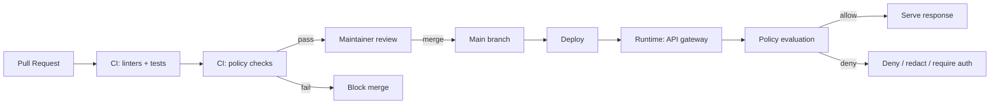

# `policy/` — Governance Policies & Policy-as-Code

> ✅ CI-enforced · 🧾 Evidence-first · 🛡️ Trust membrane · ⚖️ FAIR+CARE · 🔒 Safe-by-default

This directory encodes **Kansas Frontier Matrix (KFM)** governance rules as **versioned artifacts**, designed to be reviewed, tested, and enforced just like code. The technical blueprint explicitly frames the repository’s `policy/` directory as the place where governance rules are made **transparent** and **auditable** via Git history (“policy as code”).  

---

## 📘 Purpose

The `policy/` directory exists to:

- Make KFM governance **explicit, testable, and reviewable** (“policy as code”).
- Provide a single, discoverable home for rules that protect:
  - data integrity and provenance,
  - sovereignty/sensitivity requirements,
  - AI behavior constraints (citations, no leakage),
  - security and access boundaries,
  - compliance gates for contribution and publication.

> [!IMPORTANT]
> KFM governance is designed to operate as a **membrane**: nothing becomes “live” without automated checks and maintainer review.

---

## 🧭 Non‑Negotiable Invariants

These invariants must hold across **every** policy, doc, and implementation:

1. **Canonical pipeline ordering is sacred**  
   `ETL → STAC/DCAT/PROV → Graph → APIs → UI → Story Nodes → Focus Mode`  
   Policies must never encourage shortcuts that contradict this ordering.

2. **Trust membrane / API boundary is enforced**  
   - Frontend clients **never** access databases directly.
   - Core backend logic **never** bypasses repository interfaces to talk to storage.
   - External integrations and UI access go through the governed API gateway.

3. **Evidence-first & no uncited claims (especially for AI + narratives)**  
   If a statement cannot be tied to a project artifact (dataset ID, doc, commit, or known source), it must be framed as a hypothesis or omitted. If a detail is unknown, mark it: *“(not confirmed in repo)”*.

4. **Safe-by-default with sensitive content**  
   If something may be sensitive (e.g., sacred/vulnerable site locations), **omit or generalize** and flag for governance review.

---

## 🗂️ Directory Layout

> [!NOTE]
> The blueprint describes a `policy/` directory and anticipates “policy-as-code” (e.g., OPA/Rego) patterns. The exact file names below are **recommended** and may not yet exist *(not confirmed in repo)*.

| Path | Type | What it’s for | Status |
|---|---|---|---|
| `policy/README.md` | Markdown | You are here — policy index + operating rules | ✅ authoritative |
| `policy/**/*.rego` | Rego (OPA) | Policy-as-code rules (datasets, AI, security, compliance) | *(not confirmed in repo)* |
| `policy/tests/**` | Test fixtures | Policy test cases (positive/negative examples) | *(not confirmed in repo)* |
| `policy/fixtures/**` | Data/doc fixtures | Minimal sample inputs for policy checks | *(not confirmed in repo)* |
| `policy/docs/**` | Markdown | Deep-dive docs per policy domain (optional) | *(not confirmed in repo)* |

### Suggested policy modules *(not confirmed in repo)*

- `policy/data_policies.rego` — dataset/metadata requirements (licenses, provenance, required fields)
- `policy/ai_policies.rego` — AI output constraints (citations, no PII leakage, sensitivity handling)
- `policy/security.rego` — access boundary and authorization rules
- `policy/compliance.rego` — publication gates (privacy, takedown/withdrawal handling, restricted data rules)

---

## 🧪 Enforcement Model

KFM governance is intended to be enforced at **two points**:

1. **Pull Request / CI gate** — prevent non-compliant contributions from merging.
2. **Runtime API gate** — prevent disallowed access or disallowed combinations of outputs at query time.



### CI enforcement *(typical pattern — verify in repo)*

The technical blueprint describes running policy checks in CI using **Conftest** (OPA policy testing) to evaluate repository changes against governance rules *(not confirmed in repo)*.

<details>
  <summary><strong>Example local command set (adjust to match repo)</strong></summary>

```bash
# Example only (not confirmed in repo):
# conftest test -p policy/ path/to/changed/files

# Run formatting/lint checks (examples only):
pre-commit run --all-files
```
</details>

### Runtime enforcement

The implementation blueprint describes an **Open Policy Agent (OPA)** integrated at the **API layer**, ensuring external calls respect rules (authz, restricted datasets, citation expectations, and disallowed combinations).  
This enforces the “trust membrane” consistently for the official UI and for external clients.

---

## ⚖️ FAIR + CARE in Policy Terms

KFM explicitly commits to **FAIR** (Findable, Accessible, Interoperable, Reusable) plus **CARE** (Collective Benefit, Authority to Control, Responsibility, Ethics). Policies operationalize these values:

- **FAIR as “entry checklist”**: if minimum metadata/provenance requirements aren’t met, data should not enter the system.
- **CARE as rights-aware governance**:  
  - protect culturally sensitive material,
  - support authority to control (group-restricted access, withdrawal/takedown handling),
  - require responsibility signals (warnings, provenance, auditability),
  - prioritize ethics in downstream usage.

> [!CAUTION]
> CARE requirements may override “default-open” instincts. If a dataset/story touches Indigenous data sovereignty or culturally restricted knowledge, treat policy review as mandatory.

---

## 🔐 Sensitivity, Sovereignty, and Redaction Rules

Policies should treat sensitive content as **governed**, not merely “private”:

### Always prohibited in public outputs
- Exact coordinates or operational details of sacred/vulnerable sites unless explicitly cleared.
- Personally identifying information for living individuals, unless explicitly authorized and required.

### Common policy patterns *(examples — not confirmed in repo)*
- `accessLevel: "Restricted"` + `ownerGroup: "<GroupID>"` ⇒ only authorized roles/groups may access.
- `status: "withdrawn"` ⇒ deny access and remove from catalogs/UI listings.

### Governance review triggers
- Any new dataset or story node involving:
  - Indigenous communities, sovereignty concerns, or culturally sensitive narratives,
  - restricted/withdrawn data,
  - new AI behaviors or summarization modes,
  - new export pathways or external integrations.

---

## 🤝 Changing Policy

Because policy is code:

- Every policy change must be proposed via PR.
- CI must pass (including policy tests).
- Maintainers must review for:
  - alignment with pipeline and trust membrane invariants,
  - unintended broadening of access,
  - regressions in evidence/citation requirements,
  - safety and sensitivity handling.

> [!IMPORTANT]
> A “small” policy change can have system-wide impact. Prefer small, reversible diffs and include explicit rationale.

---

## ✅ Definition of Done (for Policy PRs)

- [ ] Policy change is minimal and clearly scoped.
- [ ] Policy has at least **one failing** and **one passing** test case *(not confirmed in repo; implement if test harness exists)*.
- [ ] No new bypass paths introduced (UI → DB direct access; backend → DB direct access).
- [ ] No secrets, tokens, or credentials committed.
- [ ] Documentation updated (this README + any relevant docs).
- [ ] Governance review performed when sensitivity/sovereignty triggers apply.
- [ ] Version History updated.

---

## 📚 Related Governance References (Repository)

> [!NOTE]
> The KFM documentation set references these artifacts. Verify existence in-repo and update links if paths differ.

- Governance root: `docs/governance/ROOT_GOVERNANCE.md` *(not confirmed in repo)*
- Ethics: `docs/governance/ETHICS.md` *(not confirmed in repo)*
- Sovereignty: `docs/governance/SOVEREIGNTY.md` *(not confirmed in repo)*
- Documentation governance:
  - `docs/standards/KFM_MARKDOWN_WORK_PROTOCOL.md` *(not confirmed in repo)*
  - `docs/standards/KFM_CHATGPT_WORK_PROTOCOL.md` *(not confirmed in repo)*
- Canonical pipeline + governance structure:
  - `docs/MASTER_GUIDE_v13.md` *(not confirmed in repo)*

---

## 🕰️ Version History

| Version | Date | Summary | Author |
|---|---:|---|---|
| v1.0.0 | 2026-02-09 | Initial `policy/README.md` defining policy scope, invariants, enforcement model, and change process | KFM AI Assistant |