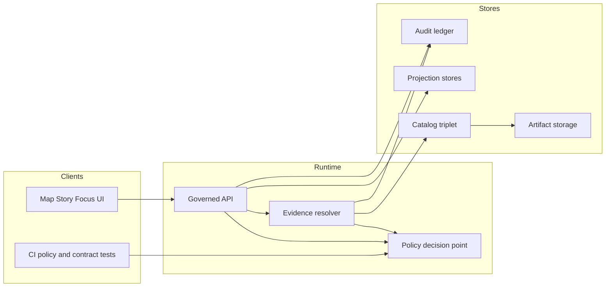

# Policy
Policy-as-code for Kansas Frontier Matrix: access control, sensitivity, rights enforcement, and redaction obligations.

**Status:** Draft (vNext)  
**Owners:** Governance Stewards (see `CODEOWNERS` for this directory)  
**Last reviewed:** 2026-02-22  

`policy-as-code` `fail-closed` `trust-membrane` `audit-ledger` `cite-or-abstain`

- **Jump to:** [Purpose](#purpose) · [Non-negotiable invariants](#non-negotiable-invariants) · [Roles](#roles) ·
  [Policy labels](#policy-labels) · [Obligations](#obligations) · [Enforcement points](#enforcement-points) ·
  [Promotion Contract gates](#promotion-contract-gates) · [Logging and audit](#logging-and-audit) ·
  [Sensitive locations and privacy](#sensitive-locations-and-privacy) · [Rights and licensing](#rights-and-licensing) ·
  [Focus Mode](#focus-mode) · [Changing policy](#changing-policy) · [Directory layout](#directory-layout) ·
  [Definition of Done](#definition-of-done)

> WARNING  
> Policy is safety-critical and governance-critical. Treat policy changes like production code:
> reviewed, tested, reversible, and **fail-closed** by default.

---

## Purpose
This directory defines the **enforcement rules** and **test fixtures** that make KFM “governed” in practice.

Policy determines:
- Who can see what (access control)
- What must be transformed or withheld (redaction/generalization obligations)
- What may be exported or published (rights + licensing + sensitivity gates)
- How to respond safely when access is denied (policy-safe messaging + no side-channel leakage)

KFM requires **shared semantics in CI and runtime**: policy behavior tested in CI must match runtime enforcement behavior; otherwise CI guarantees are meaningless.

[Back to top](#policy)

---

## Trust membrane overview
All storage and data services are behind a governed enforcement boundary. Clients never access storage or databases directly.



[Back to top](#policy)

---

## Non-negotiable invariants
These invariants are enforced by policy, tests, and governed API behavior:

1. **Trust membrane**
   - Clients do **not** access storage/DB directly.
   - The governed API is the enforcement boundary.
2. **Fail-closed posture**
   - Default deny for restricted and sensitive-location materials.
   - Promotion/publish/export are blocked unless gates pass.
3. **No leakage**
   - Users must not be able to infer restricted dataset existence through error differences, response timing, or “ghost metadata.”
4. **Obligations are first-class**
   - If access is allowed only with redaction/generalization, the system returns obligations and applies them consistently.
   - Redaction/generalization transforms are recorded as provenance.
5. **Cite-or-abstain**
   - Focus Mode (and any narrative publishing) must provide verifiable citations or abstain in policy-safe terms.
6. **Policy semantics are consistent across CI and runtime**
   - Policy tests run in CI and must block merges when failing.

[Back to top](#policy)

---

## Roles
Baseline roles are defined to make governance operational. The exact role model may evolve, but KFM starts with a minimal set.

| Role | Typical capabilities | Key constraints |
|---|---|---|
| Public user | Read public layers/stories; Focus Mode limited to public evidence | Cannot access restricted evidence; must not infer restricted existence |
| Contributor | Propose datasets and stories; draft content | Cannot promote/publish |
| Reviewer Steward | Approves promotions and story publishing; owns policy labels and redaction rules | Responsible for fail-closed decisions; cannot waive audit requirements |
| Operator | Runs pipelines and manages deployments | Cannot override policy gates |
| Governance council Community stewards | Authority to control culturally sensitive materials and public representations | Sets rules for restricted collections and harm minimization |

> NOTE  
> If your repo implements roles differently (OIDC groups, ABAC attributes, partner roles), update policy inputs and fixtures accordingly, but keep the invariants.

[Back to top](#policy)

---

## Policy labels
KFM uses a **controlled vocabulary** for `policy_label`. This is the starter set:

- `public`
- `public_generalized`
- `restricted`
- `restricted_sensitive_location`
- `internal`
- `embargoed`
- `quarantine`

> NOTE  
> Labels are classification inputs for policy decisions. Exact semantics live in the policy bundle and fixtures.
> Any label change is a governance change and requires review + CI pass.

### Suggested label intent
This section describes typical intent and must match the actual policy bundle.

| policy_label | Typical intent |
|---|---|
| public | Public safe, exportable per license |
| public_generalized | Public representation derived from restricted inputs using approved generalization |
| restricted | Access limited to approved roles; exports tightly controlled |
| restricted_sensitive_location | Restricted with additional constraints against precise geometry disclosure |
| internal | Visible to internal roles; not public |
| embargoed | Not public until an embargo date or decision |
| quarantine | Not promoted; used for incomplete, unclear rights, or failing QA |

[Back to top](#policy)

---

## Obligations
**Obligations** are mandatory actions that accompany an allow decision. They are used to:
- show required notices in the UI
- apply geometry generalization
- redact fields or suppress outputs
- enforce attribution and license display
- prevent export or limit resolution

Example obligation (illustrative):

```json
{
  "type": "show_notice",
  "message": "Geometry generalized due to policy."
}
```

> WARNING  
> Obligations must be applied consistently across all surfaces:
> - evidence resolver bundles
> - map feature inspection
> - tiles and downloads
> - story publishing
> - Focus Mode outputs

[Back to top](#policy)

---

## Enforcement points
Policy is evaluated at a **Policy Decision Point** and enforced by **Policy Enforcement Points**.

### Policy decision point
A typical pattern is a policy engine running:
- in-process
- as a sidecar
- or as a network service

> NOTE  
> OPA/Rego is a common PDP choice, but any engine is acceptable if semantics + fixtures are identical in CI and runtime.

### Policy enforcement points
- **CI**: schema validation + policy tests block merges
- **Runtime API**: policy checks before serving data, tiles, exports, or story publishing
- **Evidence resolver**: policy checks before resolving EvidenceRefs into EvidenceBundles
- **UI**: displays policy badges and notices, but does **not** make policy decisions

[Back to top](#policy)

---

## Policy input and decision contract
The policy bundle must define a stable decision contract.

### Example policy input
```json
{
  "user": { "role": "public" },
  "action": "read",
  "resource": {
    "policy_label": "public",
    "dataset_version_id": "kfm://dataset/example@sha256:..."
  }
}
```

### Example decision output
```json
{
  "decision": "allow",
  "policy_label": "public",
  "obligations": [],
  "reason_codes": ["ALLOW_PUBLIC_READ"],
  "audit_ref": "kfm://audit/entry/..."
}
```

### Example Rego policy and tests
```rego
package kfm.authz

default allow = false

# Input shape:
# input.user.role
# input.resource.policy_label
# input.action

allow {
  input.user.role == "steward"
}

allow {
  input.user.role == "public"
  input.action == "read"
  input.resource.policy_label == "public"
}

# Obligations: if dataset is public_generalized, record obligation for UI notice
obligations[o] {
  input.resource.policy_label == "public_generalized"
  o := {"type": "show_notice", "message": "Geometry generalized due to policy."}
}
```

```rego
package kfm.authz_test

import data.kfm.authz

test_public_can_read_public {
  authz.allow with input as {
    "user": {"role": "public"},
    "action": "read",
    "resource": {"policy_label": "public"}
  }
}

test_public_cannot_read_restricted {
  not authz.allow with input as {
    "user": {"role": "public"},
    "action": "read",
    "resource": {"policy_label": "restricted"}
  }
}
```

[Back to top](#policy)

---

## Promotion Contract gates
Policy is not only runtime authz. It also defines **promotion and publishing gates**.

KFM’s truth path uses lifecycle zones:
- `raw`
- `work`
- `processed`
- `catalog`
- `published`

A dataset version is not served to runtime surfaces until it passes the Promotion Contract gates.

### Minimum gates
| Gate | What it prevents | Minimum checks |
|---|---|---|
| Gate A Identity and versioning | “mystery data” and unstable IDs | stable dataset_version_id and digests |
| Gate B Licensing and rights | reuse without permission | license + rights holder recorded; export attribution |
| Gate C Sensitivity and redaction plan | sensitive disclosure | policy_label set; approved generalization/redaction |
| Gate D Catalog validation | broken evidence and provenance | DCAT STAC PROV profile validation and cross-links |

> NOTE  
> Some plans include additional gates (run receipts, checksum validation, policy contract tests). Keep the gate list in sync with pipeline CI.

[Back to top](#policy)

---

## Logging and audit
Every governed operation must emit an audit record (append-only) with:
- who (principal, role)
- what (endpoint, parameters)
- when (time)
- why (purpose if declared)
- inputs and outputs by digest
- policy decisions (allow/deny, obligations, reason codes)

Audit logs are themselves sensitive and must be protected with access controls and redaction.

[Back to top](#policy)

---

## Error handling and no leakage
Denied access must be communicated in **policy-safe** terms without exposing restricted existence.

Guidelines:
- align 403/404 behavior to avoid inference
- return a stable error model with `error_code`, `message`, and `audit_ref`
- never show “ghost metadata” that reveals restricted items unless policy explicitly allows it
- ensure UI explanations do not leak restricted details

[Back to top](#policy)

---

## Sensitive locations and privacy
Default posture for sensitive-location materials:
- deny by default unless a role is authorized
- do not embed precise coordinates in Story Nodes or Focus Mode outputs unless explicitly allowed
- if a public representation is permitted, publish a separate `public_generalized` dataset version
- treat redaction/generalization as a first-class transform recorded in provenance

Trigger additional governance review when content involves:
- culturally sensitive materials
- Indigenous histories and community constraints
- restricted sites or vulnerable infrastructure

[Back to top](#policy)

---

## Rights and licensing
Key principle: online availability does not equal permission to reuse.

Operational rules:
- promotion requires license and rights holder recorded for every distribution
- metadata-only cataloging is allowed when mirroring is not permitted
- export functions must include attribution and license text automatically
- story publishing is blocked if rights are unclear for included media

[Back to top](#policy)

---

## Focus Mode
Focus Mode is governed evidence-led AI.

Rules:
- citations must be verified and policy-filtered before synthesis
- if citations cannot be verified, the correct behavior is to abstain
- abstention is a feature: show policy-safe “why,” suggest safe alternatives, include `audit_ref`
- record model identifier, prompt version, retrieval configuration, and policy engine version in run receipts

[Back to top](#policy)

---

## Changing policy
Policy changes can affect access, safety, and public outputs. Use a PR-based workflow.

1. Update policy rules in the policy bundle.
2. Add or update fixtures for allow/deny cases and obligations.
3. Run policy tests locally.
4. Ensure CI policy tests and contract tests pass.
5. Obtain steward review and merge approval.

> TIP  
> Keep fixtures small and explicit. Every important rule should have at least:
> - an allow case
> - a deny case
> - an obligation case if applicable
> - a side-channel test case where error differences might leak restricted existence

[Back to top](#policy)

---

## Directory layout
This is an expected layout. Adjust to match your repository, but keep the same governance artifacts.

```text
policy/
  README.md
  bundle/                 # Policy rules (OPA/Rego or equivalent)
  fixtures/               # Policy decision fixtures (input -> expected decision)
  vocab/                  # Controlled vocab lists (policy_label, artifact.zone, citation.kind)
  rubrics/                # Licensing and sensitivity rubrics; generalization guidelines
  tests/                  # Policy unit tests + contract tests run in CI
  docs/                   # Review workflows; audit retention and access policy
```

Required governance artifacts include:
- policy bundle repository
- test fixtures for allow/deny + obligations
- licensing classification rubric
- sensitivity rubric and generalization guidelines
- review workflow definition (Promotion Queue + Story Review Queue)
- audit ledger retention and access policy

[Back to top](#policy)

---

## Definition of Done
A policy change is “done” only when:

- [ ] Policy bundle updated
- [ ] Fixtures added or updated for allow/deny/obligations
- [ ] CI policy tests pass and block merges on failure
- [ ] Contract tests cover governed API and evidence resolver behavior
- [ ] No-leakage tests cover 403/404 parity and ghost metadata risks
- [ ] Documentation updated in this README or linked policy docs
- [ ] Steward review completed
- [ ] Change is reversible (clear rollback path)

[Back to top](#policy)
