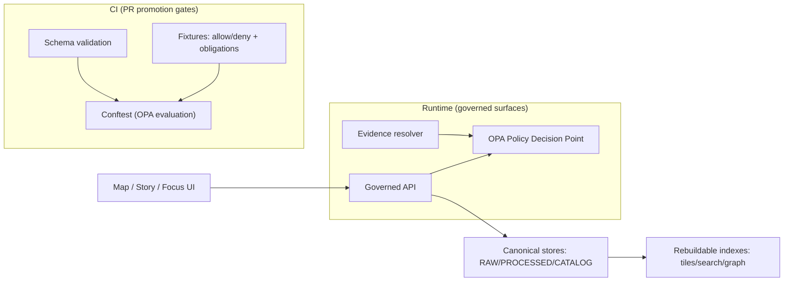

<!-- [KFM_META_BLOCK_V2]
doc_id: kfm://doc/1a3de8cd-b8a7-40f9-9cc4-1e7a65a08e7c
title: policy README
type: standard
version: v1
status: draft
owners: TBD
created: 2026-02-22
updated: 2026-02-22
policy_label: public
related:
  - kfm://doc/KFM-GDG-2026
  - kfm://doc/KFM-IB5-2026
tags: [kfm, policy, governance, opa, rego]
notes:
  - This README documents the policy boundary and fail-closed promotion gates.
  - If anything is unclear (rights/sensitivity/identity), default-deny.
[/KFM_META_BLOCK_V2] -->

# Policy

Policy-as-code for **promotion gates**, **access control**, **licensing**, **sensitivity**, and **redaction obligations** — enforced consistently in **CI** and **runtime**.

**Status:** draft • **Owners:** TBD (Steward + Policy Engineer) • **Last updated:** 2026-02-22


---

## Navigate

- [What lives in policy](#what-lives-in-policy)
- [Non-negotiable invariants](#non-negotiable-invariants)
- [Where policy runs](#where-policy-runs)
- [Policy labels](#policy-labels)
- [Promotion Contract v1 gates](#promotion-contract-v1-gates)
- [Roles and authorization](#roles-and-authorization)
- [Licensing and rights enforcement](#licensing-and-rights-enforcement)
- [Sensitivity and redaction](#sensitivity-and-redaction)
- [Audit and run receipts](#audit-and-run-receipts)
- [Repo layout](#repo-layout)
- [Local development](#local-development)
- [Playbooks](#playbooks)
- [Change management](#change-management)
- [Glossary](#glossary)

---

## What lives in policy

This directory exists to turn **governance intent into enforceable behavior**.

**MUST exist (minimum governance artifacts):**
- Policy bundle repository (OPA/Rego or equivalent)
- Policy decision fixtures (allow/deny + obligations)
- Licensing classification rubric
- Sensitivity rubric and generalization guidelines
- Review workflow definition (Promotion Queue + Story Review Queue)
- Audit ledger retention and access policy

> NOTE  
> Policy is a production interface: APIs, pipelines, and UI rely on its **stable semantics**. If CI and runtime policy semantics diverge, CI guarantees are meaningless.

[Back to top](#navigate)

---

## Non-negotiable invariants

These are “fail closed” invariants. If a change would violate them, the change is not mergeable.

- **Trust membrane:** UI/clients never fetch from object storage or databases directly. All access goes through governed APIs (policy boundary).
- **Truth path zones:** RAW → WORK/QUARANTINE → PROCESSED → CATALOG/TRIPLET → PUBLISHED.
- **Promotion Contract:** promotion is blocked unless required artifacts exist and validate.
- **Evidence-first UX:** layers, story claims, and AI-assisted answers are backed by resolvable evidence bundles.
- **Cite-or-abstain Focus Mode:** responses must cite resolvable evidence or abstain.

[Back to top](#navigate)

---

## Where policy runs

KFM requires the **same policy outcomes in CI and runtime**, using shared fixtures.



**Policy Enforcement Points:**
- **CI:** schema validation + policy tests block merges.
- **Runtime API:** policy checks before serving data, tiles, exports, story nodes.
- **Evidence resolver:** policy checks before resolving and returning bundles.
- **UI:** displays policy badges and notices; **UI never decides policy**.

[Back to top](#navigate)

---

## Policy labels

Policy labels are the primary classification input. Evaluation returns **allow/deny** plus **obligations** and **reason codes**.

### Controlled vocabulary

Starter `policy_label` values:

- `public`
- `public_generalized`
- `internal`
- `restricted`
- `restricted_sensitive_location`
- `embargoed`
- `quarantine`

> WARNING  
> If a dataset’s rights or sensitivity are unclear, treat it as `quarantine` and block promotion.

### Meaning and default posture

| policy_label | Default posture | Typical handling | Public derivative expected |
|---|---:|---|---:|
| `public` | allow read | normal serving; attribution required | no |
| `public_generalized` | allow read with obligations | serve generalized geometry + UI notice | n/a |
| `internal` | deny to public | visible to authorized roles only | maybe |
| `restricted` | deny to public | role-gated; do not leak existence in errors | maybe |
| `restricted_sensitive_location` | deny to public | precise geometry restricted; protect against reverse engineering | yes, if allowed |
| `embargoed` | deny until release | time/condition-gated access | maybe |
| `quarantine` | deny | not promotable; remediation required | no |

[Back to top](#navigate)

---

## Promotion Contract v1 gates

Promotion moves a dataset version from RAW/WORK into PROCESSED + CATALOG/TRIPLET, and therefore into runtime surfaces.

A dataset version promotion **MUST** be blocked unless all required artifacts exist and validate.

### Gates A–G

| Gate | Fail-closed requirement | Where enforced |
|---|---|---|
| A Identity and versioning | Dataset ID stable; DatasetVersion ID immutable and derived from a stable `spec_hash` | CI + runtime admission |
| B Licensing and rights metadata | License explicit + compatible; rights holder + attribution captured; unclear license stays quarantined | CI |
| C Sensitivity and redaction plan | `policy_label` assigned; sensitive/restricted data has a redaction/generalization plan recorded in PROV | CI + steward review |
| D Catalog triplet validation | DCAT + STAC + PROV exist, validate against profiles, and cross-links resolve | CI |
| E Run receipt and checksums | run receipts exist; inputs/outputs enumerated with checksums; environment recorded | CI + audit |
| F Policy tests and contract tests | OPA policy tests pass; evidence resolver resolves representative EvidenceRefs; API contracts validate | CI |
| G Production posture | SBOM + build provenance; perf smoke checks; a11y smoke checks | CI (recommended) |

### Minimal promotion manifest

Promotion manifests describe a dataset version release and support reproducibility.

```json
{
  "kfm_promotion_manifest_version": "v1",
  "dataset_slug": "example_dataset",
  "dataset_version_id": "2026-02.abcd1234",
  "spec_hash": "sha256:abcd1234",
  "released_at": "2026-02-20T13:00:00Z",
  "artifacts": [
    { "path": "events.parquet", "digest": "sha256:2222", "media_type": "application/x-parquet" }
  ],
  "catalogs": [
    { "path": "dcat.jsonld", "digest": "sha256:4444" },
    { "path": "stac/collection.json", "digest": "sha256:5555" }
  ],
  "qa": { "status": "pass", "report_digest": "sha256:7777" },
  "policy": { "policy_label": "public", "decision_id": "kfm://policy_decision/xyz" },
  "approvals": [
    { "role": "steward", "principal": "<id>", "approved_at": "2026-02-20T12:59:00Z" }
  ]
}
```

[Back to top](#navigate)

---

## Roles and authorization

### Baseline roles

- **Public user:** reads public layers/stories; Focus Mode limited to public evidence.
- **Contributor:** proposes datasets/stories; drafts content; cannot publish.
- **Steward:** approves promotions and story publishing; owns policy labels and redaction rules.
- **Operator:** runs pipelines and manages deployments; cannot override policy gates.
- **Governance council / community stewards:** authority over culturally sensitive materials; sets rules for restricted collections and public representations.

### Decisions needed

- Which identity provider (OIDC) will be used?
- Which roles exist in the identity system and how they map to KFM roles?
- Whether attribute-based access control (ABAC) is required for partner datasets.

**Recommended default:** OIDC + RBAC with policy labels; add ABAC only when required.

[Back to top](#navigate)

---

## Licensing and rights enforcement

Key principle: **online availability does not equal permission to reuse**.

Operational rules:
- Promotion requires explicit license and rights holder for every distribution.
- **Metadata-only reference** is allowed: catalog an item without mirroring it if rights do not allow.
- Export functions must include attribution and license text automatically.
- Story publishing must be blocked if rights are unclear for included media.

[Back to top](#navigate)

---

## Sensitivity and redaction

### Default rules

- Default deny for `restricted` and `restricted_sensitive_location`.
- If any public representation is allowed, produce a separate `public_generalized` dataset version.
- Never leak restricted metadata in error behavior (including 403/404 distinctions).
- Do not embed precise coordinates in Story Nodes or Focus Mode outputs unless policy explicitly allows.
- Treat redaction/generalization as a first-class transform recorded in PROV.

### Sensitive location release playbook

For archaeology and other sensitive location datasets:
1. Classify as `restricted_sensitive_location`
2. Produce dual outputs:
   - restricted precise dataset version
   - `public_generalized` dataset version (if allowed)
3. Choose and document generalization method (grid aggregation, dissolve, etc.)
4. Test that no precise coordinates leak (including in tiles and exports)
5. Add UX notice that geometry is generalized and why
6. Governance review approval by council or designated authority

### PII and reidentification risk

Some datasets have reidentification risk even without explicit PII.

Minimum guidance:
- Do not publish individual-level records publicly.
- Aggregate to safe geographies and apply minimum count thresholds.
- Document thresholds as policy obligations.
- Keep raw data restricted even if aggregated outputs are public.

[Back to top](#navigate)

---

## Audit and run receipts

Run receipts and audit logs are governance artifacts.

### Run receipt

A run receipt is emitted for every **pipeline run** (and for Focus Mode queries).

```json
{
  "run_id": "kfm://run/2026-02-20T12:00:00Z.abcd",
  "actor": { "principal": "svc:pipeline", "role": "pipeline" },
  "operation": "ingest+publish",
  "dataset_version_id": "2026-02.abcd1234",
  "inputs": [{ "uri": "raw/source.csv", "digest": "sha256:1111" }],
  "outputs": [{ "uri": "processed/events.parquet", "digest": "sha256:2222" }],
  "environment": {
    "container_digest": "sha256:img...",
    "git_commit": "deadbeef",
    "params_digest": "sha256:3333"
  },
  "validation": { "status": "pass", "report_digest": "sha256:7777" },
  "policy": { "decision_id": "kfm://policy_decision/xyz" },
  "created_at": "2026-02-20T12:05:00Z"
}
```

### Audit log protections

Audit logs may contain sensitive operational details.

Rules:
- Logs are append-only
- Logs are redacted for PII and restricted info
- Log access is restricted to stewards/operators
- Retention and deletion policies are defined and enforced

[Back to top](#navigate)

---

## Repo layout

This README documents the intended structure. If your repo differs, update the tree but preserve the **contract surfaces** (policy bundle + fixtures + tests).

```text
policy/
├─ README.md
├─ opa/                      # Rego modules (PDP logic)
│  ├─ authz.rego
│  ├─ license.rego
│  ├─ sensitivity.rego
│  ├─ promotion_gates.rego
│  └─ README.md              # Optional: policy pack index
├─ data/                     # Policy data inputs (versioned)
│  ├─ controlled_vocab/      # policy_label, artifact.zone, etc.
│  ├─ license_allowlist/     # SPDX/terms allow/deny lists
│  └─ agreements/            # Partner terms encoded as inputs
├─ fixtures/                 # Test fixtures for decisions and obligations
│  ├─ authz/
│  ├─ license/
│  ├─ sensitivity/
│  └─ promotion/
└─ tests/                    # Optional: helper scripts / harness
```

[Back to top](#navigate)

---

## Local development

### Run policy tests

Typical Conftest invocation:

```bash
conftest test fixtures -p policy/opa
```

Example targeted test:

```bash
conftest test fixtures/run_receipt.json -p policy/opa
```

### Adding a new rule

Checklist:
- [ ] Add/modify the Rego rule (deny-by-default)
- [ ] Add fixtures for **allow**, **deny**, and any **obligations**
- [ ] Add tests and ensure they run in CI and block merges
- [ ] Ensure CI and runtime use the same fixtures/outcomes
- [ ] Update controlled vocab if new labels/reason codes are introduced
- [ ] Record policy bundle digest/version in audit outputs

[Back to top](#navigate)

---

## Playbooks

### Story governance

For Story Nodes:
- Draft → review → publish
- Review checklist includes:
  - citations resolve
  - rights verified
  - sensitivity scan passed
  - interpretive claims labeled

For contested topics:
- include multiple sources
- include uncertainty notes
- consider publishing multiple perspectives as linked story nodes

### Appeals and corrections

KFM should support a corrections workflow:
- users report errors (include story_id and audit_ref)
- stewards triage to:
  - correction (new version)
  - retraction (unpublish or mark invalid)
  - clarification (add notes)
- all actions recorded in audit ledger
- UI shows last corrected information

[Back to top](#navigate)

---

## Change management

Policy changes are behavior changes.

**Required discipline:**
- Changes are PR-reviewed by stewards (and governance council for sensitive materials).
- Policies are versioned; policy decisions can be traced to the policy bundle digest/hash in effect.
- Any new policy label, reason code, or obligation type requires:
  - fixtures
  - documentation update
  - CI tests
  - runtime compatibility review

[Back to top](#navigate)

---

## Glossary

- **OPA / Rego:** policy engine + language used for CI gates and runtime checks.
- **PDP:** Policy Decision Point (evaluates allow/deny and obligations).
- **PEP:** Policy Enforcement Point (place where decisions are enforced).
- **Obligation:** required follow-on action (generalize geometry, remove attributes, show notice).
- **Promotion Contract:** fail-closed gates required to publish dataset versions.

---
