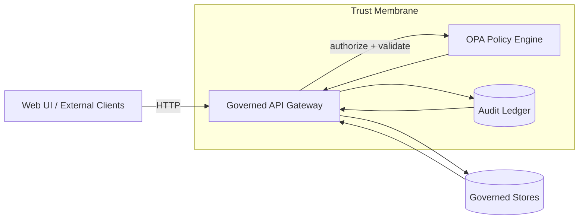

<!--
File: policy/README.md

KFM Policy Library (OPA/Rego)
- Source of truth for authorization + output validation + CI governance gates.
- Keep policies deterministic, testable, and fail-closed.
-->

# 🛡️ KFM Policy Library (OPA/Rego)

<!-- ========================= -->
<!-- Badges (repo-agnostic)     -->
<!-- ========================= -->

[](#-kfm-policy-library-oparego)
[](#default-deny-and-fail-closed)
[](#default-deny-and-fail-closed)
[](#focus-mode-cite-or-abstain)
[](#sensitivity-and-redaction)
[](#ci-policy-gates)

<!-- ========================= -->
<!-- Badges (repo-scoped)       -->
<!-- Replace ORG/REPO + files   -->
<!-- ========================= -->

<!--
> [!TIP]
> If you know the GitHub org/repo slug, uncomment and replace `ORG/REPO` and the workflow filenames.

[](https://github.com/ORG/REPO/actions/workflows/ci.yml)
[](https://github.com/ORG/REPO/actions/workflows/codeql.yml)
[](https://codecov.io/gh/ORG/REPO)
[](../LICENSE)
[](https://securityscorecards.dev/viewer/?uri=github.com/ORG/REPO)
-->

---

## What lives here

This `policy/` directory is the **governed policy source of truth** for KFM:

- **Runtime authorization** (e.g., dataset access; restricted fields; sensitive-location precision rules)
- **Runtime output validation** (e.g., Focus Mode “cite-or-abstain”)
- **CI governance gates** (e.g., block merges when required provenance/metadata is missing)

> [!IMPORTANT]
> Policies are part of KFM’s *trust membrane*. They must be treated as security-critical code.

---

<details>
<summary><strong>Table of contents</strong></summary>

- [🧭 Goals and invariants](#-goals-and-invariants)
- [Trust membrane placement](#trust-membrane-placement)
- [Default deny and fail-closed](#default-deny-and-fail-closed)
- [Policy domains](#policy-domains)
- [Focus Mode: cite-or-abstain](#focus-mode-cite-or-abstain)
- [Sensitivity and redaction](#sensitivity-and-redaction)
- [Policy input/output contracts](#policy-inputoutput-contracts)
- [Recommended folder layout](#recommended-folder-layout)
- [CI policy gates](#ci-policy-gates)
- [Audit + policy versioning](#audit--policy-versioning)
- [Emergency deny switch](#emergency-deny-switch)
- [Contributing](#contributing)
- [Troubleshooting](#troubleshooting)
- [Glossary](#glossary)

</details>

---

## 🧭 Goals and invariants

KFM’s credibility relies on **governed access** and **evidence-first outputs**. Policy exists to make these guarantees enforceable and testable.

### Non-negotiables (must remain true)

- **No bypass of the trust membrane** (clients do not access stores directly; all access is mediated by the governed API + policy boundary).
- **Policy checks fail closed** (deny when uncertain).
- **Dataset promotion requires standards metadata** (STAC/DCAT/PROV as applicable).
- **Focus Mode must cite or abstain** (no ungrounded answers).

> [!NOTE]
> If you’re proposing a policy change that weakens any invariant above, treat it as a governance event and expect maintainers to request redesign.

---

## Trust membrane placement

Policy is evaluated at the boundary that separates:
- “**outside**” clients (UI, external consumers) and
- “**inside**” governed stores (PostGIS/Neo4j/Search/Object store) and governed services.



> [!WARNING]
> Any code path that retrieves data and returns it to a client **without** a policy decision is a *policy bypass* and should be treated as a Sev-0 security bug.

---

## Default deny and fail-closed

All core policy modules should follow **default deny** and only allow access on explicit conditions.

```rego
package kfm.example

default allow := false

allow if {
  input.actor.role == "admin"
}
```

Fail-closed means:
- missing input keys ⇒ **deny**
- unknown sensitivity label ⇒ **deny**
- policy engine unavailable ⇒ **deny**
- evidence cannot be resolved (for Focus Mode) ⇒ **abstain** (with audit trail)

---

## Policy domains

| Domain | What it governs | Typical enforcement point |
|---|---|---|
| **Data access** | Who can access which dataset/version/fields | API gateway before query execution |
| **Sensitivity + precision** | Prevent leakage of sensitive locations / private fields | API response shaping / redaction obligations |
| **Publishing/promotion** | Prevent promotion of datasets missing required catalogs | CI gates + dataset promotion workflow |
| **Focus Mode output** | Cite-or-abstain + sensitivity checks for answers | Before returning response to client |
| **Audit integrity** | Ensure responses include audit reference and evidence hash | API response wrapper + CI tests |

---

## Focus Mode: cite-or-abstain

Focus Mode responses must be **evidence anchored**. A minimal allow rule for AI output validation should require:
- citations are present
- sensitivity check passes

```rego
package kfm.ai

default allow := false

allow if {
  input.answer.has_citations == true
  input.answer.sensitivity_ok == true
}
```

Recommended behavior when evidence is insufficient:

- return an **abstain response** (no citations)
- still return an **audit_ref** so the interaction is traceable

> [!TIP]
> Treat “abstain” as a *successful safety outcome*, not an error. The audit trail is the product.

---

## Sensitivity and redaction

KFM must treat some data as sensitive (examples include private ownership, precise archaeological site locations, and certain health/public-safety indicators). Sensitivity should be enforced via:
- dataset/record/field labels
- derivative datasets for redacted/generalized outputs
- fail-closed policy checks

### Recommended sensitivity classes

| Class | Meaning | Typical public behavior |
|---|---|---|
| `public` | Safe to publish | Serve as-is |
| `restricted` | Requires role-based access | Deny or remove restricted fields |
| `sensitive-location` | Coordinates must be generalized/suppressed | Serve generalized derivative only |
| `aggregate-only` | Only publish above thresholds | Suppress small counts / return aggregated derivative |

### Redaction is a first-class transformation

When data is redacted/generalized:
- **raw** dataset remains immutable
- **redacted derivative** becomes its own dataset/version (often new `dataset_id`)
- transformation must be recorded in **PROV** so the lineage is auditable

> [!IMPORTANT]
> “Redaction” is not a view-layer hack. It is governed data production.

---

## Policy input/output contracts

Policy evaluation must be **portable** across:
- CI (static checks)
- runtime (API authorization + output validation)

### Recommended input shape (illustrative)

```json
{
  "actor": {
    "role": "public|reviewer|admin",
    "attributes": { "org": "…", "scopes": ["…"] }
  },
  "request": {
    "endpoint": "/api/v1/ai/query",
    "method": "POST",
    "context": { "bbox": [0,0,0,0], "time_range": ["…","…"] }
  },
  "resource": {
    "kind": "dataset|story|layer|focus_answer",
    "id": "dataset_…",
    "sensitivity": "public|restricted|sensitive-location|aggregate-only"
  },
  "answer": {
    "text": "…",
    "has_citations": true,
    "citations": [{ "ref": "…" }],
    "sensitivity_ok": true
  }
}
```

### Recommended decision shape (suggested)

```json
{
  "allow": false,
  "reason_codes": ["DEFAULT_DENY", "SENSITIVITY_RESTRICTED"],
  "obligations": [
    { "type": "redact_fields", "fields": ["owner_name"] },
    { "type": "generalize_geometry", "precision": "coarse" }
  ]
}
```

> [!NOTE]
> If you add a new obligation type, you must also add an implementation handler in the API boundary layer and tests proving it is applied.

---

## Recommended folder layout

> [!TIP]
> If your repo already has a policy layout, keep it—but map it to these responsibilities.

```text
policy/
  README.md

  rego/
    kfm/
      ai.rego                # Focus Mode cite-or-abstain + output validation
      data.rego              # dataset access rules
      publish.rego           # dataset promotion / publishing gates (CI + runtime)
      audit.rego             # audit requirements (presence, shape, etc.)

  tests/
    kfm_ai_test.rego
    kfm_data_test.rego
    fixtures/
      inputs/
      expected/

  schemas/
    policy_input.schema.json
    audit_record.schema.json

  bundles/
    # (optional) built OPA bundles emitted by CI
```

---

## CI policy gates

Policy must be enforced in CI to prevent governance regressions.

### Required CI behaviors

- **OPA unit tests** run for every PR.
- A **policy regression suite** exists:
  - “golden queries” that previously leaked restricted fields must **fail forever**
  - negative tests ensure sensitive-location layers cannot be returned at high precision to unauthorized roles
  - field-level tests verify redaction of ownership/health small counts/exact archaeological coordinates
  - audit integrity tests ensure every response carries an audit reference and evidence bundle hash

### Typical local commands

```bash
# 1) Run OPA unit tests (module tests)
opa test -v ./policy/rego ./policy/tests

# 2) Run Conftest (policy checks against repo files)
#    - Example: enforce required metadata for datasets / docs
conftest test . -p ./policy/rego
```

> [!WARNING]
> If CI passes without running policy checks, the trust membrane is effectively optional—treat as a build break.

---

## Audit + policy versioning

Every governed response should be traceable to:
- the **audit record** (audit_ref)
- the **evidence pack / bundle hash**
- the **policy bundle hash** (or equivalent) that made the decision

This enables accountability: “what decision was made under which policy version.”

> [!TIP]
> Prefer logging decision metadata (reason codes + policy hash) over logging sensitive request payloads.

---

## Emergency deny switch

Maintain an emergency policy switch that can disable:
- public endpoints
- Focus Mode
- specific datasets/layers

…without deploying application code.

> [!IMPORTANT]
> The emergency deny switch is a safety feature. Test it during incident drills.

---

## Contributing

### ✅ Policy PR checklist

- [ ] Policy change is scoped and reversible.
- [ ] Default-deny preserved (no blanket allows).
- [ ] New rules include **OPA unit tests** (both allow + deny cases).
- [ ] Regression coverage added if the change fixes a leak.
- [ ] Sensitivity/redaction obligations (if any) are implemented **and** tested at the API boundary.
- [ ] Any new/changed input fields are reflected in `schemas/policy_input.schema.json`.
- [ ] If behavior affects user-visible output, ensure audit + evidence handling remain intact.

### Style guidance (Rego)

- Keep rules small and composable.
- Prefer explicit `reason_codes`.
- Avoid non-determinism; avoid time-dependent rules unless the time input is explicit and testable.
- Keep policy data (roles, dataset labels) in structured inputs or data documents rather than hardcoding.

---

## Troubleshooting

<details>
<summary><strong>“Why did this request get denied?”</strong></summary>

1. Look at the API response `audit_ref`.
2. Inspect decision logs for:
   - `reason_codes`
   - policy bundle hash / version
3. Re-run locally with a captured policy input:

```bash
opa eval -f pretty -d ./policy/rego \
  "data.kfm.data.allow" \
  -i ./policy/tests/fixtures/inputs/deny_case.json
```

</details>

<details>
<summary><strong>“OPA is down—what should happen?”</strong></summary>

Fail closed:
- requests that require policy decisions are denied (or abstained, for Focus Mode),
- audit logs record the failure mode.

</details>

---

## Glossary

- **OPA**: Open Policy Agent (policy engine for Rego).
- **Rego**: Policy language used by OPA.
- **Trust membrane**: Governed boundary where policy + audit enforce access and evidence rules.
- **Default deny**: Security posture where access is denied unless explicitly allowed.
- **Fail closed**: On error/unknowns, deny rather than allow.
- **Cite-or-abstain**: Focus Mode must provide citations or return an abstention response.

---

### See also

- `../docs/` (governed documentation and Story Nodes)
- `../data/` (raw/work/processed zones + catalogs)
- `../src/` (API/services + OPA adapters)
- `../web/` (React/TS UI)