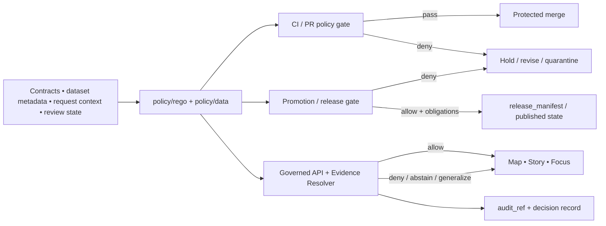

<!-- [KFM_META_BLOCK_V2]
doc_id: kfm://doc/NEEDS_VERIFICATION_UUID
title: Policy
type: standard
version: v1
status: draft
owners: NEEDS VERIFICATION
created: YYYY-MM-DD
updated: YYYY-MM-DD
policy_label: public
related: ["../README.md", "../CONTRIBUTING.md", "../.github/README.md", "../contracts/README.md", "../data/README.md", "../apps/api/README.md"]
tags: [kfm, policy, governance, opa, rego]
notes: ["doc_id, owners, and dates require repo-backed verification before merge", "current repo-visible snapshot for policy/ is minimal; proposed structure below must not be mistaken for mounted fact"]
[/KFM_META_BLOCK_V2] -->

# Policy

Governed policy-as-code surface for KFM publication, runtime access, evidence resolution, redaction/generalization, and fail-closed behavior.

> **Status:** experimental  
> **Owners:** `NEEDS VERIFICATION`  
> **Path:** `policy/README.md`  
>       
> **Quick jump:** [Scope](#scope) · [Repo fit](#repo-fit) · [Accepted inputs](#accepted-inputs) · [Exclusions](#exclusions) · [Directory tree](#directory-tree) · [Quickstart](#quickstart) · [Usage](#usage) · [Diagram](#diagram) · [Rule-pack matrix](#rule-pack-matrix) · [Gates / DoD](#gates--definition-of-done) · [FAQ](#faq) · [Appendix](#appendix)

> [!IMPORTANT]
> `policy/` is intentionally kept in the repository even when thin.  
> This README separates **CONFIRMED** repo-visible state from **PROPOSED** target shape so the directory can grow without pretending that rule bundles, fixtures, or review data already exist on the active branch.

## Scope

`policy/` is where KFM turns governance into executable behavior.

In practice, this directory should hold the rule sources, policy data, fixtures, and decision records that let KFM enforce the same core semantics across CI, promotion, runtime access, evidence resolution, Story publishing, Focus Mode behavior, and redaction/generalization.

For KFM, policy is not a decorative appendix. It is part of the trust membrane.

### Truth posture used in this README

| Marker | Meaning here |
|---|---|
| **CONFIRMED** | Directly visible in the current repo snapshot or stable KFM doctrine |
| **PROPOSED** | Repo-ready target shape consistent with KFM doctrine, but not yet proven as mounted repo fact |
| **UNKNOWN** | Not verified strongly enough to state as current implementation fact |
| **NEEDS VERIFICATION** | Placeholder owner, path, command, or decision that must be checked in the real checkout before merge |

[Back to top](#policy)

## Repo fit

**Path:** `policy/README.md`  
**Directory role:** executable governance surface for policy decisions that affect merge safety, promotion, runtime access, evidence visibility, and safe denials.

| Direction | Surface | Why it matters |
|---|---|---|
| Upstream | [`../README.md`](../README.md) | Root repo contract and cross-directory invariants |
| Upstream | [`../CONTRIBUTING.md`](../CONTRIBUTING.md) | Contribution and review burden for policy-significant change |
| Upstream | [`../contracts/README.md`](../contracts/README.md) | Object schemas and envelopes that policy evaluates but does not replace |
| Upstream | [`../data/README.md`](../data/README.md) | Truth-path artifacts, lifecycle zones, and release-bearing inputs |
| Downstream | [`../apps/api/README.md`](../apps/api/README.md) | Governed API enforcement boundary and runtime policy consumers |
| Downstream | [`../.github/README.md`](../.github/README.md) | Repo-level CI/CD, review, and merge-gate surface |

### What this directory should govern

- allow / deny / abstain decisions
- conditional allow behavior with explicit obligations
- rights and sensitivity gating
- redaction and geometry generalization decisions
- Story and Focus publication/runtime restrictions
- short-lived, auditable exceptions when policy permits them

### What this directory must not become

- a second contracts tree
- a dumping ground for app code
- a hidden source of truth for owners, roles, or schema fields that should live elsewhere
- an unreviewed escape hatch for policy-significant behavior

[Back to top](#policy)

## Accepted inputs

| Input class | What belongs here | Typical examples |
|---|---|---|
| Rule source | Authoritative policy logic by decision surface | `rego/runtime/*.rego`, `rego/publish/*.rego`, `rego/content/*.rego` |
| Policy data | Controlled vocabularies and machine-readable lookup data used by rules | reason codes, obligation codes, reviewer roles, sensitivity tiers, allowlists |
| Fixture packs | Cases that prove fail-closed behavior and regression coverage | `fixtures/allow/*.json`, `fixtures/deny/*.json`, `fixtures/regression/*.json` |
| Decision records | Durable rationale for policy-significant changes or approved exceptions | ADRs, steward notes, signed exception records |
| Local helpers | Small policy-local validation or smoke-test helpers | `tools/local-check.sh`, fixture generators, bundle assembly helpers |
| Directory docs | The contract of the directory itself | this README, reviewer checklist, local authoring notes |

### Minimum expectations for additions here

1. Default deny remains the posture unless a narrower allow rule is explicit.
2. Every new rule path has fixtures.
3. Shared vocabularies are versioned instead of copied into multiple rule files.
4. Runtime and CI semantics stay aligned.
5. Exceptions are bounded, reviewable, and auditable.

## Exclusions

| Does **not** belong in `policy/` | Put it instead | Why |
|---|---|---|
| Canonical object schemas and OpenAPI truth | [`../contracts/`](../contracts/) | Shape and validation are not the same as decision logic |
| Service handlers, auth middleware, UI code | repo apps / packages | Policy must stay separate from implementation plumbing |
| RAW / WORK / PROCESSED artifacts, catalogs, tiles | [`../data/`](../data/) | Policy evaluates governed artifacts; it is not the artifact store |
| Secrets, signing keys, credentials, `.env` files | secret manager / runtime config | Sensitive operational material must not live here |
| One-off notebooks or local scratch experiments | local workspace or dedicated examples/docs path | Reviewability and determinism matter |
| Undocumented hotfixes or silent bypasses | nowhere | KFM policy changes must be reviewable |
| Exhaustive copied rule bodies inside this README | actual rule files | Documentation should explain, not replace, executable policy |

> [!WARNING]
> Do not let UI conditionals, app-side convenience checks, or operator memory become the only place where policy exists.  
> KFM policy must stay **versioned**, **auditable**, and **replayable**.

[Back to top](#policy)

## Directory tree

### Current verified snapshot (**CONFIRMED**)

```text
policy/
└── README.md
```

That is the repo-visible state this README is replacing today.

### Proposed target shape (**PROPOSED**)

```text
policy/
├── README.md
├── rego/
│   ├── shared/
│   │   ├── lib.rego
│   │   └── reasons.rego
│   ├── runtime/
│   │   ├── access.rego
│   │   ├── evidence.rego
│   │   └── focus.rego
│   ├── publish/
│   │   ├── release.rego
│   │   ├── rights.rego
│   │   └── sensitivity.rego
│   └── content/
│       ├── story.rego
│       └── catalog.rego
├── data/
│   ├── reason_codes.json
│   ├── obligation_codes.json
│   ├── reviewer_roles.json
│   └── vocab/
├── fixtures/
│   ├── allow/
│   ├── deny/
│   └── regression/
├── decisions/
│   ├── ADR-*.md
│   └── exceptions/
├── bundles/
│   └── runtime/
└── tools/
    ├── local-check.sh
    └── smoke.sh
```

### Naming guidance

- Organize rule packs by **decision surface**, not by team.
- Keep shared helpers under `rego/shared/`.
- Keep data-only files out of rule-source folders.
- Make fixture names state both the scenario and the expected outcome.

Examples:

- `story_missing_evidence__deny.json`
- `dataset_public_with_license__allow.json`
- `sensitive_location_without_redaction__deny.json`

[Back to top](#policy)

## Quickstart

### 1) Verify the current directory state

```bash
ls -la policy
sed -n '1,120p' policy/README.md
find policy -maxdepth 2 -type f | sort
```

### 2) When rule packs exist, run local fixture tests

```bash
# Verify actual paths before relying on these commands.
conftest test policy/fixtures --policy policy/rego
opa test policy/rego -v
```

### 3) Optional single-input smoke evaluation

```bash
# Example only — replace package/data path with the repo's verified shape.
opa eval \
  -d policy/rego \
  -d policy/data \
  'data.kfm.runtime.allow' \
  -i path/to/input.json
```

> [!NOTE]
> Keep commands small and reviewable.  
> If the real repo chooses different policy paths or wrapper scripts, update this file in the same change set.

## Usage

### Adding a new rule pack

1. Choose the decision surface first: `runtime`, `publish`, `content`, or `shared`.
2. Add the rule source under `policy/rego/<surface>/`.
3. Add shared vocab only once under `policy/data/`.
4. Add at least one passing and one failing fixture.
5. Wire the rule into CI and, where relevant, into the governed API/runtime path.
6. Update this README if the new rule pack changes directory contract, naming, or review burden.

### Changing policy data

Use `policy/data/` for machine-readable rule inputs that should stay stable across rule files:

- reason codes
- obligation codes
- reviewer roles
- sensitivity tiers
- approved exception-agent lists
- allowlists with explicit review ownership

Do **not** hide these values as copied strings in many `.rego` files.

### Exceptions and waivers

Exceptions should be rare, time-bounded, and auditable.

A safe KFM exception path should always answer:

- who approved it
- why it exists
- when it expires
- what evidence or signed record backs it
- what exact rule or surface it narrows

> [!CAUTION]
> A working exception is **not** permission to weaken default deny.  
> It is a governed deviation that must remain visible in review, provenance, and runtime/audit context.

## Diagram


```mermaid
flowchart LR
  Inputs[Contracts • dataset metadata • request context • review state] --> Source[policy/rego + policy/data]
  Source --> CI[CI / PR policy gate]
  Source --> Publish[Promotion / release gate]
  Source --> Runtime[Governed API + Evidence Resolver]

  CI -->|pass| Merge[Protected merge]
  CI -->|deny| Hold[Hold / revise / quarantine]

  Publish -->|allow + obligations| Release[release_manifest / published state]
  Publish -->|deny| Hold

  Runtime -->|allow| Surface[Map • Story • Focus]
  Runtime -->|deny / abstain / generalize| Surface
  Runtime --> Audit[audit_ref + decision record]
```

## Rule-pack matrix

| Decision surface | Typical inputs | Typical outputs | Where enforced |
|---|---|---|---|
| Publication / promotion | `catalog_closure`, rights, sensitivity, review state, `release_manifest` candidates | allow / deny / hold + obligations | CI, steward review, publish lane |
| Runtime access | request context, role/claims, `policy_label`, dataset version, route class | allow / deny / generalized response | governed API |
| Evidence resolution | `EvidenceRef`, `EvidenceBundle` members, rights, release scope | resolvable bundle or fail-closed denial | evidence resolver + runtime |
| Story / Focus | citations, review state, claim class, redaction profile | publish / answer / narrow / abstain | content pipeline + runtime |
| Sensitive location / generalization | geometry, sensitivity flags, stewardship notes | public-safe generalized output or restricted precise hold | publish lane + runtime |
| Exceptions / waivers | signed exception record, approver role, TTL, reason code | bounded allow with audit trail | CI + runtime + review |

### Cross-surface rules that should stay stable

| Rule family | Why it matters |
|---|---|
| **Reason codes** | Prevent ad hoc deny/hold strings from drifting between surfaces |
| **Obligation codes** | Make conditional allow behavior explicit and reusable |
| **Reviewer roles** | Keep separation of duty auditable |
| **Fixture semantics** | Keep CI and runtime behavior aligned |
| **Policy version identity** | Make decisions reconstructable later |

## Gates / Definition of done

A policy change is done when it is not only written, but governable.

- [ ] The real `policy/` tree was checked before merge.
- [ ] Owners, doc ID, and dates were replaced with verified values.
- [ ] The rule pack preserves default deny unless a narrower allow is explicit.
- [ ] Passing, failing, and regression fixtures exist.
- [ ] Reason codes and obligation codes are versioned rather than copied.
- [ ] CI and runtime use the same semantics or the same fixture set.
- [ ] Exceptions are signed or otherwise steward-approved, time-bounded, and auditable.
- [ ] Docs and adjacent repo surfaces were updated together when behavior changed.
- [ ] No secrets, credentials, or copied schema truth were introduced here.
- [ ] The change remains small enough to review without hiding policy drift.

[Back to top](#policy)

## FAQ

### Does this README claim that policy packs already exist in the repo?

No. The current verified repo snapshot for `policy/` is a thin directory containing `README.md` only. Everything beyond that is an explicit proposed growth path.

### Why keep `policy/` separate from `contracts/`?

Because contracts define **what a thing is** and policy decides **what may happen with it**. KFM needs both surfaces, but it should not collapse them into one directory or one tool.

### Should UI code decide policy?

No. UI may display policy state, obligations, or calm failure. It should not become the sovereign decision point.

### What belongs in `policy/data/`?

Small, versioned, machine-readable policy inputs: controlled vocabularies, reviewer-role maps, obligation lists, sensitivity tiers, and similar decision data.

### Where should generated policy bundles live?

Use `policy/bundles/` only if the repo chooses to commit or stage packaged outputs there. Keep source rule files under `policy/rego/` as the human-reviewable source of truth.

## Appendix

<details>
<summary><strong>Open verification backlog and starter file matrix</strong></summary>

### Highest-priority verification checks

1. Confirm the real `policy/` tree from the checked-out repo.
2. Replace placeholder owners and dates.
3. Confirm whether source rule files live under `policy/rego/`, `policy/opa/`, or another verified path.
4. Confirm where policy fixtures live and how CI invokes them.
5. Confirm whether bundled policy outputs are committed, generated in CI, or released elsewhere.
6. Confirm whether reason codes, obligation codes, and reviewer-role maps already exist.

### Proposed starter file matrix

| File or path | Why it may belong here | Commit only after... |
|---|---|---|
| `policy/README.md` | Explains the directory contract | current tree and adjacent links are verified |
| `policy/rego/shared/lib.rego` | Shared helper logic | at least two rule packs need the same helper |
| `policy/rego/runtime/access.rego` | Runtime allow / deny decisions | request inputs and route classes are stable enough to test |
| `policy/rego/runtime/evidence.rego` | Evidence resolution gates | `EvidenceRef` / `EvidenceBundle` contract is stable enough to enforce |
| `policy/rego/content/story.rego` | Story publication rules | story payload and review state are typed elsewhere |
| `policy/rego/content/focus.rego` | Focus Mode citation / abstain logic | runtime envelope and citation model are stable enough to test |
| `policy/rego/publish/release.rego` | Promotion / release decision rules | release-manifest and review artifacts exist or are close to stable |
| `policy/data/reason_codes.json` | Shared deny / hold / abstain codes | decision grammar is agreed across CI and runtime |
| `policy/data/obligation_codes.json` | Reusable conditional allow obligations | runtime surfaces can display obligations cleanly |
| `policy/data/reviewer_roles.json` | Separation-of-duty map | governance owners are ratified |
| `policy/fixtures/allow/*.json` | Happy-path coverage | rule inputs are typed and stable |
| `policy/fixtures/deny/*.json` | Fail-closed coverage | deny semantics are explicit |
| `policy/fixtures/regression/*.json` | Policy drift protection | prior bugs or edge cases have been captured |
| `policy/decisions/ADR-*.md` | Policy-significant rationale | a real policy boundary or behavior changed |
| `policy/decisions/exceptions/*.json` | Signed or steward-approved deviations | TTL, approver, and reason rules are stable |
| `policy/tools/local-check.sh` | Local contributor ergonomics | the repo’s real validators and paths are confirmed |

### Authoring notes

- Prefer relative links.
- Prefer explicit placeholders over invented certainty.
- Prefer one small, reviewable rule pack over a sweeping governance rewrite.
- Keep this README as a navigation and contract surface, not as the canonical home of schema truth or app behavior.

</details>

[Back to top](#policy)
