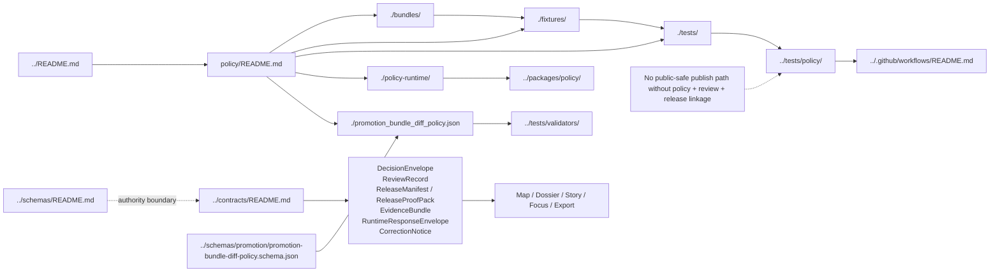

<!-- [KFM_META_BLOCK_V2]
doc_id: kfm://doc/NEEDS_VERIFICATION_UUID
title: Policy
type: standard
version: v1
status: review
owners: @bartytime4life
created: YYYY-MM-DD
updated: 2026-04-13
policy_label: public
related: ["../README.md", "../CONTRIBUTING.md", "../.github/README.md", "../.github/workflows/README.md", "../contracts/README.md", "../schemas/README.md", "../schemas/promotion/promotion-bundle-diff-policy.schema.json", "../data/README.md", "../packages/policy/README.md", "../tests/policy/README.md", "../tests/validators/README.md", "./bundles/README.md", "./fixtures/README.md", "./policy-runtime/README.md", "./tests/README.md", "./promotion_bundle_diff_policy.json"]
tags: [kfm, policy, governance, trust, review, diff-policy]
notes: ["doc_id and created date require repo-backed verification before merge", "updated reflects the promotion_bundle_diff_policy.json surface as a real governed policy artifact indexed by the top-level policy lane", "relative links and lane inventory follow the supplied policy draft plus the newer validator/promotion thin-slice documentation; active-branch validity still needs verification where not directly surfaced", "OPA/Rego remains a documented starter direction for broader policy bundles, while promotion bundle diff classification is now also documented as checked-in JSON policy data"]
[/KFM_META_BLOCK_V2] -->

# Policy

_Governed, executable policy surface for KFM publication, runtime trust, rights and sensitivity handling, visible correction, and checked-in review classifications._

> **Status:** `experimental`  
> **Owners:** `@bartytime4life`  
>        
> **Repo fit:** `policy/README.md` · parent lane for [`./bundles/README.md`](./bundles/README.md), [`./fixtures/README.md`](./fixtures/README.md), [`./policy-runtime/README.md`](./policy-runtime/README.md), and [`./tests/README.md`](./tests/README.md) · checked-in governed policy data now also includes [`./promotion_bundle_diff_policy.json`](./promotion_bundle_diff_policy.json) · adjacent machine-contract and authority boundaries at [`../contracts/README.md`](../contracts/README.md) and [`../schemas/README.md`](../schemas/README.md) plus promotion-specific schema validation at [`../schemas/promotion/promotion-bundle-diff-policy.schema.json`](../schemas/promotion/promotion-bundle-diff-policy.schema.json) · adjacent shared internal support at [`../packages/policy/README.md`](../packages/policy/README.md) · broader proof lanes at [`../tests/policy/README.md`](../tests/policy/README.md) and [`../tests/validators/README.md`](../tests/validators/README.md) · workflow guardrail at [`../.github/workflows/README.md`](../.github/workflows/README.md)  
> **Quick jump:** [Scope](#scope) · [Repo fit](#repo-fit) · [Accepted inputs](#accepted-inputs) · [Exclusions](#exclusions) · [Directory tree](#directory-tree) · [Policy seams](#policy-seams) · [Quickstart](#quickstart) · [Usage](#usage) · [Diagram](#diagram) · [Tables](#tables) · [Gates and definition of done](#gates-and-definition-of-done) · [FAQ](#faq) · [Appendix](#appendix)

> [!IMPORTANT]
> This revision is grounded in the supplied `Policy` draft plus the newer validator and promotion-gate documentation surface. Doctrine is still stronger than the directly surfaced repository evidence in this session. Treat exact branch inventory, checked-in bundle families, mounted fixtures, and workflow YAML coverage as **NEEDS VERIFICATION** until rechecked against the active branch.

> [!TIP]
> **Current documented checked-in policy surface**
>
> In addition to the broader documented bundle/fixture/test/runtime lane shape, the top-level policy lane now explicitly indexes:
>
> - `policy/promotion_bundle_diff_policy.json`
>
> This file is the current documented checked-in policy data surface for classifying prior/current promotion bundle drift into:
>
> - `informational`
> - `review`
> - `blocking`
>
> It is validated against:
>
> - `schemas/promotion/promotion-bundle-diff-policy.schema.json`
>
> and consumed by the promotion validator chain rather than being treated as hidden Python constants.

## Scope

`policy/` is where KFM turns governance from prose into reviewable, machine-checkable behavior.

In KFM, policy is not a detached compliance appendix. It is the gate layer that shapes source admission, rights handling, sensitivity and redaction, review and release, runtime answers, correction and withdrawal, trust cues users see in the shell, and now certain checked-in review-classification surfaces used by governed release review.

### Evidence posture used here

| Label | Meaning in this README |
|---|---|
| **CONFIRMED** | Directly supported by the attached KFM doctrine corpus or adjacent repo-facing documentation surfaced in this session |
| **INFERRED** | Strongly implied by combined doctrine and adjacent repo-facing documents, but not directly proven as mounted implementation |
| **PROPOSED** | Commit-ready structure or practice that fits KFM doctrine but is not asserted as current branch reality |
| **UNKNOWN** | Not supported strongly enough to present as current branch or runtime fact |
| **NEEDS VERIFICATION** | Placeholder, branch-specific, or repo-snapshot detail that still needs direct recheck before merge |

### Load-bearing commitments preserved here

| Commitment | Practical consequence |
|---|---|
| Default deny / fail closed | Missing rights, missing evidence linkage, unresolved sensitivity, invalid checked-in policy input, or missing review posture should end in a governed negative outcome rather than a silent allow |
| Reasons and obligations stay explicit | Policy should emit stable vocabularies instead of drifting into prose-only decisions |
| Publication is a governance event | Publishable output must be explainable through decision, review, release, correction, and change-visibility artifacts |
| Runtime outcomes stay finite | Claim-bearing runtime behavior should converge on explicit outcomes, not graceful-looking ambiguity |
| Correction remains visible | `withdrawn`, `superseded`, `review_pending`, and similar states must survive into downstream surfaces |
| UI reflects enforcement, but does not replace it | Trust cues belong in the shell, but backend, review, release, and runtime gates remain primary |
| Checked-in policy data remains governed | Machine-read review classifications should live in reviewable files with schema validation, not only in helper code |

[Back to top](#policy)

## Repo fit

This file is best understood as the parent lane README for KFM policy work. It should explain where policy law lives, where policy support code should _not_ live, and how policy-related proof stays separated from contracts, schemas, validators, and app glue.

### Documented lane snapshot carried by the supplied draft plus current adjacent docs (**NEEDS VERIFICATION**)

The supplied draft is written against a wider policy subtree than a single README. This session did **not** independently re-enumerate the mounted repo tree, so keep the inventory below as a documented snapshot that still needs branch verification before merge.

| Surface | Documented role in the supplied/newer docs | What this README should and should not assume |
|---|---|---|
| `policy/README.md` | Parent lane README | Real top-level owner for policy-facing doctrine and routing |
| `policy/bundles/README.md` | Bundle lane | Suitable home for seam-local rule packs; not proof that runnable bundle files are mounted |
| `policy/fixtures/README.md` | Fixture lane | Suitable home for positive/negative policy examples; not proof that case inventory already exists |
| `policy/policy-runtime/README.md` | Runtime-coordination lane | Suitable home for runtime-facing policy notes; not proof that mounted glue or adapters already exist |
| `policy/tests/README.md` | Bundle-local verifier lane | Suitable home for seam-local assertions; not proof of runner wiring or toolchain depth |
| `policy/promotion_bundle_diff_policy.json` | Checked-in policy data surface | Real documented home for promotion bundle drift classification; not a substitute for broader policy bundles |
| `packages/policy/README.md` | Shared internal support boundary | Suitable home for loaders/adapters/helpers; not a second authoritative policy home |
| `tests/policy/README.md` | Broader repo-facing proof lane | Suitable home for runtime/release/correction proof; not the same thing as `policy/tests/` |
| `tests/validators/README.md` | Validator-facing proof lane | Suitable home for promotion-gate and bundle diff-policy proof; not the same thing as policy authorship |
| `.github/workflows/README.md` | Workflow guardrail lane | Suitable place to document expectations; not proof of checked-in merge-blocking YAML in the active branch |

### Upstream, lateral, and downstream links

| Direction | Surface | Why it matters |
|---|---|---|
| Upstream | [`../README.md`](../README.md) | Root system identity, doctrine summary, and public-tree navigation |
| Upstream | [`../CONTRIBUTING.md`](../CONTRIBUTING.md) | Review discipline for policy-significant change |
| Lateral | [`../contracts/README.md`](../contracts/README.md) | Current machine-contract lane for trust-bearing objects such as `DecisionEnvelope`, `EvidenceBundle`, and `RuntimeResponseEnvelope` |
| Lateral | [`../schemas/README.md`](../schemas/README.md) | Authority/boundary guide that keeps schema-home ambiguity visible |
| Lateral | [`../schemas/promotion/promotion-bundle-diff-policy.schema.json`](../schemas/promotion/promotion-bundle-diff-policy.schema.json) | Schema-validates the checked-in promotion bundle diff policy file |
| Lateral | [`../data/README.md`](../data/README.md) | Truth-path zones and release-adjacent data surfaces policy governs but does not own |
| Lateral | [`./bundles/README.md`](./bundles/README.md) | Seam-local rule-pack lane |
| Lateral | [`./fixtures/README.md`](./fixtures/README.md) | Seam-local positive/negative example lane |
| Lateral | [`./tests/README.md`](./tests/README.md) | Bundle-local assertion lane |
| Lateral | [`./policy-runtime/README.md`](./policy-runtime/README.md) | Runtime-policy coordination lane inside top-level `policy/` |
| Lateral | [`./promotion_bundle_diff_policy.json`](./promotion_bundle_diff_policy.json) | Checked-in policy data for bundle drift classification |
| Downstream | [`../packages/policy/README.md`](../packages/policy/README.md) | Shared internal code boundary that should remain subordinate to repo-authoritative policy |
| Downstream | [`../tests/policy/README.md`](../tests/policy/README.md) | Broader repo-facing proof that policy behavior survives into runtime, release, and correction lanes |
| Downstream | [`../tests/validators/README.md`](../tests/validators/README.md) | Validator proof that checked-in promotion bundle diff policy remains machine-valid and fail-closed |
| Guardrail | [`../.github/workflows/README.md`](../.github/workflows/README.md) | Documents workflow expectations and future merge-gate burden |

> [!WARNING]
> Do not let `policy/` quietly resolve `contracts/` versus `schemas/` by duplication. KFM doctrine keeps typed trust objects explicit and singular. Policy should consume or reference that authority, not fork it.

[Back to top](#policy)

## Accepted inputs

`policy/` should stay compact, typed, and execution-oriented.

| Input class | What belongs here | Typical examples |
|---|---|---|
| Bundle rule packs | Rule families that decide one trust seam or seam family | seam-local `*.rego`, helper modules, bundle manifests |
| Policy fixtures | Positive and negative cases that prove deny-by-default behavior | `allow`, `deny`, `generalize`, `restrict`, `needs-review`, `withdraw`, `supersede` examples |
| Bundle-local assertions | Checks that prove one bundle family behaves as documented | Conftest/OPA checks, seam-local regression packs, outcome grammar assertions |
| Runtime-policy coordination notes | Small docs that explain how policy semantics should be consumed without relocating policy authority | decision assembly notes, runtime parity notes, mediation guidance |
| Shared internal support code | Package code that helps governed runtimes consume policy consistently | loaders, adapters, mediation helpers under `../packages/policy/` |
| Steward-facing notes | Minimal human-readable notes needed to review policy-significant changes | glossary notes, dependency maps, review notes |
| Starter policy registries | Stable vocabularies that keep decision grammar machine-readable | `reason_codes.json`, `obligation_codes.json`, `reviewer_roles.json` |
| Checked-in classification data | Small, schema-validated machine policy files used by governed review flows | `promotion_bundle_diff_policy.json` |

### Working placement rule

If the change mostly defines **policy law**, it belongs under `./bundles/`, `./fixtures/`, `./tests/`, or a checked-in top-level policy data file when the surface is intentionally small and schema-bound.  
If it mostly defines **shared internal code**, it belongs under [`../packages/policy/README.md`](../packages/policy/README.md).  
If it mostly proves **repo-facing policy behavior under pressure**, it belongs under [`../tests/policy/README.md`](../tests/policy/README.md) or [`../tests/validators/README.md`](../tests/validators/README.md) depending on whether the burden is runtime/release proof or validator/gate proof.

[Back to top](#policy)

## Exclusions

| Does **not** belong in `policy/` | Put it instead | Why |
|---|---|---|
| Canonical JSON Schema / OpenAPI definitions | [`../contracts/`](../contracts/) | Shared trust-object shape should not drift into rule-pack lanes |
| A second authoritative schema registry | [`../schemas/README.md`](../schemas/README.md) boundary guidance | Parallel schema homes increase ambiguity, not resilience |
| Shared internal package code treated as repo-authoritative policy | [`../packages/policy/README.md`](../packages/policy/README.md) | Support code should stay subordinate to the top-level policy lane |
| Broader repo-facing policy proof | [`../tests/policy/README.md`](../tests/policy/README.md) | `policy/tests/` and `tests/policy/` have different scopes |
| Validator proof of machine policy behavior | [`../tests/validators/README.md`](../tests/validators/README.md) | Validator-facing assertions belong in the proof lane, not the policy-authoring lane |
| API handlers, workers, or UI conditionals | governed app/package boundaries under `../apps/` and `../packages/` | Enforcement code is not the same artifact as the policy pack |
| RAW / WORK / QUARANTINE / PROCESSED / CATALOG / PUBLISHED artifacts | [`../data/README.md`](../data/README.md) | Policy governs movement and exposure; it is not the canonical store |
| Workflow orchestration or platform settings | [`../.github/workflows/README.md`](../.github/workflows/README.md) and GitHub platform settings | Documentation about gates is not itself proof that those gates are checked in |
| Secrets, keys, `.env` files, or live credentials | secret manager / host configuration | Sensitive operational material must not live in the policy tree |
| Reviewer-only Markdown rendering | `tools/ci/` and `tests/ci/` | Policy emits data or rule results; renderer contracts belong elsewhere |

[Back to top](#policy)

## Directory tree

### Documented lane shape from the supplied draft plus current adjacent docs (**NEEDS VERIFICATION**)

```text
policy/
├── README.md
├── promotion_bundle_diff_policy.json
├── bundles/
│   └── README.md
├── fixtures/
│   └── README.md
├── policy-runtime/
│   └── README.md
└── tests/
    └── README.md
```

### Documented adjacent policy-facing surfaces (**NEEDS VERIFICATION**)

```text
packages/
└── policy/
    └── README.md

tests/
├── policy/
│   └── README.md
└── validators/
    └── README.md

schemas/
└── promotion/
    └── promotion-bundle-diff-policy.schema.json

.github/
└── workflows/
    └── README.md
```

<details>
<summary><strong>Possible next executable fill (PROPOSED)</strong></summary>

```text
policy/
├── promotion_bundle_diff_policy.json
├── bundles/
│   ├── shared/
│   ├── admission/
│   ├── rights/
│   ├── sensitivity/
│   ├── review/
│   ├── release/
│   ├── runtime/
│   └── correction/
├── fixtures/
│   ├── allow/
│   ├── deny/
│   ├── generalize/
│   ├── restrict/
│   ├── needs-review/
│   └── correction/
├── tests/
│   ├── decision-grammar/
│   ├── seam-local-regression/
│   └── runtime-parity/
└── policy-runtime/
    └── coordination-notes/
```

This is a starter fill pattern, not a claim about the checked-out branch.
</details>

[Back to top](#policy)

## Policy seams

Policy is most useful when it is organized by **responsibility seam** and kept honest about what each lane does.

| Surface / seam | Documented role | Why it exists | What it still does **not** prove |
|---|---|---|---|
| `./bundles/` | Bundle lane | Holds seam-local rule packs and finite decision grammar | Checked-in `.rego` or equivalent rule files |
| `./fixtures/` | Fixture lane | Holds positive and negative examples that make deny-by-default behavior reviewable | Mounted fixture payloads or case inventory |
| `./tests/` | Bundle-local verifier lane | Holds assertions close to the policy lane | Runnable suite depth or actual toolchain |
| `./policy-runtime/` | Runtime-coordination lane | Documents runtime-facing policy semantics inside top-level `policy/` | Mounted runtime glue, loaders, or adapters |
| `./promotion_bundle_diff_policy.json` | Checked-in classification data surface | Holds a small, schema-validated policy artifact for promotion bundle drift interpretation | Broader policy-bundle family adoption across the rest of the lane |
| `../packages/policy/` | Shared internal support boundary | Holds shared policy-support code that should stay subordinate to repo-authoritative policy | Populated package code or resolved import shape |
| `../tests/policy/` | Broader proof lane | Holds repo-facing proof that policy behavior survives into runtime, release, and correction lanes | End-to-end coverage or current runner wiring |
| `../tests/validators/` | Validator proof lane | Holds proof that checked-in policy files and policy-evaluated artifacts remain machine-valid and fail closed | Broader non-promotion validator families |
| `../.github/workflows/` | Workflow guardrail lane | Holds workflow expectations and future merge-gate burden | Checked-in merge-blocking workflow YAML on the active branch |

### Trust seams policy should ultimately govern

| Trust seam | Primary objects policy should touch | Fail-closed expectation |
|---|---|---|
| Source admission | `SourceDescriptor`, `IngestReceipt`, `ValidationReport` | Unresolved rights, malformed shape, or unsupported cadence should quarantine or deny |
| Rights and sensitivity | `DecisionEnvelope`, `ReviewRecord`, transform receipts | Exact-location or reuse risk should never fall through to public-safe output silently |
| Review and release | `DecisionEnvelope`, `ReviewRecord`, `ReleaseManifest` / `ReleaseProofPack` | No silent publish path |
| Runtime answer handling | `EvidenceBundle`, `RuntimeResponseEnvelope` | Empty scope, stale support, unresolved policy, or uncited output should produce a governed negative outcome |
| Correction and withdrawal | `CorrectionNotice`, release refs, rebuild refs | Correction must propagate visibly rather than erasing history |
| Bundle drift interpretation | prior/current promotion bundle diff + checked-in classification data | Release-significant drift must not pass silently when policy marks it blocking |

[Back to top](#policy)

## Quickstart

### 1) Inspect the policy-facing surfaces actually present in your branch

```bash
find policy packages/policy tests/policy tests/validators .github/workflows -maxdepth 3 -type f 2>/dev/null | sort
```

### 2) Inspect the current contract and schema boundaries

```bash
find contracts schemas -maxdepth 4 -type f 2>/dev/null | sort
```

### 3) Trace trust-bearing object names across repo surfaces

```bash
grep -RInE \
  'DecisionEnvelope|ReviewRecord|ReleaseManifest|ReleaseProofPack|EvidenceBundle|RuntimeResponseEnvelope|CorrectionNotice|reason_codes|obligation_codes|reviewer_roles|rights_class|sensitivity_class|promotion_bundle_diff_policy' \
  policy packages tests contracts schemas docs apps tools 2>/dev/null || true
```

### 4) Inspect workflow claims before assuming checked-in gates

```bash
find .github/workflows -maxdepth 2 -type f 2>/dev/null | sort
```

### 5) Surface any checked-in policy rule, registry, or classification files

```bash
find . -type f \
  \( -name '*.rego' -o -name '*reason_codes*' -o -name '*obligation_codes*' -o -name '*reviewer_roles*' -o -name 'promotion_bundle_diff_policy.json' \) \
  | sort
```

### 6) Validate the checked-in promotion bundle diff policy when present

```bash
python tools/validators/promotion_gate/validate_bundle_diff_policy.py \
  schemas/promotion/promotion-bundle-diff-policy.schema.json \
  policy/promotion_bundle_diff_policy.json
```

> [!NOTE]
> These are discovery and validation commands, not proof by themselves. Update this README against the checked-out branch before letting its file-level claims harden into review or release assumptions.

[Back to top](#policy)

## Usage

### Add or change a policy family

1. Start with the seam, not the filename: admission, rights, sensitivity, review, release, runtime, export, correction, or change-visibility interpretation.
2. Decide whether the change belongs in `./bundles/`, `./fixtures/`, `./tests/`, `./policy-runtime/`, `./promotion_bundle_diff_policy.json`, `../packages/policy/`, or `../tests/policy/`.
3. Keep machine-contract and schema authority singular: point to `../contracts/` and `../schemas/` instead of re-inventing their ownership inside `policy/`.
4. Pair every bundle-significant change with fixtures and bundle-local assertions.
5. If runtime, release, correction, or validator-facing behavior changes, extend the broader proof lane in `../tests/policy/`, `../tests/validators/`, or the relevant end-to-end surface.
6. Document which downstream trust objects or review artifacts must reflect the result.

### Keep reasons and obligations stable

- **Reasons** explain why a result occurred.
- **Obligations** explain what must happen next.
- Semantically changing a reason or obligation code should version the relevant bundle or registry.
- Transform obligations should create explicit receipts or visible downstream consequences, not invisible UI behavior.
- Exception handling must stay review-bearing. No quiet override path belongs in normal flow.

### Keep small checked-in policy files explicit

When policy is intentionally small and machine-bound, a checked-in JSON policy file can be the right artifact shape.

Use that pattern when all of the following are true:

- the policy surface is narrow and reviewable
- the data model can be schema-validated
- the file is consumed by a validator or runtime lane without redefining contract authority
- the file benefits from PR diff review more than hidden code constants

That is the current documented role of:

- `policy/promotion_bundle_diff_policy.json`

### Illustrative starter decision (**PROPOSED**)

```yaml
input:
  actor_role: public
  surface_class: focus
  action: answer
  release_id: rel.example.public.v1
  rights_class: open
  sensitivity_class: public

decision:
  result: allow
  reason_codes:
    - PUBLIC_SAFE
  obligation_codes:
    - REQUIRE_CITATION
    - RECORD_AUDIT
```

Use this as a starter fixture shape, not as proof that the checked-out branch already emits this exact payload.

### What policy should prove before broader expansion

| Policy seam | Minimum thing to prove |
|---|---|
| Review / release | Publish or block through explicit `DecisionEnvelope` and, where required, `ReviewRecord` |
| Runtime ask | No uncited fifth outcome; only `ANSWER`, `ABSTAIN`, `DENY`, or `ERROR` |
| Generalization | A visible transform path with obligation handling and receipt linkage |
| Correction | Withdrawal and supersession remain inspectable after release |
| CI / runtime parity | The same core semantics survive both pull-request gates and live requests |
| Bundle drift interpretation | Checked-in classification data is schema-valid, finite, reviewable, and fail-closed when malformed |

[Back to top](#policy)

## Diagram


```mermaid
flowchart LR
  Root["../README.md"] --> Policy["policy/README.md"]
  Policy --> Bundles["./bundles/"]
  Policy --> Fixtures["./fixtures/"]
  Policy --> PolicyTests["./tests/"]
  Policy --> PolicyRuntime["./policy-runtime/"]
  Policy --> DiffPolicy["./promotion_bundle_diff_policy.json"]

  Contracts["../contracts/README.md"] --> TrustObjects["DecisionEnvelope<br/>ReviewRecord<br/>ReleaseManifest / ReleaseProofPack<br/>EvidenceBundle<br/>RuntimeResponseEnvelope<br/>CorrectionNotice"]
  Schemas["../schemas/README.md"] -. authority boundary .-> Contracts
  DiffPolicySchema["../schemas/promotion/promotion-bundle-diff-policy.schema.json"] --> DiffPolicy

  Bundles --> Fixtures
  Fixtures --> PolicyTests
  PolicyRuntime --> PackageSupport["../packages/policy/"]
  PolicyTests --> RepoProof["../tests/policy/"]
  DiffPolicy --> ValidatorProof["../tests/validators/"]
  RepoProof --> Workflows["../.github/workflows/README.md"]
  TrustObjects --> Surfaces["Map / Dossier / Story / Focus / Export"]

  note1["No public-safe publish path without policy + review + release linkage"] -.-> RepoProof
```

Above: the boxes represent the documented repo-facing surfaces this README routes among; the trust objects and outward surfaces are the doctrine-bearing responsibilities those lanes are expected to serve.

## Tables

### Lane responsibilities

| Surface | Owns what | Should stay out of |
|---|---|---|
| `policy/README.md` | Parent lane contract and current-state guide | Shadow runtime code or shadow schema authority |
| `policy/bundles/` | Rule families and finite decision grammar | Generic fixtures, generic tests, and app glue |
| `policy/fixtures/` | Small positive/negative examples | Canonical contracts or runtime code |
| `policy/tests/` | Bundle-local assertions | Broader repo-facing proof responsibilities |
| `policy/policy-runtime/` | Runtime-policy coordination notes | Claiming mounted runtime glue before branch proof |
| `policy/promotion_bundle_diff_policy.json` | Checked-in machine policy data for promotion bundle drift interpretation | becoming a substitute for broader policy bundles or schema authority |
| `packages/policy/` | Shared internal support code | Replacing top-level policy as repo-authoritative surface |
| `tests/policy/` | Repo-facing proof that policy behavior survives under pressure | Becoming a second bundle tree |
| `tests/validators/` | Validator proof that small checked-in policy data remains machine-valid and fail-closed | Becoming the authoring home for policy data |
| `.github/workflows/` | Workflow-lane documentation and future gate burden | Being treated as checked-in YAML proof when only docs are visible |

### Starter registries and policy-owned vocabularies

| Registry / companion | Status in this README | Why it matters |
|---|---|---|
| `policy/reason_codes.json` | **PROPOSED** starter registry | Keeps policy denials and holds stable enough to diff, test, and review |
| `policy/obligation_codes.json` | **PROPOSED** starter registry | Makes next-step requirements machine-readable instead of prose-only |
| `policy/reviewer_roles.json` | **PROPOSED** starter registry | Prevents review vocabulary drift across release and sensitivity lanes |
| `policy/promotion_bundle_diff_policy.json` | **Current documented checked-in policy surface** | Keeps bundle drift interpretation reviewable, schema-bound, and separate from helper code constants |
| `fixtures/valid/*` and `fixtures/invalid/*` | **PROPOSED** starter companions | Give policy and contract claims something concrete to execute against |
| `tests/policy/*` | **PROPOSED** broader proof lane | Proves that policy semantics survive runtime, release, and correction pressure |
| `tests/validators/*` for diff-policy | **Current documented adjacent proof surface** | Proves checked-in policy data validates and classifies finite outcomes correctly |

### Policy result grammar

| Result / state | Meaning | Expected consequence |
|---|---|---|
| `allow` | Request or release is policy-safe as scoped | Continue with named obligations |
| `deny` | Rights, sensitivity, actor, or release posture blocks the action | Explicit denial with stable reason |
| `generalize` | Exposure is allowed only after masking, aggregation, or geometry reduction | Visible transform state and receipt linkage |
| `restrict` | Surface is limited to a narrower actor or mode | Role-aware exposure; no quiet public fallback |
| `needs-review` / `STEWARD_REVIEW` | Machine gate cannot safely resolve the case alone | Route to steward review with reason and audit refs |
| `withdrawn` / `superseded` | Trust state changed after release | Preserve lineage and correction visibility |

### Runtime envelope outcomes

| Outcome | Meaning | Surface behavior |
|---|---|---|
| `ANSWER` | Support is sufficient and policy-safe | Return response with evidence and trust cues |
| `ABSTAIN` | Evidence is weak, partial, stale, conflicted, or unresolved | Narrow scope or decline with inspectable reason |
| `DENY` | Policy blocks the request | Calm refusal with accountable reason |
| `ERROR` | Technical failure prevented reliable governed handling | Explicit failure without pretending policy or evidence passed |

### Promotion bundle diff-policy classifications

| Classification | Meaning | Expected consequence |
|---|---|---|
| `informational` | change is non-blocking under the current policy file | preserve visibility, but do not block by itself |
| `review` | change requires reviewer attention | route with visible review-required state |
| `blocking` | release-significant drift must not pass silently | fail closed or block until reviewed/repaired |

[Back to top](#policy)

## Gates and definition of done

- [ ] `doc_id` and `created` were replaced with repo-backed values.
- [ ] Relative links and lane inventory were rechecked against the active branch.
- [ ] Claims about `policy/bundles/`, `policy/fixtures/`, `policy/tests/`, `policy/policy-runtime/`, `packages/policy/`, `tests/policy/`, and `tests/validators/` match the checked-out tree exactly.
- [ ] New policy law changes pair with fixtures and bundle-local assertions.
- [ ] Broader runtime/release/correction behavior changes extend `tests/policy/` or the relevant end-to-end proof lane.
- [ ] Checked-in machine policy data remains schema-validated before downstream evaluators rely on it.
- [ ] No second authoritative contract or schema home grows inside `policy/`.
- [ ] Any runtime glue claims point to the verified package or app seam that actually owns them.
- [ ] Workflow claims stay bounded to what the branch proves in `.github/workflows/`.
- [ ] Runtime outcomes remain finite: `ANSWER`, `ABSTAIN`, `DENY`, `ERROR`.
- [ ] Correction and review remain visible and audit-bearing.
- [ ] Any mention of `OPA/Rego` stays explicitly documented as starter direction unless the branch proves checked-in adoption.

[Back to top](#policy)

## FAQ

### What file is this intended to be?

This revision treats the target as `policy/README.md`. That path is inferred from the supplied draft content and surrounding relative links because the task placeholder was not explicitly filled in.

### Does this session independently prove that `policy/` is more than a single README?

No. The supplied draft and adjacent docs are written against a wider policy lane shape, but the current session did not directly surface the mounted repo tree. Keep file-level inventory claims as **NEEDS VERIFICATION** until rechecked against the active branch.

### Is `policy/promotion_bundle_diff_policy.json` now treated as a real policy surface?

Yes. In the current documented thin slice, it is indexed here as a real checked-in policy data artifact with a promotion-specific role. It is still intentionally narrow and should not be mistaken for proof that the broader bundle family is fully mounted.

### Are `policy/tests/` and `tests/policy/` the same thing?

No. `policy/tests/` is the bundle-local verifier lane. `tests/policy/` is the broader repo-facing proof lane for policy behavior under runtime, release, and correction pressure.

### Why also mention `tests/validators/` from the policy lane?

Because the checked-in promotion bundle diff policy is now consumed by a validator chain, and the proof that it validates and fails closed lives in the validator-facing test lane rather than in prose alone.

### Is `packages/policy/` confirmed?

It is confirmed doctrinally as the right kind of boundary for shared internal policy-support code. It is **not** confirmed here as populated implementation unless the active branch surfaces real files beyond documentation.

### Does `.github/workflows/` prove checked-in merge-gate YAML on the active branch?

Not from this session. It is a valid routing boundary and proof burden, but checked-in YAML coverage remains a branch-level verification item unless surfaced directly.

### Is `OPA/Rego` confirmed as mounted adoption?

Not from the evidence available here. It remains the strongest documented starter direction for broader policy-as-code bundles, but this README should not present it as a checked-in fact unless the active branch proves it.

## Appendix

<details>
<summary><strong>Lowest-friction next executable fill (PROPOSED)</strong></summary>

| Current lane | First evidence-bearing addition | Why it is the smallest useful move |
|---|---|---|
| `policy/bundles/` | One seam-local bundle plus a versioned manifest | Converts the lane from descriptive to executable |
| `policy/fixtures/` | One positive and one negative case for the same seam | Makes deny-by-default behavior inspectable |
| `policy/tests/` | One seam-local assertion pack | Proves the bundle does what the README says |
| `tests/policy/` | One runtime-outcome or correction-parity pack | Proves bundle semantics survive broader verification pressure |
| `tests/validators/` | One validator-focused proof pack for a checked-in policy artifact | Proves small machine policy files stay schema-valid and fail-closed |
| `policy/policy-runtime/` | One coordination note pointing to the actual consuming package/app seam | Prevents “runtime” from staying abstract |
| `packages/policy/` | One shared internal adapter or loader boundary | Gives runtime consumers a real place to stay consistent without relocating policy authority |

### Starter families worth proving first

| Family | Why it is a good first wave |
|---|---|
| Admission | Makes source intake governable early |
| Rights | Prevents casual release drift |
| Sensitivity | Forces visible generalize/restrict behavior |
| Review / release | Makes promotion and hold states explicit |
| Runtime | Enforces finite outward outcomes |
| Correction | Keeps withdrawal and supersession visible instead of implicit |
| Bundle drift interpretation | Makes prior/current release review explainable instead of raw diff only |

### Practical reminder

Touch `../contracts/README.md` and `../schemas/README.md` whenever a policy change:
- introduces a new trust-bearing object family,
- changes who owns a shared vocabulary,
- or starts sounding like a second authoritative schema home.

</details>

[Back to top](#policy)
