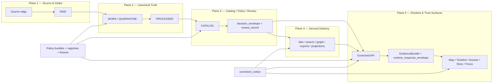

<!-- [KFM_META_BLOCK_V2]
doc_id: kfm://doc/NEEDS_VERIFICATION_UUID
title: Policy
type: standard
version: v1
status: draft
owners: NEEDS VERIFICATION
created: YYYY-MM-DD
updated: YYYY-MM-DD
policy_label: public
related: ["../README.md", "../CONTRIBUTING.md", "../.github/README.md", "../contracts/README.md", "../data/README.md", "../apps/api/README.md"]
tags: [kfm, policy, governance, opa, rego]
notes: ["doc_id, owners, and dates require repo-backed verification before merge", "current-session evidence included mounted PDFs under /mnt/data but no directly visible repository checkout", "relative links below are intended repo neighbors and must be verified in the real checkout before merge"]
[/KFM_META_BLOCK_V2] -->

# Policy

Governed policy-as-code surface for KFM publication, runtime access, evidence resolution, redaction/generalization, correction, and fail-closed behavior.

> **Status:** experimental  
> **Owners:** `NEEDS VERIFICATION`  
>       
> **Repo fit:** intended path `policy/README.md` · upstream: [`../README.md`](../README.md), [`../CONTRIBUTING.md`](../CONTRIBUTING.md), [`../contracts/README.md`](../contracts/README.md), [`../data/README.md`](../data/README.md) · downstream: [`../apps/api/README.md`](../apps/api/README.md), [`../.github/README.md`](../.github/README.md)  
> **Quick jump:** [Scope](#scope) · [Repo fit](#repo-fit) · [Accepted inputs](#accepted-inputs) · [Exclusions](#exclusions) · [Directory tree](#directory-tree) · [Quickstart](#quickstart) · [Usage](#usage) · [Diagram](#diagram) · [Tables](#tables) · [Gates / Definition of done](#gates--definition-of-done) · [FAQ](#faq) · [Appendix](#appendix)

> [!IMPORTANT]
> This README is deliberately source-bounded. In the current session, the accessible workspace exposed mounted PDFs under `/mnt/data`, but **not** a directly visible repository checkout, workflow directory, schema registry, manifest set, or runtime artifact inventory. Treat path-level, file-level, and gate-wiring statements here as a **repo-ready target contract** until the real tree is inspected.

## Scope

`policy/` is where KFM turns governance into executable decisions.

In KFM, policy is not a detached compliance appendix. It governs what may enter the truth path, what may move across staged lifecycle boundaries, what may be published, what runtime surfaces may answer or expose, when geometry must be generalized or withheld, and how correction and rollback stay visible instead of disappearing behind polished UI.

### Truth posture used in this README

| Marker | Meaning here |
|---|---|
| **CONFIRMED** | Directly supported by the mounted March 2026 KFM corpus or by direct current-session workspace inspection |
| **PROPOSED** | Repo-ready realization or file layout that fits the mounted doctrine but was not directly verified as mounted implementation |
| **UNKNOWN** | Not established strongly enough in the current session to present as settled reality |
| **NEEDS VERIFICATION** | Placeholder that must be replaced from repo-backed evidence before merge |

### Mounted authority basis

This README is grounded first in the **mounted March 16–19, 2026 KFM reference layer**, not in absent standalone filenames.

| Layer | Mounted basis used here | Why it matters for `policy/` |
|---|---|---|
| Direct policy baseline | `KFM_Policy_Refined_2026-03-19.pdf` | Freshest policy-specific articulation of policy law, starter artifact order, future-proofing rules, and open `UNKNOWN` backlog |
| Master doctrinal overlay | `KFM_Master_Manual_Reissued_2026-03-18.pdf` | Truth posture, five-plane architecture, governed lifecycle, and authority-order discipline |
| Governed delivery / release overlay | `Kansas Frontier Matrix — Unified Master Reference, Governed Delivery, and CI_CD Doctrine.pdf` | Contract families, decision grammar, release evidence, route-family vocabulary, promotion, rollback, and separation of duty |
| Contract / schema overlays | `KFM_Contract_Reference_Refined_2026-03-19.pdf`, `KFM_Schema_Contract_Reference_Refined_2026-03-19.pdf` | Starter contract lattice, envelope / registry evolution rules, and machine-checkable artifact pressure |
| Verification overlay | `KFM_Testing_Verification_Refined_2026-03-19.pdf` | Fixtures, proof objects, merge-blocking verification, hydrology-first thin-slice pressure, and explicit `UNKNOWN` retirement discipline |
| App / runtime / security overlays | `KFM_App_Architecture_Refined_2026-03-19.pdf`, `KFM_Configuration_Reference_Refined_2026-03-19.pdf`, `KFM_Security_Reference.pdf`, `KFM_Ollama_Functional_Guide.pdf` | Trust membrane at the governed API, Evidence Drawer / Focus consequences, runtime outcome grammar, model-runtime boundary, and private-first containment |

### Non-negotiable policy behavior

| Rule | Consequence |
|---|---|
| Default deny | Unresolved rights, sensitivity, evidence, or review state ends in `hold`, `quarantine`, `deny`, `abstain`, or another governed negative outcome rather than a quiet allow |
| Explicit vocabularies | Reason codes, obligation codes, rights classes, sensitivity classes, reviewer roles, and runtime outcomes live in registries, not scattered strings |
| Transform-or-error obligations | A conditional allow must resolve to an explicit transform, narrowing step, or error path |
| Audit-bearing decisions | Deny, generalize, restrict, supersede, withdraw, and correction paths emit reviewable artifacts rather than hidden state changes |
| Retest on change | Policy, contract, schema, registry, and runtime-surface changes must rerun fixtures and merge-blocking gates |

> [!NOTE]
> Mounted March 2026 manuals alternate between `CATALOG` and `CATALOG / TRIPLET`. This README uses `CATALOG` for readability and treats `CATALOG / TRIPLET` as the same outward metadata/provenance-closure stage rather than a different trust state.

[Back to top](#policy)

## Repo fit

The intended target is `policy/README.md`.

Because the current-session workspace exposed PDFs only, the neighboring links below are **intended repo relationships** and must be checked in the real checkout before merge.

| Direction | Intended neighbor | Why it matters |
|---|---|---|
| Upstream | [`../README.md`](../README.md) | Root system identity, invariants, and project navigation |
| Upstream | [`../CONTRIBUTING.md`](../CONTRIBUTING.md) | Review discipline, ownership, and change expectations for policy-significant work |
| Upstream | [`../contracts/README.md`](../contracts/README.md) | Contract and schema truth that policy consumes, but does not replace |
| Upstream | [`../data/README.md`](../data/README.md) | Lifecycle zones, canonical movement rules, and authoritative-versus-derived boundaries |
| Downstream | [`../apps/api/README.md`](../apps/api/README.md) | Governed API boundary where policy is enforced for normal clients and runtime answer surfaces |
| Downstream | [`../.github/README.md`](../.github/README.md) | CI / verification / promotion surfaces where policy bundles should run |

> [!WARNING]
> Relative links above are **repo-native targets**, not claims that those exact files were directly mounted in the current session.

## Accepted inputs

`policy/` should stay small, typed, and execution-oriented.

| Input class | What belongs here | Typical examples |
|---|---|---|
| Policy bundles | Executable rules grouped by policy concern or decision surface | `bundles/publication/*.rego`, `bundles/runtime/*.rego`, `bundles/sensitivity/*.rego`, `bundles/review/*.rego` |
| Policy registries | Stable machine-readable vocabularies reused by policy, runtime, UI trust cues, and tests | `registries/reason_codes.json`, `registries/obligation_codes.json`, `registries/reviewer_roles.json`, `registries/rights_classes.json`, `registries/sensitivity_classes.json`, `registries/runtime_outcomes.json` |
| Fixtures | Valid and invalid cases that prove fail-closed behavior, additive vocabulary handling, and negative-state behavior | `fixtures/valid/*.json`, `fixtures/invalid/*.json`, `*_test.rego` |
| Review / exception artifacts | Explicit stewardship and exception handling that keeps policy-significant deviation auditable | `review/steward_review_checklist.md`, `exceptions/*.json`, `exceptions/*.yaml` |
| Transform catalogs | Reusable redaction / generalization parameters and controlled narrowing rules | `transforms/redaction_generalization_catalog.yaml` |
| Release policy guidance | Requirements that define what must accompany a publishable unit | `release/release_manifest_requirements.md` |
| Proof-pack examples | Minimal, public-safe examples that demonstrate policy behavior end to end | `examples/hydrology-first/*` |
| Runbooks | Human-readable local-check, triage, rollback, and correction procedures | `runbooks/local-check.md`, `runbooks/correction-drill.md` |

### Coordinated changes this directory should expect

Some policy-significant changes will require **paired updates outside `policy/`**.

| Coordinated area | Likely neighbor | Why policy alone is insufficient |
|---|---|---|
| Decision and runtime envelope schemas | [`../contracts/`](../contracts/) | `decision_envelope`, `review_record`, `EvidenceBundle`, and `runtime_response_envelope` are contract objects as well as policy objects |
| Governed route behavior | [`../apps/api/`](../apps/api/) | Policy bundles do not enforce trust if the governed API does not actually call them |
| Lifecycle movement and emitted artifacts | [`../data/`](../data/) | Rights, sensitivity, and release outcomes must attach to real staged data and provenance objects |
| CI and merge-blocking gates | [`../.github/`](../.github/) | Policy must run in review and promotion lanes, not just in local thought experiments |

## Exclusions

| Does **not** belong in `policy/` | Put it instead | Why |
|---|---|---|
| Canonical object schemas and non-policy-owned contract truth | [`../contracts/`](../contracts/) | Policy evaluates object state and outcome vocabulary; it should not silently own the whole contract lattice |
| Service handlers, route code, model-adapter code, UI components | [`../apps/api/`](../apps/api/) or the relevant app/package path | Enforcement and implementation are related, but they are not the same artifact |
| RAW / WORK / QUARANTINE / PROCESSED / CATALOG / PUBLISHED data artifacts | [`../data/`](../data/) | Policy governs movement and exposure; it is not the canonical storage tree |
| Secrets, tokens, signing keys, local `.env` files | secret manager / host configuration | Sensitive operational material must not live in the policy tree |
| Tutorial-only prose that never becomes executable or reviewable | project-level documentation | `policy/` should remain the executable and testable edge of governance |
| UI-only conditionals treated as the sole control surface | nowhere | KFM requires backend/runtime/promotion enforcement, not policy theater in presentation code |

> [!WARNING]
> Reviewed exceptions are not a quiet bypass lane. KFM treats review, exception, rollback, and correction as auditable governance artifacts tied to release state and visible consequences.

[Back to top](#policy)

## Directory tree

### Current-session evidence (**CONFIRMED**)

No directly visible repository checkout or mounted `policy/` directory was inspectable in this session.

That means this README must **not** claim a checked-out file inventory, a confirmed policy bundle layout, or an already-wired CI gate path.

### Proposed minimum target shape (**PROPOSED**)

```text
policy/
├── README.md
├── bundles/
│   ├── publication/
│   ├── runtime/
│   ├── sensitivity/
│   └── review/
├── registries/
│   ├── reason_codes.json
│   ├── obligation_codes.json
│   ├── reviewer_roles.json
│   ├── rights_classes.json
│   ├── sensitivity_classes.json
│   └── runtime_outcomes.json
├── fixtures/
│   ├── valid/
│   └── invalid/
├── review/
│   └── steward_review_checklist.md
├── exceptions/
│   └── README.md
├── transforms/
│   └── redaction_generalization_catalog.yaml
├── release/
│   └── release_manifest_requirements.md
├── runbooks/
│   ├── local-check.md
│   └── correction-drill.md
└── examples/
    └── hydrology-first/
```

### Naming guidance

- Organize bundle files by **decision surface** or **policy concern**, not by team name.
- Keep canonical strings in registries, not copied across rule files and UI fragments.
- Prefer additive vocabulary evolution over silent reinterpretation.
- Name fixtures by scenario and expected outcome.

Examples:

```text
fixtures/invalid/citation_missing__abstain.json
fixtures/invalid/release_without_review__hold.json
fixtures/invalid/restricted_geometry__generalize.json
fixtures/valid/hydrology_public_safe__allow.json
```

> [!NOTE]
> The mounted March 2026 corpus strongly supports **policy-as-code** and starter artifacts such as registries, fixtures, review checklists, transform catalogs, and thin-slice proof packs. It does **not** directly confirm this exact folder shape.

[Back to top](#policy)

## Quickstart

### 1) Verify the real checkout first

```bash
pwd
test -d policy && find policy -maxdepth 4 -type f | sort
```

### 2) Discover what actually exists

```bash
find policy -maxdepth 4 \
  \( -name '*.rego' -o -name '*.json' -o -name '*.yaml' -o -name '*.yml' -o -name '*.md' \) \
  | sort
```

### 3) Check whether policy vocabulary is centralized

```bash
grep -R -nE 'reason_codes|obligation_codes|reviewer_roles|rights_classes|sensitivity_classes|runtime_outcomes' policy 2>/dev/null || true
```

### 4) Run local bundle and fixture checks if the real repo has the expected tooling

```bash
# Verify real paths before relying on these commands.
opa test policy -v

conftest test policy/fixtures/valid   --policy policy/bundles
conftest test policy/fixtures/invalid --policy policy/bundles
```

### 5) Inspect whether merge-blocking policy gates are wired

```bash
if [ -d .github/workflows ]; then
  find .github/workflows -maxdepth 2 -type f | sort | grep -Ei 'policy|opa|conftest|verify|release' || true
fi
```

> [!NOTE]
> The commands above are intentionally minimal and reviewable. If the real repo uses `policies/` or keeps Rego bundles elsewhere, update this README in the same change set that verifies the actual tree.

## Usage

### Add or update a policy family

1. Start with the governing question, not the file name.
2. Decide whether the change belongs to source admission, rights, sensitivity, verification, promotion, runtime answer behavior, UI trust-visible state, correction, or steward/operator governance.
3. Add or update registry values **before** copying strings into rule logic.
4. Add at least one valid and one invalid fixture.
5. Confirm the same meaning appears in CI, governed API behavior, and trust-visible surface state.
6. Update this README or the local runbook when the directory contract changes.

### Keep capability-layer route families stable

Policy changes should preserve the capability layer even if literal route trees later differ.

| Capability family | What it covers |
|---|---|
| Source admission and intake | admissibility, descriptor-backed onboarding, intake review |
| Validation and quarantine | structural, semantic, rights, sensitivity, and quarantine decisions |
| Catalog and discovery | metadata closure, release-readable catalog state, discoverability |
| Evidence resolution | EvidenceRef → EvidenceBundle drill-through for visible claims |
| Runtime answer / Focus mediation | cite-or-abstain answer behavior, governed runtime envelopes |
| Review / correction / rollback | stewardship, supersession, correction, withdrawal, and visible lineage |
| Release and projection status | releasable state, freshness, derived-surface linkage, projection/build status |

### Change registries safely

- Prefer additive change over silent reinterpretation.
- Version registries explicitly.
- Keep digests or another stable identity on policy-bearing bundles when the real repo supports it.
- Treat breaking vocabulary changes as release-class work, not casual cleanup.

### Add a reviewed exception or stewardship path

A reviewed exception should answer all of the following:

1. What subject or release scope is affected?
2. Which policy family is being narrowed, overridden, or time-boxed?
3. Why is the exception required?
4. Who can approve it?
5. What evidence, rights basis, or corrective follow-up justifies it?
6. What visible state or rollback path applies later?

### Illustrative starter rule

```rego
package kfm.policy.runtime

deny[msg] {
  input.surface == "focus"
  count(input.citations) == 0
  msg := "focus answer requires resolvable citations"
}

deny[msg] {
  input.release_state != "published"
  msg := "runtime answer requires published release scope"
}

deny[msg] {
  input.evidence_resolved != true
  msg := "EvidenceBundle resolution required"
}
```

*Illustrative starter only — verify actual package names, input shape, and bundle paths against the real checkout before adoption.*

## Diagram


```mermaid
flowchart LR
  subgraph P1[Plane 1 — Source & Intake]
    SE[Source edge]
    RAW[RAW]
  end

  subgraph P2[Plane 2 — Canonical Truth]
    WQ[WORK / QUARANTINE]
    PROC[PROCESSED]
  end

  subgraph P3[Plane 3 — Catalog / Policy / Review]
    CAT[CATALOG]
    DEC[decision_envelope + review_record]
  end

  subgraph P4[Plane 4 — Derived Delivery]
    DER[tiles / search / graph / exports / projections]
  end

  subgraph P5[Plane 5 — Runtime & Trust Surfaces]
    API[Governed API]
    EV[EvidenceBundle + runtime_response_envelope]
    UI[Map / Timeline / Dossier / Story / Focus]
  end

  SE --> RAW --> WQ --> PROC --> CAT
  CAT --> DEC
  DEC --> DER
  DEC --> API
  DER --> API
  API --> EV --> UI

  POL[Policy bundles + registries + fixtures] --> WQ
  POL --> CAT
  POL --> API

  CORR[correction_notice] --> DER
  CORR --> API
  CORR --> UI
```

## Tables

### Policy family matrix

These families are distinct for clarity, but not separable in execution. A single publication or runtime answer may invoke several at once.

| Policy family | Governing question | Primary enforcement points | Typical proof objects | Valid negative outcomes |
|---|---|---|---|---|
| Source admission | May this source or intake event enter the governed path? | Intake, acquisition, source descriptor approval | `source_descriptor`, `ingest_receipt` | reject, hold, quarantine |
| Rights and license | What rights, license, attribution, or reuse obligations apply? | Intake, catalog/review, export, runtime | `decision_envelope`, `review_record`, rights registry | restricted, deny, hold, generalized |
| Sensitivity and redaction | What precision, fields, geometry, or narrative detail may be exposed? | WORK / QUARANTINE, catalog/review, runtime, public read surfaces | sensitivity registry, transform catalog, `EvidenceBundle` | generalize, withhold, restrict, deny |
| Verification policy | What must be proven before movement or answer? | Every truth-path transition and runtime | `validation_report`, `dataset_version`, `catalog_closure`, `runtime_response_envelope` | hold, quarantine, abstain, error |
| Promotion and release policy | When does a candidate become publishable trust state? | CI/CD, review, release assembly, deploy-time verify-before-trust | `release_manifest`, signatures / attestations, proof pack | reject, hold, rollback, supersede |
| Runtime response policy | What may the system answer, cite, deny, or abstain from? | Governed API, evidence resolver, Focus mediation | `runtime_response_envelope`, `audit_ref`, citation bundle | abstain, deny, error |
| UI trust-visible policy | What must the interface reveal so trust is operational? | Map, timeline, dossier, story, Evidence Drawer, Focus | Evidence Drawer view, policy labels, freshness/review state | restricted preview, calm failure, unknown-state display |
| Correction and rollback policy | How are wrong, unsafe, or superseded outputs reversed without erasing lineage? | Correction workflow, rollback flow, runtime correction surfacing | `correction_notice`, release refs, audit trail | superseded, withdrawn, rollback, narrowed republication |
| Contributor / steward / operator governance | Who may propose, review, promote, deploy, correct, or override? | Review boundaries, approval gates, runtime/admin actions | `review_record`, `decision_envelope`, role map, audit events | deny, require second review, separation-of-duty hold |
| AI and Focus Mode | What may the model do, and what must remain outside generation? | Retrieval loop, synthesis step, post-generation validation | EvidenceBundle output, policy decisions, citations, `audit_ref` | abstain, deny, narrow scope, error |

### Lifecycle enforcement map

| Stage | What policy must prove | Core objects | Fail-closed outcomes | Public-safe? |
|---|---|---|---|---|
| Source edge | admissibility, access mode, rights posture, descriptor completeness | `source_descriptor` | reject, hold, quarantine | No |
| RAW | integrity, source-native preservation, acquisition traceability | checksums, acquisition logs, raw packaging, `ingest_receipt` | hold, reacquire, quarantine | No |
| WORK / QUARANTINE | transform safety, unresolved risk handling, reproducibility, sensitivity review | transform logs, validation outputs, quarantine reasons | quarantine, deny, steward review, discard candidate | No |
| PROCESSED | canonical validity, stable identity, schema / CRS / time discipline | `validation_report`, `dataset_version` | hold, reprocess, quarantine | Not automatically |
| CATALOG | metadata closure, review readiness, rights/sensitivity decisions, promotion readiness | `catalog_closure`, `decision_envelope`, `review_record` | deny promotion, generalized-only, restricted-only | Not by default |
| PUBLISHED | release evidence, runtime citation discipline, correction visibility, derived-surface linkage | `release_manifest`, `EvidenceBundle`, `runtime_response_envelope`, `correction_notice` | restricted-only, stale-visible, abstain, deny, withdrawn, error | Yes, but only within promoted scope |

[Back to top](#policy)

## Gates / Definition of done

A policy change is done when it is governable, not merely written.

- [ ] The real repo path and neighboring links were verified in the checkout.
- [ ] `doc_id`, owners, and dates were replaced with repo-backed values.
- [ ] Default deny remains explicit unless a narrower allow path is justified and reviewed.
- [ ] Any new reason, obligation, rights, sensitivity, reviewer-role, or runtime-outcome value was added to a canonical registry.
- [ ] Valid and invalid fixtures exist and are exercised by local or CI checks.
- [ ] The change preserves additive vocabulary evolution or documents a deliberate version bump and deprecation path.
- [ ] Governed API behavior still fails closed as `ABSTAIN`, `DENY`, `ERROR`, `hold`, `quarantine`, `generalize`, or other typed negative outcomes where appropriate.
- [ ] Evidence drill-through and trust-visible surface states remain aligned with the same policy vocabulary.
- [ ] Review-required and rights/sensitivity-significant paths still preserve separation of duty where significance warrants it.
- [ ] Documentation and runbooks changed alongside behavior-significant policy changes.
- [ ] No secrets, credentials, or copied canonical data were added here.
- [ ] No section of this README implies mounted implementation maturity beyond what the repo actually proves.

[Back to top](#policy)

## FAQ

### Does this README prove that policy bundles already exist in the mounted repo?

No. It documents **CONFIRMED doctrine** and a **PROPOSED repo contract**. In the current session, the accessible workspace did not expose a directly visible repository checkout.

### Why keep policy separate from `contracts/`?

Because contracts define object shape and outward meaning, while policy decides what may happen with those objects under rights, sensitivity, review, release, and runtime conditions.

### Is `OPA / Rego` confirmed?

No as a mounted implementation fact. **Policy-as-code** is confirmed project doctrine. `OPA / Rego` and `Conftest` are strong starter directions supported by the mounted corpus and adjacent notebook material, but the exact engine choice and bundle layout remain **PROPOSED** until the real repo proves them.

### Does the UI enforce policy?

The UI must make policy state visible, but it must not be the only enforcement location. KFM policy belongs in backend enforcement, promotion gates, runtime mediation, and correction flows.

### Where should reviewed exceptions live?

In explicit review or exception artifacts with approver, reason, effectivity, and audit linkage — not in comments, operator memory, or one-off UI flags.

## Appendix

<details>
<summary><strong>Open verification backlog and first-wave artifact order</strong></summary>

### Highest-priority direct verification checks

1. Verify the actual target path and adjacent repo docs before merge.
2. Confirm whether the repo uses `policy/`, `policies/`, or a different local naming pattern.
3. Surface any mounted policy bundle layout, registry set, and fixture inventory.
4. Confirm whether the repo already emits `decision_envelope`, `review_record`, `EvidenceBundle`, and `runtime_response_envelope` artifacts.
5. Surface workflow files, required checks, and reviewer / approval boundaries.
6. Confirm whether one rollback or correction drill is already recorded anywhere in the repo or release evidence.
7. Replace placeholder owners, dates, and `doc_id` using repo-backed metadata.

### First-wave artifact order (**PROPOSED**)

| Priority | Proposed artifact | Why it comes early |
|---|---|---|
| 1 | Deny-by-default policy bundle | Makes fail-closed posture executable |
| 1 | Registry pack (`reason_codes`, `obligation_codes`, `rights_classes`, `sensitivity_classes`, `reviewer_roles`, `runtime_outcomes`) | Keeps policy, runtime, UI, and review language aligned |
| 1 | Policy fixtures (`valid/`, `invalid/`) | Proves negative outcomes structurally instead of rhetorically |
| 1 | Steward review checklist | Turns separation-of-duty and review burden into a repeatable artifact |
| 1–2 | Redaction / generalization transform catalog | Prevents ad hoc exposure logic |
| 1–2 | Release-manifest policy requirements | Makes publication evidence explicit |
| 2 | Hydrology-first proof pack | Proves policy against a comparatively public-safe, evidence-rich lane |
| 2 | Correction / rollback drill artifact | Makes visible recovery part of the baseline, not a maturity fantasy |

### Coordinated contract work expected outside `policy/`

Even if `policy/` owns bundles, registries, fixtures, and review artifacts, the following contract objects likely need coordinated work in adjacent directories:

- `decision_envelope`
- `review_record`
- `release_manifest`
- `EvidenceBundle`
- `runtime_response_envelope`
- `correction_notice`

### Authoring notes

- Prefer explicit placeholders over invented certainty.
- Prefer one small, reviewable policy slice over one opaque monolith.
- Keep this README explanatory and navigational; keep executable truth in versioned bundles, registries, and fixtures.
- Update the doc in the same change set that verifies the tree or changes the directory contract.

</details>

[Back to top](#policy)
