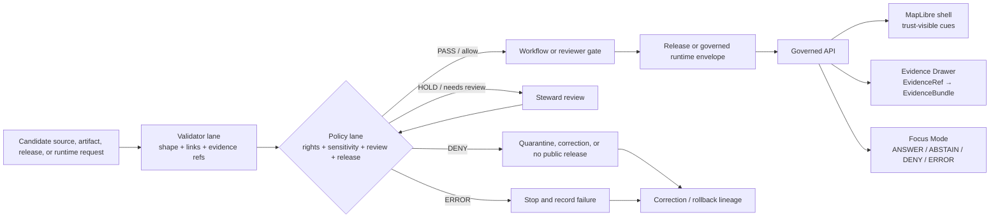

<!-- [KFM_META_BLOCK_V2]
doc_id: kfm://doc/NEEDS_VERIFICATION_UUID
title: Policy
type: standard
version: v1
status: review
owners: @bartytime4life
created: TODO-NEEDS-VERIFICATION
updated: 2026-04-22
policy_label: public
related: ["../README.md", "../.github/CODEOWNERS", "../.github/workflows/", "../contracts/", "../schemas/", "../data/", "../tools/validators/", "../tests/", "../packages/", "../apps/"]
tags: [kfm, policy, governance, trust, rights, sensitivity, review, deny-by-default]
notes: ["doc_id and created date require repo-backed verification before merge", "owner is confirmed for /policy/ by current public CODEOWNERS but narrower policy-lane ownership may still be added later", "current public policy/ snapshot is README plus .gitkeep; proposed child seams below are not claimed as present", "relative links are written from policy/README.md"]
[/KFM_META_BLOCK_V2] -->

<a id="top"></a>

# Policy

Governed decision surface for KFM publication, runtime trust, rights, sensitivity, review, correction, and release admissibility.

<div align="left">


</div>

> [!IMPORTANT]
> **Status:** `experimental`  
> **Owners:** `@bartytime4life`  
> **Path:** `policy/README.md`  
> **Current branch snapshot:** `policy/` is currently a thin policy lane. Treat deeper bundle, fixture, runtime, and policy-test shapes below as **PROPOSED** until they are created or verified in the target branch.  
> **Quick jumps:** [Scope](#scope) · [Repo fit](#repo-fit) · [Accepted inputs](#accepted-inputs) · [Exclusions](#exclusions) · [Directory tree](#directory-tree) · [Policy seams](#policy-seams) · [Quickstart](#quickstart) · [Diagram](#diagram) · [Gates](#gates-and-definition-of-done) · [Appendix](#appendix-proposed-first-fill)

> [!TIP]
> Keep the top-level trust split visible:
>
> `probes observe` → `receipts preserve process memory` → `validators verify` → `policy decides` → `workflows orchestrate`.

---

## Scope

`policy/` is where KFM governance becomes reviewable decision logic.

It should help KFM answer questions such as:

| Question | Policy posture |
|---|---|
| Can this source be admitted? | Decide from source role, rights, cadence, sensitivity, and review posture. |
| Can this artifact move toward publication? | Require evidence linkage, validation, catalog/proof closure, review state, and rollback target. |
| Can this geometry be public? | Fail closed for sensitive, restricted, cultural, critical-infrastructure, living-person, DNA, rare-species, or exact-location exposure. |
| Can a runtime response answer? | Require released policy-safe evidence, citation validation, and finite outward outcomes. |
| Can a correction or withdrawal propagate? | Preserve visible supersession, withdrawal, review-pending, and rollback state. |

### Evidence posture used here

| Label | Meaning in this README |
|---|---|
| **CONFIRMED** | Verified from current public repo evidence, current-session workspace scan, or attached KFM doctrine. |
| **INFERRED** | Strongly supported by multiple KFM sources, but not directly proven as active implementation. |
| **PROPOSED** | Commit-ready direction that fits KFM doctrine but is not asserted as current branch reality. |
| **UNKNOWN** | Not verified strongly enough to present as current file, runner, workflow, route, or runtime behavior. |
| **NEEDS VERIFICATION** | Branch-specific or environment-specific detail that must be rechecked before merge. |

### Load-bearing commitments

| Commitment | Practical consequence |
|---|---|
| Deny by default | Missing rights, unresolved sensitivity, unsupported source role, broken evidence linkage, or absent review must produce a governed negative outcome. |
| Policy decides after validation | Validators shape-check and link-check inputs; policy decides allow, deny, hold, obligation, restriction, or generalization. |
| Reasons stay typed | Policy decisions should emit stable reason and obligation codes rather than prose-only justifications. |
| Publication is governed | Public release is a reviewed state transition, not a file move or a UI toggle. |
| Correction remains visible | Withdrawn, superseded, review-pending, embargoed, and generalized states must survive downstream. |
| UI reflects policy; it does not replace it | Trust cues belong in the shell, but backend, review, release, and runtime gates remain primary. |

[Back to top](#top)

---

## Repo fit

This file is the parent README for KFM policy work. It explains where policy law belongs, where policy support code does **not** belong, and how policy-related proof stays separated from contracts, schemas, validators, receipts, workflows, apps, and UI conditionals.

| Direction | Surface | Why it matters |
|---|---|---|
| Upstream | [`../README.md`](../README.md) | Root system identity, doctrine summary, and repository navigation. |
| Ownership | [`../.github/CODEOWNERS`](../.github/CODEOWNERS) | Current public ownership baseline for `/policy/`. |
| Guardrail | [`../.github/workflows/`](../.github/workflows/) | Workflow-lane home for orchestration; workflow presence is not the same as policy truth. |
| Lateral | [`../contracts/`](../contracts/) | Normative meaning of trust-bearing objects such as `EvidenceBundle`, `DecisionEnvelope`, and release handoff concepts. |
| Lateral | [`../schemas/`](../schemas/) | Machine-readable validation shapes; policy should consume schemas, not fork them. |
| Lateral | [`../data/`](../data/) | Lifecycle zones and emitted objects that policy governs but does not store. |
| Lateral | [`../tools/validators/`](../tools/validators/) | Shape, linkage, catalog, and integrity checks that prepare inputs before policy decides. |
| Downstream | [`../tests/`](../tests/) | Repo-facing proof that policy behavior holds under runtime, release, correction, and negative-path pressure. |
| Downstream | [`../packages/`](../packages/) | Shared loaders, adapters, and helpers should remain subordinate to the top-level policy lane. |
| Downstream | [`../apps/`](../apps/) | Runtime/API/UI enforcement may consume policy, but should not become the hidden source of policy law. |

> [!WARNING]
> Do not let `policy/` quietly resolve `contracts/` versus `schemas/` by duplication. KFM keeps trust objects explicit and singular: contracts define meaning, schemas define structure, validators verify, and policy decides admissibility.

[Back to top](#top)

---

## Accepted inputs

`policy/` should stay compact, typed, reviewable, and decision-oriented.

| Input class | What belongs here | Typical examples |
|---|---|---|
| Policy-as-code bundles | Rule families that decide a trust seam or seam family. | `*.rego`, `bundle.yaml`, seam-local helper modules. |
| Small checked-in policy data | Reviewable, schema-valid classification data used by governed review or promotion. | `promotion_bundle_diff_policy.json`, reason-code maps, obligation-code maps. |
| Positive and negative fixtures | Minimal examples proving deny-by-default and allow-only-when-supported behavior. | `allow`, `deny`, `restrict`, `generalize`, `needs-review`, `withdraw`, `supersede`. |
| Bundle-local assertions | Local checks that prove a bundle family behaves as documented. | OPA/Conftest checks, stable outcome tests, import-resolution checks. |
| Runtime-policy coordination notes | Human-readable notes that explain how governed runtimes consume policy without moving authority into apps. | Decision assembly notes, runtime parity notes, mediation guidance. |
| Steward-facing review notes | Small, durable notes needed to review policy-significant changes. | Rights/sensitivity review notes, lane-specific steward burdens, source-role caveats. |

### Working placement rule

If a change mostly defines **policy law**, keep it in `policy/`.

If it mostly defines **object shape**, move it to `schemas/`.

If it mostly defines **object meaning**, move it to `contracts/`.

If it mostly proves **whole-path behavior**, move it to `tests/`.

If it mostly performs **shape, linkage, or integrity checks**, move it to `tools/validators/`.

[Back to top](#top)

---

## Exclusions

| Does **not** belong in `policy/` | Put it instead | Why |
|---|---|---|
| Canonical JSON Schema or OpenAPI definitions | [`../schemas/`](../schemas/) and [`../contracts/`](../contracts/) | Shared trust-object shape should not drift into rule-pack lanes. |
| A second authoritative schema registry | [`../schemas/`](../schemas/) plus ADR | Parallel schema homes increase ambiguity, not resilience. |
| Probe freshness, source polling, or drift detection | `../tools/probes/` or pipeline/source lanes after verification | Observation belongs upstream of policy. |
| Validator enforcement logic | [`../tools/validators/`](../tools/validators/) | Validators verify; policy decides. |
| API handlers, workers, or UI conditionals | [`../apps/`](../apps/) and [`../packages/`](../packages/) | Enforcement code is not the same artifact as the policy pack. |
| RAW / WORK / QUARANTINE / PROCESSED / CATALOG / PUBLISHED artifacts | [`../data/`](../data/) | Policy governs movement and exposure; it is not the canonical store. |
| Receipts, proofs, release manifests, or signed bundles as primary artifacts | `../data/receipts/`, `../data/proofs/`, and `../release/` after verification | Process memory and proof objects remain separate from policy law. |
| Workflow orchestration or platform settings | [`../.github/workflows/`](../.github/workflows/) and platform configuration | Orchestration may call policy; it should not hide policy. |
| Secrets, keys, tokens, `.env` files, or live credentials | Secret manager or host configuration | Sensitive operational material must not live in a public policy lane. |
| Direct model output or chain-of-thought | Governed runtime envelopes and evidence bundles | AI is interpretive; EvidenceBundle and policy outrank generation. |
| Reviewer-only Markdown rendering | CI/reviewer tooling lanes after verification | Policy emits decisions or rule results; rendering belongs elsewhere. |

[Back to top](#top)

---

## Directory tree

### Current visible public snapshot (**CONFIRMED**, recheck before merge)

```text
policy/
├── .gitkeep
└── README.md
```

This README should therefore serve two roles at once:

1. **Current lane contract** for the thin policy directory that exists now.
2. **Growth guide** for the first governed policy subtrees that should be added only when backed by fixtures, tests, and review.

### Doctrine-aligned growth shape (**PROPOSED**)

```text
policy/
├── README.md
├── bundles/
│   ├── README.md
│   ├── admission/
│   ├── rights/
│   ├── sensitivity/
│   ├── review/
│   ├── runtime/
│   ├── release/
│   ├── export/
│   └── correction/
├── fixtures/
│   ├── allow/
│   ├── deny/
│   ├── restrict/
│   ├── generalize/
│   ├── needs-review/
│   ├── withdraw/
│   └── supersede/
├── tests/
│   ├── README.md
│   ├── decision-grammar/
│   ├── deny-by-default/
│   └── import-resolution/
└── policy-runtime/
    └── README.md
```

> [!NOTE]
> The proposed tree is seam-led, not tool-led. Keep the governed seam stable even if the repo later standardizes on a different runner, package manager, or policy engine.

[Back to top](#top)

---

## Policy seams

Policy work should name the seam it protects. That makes rule packs easier to review, test, and rollback.

| Seam | Policy burden | Example denial |
|---|---|---|
| Source admission | Source role, rights, provenance, cadence, and access mode are explicit. | Unknown rights or undocumented access mode. |
| Evidence linkage | Consequential claims resolve to admissible evidence. | `EvidenceRef` missing or not resolvable to `EvidenceBundle`. |
| Sensitivity | Exact location, identity, cultural, critical, or restricted data is handled safely. | Public exact sensitive geometry. |
| Review | Required steward, domain, policy, or release review exists. | Release candidate missing reviewer or review state. |
| Runtime | Outward answers are finite and evidence-bounded. | Claim-bearing answer without citations or policy-safe context. |
| Release | Publication has proof closure, catalog closure, rollback target, and correction route. | Release manifest missing rollback reference. |
| Export / story | Public exports preserve provenance, scope, redaction, and caveats. | Story node strips source role or generalization reason. |
| Correction | Supersession, withdrawal, and rollback propagate visibly. | New version silently overwrites a published claim. |

### Outcome grammar

| Surface | Recommended finite outcomes | Meaning |
|---|---|---|
| Runtime / public response | `ANSWER`, `ABSTAIN`, `DENY`, `ERROR` | What the user receives. |
| Gate / review evaluation | `PASS`, `HOLD`, `DENY`, `ERROR` | What the checker or reviewer decides. |
| Release-state receipt | `PROMOTED`, `BLOCKED`, `REVERTED` | What happened to the release candidate. |
| Sensitivity handling | `PUBLIC`, `GENERALIZED`, `RESTRICTED`, `EMBARGOED`, `DENIED` | What exposure policy allows. |

[Back to top](#top)

---

## Quickstart

Run these from the repository root.

### 1) Confirm the policy lane before editing

```bash
git status --short
git branch --show-current
git rev-parse --show-toplevel

find policy -maxdepth 4 \( -type f -o -type d \) 2>/dev/null | sort
sed -n '1,260p' policy/README.md 2>/dev/null || true
sed -n '1,220p' .github/CODEOWNERS 2>/dev/null || true
```

### 2) Inspect adjacent authority surfaces

```bash
find contracts schemas data tools tests packages apps .github/workflows \
  -maxdepth 3 \( -type f -o -type d \) 2>/dev/null \
  | sort \
  | sed -n '1,300p'

grep -RInE \
  'EvidenceBundle|DecisionEnvelope|RuntimeResponseEnvelope|ReleaseManifest|PolicyDecision|CorrectionNotice|rights|sensitivity|ABSTAIN|DENY|HOLD' \
  contracts schemas policy data tools tests packages apps docs 2>/dev/null || true
```

### 3) Check whether policy tooling exists before claiming enforcement

```bash
command -v opa >/dev/null && opa version || echo "OPA not installed or not on PATH"
command -v conftest >/dev/null && conftest --version || echo "Conftest not installed or not on PATH"

find policy -type f \
  \( -name '*.rego' -o -name 'bundle.yaml' -o -name 'bundle.yml' -o -name '*policy*.json' \) \
  2>/dev/null \
  | sort
```

### 4) First safe review pass

```bash
# Look for dangerous drift: policy logic hidden in apps/UI, secrets, or raw artifacts.
grep -RInE \
  'allow|deny|rights|sensitivity|redact|generalize|embargo|EvidenceBundle|DecisionEnvelope' \
  apps packages policy tools tests .github 2>/dev/null || true

# Look for accidental sensitive material in policy files.
grep -RInE \
  'API_KEY|SECRET|TOKEN|PASSWORD|PRIVATE KEY|BEGIN RSA|BEGIN OPENSSH|\.env' \
  policy 2>/dev/null || true
```

[Back to top](#top)

---

## Diagram


```mermaid
flowchart LR
  A[Candidate source, artifact, release, or runtime request] --> B[Validator lane<br/>shape + links + evidence refs]
  B --> C{Policy lane<br/>rights + sensitivity + review + release}
  C -->|PASS / allow| D[Workflow or reviewer gate]
  C -->|HOLD / needs review| E[Steward review]
  C -->|DENY| F[Quarantine, correction, or no public release]
  C -->|ERROR| G[Stop and record failure]

  D --> H[Release or governed runtime envelope]
  E --> C
  H --> I[Governed API]
  I --> J[MapLibre shell<br/>trust-visible cues]
  I --> K[Evidence Drawer<br/>EvidenceRef → EvidenceBundle]
  I --> L[Focus Mode<br/>ANSWER / ABSTAIN / DENY / ERROR]

  F --> M[Correction / rollback lineage]
  G --> M
```

> [!CAUTION]
> A visually successful map, story, export, or AI answer is not evidence of policy compliance. KFM compliance is shown by traceable decisions, validated evidence, review state, release state, and correction lineage.

[Back to top](#top)

---

## Gates and definition of done

A policy change is ready for review when it strengthens decision clarity without weakening the trust membrane.

- [ ] The changed seam is named: admission, rights, sensitivity, review, runtime, release, export, or correction.
- [ ] Branch inventory was rechecked and the README does not claim uncreated child paths.
- [ ] Owner/reviewer burden is visible through `CODEOWNERS` or a review note.
- [ ] Any new rule has at least one positive and one negative fixture.
- [ ] Denial reasons are stable enough to test.
- [ ] Unknown rights and unknown sensitivity fail closed.
- [ ] Public exact-location exposure is denied unless a reviewed policy allows a public-safe transform.
- [ ] Policy consumes schemas/contracts; it does not fork them.
- [ ] Policy is not hidden in API handlers, UI conditionals, workflow YAML, or helper package code.
- [ ] Runtime-facing behavior preserves finite outcomes.
- [ ] Release-facing behavior preserves proof, catalog, review, rollback, and correction surfaces.
- [ ] Docs were updated, or the PR explains why no docs changed.
- [ ] Rollback is described before merge for any policy-significant change.

[Back to top](#top)

---

## FAQ

### Is `policy/` the enforcement engine?

Not by itself. `policy/` is the decision-authority lane. Enforcement may happen through validators, workflows, governed APIs, release tooling, or runtime middleware, but those consumers should not become the hidden source of policy truth.

### Can policy files be JSON instead of Rego?

Yes, for small checked-in classification data when the file is schema-valid, reviewable, and intentionally bounded. Policy-as-code bundles and small machine-readable policy data can coexist if both remain clearly scoped.

### Should domain-specific policy live here?

Yes, when the rule is genuinely a policy decision. Domain-specific validators, source descriptors, fixtures, pipelines, and docs should remain in their own lanes and link back here.

### What should happen when policy cannot decide safely?

Return a governed negative outcome: `DENY`, `HOLD`, `ABSTAIN`, `RESTRICTED`, `GENERALIZED`, `EMBARGOED`, or `ERROR`, depending on surface. Do not turn uncertainty into a silent allow.

[Back to top](#top)

---

## Appendix: proposed first fill

<details>
<summary><strong>Smallest useful policy-lane expansion</strong> (<strong>PROPOSED</strong>)</summary>

A good first expansion should prove boundaries before adding many rules.

```text
policy/
├── README.md
├── bundles/
│   ├── README.md
│   ├── runtime/
│   │   ├── bundle.yaml
│   │   └── finite_outcomes.rego
│   ├── rights/
│   │   ├── bundle.yaml
│   │   └── public_release_rights.rego
│   └── sensitivity/
│       ├── bundle.yaml
│       └── public_geometry_exposure.rego
├── fixtures/
│   ├── allow/
│   │   └── released_public_safe.evidence.json
│   ├── deny/
│   │   ├── missing_rights.json
│   │   ├── unresolved_evidence_ref.json
│   │   └── exact_sensitive_geometry.json
│   └── needs-review/
│       └── steward_required.json
└── tests/
    ├── README.md
    ├── runtime_outcomes_test.rego
    ├── rights_test.rego
    └── sensitivity_test.rego
```

Suggested first denial cases:

| Case | Expected outcome |
|---|---|
| Missing rights posture | `DENY` |
| Unknown sensitivity class | `HOLD` or `DENY` |
| Public exact sensitive geometry | `DENY` |
| Runtime answer without EvidenceBundle | `DENY` |
| Claim-bearing answer without citations | `ABSTAIN` or `DENY` |
| Release candidate missing rollback target | `HOLD` |
| Correction without superseded target | `DENY` |

</details>

<details>
<summary><strong>Illustrative policy decision sketch</strong> (<strong>illustrative only</strong>)</summary>

```json
{
  "kind": "PolicyDecision",
  "version": "v1",
  "surface": "release_gate",
  "outcome": "DENY",
  "reason_codes": [
    "missing_rights_posture",
    "unresolved_evidence_ref"
  ],
  "obligation_codes": [
    "add_source_rights_review",
    "resolve_evidence_bundle"
  ],
  "policy_label": "restricted",
  "review_state": "needs_policy_review",
  "audit_ref": "NEEDS_VERIFICATION_AUDIT_REF"
}
```

This sketch is not a schema. Keep schema authority in `schemas/` and semantic contract authority in `contracts/`.

</details>

[Back to top](#top)