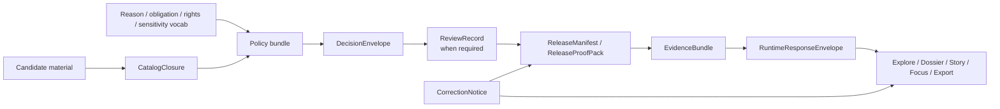

<!-- [KFM_META_BLOCK_V2]
doc_id: kfm://doc/NEEDS_VERIFICATION_UUID
title: Policy
type: standard
version: v1
status: draft
owners: NEEDS VERIFICATION
created: YYYY-MM-DD
updated: 2026-03-22
policy_label: public
related: ["../README.md", "../CONTRIBUTING.md", "../.github/README.md", "../contracts/README.md", "../data/README.md", "../apps/api/README.md"]
tags: [kfm, policy, governance, opa, rego]
notes: ["doc_id, owners, and created date require repo-backed verification before merge", "updated reflects 2026-03-22 repo-grounded evidence that policy/README.md was recently revised, not a verified front-matter field from the mounted checkout", "task-supplied relative links below must be reconciled with the real checkout before merge", "current repo evidence confirms a documentation surface at policy/README.md but does not confirm mounted .rego bundles or an implemented policy-runtime package", "OPA/Rego is treated here as the strongest documented starter direction, not as confirmed mounted adoption"]
[/KFM_META_BLOCK_V2] -->

# Policy

_Governed, executable policy surface for KFM publication, runtime trust, rights and sensitivity handling, and visible correction._

> **Status:** `experimental`  
> **Owners:** `NEEDS VERIFICATION`  
>        
> **Repo fit:** `policy/README.md` · current repo-grounded evidence confirms this README surface exists and was recently revised for policy clarity · doctrine proposes a fuller `policy/` surface with `bundles/`, `fixtures/`, and `tests/`, plus a sibling `packages/policy-runtime/` seam (**PROPOSED**, not mounted-repo-confirmed)  
> **Quick jump:** [Scope](#scope) · [Repo fit](#repo-fit) · [Accepted inputs](#accepted-inputs) · [Exclusions](#exclusions) · [Directory tree](#directory-tree) · [Quickstart](#quickstart) · [Usage](#usage) · [Diagram](#diagram) · [Tables](#tables) · [Gates and definition of done](#gates-and-definition-of-done) · [FAQ](#faq) · [Appendix](#appendix)

> [!IMPORTANT]
> This README is deliberately split between **CONFIRMED** repo evidence and **PROPOSED** doctrinal target shape. The current session did not expose a mounted checkout, live workflow YAML, runnable policy bundles, or runtime logs. Treat exact file inventory, rule-engine wiring, and ownership values as **NEEDS VERIFICATION** until the real repository is inspected.

## Scope

`policy/` is where KFM turns governance from prose into reviewable, machine-checkable behavior.

In KFM, policy is not a detached compliance appendix. It is the gate layer that shapes source admission, rights handling, sensitivity and redaction, review and release, runtime answers, correction and withdrawal, and the trust cues users see in the shell.

### Evidence labels used in this README

| Label | Meaning in this file |
|---|---|
| **CONFIRMED** | Directly supported by the attached KFM corpus or repo-grounded evidence visible in the current session |
| **PROPOSED** | Doctrine-consistent realization pattern, starter contract, or directory shape not yet verified in a mounted checkout |
| **UNKNOWN** | Not supported strongly enough in the current session to present as settled reality |
| **NEEDS VERIFICATION** | Placeholder or unresolved detail that must be checked in the real repo before merge |

### Baseline used for this revision

| Role | Source posture | Why it anchors this README |
|---|---|---|
| Current repo-state anchor | Repo-grounded evidence | Establishes what is actually evidenced now: `policy/README.md` exists, policy intent is documented, active YAML merge gates were not evidenced, and mounted `.rego` bundles were not confirmed |
| Master doctrine | March 20 design manual | Supplies the strongest dependency-ordered repo skeleton, trust seams, policy/test expectations, and publication/correction law |
| Implementation-deepening doctrine | Expanded working manual | Makes policy executable in shape: bundles, registries, `DecisionEnvelope`, `ReviewRecord`, `RuntimeResponseEnvelope`, reason/obligation vocabularies, and finite runtime outcomes |
| Corpus synthesis | Pass 5 dossier | Stabilizes artifactization, fail-closed enforcement, and the need to publish starter policy bundles plus fixtures |

### Policy commitments treated as load-bearing

| Commitment | Practical consequence |
|---|---|
| Default deny / fail closed | Missing rights, missing evidence linkage, unresolved sensitivity, or absent policy infrastructure must end in a governed negative outcome rather than a quiet allow |
| Reasons and obligations stay explicit | Policy should emit stable reason and obligation vocabularies instead of prose drift |
| Publication is a governance event | Publishable output must be explainable through decision, review, release, and correction artifacts |
| Runtime outcomes stay finite | Claim-bearing runtime behavior should converge on explicit outcomes, not graceful-looking ambiguity |
| Correction remains visible | `withdrawn`, `superseded`, `review_pending`, and correction-bearing states must survive into downstream surfaces |
| UI reflects enforcement, but does not replace it | Trust cues belong in the shell, but backend, review, release, and runtime gates remain primary |

[Back to top](#policy)

## Repo fit

The strongest current picture is a split between a **documented repo surface** and a **doctrine-aligned target surface**.

The repo-grounded evidence says this much without overclaiming: `policy/README.md` exists; policy is already framed around **deny by default**, **reasons and obligations**, and **finite outcomes**; the repo still appears documentation-heavy; active workflow YAML merge gates were not evidenced; and mounted `.rego` bundles/tests were not confirmed in the reviewed artifacts.

The March 20/21 doctrine pushes the design further: keep a shared `policy/` surface for bundles, fixtures, and tests, while allowing a sibling runtime seam—commonly expressed as `packages/policy-runtime/`—to own bundle loading, decision assembly, and request mediation.

### Current repo evidence

| Concern | Current evidence posture |
|---|---|
| `policy/README.md` exists | **CONFIRMED** |
| Policy README was revised for clarity/governance detail on 2026-03-22 | **CONFIRMED** |
| `.github/workflows/README.md` documents workflow scaffolding rather than proving active merge-blocking YAML in-tree | **CONFIRMED** |
| `contracts/README.md`, `schemas/README.md`, `tests/README.md`, `tools/README.md`, and `scripts/README.md` exist as documentation surfaces | **CONFIRMED** |
| Runnable policy bundle inventory | **UNKNOWN** |
| Mounted `.rego` files or policy tests in reviewed repo artifacts | **NOT CONFIRMED** |
| Implemented `packages/policy-runtime/` seam | **UNKNOWN** |

### Link map

| Direction | Intended neighbor | Why it matters |
|---|---|---|
| Upstream | [`../README.md`](../README.md) | Root identity, doctrine, and repo navigation |
| Upstream | [`../CONTRIBUTING.md`](../CONTRIBUTING.md) | Review discipline for policy-significant change |
| Lateral | [`../contracts/README.md`](../contracts/README.md) | Shared contract families, vocabularies, and fixture relationships |
| Lateral | [`../data/README.md`](../data/README.md) | Truth-path zones and authoritative-versus-derived boundaries policy governs |
| Downstream | [`../apps/api/README.md`](../apps/api/README.md) | Task-supplied API neighbor; verify against the mounted tree because doctrine also sketches a `governed-api` naming pattern |
| Downstream | [`../.github/README.md`](../.github/README.md) | Merge gates, promotion checks, and policy-regression workflow context |

> [!WARNING]
> The links above are preserved because the task supplies them, not because the mounted checkout was directly inspected here. Reconcile them with the real tree before merge.

[Back to top](#policy)

## Accepted inputs

`policy/` should stay compact, typed, and execution-oriented.

| Input class | What belongs here | Typical examples |
|---|---|---|
| Executable policy bundles | Shared rules for admission, rights, sensitivity, review, release, runtime, correction, and export | `*.rego`, bundle manifests, policy bundle descriptors, machine-readable rule packs |
| Policy fixtures | Positive and negative examples that prove fail-closed behavior | `allow`, `deny`, `generalize`, `restrict`, `needs-review`, `withdraw`, `supersede` cases |
| Policy tests | Assertions specific to policy behavior | Conftest/OPA-style checks, outcome regression packs, bundle unit tests |
| Policy vocabularies or imports | Stable reason/obligation or rights/sensitivity references when the repo keeps them with policy | `reason_codes.*`, `obligation_codes.*`, `rights_classes.*`, `sensitivity_classes.*` |
| Human-readable steward notes | Minimal docs that keep the bundle reviewable | bundle README files, glossary fragments, review notes |

## Exclusions

| Does **not** belong in `policy/` | Put it instead | Why |
|---|---|---|
| Canonical JSON Schema / OpenAPI definitions | [`../contracts/`](../contracts/) | Shared object shape should not be duplicated across rule packs |
| Runtime bundle loaders, decision mediators, or request adapters | `packages/policy-runtime/` or the verified runtime package | Execution glue is adjacent to policy, but it is not the bundle itself |
| API handlers, workers, or resolver implementations | App or package boundary | Enforcement code is not the same artifact as the policy pack |
| RAW / WORK / QUARANTINE / PROCESSED / CATALOG / PUBLISHED data | [`../data/`](../data/) | Policy governs movement and exposure; it is not the canonical store |
| Secrets, signing keys, `.env` files, or live credentials | Secret manager / host configuration | Sensitive operational material must not live in the policy tree |
| UI-only conditionals treated as the only policy surface | Nowhere | KFM requires backend, review, release, and runtime enforcement—not policy theater in presentation code |
| Long operational runbooks unrelated to policy behavior | `../docs/runbooks/` or verified repo-local runbook path | Keep this directory focused on executable governance |

[Back to top](#policy)

## Directory tree

### Current repo evidence (**CONFIRMED**)

```text
policy/
└── README.md
```

That is the strongest safe claim from the current repo-grounded evidence.

### Doctrine-aligned target shape (**PROPOSED**)

```text
policy/
├── README.md
├── bundles/
├── fixtures/
└── tests/
```

### Doctrinal sibling runtime seam (**PROPOSED**)

```text
packages/
└── policy-runtime/
```

> [!NOTE]
> Treat the trees above as two different statements. The first is the strongest **current evidence**. The second and third are **design-direction scaffolds** drawn from the March 20/21 doctrine. Do not silently convert them into “already mounted” fact.

## Quickstart

### 1) Inspect the actual policy surface

```bash
find . -maxdepth 4 \
  \( -path './policy' -o -path './packages/policy-runtime' -o -path './tests/policy' -o -path './contracts' \) \
  -print 2>/dev/null
```

### 2) Check whether executable policy files actually exist

```bash
find . -type f \
  \( -name '*.rego' -o -name '*policy*' -o -name '*reason*' -o -name '*obligation*' \) \
  | sort
```

### 3) Trace trust-bearing policy joins

```bash
grep -R -nE \
  'DecisionEnvelope|ReviewRecord|ReleaseManifest|ReleaseProofPack|EvidenceBundle|RuntimeResponseEnvelope|CorrectionNotice|reason_codes|obligation_codes|policy_bundle_version|rights_class|sensitivity_class' \
  policy packages contracts tests docs apps 2>/dev/null || true
```

### 4) Inspect workflow and gate wiring

```bash
find .github/workflows -maxdepth 2 -type f 2>/dev/null | sort
grep -R -nE 'opa|rego|conftest|policy|RuntimeResponseEnvelope|DecisionEnvelope|CorrectionNotice' \
  .github/workflows policy tests docs 2>/dev/null || true
```

### 5) Sanity-check runtime outcome grammar

```bash
grep -R -nE 'ANSWER|ABSTAIN|DENY|ERROR|allow|deny|generalize|restrict|STEWARD_REVIEW|withdraw|supersede' \
  policy packages contracts tests docs apps 2>/dev/null || true
```

> [!NOTE]
> These commands are discovery tools, not proof by themselves. Keep this README aligned to what the mounted checkout actually contains after you run them.

[Back to top](#policy)

## Usage

### Add or change a policy family

1. Start with the trust seam, not the filename: admission, rights, sensitivity, review, release, runtime, export, or correction.
2. Update the relevant shared vocabulary first, or explicitly point to the shared vocabulary that already owns the change.
3. Add paired fixtures: at least one happy path and one negative path. Use transform, restrict, or review-required cases when the seam calls for them.
4. Verify that the policy meaning survives into downstream trust objects such as `DecisionEnvelope`, `ReviewRecord`, `ReleaseManifest`, `EvidenceBundle`, or `RuntimeResponseEnvelope`.
5. Make sure the same semantics survive both CI and runtime. KFM treats policy guarantees as system-level guarantees, not best-effort guidelines.
6. Document what is **CONFIRMED**, what is **PROPOSED**, and what still needs mounted verification.

### Keep reasons and obligations stable

- **Reasons** explain why a result occurred.
- **Obligations** explain what must happen next.
- Semantically changing a reason or obligation code should bump the policy bundle version.
- Transform obligations should create explicit receipts or visible consequences, not invisible UI behavior.
- Exception handling must stay review-bearing. No silent override path belongs in normal flow.

### Illustrative starter decision (**PROPOSED**)

```yaml
input:
  actor_role: public
  surface_class: focus
  action: answer
  release_id: rel.2026-03-20.public.v1
  rights_class: open
  sensitivity_class: public

decision:
  result: allow
  reason_codes:
    - PUBLIC_SAFE
  obligation_codes:
    - REQUIRE_CITATION
    - RECORD_AUDIT
```

Use this as a starter fixture shape, not as proof that the mounted repo already emits this exact payload.

### What policy should prove before broader expansion

| Policy seam | Minimum thing to prove |
|---|---|
| Review / release | Publish or block through explicit `DecisionEnvelope` and, when required, `ReviewRecord` |
| Runtime ask | No uncited fifth outcome; only `ANSWER`, `ABSTAIN`, `DENY`, or `ERROR` |
| Generalization | A visible transform path with obligation handling and receipt linkage |
| Correction | Withdrawal/supersession remains inspectable after release |
| CI / runtime parity | The same core semantics survive both pull-request gates and live requests |

[Back to top](#policy)

## Diagram


```mermaid
flowchart LR
  Candidate[Candidate material] --> Closure[CatalogClosure]
  Vocab[Reason / obligation / rights / sensitivity vocab] --> Bundle[Policy bundle]
  Closure --> Bundle
  Bundle --> Decision[DecisionEnvelope]
  Decision --> Review[ReviewRecord<br/>when required]
  Review --> Release[ReleaseManifest / ReleaseProofPack]
  Release --> Evidence[EvidenceBundle]
  Evidence --> Runtime[RuntimeResponseEnvelope]
  Runtime --> Surfaces[Explore / Dossier / Story / Focus / Export]
  Correction[CorrectionNotice] --> Release
  Correction --> Surfaces
```

Above: policy is a bridge between closure, review, release, evidence, runtime, and visible correction—not a detached checklist.

## Tables

### Where policy meaning lives

| Surface | Responsibility | Not the place for |
|---|---|---|
| `policy/` | Shared executable rules, registries, fixtures, tests, and bundle notes | HTTP handlers or UI conditionals |
| `packages/policy-runtime/` | Bundle loading, decision assembly, runtime mediation, adapter glue | Duplicated canonical vocabularies or shadow rules |
| `contracts/` | Shared schema families, OpenAPI, vocab registries when centralized | Executable bundle logic |
| Governed API surface | Client-facing enforcement point and outward deny/transform behavior | Hidden policy forks that drift from shared bundles |
| UI shell | Trust-visible rendering of policy results | Sole enforcement surface |

### Policy result grammar

| Result / state | Meaning | Expected consequence |
|---|---|---|
| `allow` | Request or release is policy-safe as scoped | Continue with named obligations |
| `deny` | Rights, sensitivity, actor, or publication posture blocks the action | Explicit denial with stable reason |
| `generalize` | Exposure is allowed only after masking, aggregation, or geometry reduction | Visible generalization state and transform receipt |
| `restrict` | Surface is limited to a narrower actor or mode | Role-aware exposure; no quiet fallback to public |
| `needs-review` / `STEWARD_REVIEW` | Machine gate cannot safely resolve the case alone | Route to steward queue with reason and audit refs |
| `withdrawn` / `superseded` | Outward trust state changed after release | Preserve lineage and correction visibility |

### Runtime envelope outcomes

| Outcome | Meaning | Surface behavior |
|---|---|---|
| `ANSWER` | Support is sufficient and policy-safe | Return response with evidence and trust cues |
| `ABSTAIN` | Evidence is weak, stale, partial, conflicted, or unresolved | Narrow scope or decline with inspectable reason |
| `DENY` | Policy blocks the request | Calm refusal with accountable reason |
| `ERROR` | Technical failure prevented reliable governed handling | Explicit failure without pretending policy or evidence passed |

### Current repo evidence versus doctrinal target

| Concern | Current repo-grounded evidence | Doctrine-aligned target |
|---|---|---|
| README surface | `policy/README.md` exists | Keep it as the human-facing entry point |
| Executable policy assets | Not confirmed in reviewed repo artifacts | Bundles + registries + fixtures + tests |
| Runtime seam | Not confirmed | `packages/policy-runtime/` or equivalent |
| Merge gates | Workflow scaffolding documented; active YAML merge gate not evidenced | Merge-blocking policy/contract validation |
| Rule engine | OPA/Rego treated as starter direction | Use only after checkout proves actual adoption |

[Back to top](#policy)

## Gates and definition of done

- [ ] The mounted checkout was inspected and the real `policy/` surface was documented.
- [ ] `doc_id`, owners, and created date were replaced with repo-backed values.
- [ ] The relationship between `policy/` and any runtime seam such as `packages/policy-runtime/` was verified in the real tree.
- [ ] Registry ownership is clear: no duplicate reason/obligation or rights/sensitivity vocabulary drifts between `policy/` and `contracts/`.
- [ ] Fixtures cover at least `allow`, `deny`, `generalize`, `restrict`, `needs-review`, `withdraw`, and `supersede` behavior where applicable.
- [ ] Route families and runtime outcomes align with the same visible trust grammar.
- [ ] `DecisionEnvelope`, `ReviewRecord`, `ReleaseManifest`, `EvidenceBundle`, and `RuntimeResponseEnvelope` are either emitted or explicitly tracked as gaps.
- [ ] No silent override path exists; exceptions remain review-bearing and auditable.
- [ ] CI or local harness checks exist for policy bundles and fixtures, or the missing checks are explicitly tracked.
- [ ] Any mention of `OPA/Rego` remains tagged as a documented starter direction unless the mounted repo proves actual adoption.
- [ ] This README does not imply mounted routes, schemas, workflows, or package names that the checkout does not prove.

[Back to top](#policy)

## FAQ

### Does this README prove that executable policy bundles already exist in the repo?

No. The current repo-grounded evidence confirms the README surface and policy doctrine wording, but it does **not** confirm mounted `.rego` bundles or runnable policy tests.

### Is `OPA/Rego` confirmed?

It is a strong doctrinal and starter-direction fit. It is **not** confirmed here as a mounted implementation fact.

### Is `packages/policy-runtime/` confirmed?

No. It is a doctrine-aligned runtime seam, not a current mounted-repo fact in the evidence available here.

### Do CI and runtime share policy?

They should. KFM’s doctrine treats policy guarantees as system-level guarantees, so CI and runtime should share the same core semantics and fixtures—or at minimum the same tested decision grammar.

### What should block publication?

Missing rights or sensitivity handling, unresolved evidence, missing review or release objects, failed policy fixtures, absent correction lineage, and any bounded-synthesis path that cannot answer with valid evidence or abstain honestly.

## Appendix

<details>
<summary><strong>Verification backlog and first-wave artifact wave</strong></summary>

### Highest-priority verification checks

1. Inspect the mounted repo and confirm whether the policy surface is README-only, partially materialized, or already split into bundles, fixtures, and tests.
2. Verify whether runtime loading lives in `packages/policy-runtime/`, another package, or an app-local seam.
3. Confirm where shared vocab really lives: `policy/`, `contracts/vocab/`, or another documented location.
4. Surface the real policy entrypoints, fixture inventory, local commands, and CI jobs.
5. Replace placeholders in the meta block before merge.

### First-wave artifact order (**PROPOSED**)

| Priority | Artifact | Why it comes first |
|---|---|---|
| 1 | Policy bundle entrypoint + stable reason/obligation vocabulary or shared-vocab link | Makes policy machine-readable and explainable |
| 1 | Allow / deny / generalize / review fixtures | Proves fail-closed behavior instead of merely describing it |
| 1 | `DecisionEnvelope` + `ReviewRecord` linkage | Makes publication traceable as a governance event |
| 2 | `EvidenceBundle` + `RuntimeResponseEnvelope` negative-path tests | Proves cite-or-abstain and finite runtime outcomes |
| 2 | Correction / withdrawal / supersession path | Keeps lineage visible when outward truth changes |
| 3 | Review queue and approved-exception artifacts | Makes override paths auditable instead of implicit |

### Starter bundle families (**PROPOSED**)

| Family | What it covers |
|---|---|
| Admission | Source-admission and intake-side policy checks |
| Rights | License, access posture, and release-eligibility handling |
| Sensitivity | Redaction, masking, exact-location restrictions, and public-safe generalization |
| Review / release | Review-required mappings, promotion gates, proof readiness |
| Runtime | Claim-bearing response shaping, citation verification, finite outcomes |
| Correction | Withdrawal, supersession, stale-visible handling, and correction propagation |

### Why `OPA/Rego` stays marked as starter direction

The current evidence supports it as the most concrete policy-as-code fit in doctrine and in multiple starter patterns. That is strong enough to shape this README. It is not strong enough to claim mounted adoption without checkout inspection.

</details>

[Back to top](#policy)
