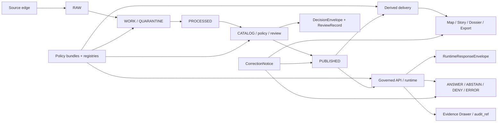

<!-- [KFM_META_BLOCK_V2]
doc_id: kfm://doc/NEEDS_VERIFICATION_UUID
title: Policy
type: standard
version: v1
status: draft
owners: NEEDS VERIFICATION
created: YYYY-MM-DD
updated: YYYY-MM-DD
policy_label: public
related: ["../README.md", "../CONTRIBUTING.md", "../.github/README.md", "../contracts/README.md", "../data/README.md", "../apps/api/README.md"]
tags: [kfm, policy, governance, opa, rego]
notes: ["doc_id, owners, and dates require repo-backed verification before merge", "task target is policy/README.md, but the current-session repo tree was not directly mounted for verification", "relative links below are intended repo neighbors and must be checked against the real checkout before merge"]
[/KFM_META_BLOCK_V2] -->

# Policy

Governed policy-as-code surface for KFM publication, runtime access, evidence resolution, redaction/generalization, and fail-closed behavior.

> **Status:** experimental  
> **Owners:** `NEEDS VERIFICATION`  
>       
> **Repo fit:** intended path `policy/README.md`  
> **Quick jump:** [Scope](#scope) · [Repo fit](#repo-fit) · [Accepted inputs](#accepted-inputs) · [Exclusions](#exclusions) · [Directory tree](#directory-tree) · [Quickstart](#quickstart) · [Usage](#usage) · [Diagram](#diagram) · [Policy family matrix](#policy-family-matrix) · [Lifecycle enforcement map](#lifecycle-enforcement-map) · [Gates / Definition of done](#gates--definition-of-done) · [FAQ](#faq) · [Appendix](#appendix)

> [!IMPORTANT]
> This README is deliberately source-bounded. KFM policy doctrine is strong and mature; exact repo layout, mounted bundles, workflow names, and live policy wiring were **not** directly verified in the current session. Treat repo-shape statements here as a repo-ready target contract until the checkout confirms them.

## Scope

`policy/` is where KFM turns governance into executable decisions.

KFM policy is not a detached compliance appendix. It governs what may enter the system, what may move across the canonical truth path, what may be published, how runtime answers are constrained, and how negative outcomes remain visible instead of being polished away.

### Truth posture used in this README

| Marker | Meaning here |
|---|---|
| **CONFIRMED** | Directly supported by the mounted March 2026 KFM corpus |
| **PROPOSED** | Repo-ready realization that fits KFM doctrine but was not verified as mounted implementation |
| **UNKNOWN** | Not established strongly enough in the current session |
| **NEEDS VERIFICATION** | Placeholder that should be replaced from repo-backed evidence before merge |

### Doctrinal baseline

| Authority role | Most-used sources | What they govern here |
|---|---|---|
| Co-primary doctrine | `KFM_Definitive_Governed_Spatial_Evidence_Manual_March_2026.pdf`, `KFM_Definitive_Unified_Master_Reference_Manual.pdf` | Truth path, trust membrane, authoritative-versus-derived separation, release discipline |
| Policy-specific overlay | `KFM Policy.pdf` | Policy taxonomy, lifecycle obligations, roles, machine-readable first wave |
| Realization / verification overlays | `KFM_Contract_Surface_And_Artifact_Realization_Deepening_Pass_March_2026.pdf`, `KFM_Verification_Doctrine_and_Formal_Placement.pdf`, `KFM_Testing_Verification_Reference_2026-03-17.pdf` | Bundles, fixtures, proof objects, gates, fail-closed runtime behavior |
| Tooling / surface overlays | `Kansas_Frontier_Matrix_Tooling_Architecture_Contracts_and_Implementation_Manual.pdf`, `Kansas_Frontier_Matrix_App_Surfaces_Governed_APIs_Deployable_App_Architecture_Reference.pdf`, `KFM-UI-UX_Reference_and_Build.pdf` | Backend enforcement, review placement, trust-visible states, app consequences |

KFM repeatedly prefers **policy-as-code** over prose-only or UI-only enforcement. The clearest recurring implementation direction is versioned **OPA / Rego** bundles with **Conftest**-style fixtures and merge-blocking policy gates.

### What this directory is for

- versioned publication and runtime policy bundles
- canonical reason, obligation, and reviewer-role registries
- valid and invalid fixtures that prove fail-closed behavior
- explicit review, exception, and stewardship artifacts
- runbooks that keep CI, runtime, review, correction, and documentation aligned

### What this directory must preserve

| Invariant | Operational consequence |
|---|---|
| Canonical truth path | Nothing becomes public-safe without passing staged gates |
| Trust membrane | Public clients and normal shells use governed APIs rather than direct canonical or model-runtime access |
| Authoritative-versus-derived separation | Graph, search, vector, tile, summary, cache, and scene layers remain downstream and rebuildable |
| Fail-closed governance | Hold, quarantine, deny, abstain, generalize, restrict, stale-visible, superseded, withdrawn, and error remain valid outcomes |
| Cite-or-abstain | Runtime synthesis paths verify scope and citations before they can return trusted output |
| Review visibility | Review and stewardship stay attached to evidence, geography, and time context rather than hidden in detached admin flows |

[Back to top](#policy)

## Repo fit

The intended target is `policy/README.md`.

Because the current-session workspace exposed PDFs only, the neighbor links below are **intended repo relationships** and should be verified in the real checkout before merge.

| Direction | Intended neighbor | Role |
|---|---|---|
| Upstream | [`../README.md`](../README.md) | Root project identity, invariants, and navigation |
| Upstream | [`../CONTRIBUTING.md`](../CONTRIBUTING.md) | Change and review expectations for policy-significant work |
| Upstream | [`../contracts/README.md`](../contracts/README.md) | Contract and schema truth that policy evaluates but does not replace |
| Upstream | [`../data/README.md`](../data/README.md) | Lifecycle zones, canonical data movement, and artifact boundaries |
| Downstream | [`../apps/api/README.md`](../apps/api/README.md) | Governed API enforcement boundary and runtime policy consumers |
| Downstream | [`../.github/README.md`](../.github/README.md) | CI / PR / promotion surfaces where policy should execute |

> [!NOTE]
> The repo fit above is intentionally conservative: it describes the **policy surface contract** this README should live within, not a claim that those exact neighbors were mounted and verified in the current session.

## Accepted inputs

| Input class | What belongs here | Typical examples |
|---|---|---|
| Policy bundles | Executable rules grouped by policy concern or decision surface | `bundles/intake/*.rego`, `bundles/runtime/*.rego`, `bundles/publication/*.rego`, `bundles/sensitivity/*.rego` |
| Canonical registries | Stable machine-readable vocabularies reused by bundles, runtime, logs, and UI | `reason_codes.json`, `obligation_codes.json`, `reviewer_roles.json` |
| Next-wave policy registries | Additional controlled vocabularies when the repo adopts the broader machine-readable first wave | `rights_classes.json`, `sensitivity_classes.json`, `surface_states.json` |
| Fixtures | Passing and failing cases that prove deny-by-default and negative-state behavior | `fixtures/valid/*.json`, `fixtures/invalid/*.json`, `*_test.rego` |
| Review / exception artifacts | Explicit, auditable records for signoff, escalation, exception, or correction | `exceptions/*.json`, `review_packets/*`, `steward_checklists/*` |
| Runbooks | Human-readable instructions for local checks, review, rollback, and correction | `runbooks/local-check.md`, `runbooks/review-checklist.md`, `runbooks/correction-drill.md` |
| Starter examples | Canonical example inputs and outputs for docs, tests, and onboarding | `examples/decision_envelope/*.json`, `examples/runtime_response_envelope/*.json` |

### Minimum expectations for additions here

1. Default deny stays the posture unless a narrower allow path is explicit.
2. Shared codes live in registries, not duplicated ad hoc in many rule files.
3. Every bundle change ships with both valid and invalid fixtures.
4. CI and runtime semantics stay aligned.
5. Review-required paths remain explicit, typed, and auditable.
6. Documentation and runbooks change in the same governed stream as behavior-significant policy changes.

## Exclusions

| Does **not** belong in `policy/` | Put it instead | Why |
|---|---|---|
| Canonical object schemas and outward contract truth | [`../contracts/`](../contracts/) | Policy evaluates object state; it does not replace contract ownership |
| Service handlers, adapters, governed API route code, UI components | [`../apps/api/`](../apps/api/) or the relevant app/package path | Enforcement and implementation are related, but not the same artifact |
| RAW / WORK / PROCESSED / CATALOG / PUBLISHED artifacts | [`../data/`](../data/) | Policy acts on lifecycle movement; it is not the artifact store |
| Secrets, tokens, private signing material, `.env` files | runtime secret manager / host configuration | Sensitive operational material must not live in the policy tree |
| Long-form doctrine that never becomes executable or reviewable | project-level docs or governance docs | `policy/` should remain the executable and testable edge of policy |
| UI-only conditionals as the sole control surface | nowhere | KFM policy must execute in backend enforcement and runtime mediation, not only in UI hints |

> [!WARNING]
> Policy review is not a quiet bypass lane. KFM repeatedly treats review and stewardship as part of the evidence chain, with explicit signoff, separation-of-duty pressure, and visible review state where significance requires it.

[Back to top](#policy)

## Directory tree

### Current-session evidence (**CONFIRMED**)

No mounted repo tree or live `policy/` directory was directly inspectable in this session.

That means this README must **not** claim a checked-out policy layout, existing bundle inventory, or verified workflow wiring.

### Proposed minimum target shape (**PROPOSED**)

```text
policy/
├── README.md
├── bundles/
│   ├── intake/
│   │   └── admission.rego
│   ├── publication/
│   │   ├── promotion.rego
│   │   └── release.rego
│   ├── runtime/
│   │   ├── access.rego
│   │   ├── citations.rego
│   │   └── response.rego
│   └── sensitivity/
│       ├── generalization.rego
│       └── redaction.rego
├── reason_codes.json
├── obligation_codes.json
├── reviewer_roles.json
├── fixtures/
│   ├── valid/
│   └── invalid/
├── exceptions/
│   └── README.md
└── runbooks/
    ├── local-check.md
    └── review-checklist.md
```

### Likely next-wave additions (**PROPOSED**)

If the real checkout follows the broader machine-readable first wave described in the March 2026 corpus, the next policy-layer additions are likely to include:

- `rights_classes.json`
- `sensitivity_classes.json`
- `surface_states.json`
- review checklist artifacts
- redaction / generalization transform rules
- route-shaping or runtime cite-or-abstain bundles

### Naming guidance

- Organize by **decision surface** or **policy concern**, not by team name.
- Keep canonical strings in registries, not copied across many files.
- Name fixtures by scenario and expected result.

Examples:

- `citation_missing__abstain.json`
- `restricted_location__generalize.json`
- `release_without_review__hold.json`
- `policy_service_unavailable__error.json`

[Back to top](#policy)

## Quickstart

### 1) Verify the real checkout first

```bash
pwd
test -d policy && find policy -maxdepth 3 -type f | sort
```

### 2) Discover what actually exists

```bash
find policy -maxdepth 3 \( -name '*.rego' -o -name '*.json' -o -name '*.yaml' -o -name '*.yml' \) | sort
```

### 3) Run local policy checks if the repo has the expected tooling

```bash
# Verify real paths before relying on these commands.
opa test policy/bundles -v
conftest test policy/fixtures/valid   --policy policy/bundles
conftest test policy/fixtures/invalid --policy policy/bundles
```

### 4) Confirm bundle + registry + fixture alignment

```bash
# Illustrative audit pattern only; adjust to the real tree.
grep -R "reason_codes\|obligation_codes\|reviewer_roles" policy || true
```

> [!NOTE]
> The commands above are intentionally minimal and reviewable. If the real repo uses `policies/` instead of `policy/`, or keeps bundle code outside `policy/bundles/`, update this README in the same change set that verifies the tree.

## Usage

### Add or extend a policy family

1. Start with the governing question, not the file name.
2. Choose the right decision surface: intake, catalog/review, publication, runtime, or sensitivity.
3. Add or extend the bundle under `policy/bundles/`.
4. Update any affected registries.
5. Add at least one valid and one invalid fixture.
6. Confirm the same logic is visible in CI and in runtime mediation.
7. Update this README or the local runbook when the directory contract changes.

### Add or change a registry

Use registries for values that must stay stable across bundles, routes, logs, tests, and UI trust cues:

- reason codes
- obligation codes
- reviewer roles
- rights classes
- sensitivity classes
- runtime or surface states

Do **not** let those drift into copied strings across many `.rego` files or UI-only conditionals.

### Add a review-required or exception path

A review-required path should answer all of the following:

- what subject or action is under review
- which lane is affected
- why review is required
- who can approve or deny it
- what evidence or policy basis supports the decision
- what correction, rollback, or narrowing path exists later

An exception is not a quiet bypass. It is a governed deviation that stays explicit in review, audit, and runtime context.

### Illustrative starter rule

KFM repeatedly favors small, composable policy slices over one opaque monolith:

```rego
package kfm.policy.runtime.citations

deny[msg] {
  input.surface == "focus"
  count(input.citations) == 0
  msg := "focus answer requires citations"
}

deny[msg] {
  input.release_state != "published"
  msg := "release state must be published"
}

deny[msg] {
  input.evidence_resolved != true
  msg := "evidence bundle must resolve"
}
```

*Illustrative starter only — verify package names, input shape, and actual bundle paths against the real checkout before adoption.*

## Diagram


```mermaid
flowchart LR
  A[Source edge] --> B[RAW]
  B --> C[WORK / QUARANTINE]
  C --> D[PROCESSED]
  D --> E[CATALOG / policy / review]
  E --> F[PUBLISHED]

  P[Policy bundles + registries] --> C
  P --> E
  P --> G[Governed API / runtime]
  P --> H[Derived delivery]

  E --> R[DecisionEnvelope + ReviewRecord]
  F --> H
  F --> G

  H --> I[Map / Story / Dossier / Export]
  G --> J[RuntimeResponseEnvelope]
  G --> K[ANSWER / ABSTAIN / DENY / ERROR]
  G --> L[Evidence Drawer / audit_ref]

  M[CorrectionNotice] --> F
  M --> I
  M --> K
```

## Policy family matrix

Policy families are distinct for clarity, but a single publication or runtime answer may invoke several of them at once.

| Policy family | Governing question | Primary enforcement points | Minimum proof objects | Valid negative outcomes |
|---|---|---|---|---|
| Source admission | May this source, endpoint, archive, or submission enter the path? | Intake, acquisition, source descriptor approval | `source_descriptor`, `ingest_receipt` | reject, hold, quarantine |
| Rights and license | What rights, consent, and reuse obligations govern this material? | Intake, catalog/review, export, runtime | rights metadata, `decision_envelope`, `review_record` | quarantine, restricted, deny, generalized |
| Sensitivity and redaction | What precision, fields, geometry, or narrative detail may be exposed? | WORK / QUARANTINE, catalog/review, runtime, UI | sensitivity class, transform receipts, `EvidenceBundle`, runtime envelope | generalize, withhold, aggregate-only, deny |
| Verification | What must be proven before promotion or answer? | Every truth-path transition and runtime | `validation_report`, `dataset_version`, `catalog_closure`, `runtime_response_envelope` | hold, quarantine, abstain, error |
| Promotion and release | When does a candidate become publishable trust state? | CI/CD, review, release assembly, deploy-time verify-before-trust | `release_manifest`, `review_record`, signatures, attestations | reject, hold, rollback, supersede |
| Runtime response | What may the system answer, cite, deny, or abstain from? | Governed API, Focus coordinator, evidence resolver | `runtime_response_envelope`, `audit_ref`, citation bundle | abstain, deny, error |
| UI trust-visible | What must the interface reveal so trust is operational? | Map, timeline, dossier, story, Evidence Drawer, Focus, steward shell | EvidenceBundle view, policy labels, freshness/review state | unknown-state display, restricted preview, calm failure |
| Correction and rollback | How are wrong, unsafe, or superseded outputs reversed without erasing history? | Correction workflow, rollback flow, runtime correction surfacing | `correction_notice`, release refs, audit trail | superseded, withdrawn, rollback, narrowed republication |
| Contributor / steward / operator governance | Who may propose, review, promote, deploy, correct, or override? | Review boundaries, approval gates, runtime/admin actions | `review_record`, `decision_envelope`, role map, audit events | deny, require second review, separation-of-duty hold |
| AI and Focus Mode | What may the model do, and what must remain outside generation? | Retrieval loop, synthesis step, post-generation validation | evidence resolver output, policy decisions, `audit_ref`, citations | abstain, deny, narrow scope, error |

[Back to top](#policy)

## Lifecycle enforcement map

| Stage | Allowed inputs | Required artifacts | Required policy checks | Valid negative outcomes | Public-safe? |
|---|---|---|---|---|---|
| Source edge | External portals, archives, repositories, services, submitted materials | source terms, acquisition context, descriptor or intake note | source admissibility, access mode, initial rights posture | reject, hold, manual intake review | No |
| RAW | Source-native bytes and minimal intake metadata | checksums, retrieval timestamp, source identity, original packaging, acquisition logs | integrity, packaging preservation, identity capture | hold, reacquire, quarantine | No |
| WORK / QUARANTINE | Transform candidates, normalization, reprojection, parsing, redaction, enrichment, unresolved-risk material | transform logs, candidate manifests, validation outputs, quarantine reasons, intermediate receipts | schema drift, geometry/time safety, rights ambiguity, sensitivity risk, reproducibility | quarantine, deny, steward review, discard candidate | No |
| PROCESSED | Stable derivatives and validated canonical outputs | `dataset_version`, `validation_report`, checksums, transform logs, quality records | schema, CRS, units, identifier stability, time validity, reproducibility, rights/sensitivity classification | hold, reprocess, quarantine | Not automatically |
| CATALOG | Processed subject sets and metadata closure material | STAC / DCAT / PROV closure, `catalog_closure`, `decision_envelope`, `review_record` | identifier resolution, ownership, rights and sensitivity decisions, review readiness, promotion logic | deny promotion, restricted-only, generalized-only, source-dependent labeling | Not by default |
| PUBLISHED | Promoted release scope only | `release_manifest`, `EvidenceBundle`, `projection_build_receipt` as needed, `runtime_response_envelope`, `correction_notice` when applicable | release scope, evidence resolution, runtime citation discipline, freshness/correction visibility, inherited rights/sensitivity rules | restricted-only, generalized-only, stale-visible, abstain, deny, withdrawn, error | Yes, but only within promoted scope |

## Gates / Definition of done

A policy change is done when it is governable, not merely written.

- [ ] The real repo path and adjacent neighbor links were verified in the checkout.
- [ ] `doc_id`, owners, and dates were replaced with repo-backed values.
- [ ] Default-deny remains explicit unless a narrower allow path is justified.
- [ ] Any new reason, obligation, or reviewer-role term was added to a canonical registry.
- [ ] Valid and invalid fixtures exist and are exercised by local or CI checks.
- [ ] The policy bundle gate would still fail closed on missing registries, fixtures, or review state.
- [ ] Runtime citation-negative behavior still degrades to `ABSTAIN`, `DENY`, or `ERROR`.
- [ ] Surface-state behavior still exposes generalized, stale, superseded, withdrawn, or restricted states honestly.
- [ ] Review-required cases still preserve separation-of-duty pressure where significance warrants it.
- [ ] Documentation and runbooks changed alongside behavior-significant policy changes.
- [ ] No UI-only or prose-only enforcement path was introduced.
- [ ] No secrets, credentials, or copied contract truth were added here.

[Back to top](#policy)

## FAQ

### Does this README prove that policy bundles already exist in the mounted repo?

No. It documents **CONFIRMED doctrine** and a **PROPOSED repo shape**. The current-session workspace did not expose a live repo checkout.

### Why keep policy separate from `contracts/`?

Because contracts define shape and meaning, while policy decides what may happen with that shape under rights, sensitivity, release, and runtime conditions.

### Does the UI enforce policy?

The UI should make policy state visible, but it should not be the only enforcement location. KFM policy belongs in backend enforcement, promotion gates, runtime mediation, and correction flows.

### What belongs in reason and obligation registries?

Stable machine-readable vocabulary: why something was denied, held, generalized, restricted, or review-required, and what a conditional allow still requires downstream.

### Where should review and exceptions live?

In explicit review or exception artifacts with approver, reason, effectivity, and audit linkage — not in comments, operator memory, or one-off UI flags.

## Appendix

<details>
<summary><strong>Open verification backlog and suggested first file wave</strong></summary>

### Highest-priority verification checks

1. Verify the real target path and adjacent repo docs before merge.
2. Confirm whether the repo uses `policy/`, `policies/`, or a mixed naming pattern.
3. Confirm whether OPA / Rego bundles and Conftest fixtures already exist.
4. Confirm whether the repo already has reason / obligation / reviewer-role registries.
5. Confirm whether CI runs a policy bundle gate, runtime citation-negative tests, and surface-state checks.
6. Replace placeholder owners, dates, and `doc_id` from repo-backed evidence.

### Suggested first file wave (**PROPOSED**)

| Proposed file | Purpose | Merge only after... |
|---|---|---|
| `policy/README.md` | Directory contract and navigation surface | path and neighboring links are verified |
| `policy/bundles/intake/admission.rego` | Source-admission rule slice | intake contract and source-descriptor shape are settled enough to test |
| `policy/bundles/publication/release.rego` | Promotion and release gate logic | release manifest and review artifacts are stable enough to validate |
| `policy/bundles/runtime/citations.rego` | Citation-negative and scope checks | runtime envelope and citation model are defined |
| `policy/bundles/sensitivity/generalization.rego` | Exact-versus-generalized output control | sensitivity model and transform rules are stable enough to test |
| `policy/reason_codes.json` | Canonical deny / hold / abstain vocabulary | decision grammar is agreed across CI and runtime |
| `policy/obligation_codes.json` | Canonical conditional-allow obligations | downstream surfaces can display obligations clearly |
| `policy/reviewer_roles.json` | Review-required and separation-of-duty map | governance ownership is ratified |
| `policy/fixtures/valid/*.json` | Happy-path regression coverage | major bundle inputs are stable |
| `policy/fixtures/invalid/*.json` | Fail-closed regression coverage | deny and hold outcomes are explicit |
| `policy/runbooks/local-check.md` | Contributor-local validation guidance | actual commands and paths are verified |

### Machine-readable first-wave candidates beyond the minimum tree

| Candidate | Why it is likely next | Keep out of the minimum tree until... |
|---|---|---|
| `policy/rights_classes.json` | Rights posture is a first-class policy burden | checkout confirms the registry belongs under `policy/` rather than `contracts/` |
| `policy/sensitivity_classes.json` | Precision and withholding logic are central to runtime and export safety | the project ratifies the class vocabulary |
| `policy/surface_states.json` | Trust-visible negative states need stable names across shells | UI and runtime state vocabulary are aligned |
| `policy/review_checklists/` | Review packets are repeatedly called out as part of executable governance | steward workflow shape is explicit enough to version |
| `policy/transforms/` | Generalization and redaction rules often need versioned parameter sets | transform ownership is clear and reproducibility rules are defined |

### Authoring notes

- Prefer explicit placeholders over invented certainty.
- Prefer one small, reviewable bundle over a sweeping opaque policy pack.
- Keep this README explanatory and navigational; keep executable truth in versioned files.
- Update the doc in the same change set that verifies the tree or changes the directory contract.

</details>

[Back to top](#policy)
