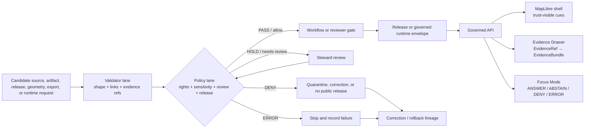
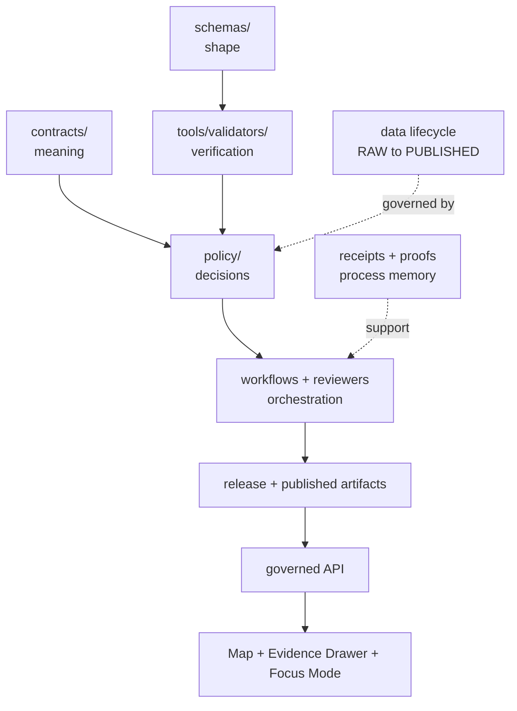

<!-- [KFM_META_BLOCK_V2]
doc_id: kfm://doc/NEEDS_REPO_VERIFICATION_POLICY_README
title: Policy
type: standard
version: v1
status: review
owners: ["@bartytime4life"]
created: TODO-NEEDS-REPO-VERIFICATION
updated: 2026-04-26
policy_label: public
relative_path: policy/README.md
evidence_mode: CORPUS_ONLY_DRAFT
related:
  - "../README.md"
  - "../.github/CODEOWNERS"
  - "../.github/workflows/"
  - "../contracts/"
  - "../schemas/"
  - "../data/"
  - "../tools/validators/"
  - "../tests/"
  - "../packages/"
  - "../apps/"
tags:
  - kfm
  - policy
  - governance
  - trust
  - rights
  - sensitivity
  - review
  - release
  - correction
  - deny-by-default
notes:
  - "Repo-backed doc_id, created date, branch inventory, owner scope, toolchain, and path existence must be rechecked before merge."
  - "This README is written as a repo-ready replacement for policy/README.md, not as proof that proposed child paths already exist."
  - "Relative links are written from policy/README.md."
  - "Policy law belongs here; schemas, contracts, validators, receipts, workflows, apps, and data lifecycle stores remain separate."
[/KFM_META_BLOCK_V2] -->

<a id="top"></a>

# Policy

Governed decision surface for KFM publication, runtime trust, rights, sensitivity, review, correction, and release admissibility.

<div align="left">


</div>

> [!IMPORTANT]
> **Status:** `review` / `experimental`  
> **Path:** `policy/README.md`  
> **Current evidence mode for this draft:** `CORPUS_ONLY_DRAFT`  
> **Merge requirement:** rerun the repo inventory commands before treating any path, owner, workflow, runner, fixture, or enforcement claim as current implementation.  
> **Quick jumps:** [Scope](#scope) · [Operating contract](#operating-contract) · [Repo fit](#repo-fit) · [Accepted inputs](#accepted-inputs) · [Exclusions](#exclusions) · [Directory tree](#directory-tree) · [Policy seams](#policy-seams) · [Quickstart](#quickstart) · [Diagrams](#diagrams) · [Gates](#gates-and-definition-of-done) · [Appendix](#appendix-proposed-first-fill)

> [!TIP]
> Keep the top-level trust split visible:
>
> `probes observe` → `receipts preserve process memory` → `validators verify` → `policy decides` → `workflows orchestrate` → `governed APIs expose`.

---

## Scope

`policy/` is where KFM governance becomes reviewable decision logic.

It should help KFM answer policy-significant questions without hiding uncertainty, sensitivity, rights gaps, or release-state gaps behind fluent prose or UI polish.

| Question | Policy posture |
|---|---|
| Can this source be admitted? | Decide from source role, rights, provenance, cadence, access mode, sensitivity, and review posture. |
| Can this artifact move toward publication? | Require evidence linkage, validation, catalog/proof closure, review state, rollback target, and correction route. |
| Can this geometry be public? | Fail closed for sensitive, restricted, cultural, critical-infrastructure, living-person, DNA, rare-species, exact-location, or steward-controlled exposure. |
| Can a runtime response answer? | Require released policy-safe evidence, citation validation, finite outward outcome, and no direct model-to-public path. |
| Can a story, export, tile, layer, or map popup show a claim? | Preserve provenance, source role, temporal scope, review state, redaction/generalization reason, and release state. |
| Can a correction or withdrawal propagate? | Preserve visible supersession, withdrawal, review-pending, rollback, and lineage state downstream. |

### Evidence posture used here

| Label | Meaning in this README |
|---|---|
| **CONFIRMED** | Verified from current-session evidence, attached KFM doctrine, visible command output, generated artifacts, or repo evidence when a real checkout is mounted. |
| **INFERRED** | Bounded conclusion from evidence, but not directly proven as active implementation. |
| **PROPOSED** | Commit-ready direction that fits KFM doctrine but is not asserted as current branch reality. |
| **UNKNOWN** | Not verified strongly enough to present as current file, runner, workflow, route, runtime behavior, dashboard, or emitted artifact. |
| **NEEDS VERIFICATION** | Branch-, environment-, source-, owner-, tool-, license-, endpoint-, or deployment-specific detail that must be rechecked before merge or release. |
| **CONFLICTED** | Evidence layers or file-home conventions may disagree; resolve by ADR, compatibility map, or narrower claim. |

### Load-bearing commitments

| Commitment | Practical consequence |
|---|---|
| Deny by default | Missing rights, unresolved sensitivity, unsupported source role, broken evidence linkage, absent review, or missing rollback target must produce a governed negative outcome. |
| Policy decides after validation | Validators shape-check and link-check inputs; policy decides allow, deny, hold, obligation, restriction, generalization, embargo, or correction. |
| Reasons stay typed | Policy decisions should emit stable reason and obligation codes rather than prose-only justifications. |
| Publication is governed | Public release is a reviewed state transition, not a file move, UI toggle, tile upload, or model response. |
| Correction remains visible | Withdrawn, superseded, review-pending, embargoed, generalized, and rollback states must survive downstream. |
| UI reflects policy; it does not replace it | Trust cues belong in the shell, but backend, review, release, runtime, and evidence gates remain primary. |
| AI stays interpretive | EvidenceBundle and policy outrank generated language; runtime output is never the root truth object. |

[Back to top](#top)

---

## Operating contract

Policy is a decision layer. It consumes structured, already-validated inputs and returns finite, typed outcomes that downstream systems can enforce, explain, test, and roll back.

### What policy consumes

| Input | Required posture |
|---|---|
| Source descriptor or source intake record | Source role, rights posture, access mode, update cadence, steward notes, and sensitivity class are explicit. |
| Evidence reference set | Every consequential `EvidenceRef` can resolve to an admissible `EvidenceBundle` before a claim is exposed. |
| Candidate artifact or release bundle | Validation state, catalog/proof closure, review state, rollback reference, and correction path are present. |
| Runtime request envelope | Scope, user surface, released evidence context, citation plan, and policy label are bounded. |
| Geometry or layer descriptor | Exposure class, redaction/generalization transform, source role, and review state are explicit. |
| Correction or withdrawal notice | Superseded target, replacement state, rollback target, and downstream propagation obligations are visible. |

### What policy returns

| Surface | Finite outcomes | Required explanation |
|---|---|---|
| Runtime / public response | `ANSWER`, `ABSTAIN`, `DENY`, `ERROR` | Reason codes, citation/evidence state, and policy label. |
| Gate / review evaluation | `PASS`, `HOLD`, `DENY`, `ERROR` | Blocking reason codes and reviewer obligations. |
| Release-state receipt | `PROMOTED`, `BLOCKED`, `REVERTED` | Proof/catalog/review/rollback status. |
| Sensitivity handling | `PUBLIC`, `GENERALIZED`, `RESTRICTED`, `EMBARGOED`, `DENIED` | Exposure rule and transform receipt when applicable. |
| Correction handling | `SUPERSEDE`, `WITHDRAW`, `ROLLBACK`, `NOOP`, `ERROR` | Target artifact, lineage, replacement, and propagation requirement. |

> [!NOTE]
> Prose can explain a decision, but prose must not be the decision. Machines need stable outcome, reason, obligation, policy label, review state, and audit references.

### Starter reason-code families

| Family | Example codes |
|---|---|
| Rights | `missing_rights_posture`, `rights_not_public`, `source_terms_unverified` |
| Evidence | `unresolved_evidence_ref`, `missing_evidence_bundle`, `citation_validation_failed` |
| Sensitivity | `unknown_sensitivity`, `exact_sensitive_geometry`, `steward_review_required` |
| Review | `missing_required_reviewer`, `review_state_not_releasable`, `separation_of_duty_required` |
| Release | `missing_release_manifest`, `catalog_closure_failed`, `missing_rollback_target` |
| Runtime | `context_not_released`, `direct_model_output_blocked`, `non_finite_runtime_outcome` |
| Correction | `superseded_target_missing`, `withdrawal_not_propagated`, `rollback_receipt_missing` |

[Back to top](#top)

---

## Repo fit

This file is the parent README for KFM policy work. It explains where policy law belongs, where policy support code does **not** belong, and how policy-related proof stays separated from contracts, schemas, validators, receipts, workflows, apps, and UI conditionals.

| Direction | Surface | Why it matters |
|---|---|---|
| Upstream | [`../README.md`](../README.md) | Root system identity, doctrine summary, and repository navigation. |
| Ownership | [`../.github/CODEOWNERS`](../.github/CODEOWNERS) | Ownership and review burden. Verify current branch before relying on it. |
| Guardrail | [`../.github/workflows/`](../.github/workflows/) | Workflow-lane home for orchestration; workflow presence is not the same as policy truth. |
| Lateral | [`../contracts/`](../contracts/) | Normative meaning of trust-bearing objects such as `EvidenceBundle`, `DecisionEnvelope`, release handoff, and runtime envelopes. |
| Lateral | [`../schemas/`](../schemas/) | Machine-readable validation shapes; policy should consume schemas, not fork them. |
| Lateral | [`../data/`](../data/) | Lifecycle zones and emitted objects that policy governs but does not store. |
| Lateral | [`../tools/validators/`](../tools/validators/) | Shape, linkage, catalog, citation, and integrity checks that prepare inputs before policy decides. |
| Downstream | [`../tests/`](../tests/) | Repo-facing proof that policy behavior holds under runtime, release, correction, sensitivity, and negative-path pressure. |
| Downstream | [`../packages/`](../packages/) | Shared loaders, adapters, and helpers should remain subordinate to the top-level policy lane. |
| Downstream | [`../apps/`](../apps/) | Runtime/API/UI enforcement may consume policy, but should not become the hidden source of policy law. |

> [!WARNING]
> Do not let `policy/` quietly resolve `contracts/` versus `schemas/` by duplication. KFM keeps trust objects explicit and singular: contracts define meaning, schemas define structure, validators verify, and policy decides admissibility.

### Authority split

| Concern | Primary home | Policy relationship |
|---|---|---|
| Object meaning | `contracts/` | Policy references contract semantics. |
| Object shape | `schemas/` | Policy assumes schema-valid inputs unless a test intentionally exercises invalid input. |
| Shape/linkage/integrity checks | `tools/validators/` | Policy consumes validator result objects. |
| Review and release orchestration | `.github/workflows/`, release tooling | Workflows call policy and preserve receipts; they do not define policy law. |
| Canonical and lifecycle data | `data/` | Policy governs movement/exposure; it does not store canonical truth. |
| Public UI behavior | `apps/`, `packages/` | UI shows policy state and explanations; it does not decide release eligibility alone. |

[Back to top](#top)

---

## Accepted inputs

`policy/` should stay compact, typed, reviewable, and decision-oriented.

| Input class | What belongs here | Typical examples |
|---|---|---|
| Policy-as-code bundles | Rule families that decide a trust seam or seam family. | `*.rego`, `bundle.yaml`, seam-local helper modules. |
| Small checked-in policy data | Reviewable, schema-valid classification data used by governed review or promotion. | `promotion_bundle_diff_policy.json`, reason-code maps, obligation-code maps. |
| Positive and negative fixtures | Minimal examples proving deny-by-default and allow-only-when-supported behavior. | `allow`, `deny`, `restrict`, `generalize`, `needs-review`, `withdraw`, `supersede`. |
| Bundle-local assertions | Local checks that prove a bundle family behaves as documented. | OPA/Conftest checks, stable outcome tests, import-resolution checks. |
| Runtime-policy coordination notes | Human-readable notes explaining how governed runtimes consume policy without moving authority into apps. | Decision assembly notes, runtime parity notes, mediation guidance. |
| Steward-facing review notes | Small, durable notes needed to review policy-significant changes. | Rights/sensitivity review notes, lane-specific steward burdens, source-role caveats. |

### Working placement rule

If a change mostly defines **policy law**, keep it in `policy/`.

If it mostly defines **object shape**, move it to `schemas/`.

If it mostly defines **object meaning**, move it to `contracts/`.

If it mostly proves **whole-path behavior**, move it to `tests/`.

If it mostly performs **shape, linkage, or integrity checks**, move it to `tools/validators/`.

If it mostly records **process memory**, move it to receipts/proofs/release lanes after repo convention verification.

[Back to top](#top)

---

## Exclusions

| Does **not** belong in `policy/` | Put it instead | Why |
|---|---|---|
| Canonical JSON Schema or OpenAPI definitions | [`../schemas/`](../schemas/) and [`../contracts/`](../contracts/) | Shared trust-object shape should not drift into rule-pack lanes. |
| A second authoritative schema registry | [`../schemas/`](../schemas/) plus ADR | Parallel schema homes increase ambiguity, not resilience. |
| Probe freshness, source polling, or drift detection | `../tools/probes/` or pipeline/source lanes after verification | Observation belongs upstream of policy. |
| Validator enforcement logic | [`../tools/validators/`](../tools/validators/) | Validators verify; policy decides. |
| API handlers, workers, or UI conditionals | [`../apps/`](../apps/) and [`../packages/`](../packages/) | Enforcement code is not the same artifact as the policy pack. |
| RAW / WORK / QUARANTINE / PROCESSED / CATALOG / PUBLISHED artifacts | [`../data/`](../data/) | Policy governs movement and exposure; it is not the canonical store. |
| Receipts, proofs, release manifests, or signed bundles as primary artifacts | `../data/receipts/`, `../data/proofs/`, and `../release/` after verification | Process memory and proof objects remain separate from policy law. |
| Workflow orchestration or platform settings | [`../.github/workflows/`](../.github/workflows/) and platform configuration | Orchestration may call policy; it should not hide policy. |
| Secrets, keys, tokens, `.env` files, or live credentials | Secret manager or host configuration | Sensitive operational material must not live in a public policy lane. |
| Direct model output or chain-of-thought | Governed runtime envelopes and evidence bundles | AI is interpretive; EvidenceBundle and policy outrank generation. |
| Reviewer-only Markdown rendering | CI/reviewer tooling lanes after verification | Policy emits decisions or rule results; rendering belongs elsewhere. |

[Back to top](#top)

---

## Directory tree

### Current branch snapshot (**NEEDS VERIFICATION before merge**)

The incoming README described the public `policy/` lane as thin. Treat this as a branch-specific claim that must be rechecked in the actual target checkout.

```text
policy/
├── .gitkeep
└── README.md
```

This README should therefore serve two roles at once:

1. **Current lane contract** for a thin policy directory.
2. **Growth guide** for the first governed policy subtrees that should be added only when backed by fixtures, tests, and review.

### Doctrine-aligned growth shape (**PROPOSED**)

```text
policy/
├── README.md
├── bundles/
│   ├── README.md
│   ├── admission/
│   ├── rights/
│   ├── sensitivity/
│   ├── review/
│   ├── runtime/
│   ├── release/
│   ├── export/
│   └── correction/
├── fixtures/
│   ├── allow/
│   ├── deny/
│   ├── restrict/
│   ├── generalize/
│   ├── needs-review/
│   ├── withdraw/
│   └── supersede/
├── tests/
│   ├── README.md
│   ├── decision-grammar/
│   ├── deny-by-default/
│   └── import-resolution/
└── policy-runtime/
    └── README.md
```

> [!NOTE]
> The proposed tree is seam-led, not tool-led. Keep the governed seam stable even if the repo later standardizes on a different runner, package manager, or policy engine.

[Back to top](#top)

---

## Policy seams

Policy work should name the seam it protects. That makes rule packs easier to review, test, and rollback.

| Seam | Policy burden | Example denial |
|---|---|---|
| Source admission | Source role, rights, provenance, cadence, and access mode are explicit. | Unknown rights or undocumented access mode. |
| Evidence linkage | Consequential claims resolve to admissible evidence. | `EvidenceRef` missing or not resolvable to `EvidenceBundle`. |
| Sensitivity | Exact location, identity, cultural, critical, or restricted data is handled safely. | Public exact sensitive geometry. |
| Review | Required steward, domain, policy, or release review exists. | Release candidate missing reviewer or review state. |
| Runtime | Outward answers are finite and evidence-bounded. | Claim-bearing answer without citations or policy-safe context. |
| Release | Publication has proof closure, catalog closure, rollback target, and correction route. | Release manifest missing rollback reference. |
| Export / story | Public exports preserve provenance, scope, redaction, and caveats. | Story node strips source role or generalization reason. |
| Correction | Supersession, withdrawal, and rollback propagate visibly. | New version silently overwrites a published claim. |

### Seam review checklist

| Check | Required answer |
|---|---|
| What object is being decided? | Source, evidence bundle, artifact, release bundle, runtime envelope, geometry, export, correction, or review. |
| What authority does policy rely on? | Contract, schema, validator result, source descriptor, review record, release manifest, or receipt. |
| What is the default if the input is incomplete? | `DENY`, `HOLD`, `ABSTAIN`, `RESTRICTED`, `EMBARGOED`, or `ERROR`. |
| What artifact records the decision? | PolicyDecision, DecisionEnvelope, PromotionDecision, ReleaseReceipt, RuntimeResponseEnvelope, or correction receipt. |
| What breaks if this rule is wrong? | Public trust, source rights, sensitivity safety, release integrity, runtime integrity, or correction lineage. |

[Back to top](#top)

---

## Lifecycle placement

KFM’s lifecycle invariant is not a slogan. It is a publication safety boundary.

```text
RAW -> WORK / QUARANTINE -> PROCESSED -> CATALOG / TRIPLET -> PUBLISHED
```

Policy should decide movement, exposure, restriction, and release posture across this lifecycle. It should not collapse lifecycle stages or allow public clients to read from internal stages.

| Lifecycle stage | Policy posture |
|---|---|
| `RAW` | Never public by default. Source terms, collection method, sensitivity, and integrity are not yet resolved. |
| `WORK` | Processing may continue, but publication claims remain blocked. |
| `QUARANTINE` | Rights, quality, sensitivity, provenance, or validation concern blocks normal processing. |
| `PROCESSED` | Shape and transformation may be valid, but release is still not automatic. |
| `CATALOG / TRIPLET` | Discoverability and graph/search projections are governed derivatives, not sovereign truth. |
| `PUBLISHED` | Public/semi-public exposure requires release state, evidence, policy, review, and correction support. |

> [!CAUTION]
> A public tile, graph edge, search result, story node, or AI answer is a downstream carrier. It does not become authoritative merely because it renders successfully.

[Back to top](#top)

---

## Runtime, UI, and AI boundary

Policy decisions must be enforceable outside the README.

| Surface | Boundary rule |
|---|---|
| Governed API | Public clients consume released artifacts, EvidenceBundle resolution, and policy-safe envelopes. |
| MapLibre shell | Trust cues, redaction state, layer provenance, and review state are visible at the point of use. |
| Evidence Drawer | Consequential claims expose EvidenceRef → EvidenceBundle resolution rather than unsupported summaries. |
| Focus Mode / AI | Model runtime receives only released, policy-safe context and returns finite outcomes. |
| Exports / stories | Public narrative output carries provenance, scope, caveats, redaction/generalization reasons, and correction lineage. |

### Runtime answer contract

A runtime answer is releasable only when all required checks pass:

```text
scope defined
+ admissible evidence retrieved
+ EvidenceRef resolved to EvidenceBundle
+ rights and sensitivity policy passed
+ citation validation passed
+ finite outcome selected
+ response envelope emitted
```

Missing evidence should become `ABSTAIN` or `DENY`, not a plausible answer.

[Back to top](#top)

---

## Quickstart

Run these from the repository root before editing or reviewing policy work.

### 1) Confirm the policy lane before editing

```bash
git status --short
git branch --show-current
git rev-parse --show-toplevel

find policy -maxdepth 4 \( -type f -o -type d \) 2>/dev/null | sort
sed -n '1,260p' policy/README.md 2>/dev/null || true
sed -n '1,220p' .github/CODEOWNERS 2>/dev/null || true
```

### 2) Inspect adjacent authority surfaces

```bash
find contracts schemas data tools tests packages apps .github/workflows \
  -maxdepth 3 \( -type f -o -type d \) 2>/dev/null \
  | sort \
  | sed -n '1,300p'

grep -RInE \
  'EvidenceBundle|DecisionEnvelope|RuntimeResponseEnvelope|ReleaseManifest|PolicyDecision|CorrectionNotice|rights|sensitivity|ABSTAIN|DENY|HOLD' \
  contracts schemas policy data tools tests packages apps docs 2>/dev/null || true
```

### 3) Check whether policy tooling exists before claiming enforcement

```bash
command -v opa >/dev/null && opa version || echo "OPA not installed or not on PATH"
command -v conftest >/dev/null && conftest --version || echo "Conftest not installed or not on PATH"

find policy -type f \
  \( -name '*.rego' -o -name 'bundle.yaml' -o -name 'bundle.yml' -o -name '*policy*.json' \) \
  2>/dev/null \
  | sort
```

### 4) First safe review pass

```bash
# Look for dangerous drift: policy logic hidden in apps/UI, secrets, or raw artifacts.
grep -RInE \
  'allow|deny|rights|sensitivity|redact|generalize|embargo|EvidenceBundle|DecisionEnvelope' \
  apps packages policy tools tests .github 2>/dev/null || true

# Look for accidental sensitive material in policy files.
grep -RInE \
  'API_KEY|SECRET|TOKEN|PASSWORD|PRIVATE KEY|BEGIN RSA|BEGIN OPENSSH|\.env' \
  policy 2>/dev/null || true
```

### 5) Minimal markdown sanity check

```bash
python - <<'PY'
from pathlib import Path
p = Path('policy/README.md')
text = p.read_text(encoding='utf-8')
checks = {
    'closed_fences': text.count(chr(96) * 3) % 2 == 0,
    'has_meta_block': '[KFM_META_BLOCK_V2]' in text and '[/KFM_META_BLOCK_V2]' in text,
    'has_lifecycle': 'RAW -> WORK' in text,
    'has_deny_default': 'Deny by default' in text or 'deny by default' in text,
    'has_back_to_top': '[Back to top](#top)' in text,
}
for name, ok in checks.items():
    print(f'{name}: {"PASS" if ok else "FAIL"}')
raise SystemExit(0 if all(checks.values()) else 1)
PY
```

[Back to top](#top)

---

## Diagrams

### Decision flow


```mermaid
flowchart LR
  A[Candidate source, artifact, release, geometry, export, or runtime request] --> B[Validator lane<br/>shape + links + evidence refs]
  B --> C{Policy lane<br/>rights + sensitivity + review + release}
  C -->|PASS / allow| D[Workflow or reviewer gate]
  C -->|HOLD / needs review| E[Steward review]
  C -->|DENY| F[Quarantine, correction, or no public release]
  C -->|ERROR| G[Stop and record failure]

  D --> H[Release or governed runtime envelope]
  E --> C
  H --> I[Governed API]
  I --> J[MapLibre shell<br/>trust-visible cues]
  I --> K[Evidence Drawer<br/>EvidenceRef → EvidenceBundle]
  I --> L[Focus Mode<br/>ANSWER / ABSTAIN / DENY / ERROR]

  F --> M[Correction / rollback lineage]
  G --> M
```

### Authority split


```mermaid
flowchart TB
  Contracts[contracts/<br/>meaning] --> Policy[policy/<br/>decisions]
  Schemas[schemas/<br/>shape] --> Validators[tools/validators/<br/>verification]
  Validators --> Policy
  Policy --> Workflows[workflows + reviewers<br/>orchestration]
  Workflows --> Release[release + published artifacts]
  Release --> API[governed API]
  API --> UI[Map + Evidence Drawer + Focus Mode]

  Data[data lifecycle<br/>RAW to PUBLISHED] -. governed by .-> Policy
  Receipts[receipts + proofs<br/>process memory] -. support .-> Workflows
```

> [!CAUTION]
> A visually successful map, story, export, or AI answer is not evidence of policy compliance. KFM compliance is shown by traceable decisions, validated evidence, review state, release state, and correction lineage.

[Back to top](#top)

---

## Gates and definition of done

A policy change is ready for review when it strengthens decision clarity without weakening the trust membrane.

- [ ] The changed seam is named: admission, rights, sensitivity, review, runtime, release, export, or correction.
- [ ] Branch inventory was rechecked and the README does not claim uncreated child paths.
- [ ] Owner/reviewer burden is visible through `CODEOWNERS` or a review note.
- [ ] Any new rule has at least one positive and one negative fixture.
- [ ] Denial reasons are stable enough to test.
- [ ] Unknown rights and unknown sensitivity fail closed.
- [ ] Public exact-location exposure is denied unless a reviewed policy allows a public-safe transform.
- [ ] Policy consumes schemas/contracts; it does not fork them.
- [ ] Policy is not hidden in API handlers, UI conditionals, workflow YAML, or helper package code.
- [ ] Runtime-facing behavior preserves finite outcomes.
- [ ] Release-facing behavior preserves proof, catalog, review, rollback, and correction surfaces.
- [ ] Correction-facing behavior preserves supersession, withdrawal, propagation, and rollback lineage.
- [ ] Docs were updated, or the PR explains why no docs changed.
- [ ] Rollback is described before merge for any policy-significant change.

### Merge-blocking anti-patterns

| Anti-pattern | Why it blocks |
|---|---|
| Silent allow on missing rights | Converts uncertainty into public permission. |
| Public exact sensitive geometry without review | Creates location, cultural, ecological, personal, or infrastructure exposure risk. |
| Policy duplicated in UI conditionals | Makes visible behavior diverge from backend/release enforcement. |
| Schema shape forked inside policy | Creates two authorities for trust-object validity. |
| Model output treated as policy proof | Collapses AI interpretation into evidence or review state. |
| Release without rollback target | Prevents reversible publication. |
| Correction that overwrites instead of superseding | Breaks public lineage and auditability. |

[Back to top](#top)

---

## FAQ

### Is `policy/` the enforcement engine?

Not by itself. `policy/` is the decision-authority lane. Enforcement may happen through validators, workflows, governed APIs, release tooling, or runtime middleware, but those consumers should not become the hidden source of policy truth.

### Can policy files be JSON instead of Rego?

Yes, for small checked-in classification data when the file is schema-valid, reviewable, and intentionally bounded. Policy-as-code bundles and small machine-readable policy data can coexist if both remain clearly scoped.

### Should domain-specific policy live here?

Yes, when the rule is genuinely a policy decision. Domain-specific validators, source descriptors, fixtures, pipelines, and docs should remain in their own lanes and link back here.

### What should happen when policy cannot decide safely?

Return a governed negative outcome: `DENY`, `HOLD`, `ABSTAIN`, `RESTRICTED`, `GENERALIZED`, `EMBARGOED`, or `ERROR`, depending on surface. Do not turn uncertainty into a silent allow.

### Can a policy pass make a source authoritative?

No. Policy can admit, restrict, block, or require review. Source authority comes from source role, evidence, contract semantics, review posture, and release state.

[Back to top](#top)

---

## Appendix: proposed first fill

<details>
<summary><strong>Smallest useful policy-lane expansion</strong> (<strong>PROPOSED</strong>)</summary>

A good first expansion should prove boundaries before adding many rules.

```text
policy/
├── README.md
├── bundles/
│   ├── README.md
│   ├── runtime/
│   │   ├── bundle.yaml
│   │   └── finite_outcomes.rego
│   ├── rights/
│   │   ├── bundle.yaml
│   │   └── public_release_rights.rego
│   └── sensitivity/
│       ├── bundle.yaml
│       └── public_geometry_exposure.rego
├── fixtures/
│   ├── allow/
│   │   └── released_public_safe.evidence.json
│   ├── deny/
│   │   ├── missing_rights.json
│   │   ├── unresolved_evidence_ref.json
│   │   └── exact_sensitive_geometry.json
│   └── needs-review/
│       └── steward_required.json
└── tests/
    ├── README.md
    ├── runtime_outcomes_test.rego
    ├── rights_test.rego
    └── sensitivity_test.rego
```

Suggested first denial cases:

| Case | Expected outcome |
|---|---|
| Missing rights posture | `DENY` |
| Unknown sensitivity class | `HOLD` or `DENY` |
| Public exact sensitive geometry | `DENY` |
| Runtime answer without EvidenceBundle | `DENY` |
| Claim-bearing answer without citations | `ABSTAIN` or `DENY` |
| Release candidate missing rollback target | `HOLD` |
| Correction without superseded target | `DENY` |

</details>

<details>
<summary><strong>Illustrative policy decision sketch</strong> (<strong>illustrative only</strong>)</summary>

```json
{
  "kind": "PolicyDecision",
  "version": "v1",
  "surface": "release_gate",
  "outcome": "DENY",
  "reason_codes": [
    "missing_rights_posture",
    "unresolved_evidence_ref"
  ],
  "obligation_codes": [
    "add_source_rights_review",
    "resolve_evidence_bundle"
  ],
  "policy_label": "restricted",
  "review_state": "needs_policy_review",
  "audit_ref": "NEEDS_VERIFICATION_AUDIT_REF"
}
```

This sketch is not a schema. Keep schema authority in `schemas/` and semantic contract authority in `contracts/`.

</details>

<details>
<summary><strong>Minimal PR note template</strong></summary>

```markdown
## Policy seam changed

- Seam:
- Rule family:
- Default negative outcome:

## Evidence and authority

- Contract(s):
- Schema(s):
- Validator result(s):
- Fixture(s):
- Review burden:

## Safety checks

- [ ] Unknown rights fail closed.
- [ ] Unknown sensitivity fails closed.
- [ ] Public exact sensitive geometry is denied or reviewed/generalized.
- [ ] Runtime outputs remain finite.
- [ ] Release/correction rollback path is described.

## Rollback

Describe how to revert this policy change and how to identify affected release/runtime decisions.
```

</details>

[Back to top](#top)
