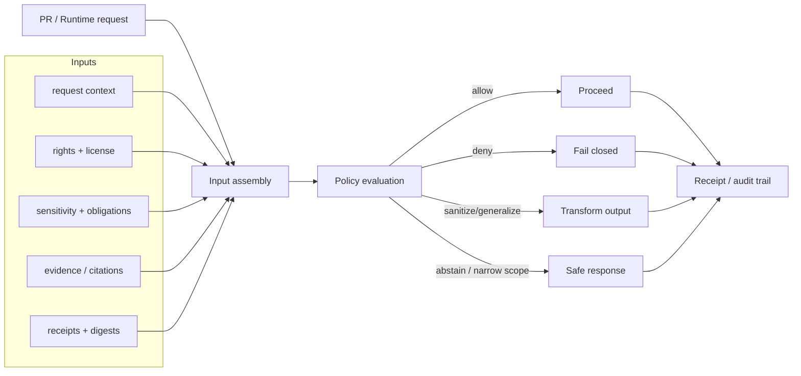

<!-- [KFM_META_BLOCK_V2]
doc_id: kfm://doc/4f94a656-98b0-45b7-b8bb-2cc24b65fd0b
title: policy/README.md
type: standard
version: v1
status: draft
owners: Governance Team; Platform Team; TODO confirm CODEOWNERS
created: 2026-03-07
updated: 2026-03-07
policy_label: public
related: [../, ./]
tags: [kfm, policy, governance, opa, rego]
notes: [Directory contract draft; actual repo tree alignment pending verification]
[/KFM_META_BLOCK_V2] -->

# Policy

Governed policy-as-code for KFM publication, runtime access, evidence resolution, redaction/generalization, and safe-deny behavior.

**Status:** experimental  
**Owners:** TODO — Governance Team / Platform Team  
**Badges:**    

**Quick links:** [Scope](#scope) · [Repo fit](#repo-fit) · [Accepted inputs](#accepted-inputs) · [Exclusions](#exclusions) · [Directory tree](#proposed-directory-shape) · [Quickstart](#quickstart) · [Usage](#usage) · [Diagram](#policy-flow) · [Rule-pack matrix](#rule-pack-matrix) · [Gates / DoD](#gates-and-definition-of-done) · [FAQ](#faq) · [Appendix](#appendix)

---

## Scope

This directory holds versioned policy artifacts that make KFM governance executable.

In scope:

- policy-as-code bundles used in CI and/or runtime decision paths
- fail-closed rules for rights, sensitivity, provenance, evidence, retention, release, and output contracts
- fixtures and regression cases that prove a policy change behaves as intended
- machine-readable policy data needed by rule evaluation
- versioned decision records for policy-significant changes

This README documents the contract of `policy/`. The **current implemented tree is not assumed here**. The structure below is the intended shape until the live repo is verified.

[Back to top](#policy)

## Repo fit

**Path:** `policy/`

**Upstream inputs**

`policy/` consumes governed inputs from sources such as:

- request context from the governed API
- dataset metadata and rights/license fields
- sensitivity labels and generalization obligations
- Story Node payloads
- EvidenceRef / EvidenceBundle resolution context
- run receipts, checksums, and release metadata
- contributor submissions entering quarantine/promotion paths

**Downstream effects**

Rules in this directory influence or gate:

- CI merge blocking
- publication / promotion decisions
- runtime authorization and safe denials
- evidence resolution
- Story publishing
- Focus Mode abstain / narrow-scope behavior
- redaction and geometry generalization choices
- trust surfaces in the UI

**Repo links**

- Upstream: [repo root](../)
- Local directory: [policy/](./)

> **Important**
> Keep this directory as policy logic and supporting governance artifacts. Do not let app handlers, ad hoc scripts, or copied contracts turn `policy/` into a second implementation tree.

[Back to top](#policy)

## Accepted inputs

| Input class | What belongs here | Typical examples |
|---|---|---|
| Policy bundles | Executable rules evaluated in CI and/or runtime | `rego/**/*.rego`, policy modules by concern or route |
| Fixture packs | Allow/deny cases that prove rule behavior | `fixtures/allow/*.json`, `fixtures/deny/*.json` |
| Policy data | Machine-readable vocabularies and lookup data used by rules | role maps, sensitivity tiers, obligations, allowlists |
| Decision records | Versioned rationale for policy-significant changes | ADRs, exception records, migration notes |
| Validation helpers | Small policy-local scripts/config that support evaluation | wrapper scripts, local test configs, fixture generators |
| Documentation | Directory contract and contributor guidance | this README, local notes, review checklists |

## Exclusions

The following do **not** belong in `policy/`:

- service source code, API handlers, UI logic, or auth middleware
- authoritative copies of schemas, contracts, or API specs; link to their versioned homes instead
- dataset artifacts, catalogs, tiles, or raw/processed content
- secrets, signing keys, credentials, or `.env` files
- one-off notebooks, analyst scratch work, or unreviewed experiments
- undocumented exceptions or hotfixes that bypass review
- exhaustive copied rule bodies embedded in this README

Put those items in their proper versioned locations elsewhere in the repo, and link to them from here when needed.

[Back to top](#policy)

## Proposed directory shape

> **Proposed shape only** — align this tree to the verified repo snapshot before merge.

```text
policy/
├── README.md
├── rego/
│   ├── shared/
│   │   ├── lib.rego
│   │   └── reasons.rego
│   ├── runtime/
│   │   ├── api.rego
│   │   ├── evidence.rego
│   │   └── focus.rego
│   ├── publish/
│   │   ├── release.rego
│   │   ├── rights.rego
│   │   └── sensitivity.rego
│   └── content/
│       ├── story.rego
│       └── catalog.rego
├── data/
│   ├── roles/
│   ├── obligations/
│   ├── vocab/
│   └── allowlists/
├── fixtures/
│   ├── allow/
│   ├── deny/
│   └── regression/
├── decisions/
│   ├── ADR-*.md
│   └── exceptions/
└── tools/
    ├── local-check.sh
    └── smoke.sh
```

### Naming guidance

- Organize rule packs by **decision surface** (`runtime`, `publish`, `content`) rather than by team.
- Keep shared helpers under `rego/shared/`.
- Keep data-only files out of rule folders.
- Make fixture names state the scenario and expected result:
  - `story_missing_evidence__deny.json`
  - `dataset_public_with_license__allow.json`

[Back to top](#policy)

## Quickstart

### Local validation

```bash
# Run all policy fixtures
conftest test ./policy/fixtures --policy ./policy/rego

# Example: test story-node payloads against the policy bundle
# Verify the actual target path in this repo before keeping this command.
conftest test ./stories/**/story-node.json -p ./policy/rego

# Example: test catalog JSON against the same bundle
# Verify the actual target path in this repo before keeping this command.
conftest test ./data/catalog/**/*.json -p ./policy/rego
```

### Optional OPA server mode

```bash
# Useful when local services query policy over HTTP
opa run --server --addr :8181 ./policy/rego
```

### Optional smoke evaluation

```bash
# Example only — replace package/path with the actual rule path
curl -s -X POST "http://localhost:8181/v1/data/kfm/runtime/allow" \
  -H "Content-Type: application/json" \
  -d @./policy/fixtures/allow/example.json
```

[Back to top](#policy)

## Usage

### Adding or changing a rule

1. Decide which surface you are changing: `runtime`, `publish`, or `content`.
2. Add or modify the rule in the relevant bundle.
3. Add at least one **allow** and one **deny** fixture for the change.
4. Add or update a decision record if the change is policy-significant.
5. Run local validation.
6. Update this README when the behavior, contract, or local commands change.

### Review rule of thumb

A policy change is not done when the rule compiles. It is done when:

- the behavior is deterministic
- the deny reason is understandable
- fixtures prove both success and failure paths
- downstream callers know how to react
- related docs and runbooks are updated

### Behavior model

Policy outcomes should be explicit and machine-consumable. Prefer one of these outcomes:

- **allow** — request or artifact may proceed
- **deny** — fail closed
- **sanitize / generalize** — proceed only after policy-directed redaction/generalization
- **abstain / narrow scope** — especially for Focus Mode or evidence-poor synthesis surfaces

[Back to top](#policy)

## Policy flow


```mermaid
flowchart LR
    A[PR / Runtime request] --> B[Input assembly]
    B --> C[Policy evaluation]
    C -->|allow| D[Proceed]
    C -->|deny| E[Fail closed]
    C -->|sanitize/generalize| F[Transform output]
    C -->|abstain / narrow scope| G[Safe response]

    D --> H[Receipt / audit trail]
    E --> H
    F --> H
    G --> H

    subgraph Inputs
      I[request context]
      J[rights + license]
      K[sensitivity + obligations]
      L[evidence / citations]
      M[receipts + digests]
    end

    I --> B
    J --> B
    K --> B
    L --> B
    M --> B
```

[Back to top](#policy)

## Rule-pack matrix

| Concern | Typical inputs | Expected outputs | Enforcement point |
|---|---|---|---|
| Rights / license | SPDX/license fields, access rights, redistribution terms | allow / deny / attribution obligations | CI + publish + runtime |
| Sensitivity / sovereignty | sensitivity labels, geography class, custodial rules, review status | deny / generalize / precision cap / restricted tier | runtime + publish |
| Evidence / citation | EvidenceRefs, EvidenceBundle availability, story claims, Focus citations | allow / deny / abstain / narrow scope | CI + runtime |
| Provenance / receipts | spec hash, digests, run receipts, attestation state | pass / fail / trust-surface eligibility | CI + release |
| Output contract | schema shape, required fields, safe null behavior, denial envelope | pass / fail | CI + API contract tests |
| Retention / quarantine | state, review completion, lifecycle obligations | allow / deny / quarantine | ingest + publish |

## Gates and definition of done

A policy-related PR is not ready to merge until all relevant boxes are checked.

- [ ] **Gate A — Identity/versioning:** inputs that need `dataset_id`, `dataset_version`, or `spec_hash` validate cleanly
- [ ] **Gate B — Rights/license:** policy has the license/rights facts it needs, and missing terms fail closed
- [ ] **Gate C — Sensitivity/redaction:** precision, withholding, or generalization logic is covered by fixtures
- [ ] **Gate D — Catalog/evidence links:** citations and evidence paths resolve, or the decision surface abstains
- [ ] **Gate E — Receipts/checksums:** policy inputs that depend on digests or receipts are tested
- [ ] **Gate F — Policy regression tests:** Conftest/OPA tests pass locally and in CI
- [ ] **Gate G — Operational readiness:** deny reasons, caller behavior, and rollback notes are documented
- [ ] **Docs updated:** README, templates, and runbooks match the new behavior

## FAQ

### Why keep policy here instead of hard-coding decisions in the app?

Because KFM policy must gate both **CI** and **runtime**. Keeping policy versioned and testable avoids drift between what the docs say, what CI allows, and what runtime returns.

### Can policy return sanitized results instead of a hard deny?

Yes. Some surfaces should fail closed; others may proceed only after policy-directed redaction/generalization. The default posture is still deny unless an allowed alternative is explicit.

### Should full rule bodies be documented in this README?

No. This README explains the directory contract. Keep rule bodies in versioned policy files and link to them from here if discoverability becomes a problem.

### What makes a policy change “policy-significant”?

Any change that alters allowed release surfaces, sensitivity handling, sovereignty obligations, citation behavior, or who can see what.

[Back to top](#policy)

## Appendix

<details>
<summary>Suggested conventions for rule authors</summary>

### Rule style

- Prefer small composable rules over one giant policy file.
- Emit stable reason codes and human-safe messages.
- Keep helpers pure and side-effect free.
- Separate data lookups from decision logic where possible.

### Fixture style

- Every new rule should have both success and failure fixtures.
- Regression fixtures should stay immutable once they represent a past bug.
- Keep fixture payloads minimal: only fields required for the decision.

### Review style

- Policy-significant changes should link to an ADR or equivalent.
- Reviewers should ask:
  - what changed in visible behavior?
  - what is the smallest deny case?
  - what would a caller do with this result?
  - what prevents silent widening of access?

### Security / hygiene

- Never store secrets in `policy/`.
- Keep policy data machine-readable and diff-friendly.
- Prefer explicit versioning when changing decision semantics.

</details>

[Back to top](#policy)