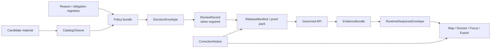

<!-- [KFM_META_BLOCK_V2]
doc_id: kfm://doc/NEEDS_VERIFICATION_UUID
title: Policy
type: standard
version: v1
status: draft
owners: NEEDS VERIFICATION
created: YYYY-MM-DD
updated: YYYY-MM-DD
policy_label: public
related: ["../README.md", "../CONTRIBUTING.md", "../.github/README.md", "../contracts/README.md", "../data/README.md", "../apps/api/README.md"]
tags: [kfm, policy, governance, opa, rego]
notes: ["doc_id, owners, and dates require repo-backed verification before merge", "current-session evidence was source-bounded and did not expose a directly visible repository checkout", "relative links below are intended repo neighbors and must be verified in the real checkout before merge", "exact policy bundle placement and engine choice remain review items until the mounted tree is inspected"]
[/KFM_META_BLOCK_V2] -->

# Policy

_Governed policy surface for KFM publication, runtime access, evidence resolution, redaction/generalization, correction, and fail-closed behavior._

> **Status:** experimental  
> **Owners:** `NEEDS VERIFICATION`  
>       
> **Repo fit:** intended human-facing path `policy/README.md` · upstream: [`../README.md`](../README.md), [`../CONTRIBUTING.md`](../CONTRIBUTING.md), [`../contracts/README.md`](../contracts/README.md), [`../data/README.md`](../data/README.md) · downstream: [`../apps/api/README.md`](../apps/api/README.md), [`../.github/README.md`](../.github/README.md)  
> **Quick jump:** [Scope](#scope) · [Repo fit](#repo-fit) · [Accepted inputs](#accepted-inputs) · [Exclusions](#exclusions) · [Directory tree](#directory-tree) · [Quickstart](#quickstart) · [Usage](#usage) · [Diagram](#diagram) · [Tables](#tables) · [Gates / definition of done](#gates--definition-of-done) · [FAQ](#faq) · [Appendix](#appendix)

> [!IMPORTANT]
> This README is intentionally source-bounded. The current session surfaced doctrine-rich KFM PDFs, but not a directly visible repo checkout, workflow inventory, schema registry, or mounted runtime tree. Treat exact file placement, workflow wiring, and implementation maturity as **reviewable target contract** until the real checkout is inspected.

## Scope

`policy/` is where KFM turns publication law and runtime trust into executable, inspectable behavior.

In KFM, policy is not a detached compliance appendix. It governs what may move across truth-path transitions, what may be published, what runtime surfaces may answer, when geometry or narrative must be generalized or withheld, and how correction remains visible instead of dissolving into silent overwrite.

### Status vocabulary used in this README

| Marker | Meaning here |
|---|---|
| **CONFIRMED** | Directly supported by the March 2026 KFM corpus or by direct current-session inspection |
| **INFERRED** | Strongly implied by multiple current-session sources, but not directly proven as mounted implementation |
| **PROPOSED** | Doctrine-consistent repo realization or file/layout choice that is not yet verified in the mounted tree |
| **UNKNOWN** | Not established strongly enough in the current session to present as settled reality |
| **NEEDS VERIFICATION** | Placeholder or unresolved detail that must be checked in the real checkout before merge |

### Doctrinal baseline used here

| Role | Source used | Why it anchors this README |
|---|---|---|
| Baseline document | `KFM_Master_Design_Manual_2026-03-20.pdf` | Replacement-grade, source-bounded master manual with explicit authority order, policy architecture, contract lattice, testing model, and open-unknown posture |
| Working-manual deepening | `KFM_expanded_replacement_grade_manual.pdf` | Expands policy bundles, registries, route-family consequences, starter fixtures, and verification backlog |
| Cross-corpus synthesis | `KFM_Components_Pass_5_Idea_Index_Category_Atlas_and_Expansion_Dossier.pdf` | Reinforces artifactization and the “inspectable claim” posture |
| Geospatial/runtime corroboration | `kfm_unified_geospatial_architecture_manual_extended.pdf` | Strengthens trust membrane, governed runtime, and authoritative-versus-derived separation |
| UI consequence layer | `KFM_MapLibre_UI_Architecture_and_Governed_Interaction_Design.pdf` | Confirms that trust-visible states, Evidence Drawer, and Focus behavior are downstream consequences of policy, not optional presentation sugar |

### Policy commitments this README treats as load-bearing

| Commitment | Practical consequence |
|---|---|
| Default deny / fail closed | Missing evidence, unresolved rights, incomplete release state, or absent policy infrastructure should end in `deny`, `abstain`, `generalize`, `restrict`, `needs-review`, `hold`, or another governed negative outcome rather than a quiet allow |
| Publication is a governance event | A publishable result should be explainable through `DecisionEnvelope`, `ReviewRecord`, and `ReleaseManifest` rather than “CI passed” alone |
| Reasons and obligations stay named | Policy outcomes should carry stable reason/obligation vocabulary instead of free-text drift |
| Runtime outcomes are finite | Claim-bearing runtime behavior should converge on accountable outcomes such as `ANSWER`, `ABSTAIN`, `DENY`, and `ERROR` |
| Correction stays visible | `superseded`, `withdrawn`, `stale`, and correction-pending states should survive into downstream surfaces |
| Tests must prove honesty | Negative-path fixtures, trust-state UI checks, and correction/rollback drills matter as much as happy-path tests |

> [!NOTE]
> The March 20 manuals treat `OPA/Rego` as a strong policy-bundle fit and show Rego-friendly starter structures, but they do **not** prove mounted adoption. This README therefore treats engine choice as **PROPOSED** until the checkout is inspected.

[Back to top](#policy)

## Repo fit

This README assumes a human-facing `policy/` entry point even if executable policy ownership later resolves to a shared package or service boundary.

| Direction | Intended neighbor | Why it matters |
|---|---|---|
| Upstream | [`../README.md`](../README.md) | Root system identity, invariants, and navigation |
| Upstream | [`../CONTRIBUTING.md`](../CONTRIBUTING.md) | Review discipline for policy-significant changes |
| Lateral | [`../contracts/README.md`](../contracts/README.md) | Contract families that policy evaluates and emits against, but does not silently replace |
| Lateral | [`../data/README.md`](../data/README.md) | Truth-path zones, lifecycle boundaries, and authoritative-versus-derived rules |
| Downstream | [`../apps/api/README.md`](../apps/api/README.md) | Governed API boundary where policy results become enforceable for normal clients |
| Downstream | [`../.github/README.md`](../.github/README.md) | CI, promotion, and drill surfaces where policy fixtures and release gates should run |

> [!WARNING]
> Relative links above are intended repo-native targets, not confirmed mounted files. Verify them in the real checkout before merge.

## Accepted inputs

`policy/` should stay compact, typed, and execution-oriented.

| Input class | What belongs here | Typical examples |
|---|---|---|
| Executable policy bundles or rule modules | Publication, runtime, review-required, generalization, restriction, and correction logic | `publication.rego`, bundle directories, rule packs |
| Decision vocabularies / registries | Stable reason/obligation and rights/sensitivity vocabulary used by policy, runtime, review, and UI trust cues | `reason_codes.*`, `obligation_codes.*`, rights/sensitivity registries |
| Policy fixtures | Positive and negative examples that prove fail-closed behavior | allow / deny / generalize / restrict / needs-review / withdraw / supersede fixtures |
| Minimal policy-facing docs | Short glossaries, notes, or links that keep bundles and outcomes reviewable | bundle README, glossary fragment, review notes |

### What this surface should help coordinate

- Policy-result linkage into `DecisionEnvelope`, `ReviewRecord`, and `ReleaseManifest`
- Runtime trust visibility through `EvidenceBundle` and `RuntimeResponseEnvelope`
- Correction and rollback visibility through `CorrectionNotice`
- Release gates that block optimistic publication when policy bundles, fixtures, or evidence links are missing

## Exclusions

| Does **not** belong in `policy/` | Put it instead | Why |
|---|---|---|
| Canonical JSON Schema / OpenAPI definitions for shared object families | [`../contracts/`](../contracts/) or a shared contracts package | Cross-system schema authority should not be scattered across rule files |
| API handlers, workers, evidence-resolver implementation, or UI shell code | relevant app / package / service path | Enforcement code is adjacent to policy, but not the same artifact |
| RAW / WORK / QUARANTINE / PROCESSED / CATALOG / PUBLISHED data artifacts | [`../data/`](../data/) | Policy governs movement and exposure; it is not the canonical storage tree |
| Secrets, tokens, signing keys, `.env` files | secret manager / host configuration | Sensitive operational material must not live here |
| UI-only conditionals treated as the only policy control surface | nowhere | KFM requires backend/runtime/promotion enforcement, not policy theater in presentation code |
| Full runbooks unless the repo explicitly localizes them here | `../runbooks/` or `../docs/runbooks/` | The corpus repeatedly treats runbooks as first-class review/operations docs |

> [!NOTE]
> In KFM, a single policy concept can touch three different artifacts: a registry or rule in policy, a schema in contracts, and a trust-visible cue in UI/runtime. Keep those roles distinct.

[Back to top](#policy)

## Directory tree

### Current-session evidence

No directly visible mounted `policy/` tree was available in this session.

That means this README must not claim a checked-out inventory, a confirmed rule-engine layout, or already-wired CI entrypoints.

### Source-supported placement variants

#### Variant A — direct `policy/` surface

This is the most explicit **README-facing** variant in the March 20 master design manual.

```text
policy/
├── README.md
├── reason_codes.yaml
├── obligation_codes.yaml
└── publication.rego
```

#### Variant B — package-oriented policy ownership

This is the more package-oriented variant in the expanded working manual.

```text
packages/
└── policy-bundles/

fixtures/
└── policy/

tests/
└── policy/
```

### Review rule

Treat the two trees above as **source-supported alternatives**, not as competing facts. Before merge:

1. inspect the actual checkout,
2. document the chosen placement honestly,
3. update this README in the same change set.

> [!NOTE]
> If the repo uses the package-oriented variant, `policy/README.md` should remain a truthful index and navigation point rather than pretending the executable bundles live locally.

## Quickstart

### 1) Discover the actual policy surface

```bash
find . -maxdepth 4 \
  \( -path './policy' -o -path './packages/policy-bundles' -o -path './fixtures/policy' -o -path './tests/policy' \) \
  -print
```

### 2) Inspect rule, registry, fixture, and doc files

```bash
find policy packages/policy-bundles fixtures/policy tests/policy \
  -maxdepth 4 \
  \( -name '*.rego' -o -name '*.yaml' -o -name '*.yml' -o -name '*.json' -o -name '*.md' \) \
  2>/dev/null | sort
```

### 3) Locate the governance object chain and policy vocabulary

```bash
grep -R -nE \
  'DecisionEnvelope|ReviewRecord|ReleaseManifest|EvidenceBundle|RuntimeResponseEnvelope|CorrectionNotice|reason_codes|obligation_codes|rights_class|sensitivity_class' \
  policy packages/policy-bundles contracts fixtures tests apps 2>/dev/null || true
```

### 4) Inspect workflow wiring

```bash
grep -R -nE 'conftest|opa|rego|policy|decision_envelope|runtime_response_envelope' \
  .github/workflows 2>/dev/null || true
```

### 5) Run local checks if the repo already has the tooling

```bash
if command -v opa >/dev/null 2>&1; then
  opa test policy packages/policy-bundles tests/policy 2>/dev/null || true
fi

if command -v conftest >/dev/null 2>&1; then
  conftest test policy packages/policy-bundles fixtures/policy 2>/dev/null || true
fi
```

> [!NOTE]
> The commands above are intentionally package-aware because the March 20 manuals show more than one plausible placement pattern. Verify the real checkout before simplifying them.

## Usage

### Add or change a policy family

1. Start with the governance question, not the file name.
2. Decide whether the change belongs to admission, rights, sensitivity, promotion, runtime response, correction, or reviewed exception handling.
3. Add or update stable vocabulary before scattering new free-text labels into rules or UI.
4. Add at least one allow-path fixture and one negative-path fixture.
5. Verify the same policy meaning survives into `DecisionEnvelope`, runtime response behavior, and trust-visible surface state.
6. Update this README or adjacent runbooks if the placement contract or review flow changed.

### Keep policy vocabulary stable

- Prefer additive enum growth over silent renaming.
- Treat semantically changing a reason or obligation code as a bundle-version change.
- Do not hide transforms; masking, generalization, withholding, and narrowing should be explicit obligations or receipts.
- Keep policy, contracts, and UI trust cues aligned on the same vocabulary.

### Illustrative starter decision data (**PROPOSED**, doctrine-aligned)

```yaml
input_example:
  actor_role: public
  surface_class: focus
  action: answer
  release_id: rel.2026-03-20.public.v1
  rights_class: open
  sensitivity_class: public

decision_output_example:
  result: allow
  reason_codes:
    - PUBLIC_SAFE
  obligation_codes:
    - REQUIRE_CITATION
    - RECORD_AUDIT
```

Use this as a starter test or bundle-shape example, not as proof that the mounted repo already uses this exact data contract.

## Diagram


```mermaid
flowchart LR
  Candidate[Candidate material] --> Closure[CatalogClosure]
  Registries[Reason / obligation registries] --> Bundle[Policy bundle]
  Closure --> Bundle
  Bundle --> Decision[DecisionEnvelope]
  Decision --> Review[ReviewRecord<br/>when required]
  Review --> Release[ReleaseManifest / proof pack]
  Release --> API[Governed API]
  API --> Evidence[EvidenceBundle]
  Evidence --> Runtime[RuntimeResponseEnvelope]
  Runtime --> Surfaces[Map / Dossier / Focus / Export]
  Correction[CorrectionNotice] --> Release
  Correction --> Surfaces
```

## Tables

### Governance object chain

| Object | Why it exists | Typical seam |
|---|---|---|
| `DecisionEnvelope` | Machine-readable policy result with reasons, obligations, effective window, and audit linkage | catalog / policy / review and runtime mediation |
| `ReviewRecord` | Human approval, denial, escalation, or annotation when policy or significance requires it | review and separation-of-duty seam |
| `ReleaseManifest` / proof pack | Publishable trust unit plus evidence that promotion was governable | promotion / release seam |
| `EvidenceBundle` | Claim-support package that downstream surfaces can inspect | evidence drill-through and runtime support |
| `RuntimeResponseEnvelope` | Finite, accountable runtime outcome contract | governed API / Focus / runtime ask seam |
| `CorrectionNotice` | Visible lineage under rollback, supersession, narrowing, or corrected republication | correction / rollback / supersession seam |

### Visible outcome grammar

| State / outcome | Meaning | Expected surface consequence |
|---|---|---|
| `PROMOTED / PUBLISHED` | Release-backed and available for governed use | normal release + freshness cues |
| `GENERALIZED` | Geometry or narrative has been intentionally narrowed or masked | explicit generalization note or chip |
| `RESTRICTED` | Surface or artifact is only available in a narrower role context | visible role / policy cue |
| `STALE` | Derived or runtime surface is older than the intended freshness basis | visible stale marker, not silent continuation |
| `ABSTAIN` | Support is insufficient, stale, conflicted, or unresolved | explicit abstention with reason |
| `DENY` | Rights, sensitivity, role, or publication state block the request | explicit denial with reason or obligation |
| `ERROR` | Technical failure prevented reliable governed handling | calm failure with audit reference when possible |
| `SUPERSEDED / WITHDRAWN` | A previously outward item has been replaced or removed | visible lineage and correction context |

[Back to top](#policy)

## Gates / definition of done

- [ ] The actual checkout was inspected and the real placement variant was documented.
- [ ] `doc_id`, owners, and dates were replaced with repo-backed values.
- [ ] Registry ownership is clear and stable reason/obligation vocabulary is not duplicated ad hoc.
- [ ] The policy result chain is explicit: `DecisionEnvelope`, `ReviewRecord`, and `ReleaseManifest` are mapped to real emitters or tracked gaps.
- [ ] Fixtures cover at least `allow`, `deny`, `generalize`, `restrict`, `needs-review`, `withdraw`, and `supersede` behavior where applicable.
- [ ] Runtime and UI trust cues align with the same visible outcome grammar.
- [ ] Correction and rollback stay explicit; no silent overwrite or hidden narrowing path remains.
- [ ] Workflow or local harness checks exist for policy fixtures, or the missing checks are explicitly tracked.
- [ ] Any mention of `OPA/Rego` remains tagged as a fit / starter choice unless the mounted repo proves actual adoption.
- [ ] No statement in this README implies mounted routes, schemas, workflows, or repo structure that the checkout does not prove.

[Back to top](#policy)

## FAQ

### Does this README prove that a mounted `policy/` tree already exists?

No. It documents a **source-grounded target contract** and keeps the mounted tree **NEEDS VERIFICATION** until the real checkout is inspected.

### Is `OPA/Rego` confirmed?

Not as a mounted implementation fact. The March 20 manuals treat it as a strong profile fit and a practical starter direction for policy bundles, but exact adoption remains **UNKNOWN** until the repo proves it.

### Why keep policy separate from `contracts/`?

Because schemas define shared object shape, while policy decides what may happen with those objects under rights, sensitivity, release, runtime, and correction rules.

### Where should reviewed exceptions and corrections live?

In explicit review/correction artifacts with stable refs and visible lineage — not in comments, one-off UI toggles, or operator memory.

## Appendix

<details>
<summary><strong>Verification backlog and first-wave artifacts</strong></summary>

### Highest-priority verification checks

1. Verify the real checkout and settle whether the repo uses the direct `policy/` surface, the package-oriented `packages/policy-bundles/` shape, or another documented local convention.
2. Confirm whether policy vocabularies are YAML, JSON, or another machine-readable form in the mounted repo.
3. Surface the real policy rule entrypoints, fixture inventory, and local/CI harness commands.
4. Confirm how `DecisionEnvelope`, `ReviewRecord`, `ReleaseManifest`, `EvidenceBundle`, `RuntimeResponseEnvelope`, and `CorrectionNotice` are actually emitted or referenced.
5. Replace meta-block placeholders with repo-backed values before merge.

### First-wave artifact order (**PROPOSED**)

| Priority | Artifact | Why it comes first |
|---|---|---|
| 1 | Reason / obligation registries + policy bundle entrypoint | Makes policy machine-readable and explainable |
| 1 | Policy fixtures for allow and negative outcomes | Proves fail-closed behavior instead of merely describing it |
| 1 | `DecisionEnvelope` + `ReviewRecord` + `ReleaseManifest` linkage | Makes publication traceable as a governance event |
| 2 | `EvidenceBundle` + `RuntimeResponseEnvelope` negative-path tests | Proves cite-or-abstain and finite runtime outcomes |
| 2 | `CorrectionNotice` + rollback/correction drill | Keeps lineage visible when something changes |
| 3 | Steward queue / reviewed-exception evidence | Makes override paths auditable instead of implicit |

### Placement ambiguity to settle before merge

The March 20 source set is deliberately honest about implementation unknowns, and it also shows more than one plausible policy placement:

- the master design manual names a direct `policy/` surface with files such as `policy/reason_codes.yaml`, `policy/obligation_codes.yaml`, and `policy/publication.rego`;
- the expanded working manual also shows a package-oriented layout with `packages/policy-bundles/` plus repo-level `fixtures/policy/` and `tests/policy/`.

This README keeps both visible on purpose. Pick the mounted reality, update the tree and commands accordingly, and keep the doc truthful.

</details>

[Back to top](#policy)
