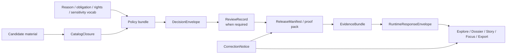

<!-- [KFM_META_BLOCK_V2]
doc_id: kfm://doc/NEEDS_VERIFICATION_UUID
title: Policy
type: standard
version: v1
status: draft
owners: NEEDS VERIFICATION
created: YYYY-MM-DD
updated: YYYY-MM-DD
policy_label: public
related: ["../README.md", "../CONTRIBUTING.md", "../.github/README.md", "../contracts/README.md", "../data/README.md", "../apps/api/README.md"]
tags: [kfm, policy, governance, opa, rego]
notes: ["doc_id, owners, and dates require repo-backed verification before merge", "current-session evidence was source-bounded and did not expose a directly visible repository checkout", "task-supplied relative links below must be reconciled with the real checkout before merge", "March 20 doctrine shows a top-level policy/ surface with bundles, fixtures, and tests, plus a separate packages/policy-runtime seam", "OPA/Rego is treated here as the strongest documented starter pattern, not as confirmed mounted adoption"]
[/KFM_META_BLOCK_V2] -->

# Policy

_Governed, executable policy surface for KFM publication, runtime trust, rights/sensitivity handling, and visible correction._

> **Status:** `experimental`  
> **Owners:** `NEEDS VERIFICATION`  
>        
> **Repo fit:** intended human-facing entry `policy/README.md` · current best-fit doctrinal skeleton places shared policy assets under `policy/bundles/`, `policy/fixtures/`, and `policy/tests/` (**PROPOSED until checkout inspection**) · upstream: [`../README.md`](../README.md), [`../CONTRIBUTING.md`](../CONTRIBUTING.md), [`../contracts/README.md`](../contracts/README.md), [`../data/README.md`](../data/README.md) · downstream: [`../apps/api/README.md`](../apps/api/README.md), [`../.github/README.md`](../.github/README.md)  
> **Quick jump:** [Scope](#scope) · [Repo fit](#repo-fit) · [Accepted inputs](#accepted-inputs) · [Exclusions](#exclusions) · [Directory tree](#directory-tree) · [Quickstart](#quickstart) · [Usage](#usage) · [Diagram](#diagram) · [Tables](#tables) · [Gates / definition of done](#gates--definition-of-done) · [FAQ](#faq) · [Appendix](#appendix)

> [!IMPORTANT]
> This README is intentionally source-bounded. The current session exposed doctrine-rich KFM manuals, but not a mounted repository checkout, workflow inventory, schema tree, or runtime manifests. Treat exact file placement, engine adoption, harness wiring, and ownership values as **NEEDS VERIFICATION** until the real checkout is inspected.

## Scope

`policy/` is where KFM turns governance from prose into executable, reviewable behavior.

In KFM, policy is not a detached compliance appendix. It is the gate layer that shapes admission, rights handling, sensitivity and redaction, review and release, runtime responses, correction and withdrawal, and the trust cues users see in the shell.

### Evidence labels used in this README

| Label | Meaning here |
|---|---|
| **CONFIRMED** | Directly supported by the current-session KFM corpus |
| **INFERRED** | Strongly implied by multiple current-session sources, but not directly proven as mounted implementation |
| **PROPOSED** | A doctrine-consistent realization pattern, contract shape, or layout choice not yet verified in the checkout |
| **UNKNOWN** | Not supported strongly enough in the current session to present as settled reality |
| **NEEDS VERIFICATION** | Placeholder or unresolved detail that must be checked in the real repo before merge |

### Doctrinal baseline

| Role | Source used | Why it anchors this README |
|---|---|---|
| Baseline manual | `KFM_Master_Design_Manual_2026-03-20.pdf` | Replacement-grade March 20 master manual with explicit source-bounded posture, proposed repo skeleton, route-family consequences, policy/testing model, and open-unknown discipline |
| Operational deepening | `KFM_expanded_replacement_grade_manual.pdf` | Turns doctrine into bundles, registries, fixture expectations, decision/review artifacts, and explicit fail-closed mechanics |
| Cross-corpus reinforcement | `KFM_Components_Pass_5_Idea_Index_Category_Atlas_and_Expansion_Dossier.pdf` | Re-centers KFM on inspectable claims and artifactization rather than stack rhetoric |
| Surface consequence layer | `KFM_MapLibre_UI_Architecture_and_Governed_Interaction_Design.pdf` | Confirms trust-visible shell behavior, Evidence Drawer consequences, and route-family visibility at the point of use |

### Policy commitments treated as load-bearing

| Commitment | Practical consequence |
|---|---|
| Default deny / fail closed | Missing rights, missing evidence linkage, unresolved sensitivity, or absent policy infrastructure should end in a governed negative outcome rather than a quiet allow |
| Reasons and obligations stay explicit | Policy should emit stable reason and obligation vocabularies instead of prose drift |
| Publication is a governance event | Publishable output should be explainable through decision, review, and release artifacts |
| Runtime is finite and accountable | Claim-bearing runtime behavior should converge on explicit outcomes rather than vague fallback behavior |
| Correction remains visible | `withdrawn`, `superseded`, `stale`, and correction-pending states should survive into downstream surfaces |
| UI reflects, but does not replace, enforcement | Trust-visible cues belong in the shell, but backend/runtime gates remain the primary enforcement surface |

[Back to top](#policy)

## Repo fit

The March 20 design corpus currently points to two related seams:

1. a shared, top-level `policy/` surface for bundles, fixtures, and tests, and
2. a separate `packages/policy-runtime/` seam for runtime loading, evaluation, and mediation.

That split is helpful. It keeps policy assets diffable and reviewable without pretending that bundle execution, API enforcement, and shell behavior all live in one folder.

| Direction | Intended neighbor | Why it matters |
|---|---|---|
| Upstream | [`../README.md`](../README.md) | Root system identity, invariants, and navigation |
| Upstream | [`../CONTRIBUTING.md`](../CONTRIBUTING.md) | Review discipline for policy-significant changes |
| Lateral | [`../contracts/README.md`](../contracts/README.md) | Shared schemas, vocabularies, and contract families that policy evaluates against |
| Lateral | [`../data/README.md`](../data/README.md) | Truth-path zones and authoritative-versus-derived boundaries that policy governs |
| Downstream | [`../apps/api/README.md`](../apps/api/README.md) | Task-supplied neighbor for governed API docs; verify against the mounted tree because March 20 doctrine also sketches `apps/governed-api/` |
| Downstream | [`../.github/README.md`](../.github/README.md) | CI, promotion, and drill surfaces where policy fixtures and merge-blocking gates should run |

> [!WARNING]
> The relative links above are kept because the task supplies them, not because the mounted checkout proved them. Verify them before merge, especially where March 20 doctrine proposes more specific names such as `apps/governed-api/`.

## Accepted inputs

`policy/` should stay compact, typed, and execution-oriented.

| Input class | What belongs here | Typical examples |
|---|---|---|
| Executable policy bundles | Shared rules for admission, rights, sensitivity, review, release, runtime, correction, and other trust-bearing decisions | bundle directories, `*.rego`, bundle manifests, machine-readable rule packs |
| Policy fixtures | Positive and negative examples that prove fail-closed behavior | allow / deny / generalize / restrict / needs-review / withdraw / supersede fixtures |
| Policy tests | Assertions specific to policy behavior | bundle unit tests, Conftest-style checks, outcome regression packs |
| Policy-local vocab or import stubs | Stable reason/obligation or rights/sensitivity references when the repo keeps them with the bundle | `reason_codes.*`, `obligation_codes.*`, bundle-scoped vocab imports |
| Human-readable bundle notes | Minimal docs that keep machine rules reviewable | glossary fragments, steward notes, bundle README files |

## Exclusions

| Does **not** belong in `policy/` | Put it instead | Why |
|---|---|---|
| Canonical JSON Schema / OpenAPI definitions | [`../contracts/`](../contracts/) | Shared object shape should not be duplicated across rule bundles |
| Shared vocabulary registries when the repo centralizes them | [`../contracts/`](../contracts/) or another verified shared surface | `policy/` should reference the shared authority, not fork it |
| Runtime policy loaders, evaluation adapters, or request mediators | `packages/policy-runtime/` or the verified runtime package | Execution glue is adjacent to policy, but it is not the bundle itself |
| API handlers, workers, or resolver implementations | app / package / service path | Enforcement code is adjacent to policy, but it is not the same artifact |
| RAW / WORK / QUARANTINE / PROCESSED / CATALOG / PUBLISHED data | [`../data/`](../data/) | Policy governs movement and exposure; it is not the canonical storage layer |
| Secrets, signing keys, `.env` files, or live credentials | secret manager / host configuration | Sensitive operational material must not live in the policy tree |
| UI-only conditionals treated as the only policy surface | nowhere | KFM requires backend, review, release, and runtime enforcement—not policy theater in presentation code |
| Exhaustive ops runbooks unrelated to policy behavior | `../docs/runbooks/` or repo-local runbook path | Keep this directory focused on policy execution and evidence |

[Back to top](#policy)

## Directory tree

### Current-session evidence

No directly visible mounted repo tree was available in this session.

That means this README must not claim a checked-out inventory, confirmed rule-engine adoption, or already-wired CI entrypoints.

### Current best-fit doctrinal skeleton (**PROPOSED**)

```text
policy/
├── README.md
├── bundles/
├── fixtures/
└── tests/
```

> [!NOTE]
> The same March 20 doctrine also names `packages/policy-runtime/` as a separate seam. Keep shared rule assets and their fixtures here; keep invocation, decision assembly, and adapter glue in the runtime package if the mounted repo follows that split.

### Starter bundle families (**PROPOSED**)

The manuals name the concerns below, but do **not** prove a mounted subdirectory layout for them yet.

| Family | What it covers |
|---|---|
| Admission | Source-admission and intake-side policy checks |
| Rights | License, access posture, and release-eligibility handling |
| Sensitivity | Redaction, masking, exact-location restrictions, and public-safe generalization |
| Review / release | Review-required mappings, promotion gates, and steward-only decisions |
| Runtime | Response shaping for claim-bearing routes, including bounded synthesis and citation-negative behavior |
| Correction | Withdrawal, supersession, stale-visible handling, and correction propagation |

## Quickstart

### 1) Discover the actual policy surface

```bash
find . -maxdepth 4 -type d \
  \( -path './policy' -o -path './packages/policy-runtime' -o -path './tests/policy' -o -path './contracts/vocab' \) \
  -print 2>/dev/null
```

### 2) Inspect policy-bearing files

```bash
for d in policy packages/policy-runtime contracts tests fixtures; do
  [ -e "$d" ] || continue
  find "$d" -maxdepth 4 \
    \( -name '*.rego' -o -name '*.json' -o -name '*.yaml' -o -name '*.yml' -o -name '*.md' \)
done | sort
```

### 3) Trace policy vocabulary and trust-bearing contract joins

```bash
grep -R -nE \
  'DecisionEnvelope|ReviewRecord|ReleaseManifest|ReleaseProofPack|EvidenceBundle|RuntimeResponseEnvelope|CorrectionNotice|reason_codes|obligation_codes|rights_class|sensitivity_class|policy_bundle_version' \
  policy packages contracts tests fixtures docs apps 2>/dev/null || true
```

### 4) Inspect CI and promotion wiring

```bash
grep -R -nE 'conftest|opa|rego|policy|proof-pack|RuntimeResponseEnvelope|DecisionEnvelope' \
  .github/workflows docs runbooks 2>/dev/null || true
```

### 5) Sanity-check route-family and runtime-outcome vocabulary

```bash
grep -R -nE \
  'public-read|steward-read|review-action|release-action|export|bounded-synthesis|ANSWER|ABSTAIN|DENY|ERROR' \
  docs policy packages apps tests 2>/dev/null || true
```

> [!NOTE]
> These are discovery commands, not proof of adoption. Keep the README aligned to what the mounted tree actually contains after you run them.

[Back to top](#policy)

## Usage

### Add or change a policy family

1. Start with the trust seam, not the filename: admission, rights, sensitivity, review, release, runtime, or correction.
2. If the change affects visible semantics, update stable reason/obligation or rights/sensitivity vocabulary first—or point to the shared contract vocab that already owns it.
3. Add paired fixtures: at least one happy path and one negative path. Use transform, restrict, or review-required cases when the seam calls for them.
4. Verify the same policy meaning survives into `DecisionEnvelope`, `ReviewRecord`, `ReleaseManifest`, `EvidenceBundle`, or `RuntimeResponseEnvelope` as applicable.
5. Update trust-visible surfaces so generalization, restriction, staleness, and correction remain inspectable.
6. Document whether the result is **CONFIRMED**, **PROPOSED**, or still **NEEDS VERIFICATION**.

### Keep reasons and obligations stable

- Reasons explain **why** a result occurred.
- Obligations explain **what must happen next**.
- Semantically changing a reason or obligation code should version the policy bundle.
- Transform obligations should create explicit receipts or visible consequences, not invisible UI behavior.
- Exception handling must stay review-bearing; no silent override path belongs in normal flow.

### Illustrative starter decision (**PROPOSED**)

```yaml
input:
  actor_role: public
  surface_class: focus
  action: answer
  release_id: rel.2026-03-20.public.v1
  rights_class: open
  sensitivity_class: public

decision:
  result: allow
  reason_codes:
    - PUBLIC_SAFE
  obligation_codes:
    - REQUIRE_CITATION
    - RECORD_AUDIT
```

Use this as a starter fixture or bundle-shape example, not as proof that the mounted repo already uses this exact contract.

## Diagram


```mermaid
flowchart LR
  Candidate[Candidate material] --> Closure[CatalogClosure]
  Vocab[Reason / obligation / rights / sensitivity vocab] --> Bundle[Policy bundle]
  Closure --> Bundle
  Bundle --> Decision[DecisionEnvelope]
  Decision --> Review[ReviewRecord<br/>when required]
  Review --> Release[ReleaseManifest / proof pack]
  Release --> Evidence[EvidenceBundle]
  Evidence --> Runtime[RuntimeResponseEnvelope]
  Runtime --> Surfaces[Explore / Dossier / Story / Focus / Export]
  Correction[CorrectionNotice] --> Release
  Correction --> Surfaces
```

Above: shared policy assets feed the decision, review, release, evidence, runtime, and correction chain rather than living as disconnected compliance text.

## Tables

### Where policy meaning lives

| Surface | Responsibility | Not the place for |
|---|---|---|
| `policy/bundles/` | Shared executable rules, bundle versions, controlled policy logic | HTTP handlers or UI conditionals |
| `policy/fixtures/` | Allow/deny/generalize/review regression inputs and expected outcomes | Long-lived runtime code |
| `policy/tests/` | Bundle-specific assertions and fail-closed checks | Visual/UI-only regression suites |
| `packages/policy-runtime/` | Bundle loading, evaluation, decision assembly, adapter glue | Duplicating canonical vocab or shadow rules |
| `contracts/vocab/` | Shared enums/codes when centralized across contracts and surfaces | Executable bundle logic |
| Governed API surface | Client-facing enforcement point and outward error/deny behavior | Hidden policy forks that drift from shared bundles |

### Route families by trust obligation

| Route family | Typical burden | Why the split matters |
|---|---|---|
| `public-read` | public-safe releases, visible trust cues, no restricted leakage | Highest exposure, strongest default-deny need |
| `steward-read` | authenticated access, richer evidence and review context | Wider inspection surface without becoming public |
| `review-action` | queue movement, approvals, denials, annotations | Human governance path must stay explicit |
| `release-action` | promotion, proof-pack checks, correction hooks | Publication law is stronger than “deploy worked” |
| `export` | preview of what leaves the system, obligation carry-through | Prevents trust cues from disappearing at export time |
| `bounded-synthesis` | policy precheck, evidence resolution, citation validation, finite outcomes | Keeps Focus-style answers subordinate to evidence and policy |

### Policy result grammar

| Result / state | Meaning | Expected consequence |
|---|---|---|
| `allow` | Request or release is policy-safe as scoped | Continue with named obligations |
| `deny` | Rights, sensitivity, actor, or publication posture blocks the action | Explicit denial with stable reason |
| `generalize` | Exposure is allowed only after masking, aggregation, or geometry reduction | Visible generalization state and transform receipt |
| `restrict` | Surface is limited to a narrower actor or mode | Role-aware exposure, no quiet fallback to public |
| `needs-review` / `STEWARD_REVIEW` | Machine gate cannot safely resolve the case alone | Route to steward queue with reason and audit refs |
| `withdrawn` / `superseded` | Outward trust state changed after release | Preserve lineage and correction visibility |

### Runtime envelope outcomes

| Outcome | Meaning | Surface behavior |
|---|---|---|
| `ANSWER` | Support is sufficient and policy-safe | Return response with evidence and trust cues |
| `ABSTAIN` | Evidence is weak, stale, partial, conflicted, or unresolved | Narrow scope or decline with inspectable reason |
| `DENY` | Policy blocks the request | Calm refusal with accountable reason |
| `ERROR` | Technical failure prevented reliable governed handling | Explicit failure without pretending policy or evidence passed |

[Back to top](#policy)

## Gates / definition of done

- [ ] The actual checkout was inspected and the real policy surface was documented.
- [ ] `doc_id`, owners, and dates were replaced with repo-backed values.
- [ ] The relationship between `policy/` and `packages/policy-runtime/` was verified in the mounted tree.
- [ ] Registry ownership is clear: no duplicate reason/obligation or rights/sensitivity vocab drifts between `policy/` and `contracts/`.
- [ ] Fixtures cover at least `allow`, `deny`, `generalize`, `restrict`, `needs-review`, `withdraw`, and `supersede` behavior where applicable.
- [ ] Route families and runtime outcomes align with the same visible trust grammar.
- [ ] Decision, review, release, evidence, and runtime artifacts are either emitted or explicitly tracked as gaps.
- [ ] No silent override path exists; exceptions remain review-bearing and auditable.
- [ ] CI or local harness checks exist for policy bundles and fixtures, or the missing checks are explicitly tracked.
- [ ] Any mention of `OPA/Rego` remains tagged as a documented starter direction unless the mounted repo proves actual adoption.
- [ ] This README does not imply mounted routes, schemas, workflows, or package names that the checkout does not prove.

[Back to top](#policy)

## FAQ

### Does this README prove that a mounted `policy/` tree already exists?

No. It documents the best current doctrinal fit and keeps mounted reality **NEEDS VERIFICATION** until the actual checkout is inspected.

### Is `OPA/Rego` confirmed?

As doctrine and work-package direction, it is strongly supported. As a mounted implementation fact, it remains **NEEDS VERIFICATION** until the repo proves actual adoption.

### Where should reason and obligation vocab live?

Where the mounted repo says they live. The corpus supports two honest patterns: policy-local registries beside the bundle, or shared vocab under `contracts/`. What should not happen is silent duplication.

### Does UI enforce policy?

No. The shell must make trust visible, but backend/runtime/release enforcement remains primary.

### What should block publication?

Missing rights or sensitivity handling, unresolved evidence, missing review or release objects, failed policy fixtures, absent correction lineage, and any bounded-synthesis path that cannot answer with valid evidence or abstain honestly.

## Appendix

<details>
<summary><strong>Verification backlog and first-wave artifacts</strong></summary>

### Highest-priority verification checks

1. Inspect the mounted repo and confirm whether the policy surface actually follows the March 20 top-level skeleton.
2. Verify whether runtime loading lives in `packages/policy-runtime/`, another package, or an app-local seam.
3. Confirm where shared vocab really lives: `policy/`, `contracts/vocab/`, or another documented location.
4. Surface the real policy entrypoints, fixture inventory, local commands, and CI jobs.
5. Replace task placeholders in the meta block before merge.

### First-wave artifact order (**PROPOSED**)

| Priority | Artifact | Why it comes first |
|---|---|---|
| 1 | Bundle entrypoint + stable reason/obligation vocabulary or shared-vocab link | Makes policy machine-readable and explainable |
| 1 | Allow / deny / generalize / review fixtures | Proves fail-closed behavior instead of merely describing it |
| 1 | `DecisionEnvelope` + `ReviewRecord` + `ReleaseManifest` linkage | Makes publication traceable as a governance event |
| 2 | `EvidenceBundle` + `RuntimeResponseEnvelope` negative-path tests | Proves cite-or-abstain and finite runtime outcomes |
| 2 | Correction / withdrawal / supersession path | Keeps lineage visible when outward truth changes |
| 3 | Review queue and approved-exception artifacts | Makes override paths auditable instead of implicit |

### Why `OPA/Rego` stays marked as starter direction

The corpus repeatedly treats policy packs, fixture tests, and Conftest/OPA-style gates as the most concrete starter path. That is strong enough to shape this README. It is not strong enough to pretend the mounted repo already adopted that exact engine without inspection.

</details>

[Back to top](#policy)
