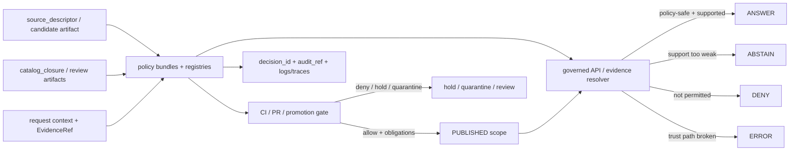

<!-- [KFM_META_BLOCK_V2]
doc_id: kfm://doc/NEEDS_VERIFICATION_UUID
title: Policy
type: standard
version: v1
status: draft
owners: NEEDS VERIFICATION
created: YYYY-MM-DD
updated: YYYY-MM-DD
policy_label: public
related: ["../README.md", "../CONTRIBUTING.md", "../.github/README.md", "../contracts/README.md", "../data/README.md", "../apps/api/README.md"]
tags: [kfm, policy, governance, opa, rego]
notes: ["doc_id, owners, and dates require repo-backed verification before merge", "task target is policy/README.md, but the current-session repo tree was not directly mounted for verification", "relative links below are intended repo neighbors and must be checked against the real checkout before merge"]
[/KFM_META_BLOCK_V2] -->

# Policy

Governed policy-as-code surface for KFM publication, runtime access, evidence resolution, redaction/generalization, and fail-closed behavior.

> **Status:** experimental  
> **Owners:** `NEEDS VERIFICATION`  
>       
> **Repo fit:** target path `policy/README.md` *(task target; mounted repo tree not directly verified in the current session)*  
> **Quick jump:** [Scope](#scope) · [Repo fit](#repo-fit) · [Accepted inputs](#accepted-inputs) · [Exclusions](#exclusions) · [Directory tree](#directory-tree) · [Quickstart](#quickstart) · [Usage](#usage) · [Diagram](#diagram) · [Policy surface matrix](#policy-surface-matrix) · [Gates / Definition of done](#gates--definition-of-done) · [FAQ](#faq) · [Appendix](#appendix)

> [!IMPORTANT]
> This README deliberately separates **CONFIRMED doctrine** from **PROPOSED repo realization**.  
> The current-session evidence available for this task was documentation-heavy and repo-light, so file trees, workflow names, and mounted rule coverage are treated as unverified until checked in the real repository.

## Scope

`policy/` is where KFM turns doctrine into executable decisions.

This directory is the versioned home for deny-by-default rules, controlled decision vocabularies, fixtures, reviewable exceptions, and policy runbooks that keep KFM’s trust membrane real across CI, promotion, publication, evidence resolution, runtime answer shaping, redaction/generalization, and correction.

KFM policy is not decorative copy. It is part of the system’s operating law.

### Truth posture used in this README

| Marker | Meaning here |
|---|---|
| **CONFIRMED** | Directly supported by the mounted KFM documentation corpus or by current-session workspace observation |
| **PROPOSED** | Repo-ready target shape or implementation direction that fits KFM doctrine but is not verified as mounted repo fact |
| **UNKNOWN** | Not verified strongly enough in the current session |
| **NEEDS VERIFICATION** | Placeholder value or repo-specific detail that must be checked before merge |

### What this directory is for

- versioned policy bundles for publication and runtime decisions
- canonical reason and obligation registries
- reviewer-role mapping and separation-of-duty support
- fail-closed fixtures and regression tests
- exception records that are explicit, bounded, and auditable
- local policy runbooks that keep CI, review, and runtime behavior aligned

### What this directory is not for

- the authoritative copy of contracts or schemas
- service handler code or UI logic
- raw or published data artifacts
- undocumented escape hatches
- prose-only policy that never reaches CI, release, or runtime

## Repo fit

The task target is `policy/README.md`.

Because the real repo tree was not directly mounted in this session, the neighbor links below should be treated as **intended repo relationships** and verified before merge.

| Direction | Intended neighbor | Role |
|---|---|---|
| Upstream | [`../README.md`](../README.md) | Root system posture, source of repo-wide orientation |
| Upstream | [`../CONTRIBUTING.md`](../CONTRIBUTING.md) | Contribution and review expectations for policy-significant change |
| Upstream | [`../contracts/README.md`](../contracts/README.md) | Contract and schema truth that policy evaluates but does not replace |
| Upstream | [`../data/README.md`](../data/README.md) | Lifecycle zones and governed artifact movement |
| Downstream | [`../apps/api/README.md`](../apps/api/README.md) | Governed API boundary and runtime policy consumers |
| Downstream | [`../.github/README.md`](../.github/README.md) | CI / PR / promotion surfaces where policy must execute |

### Downstream enforcement expectations

Policy should be executable at the points where trust can silently erode:

- PR and CI gates
- promotion and release decisions
- API authorization and response shaping
- evidence resolution
- redaction/generalization transforms
- runtime citation checks
- correction and supersession flows

[Back to top](#policy)

## Accepted inputs

| Input class | What belongs here | Typical examples |
|---|---|---|
| Bundle source | Executable policy rules grouped by concern or decision surface | `bundles/runtime/*.rego`, `bundles/publication/*.rego`, `bundles/sensitivity/*.rego` |
| Canonical registries | Stable machine-readable vocabularies shared across bundles and services | `reason_codes.json`, `obligation_codes.json`, `reviewer_roles.json` |
| Fixtures | Valid and invalid cases that prove fail-closed behavior | `fixtures/valid/*.json`, `fixtures/invalid/*.json` |
| Exception records | Explicit, auditable deviations with approver, reason, and effectivity | `exceptions/*.json` or equivalent signed artifacts |
| Policy runbooks | Human-readable instructions for local checks, review, and incident-safe use | `runbooks/local-check.md`, `runbooks/review-checklist.md` |
| Starter decision examples | Example decision inputs/outputs used by docs and tests | `examples/policy_decision_record/*.json` |

### Minimum expectations for additions here

1. Default deny stays the posture unless a narrower allow path is explicit.
2. New policy slices ship with both passing and failing fixtures.
3. Shared strings live in registries, not copied across many rule files.
4. CI and runtime semantics stay aligned.
5. Exceptions are bounded, reviewable, and visible in audit context.

## Exclusions

| Does **not** belong in `policy/` | Put it instead | Why |
|---|---|---|
| Canonical object schemas and contract truth | [`../contracts/`](../contracts/) | Policy evaluates object state; it does not replace contract ownership |
| API handlers, evidence resolver code, adapter code, UI logic | [`../apps/api/`](../apps/api/) or the relevant app/package path | Enforcement and implementation are related, but not the same artifact |
| RAW / WORK / PROCESSED / CATALOG / PUBLISHED artifacts | [`../data/`](../data/) | Policy acts on lifecycle movement; it is not the artifact store |
| Secrets, tokens, private signing material, `.env` files | runtime secret manager / host config | Sensitive operational material must not live here |
| Exhaustive copied rule bodies in documentation | actual rule files | This README explains the surface; it should not become the source of truth |
| UI-only conditionals as the only enforcement | nowhere | KFM policy must remain executable, versioned, and auditable outside the interface |

> [!WARNING]
> The UI may reveal trust state, but it is not the primary enforcement boundary.  
> KFM policy must execute in CI, promotion, API/runtime handling, evidence resolution, and correction flows.

## Directory tree

### Current-session evidence (**CONFIRMED**)

No mounted repo tree or live `policy/` directory was directly inspectable in this session.

That means this README must **not** claim a currently checked-out policy layout, installed bundle set, or existing fixture inventory.

### Proposed target shape (**PROPOSED**)

```text
policy/
├── README.md
├── bundles/
│   ├── pack.rego
│   ├── publication/
│   │   ├── release.rego
│   │   └── review.rego
│   ├── runtime/
│   │   ├── access.rego
│   │   ├── evidence.rego
│   │   └── citations.rego
│   ├── sensitivity/
│   │   ├── generalization.rego
│   │   └── withholding.rego
│   └── provenance/
│       └── completeness.rego
├── reason_codes.json
├── obligation_codes.json
├── reviewer_roles.json
├── fixtures/
│   ├── valid/
│   └── invalid/
├── exceptions/
│   └── README.md
└── runbooks/
    ├── local-check.md
    └── review-checklist.md
```

### Naming guidance

- Organize by **decision surface** or **policy concern**, not by team.
- Keep canonical reason and obligation strings in registries, not scattered as free text.
- Name fixtures by scenario and expected outcome.

Examples:

- `citation_missing__deny.json`
- `restricted_location__generalize.json`
- `release_without_review__hold.json`
- `policy_service_unavailable__error.json`

[Back to top](#policy)

## Quickstart

### 1) Verify the real repo state first

```bash
pwd
test -d policy && find policy -maxdepth 3 -type f | sort
```

### 2) Run local policy checks when policy files are present

```bash
# Verify actual paths before relying on these commands.
conftest test run_receipt/receipt.json --policy policy/bundles --fail-on-warn
opa test policy/bundles -v
```

### 3) Confirm fail-closed behavior with fixtures

```bash
# Example pattern only — adapt to the repo's real fixture paths.
conftest test policy/fixtures/valid   --policy policy/bundles
conftest test policy/fixtures/invalid --policy policy/bundles
```

> [!NOTE]
> The commands above are intentionally small and reviewable.  
> If the real repo uses `policies/` instead of `policy/`, or stores raw modules outside `bundles/`, update this README in the same change set that verifies the tree.

## Usage

### Add a new policy slice

1. Choose the decision surface first: publication, runtime, sensitivity, provenance, or review.
2. Add or extend the bundle under `policy/bundles/`.
3. Update canonical registries if the slice introduces a new reason or obligation.
4. Add at least one valid and one invalid fixture.
5. Wire the same logic into CI and runtime consumers.
6. Update this README or the relevant runbook if the directory contract changed.

### Add or change a registry

Use registries for values that must stay stable across bundles, routes, tests, logs, and docs:

- reason codes
- obligation codes
- reviewer roles
- review-required mappings
- emergency deny or service-unavailable mappings

Do **not** let these drift into copied strings across many `.rego` files.

### Record an exception

An exception should answer all of the following:

- what rule or subject is being narrowed
- who approved it
- why it exists
- when it starts and ends
- which evidence or signed record supports it
- what audit or review artifact links to it

> [!CAUTION]
> An exception is not a quiet bypass.  
> It is a governed deviation that must remain explicit in review, provenance, and runtime/audit context.

### Illustrative starter rule

The corpus repeatedly favors small, composable policy slices. A minimal manifest check can stay readable:

```rego
package kfm.policy.manifest

deny[msg] {
  input.spec_hash == ""
  msg := "spec_hash required"
}

deny[msg] {
  not input.tool_versions.py
  msg := "tool_versions.py missing"
}

deny[msg] {
  not input.time_range.start
  msg := "time_range.start missing"
}
```

*Illustrative starter only — verify the package name, input shape, and bundle path against the real repo before adoption.*

## Diagram


```mermaid
flowchart LR
  A[source_descriptor / candidate artifact] --> P[policy bundles + registries]
  B[catalog_closure / review artifacts] --> P
  C[request context + EvidenceRef] --> P

  P --> CI[CI / PR / promotion gate]
  P --> RT[governed API / evidence resolver]

  CI -->|allow + obligations| PUB[PUBLISHED scope]
  CI -->|deny / hold / quarantine| HOLD[hold / quarantine / review]

  RT -->|policy-safe + supported| ANSWER[ANSWER]
  RT -->|support too weak| ABSTAIN[ABSTAIN]
  RT -->|not permitted| DENY[DENY]
  RT -->|trust path broken| ERROR[ERROR]

  P --> AUDIT[decision_id + audit_ref + logs/traces]
  PUB --> RT
```

## Policy surface matrix

| Decision surface | Typical subject | Expected outcomes | Must stay explicit |
|---|---|---|---|
| Source admission | `source_descriptor`, ingest candidate | allow / reject / register-only | rights posture, owner, acquisition method, validation burden |
| Publication and review | `dataset_version`, `catalog_closure`, release candidate | allow / hold / deny + obligations | decision envelope, review record, separation of duty |
| Evidence resolution | `EvidenceRef`, release scope, rights state | bundle / deny / role-limit | `bundle_id`, published scope, preview rules |
| Runtime answer shaping | Focus answer, Story publish, map/detail read | ANSWER / ABSTAIN / DENY / ERROR | citations, surface state, `audit_ref`, policy outcome |
| Sensitivity and geometry handling | exact location, restricted narrative, withdrawn material | generalize / hide / narrow / role-limit | reason codes, obligation codes, transform or review linkage |
| Correction and supersession | published release, projection, stale surface | supersede / withdraw / stale-visible | `correction_notice`, affected release, propagation notes |

## Starter artifact matrix

| Artifact | Why it belongs here | Minimum expectation |
|---|---|---|
| `bundles/` | Holds executable policy grouped by concern | versioned, testable, readable modules |
| `reason_codes.json` | Keeps deny/hold/abstain language stable | no free-text drift |
| `obligation_codes.json` | Reuses conditional-allow behavior across surfaces | narrow, actionable obligations |
| `reviewer_roles.json` | Makes review and separation of duty auditable | stable role mapping |
| `fixtures/valid/` | Proves happy-path semantics | at least one valid case per major slice |
| `fixtures/invalid/` | Proves fail-closed semantics | at least one denying case per major slice |
| `exceptions/` | Makes deviations visible and reviewable | approver, reason, effectivity, linkage |
| `runbooks/` | Keeps humans aligned with bundle behavior | local checks, review procedure, incident-safe notes |

## Gates / Definition of done

A policy change is done when it is not only written, but governable.

- [ ] The real repo tree was checked and this README’s path assumptions were verified.
- [ ] `doc_id`, owners, and dates were replaced with repo-backed values.
- [ ] Default deny remains the posture unless a narrower allow path is explicit.
- [ ] Any new reason or obligation code was added to a canonical registry.
- [ ] Valid and invalid fixtures exist and are exercised in CI or local checks.
- [ ] CI gates and runtime consumers use the same decision grammar.
- [ ] Exceptions are bounded, reviewable, and linked to a decision or review artifact.
- [ ] Docs and runbooks changed alongside behavior-significant rule changes.
- [ ] No secrets, credentials, or copied contract truth were introduced here.
- [ ] At least one negative path proves `deny`, `abstain`, `hold`, or `generalize` behavior.
- [ ] Documentation keeps trust posture explicit and does not imply bypass patterns.

[Back to top](#policy)

## FAQ

### Does this README prove that policy bundles already exist in the mounted repo?

No. It documents KFM’s confirmed policy doctrine and a repo-ready target shape, but the current-session repo tree was not directly mounted for verification.

### Why keep policy separate from `contracts/`?

Because contracts define shape and meaning, while policy decides what may happen with that shape under rights, sensitivity, release, and runtime conditions.

### Does the UI enforce policy?

The UI may reveal trust state, but it should not be the only enforcement location. KFM policy belongs in CI, promotion, API/runtime handling, evidence resolution, and correction workflows.

### What belongs in reason and obligation registries?

Stable, machine-readable decision vocabulary: why something was denied, held, generalized, or role-limited, and what a conditional allow still requires downstream.

### Where should policy exceptions live?

In explicit exception records with approver, reason, effectivity, and audit linkage — not in hidden comments, operator memory, or one-off UI conditionals.

## Appendix

<details>
<summary><strong>Open verification backlog and starter file wave</strong></summary>

### Highest-priority verification checks

1. Verify the real target path and adjacent repo docs before merge.
2. Confirm whether the repo uses `policy/`, `policies/`, or a mixed naming pattern.
3. Confirm whether bundle packaging lives under `policy/bundles/`, a raw module tree, or both.
4. Confirm whether Conftest and OPA are already wired in CI.
5. Confirm whether current registries already exist and whether they are canonical.
6. Replace placeholder owners, dates, and document identifier.

### Proposed first file wave

| Proposed file | Purpose | Merge only after... |
|---|---|---|
| `policy/README.md` | Directory contract and navigation surface | target path and adjacent links are verified |
| `policy/bundles/runtime/access.rego` | Request-time access and role checks | request context and route classes are stable enough to test |
| `policy/bundles/runtime/citations.rego` | Citation-negative and scope checks | runtime envelope and citation model are defined |
| `policy/bundles/publication/release.rego` | Publication and release gate logic | release manifest and review artifacts are stable enough to validate |
| `policy/bundles/sensitivity/generalization.rego` | Exact-versus-generalized output control | sensitivity model and transform rules are defined |
| `policy/reason_codes.json` | Canonical deny/hold/abstain reasons | decision grammar is agreed across CI and runtime |
| `policy/obligation_codes.json` | Canonical conditional-allow obligations | runtime surfaces can display obligations clearly |
| `policy/reviewer_roles.json` | Review-required and separation-of-duty map | governance ownership is ratified |
| `policy/fixtures/valid/*.json` | Happy-path regression coverage | major bundle inputs are stable |
| `policy/fixtures/invalid/*.json` | Fail-closed regression coverage | deny and hold outcomes are explicit |
| `policy/exceptions/README.md` | Rules for bounded deviations | approver and effectivity fields are settled |
| `policy/runbooks/local-check.md` | Contributor-local validation guidance | actual commands and paths are verified |

### Authoring notes

- Prefer relative links, but do not hide unverified paths.
- Prefer explicit placeholders over invented certainty.
- Prefer one small, reviewable bundle over a sweeping opaque policy pack.
- Keep this README explanatory and navigational; keep executable truth in versioned files.

</details>

[Back to top](#policy)
