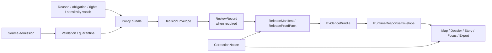

<!-- [KFM_META_BLOCK_V2]
doc_id: kfm://doc/NEEDS_VERIFICATION_UUID
title: Policy
type: standard
version: v1
status: draft
owners: NEEDS VERIFICATION
created: YYYY-MM-DD
updated: 2026-03-22
policy_label: public
related: ["../README.md", "../CONTRIBUTING.md", "../.github/README.md", "../contracts/README.md", "../data/README.md", "../apps/api/README.md"]
tags: [kfm, policy, governance, opa, rego]
notes: ["doc_id, owners, and created date require repo-backed verification before merge", "updated reflects 2026-03-22 repo-grounded evidence that policy/README.md was recently revised, not a verified front-matter field from the mounted checkout", "task-supplied relative links below must be reconciled with the real checkout before merge", "current session evidence confirms a policy/README.md documentation surface but does not confirm mounted .rego bundles, runnable policy tests, or an implemented policy-runtime package", "OPA/Rego is treated here as the strongest documented starter direction, not as confirmed mounted adoption"]
[/KFM_META_BLOCK_V2] -->

# Policy

_Governed, executable policy surface for KFM publication, runtime trust, rights and sensitivity handling, and visible correction._

> **Status:** `experimental`  
> **Owners:** `NEEDS VERIFICATION`  
>        
> **Repo fit:** `policy/README.md` · current session evidence confirms a policy README surface and a recent policy-doc revision, but does **not** confirm mounted `.rego` bundles, runnable policy tests, or a verified runtime package boundary  
> **Quick jump:** [Scope](#scope) · [Repo fit](#repo-fit) · [Accepted inputs](#accepted-inputs) · [Exclusions](#exclusions) · [Directory tree](#directory-tree) · [Policy seams](#policy-seams) · [Quickstart](#quickstart) · [Usage](#usage) · [Diagram](#diagram) · [Tables](#tables) · [Gates and definition of done](#gates-and-definition-of-done) · [FAQ](#faq) · [Appendix](#appendix)

> [!IMPORTANT]
> This README deliberately separates **CONFIRMED** repo-grounded evidence from **INFERRED** and **PROPOSED** target structure. In the current session, the strongest repo-state evidence is documentary, not a mounted checkout with executable policy assets.

## Scope

`policy/` is where KFM turns governance from prose into reviewable, machine-checkable behavior.

In KFM, policy is not a detached compliance appendix. It is the gate layer that shapes source admission, rights handling, sensitivity and redaction, review and release, runtime answers, correction and withdrawal, and the trust cues users see in the shell.

### Evidence labels used in this README

| Label | Meaning in this file |
|---|---|
| **CONFIRMED** | Directly supported by the attached KFM corpus or by repo-grounded evidence visible in this session |
| **INFERRED** | Conservative structural completion strongly implied by repeated KFM doctrine, but not verified as mounted implementation |
| **PROPOSED** | Doctrine-consistent target structure, starter path, or realization move not yet verified in a mounted checkout |
| **UNKNOWN** | Not supported strongly enough in this session to present as current repo/runtime fact |
| **NEEDS VERIFICATION** | Placeholder or unresolved detail that must be checked in the real repository before merge |

### Baseline used for this revision

| Role | Source posture | Why it anchors this README |
|---|---|---|
| Current repo-state anchor | Repo-grounded evidence | Establishes what is actually evidenced now: `policy/README.md` exists as a documentation surface; active workflow YAML gates and mounted `.rego` bundles were not confirmed |
| Master doctrine | Canonical KFM master reference | Supplies the strongest dependency-ordered statement of trust membrane, contract families, route families, finite runtime outcomes, and policy/test expectations |
| Supporting doctrine | UI / verification / atlas overlays | Deepens shell trust visibility, verification placement, Kansas operating lanes, and sensitivity burdens |
| Expansion pressure | Repo-grounded sprint + March idea corpus | Sharpens the next artifact wave: schemas, registries, fixtures, tests, receipts, and fail-closed policy behavior |

### Load-bearing commitments preserved here

| Commitment | Practical consequence |
|---|---|
| Default deny / fail closed | Missing rights, missing evidence linkage, unresolved sensitivity, or absent policy artifacts must end in a governed negative outcome rather than a silent allow |
| Reasons and obligations stay explicit | Policy should emit stable vocabularies instead of drifting into prose-only decisions |
| Publication is a governance event | Publishable output must be explainable through decision, review, release, and correction artifacts |
| Runtime outcomes stay finite | Claim-bearing runtime behavior should converge on explicit outcomes, not graceful-looking ambiguity |
| Correction remains visible | `withdrawn`, `superseded`, `review_pending`, and similar states must survive into downstream surfaces |
| UI reflects enforcement, but does not replace it | Trust cues belong in the shell, but backend, review, release, and runtime gates remain primary |

[Back to top](#policy)

## Repo fit

The strongest current picture is a split between a **documented repo surface** and a **doctrine-aligned target surface**.

The current evidence safely supports this much: `policy/README.md` exists as a repo documentation surface; policy doctrine is already framed around **deny by default**, **reasons and obligations**, and **finite outcomes**; workflow scaffolding is documented but active merge-blocking workflow YAML was not evidenced in the session material; and mounted `.rego` bundles/tests were not confirmed.

### Current repo evidence

| Concern | Evidence posture |
|---|---|
| `policy/README.md` exists as a documented surface | **CONFIRMED** |
| Policy documentation was recently revised for clarity/governance detail | **CONFIRMED** |
| `.github/workflows/README.md` documents scaffolding rather than proving active YAML merge gates in-tree | **CONFIRMED** |
| `contracts/README.md`, `schemas/README.md`, `tests/README.md`, `tools/README.md`, and `scripts/README.md` exist as documentation surfaces | **CONFIRMED** |
| Executable policy bundles in the mounted repo | **UNKNOWN** |
| Mounted `.rego` files or policy tests | **NOT CONFIRMED** |
| Runtime package seam such as `packages/policy-runtime/` | **UNKNOWN** |

### Repo fit links

| Direction | Intended neighbor | Why it matters |
|---|---|---|
| Upstream | [`../README.md`](../README.md) | Root system identity, doctrine, and repo navigation |
| Upstream | [`../CONTRIBUTING.md`](../CONTRIBUTING.md) | Review discipline for policy-significant change |
| Lateral | [`../contracts/README.md`](../contracts/README.md) | Contract families, schema ownership, and example/fixture relationships |
| Lateral | [`../data/README.md`](../data/README.md) | Truth-path zones and authoritative-versus-derived boundaries that policy governs |
| Downstream | [`../apps/api/README.md`](../apps/api/README.md) | Governed API neighbor; reconcile with the real tree before merge |
| Downstream | [`../.github/README.md`](../.github/README.md) | Workflow, gate, and promotion context |

> [!WARNING]
> The relative links above are retained because the task supplied them. They still need reconciliation against the mounted checkout before merge.

[Back to top](#policy)

## Accepted inputs

`policy/` should stay compact, typed, and execution-oriented.

| Input class | What belongs here | Typical examples |
|---|---|---|
| Executable policy bundles | Shared rules for admission, rights, sensitivity, review, release, runtime, correction, and export | `*.rego`, bundle manifests, machine-readable rule packs |
| Policy fixtures | Positive and negative examples that prove fail-closed behavior | `allow`, `deny`, `generalize`, `restrict`, `needs-review`, `withdraw`, `supersede` cases |
| Policy tests | Assertions specific to policy behavior | Conftest/OPA checks, outcome regression packs, bundle unit tests |
| Policy vocabularies | Stable reason/obligation or rights/sensitivity registries when the repo keeps them with policy | `reason_codes.*`, `obligation_codes.*`, `reviewer_roles.*` |
| Steward docs | Minimal human-readable notes needed to review the bundle | bundle READMEs, glossary fragments, review notes |

## Exclusions

| Does **not** belong in `policy/` | Put it instead | Why |
|---|---|---|
| Canonical JSON Schema / OpenAPI definitions | [`../contracts/`](../contracts/) or verified schema location | Shared object shape should not be duplicated inside rule packs |
| Runtime loaders, decision mediators, or API adapters | Verified runtime package boundary | Execution glue is adjacent to policy, but it is not the bundle itself |
| App handlers, UI-only conditionals, or workers | App/package boundary | Enforcement code is not the same artifact as the policy pack |
| RAW / WORK / QUARANTINE / PROCESSED / CATALOG / PUBLISHED data | [`../data/`](../data/) | Policy governs movement and exposure; it is not the canonical store |
| Secrets, keys, `.env` files, or live credentials | Secret manager / host configuration | Sensitive operational material must not live in the policy tree |
| Long operational runbooks unrelated to policy behavior | `docs/runbooks/` or verified runbook path | Keep this directory focused on executable governance |

[Back to top](#policy)

## Directory tree

### Current repo-grounded evidence (**CONFIRMED**)

```text
policy/
└── README.md
```

That is the strongest safe path-level claim from this session.

### Doctrine-aligned target shape (**PROPOSED**)

```text
policy/
├── README.md
├── bundles/
├── fixtures/
└── tests/
```

### Frequently implied adjacent seam (**INFERRED / PROPOSED**)

```text
packages/
└── policy-runtime/
```

> [!NOTE]
> Treat the trees above as different claim strengths, not one blended assertion. The first is current evidence. The others are doctrine-consistent starter shapes.

## Policy seams

Policy is most useful when it is organized by trust seam rather than by implementation fashion.

| Policy seam | What it decides | Trust objects it should touch | Fail-closed expectation |
|---|---|---|---|
| Source admission | Whether a source may enter the truth path and under what conditions | `SourceDescriptor`, `IngestReceipt`, `ValidationReport` | Unresolved rights, malformed shape, or unsupported cadence/support should quarantine or deny |
| Rights and sensitivity | Whether scope may stay precise, must generalize, must restrict, or must withhold | `DecisionEnvelope`, `ReviewRecord`, transform receipts | Exact-location or reuse risk should never fall through to public-safe output silently |
| Review and release | Whether promoted scope may publish and under what obligations | `DecisionEnvelope`, `ReviewRecord`, `ReleaseManifest` / `ReleaseProofPack` | No silent publish path |
| Runtime answer handling | Whether a request may answer, abstain, deny, or error | `EvidenceBundle`, `RuntimeResponseEnvelope` | Empty scope, stale support, unresolved policy, or uncited output should produce a governed negative outcome |
| Correction and withdrawal | How supersession, withdrawal, narrowing, and rollback remain visible | `CorrectionNotice`, release refs, rebuild refs | Correction must propagate visibly rather than erasing history |

[Back to top](#policy)

## Quickstart

### 1) Inspect the real policy surface

```bash
find . -maxdepth 4 \
  \( -path './policy' -o -path './packages/policy-runtime' -o -path './tests/policy' -o -path './contracts' \) \
  -print 2>/dev/null
```

### 2) Check whether executable policy files actually exist

```bash
find . -type f \
  \( -name '*.rego' -o -name '*policy*' -o -name '*reason*' -o -name '*obligation*' \) \
  | sort
```

### 3) Trace trust-bearing joins

```bash
grep -R -nE \
  'DecisionEnvelope|ReviewRecord|ReleaseManifest|ReleaseProofPack|EvidenceBundle|RuntimeResponseEnvelope|CorrectionNotice|reason_codes|obligation_codes|policy_bundle_version|rights_class|sensitivity_class' \
  policy packages contracts tests docs apps 2>/dev/null || true
```

### 4) Inspect workflow and gate wiring

```bash
find .github/workflows -maxdepth 2 -type f 2>/dev/null | sort
grep -R -nE 'opa|rego|conftest|policy|RuntimeResponseEnvelope|DecisionEnvelope|CorrectionNotice' \
  .github/workflows policy tests docs 2>/dev/null || true
```

### 5) Sanity-check runtime outcome grammar

```bash
grep -R -nE 'ANSWER|ABSTAIN|DENY|ERROR|allow|deny|generalize|restrict|STEWARD_REVIEW|withdraw|supersede' \
  policy packages contracts tests docs apps 2>/dev/null || true
```

> [!NOTE]
> These commands are discovery helpers, not proof by themselves. Update this README only after reconciling its claims against the mounted checkout.

[Back to top](#policy)

## Usage

### Add or change a policy family

1. Start with the seam, not the filename: admission, rights, sensitivity, review, release, runtime, export, or correction.
2. Update the shared vocabulary first, or explicitly point to the registry that already owns the change.
3. Add paired fixtures: at least one happy path and one negative path. Include transform, restrict, or review-required cases when the seam calls for them.
4. Verify that the meaning survives into downstream trust objects such as `DecisionEnvelope`, `ReviewRecord`, `ReleaseManifest`, `EvidenceBundle`, or `RuntimeResponseEnvelope`.
5. Make sure the same semantics survive both CI and runtime. KFM treats policy guarantees as system-level guarantees, not best-effort guidance.
6. Keep the doc honest: mark what is **CONFIRMED**, what is **INFERRED**, and what still needs verification.

### Keep reasons and obligations stable

- **Reasons** explain why a result occurred.
- **Obligations** explain what must happen next.
- Semantically changing a reason or obligation code should version the relevant bundle or registry.
- Transform obligations should create explicit receipts or visible consequences, not invisible UI behavior.
- Exception handling must stay review-bearing. No quiet override path belongs in normal flow.

### Illustrative starter decision (**PROPOSED**)

```yaml
input:
  actor_role: public
  surface_class: focus
  action: answer
  release_id: rel.2026-03-20.public.v1
  rights_class: open
  sensitivity_class: public

decision:
  result: allow
  reason_codes:
    - PUBLIC_SAFE
  obligation_codes:
    - REQUIRE_CITATION
    - RECORD_AUDIT
```

Use this as a starter fixture shape, not as proof that the mounted repo already emits this exact payload.

### What policy should prove before broader expansion

| Policy seam | Minimum thing to prove |
|---|---|
| Review / release | Publish or block through explicit `DecisionEnvelope` and, where required, `ReviewRecord` |
| Runtime ask | No uncited fifth outcome; only `ANSWER`, `ABSTAIN`, `DENY`, or `ERROR` |
| Generalization | A visible transform path with obligation handling and receipt linkage |
| Correction | Withdrawal/supersession remains inspectable after release |
| CI / runtime parity | The same core semantics survive both pull-request gates and live requests |

[Back to top](#policy)

## Diagram


```mermaid
flowchart LR
  Source[Source admission] --> Validate[Validation / quarantine]
  Vocab[Reason / obligation / rights / sensitivity vocab] --> Bundle[Policy bundle]
  Validate --> Bundle
  Bundle --> Decision[DecisionEnvelope]
  Decision --> Review[ReviewRecord<br/>when required]
  Review --> Release[ReleaseManifest / ReleaseProofPack]
  Release --> Evidence[EvidenceBundle]
  Evidence --> Runtime[RuntimeResponseEnvelope]
  Runtime --> Surfaces[Map / Dossier / Story / Focus / Export]
  Correction[CorrectionNotice] --> Release
  Correction --> Surfaces
```

Policy is the bridge between intake, review, release, runtime, and visible correction—not a detached checklist.

## Tables

### Route families and trust obligations

| Route family | Primary objects | Trust obligation |
|---|---|---|
| Catalog and discovery | Release metadata, dataset/distribution discovery, catalog closures | Catalog closure and identifier consistency must resolve cleanly |
| Feature or subject read | Released authoritative features, place dossiers, claims, detail views | Stable subject ID, support/time semantics, rights posture, and release scope are mandatory |
| Map / tile / portrayal | Released maps, tiles, legends, styles, portrayals | Must inherit release linkage, policy posture, freshness, and correction state |
| Evidence resolution | `EvidenceRef -> EvidenceBundle` and related trust objects | Every bundle must resolve to admissible published scope with visible rights/sensitivity state and audit linkage |
| Focus / governed assistance | Bounded natural-language investigation over released scope | Scope, citations, policy, and audit linkage must be visible in the same pane |
| Review / stewardship | Moderation, quarantine inspection, approval, denial, rollback, rights handling | No hidden approvals; every action must emit review and decision artifacts |

### Policy result grammar

| Result / state | Meaning | Expected consequence |
|---|---|---|
| `allow` | Request or release is policy-safe as scoped | Continue with named obligations |
| `deny` | Rights, sensitivity, actor, or release posture blocks the action | Explicit denial with stable reason |
| `generalize` | Exposure is allowed only after masking, aggregation, or geometry reduction | Visible transform state and receipt linkage |
| `restrict` | Surface is limited to a narrower actor or mode | Role-aware exposure; no quiet public fallback |
| `needs-review` / `STEWARD_REVIEW` | Machine gate cannot safely resolve the case alone | Route to steward queue with reason and audit refs |
| `withdrawn` / `superseded` | Trust state changed after release | Preserve lineage and correction visibility |

### Runtime envelope outcomes

| Outcome | Meaning | Surface behavior |
|---|---|---|
| `ANSWER` | Support is sufficient and policy-safe | Return response with evidence and trust cues |
| `ABSTAIN` | Evidence is weak, partial, stale, conflicted, or unresolved | Narrow scope or decline with inspectable reason |
| `DENY` | Policy blocks the request | Calm refusal with accountable reason |
| `ERROR` | Technical failure prevented reliable governed handling | Explicit failure without pretending policy or evidence passed |

### Current repo evidence versus doctrinal target

| Concern | Current repo-grounded evidence | Doctrine-aligned target |
|---|---|---|
| README surface | `policy/README.md` exists | Keep it as the human-facing entry point |
| Executable policy assets | Not confirmed in reviewed repo artifacts | Bundles + registries + fixtures + tests |
| Runtime seam | Not confirmed | `packages/policy-runtime/` or verified equivalent |
| Merge gates | Workflow scaffolding documented; active YAML merge gate not evidenced | Merge-blocking policy/contract validation |
| Rule engine | OPA/Rego treated as starter direction | Use only after checkout proves actual adoption |

[Back to top](#policy)

## Gates and definition of done

- [ ] The mounted checkout was inspected and the real `policy/` surface was documented.
- [ ] `doc_id`, owners, and created date were replaced with repo-backed values.
- [ ] The relationship between `policy/` and any runtime seam was verified in the real tree.
- [ ] Registry ownership is clear: no duplicate reason/obligation or rights/sensitivity vocabularies drift between `policy/` and `contracts/`.
- [ ] Fixtures cover at least `allow`, `deny`, `generalize`, `restrict`, `needs-review`, `withdraw`, and `supersede` behavior where applicable.
- [ ] Runtime outcomes align with the same visible trust grammar: `ANSWER`, `ABSTAIN`, `DENY`, `ERROR`.
- [ ] `DecisionEnvelope`, `ReviewRecord`, `ReleaseManifest`, `EvidenceBundle`, and `RuntimeResponseEnvelope` are either emitted or explicitly tracked as gaps.
- [ ] No silent override path exists; exceptions remain review-bearing and auditable.
- [ ] CI or local harness checks exist for policy bundles and fixtures, or the missing checks are explicitly tracked.
- [ ] Any mention of `OPA/Rego` remains tagged as a documented starter direction unless the mounted repo proves actual adoption.
- [ ] This README does not imply mounted routes, schemas, workflows, or package names that the checkout does not prove.

[Back to top](#policy)

## FAQ

### Does this README prove that executable policy bundles already exist in the repo?

No. Current evidence confirms the README surface and policy doctrine wording, but it does **not** confirm mounted `.rego` bundles or runnable policy tests.

### Is `OPA/Rego` confirmed?

It is the strongest documented starter direction in the current evidence. It is **not** confirmed here as a mounted implementation fact.

### Is a `policy-runtime` package confirmed?

No. It is a doctrine-consistent seam, not a verified current repo fact in this session.

### Do CI and runtime share policy?

They should. KFM doctrine treats policy guarantees as system-level guarantees, so CI and runtime should share core semantics and fixtures—or at minimum the same tested decision grammar.

### What should block publication?

Missing rights or sensitivity handling, unresolved evidence, missing review or release artifacts, failed policy fixtures, absent correction lineage, and any bounded-synthesis path that cannot answer with valid evidence or abstain honestly.

## Appendix

<details>
<summary><strong>Verification backlog and first-wave artifact set</strong></summary>

### Highest-priority verification checks

1. Inspect the mounted repo and confirm whether the policy surface is README-only, partially materialized, or already split into bundles, fixtures, and tests.
2. Verify whether runtime loading lives in a dedicated package, an app seam, or not yet at all.
3. Confirm where shared vocabularies really live: `policy/`, `contracts/`, or another documented location.
4. Surface the real policy entrypoints, fixture inventory, local commands, and CI jobs.
5. Replace placeholders in the meta block before merge.

### First-wave artifact order (**PROPOSED**)

| Priority | Artifact | Why it comes first |
|---|---|---|
| 1 | `source_descriptor.schema.json`, `dataset_version.schema.json`, `decision_envelope.schema.json`, `release_manifest.schema.json`, `evidence_bundle.schema.json`, `runtime_response_envelope.schema.json`, `correction_notice.schema.json` | Turns doctrine into machine-checkable structure |
| 1 | Reason / obligation / reviewer registries | Prevents free-text drift and stabilizes decision grammar |
| 1 | Valid / invalid fixtures | Proves fail-closed behavior instead of merely describing it |
| 2 | Policy bundle tests + route family proofs | Makes decision grammar and negative-path behavior executable |
| 2 | One hydrology thin slice | Proves end-to-end governance on a public-safe, place/time-rich lane |
| 3 | Runtime profile and trust-visible surface examples | Prevents UI or runtime from bluffing before evidence/policy are real |

### Starter bundle families (**PROPOSED**)

| Family | What it covers |
|---|---|
| Admission | Source admissibility and intake-side checks |
| Rights | License, access posture, and release eligibility |
| Sensitivity | Redaction, masking, exact-location restrictions, public-safe generalization |
| Review / release | Promotion gates, review-required mappings, proof readiness |
| Runtime | Claim-bearing response shaping, citation verification, finite outcomes |
| Correction | Withdrawal, supersession, stale-visible handling, correction propagation |

### Why `OPA/Rego` stays marked as starter direction

The current evidence supports it as the strongest policy-as-code fit in doctrine and in several starter patterns. That is strong enough to shape this README. It is not strong enough to claim mounted adoption without checkout inspection.

</details>

[Back to top](#policy)
