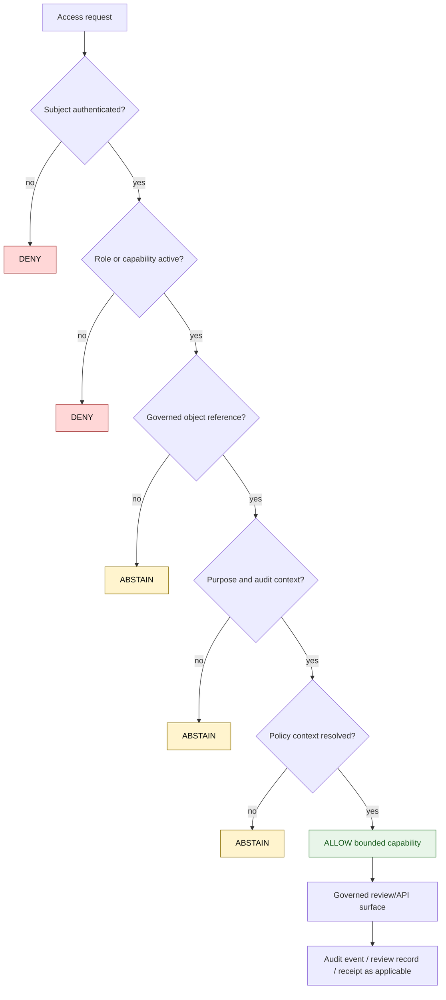

<!-- [KFM_META_BLOCK_V2]
doc_id: kfm://policy/access
title: Access Policy README
type: policy-readme
version: v0.1
status: draft
owners: OWNER_TBD — Access steward · Policy steward · Security steward · Docs steward
created: 2026-06-15
updated: 2026-06-15
policy_label: restricted
related:
  - ../README.md
  - flora-steward/README.md
  - ../../docs/doctrine/trust-membrane.md
  - ../../docs/doctrine/directory-rules.md
  - ../../docs/security/DATA_CLASSIFICATION.md
  - ../../apps/governed-api/README.md
  - ../../packages/policy-runtime/README.md
tags: [kfm, policy, access, authorization, roles, least-privilege, audit, deny-by-default]
notes:
  - "Initial README for the policy/access root."
  - "This directory is for access-policy documentation and policy modules; it is not a credential store or deployment secret home."
  - "Runtime enforcement, identity-provider mappings, policy bundle shape, tests, fixtures, and audit schemas remain NEEDS VERIFICATION."
[/KFM_META_BLOCK_V2] -->

<a id="top"></a>

<div align="center">

# Access Policy Root

`policy/access/`

**Access-control policy lane for KFM roles, steward capabilities, review surfaces, least-privilege gates, and auditable allow / deny / abstain decisions.**


[Scope](#1-scope) · [Repo fit](#2-repo-fit) · [Inputs](#5-inputs) · [Exclusions](#6-exclusions) · [Access lanes](#7-access-lanes) · [Diagram](#8-diagram) · [Definition of done](#14-definition-of-done)

</div>

---

> [!IMPORTANT]
> **Status:** draft / `NEEDS VERIFICATION`  
> **Owners:** `OWNER_TBD` — Access steward · Policy steward · Security steward · Docs steward  
> **Path:** `policy/access/README.md`  
> **Responsibility root:** `policy/` — policy-as-code and policy documentation  
> **Truth posture:** CONFIRMED file path / PROPOSED access-root contract / UNKNOWN runtime enforcement

> [!CAUTION]
> Access policy is not publication authority. An access decision can permit a bounded user action inside a governed review surface, but it must not publish claims, downgrade sensitivity, bypass rights review, or expose lifecycle data directly to public clients.

---

## Quick jump

- [1. Scope](#1-scope)
- [2. Repo fit](#2-repo-fit)
- [3. Root boundary](#3-root-boundary)
- [4. Default posture](#4-default-posture)
- [5. Inputs](#5-inputs)
- [6. Exclusions](#6-exclusions)
- [7. Access lanes](#7-access-lanes)
- [8. Diagram](#8-diagram)
- [9. Decision outcomes](#9-decision-outcomes)
- [10. Role and capability rules](#10-role-and-capability-rules)
- [11. Audit expectations](#11-audit-expectations)
- [12. Inspection path](#12-inspection-path)
- [13. Validation expectations](#13-validation-expectations)
- [14. Definition of done](#14-definition-of-done)
- [15. Open verification items](#15-open-verification-items)

---

## 1. Scope

`policy/access/` is the KFM policy lane for access-control posture.

It should hold access-policy documentation and, when implemented, policy modules or bundle material that decide who may use bounded KFM capabilities: reviewer actions, steward review, admin-only correction flows, restricted surfaces, and other role-gated operations.

In scope:

- role and capability policy boundaries
- least-privilege access posture
- allow / deny / abstain decision vocabulary
- fail-closed behavior for missing identity, role, purpose, object, or audit context
- review-console and governed-API access posture
- domain steward access lanes such as Flora steward review
- audit and validation expectations for access decisions

Out of scope:

- credentials, secrets, tokens, keys, or deployment environment variables
- schema authority
- release approval
- source acquisition
- public app routing
- direct data lifecycle access for public clients
- domain truth decisions
- sensitivity downgrades without sensitivity policy and review records

[Back to top](#top)

---

## 2. Repo fit

| Concern | Owning root | Expected relationship |
|---|---|---|
| Access policy | `policy/access/` | This README and child access-policy lanes |
| General policy root | `policy/` | Singular policy authority root for allow / deny / restrict / abstain / redaction / release posture |
| Runtime policy evaluation | `packages/policy-runtime/` or governed API policy runtime | Implementation home remains `NEEDS VERIFICATION` |
| Public API boundary | `apps/governed-api/` | Normal public and reviewer access should route through governed interfaces |
| Security classification | `docs/security/` | Human-facing security and exposure guidance, if present and current |
| Tests and fixtures | `tests/policy/`, `fixtures/policy/`, or verified equivalents | Required before promoting beyond draft |
| Receipts and audit records | `data/`, `schemas/contracts/v1/receipts/`, or verified homes | Exact homes remain `NEEDS VERIFICATION` |

> [!NOTE]
> The repository root `policy/` README identifies the singular policy home and lists access-related policy concerns. This `access/` README narrows that root contract to role and capability gates.

## 3. Root boundary

This root may define who may use a capability. It must not decide whether a claim is true, whether a source has rights clearance, whether a sensitive location can be public, or whether a release is approved.

Short rule:

```text
policy/access/       = who may use a bounded KFM capability
policy/sensitivity/  = whether sensitivity permits exposure or requires transform
policy/domains/      = domain policy and rights posture when present
contracts/           = object meaning
schemas/contracts/v1/ = machine-readable shape
release/             = publication, correction, rollback control
data/                = lifecycle state, proofs, receipts, artifacts
```

## 4. Default posture

Access policy should fail closed.

A request should return `DENY` or `ABSTAIN` when any required input is absent, stale, ambiguous, or unsupported:

- authenticated subject
- role or capability binding
- active authorization window
- target object reference
- requested action
- purpose of access
- policy context
- sensitivity context where relevant
- rights context where relevant
- release or review state where relevant
- audit target

## 5. Inputs

| Input family | Examples | Required posture |
|---|---|---|
| Subject | user ID, service ID, role claims, steward assignment | Verified by identity and access layer |
| Action | review, inspect, propose transform, recommend rollback, administer fixture | Explicit, finite, auditable |
| Object | claim, candidate, layer, source descriptor, review task, release artifact | Governed object reference, not raw public shortcut |
| Context | purpose, request channel, ticket, steward note, tenant or project scope | Present before consequential access |
| Policy state | sensitivity tier, rights state, release state, review state | Resolved or explicitly unknown |
| Evidence state | EvidenceRef, EvidenceBundle summary, citation state | Present for consequential review or display |
| Runtime metadata | policy version, request time, audit correlation ID | Recorded when runtime exists |

## 6. Exclusions

| Does not belong here | Correct home |
|---|---|
| Credentials, secrets, private keys, tokens | Secret manager / deployment configuration, not repo docs |
| Deployable application code | `apps/` |
| Reusable runtime implementation | `packages/policy-runtime/` or verified runtime package |
| Contract meaning | `contracts/` |
| Machine-readable schemas | `schemas/contracts/v1/` |
| Release approval and rollback authority | `release/` |
| Lifecycle data and artifacts | `data/` |
| Source acquisition jobs | `connectors/` or verified ingestion home |
| Human-only domain guidance | `docs/domains/` |
| Sensitivity exposure decisions | `policy/sensitivity/` plus domain policy lanes |

## 7. Access lanes

Current child lanes visible from this session:

| Lane | Purpose | Status | Notes |
|---|---|---|---|
| [`flora-steward/`](flora-steward/README.md) | Flora steward review access for sensitive Flora records, transforms, corrections, and rollback recommendations | CONFIRMED README exists | Review-only capability; not public release authority |
| Additional access lanes | Other role or capability policies | NEEDS VERIFICATION | Inventory required before claiming presence |

Potential future lanes should be added only when there is a clear role, capability, owner, policy runtime path, fixtures, and tests.

## 8. Diagram



## 9. Decision outcomes

| Outcome | Meaning | Required behavior |
|---|---|---|
| `ALLOW` | A bounded capability may proceed | Scope and audit the action |
| `DENY` | Access is blocked by policy | Do not reveal protected object details beyond safe denial message |
| `ABSTAIN` | Policy cannot decide because support is missing | Block access and name the missing prerequisite where safe |
| `ERROR` | Runtime, tool, schema, or policy evaluation failed | Block access and record failure |

> [!IMPORTANT]
> `ALLOW` must be capability-specific. Avoid broad permission language such as “has access to Flora” or “admin can see everything.” State the action, object scope, time window, and audit obligation.

## 10. Role and capability rules

Access lanes should prefer capability-specific permissions over broad roles.

| Rule | Reason |
|---|---|
| Least privilege by default | Reduces unnecessary exposure |
| Purpose-bound access | Keeps steward and reviewer actions auditable |
| Time-bounded authorization where practical | Supports review windows and revocation |
| Separation from release approval | Prevents access from becoming publication authority |
| Sensitivity-aware display | Prevents role access from exposing unnecessary precision |
| Audit before privilege expansion | Keeps exceptions reviewable |
| No silent admin shortcut | Prevents emergency paths from becoming normal public paths |

## 11. Audit expectations

Every consequential access decision should record:

- subject reference
- role or capability evaluated
- requested action
- target object reference
- decision outcome
- reason code
- policy bundle or version reference when available
- sensitivity, rights, release, or review state considered when relevant
- timestamp
- request channel
- review or ticket reference when available

> [!WARNING]
> Audit logs must not become a side channel for sensitive coordinates, secrets, private identity details, or unreleased source records.

## 12. Inspection path

Policy language, runtime, fixtures, and tests are `NEEDS VERIFICATION`. Use these local inspection commands before treating this lane as implemented.

```bash
# From the repository root, inspect access-policy lanes.
find policy/access -maxdepth 4 -type f | sort

# Inspect the wider policy root.
find policy -maxdepth 4 -type f | sort

# Inspect likely access-policy tests and fixtures.
find tests fixtures -maxdepth 5 -type f 2>/dev/null | grep -E 'policy|access|auth|role|steward' | sort
```

## 13. Validation expectations

Useful validation for access policy should cover:

- unauthenticated requests return `DENY`
- missing role or capability returns `DENY`
- missing object reference returns `ABSTAIN`
- missing purpose or audit context returns `ABSTAIN`
- unresolved sensitivity, rights, review, or release context returns `ABSTAIN` when relevant
- `ALLOW` is scoped to one bounded capability
- public clients cannot invoke steward-only lanes
- denied and abstained decisions include safe reason codes
- audit events are produced without leaking sensitive data
- emergency or admin override, if ever introduced, is documented, constrained, audited, and not the normal path

## 14. Definition of done

- [ ] Owners are confirmed and `OWNER_TBD` is replaced.
- [ ] Access-policy runtime language and bundle location are confirmed.
- [ ] Identity provider and role/capability claim names are documented or linked.
- [ ] Child access lanes are inventoried.
- [ ] Decision outcomes are represented in policy fixtures.
- [ ] Tests cover `ALLOW`, `DENY`, `ABSTAIN`, and `ERROR` paths.
- [ ] Public clients cannot bypass governed APIs through access policy helpers.
- [ ] Audit event shape is documented or linked.
- [ ] Release approval remains separate from access decisions.
- [ ] Rollback target is documented for policy changes.

## 15. Open verification items

| Item | Why it matters |
|---|---|
| Confirm access-policy runtime language | Prevents writing non-runnable policy modules |
| Confirm policy bundle packaging | Required for runtime enforcement |
| Confirm identity and role claim names | Prevents mismatched authorization logic |
| Confirm child access lanes | Keeps this root README complete |
| Confirm tests and fixtures | Required before promotion beyond draft |
| Confirm audit event schema | Required for accountability and incident response |
| Confirm review-console integration | Prevents steward/reviewer access from becoming a public path |
| Confirm admin/emergency override posture | Ensures shortcuts are constrained, documented, and audited |

<details>
<summary>Appendix A — illustrative access input shape</summary>

This example is illustrative. It is not a verified schema.

```json
{
  "subject": {
    "id": "SUBJECT_ID_TBD",
    "roles": ["ROLE_TBD"],
    "active": true
  },
  "action": "ACTION_TBD",
  "object": {
    "id": "OBJECT_ID_TBD",
    "type": "OBJECT_TYPE_TBD",
    "state": "candidate"
  },
  "context": {
    "purpose": "PURPOSE_TBD",
    "ticket_ref": "TICKET_TBD",
    "evidence_ref": "EVIDENCE_REF_TBD"
  }
}
```

</details>

<details>
<summary>Appendix B — no-loss preservation note</summary>

The target file was an empty placeholder. This README adds a bounded access-policy root contract without claiming runtime enforcement, tests, identity-provider mappings, production readiness, or complete child-lane inventory.

It preserves KFM’s policy posture by separating access from publication, sensitivity decisions, rights clearance, schema authority, source truth, release authority, and lifecycle data.

</details>

## Status summary

`policy/access/` should define the access-policy root for KFM role and capability decisions.

It should enable constrained, auditable, least-privilege access while preserving governed API boundaries, fail-closed behavior, sensitivity controls, rights posture, evidence requirements, review state, release separation, correction lineage, and rollback visibility.

<p align="right"><a href="#top">Back to top</a></p>
