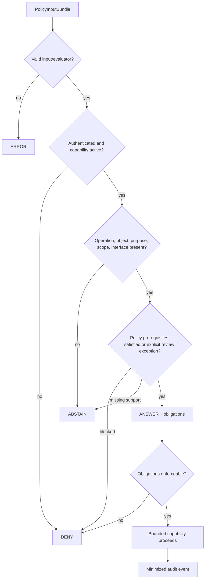

<!-- [KFM_META_BLOCK_V2]
doc_id: kfm://policy/access
title: Access Policy README
type: policy-readme
version: v0.2
status: draft
owners: OWNER_TBD — Access steward · Policy steward · Security steward · Identity steward · Audit steward · Release steward · Docs steward
created: 2026-06-15
updated: 2026-07-14
policy_label: restricted
supersedes: v0.1 (2026-06-15)
related:
  - ../README.md
  - flora-steward/README.md
  - ../../contracts/policy/policy_input_bundle.md
  - ../../contracts/policy/policy_decision.md
  - ../../schemas/contracts/v1/policy/policy_input_bundle.schema.json
  - ../../schemas/contracts/v1/policy/policy_decision.schema.json
  - ../../docs/doctrine/directory-rules.md
  - ../../docs/architecture/trust-membrane.md
  - ../../docs/security/DATA_CLASSIFICATION.md
  - ../../apps/governed-api/README.md
  - ../../apps/review-console/README.md
  - ../../packages/policy-runtime/README.md
tags: [kfm, policy, access, authorization, capability, least-privilege, separation-of-duties, audit, revocation, deny-by-default]
notes:
  - "v0.2 aligns the access-policy root with the repository PolicyInputBundle and PolicyDecision contracts."
  - "Runtime-facing access decisions use ANSWER | ABSTAIN | DENY | ERROR with policy_family=access."
  - "This README defines the access-policy boundary; it is not a credential store, access grant, identity provider, sensitivity decision, rights clearance, evidence authority, or release approval."
  - "Runtime enforcement, identity mappings, bundles, audit sinks, fixtures, tests, revocation propagation, and deployed review surfaces remain NEEDS VERIFICATION."
[/KFM_META_BLOCK_V2] -->

<a id="top"></a>

# Access Policy Root

`policy/access/`

**Canonical access-policy lane for deciding who may perform a specific, bounded KFM capability on a governed object, for a stated purpose, through an auditable interface.**


> [!IMPORTANT]
> **Path:** `policy/access/README.md`  
> **Responsibility root:** `policy/` — admissibility and access-control policy  
> **Truth posture:** CONFIRMED repository relationships · PROPOSED access-root contract · UNKNOWN deployed enforcement

> [!CAUTION]
> **Access authority is not truth, sensitivity, rights, evidence, or release authority.** An access decision may permit one bounded action inside a governed surface. It must not publish a claim, downgrade sensitivity, clear rights, manufacture evidence, expose internal lifecycle stores, or grant a broad “see everything” role.

## Quick jump

[Scope](#1-scope) · [Authority](#3-authority-boundary) · [Capabilities](#6-capability-model) · [Child lanes](#7-child-access-lane-contract) · [Decision contract](#10-decision-contract) · [Audit](#14-audit-and-data-minimization) · [Validation](#18-validation-and-acceptance-matrix) · [Definition of done](#21-definition-of-done)

---

## 1. Scope

`policy/access/` owns the policy conditions under which an authenticated subject may perform a named capability on a governed object, for an explicit purpose, within a bounded scope and authorization window.

### In scope

- capability-specific authorization;
- role-to-capability mappings;
- least-privilege, purpose-bound, time-bound, and object-bound access;
- reviewer, steward, operator, service, and restricted-surface access;
- finite decisions, reason codes, and obligations;
- audit, revocation, freshness, and cache-invalidation expectations;
- separation of duties and break-glass constraints;
- child access-lane requirements;
- deterministic negative-path fixtures and tests.

### Out of scope

- credentials, tokens, private keys, or deployment secrets;
- identity-provider implementation;
- contracts and JSON Schemas;
- source authority or evidence truth;
- rights clearance or sensitivity downgrade;
- release, correction, withdrawal, or rollback approval;
- application routes and UI implementation;
- direct public access to RAW, WORK, QUARANTINE, or canonical stores;
- AI-generated authorization.

---

## 2. Evidence basis and verification boundary

### CONFIRMED

- `policy/` is the singular policy responsibility root.
- This README and `flora-steward/README.md` exist.
- `PolicyInputBundle` and `PolicyDecision` contracts exist under `contracts/policy/`.
- paired policy schemas exist under `schemas/contracts/v1/policy/`.
- `packages/policy-runtime/README.md` defines reusable evaluator-helper boundaries.
- `apps/governed-api/README.md` defines the intended trust-membrane boundary.
- Directory Rules separate policy, contracts, schemas, packages, apps, data, and release authority.

### PROPOSED

- this access-root contract;
- capability naming and scoping;
- access reason codes and obligations;
- evaluation order;
- revocation, cache, break-glass, and child-lane requirements.

### UNKNOWN / NEEDS VERIFICATION

- identity provider and claim names;
- executable policy language and bundle packaging;
- runtime wiring and enforcement coverage;
- audit-event schema and sink;
- revocation propagation and decision caching;
- review-console routes;
- fixtures, tests, CI results, and production behavior.

This README is not implementation proof.

---

## 3. Authority boundary

The access root answers:

> **May this authenticated subject perform this specific operation on this bounded object, for this purpose, through this governed interface, at this time, under these obligations?**

It does not decide claim truth, source authority, evidence closure, rights, sensitivity tier, release, correction, or rollback.

```text
policy/access/            = who may perform a bounded capability
policy/sensitivity/       = what sensitivity permits or transforms
policy/domains/           = domain admissibility and rights posture
contracts/                = object meaning
schemas/contracts/v1/     = machine shape
packages/policy-runtime/  = reusable evaluation helpers
apps/                     = governed executable surfaces
data/                     = lifecycle state, receipts, proofs, audit artifacts
release/                  = publication, correction, withdrawal, rollback
```

A child lane may narrow access for one capability, but it must not redefine shared contracts, sensitivity tiers, rights statuses, release gates, or lifecycle law.

---

## 4. Operating invariants

1. Missing, stale, ambiguous, unsupported, or invalid context never becomes implicit permission.
2. Decisions name the capability; broad role labels are insufficient.
3. Object, purpose, audience, interface, scope, and time window are explicit.
4. Access is not publication.
5. Obligations are mandatory; inability to enforce them fails closed.
6. Access policy consumes evidence, rights, sensitivity, review, and release state; it does not create them.
7. Sensitive details are minimized in responses and logs.
8. Revocation and expiry override cached permission.
9. Public clients use governed interfaces, not lifecycle or canonical stores.
10. Decisions are auditable, immutable, and supersedable.
11. AI-generated text cannot create identity or authorization.
12. Break-glass access is isolated, short-lived, audited, and independently reviewed.

---

## 5. Default posture

| Condition | Default outcome |
|---|---|
| Unauthenticated subject | `DENY` |
| Capability absent, expired, inactive, or revoked | `DENY` |
| Missing operation, object, purpose, or audit context | `ABSTAIN` |
| Invalid input, stale bundle, evaluator failure, or revocation-check failure | `ERROR` |
| Public exposure with unresolved rights or sensitivity | `DENY` or `ABSTAIN` per accepted policy |
| Authorized restricted review to resolve an unresolved state | `ANSWER` with restrictive obligations |
| Caller cannot enforce a mandatory obligation | `DENY` or `ERROR` |

Review access to an unresolved record does not resolve the record and does not make it publishable.

---

## 6. Capability model

Prefer capability-specific permissions over broad roles.

Illustrative capabilities:

```text
review_flora_candidate
inspect_restricted_occurrence
review_geoprivacy_transform
review_rights_question
submit_correction_recommendation
recommend_release_rollback
administer_access_mapping
```

Avoid:

```text
flora_access
reviewer_all
admin_everything
can_see_sensitive
superuser
```

Each capability should bind:

| Dimension | Examples |
|---|---|
| Operation | inspect, review, propose, annotate, export, administer |
| Object | candidate, occurrence, claim, layer, transform, release artifact |
| Scope | assigned object, project, geography, quantity, time window |
| Purpose | sensitivity review, rights review, correction, incident response |
| Audience/interface | public, steward, service; API, review console, worker |
| Obligations | redact, generalize, no export, audit, second review |

---

## 7. Child access-lane contract

Each child directory under `policy/access/` should document one coherent capability boundary.

Required sections:

1. purpose and non-goals;
2. owners and reviewers;
3. subject/capability identity;
4. accepted operations and object scope;
5. purpose, audience, interface, and time constraints;
6. required evidence, rights, sensitivity, review, and release context;
7. finite decision mapping;
8. reason codes and obligations;
9. audit and minimization rules;
10. revocation and freshness;
11. separation of duties and break-glass posture;
12. fixtures, tests, rollback, and open verification items.

### Current child lanes

| Lane | Purpose | Status |
|---|---|---|
| [`flora-steward/`](flora-steward/README.md) | Bounded Flora steward review access | README exists; runtime enforcement remains unverified |

Do not create a child lane merely because a role name exists. A lane needs a bounded capability, owner, governed caller, reason codes, obligations, fixtures, tests, audit expectations, and revocation behavior.

---

## 8. Policy input contract

Access evaluation should receive an explicit `PolicyInputBundle` or compatible equivalent.

Required semantic families:

- immutable bundle identity;
- authenticated subject reference and subject type;
- requested operation/capability;
- governed object reference and lifecycle/release state;
- geography, quantity, project, assignment, and time scope;
- purpose and ticket/review context;
- audience and interface;
- evidence/source refs where consequential;
- rights and sensitivity state;
- review and separation-of-duties context;
- release, correction, and rollback refs where relevant;
- policy bundle id/hash/version and evaluator version;
- correlation id and safe audit target;
- prior, superseded, stale, or revoked decisions.

Rules:

- no hidden fetches from UI state, prompts, operator memory, or generated prose;
- no raw protected records when refs or generalized values suffice;
- unresolved state is explicit;
- input bundles are immutable after evaluation;
- reevaluation creates a new bundle and decision.

---

## 9. Evaluation order

```text
1. Validate input and evaluator integrity
2. Authenticate subject
3. Resolve active capability
4. Check expiry, revocation, and freshness
5. Validate operation, object, scope, purpose, audience, and interface
6. Evaluate evidence, rights, sensitivity, review, and release prerequisites
7. Evaluate quantity, export, rate, and anti-enumeration constraints
8. Produce finite outcome, reasons, and obligations
9. Enforce obligations before object access
10. Emit minimized audit event
11. Reevaluate after material state change
```



---

## 10. Decision contract

The paired `PolicyDecision` schema uses:

```text
outcome: ANSWER | ABSTAIN | DENY | ERROR
policy_family: access
```

| Outcome | Meaning |
|---|---|
| `ANSWER` | The bounded operation may proceed only if obligations are enforced |
| `ABSTAIN` | Required admissible support is missing, unresolved, stale, or ambiguous |
| `DENY` | Access policy blocks the operation |
| `ERROR` | Shape, identity, evaluator, policy, or process failure prevents a decision |

A lower-level engine may use `ALLOW | RESTRICT | HOLD | DENY | ABSTAIN | ERROR`, but it requires an explicit tested mapping:

| Engine | Runtime decision |
|---|---|
| `ALLOW` | `ANSWER` |
| `RESTRICT` | `ANSWER` with restrictive obligations |
| `HOLD` | `ABSTAIN` |
| `ABSTAIN` | `ABSTAIN` |
| `DENY` | `DENY` |
| `ERROR` | `ERROR` |

`ANSWER` is not release approval, evidence closure, sensitivity downgrade, rights clearance, or permission for another operation.

---

## 11. Reason-code vocabulary

### Permit/restrict

- `ACCESS_CAPABILITY_ACTIVE`
- `ACCESS_PURPOSE_BOUND`
- `ACCESS_OBJECT_SCOPE_MATCH`
- `ACCESS_REVIEW_ASSIGNMENT_MATCH`
- `ACCESS_REVIEW_UNRESOLVED_STATE_PERMITTED`
- `ACCESS_GENERALIZED_VIEW_REQUIRED`
- `ACCESS_EXPORT_PROHIBITED`
- `ACCESS_SECOND_REVIEW_REQUIRED`

### Deny

- `ACCESS_UNAUTHENTICATED`
- `ACCESS_CAPABILITY_MISSING`
- `ACCESS_CAPABILITY_INACTIVE`
- `ACCESS_AUTHORIZATION_EXPIRED`
- `ACCESS_AUTHORIZATION_REVOKED`
- `ACCESS_SCOPE_MISMATCH`
- `ACCESS_INTERFACE_NOT_ALLOWED`
- `ACCESS_PUBLIC_CLIENT_RESTRICTED`
- `ACCESS_EXPORT_DENIED`
- `ACCESS_BULK_EXTRACTION_DENIED`
- `ACCESS_SENSITIVITY_POLICY_BLOCK`
- `ACCESS_RIGHTS_POLICY_BLOCK`
- `ACCESS_RELEASE_AUTHORITY_REQUIRED`
- `ACCESS_OBLIGATION_UNENFORCEABLE`

### Abstain

- `ACCESS_OBJECT_REF_MISSING`
- `ACCESS_OPERATION_MISSING`
- `ACCESS_PURPOSE_MISSING`
- `ACCESS_AUDIT_CONTEXT_MISSING`
- `ACCESS_SCOPE_UNRESOLVED`
- `ACCESS_EVIDENCE_STATE_UNRESOLVED`
- `ACCESS_RIGHTS_STATE_UNRESOLVED`
- `ACCESS_SENSITIVITY_STATE_UNRESOLVED`
- `ACCESS_REVIEW_STATE_UNRESOLVED`
- `ACCESS_RELEASE_STATE_UNRESOLVED`

### Error

- `ACCESS_INPUT_INVALID`
- `ACCESS_IDENTITY_INTEGRITY_ERROR`
- `ACCESS_POLICY_BUNDLE_MISSING`
- `ACCESS_POLICY_BUNDLE_STALE`
- `ACCESS_POLICY_EVALUATOR_ERROR`
- `ACCESS_POLICY_TIMEOUT`
- `ACCESS_AUDIT_SINK_ERROR`
- `ACCESS_REVOCATION_CHECK_ERROR`

Reason strings must not contain protected coordinates, secrets, private identity attributes, or unreleased records.

---

## 12. Obligation vocabulary

| Obligation | Meaning |
|---|---|
| `audit_access_event` | Emit a minimized audit event |
| `limit_to_assigned_objects` | Enforce object assignment/allowlist |
| `limit_to_purpose` | Permit only the recorded purpose |
| `limit_to_authorization_window` | Recheck expiry and revocation |
| `reviewer_surface_only` | Do not expose through public clients |
| `withhold_exact_location` | Do not return exact geometry |
| `generalize_geometry` | Apply approved generalization |
| `redact_sensitive_fields` | Remove protected attributes |
| `prohibit_bulk_export` | Block bulk or repeated extraction |
| `prohibit_download` | Block object/file download |
| `apply_rate_limit` | Bound enumeration and frequency |
| `attach_rights_notice` | Preserve rights/attribution |
| `attach_evidence_refs` | Preserve evidence refs in review surfaces |
| `require_second_reviewer` | Require independent review |
| `require_release_gate` | Prevent access from becoming publication |
| `require_correction_flow` | Route mutation through correction governance |
| `require_fresh_decision` | Reevaluate instead of using stale cache |
| `record_break_glass_review` | Trigger independent post-event review |

Unknown mandatory obligations fail closed.

---

## 13. State, lifecycle, and public boundary

Distinguish:

- **missing** — required context was not supplied;
- **unresolved** — an explicit unknown/disputed state exists;
- **restricted** — policy blocks or limits the operation;
- **stale** — prior decision is no longer current;
- **revoked** — authorization was withdrawn;
- **superseded** — a newer decision replaces an older one.

```text
RAW -> WORK / QUARANTINE -> PROCESSED -> CATALOG / TRIPLET -> PUBLISHED
```

Access policy may gate operations at any phase, but it does not move artifacts between phases. Normal public clients must not access RAW, WORK, QUARANTINE, or canonical/internal stores directly.

---

## 14. Audit and data minimization

Minimum fields for consequential access:

- event/correlation id;
- subject reference and type;
- capability;
- safe object reference and type;
- purpose, audience, and interface;
- outcome, reasons, and obligations;
- policy family and bundle version/hash;
- evaluator version and evaluated time;
- authorization expiry/freshness;
- review/ticket/assignment reference;
- prior/superseded decision reference when applicable.

Do not log by default:

- passwords, tokens, secrets, or signing keys;
- exact protected coordinates;
- full rare-species/culturally sensitive records;
- unnecessary living-person attributes;
- unredacted DNA/genomic data;
- source credentials;
- complete restricted exports;
- generated prompts containing protected content.

For high-risk restricted access, required audit-sink failure should return `ERROR` and block access.

---

## 15. Revocation, freshness, and caching

Required posture:

- honor revocation and expiry;
- bind cached decisions to subject, operation, object scope, purpose, interface, policy version, authorization version, and material object state;
- re-evaluate after role, assignment, policy, sensitivity, rights, evidence, review, release, correction, or break-glass changes;
- avoid caching exact sensitive payloads in browsers or shared intermediaries;
- preserve superseded decisions for audit.

A role-only cache key is insufficient.

---

## 16. Separation of duties

| Decision | Owner |
|---|---|
| Authenticate subject | Identity/authentication system |
| Map role/capability | Access steward / identity governance |
| Decide access | `policy/access/` evaluator |
| Decide sensitivity | `policy/sensitivity/` and reviewer |
| Decide rights | domain/rights policy and reviewer |
| Resolve evidence | EvidenceBundle/evidence resolver |
| Review domain object | Domain steward/reviewer |
| Approve release | Release authority |
| Correct/withdraw/rollback | Correction/release governance |
| Audit exceptional access | Audit/security function |

Access-policy maintenance authority must not become self-approved exceptional access. Policy-significant release duties should remain independently reviewable.

---

## 17. Threat and break-glass posture

| Threat | Mitigation |
|---|---|
| Broad-role privilege creep | Capability-specific policy and inventory |
| Stale authorization | Expiry, revocation, reevaluation |
| Object enumeration | Rate limits, assignment scope, safe denials |
| Bulk extraction | Separate export capability and quantity limits |
| Log leakage | Minimized fields and stable reason codes |
| Public UI invokes restricted capability | Audience/interface binding |
| Decision reused for another operation | Operation-bound decision/cache key |
| Access mistaken for release | `require_release_gate` and separate authority |
| Prompt-generated role claim | Generated content is untrusted |
| Join-induced sensitivity | Reevaluate after joins/precision changes |
| Shared service identity | Distinct service principals and correlation ids |
| Client-only enforcement | Server-side governed enforcement |

Break-glass, if implemented, requires a separately named capability, strong authentication, short expiry, bounded scope, ticket/reason, enhanced audit, independent review, immediate revocation, and no automatic export, release, or sensitivity downgrade.

---

## 18. Validation and acceptance matrix

| Case | Expected |
|---|---|
| Public capability on public-safe released object | `ANSWER` |
| Unauthenticated subject | `DENY` |
| Missing/inactive/revoked/expired capability | `DENY` |
| Missing operation, object, purpose, or audit context | `ABSTAIN` |
| Invalid input or stale/missing policy bundle | `ERROR` |
| Authorized restricted review | `ANSWER` with reviewer-only/audit/no-export obligations |
| Authorized review of unresolved sensitivity | `ANSWER`; unresolved state preserved; release blocked |
| Public request for restricted object | `DENY` |
| Caller cannot enforce obligation | `DENY` or `ERROR` |
| Bulk extraction or inference attack | `DENY` or restricted response |
| Decision reused for another operation | `DENY` |
| Decision reused after material change | Reevaluate |
| Public UI invokes steward capability | `DENY` |
| Audit sink fails for high-risk access | `ERROR` |
| Break-glass without activation | `DENY` |
| Valid break-glass activation | `ANSWER` with short expiry/enhanced audit |
| Evaluator timeout | `ERROR` |
| AI-generated role claim | `DENY` or `ABSTAIN` |

Fixtures must be synthetic or public-safe.

---

## 19. Repository inspection path

```bash
find policy/access -maxdepth 5 -type f | sort
find contracts/policy schemas/contracts/v1/policy -maxdepth 5 -type f | sort
find packages/policy-runtime -maxdepth 6 -type f | sort
find apps/governed-api apps/review-console apps/explorer-web -maxdepth 6 -type f 2>/dev/null | sort
find fixtures tests -maxdepth 7 -type f 2>/dev/null \
  | grep -E 'policy|access|auth|role|capability|steward|revocation' \
  | sort
```

Evidence required before claiming enforcement:

- executable policy and bundle packaging;
- accepted identity/capability mapping;
- schema, validator, fixtures, and tests;
- governed caller integration;
- audit event and sink;
- revocation propagation;
- workflow/check evidence;
- rollback procedure.

---

## 20. Implementation sequence

1. inventory child lanes and policy modules;
2. confirm identity and capability vocabulary;
3. strengthen `PolicyInputBundle` access fields;
4. confirm `PolicyDecision` mapping for `policy_family=access`;
5. register reason codes and obligations;
6. implement synthetic fixtures and negative tests;
7. wire the policy runtime through governed surfaces;
8. implement minimized audit events;
9. implement revocation and cache invalidation;
10. add anti-enumeration and export controls;
11. add break-glass only after normal access is proven;
12. run rollback and negative-path drills;
13. update docs from verified evidence.

---

## 21. Definition of done

- [ ] Owners and reviewers are confirmed.
- [ ] Child lanes are inventoried.
- [ ] Identity and capability claim names are documented.
- [ ] Policy language and bundle packaging are confirmed.
- [ ] `PolicyInputBundle` access fields are schema-enforced.
- [ ] `PolicyDecision` uses `ANSWER | ABSTAIN | DENY | ERROR`.
- [ ] Reason codes and obligations are registered and tested.
- [ ] Missing, unresolved, restricted, stale, revoked, and superseded states are distinguished.
- [ ] Revocation, expiry, and cache invalidation are tested.
- [ ] Public clients cannot invoke restricted/steward/admin capabilities.
- [ ] Audit minimization, bulk-extraction, and enumeration controls are tested.
- [ ] Access does not bypass evidence, sensitivity, rights, review, release, correction, or rollback.
- [ ] Break-glass, if present, is isolated, expiring, audited, and independently reviewed.
- [ ] Fixtures are synthetic/public-safe.
- [ ] CI evidence and rollback instructions exist.
- [ ] README status reflects evidence, not aspiration.

---

## 22. Open verification register

| Item | Status |
|---|---|
| Access-policy executable language | NEEDS VERIFICATION |
| Bundle packaging/versioning | NEEDS VERIFICATION |
| Identity provider | UNKNOWN |
| Subject/role/capability claims | NEEDS VERIFICATION |
| Review-console implementation | NEEDS VERIFICATION |
| Governed API enforcement coverage | NEEDS VERIFICATION |
| Policy input schema maturity | NEEDS VERIFICATION |
| Audit event contract and sink | NEEDS VERIFICATION |
| Revocation propagation | NEEDS VERIFICATION |
| Decision cache implementation | UNKNOWN |
| Anti-enumeration and bulk export controls | NEEDS VERIFICATION |
| Break-glass posture | UNKNOWN |
| Complete child-lane inventory | NEEDS VERIFICATION |
| Separation-of-duties enforcement | NEEDS VERIFICATION |
| CI enforcement and rollback drill | NEEDS VERIFICATION |

---

## Appendix — illustrative decision

```json
{
  "decision_id": "poldec:20260714:access:review-example",
  "outcome": "ANSWER",
  "policy_family": "access",
  "reasons": [
    "ACCESS_CAPABILITY_ACTIVE",
    "ACCESS_REVIEW_ASSIGNMENT_MATCH"
  ],
  "obligations": [
    "reviewer_surface_only",
    "prohibit_bulk_export",
    "audit_access_event",
    "require_release_gate"
  ],
  "evaluated_at": "2026-07-14T16:30:00Z"
}
```

`ANSWER` permits only the evaluated access operation. It does not publish, clear rights, downgrade sensitivity, or resolve evidence.

---

## v0.1 → v0.2 preservation and correction

Preserved:

- singular `policy/` authority;
- least privilege and fail-closed behavior;
- access is not publication;
- governed-interface requirement;
- child-lane concept;
- audit expectations;
- no credentials/secrets;
- constrained admin paths;
- bounded implementation claims.

Corrected and expanded:

- replaced runtime-facing `ALLOW` with `ANSWER | ABSTAIN | DENY | ERROR`;
- added explicit engine-to-contract mapping;
- added capability, scope, purpose, audience, interface, reason, and obligation rules;
- distinguished missing and unresolved states;
- added revocation, caching, separation of duties, threat, bulk-export, and break-glass posture;
- added deterministic acceptance criteria, implementation sequence, and verification register.

Reverting the documentation commit restores v0.1. No executable policy, schema, fixture, test, runtime, workflow, data, receipt, proof, or release artifact is changed.

---

## Status summary

`policy/access/` is the canonical access-control lane for bounded KFM capabilities.

Every consequential access decision should bind:

```text
subject + operation + object + scope + purpose + audience/interface
+ policy/evidence/rights/sensitivity/review/release context
+ finite outcome + reasons + enforceable obligations + audit
```

Access may enable governed review. It must never silently become truth, sensitivity, rights, evidence, or release authority.

<p align="right"><a href="#top">Back to top</a></p>
