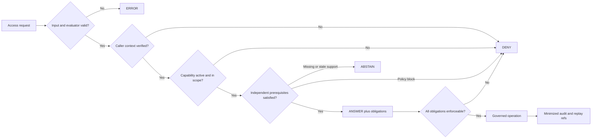

<!-- [KFM_META_BLOCK_V2]
doc_id: kfm://policy/access
title: policy/access/ — Capability-Authorization Policy Boundary
type: policy-readme
readme_profile: BOUNDARY_COMPACT
version: v0.3
status: draft; repository-grounded; accepted-placement; readme-only-rule-lane; evaluator-unbound; no-authentication-provider; non-release; non-publication
owner: NEEDS VERIFICATION — CODEOWNERS routes /policy/ to @bartytime4life; accepted access stewardship, identity governance, security review, obligation ownership, and independent approval were not established
created: 2026-06-15
updated: 2026-08-13
prepared_under_prompt: KFM Repository Build-Out & Markdown Modernization Implementation Agent v6.0.0
policy_label: "repository-facing; internal-policy-source; access; capability-authorization; least-privilege; purpose-bound; fail-closed; privacy-minimizing; no-secrets; no-release-authority; no-publication-authority"
current_path: policy/access/README.md
owning_root: policy/
root_registry_id: root.policy
local_scope_id: "kfm://policy/access — stable document identity; executable evaluator scope not accepted"
responsibility: define and index the proposed policy boundary for deciding whether a verified caller may perform one named capability on one governed object through one governed interface, without authenticating callers, storing grants or credentials, assigning roles, evaluating an active bundle, enforcing obligations, recording audit instances, approving release, or publishing
truth_posture: CONFIRMED stable same-path document identity, accepted ADR-0029 placement under singular root.policy, direct access inventory of this README plus one README-only Flora child, no Rego or other non-README payload in the lane, CODEOWNERS routing without accepted ownership proof, documentation-only identity-context lane, non-credential IdentityToken validation, fixture-only explicit policy-input profile that does not model caller authentication or access grants, closed proposed PolicyDecision and DecisionEnvelope shapes with access family support, inactive reason/obligation and reviewer-role vocabularies, deterministic DecisionEnvelope validation, fixture-only API exposure and field-level authorization assessments, three-route abstain-only governed API, placeholder policy runtime, README-only Review Console package, empty proposed policy/release registers, 18-test structural boundary suite, and semantic collision with evidence AccessObservation / PROPOSED capability grammar, access-request input profile, evaluation order, outcome normalization, access-specific reasons, obligation interpretation, audit references, revocation, cache invalidation, break-glass constraints, tests, consumer binding, and implementation sequence / UNKNOWN accepted authentication provider, credential verifier, subject and service claim vocabulary, role/capability registry, active access bundle, bundle selector, general evaluator, authenticated decision emitter, obligation interpreter, audit-event contract and sink, revocation service, production consumer, required checks, deployment, and operational behavior / NEEDS VERIFICATION accepted owners, local executable scope, child-lane reconciliation, access-specific contract and schema, registered authentication and authorization reasons, end-to-end negative tests, independent review, receipt/proof binding, incident response, correction propagation, and rollback automation
evidence_repository: bartytime4life/Kansas-Frontier-Matrix
evidence_visibility: public
evidence_base_ref: main
evidence_base_commit: 999ba5f2a7162dc3126d3dced73070ce101f8c15
target_baseline_blob: ca53007caa4ee15ac3ec0c1305169a42d188755e
target_tree: 3413bc24d4a6c4d950ca2e649e070e93612b7950
flora_child_blob: c58ee9f14b0f58298f0bd9a522f46c1d8d209adf
policy_root_blob: 6c5021f9d92778581a4e9331a9dd6ddb7efc5e35
identity_policy_blob: 13b9780b12f86d7d8a3f90a41de72979e0c02c98
decision_policy_blob: 7f46a1695c506a94a13d9c77c5cfc5fea4f27b52
directory_rules_blob: fd49a0b83e55cef52c1124281f093e263526898d
adr_0029_blob: b01322ef64f8c2b1ecb41de7ef4685b97cfa2a62
root_registry_blob: 024f668b5f0a9239bafa4f8b09e2afd86300ff8c
codeowners_blob: dd2a84aa514d8ecd9208bc347f90f9a2ed37dd61
policy_decision_schema_blob: 1472d26a42c73f17545b4464a275412ffa1d098e
decision_vocabulary_blob: ae68a9f3cf80308f18bd04207ef2c85057750f12
reviewer_role_vocabulary_blob: 01559907b2622606f35bb9a8ae5d0347e9b7e263
decision_envelope_validator_blob: 76c2efaa65ece5bf4b2b727c40166e9d7e36f4bf
api_exposure_assessment_blob: cf3b1cef253d8f13b09c004a322d689ac08decba
field_authorization_assessment_blob: 349cd38c31168c38c9e658848ebaf05f842ba875
governed_api_stub_blob: 5d7c137d2e78ddfca35a1356a96333ac2e84952b
boundary_workflow_blob: 1d7ba1df0f8ed291a15b1d9a44e404ba95d9e35c
inventory_method: exact commit, blob, tree, recursive path, contract, schema, registry, fixture, validator, test, workflow, CODEOWNERS, document-identity, branch, and open-pull-request inspection; no repository-settings, identity-provider, credential, runtime deployment, audit store, or production-data access
direct_lane_files_confirmed:
  - policy/access/README.md
  - policy/access/flora-steward/README.md
open_matching_pull_requests: 0
open_matching_branches: 0
bounded_inventory_note: no access Rego module, native access-policy test, access-specific input contract, active bundle entry, evaluator binding, authenticated decision emitter, obligation interpreter, audit-event writer, revocation consumer, governed API authorization middleware, Review Console implementation, release integration, or publication effect was established; bounded absence is not proof of permanent repository-wide absence
related:
  - ../README.md
  - ../identity/README.md
  - ../decision/README.md
  - ../bundles/README.md
  - ../role/sensitivity/README.md
  - ./flora-steward/README.md
  - ../../contracts/policy/policy_input_bundle.md
  - ../../contracts/policy/policy_input_bundle_profile_v1.md
  - ../../contracts/policy/policy_decision.md
  - ../../contracts/policy/policy_decision_vocabulary.md
  - ../../contracts/policy/policy_reviewer_role_vocabulary.md
  - ../../contracts/runtime/decision_envelope.md
  - ../../contracts/common/identity_token.md
  - ../../contracts/release/api_capability_exposure_assessment.md
  - ../../contracts/release/field_level_api_authorization_assessment.md
  - ../../schemas/contracts/v1/policy/policy_input_bundle_profile_v1.schema.json
  - ../../schemas/contracts/v1/policy/policy_decision.schema.json
  - ../../schemas/contracts/v1/runtime/decision_envelope.schema.json
  - ../../policy/decision/vocabulary.v1.json
  - ../../policy/decision/reviewer_roles.v1.json
  - ../../tools/validators/policy/README.md
  - ../../tools/validators/validate_decision_envelope.py
  - ../../tools/validators/release/validate_api_capability_exposure_assessment.py
  - ../../tools/validators/release/validate_field_level_api_authorization_assessment.py
  - ../../packages/policy-runtime/README.md
  - ../../packages/identity/README.md
  - ../../apps/governed-api/README.md
  - ../../apps/review-console/README.md
  - ../../docs/doctrine/directory-rules.md
  - ../../docs/doctrine/trust-membrane.md
  - ../../docs/adr/ADR-0029-adopt-directory-governance-standard-v2.md
  - ../../control_plane/root_registry.yaml
  - ../../control_plane/policy_gate_register.yaml
  - ../../control_plane/release_state_register.yaml
  - ../../tests/policy/boundary_constants.py
  - ../../.github/workflows/policy-boundary-guards.yml
  - ../../.github/workflows/policy-test.yml
  - ../../.github/workflows/policy-decision-vocabulary.yml
  - ../../.github/workflows/policy-reviewer-role-vocabulary.yml
  - ../../.github/workflows/decision-envelope.yml
  - ../../.github/workflows/api-capability-exposure-assessment.yml
  - ../../.github/workflows/field-level-api-authorization-assessment.yml
tags: [kfm, policy, access, authentication-context, authorization, capability, least-privilege, purpose, audience, interface, revocation, audit, separation-of-duties, fail-closed]
notes:
  - "v0.3 reconciles v0.2 with current main after 5,026 intervening commits while changing only policy/access/README.md."
  - "The direct lane remains two READMEs: this parent and the independently versioned Flora-steward child; neither is executable access policy."
  - "The inactive decision registry now supplies eight access-applicable reason codes and five access-applicable obligations, but none covers authentication, active capability, expiry, revocation, object scope, purpose, or audit availability."
  - "The previous ACCESS_* reasons and lower-case obligations are preserved as design lineage and gap requirements, not represented as accepted or active registry entries."
  - "Fixture-only API exposure and field-level authorization assessments prove deterministic declaration checks, not authentication, grant issuance, access-policy execution, response emission, release, or publication."
  - "IdentityToken and AccessObservation use access-adjacent words but are respectively a non-credential reference carrier and an aggregate service-access evidence object."
[/KFM_META_BLOCK_V2] -->

<a id="top"></a>

# Capability-Authorization Policy Boundary

`policy/access/`

> **One-line purpose.** Define the fail-closed policy boundary for deciding whether a verified caller may perform one named capability on one governed object, for one stated purpose, through one governed interface and authorization window—without becoming an identity provider, grant store, runtime evaluator, audit ledger, release authority, or publisher.

[](#current-repository-status)
[](#change-history-and-preservation)
[](#current-directory-map)
[](#current-reason-code-boundary)
[](#validation-tests-and-ci)
[](#default-posture)
[](#lifecycle-public-interface-and-release-boundary)

**Quick navigation:** [Purpose](#purpose) · [Status](#current-repository-status) · [Directory](#current-directory-map) · [Authority](#authority-and-directory-rules-basis) · [Scope](#scope) · [Concepts](#identity-role-capability-and-review-separation) · [Children](#child-lane-contract) · [Inputs](#required-access-evaluation-input) · [Evaluation](#proposed-evaluation-order) · [Outcomes](#finite-outcomes-and-normalization) · [Reasons](#current-reason-code-boundary) · [Obligations](#current-obligation-boundary) · [API profiles](#api-exposure-and-field-authorization-profiles) · [Audit](#audit-data-minimization-and-replay) · [Revocation](#revocation-freshness-and-caching) · [Threats](#threat-model-and-break-glass) · [Validation](#validation-tests-and-ci) · [Implementation](#smallest-sound-implementation-sequence) · [Done](#definition-of-done) · [Evidence](#evidence-ledger) · [Open](#open-verification-register) · [History](#change-history-and-preservation)

> [!IMPORTANT]
> **Safe current conclusion at `main@999ba5f2…`:** `policy/access/` contains this README and one README-only [`flora-steward/`](flora-steward/README.md) child. It contains no rule module, bundle entry, access-request schema, native policy test, evaluator binding, or enforcement code. New fixture-only artifacts now prove bounded decision vocabulary, DecisionEnvelope conformance, API exposure review, and field-projection coherence. They do not authenticate a caller, issue or revoke a grant, run access policy, enforce an obligation, emit a response, approve release, or publish.

> [!CAUTION]
> **Access is not truth, identity, evidence, consent, rights, sensitivity, review, lifecycle, release, or publication authority.** An access decision may permit only the evaluated action under exact context and enforceable obligations. It cannot make an unreleased object public, clear rights, downgrade sensitivity, resolve evidence, assign a reviewer, mutate canonical state, or turn a broad administrator label into unrestricted access.

> [!WARNING]
> Never put credentials, bearer tokens, private keys, passwords, session material, real role assignments, protected identity assertions, exact sensitive locations, restricted payloads, or production audit records in this lane, its examples, fixtures, reasons, or generated receipts.

---

## Purpose

This lane defines one prospective policy question:

> Given explicit caller identity context, one requested capability, one governed object, purpose, audience, interface, scope, authorization state, effective time, and independent evidence/rights/sensitivity/review/release context, may the operation proceed under a finite outcome and enforceable obligations?

The boundary protects these invariants:

- permission is capability-specific, object-bound, purpose-bound, audience-bound, interface-bound, and time-bound;
- missing, stale, ambiguous, revoked, unsupported, or unverifiable context never becomes implicit permission;
- authentication is required context but is not authorization;
- role names and reviewer-role codes do not themselves grant capabilities;
- access to inspect an unresolved object does not resolve that object;
- obligations must be enforced before protected data or effects are exposed;
- public callers use governed interfaces and released projections, not lifecycle or canonical stores;
- access decisions are replayable and supersedable without rewriting prior history;
- access never implies promotion, release, correction, withdrawal, rollback, or publication.

This README preserves the stronger intent of v0.2 while separating current repository proof from proposed operating requirements.

---

## Current repository status

| Surface | Current evidence | Safe conclusion |
|---|---|---|
| `policy/access/` inventory | **CONFIRMED two files, both READMEs** | The parent and Flora child are documentation only; no `.rego`, JSON/YAML registry, fixture, test, or other payload exists in the lane. |
| Placement | **CONFIRMED / adopted** | ADR-0029 adopts Directory Rules v2; `root.policy` is internal, versioned, durable policy source. Placement does not activate this leaf. |
| Owner routing | **CONFIRMED CODEOWNERS route** | `/policy/` routes to `@bartytime4life`; routing is not accepted stewardship, qualification, separation of duties, or approval. |
| [`flora-steward/`](flora-steward/README.md) | **CONFIRMED v0.2 README only** | It documents a bounded Flora review proposal; its `ACCESS_*` reasons and lower-case obligations are not entries in the current inactive registries. |
| [`policy/identity/`](../identity/README.md) | **CONFIRMED README plus empty marker** | It separates identity context from access but provides no identity provider, verifier, claim mapping, rule, bundle, or runtime enforcement. |
| `IdentityToken` | **CONFIRMED proposed shape with validator, fixtures, and wiring checks** | It is a typed reference carrier and explicitly not a credential, authentication token, or authorization grant. |
| Parent `PolicyInputBundle` | **CONFIRMED permissive proposed schema** | The semantic contract is rich, but its parent schema requires only `id` and cannot prove complete access context. |
| Explicit input profile v1 | **CONFIRMED `PROPOSED_INACTIVE`, fixture-only** | It checks five exposure/release-adjacent operations and seven audiences; `subject` means governed object, not caller, and it models no credential, capability grant, revocation, or authorization window. |
| `PolicyDecision` | **CONFIRMED proposed closed shape** | Six required fields, four outcomes, and six policy families including `access`; one valid access fixture proves shape only. |
| Decision vocabulary | **CONFIRMED `PROPOSED_INACTIVE`** | Nine total reasons and eight total obligations are fixture-validated; eight reasons and five obligations are access-applicable. The registry is not active policy. |
| Reviewer-role vocabulary | **CONFIRMED `PROPOSED_INACTIVE`** | Five role codes include `SECURITY_PRIVACY_REVIEWER`; the registry assigns no people, records no approval, and grants no authority. |
| `DecisionEnvelope` | **CONFIRMED proposed schema plus deterministic validator** | One valid access fixture and semantic negatives cover aliases, bounded text, refs, negative-outcome leakage, time, digest, and version. This validates an envelope, not policy execution or caller authorization. |
| API capability exposure assessment | **CONFIRMED fixture-only profile** | Thirty synthetic cases check declaration coherence and trust-boundary posture; `PASS` does not expose or authorize a capability. |
| Field-level API authorization assessment | **CONFIRMED fixture-only profile** | Twenty-four synthetic cases check declared field projection/withholding; no caller is authenticated, no grant is issued, and no response value is read or emitted. |
| Governed API | **CONFIRMED fail-closed scaffold** | Three GET routes return `ABSTAIN` with `NOT_IMPLEMENTED`; no authentication or authorization middleware is established. |
| Review Console | **CONFIRMED package placeholder and feature READMEs** | Package version `0.0.0` has no scripts or dependencies; no implemented role gate, access view, audit reader, or decision writer is established. |
| Policy runtime | **CONFIRMED `0.0.0` placeholder** | Empty initializer and comment-only core; no general evaluator, adapter, selector, or access decision emitter. |
| Other policy Rego | **CONFIRMED outside this lane** | Domain, sensitivity, release, and runtime rule files exist, including one bounded OPA-tested inactive release profile. None is an access-authentication or capability-grant evaluator. |
| Policy and release registers | **CONFIRMED empty proposed registers** | Both machine registers contain `entries: []`; no active access gate or release state is established there. |
| Structural boundary tests | **CONFIRMED 18-test suite** | Tests protect selected API/store/import/output boundaries; they do not authenticate callers or evaluate this lane. |
| Dedicated access workflow | **NOT ESTABLISHED** | Related focused workflows exclude this README from their path filters, and `policy-test` preserves the general evaluator hold. |
| Production enforcement | **UNKNOWN** | No provider, grant store, active bundle, authenticated consumer, audit sink, revocation path, deployment, or operational evidence was inspected or established. |

### Truth labels

- **CONFIRMED** means verified from the pinned Git tree, exact file content, or deterministic local execution.
- **PROPOSED** means a recommended contract, rule, vocabulary, check, or sequence not established as active behavior.
- **UNKNOWN** means current evidence does not support a claim.
- **NEEDS VERIFICATION** means a named owner or additional implementation evidence is required.

### What current validation does not prove

A green schema test, fixture validator, workflow, structural guard, or documentation check does not prove:

- who a caller is;
- that an identity assertion is current or trusted;
- that a role or capability assignment exists;
- that an assignment applies to this object, purpose, audience, interface, or time;
- that policy ran against the exact request;
- that obligations were enforced before disclosure or mutation;
- that an audit event was durably recorded;
- that revocation invalidated caches;
- that a public response, release, or publication is authorized.

---

## Current directory map

Verified at the pinned base:

```text
policy/access/
├── README.md
└── flora-steward/
    └── README.md
```

| Direct child | Kind | Current role | Authority limit |
|---|---|---|---|
| [`README.md`](./README.md) | Boundary documentation | Defines this evidence-backed parent contract and proposed access model. | Cannot authenticate, evaluate, grant, enforce, audit, release, or publish. |
| [`flora-steward/README.md`](flora-steward/README.md) | Child boundary documentation | Proposes bounded Flora review capabilities and protective controls. | README-only; no accepted access vocabulary, runtime, or consumer binding. |

No `.gitkeep` is needed because both directories contain tracked READMEs. Directory presence and documentation depth are not implementation maturity.

---

## Authority and Directory Rules basis

ADR-0029 makes [`docs/doctrine/directory-rules.md`](../../docs/doctrine/directory-rules.md) the writable Directory Rules authority and preserves `policy/` as the singular policy-source root. The active root projection describes policy source as internal, versioned, durable, and responsible for normative allow, deny, hold, restrict, and abstain rules and bundles. That projection does not create a local evaluator or accept this README's proposed semantics.

| Concern | Owning responsibility | Role of `policy/access/` |
|---|---|---|
| Caller authentication and credential verification | Approved secure identity/runtime infrastructure | Consume a minimized verified assertion reference; never store or verify secrets here. |
| Identity-context policy | [`policy/identity/`](../identity/README.md), if accepted and implemented | Consume or compose current identity posture; do not redefine it. |
| Capability-authorization policy source | This lane after accepted implementation | Own reviewed declarative access conditions only. |
| Role/capability assignments and revocation | Accepted identity/access-governance system | Consume signed/versioned state; do not store assignment instances here. |
| Semantic input and decision meaning | `contracts/` | Consume accepted contracts; do not redefine object meaning in rule source. |
| Machine shape | `schemas/contracts/v1/` | Validate accepted shapes; do not create parallel schemas. |
| Reason, obligation, and reviewer-role candidates | [`policy/decision/`](../decision/README.md) plus contracts/schemas | Reuse only accepted compatible codes; do not invent active aliases in prose. |
| Evaluator helpers and adapters | `packages/policy-runtime/` or another accepted runtime package | Execute accepted rules without becoming policy authority. |
| Governed enforcement | `apps/governed-api/` and approved internal services | Authenticate, evaluate, enforce obligations, and expose only governed results. |
| Review UI | `apps/review-console/` after implementation | Render authorized projections; never become the grant store or sole enforcement point. |
| Evidence, rights, consent, and sensitivity | Their contracts, registries, policies, and review processes | Consume resolved posture; never manufacture or downgrade it. |
| Audit, receipts, and proofs | Accepted accountability contracts and stores | Emit governed references/instances outside policy source; never store runtime events here. |
| Lifecycle data | `data/` | Never store or mutate lifecycle instances in this lane. |
| Release, correction, withdrawal, and rollback | `release/` | Require and reference independent decisions; never approve or execute them. |

### Authority level

Current authority is documentation only. A future accepted rule may constrain an operation and contribute an access-family decision. It cannot create a person, authenticate an account, assign a role, issue a grant, determine truth, resolve consent, clear rights, classify sensitivity, approve review, promote data, authorize release, or publish.

---

## Scope

### In scope

- capability-specific policy conditions for a verified actor, service, or delegated caller;
- operation, object, assignment, geography, quantity, purpose, audience, interface, and time scope;
- active, expired, suspended, revoked, disputed, and superseded authorization state;
- least privilege and separation of duties;
- explicit composition with identity, evidence, rights, consent, sensitivity, review, lifecycle, and release context;
- finite outcomes, stable reasons, and enforceable obligations;
- server-side no-export, redaction, generalization, rate, enumeration, and restricted-view requirements;
- audit-reference, freshness, replay, revocation, and cache-invalidation requirements;
- child-lane placement, review, fixtures, native tests, and rollback expectations;
- exceptional-access denial or a separately governed break-glass profile.

### Out of scope

- passwords, tokens, keys, certificates, sessions, credentials, or identity-provider configuration;
- user, group, role, capability, grant, or revocation instance storage;
- account recovery, credential issuance, or authentication protocol selection;
- semantic contracts, JSON Schemas, evaluator packages, application routes, or UI components;
- source authority, evidence truth, consent validity, rights clearance, or sensitivity classification;
- reviewer assignment or review approval;
- lifecycle storage or mutation;
- audit-event, receipt, proof, or log instance storage;
- release approval, correction, withdrawal, rollback execution, deployment, or publication;
- client-only enforcement or AI-generated authorization.

---

## Identity, role, capability, and review separation

Access control becomes unsafe when distinct words collapse into one broad permission.

| Concept | Meaning | Not equivalent to |
|---|---|---|
| Authenticated caller context | A verifier-bound assertion about the actor or service making this request | Authorization, role membership, consent, review approval |
| `IdentityToken` | A compact typed reference to a governed KFM thing | Credential, login token, proof of caller identity, access grant |
| Actor/service role | A classification or assignment used as one input | Capability, permission to every object, reviewer approval |
| Reviewer-role code | A proposed class such as `SECURITY_PRIVACY_REVIEWER` | A named qualified person, assignment, approval, or authorization |
| Source role | Meaning of a source in an evidence context | Caller role or access permission |
| Capability | One named action with exact scope and conditions | Broad job title, administrator omnipotence, release authority |
| Review assignment | A bounded task/record connecting a qualified reviewer to a subject | Capability grant for unrelated subjects or bulk data |
| Access decision | Outcome for the exact evaluated request | Authentication event, evidence closure, release decision |

### Non-collapse rules

1. Authentication does not authorize a capability.
2. A role label does not imply every capability associated with that role name.
3. A reviewer-role code does not prove assignment, qualification, independence, or approval.
4. A capability does not apply beyond its operation, object, purpose, audience, interface, scope, and time window.
5. An access `ANSWER` does not resolve evidence, rights, consent, sensitivity, review, or release state.
6. A service principal must not silently inherit an interactive user's broader context.
7. A UI control, hidden button, URL, prompt, map state, or client claim is not server-side authorization.
8. Administrator status is not a substitute for an explicit exceptional-access capability.

---

## Default posture

This operating table is **PROPOSED** until an accepted access profile and evaluator implement it.

| Condition | Required fail-closed posture | Current implementation |
|---|---|---:|
| Authentication absent, invalid, expired, revoked, or unverifiable | `DENY` or safe `ERROR` according to accepted failure taxonomy | **NOT ESTABLISHED** |
| Capability absent, inactive, expired, revoked, or outside scope | `DENY` | **NOT ESTABLISHED** |
| Operation, object, purpose, audience, interface, or time missing | `ABSTAIN` or `ERROR` under an accepted mapping; never allow | **NOT ESTABLISHED** |
| Rights or sensitivity unresolved for public exposure | `DENY` under the current inactive reason vocabulary | **FIXTURE VOCABULARY ONLY** |
| Evidence stale or unresolved | `ABSTAIN` under the current inactive reason vocabulary | **FIXTURE VOCABULARY ONLY** |
| Policy input or bundle unavailable | `ERROR` under the current inactive reason vocabulary | **FIXTURE VOCABULARY ONLY** |
| Exact request is allowed with enforceable obligations | `ANSWER` only after every obligation is interpreted and enforced | **NOT ESTABLISHED** |
| Mandatory obligation unknown or unenforceable | Block; do not degrade to unconditional `ANSWER` | **NOT ESTABLISHED** |
| Consequential audit cannot be recorded | Block according to accepted access/audit policy | **NO CONTRACT OR SINK ESTABLISHED** |
| Material state changed after a cached decision | Re-evaluate using current identity, grant, policy, object, and support state | **NOT ESTABLISHED** |

An authorized reviewer may eventually receive a bounded view specifically to resolve an unknown state. That exception must be explicit in the capability and purpose, and the unresolved state must remain unresolved until its owning process records a valid result.

---

## Capability model

Prefer a small, namespaced capability with explicit dimensions over a broad role flag.

| Dimension | Required meaning | Illustrative values only |
|---|---|---|
| Operation | What effect is requested | `inspect`, `review`, `annotate`, `propose`, `export`, `administer` |
| Governed object | Exact subject of the operation | candidate, occurrence, claim, layer, decision, transform |
| Assignment/scope | Which objects, geography, project, quantity, and rate | assigned record, county, project, single object, bounded batch |
| Purpose | Why this operation is requested | sensitivity review, rights review, correction assessment, incident response |
| Audience | Who may receive the result | restricted reviewer, steward, internal service, public |
| Interface | Where the action may occur | governed API, review console, internal worker |
| Authorization window | Effective, expiry, revocation, and supersession state | short-lived review assignment, service grant version |
| Obligations | What must be enforced before or during the action | redact, generalize, cite, attach notice, withhold export |

Illustrative names such as `review_flora_candidate` or `inspect_restricted_occurrence` are not registered capabilities. Avoid ambiguous names such as `reviewer_all`, `admin_everything`, `can_see_sensitive`, or `superuser`.

### Capability registration gap

No accepted capability registry, naming grammar, role-to-capability mapping, grant object, revocation object, or authorization-window contract was established. Adding rule source before those dependencies are versioned would create an unreviewable parallel authority.

---

## Child-lane contract

A child lane should exist only for one coherent capability family whose burden cannot be expressed safely by a shared rule and data-driven parameters.

### Required child profile

1. purpose, owner, independent reviewer, and explicit non-goals;
2. stable local scope and capability identifiers;
3. accepted caller and authorization-state inputs without credentials;
4. exact operations, objects, scope, purpose, audiences, interfaces, and time rules;
5. independent evidence, rights, consent, sensitivity, review, lifecycle, and release inputs;
6. finite engine-native results and canonical decision normalization;
7. registered reason and obligation codes plus interpreters;
8. minimized audit references, revocation, freshness, and cache behavior;
9. synthetic positive, negative, error, enumeration, and non-disclosure fixtures;
10. native policy tests, governed consumer tests, CI, correction, migration, and rollback.

### Current child inventory

| Lane | Current payload | Safe status | Required next action |
|---|---|---|---|
| [`flora-steward/`](flora-steward/README.md) | One v0.2 README | Proposed review boundary; no rule, contract profile, registry binding, fixture, test, evaluator, consumer, or runtime proof | Reconcile separately against current inactive vocabularies and the same implementation gaps before adding policy code. |

The parent update does not silently revise or activate the child.

---

## Required access-evaluation input

No accepted machine profile currently carries a complete access request. The existing explicit `PolicyInputBundle` profile is useful for exposure and release-adjacent coherence, but its `subject` is the governed object and it lacks caller authentication, capability assignment, revocation, scope, purpose, interface, and authorization-window fields.

### Proposed access-request profile

An accepted versioned profile should bind at least:

| Family | Minimum context | Boundary |
|---|---|---|
| Request identity | immutable request/bundle ID, correlation ID, effective time | No mutable “latest” pointer as the replay identity. |
| Caller | minimized actor/service/delegate reference, caller class, verifier/issuer reference, authentication event reference, assurance and freshness | No credentials, raw assertions, secrets, or self-declared client role. |
| Authorization | capability ID/version, assignment/grant reference, state, effective/expiry time, revocation/supersession reference | A role string alone is insufficient. |
| Operation | exact action and mutation/read/export class | A decision is operation-bound. |
| Object | stable object ref/type/version plus lifecycle and release posture | No direct protected payload when refs suffice. |
| Scope | assignment, project, geography, quantity, rate, export, and object limits | Must be enforced server-side. |
| Purpose | approved purpose, task/ticket/review ref, reuse prohibition | Must not be inferred from UI or generated prose. |
| Audience/interface | intended recipient class and governed surface | Public and restricted surfaces remain distinct. |
| Independent policy context | evidence, source role, rights, consent, sensitivity, review, release, correction, rollback | Access consumes; it does not create these states. |
| Evaluator | policy family, scope, bundle ID/hash/version, evaluator ID/version, fail-closed mode | Required for replay and drift detection. |
| Prior state | prior decision, material-state version, cache version, revocation epoch | Stale or superseded context cannot be reused. |
| Audit target | safe event/correlation target and audit requirement class | No protected content in reason strings or ordinary logs. |

### Input rules

- Inputs are explicit, immutable for the evaluation, schema-validated, and content-bound.
- No hidden fetch from client state, prompts, operator memory, environment variables, browser storage, or generated text may create authorization context.
- Resolvers may dereference governed references only through accepted interfaces and must bind resolved versions into replay evidence.
- Missing and explicitly unresolved states remain distinct.
- Re-evaluation creates a new input identity and decision; it does not rewrite the old record.
- Synthetic fixtures use impossible-to-confuse test identifiers and no real assignments or sensitive values.

---

## Proposed evaluation order

No current access evaluator implements this sequence. It is the minimum dependency order for a future accepted profile:

1. bound input, schema, parser, evaluator, bundle, and clock integrity;
2. caller authentication-context validity and subject/service/delegation binding;
3. capability and assignment existence, state, effective window, revocation, and supersession;
4. exact operation, object, scope, purpose, audience, interface, quantity, and rate match;
5. independent evidence, rights, consent, sensitivity, review, lifecycle, and release prerequisites;
6. public/restricted projection and anti-enumeration constraints;
7. finite engine-native result, stable reasons, and obligations;
8. canonical `PolicyDecision`/`DecisionEnvelope` normalization;
9. obligation interpretation and enforcement before disclosure or mutation;
10. privacy-minimized audit/receipt emission and cache binding;
11. re-evaluation after any material identity, grant, policy, object, support, correction, or release change.


```mermaid
flowchart LR
    R[Access request] --> I{Input and evaluator valid?}
    I -->|No| E[ERROR]
    I -->|Yes| A{Caller context verified?}
    A -->|No| D[DENY]
    A -->|Yes| G{Capability active and in scope?}
    G -->|No| D
    G -->|Yes| P{Independent prerequisites satisfied?}
    P -->|Missing or stale support| B[ABSTAIN]
    P -->|Policy block| D
    P -->|Yes| O[ANSWER plus obligations]
    O --> X{All obligations enforceable?}
    X -->|No| D
    X -->|Yes| C[Governed operation]
    C --> Q[Minimized audit and replay refs]
```

The diagram is a proposed dependency model, not evidence of a deployed flow.

---

## Finite outcomes and normalization

The proposed closed `PolicyDecision` and `DecisionEnvelope` shapes both admit:

```text
ANSWER | ABSTAIN | DENY | ERROR
```

and include `access` as a `policy_family`.

| Canonical outcome | Access meaning | Required caller posture |
|---|---|---|
| `ANSWER` | Exact evaluated action may proceed only under every attached obligation and independent gate. | Enforce obligations before protected effect; do not broaden scope. |
| `ABSTAIN` | Admissible context is unresolved, stale, incomplete, or insufficient for a definitive decision. | Do not infer permission; return a bounded safe explanation. |
| `DENY` | Policy blocks the action. | Block and disclose only public-safe reasons. |
| `ERROR` | Shape, parser, evaluator, bundle, integrity, clock, or other machinery failure prevents safe evaluation. | Fail closed; do not reinterpret as abstention or permission. |

### Engine-native result mapping

A future evaluator may use native results such as `ALLOW`, `RESTRICT`, `HOLD`, `DENY`, `ABSTAIN`, and `ERROR`. The v0.2 mapping remains useful design lineage but is **not accepted runtime behavior**:

| Candidate native result | Proposed canonical result | Required condition |
|---|---|---|
| `ALLOW` | `ANSWER` | All required context and gates pass. |
| `RESTRICT` | `ANSWER` | Every restrictive obligation is registered, understood, and enforced. |
| `HOLD` | `ABSTAIN` | Missing/unresolved support is explicit and no permission is implied. |
| `ABSTAIN` | `ABSTAIN` | Semantics remain distinct from denial and error. |
| `DENY` | `DENY` | Stable safe reason is preserved. |
| `ERROR` | `ERROR` | Machinery failure remains visible and fail-closed. |

The mapping needs an accepted contract/profile, fixtures, native policy tests, adapter tests, and consumer conformance before use.

---

## Current reason-code boundary

The current [`vocabulary.v1.json`](../decision/vocabulary.v1.json) registry is `PROPOSED_INACTIVE`. It defines nine total reasons; these eight declare `access` applicability:

| Code | Canonical outcome | Current bounded meaning |
|---|---|---|
| `EVIDENCE_STALE` | `ABSTAIN` | Evidence exceeds the admitted freshness window. |
| `EVIDENCE_UNRESOLVED` | `ABSTAIN` | Required EvidenceRefs do not resolve to admissible support. |
| `OPERATION_ALLOWED_WITH_OBLIGATIONS` | `ANSWER` | Bounded operation may proceed only after all obligations are enforced. |
| `POLICY_BUNDLE_UNAVAILABLE` | `ERROR` | Selected bundle or evaluator context is missing, stale, or unverifiable. |
| `POLICY_INPUT_INCOMPLETE` | `ERROR` | Explicit policy context is incomplete. |
| `PUBLIC_PRECISION_UNSAFE` | `DENY` | Requested public precision exceeds the approved safe posture. |
| `RIGHTS_UNKNOWN` | `DENY` | Required use, redistribution, attribution, export, or public rights are unresolved. |
| `SENSITIVITY_UNRESOLVED` | `DENY` | Sensitivity or required public-safe transform is unresolved. |

These codes are fixture-validated candidates, not active rules, emitted access decisions, or proof of correct semantics for every restricted-review operation.

### Access-specific reason gaps

The current inactive registry has no code for these preserved v0.2 requirements:

- caller unauthenticated or authentication context invalid;
- capability or assignment missing, inactive, expired, revoked, suspended, or superseded;
- operation, object, scope, purpose, audience, interface, quantity, or rate mismatch;
- public caller requesting a restricted capability;
- bulk extraction or enumeration denial;
- mandatory obligation unknown or unenforceable;
- consequential audit target or sink unavailable;
- revocation/freshness check unavailable;
- explicit break-glass absence or misuse.

The previous `ACCESS_*` lists are therefore design lineage, not registered vocabulary. A later change must add or deliberately map these meanings through the vocabulary contract, schema, registry, fixtures, validator, native policy, compatibility policy, public-safe descriptions, and consumer tests. Do not silently revive prose-only aliases.

---

## Current obligation boundary

The inactive registry defines eight total obligation codes. These five declare `access` applicability, and version 1 permits obligations only on `ANSWER`:

| Code | Current bounded meaning |
|---|---|
| `ATTACH_CITATIONS` | Carry resolvable evidence citations into the governed response or release surface. |
| `ATTACH_RIGHTS_NOTICE` | Carry approved attribution, license, terms, or reuse notice. |
| `GENERALIZE_GEOMETRY` | Replace exact geometry with the approved generalized representation before exposure. |
| `REDACT_EXACT_LOCATION` | Remove exact coordinates or location-bearing attributes before public or semi-public use. |
| `WITHHOLD_EXPORT` | Permit bounded viewing while blocking downloadable or bulk-export representations. |

### Obligation interpretation gap

No production interpreter, enforcement receipt, or governed consumer binding was established. The current set also lacks registered access obligations for:

- audit-event emission;
- assignment/object limiting;
- purpose and interface limiting;
- authorization-window recheck;
- rate and anti-enumeration controls;
- field redaction beyond exact location;
- independent or second review;
- fresh-decision requirement;
- correction routing;
- exceptional-access review.

The v0.2 lower-case strings such as `audit_access_event`, `reviewer_surface_only`, `prohibit_bulk_export`, and `require_fresh_decision` remain unregistered proposals. Unknown mandatory obligations must fail closed; a caller must not ignore a code it cannot interpret.

---

## API exposure and field-authorization profiles

Two current release-adjacent profiles provide useful implementation evidence without implementing access policy.

### `ApiCapabilityExposureAssessmentCandidate`

The inactive, fixture-only, no-network profile checks whether one proposed API capability declaration is coherent before exposure.

- 30 synthetic cases: 3 `PASS`, 2 `ABSTAIN`, 23 `DENY`, and 2 `ERROR`;
- requires purpose, audience, contract, documentation, lifecycle posture, prohibited uses, finite outcomes, risk, security, and human review;
- denies direct canonical-store exposure;
- constrains public candidates to read-only, `PUBLISHED`, governed API, evidence, policy, scrubbing, release, correction, and rollback declarations;
- never discovers a route, authenticates a caller, evaluates policy, approves exposure, deploys, or publishes.

### `FieldLevelApiAuthorizationAssessmentCandidate`

The experimental fixture-only profile checks declared field names and control metadata for a proposed projection.

- 24 synthetic cases: 4 `PASS` and 20 `DENY`;
- classifications are `PUBLIC`, `ROLE_SCOPED`, `EMBARGOED`, and `NEVER_RETURN`;
- only `PUBLISHED` source state may project;
- role-scoped fields require a declared active grant, exact audience-role match, and obligation reference;
- supported operation/surface pairs are `READ/API_RESPONSE`, `ANSWER/AI_ANSWER`, `EXPORT/EXPORT`, and `DRAWER/EVIDENCE_DRAWER`;
- `PASS` remains `REVIEW_REQUIRED` and does not authenticate, issue/revoke a grant, execute policy, inspect a value, build a payload, emit a response, release, or publish.

### What these profiles contribute

They establish deterministic negative-case patterns for direct-store exposure, unpublished fields, revoked grant declarations, active embargoes, never-return fields, evidence absence, role mismatch, and response-emission overreach. A future access implementation should compose these patterns rather than duplicate their contracts or misstate their `PASS` results as runtime authorization.

---

## Lifecycle, public interface, and release boundary

```text
Pre-RAW -> RAW -> WORK / QUARANTINE -> PROCESSED -> CATALOG / TRIPLET -> PUBLISHED
```

Access policy may constrain operations at any stage. It does not move an object between stages or authorize public exposure.

| Context | Access boundary |
|---|---|
| Public API, map, search, export, graph, or AI | Use released, policy-filtered, schema-valid projections through governed server-side interfaces. |
| Restricted review | Permit only the exact assigned capability and protected projection required for the task. |
| RAW, WORK, QUARANTINE, canonical/internal stores | Never become ordinary public or browser-direct sources. |
| Sensitive or rights-limited data | Apply independent policy and required transforms; access cannot downgrade posture. |
| Promotion/release | Require separate review and release records; access `ANSWER` is not approval. |
| Correction/withdrawal/rollback | Route through release governance; an access capability may inspect or recommend but not execute unless a separately accepted authority says so. |

The governed API currently returns only `ABSTAIN/NOT_IMPLEMENTED` for `/bootstrap`, `/layers`, and `/evidence`. That containment is valuable but is not an authorization implementation.

---

## Audit, data minimization, and replay

No accepted generic access-audit event contract, protected sink, retention policy, or writer was established. The Review Console audit-log lane is README-only and explicitly a future read-only projection, not a ledger.

### Proposed minimum audit references

- event and correlation identifiers;
- minimized caller reference and caller class;
- capability ID/version and authorization-state reference/version;
- safe object reference/type/version;
- operation, purpose class, audience, interface, and bounded scope summary;
- outcome, stable public-safe reasons, and obligations;
- policy bundle/evaluator identity and evaluation time;
- material-state, freshness, expiry, revocation, and supersession references;
- review/task reference where required;
- enforcement receipt references for consequential obligations;
- prior decision reference when superseded.

### Never write to ordinary logs, reasons, or public receipts

- passwords, credentials, bearer/session tokens, private keys, or raw identity assertions;
- exact protected coordinates or complete restricted objects;
- unnecessary living-person, DNA, health, family, contact, or government-identifier data;
- source credentials or internal connection details;
- full restricted exports or payload values;
- raw prompts, hidden model context, chain-of-thought, or exception traces containing protected content;
- broad group-membership dumps or real access-control lists.

Audit availability policy must distinguish low-risk observability from a consequential-access prerequisite. If a required protected audit write cannot be proven, the operation must remain blocked under an accepted reason mapping.

### Name collision: `AccessObservation`

[`contracts/evidence/access_observation.md`](../../contracts/evidence/access_observation.md) defines an aggregate county-year service-access measure such as travel time or provider presence. Its validator and workflow do not observe caller access, authenticate users, authorize operations, or create an access audit trail. Do not use it as the audit contract for this lane.

---

## Revocation, freshness, and caching

These are preserved **PROPOSED** requirements; no current implementation was established.

- Evaluate grant effective time, expiry, suspension, revocation, dispute, and supersession.
- Bind cached decisions to caller, verifier/assertion version, capability, assignment/grant version, operation, object version/scope, purpose, audience, interface, policy bundle/evaluator, material support state, and revocation epoch.
- Re-evaluate after identity, role, capability, assignment, policy, evidence, rights, consent, sensitivity, review, lifecycle, release, correction, or exceptional-access changes.
- Keep decision TTL no longer than the shortest controlling freshness or authorization interval.
- Do not cache protected payloads in shared intermediaries or browser storage merely because a decision was once `ANSWER`.
- Preserve superseded decisions and immutable replay inputs; do not rewrite timestamps to appear current.
- Treat revocation-check failure according to an accepted fail-closed error taxonomy.
- Test delayed, duplicated, reordered, and unavailable revocation signals.

A cache key containing only a role name is unsafe.

---

## Separation of duties

| Responsibility | Distinct authority |
|---|---|
| Authenticate caller and verify credentials | Approved identity/security runtime |
| Define identity-context policy | `policy/identity/` after acceptance |
| Assign/revoke role or capability | Accepted identity/access governance system |
| Author access policy source | Access-policy steward under reviewed change control |
| Evaluate exact access request | Governed evaluator/runtime |
| Interpret and enforce obligations | Governed API/service and named obligation owners |
| Determine evidence, rights, consent, and sensitivity | Their owning systems and qualified reviewers |
| Approve domain review outcome | Assigned domain/review authority |
| Approve release or correction | Release authority |
| Review exceptional access and incidents | Independent security/privacy/audit function |

One person or service may perform more than one role only where an accepted policy explicitly allows it and records the independence burden. Policy authors must not self-approve an exceptional grant that bypasses their own rules.

---

## Threat model and break-glass

| Threat | Required control | Current proof |
|---|---|---:|
| Client-supplied role or capability | Server-side verifier, grant resolution, and request-bound evaluation | **NOT ESTABLISHED** |
| Broad-role privilege creep | Namespaced capabilities, exact scope, inventory, expiry, review | **NOT ESTABLISHED** |
| Stale or revoked authorization | Revocation epoch, short TTL, event-driven invalidation, replay tests | **NOT ESTABLISHED** |
| Object enumeration | Assignment scope, bounded queries, rate/quantity controls, safe denial | **PARTIAL DECLARATION FIXTURES ONLY** |
| Bulk extraction | Separate export capability, `WITHHOLD_EXPORT`, quantity limits, abuse tests | **FIXTURE VOCABULARY ONLY** |
| Field-level leakage | Server-side projection, never-return classification, evidence and lifecycle checks | **FIXTURE ASSESSMENT ONLY** |
| Public UI invoking restricted route | Audience/interface binding and API enforcement | **NOT ESTABLISHED** |
| Decision replay on another request | Content-bound input/decision and exact cache dimensions | **NOT ESTABLISHED** |
| Sensitive detail in errors/logs | Stable safe codes, bounded text, protected event store | **PARTIAL ENVELOPE VALIDATOR ONLY** |
| Prompt or model grants access | Generated content treated as untrusted input | **POLICY REQUIREMENT ONLY** |
| Join-induced sensitivity | Re-evaluate sensitivity and projection after joins/precision changes | **DOMAIN RULES EXIST; ACCESS COMPOSITION UNBOUND** |
| Shared service identity confusion | Distinct service principal, delegation chain, audience and purpose binding | **NOT ESTABLISHED** |
| Access mistaken for release | Independent release record and non-collapse tests | **DOCUMENTED; RUNTIME UNBOUND** |

### Break-glass posture

No break-glass implementation was established. The default is **absent and denied**.

If later introduced, it requires a separately named capability and contract, strong step-up authentication, exact incident/ticket purpose, minimal object scope, short expiry, no silent renewal, enhanced protected audit, immediate revocation, independent post-event review, public-safe test fixtures, and explicit prohibition on bulk export, sensitivity downgrade, release, or publication. “Administrator” is not break-glass activation.

---

## Validation, tests, and CI

### Confirmed current coverage

| Check | Current bounded proof | Does not prove |
|---|---|---|
| `make boundary-guards-ci` | 18 structural tests across control-plane metadata, Explorer boundaries, connector/pipeline outputs, and governed API routes/stores | Authentication, access evaluation, grants, revocation, obligations |
| Policy input profile validator/tests | Explicit fixture-only exposure/release context and no-hidden-authority flags | Caller identity or access-request completeness |
| Decision vocabulary validator/tests | Sorted, unique inactive reasons/obligations, outcome/family binding, false authority flags | Active rules or emitted decisions |
| Reviewer-role validator/tests | Stable candidate role codes and no-authority flags | Reviewer assignment, qualification, independence, approval |
| DecisionEnvelope validator/tests | Schema plus bounded parser, text, refs, alias, time, version, and negative-outcome non-disclosure semantics | Evaluator execution or authorization correctness |
| API exposure assessment | 30 deterministic declaration cases | Actual routes, authentication, authorization, release, deployment |
| Field-level authorization assessment | 24 deterministic projection-declaration cases | Field values, response emission, live grants, middleware |
| Governed API tests | Three-route manifest, GET-only scaffold, abstaining envelopes, no selected internal-store literals | Working access control or production API behavior |
| Documentation validators | Metadata, links, structure, terminology, and repository topology | Runtime enforcement |

### Focused local commands

```bash
make boundary-guards-ci

python -m unittest tests.validators.test_validate_policy_input_bundle_profile_v1 -v
python tools/validators/policy/validate_policy_input_bundle_profile_v1.py \
  fixtures/contracts/v1/policy/policy_input_bundle_profile_v1/valid/valid_1.json

python -m unittest tests.validators.test_validate_policy_decision_vocabulary -v
python tools/validators/policy/validate_policy_decision_vocabulary.py --registry

python -m unittest tests.validators.test_validate_policy_reviewer_role_vocabulary -v
python tools/validators/policy/validate_policy_reviewer_role_vocabulary.py --registry

python -m unittest tests.validators.test_validate_decision_envelope -v
python tools/validators/validate_decision_envelope.py --fixtures

python -m unittest tests.validators.release.test_validate_api_capability_exposure_assessment -v
python tools/validators/release/validate_api_capability_exposure_assessment.py --fixtures

python -m unittest tests.validators.release.test_validate_field_level_api_authorization_assessment -v
python tools/validators/release/validate_field_level_api_authorization_assessment.py --fixtures
```

These commands validate adjacent candidates. None is a dedicated access-policy test.

### Workflow-trigger boundary

The related input, vocabulary, reviewer-role, DecisionEnvelope, API exposure, and field-authorization workflows use narrow path filters that do not include `policy/access/README.md`. A docs-only change here may be covered by repository-wide documentation and security checks, but workflow presence is not required-check proof and no dedicated access workflow exists.

### Minimum future access matrix

An executable access profile must add synthetic cases for:

- absent, invalid, stale, expired, revoked, and wrong-audience authentication context;
- missing, inactive, expired, revoked, suspended, and superseded capability/grant;
- operation, object, assignment, purpose, audience, interface, geography, quantity, and time mismatches;
- unresolved evidence, rights, consent, sensitivity, review, and release dependencies;
- permitted restricted review that preserves unresolved state;
- exact-location redaction and geometry generalization;
- unsupported/unknown obligation and failed enforcement;
- bulk export, enumeration, repeated-query inference, and side-channel attempts;
- decision replay after any material state change;
- required audit unavailable, minimized audit success, and reason/log non-disclosure;
- public caller attempting steward/admin capability;
- absent and malformed break-glass activation;
- evaluator, bundle, resolver, clock, and revocation-service failures;
- access `ANSWER` failing to create release or publication authority.

---

## Smallest sound implementation sequence

1. Confirm access, identity, security/privacy, API, review, audit, and independent-review owners.
2. Accept a stable access scope and namespaced capability/assignment/grant/revocation model without storing credentials in Git.
3. Version a caller-aware access input contract/profile and closed schema; do not overload the current object-oriented `subject` field.
4. Reconcile access-specific reasons and obligations through the inactive vocabulary's contract, schema, fixtures, and compatibility process.
5. Define engine-native results and a tested canonical `PolicyDecision`/`DecisionEnvelope` adapter.
6. Implement the smallest declarative rule set with native positive, negative, hold/abstain, and error tests.
7. Register an inactive bundle entry, exact evaluator identity, selector, digest, and rollback target before activation.
8. Implement one authenticated governed consumer that enforces every obligation before disclosure or mutation.
9. Define a minimized access-audit contract, protected sink, enforcement receipt, retention, correction, and incident-review path.
10. Implement revocation, freshness, cache binding/invalidation, anti-enumeration, and export controls.
11. Add child Flora behavior only by consuming accepted shared contracts and codes; do not fork a second vocabulary.
12. Exercise end-to-end denial, obligation failure, stale decision, revocation, audit failure, correction, and rollback drills.
13. Require steward/security review and update this README from verified evidence before claiming activation.

Keep the first executable slice narrow. A single read-only restricted-review capability with one synthetic object family and no export is safer to validate than a broad RBAC framework.

---

## Definition of done

### Governance and ownership

- [ ] Accepted access steward, identity/security owner, obligation owners, audit owner, API/runtime owner, and independent reviewer are named.
- [ ] Stable local evaluator scope and capability namespace are accepted.
- [ ] CODEOWNERS/ruleset evidence matches required review burden.
- [ ] Child-lane ownership and convergence rules are explicit.

### Contracts, registries, and policy

- [ ] Caller-aware input, capability/grant/revocation, decision, audit, and enforcement-receipt semantics are versioned.
- [ ] Closed schemas and deterministic public-safe fixtures cover the contracts.
- [ ] Access-specific reasons and obligations are registered with compatibility/deprecation rules.
- [ ] Obligation interpreters are named, fail closed on unknown codes, and emit proof of enforcement.
- [ ] Native rule tests cover allow/restrict/abstain/deny/error behavior and all material negative paths.
- [ ] Bundle, selector, evaluator, digest, activation, and rollback identities are accepted.

### Runtime and operations

- [ ] Authentication context is verified server-side; no client claim or `IdentityToken` is treated as a credential.
- [ ] The governed consumer evaluates the exact request and cannot access internal stores directly.
- [ ] Revocation, expiry, cache invalidation, stale decision, quantity/rate, enumeration, and export behavior are tested.
- [ ] Audit minimization, retention, protected access, correction, and incident review are implemented.
- [ ] Public/steward/admin interface separation and field-level projection are tested end to end.
- [ ] Break-glass is explicitly denied or separately governed and exercised.
- [ ] Access cannot promote, release, correct, withdraw, roll back, deploy, or publish without independent authority.

### Validation and evidence

- [ ] Dedicated access fixtures, native policy tests, validator/adapter tests, consumer integration tests, and hosted CI are green.
- [ ] Required-check configuration and recent hosted results are verified, not inferred from workflow files.
- [ ] Receipts/proofs bind exact input, bundle, evaluator, decision, obligations, enforcement, and supersession.
- [ ] Correction and rollback drills preserve prior identity and accountability records.
- [ ] README maturity statements match current implementation evidence.

---

## Evidence ledger

| Evidence | Pinned identity | Supports | Limit |
|---|---|---|---|
| Target v0.2 | `ca53007c…` | Prior scope, capability, audit, revocation, separation, threats, validation, and rollback guidance | Pre-dates 5,026 commits and current candidate registries/profiles. |
| Access tree | `3413bc24…` | Exact two-README inventory | Does not prove permanent absence outside the lane. |
| Flora child | `c58ee9f1…` | Existing child scope and unverified posture | Not reconciled by this parent update. |
| Policy root | `6c5021f9…` | Singular mixed-maturity policy boundary | Sibling maturity does not transfer here. |
| ADR-0029 and Directory Rules | `b01322ef…`, `fd49a0b8…` | Accepted root placement and responsibility split | Do not accept local semantics or activate code. |
| Root registry | `024f668b…` | Internal/versioned/durable policy-source projection | Projection is not an evaluator or owner assignment. |
| Identity boundary | `13b9780b…` | Identity context is separate and documentation-only | No provider, credential verifier, or access grant. |
| Decision boundary and registries | `7f46a169…`, `ae68a9f3…`, `01559907…` | Finite outcomes and inactive candidate vocabularies | No active access policy or reviewer assignment. |
| PolicyDecision schema | `1472d26a…` | Closed six-field shape including `access` | Proposed shape; one valid access fixture is not execution proof. |
| DecisionEnvelope validator | `76c2efaa…` | Deterministic no-network semantic validation | Does not run access policy or authenticate. |
| API exposure profile | `cf3b1cef…` | Thirty deterministic exposure-declaration cases | Non-authoritative, fixture-only. |
| Field-authorization profile | `349cd38c…` | Twenty-four deterministic field-projection cases | Reads no values and emits no response. |
| Governed API stub | `5d7c137d…` | Three finite abstaining routes | No authentication/authorization implementation. |
| Boundary workflow | `1d7ba1df…` | 18-test structural orchestration | Structural proof only; no access evaluator. |
| CODEOWNERS | `dd2a84aa…` | Repository review routing | Does not prove owner acceptance or independence. |

### Bounded search statement

The inventory covered the complete `policy/access/` tree, relevant policy/identity/decision lanes, policy and runtime contracts/schemas, code and fixtures using access/capability families, identity-token artifacts, governed API and Review Console implementation trees, policy runtime, access-adjacent validators/tests/workflows, machine registers, CODEOWNERS, branches, and open pull requests. It did not inspect repository rulesets, deployed identity systems, production services, protected audit stores, external grant databases, runtime logs, or live data.

---

## Open verification register

| ID | Open item | Current posture | Required evidence |
|---|---|---|---|
| ACC-001 | Accepted local scope and owner | NEEDS VERIFICATION | Governance decision plus owner and independent-review acceptance |
| ACC-002 | Authentication provider/verifier | UNKNOWN | Approved architecture, contract, security review, runtime tests |
| ACC-003 | Caller/service/delegation claim vocabulary | NEEDS VERIFICATION | Versioned minimized contract/schema and synthetic fixtures |
| ACC-004 | Capability, assignment, grant, and revocation model | NOT ESTABLISHED | Accepted semantics, registry/store authority, schema, tests |
| ACC-005 | Caller-aware access input profile | NOT ESTABLISHED | Contract, closed schema, validator, fixtures, compatibility plan |
| ACC-006 | Access-specific reasons | INCOMPLETE CANDIDATE VOCABULARY | Versioned registry additions/mapping, public-safe descriptions, tests |
| ACC-007 | Access obligation interpreters | UNKNOWN | Governed implementation, enforcement receipts, failure tests |
| ACC-008 | Rule language and bundle/selector | UNKNOWN | Native policy source, bundle manifest, digest, evaluator, activation review |
| ACC-009 | Authenticated decision emitter | UNKNOWN | End-to-end request, evaluation, signed/bound decision, replay evidence |
| ACC-010 | Governed API enforcement | NOT ESTABLISHED | Authentication/authorization middleware and negative integration tests |
| ACC-011 | Review Console enforcement | NOT ESTABLISHED | Implemented role-gated projections, no-local-authority tests |
| ACC-012 | Access audit contract and protected sink | UNKNOWN | Contract/schema, writer/reader, retention, privacy, incident review |
| ACC-013 | Revocation and cache invalidation | UNKNOWN | Event/epoch design, freshness rules, delayed/outage/replay tests |
| ACC-014 | Enumeration, bulk export, and inference defenses | PARTIAL FIXTURE EVIDENCE | Runtime controls, abuse tests, observability, response review |
| ACC-015 | Break-glass | ABSENT / DENY BY DEFAULT | Explicit denial test or separate reviewed exceptional-access profile |
| ACC-016 | Flora child convergence | NEEDS VERIFICATION | Separate reconciliation with shared contracts, codes, rules, tests |
| ACC-017 | Required hosted checks | UNKNOWN | Repository ruleset/branch-protection evidence and recent runs |
| ACC-018 | Correction and rollback automation | NOT ESTABLISHED | Dependency graph, revocation, re-evaluation, cache purge, drill evidence |

---

## Correction, rollback, and supersession

### Documentation correction

This revision changes only `policy/access/README.md`. Before merge, close the draft pull request and remove its branch. After an authorized merge, revert the documentation commit or restore baseline blob `ca53007caa4ee15ac3ec0c1305169a42d188755e`, then rerun documentation and topology checks. No credential, policy rule, bundle, runtime, grant, audit event, data, receipt, proof, release, deployment, or public state requires operational restoration.

### Future runtime correction

If an access rule, mapping, grant, evaluator, or obligation interpreter is defective:

1. fail closed or disable the affected capability through its accepted control plane;
2. preserve prior request, decision, audit, and enforcement identities;
3. revoke or supersede affected grants and decisions rather than rewriting them;
4. invalidate governed caches and re-evaluate dependent operations;
5. assess restricted disclosures and invoke incident response where required;
6. route affected public artifacts through correction, withdrawal, or rollback under `release/`;
7. ship a reviewed forward fix or restore the last accepted bundle/consumer pair;
8. record the correction and update evidence-backed documentation.

Git history is not a substitute for operational revocation or release correction.

---

## Change history and preservation

### v0.2 preserved

- least privilege, fail-closed behavior, capability-specific access, and governed interfaces;
- object, purpose, audience, interface, scope, quantity, and time binding;
- access is not publication or release authority;
- explicit input and finite outcome requirements;
- obligations, audit minimization, revocation, freshness, and cache invalidation;
- separation of duties, bulk-extraction defenses, threat model, and break-glass constraints;
- child-lane profile, validation matrix, implementation sequence, definition of done, and rollback guidance.

### v0.3 corrected or tightened

- replaced the broad “canonical lane” implementation implication with accepted placement plus draft local semantics;
- pinned current Git evidence and the exact two-README inventory;
- integrated current identity/decision boundaries, inactive registries, DecisionEnvelope validation, and API declaration profiles;
- distinguished non-credential `IdentityToken` and evidence `AccessObservation` from authentication and audit;
- made the existing explicit input profile's caller-authorization gap explicit;
- replaced prose-only `ACCESS_*` and lower-case vocabulary claims with exact inactive access-applicable registry entries and named gaps;
- recorded the governed API and Review Console as scaffolds, not enforcement surfaces;
- separated deterministic declaration/shape checks from active access evaluation;
- added workflow-trigger limits, evidence ledger, stable open-item IDs, and exact documentation rollback target.

---

## Status summary

`policy/access/` is an accepted-placement, documentation-only access-policy boundary under the singular `policy/` root. Current repository evidence establishes useful inactive contracts, vocabularies, validators, negative fixtures, and fail-closed scaffolds around it, but no authenticated access evaluator or enforcing consumer.

The target mature request remains:

```text
verified caller context
+ named capability and current authorization state
+ operation + object + scope + purpose + audience + interface + time
+ evidence + rights + consent + sensitivity + review + lifecycle + release context
+ exact bundle/evaluator identity
-> finite decision + stable reasons + enforceable obligations
-> governed enforcement + minimized audit/replay evidence
```

Until that path is accepted and proven, access-dependent operations must use another verified governed control or remain denied, held, abstained, or errored. They must never infer permission from a README, role name, `IdentityToken`, schema pass, fixture `PASS`, hidden UI state, or generated text.

<p align="right"><a href="#top">Back to top</a></p>
