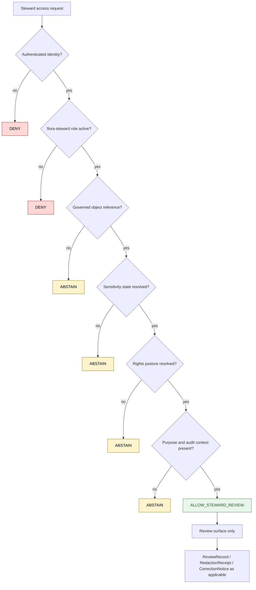

<!-- [KFM_META_BLOCK_V2]
doc_id: kfm://policy/access/flora-steward
title: Flora Steward Access Policy README
type: policy-readme
version: v0.1
status: draft
owners: OWNER_TBD — Access steward · Flora steward · Policy steward · Security steward · Docs steward
created: 2026-06-15
updated: 2026-06-15
policy_label: restricted
related:
  - ../../README.md
  - ../../sensitivity/flora/README.md
  - ../../../docs/domains/flora/RIGHTS_AND_SENSITIVITY.md
  - ../../../docs/doctrine/trust-membrane.md
  - ../../../docs/doctrine/directory-rules.md
  - ../../../docs/security/DATA_CLASSIFICATION.md
  - ../../../apps/governed-api/README.md
  - ../../../packages/policy-runtime/README.md
tags: [kfm, policy, access, flora, steward, sensitivity, geoprivacy, least-privilege, audit]
notes:
  - "Initial README for the flora-steward access-policy lane."
  - "This file documents access posture and review gates; it is not itself an access grant, credential, secret, or runtime policy bundle."
  - "Implementation depth is UNKNOWN until policy modules, fixtures, tests, identity provider mappings, and audit logs are inspected."
[/KFM_META_BLOCK_V2] -->

<a id="top"></a>

<div align="center">

# Flora Steward Access Policy

`policy/access/flora-steward/`

**Access-policy lane for Flora stewards who review sensitive Flora records, geoprivacy transforms, rights posture, release eligibility, corrections, and rollback requests.**


[Scope](#1-scope) · [Repo fit](#2-repo-fit) · [Inputs](#5-inputs) · [Exclusions](#6-exclusions) · [Decision model](#7-decision-model) · [Diagram](#8-diagram) · [Definition of done](#14-definition-of-done)

</div>

---

> [!IMPORTANT]
> **Status:** draft / `NEEDS VERIFICATION`  
> **Owners:** `OWNER_TBD` — Access steward · Flora steward · Policy steward · Security steward · Docs steward  
> **Path:** `policy/access/flora-steward/README.md`  
> **Responsibility root:** `policy/` — policy-as-code and policy documentation  
> **Truth posture:** CONFIRMED file path / PROPOSED policy-lane contract / UNKNOWN runtime enforcement

> [!CAUTION]
> Flora steward access is not public access. Steward access is a constrained review capability for authorized users, not permission to publish exact rare-plant locations, bypass sensitivity review, skip rights review, or expose unreleased records.

---

## Quick jump

- [1. Scope](#1-scope)
- [2. Repo fit](#2-repo-fit)
- [3. Policy boundary](#3-policy-boundary)
- [4. Default posture](#4-default-posture)
- [5. Inputs](#5-inputs)
- [6. Exclusions](#6-exclusions)
- [7. Decision model](#7-decision-model)
- [8. Diagram](#8-diagram)
- [9. Steward capability matrix](#9-steward-capability-matrix)
- [10. Required receipts and review records](#10-required-receipts-and-review-records)
- [11. Audit expectations](#11-audit-expectations)
- [12. Inspection path](#12-inspection-path)
- [13. Validation expectations](#13-validation-expectations)
- [14. Definition of done](#14-definition-of-done)
- [15. Open verification items](#15-open-verification-items)

---

## 1. Scope

`policy/access/flora-steward/` is the access-policy lane for Flora steward workflows.

It should describe and eventually bind the access checks that decide whether an authenticated steward may inspect, review, generalize, approve-for-review, correct, or recommend rollback for Flora records and derivatives.

In scope:

- steward role intent and least-privilege expectations
- access inputs and decision outcomes
- Flora-specific sensitivity and rights guardrails
- review-console or governed-API access posture
- audit, receipt, and review-record expectations
- fail-closed behavior when identity, role, sensitivity, rights, release, or evidence state is missing

Out of scope:

- source acquisition
- schema definitions
- release approval itself
- public publication decisions
- credential storage
- deployable app code
- exact sensitive-location disclosure outside governed review surfaces

[Back to top](#top)

---

## 2. Repo fit

| Concern | Owning root | Expected relationship |
|---|---|---|
| Access policy lane | `policy/access/flora-steward/` | This README; policy bundle location remains `NEEDS VERIFICATION` |
| Flora sensitivity policy | `policy/sensitivity/flora/` | Sensitivity and geoprivacy posture for Flora records |
| Flora rights / sensitivity explanation | `docs/domains/flora/RIGHTS_AND_SENSITIVITY.md` | Human-readable domain guidance |
| Runtime policy evaluation | `packages/policy-runtime/` or governed API policy runtime | Implementation home remains `NEEDS VERIFICATION` |
| Public API boundary | `apps/governed-api/` | Steward access should still route through governed interfaces |
| Receipts and proof records | `data/`, `schemas/contracts/v1/receipts/`, or verified receipt homes | Exact homes remain `NEEDS VERIFICATION` |
| Tests and fixtures | `tests/policy/`, `fixtures/policy/`, or verified equivalents | Required before promoting beyond draft |

> [!NOTE]
> The `policy/` root is the singular policy home in this repo. This README should not create parallel authority in `policies/`, docs-only policy, schema-only policy, or package-local policy.

## 3. Policy boundary

This lane may define access checks for the **flora steward role**, but it must not decide Flora truth, create EvidenceBundles, grant source rights, publish data, or downgrade sensitivity by itself.

Short rule:

```text
policy/access/flora-steward/ = who may use Flora steward review capabilities
policy/sensitivity/flora/    = what Flora sensitivity permits or denies
contracts/                   = object meaning
schemas/contracts/v1/         = machine-readable shape
release/                     = publication, correction, and rollback control
data/                        = lifecycle state, receipts, proofs, and artifacts
```

## 4. Default posture

Access decisions should fail closed.

A flora steward request should be denied or abstained when any of these are missing or unresolved:

- authenticated identity
- mapped steward role
- active steward authorization
- sensitivity tier
- rights posture
- evidence reference
- review context
- release or candidate state
- audit target
- purpose of access

## 5. Inputs

| Input family | Examples | Required posture |
|---|---|---|
| Subject | authenticated user ID, role claims, steward assignment | Verified by identity and access layer |
| Object | Flora record, layer, claim, candidate, transform request | Governed object reference, not raw public shortcut |
| Sensitivity state | tier, geoprivacy transform, redaction reason | Resolved by sensitivity policy or marked unknown |
| Rights state | license posture, attribution obligation, redistribution status | Resolved before public release |
| Evidence state | EvidenceRef, EvidenceBundle summary, source role | Present before consequential review |
| Review context | purpose, requested action, review ticket, steward note | Recorded and auditable |
| Release context | candidate, released, superseded, withdrawn, rollback requested | Explicit state, never inferred from file location alone |

## 6. Exclusions

| Does not belong here | Correct home |
|---|---|
| Credentials, secrets, tokens, private keys | Secret manager / deployment configuration, not repo docs |
| Flora source data | `data/` lifecycle roots |
| Exact sensitive-location public release rules | `policy/sensitivity/flora/` plus release policy |
| Contract meaning | `contracts/` |
| Machine-readable schemas | `schemas/contracts/v1/` |
| Public app pages or review-console implementation | `apps/` |
| Reusable policy runtime code | `packages/policy-runtime/` |
| Release manifests and rollback authority | `release/` |
| Source acquisition and connector jobs | `connectors/` or verified ingestion home |
| Human-only domain narrative | `docs/domains/flora/` |

## 7. Decision model

The lane should use finite, auditable outcomes.

| Outcome | Meaning | Public effect |
|---|---|---|
| `ALLOW_STEWARD_REVIEW` | Authorized steward may inspect the bounded review object | Review-only; not publication |
| `ALLOW_TRANSFORM_REVIEW` | Steward may review or propose a geoprivacy transform | Requires transform receipt before public release |
| `ALLOW_CORRECTION_REVIEW` | Steward may review a correction or supersession request | Requires correction notice / review record |
| `DENY` | Access is blocked by policy or missing prerequisites | No access |
| `ABSTAIN` | Policy cannot decide because required evidence is missing | No access until resolved |
| `ERROR` | Tool, runtime, schema, or policy evaluation failed | No access; record failure |

> [!IMPORTANT]
> `ALLOW_STEWARD_REVIEW` is not `PUBLISH`. It grants only the bounded ability to review or steward the object through governed surfaces.

## 8. Diagram



## 9. Steward capability matrix

| Capability | Flora steward posture | Notes |
|---|---|---|
| Inspect review candidate | Allowed only with active role, purpose, and audit context | Candidate state must be explicit |
| View exact sensitive location | Restricted review-only path; never public by default | Requires sensitivity state and steward justification |
| Propose geoprivacy transform | Allowed for review workflows | Does not publish the transformed output |
| Approve public release | Not granted by this access lane alone | Release gate remains separate |
| Edit source truth | Not granted here | Corrections require governed correction flow |
| Override rights failure | Not allowed | Rights unknown or restricted remains fail-closed |
| Export bulk sensitive records | Denied by default | Requires separate agreement and policy review |
| Create rollback recommendation | Allowed when correction/release context exists | Release rollback authority remains separate |

## 10. Required receipts and review records

Access decisions should leave auditable traces appropriate to the action.

| Action | Expected artifact | Status |
|---|---|---|
| Steward review | `ReviewRecord` or verified equivalent | NEEDS VERIFICATION |
| Geoprivacy transform review | `RedactionReceipt` or transform receipt | NEEDS VERIFICATION |
| Correction review | `CorrectionNotice` and review note | NEEDS VERIFICATION |
| Rollback recommendation | rollback target and steward note | NEEDS VERIFICATION |
| Denied access | access denial reason and audit event | NEEDS VERIFICATION |
| Abstained access | missing-field reason and remediation target | NEEDS VERIFICATION |

## 11. Audit expectations

Every consequential flora-steward access decision should record:

- subject identity reference
- steward role reference
- object reference
- requested action
- decision outcome
- reason code
- sensitivity tier considered
- rights posture considered
- evidence reference considered
- timestamp
- policy bundle or version reference when available
- review or ticket reference when available

> [!WARNING]
> Audit records should preserve accountability without exposing sensitive coordinates, secrets, or unnecessary living-person information in logs or public artifacts.

## 12. Inspection path

Policy language, runtime, fixtures, and tests are `NEEDS VERIFICATION`. Use these local inspection commands before treating this lane as implemented.

```bash
# From the repository root, inspect this policy lane.
find policy/access/flora-steward -maxdepth 3 -type f | sort

# Inspect neighboring policy lanes.
find policy -maxdepth 4 -type f | sort

# Inspect likely tests and fixtures for policy access.
find tests fixtures -maxdepth 5 -type f 2>/dev/null | grep -E 'policy|flora|access' | sort
```

## 13. Validation expectations

Useful validation for this lane should cover:

- unauthenticated request returns `DENY`
- authenticated non-steward returns `DENY`
- steward with missing object reference returns `ABSTAIN`
- steward with unresolved sensitivity returns `ABSTAIN`
- steward with unresolved rights returns `ABSTAIN`
- steward review does not equal release approval
- exact sensitive-location access is review-only and audited
- denied and abstained decisions include reason codes
- public UI cannot invoke steward-only capability
- emergency or admin override, if ever introduced, is documented, constrained, audited, and not the normal path

## 14. Definition of done

- [ ] Owners are confirmed and `OWNER_TBD` is replaced.
- [ ] Runtime policy language and bundle location are confirmed.
- [ ] Identity provider role mapping for `flora-steward` is documented or linked.
- [ ] Decision outcomes are represented in policy fixtures.
- [ ] Tests cover `ALLOW_STEWARD_REVIEW`, `DENY`, `ABSTAIN`, and `ERROR` paths.
- [ ] Sensitivity integration with `policy/sensitivity/flora/` is verified.
- [ ] Rights integration is verified.
- [ ] Audit event shape is documented or linked.
- [ ] Review surfaces are confirmed to use governed interfaces only.
- [ ] Release approval remains separate from steward access.
- [ ] Rollback target is documented for policy changes.

## 15. Open verification items

| Item | Why it matters |
|---|---|
| Confirm access-policy runtime language | Prevents writing non-runnable policy snippets |
| Confirm identity and role claim names | Prevents mismatched authorization logic |
| Confirm whether `flora-steward` is an accepted role slug | Prevents role drift |
| Confirm policy bundle packaging | Required for runtime enforcement |
| Confirm tests and fixtures | Required before promotion beyond draft |
| Confirm audit event schema | Required for reviewability and incident response |
| Confirm relation to review console | Prevents steward access from becoming a public path |
| Confirm emergency/admin override posture | Ensures any shortcut is constrained and audited |

<details>
<summary>Appendix A — illustrative policy input shape</summary>

This example is illustrative. It shows the kind of data a policy evaluator might need; it is not a verified schema.

```json
{
  "subject": {
    "user_id": "USER_ID_TBD",
    "roles": ["flora-steward"],
    "active": true
  },
  "action": "review_flora_candidate",
  "object": {
    "id": "OBJECT_ID_TBD",
    "type": "RarePlantRecord",
    "sensitivity_tier": "T4",
    "release_state": "candidate"
  },
  "context": {
    "purpose": "sensitivity_review",
    "evidence_ref": "EVIDENCE_REF_TBD",
    "rights_status": "cleared",
    "ticket_ref": "REVIEW_TICKET_TBD"
  }
}
```

</details>

<details>
<summary>Appendix B — no-loss preservation note</summary>

The target file was an empty placeholder. This README adds a bounded policy-lane contract without claiming runtime enforcement, tests, identity-provider mappings, or production readiness.

The document intentionally keeps steward access separate from public release, sensitivity downgrades, rights clearance, schema authority, release authority, and source truth.

</details>

## Status summary

`policy/access/flora-steward/` should define the access-policy boundary for Flora steward review capabilities.

It should enable constrained, audited steward review while preserving fail-closed sensitivity, rights, evidence, release, correction, and public-access controls.

<p align="right"><a href="#top">Back to top</a></p>
