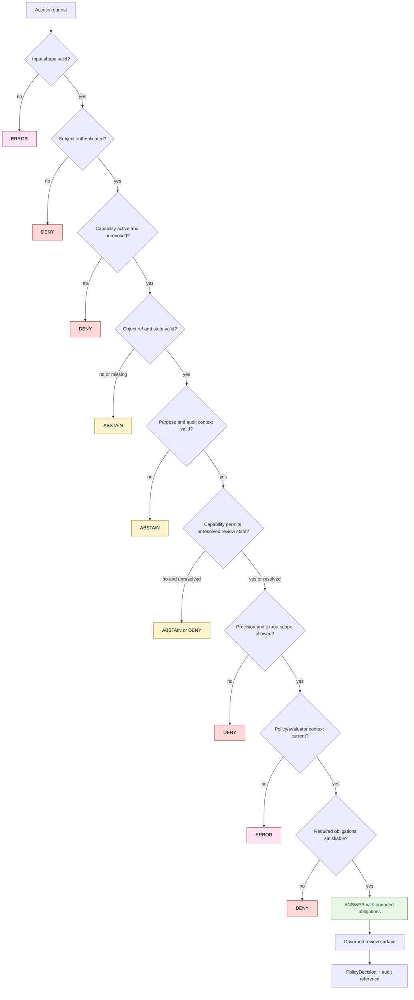

<!-- [KFM_META_BLOCK_V2]
doc_id: kfm://policy/access/flora-steward
title: Flora Steward Access Policy README
type: policy-readme
version: v0.2
status: draft
owners: OWNER_TBD — Access steward · Flora steward · Policy steward · Sensitivity reviewer · Rights reviewer · Security steward · Docs steward
created: 2026-06-15
updated: 2026-07-14
policy_label: restricted
supersedes: v0.1 (2026-06-15)
related:
  - ../README.md
  - ../../README.md
  - ../../sensitivity/flora/README.md
  - ../../../contracts/policy/policy_input_bundle.md
  - ../../../contracts/policy/policy_decision.md
  - ../../../schemas/contracts/v1/policy/policy_input_bundle.schema.json
  - ../../../schemas/contracts/v1/policy/policy_decision.schema.json
  - ../../../docs/domains/flora/RIGHTS_AND_SENSITIVITY.md
  - ../../../docs/domains/flora/PUBLICATION_AND_ROLLBACK.md
  - ../../../docs/doctrine/trust-membrane.md
  - ../../../docs/doctrine/directory-rules.md
  - ../../../docs/security/DATA_CLASSIFICATION.md
  - ../../../apps/governed-api/README.md
  - ../../../packages/policy-runtime/README.md
tags: [kfm, policy, access, flora, steward, sensitivity, geoprivacy, least-privilege, audit, separation-of-duties, deny-by-default]
notes:
  - "v0.2 aligns this lane with the repository PolicyInputBundle and PolicyDecision contracts."
  - "The canonical access decision vocabulary is ANSWER | ABSTAIN | DENY | ERROR; bounded steward capabilities are expressed as ANSWER obligations, not as a custom publication-like allow outcome."
  - "This file documents access posture and review gates; it is not an access grant, credential, secret, executable policy bundle, sensitivity decision, rights clearance, or release approval."
  - "Runtime enforcement, identity-provider mappings, policy bundle wiring, fixtures, tests, audit sinks, and privileged review surfaces remain NEEDS VERIFICATION."
[/KFM_META_BLOCK_V2] -->

<a id="top"></a>

<div align="center">

# Flora Steward Access Policy

`policy/access/flora-steward/`

**Least-privilege access policy for authorized Flora stewards who inspect restricted review objects, resolve sensitivity and rights questions, review geoprivacy transforms, assess corrections, and recommend rollback through governed surfaces.**


[Scope](#1-scope) · [Authority boundary](#3-authority-boundary) · [Capabilities](#8-capability-model) · [Decision contract](#10-decision-contract) · [Audit](#14-audit-and-data-minimization) · [Validation](#18-validation-and-acceptance-matrix) · [Definition of done](#21-definition-of-done)

</div>

---

> [!IMPORTANT]
> **Status:** draft / `NEEDS VERIFICATION` for runtime enforcement
> **Owners:** `OWNER_TBD` — Access steward · Flora steward · Policy steward · Sensitivity reviewer · Rights reviewer · Security steward · Docs steward
> **Path:** `policy/access/flora-steward/README.md`
> **Responsibility root:** `policy/` — admissibility and access-control policy
> **Truth posture:** CONFIRMED repository/document relationships · PROPOSED Flora-steward access contract · UNKNOWN deployed identity, authorization, audit, and review-surface behavior

> [!CAUTION]
> **Flora steward access is not public access and is not release authority.** It grants only a bounded, purpose-bound review capability. It must not publish exact rare-plant locations, downgrade sensitivity, clear rights, approve a release, mutate source truth, bypass evidence closure, expose lifecycle stores to public clients, or turn an administrator shortcut into the normal path.

> [!NOTE]
> Fail-closed access does **not** mean stewards can never inspect an unresolved record. A steward may receive a bounded review view specifically to resolve an unknown rights or sensitivity state when the capability, purpose, object scope, audit context, and obligations explicitly permit that review. The unresolved state remains unresolved; access to investigate it is not clearance and does not make the object publishable.

---

## Quick jump

- [1. Scope](#1-scope)
- [2. Evidence basis and current verification boundary](#2-evidence-basis-and-current-verification-boundary)
- [3. Authority boundary](#3-authority-boundary)
- [4. Operating invariants](#4-operating-invariants)
- [5. Default posture](#5-default-posture)
- [6. Actors and separation of duties](#6-actors-and-separation-of-duties)
- [7. Access object and context](#7-access-object-and-context)
- [8. Capability model](#8-capability-model)
- [9. Evaluation order](#9-evaluation-order)
- [10. Decision contract](#10-decision-contract)
- [11. Reason-code vocabulary](#11-reason-code-vocabulary)
- [12. Obligations](#12-obligations)
- [13. Sensitivity, rights, evidence, and release-state handling](#13-sensitivity-rights-evidence-and-release-state-handling)
- [14. Audit and data minimization](#14-audit-and-data-minimization)
- [15. Revocation, freshness, and caching](#15-revocation-freshness-and-caching)
- [16. Threat model and abuse resistance](#16-threat-model-and-abuse-resistance)
- [17. Break-glass and administrator posture](#17-break-glass-and-administrator-posture)
- [18. Validation and acceptance matrix](#18-validation-and-acceptance-matrix)
- [19. Repository inspection path](#19-repository-inspection-path)
- [20. Implementation sequence](#20-implementation-sequence)
- [21. Definition of done](#21-definition-of-done)
- [22. Open verification register](#22-open-verification-register)
- [Appendix A — illustrative PolicyInputBundle](#appendix-a-illustrative-policyinputbundle)
- [Appendix B — illustrative PolicyDecision](#appendix-b-illustrative-policydecision)
- [Appendix C — v0.1 to v0.2 preservation and correction note](#appendix-c-v01-to-v02-preservation-and-correction-note)

---

## 1. Scope

`policy/access/flora-steward/` is the access-policy lane for Flora steward review capabilities.

It should define the policy conditions under which an authenticated, currently authorized steward may perform a specific action on a bounded Flora review object through a governed interface.

### In scope

- Flora-steward capability names and scope constraints;
- authentication, authorization, purpose, and audit prerequisites;
- review access to restricted Flora records and candidates;
- exact-location review controls for rare, protected, or culturally sensitive plants;
- review of geoprivacy or redaction transforms;
- correction, supersession, withdrawal, and rollback-review capabilities;
- policy inputs, finite outcomes, reason codes, and obligations;
- least privilege, separation of duties, revocation, freshness, and anti-bulk-extraction controls;
- audit-event requirements that do not leak sensitive content;
- fail-closed behavior for missing, stale, ambiguous, unsupported, or errored context.

### Out of scope

- credential, token, key, or secret storage;
- identity-provider administration;
- Flora source acquisition or connector behavior;
- Flora object semantics or schema authority;
- assigning or changing sensitivity tiers;
- clearing source rights or licenses;
- creating or resolving an `EvidenceBundle`;
- approving publication or issuing a `ReleaseManifest`;
- editing canonical source truth outside governed correction workflows;
- public application routes or direct lifecycle-store access;
- executable policy-runtime implementation;
- bulk export agreements or partner-access contracts.

[Back to top](#top)

---

## 2. Evidence basis and current verification boundary

This README is grounded in the repository state inspected for this revision and keeps implementation claims bounded.

| Evidence | Current-session status | What it supports |
|---|---|---|
| `policy/README.md` | CONFIRMED | `policy/` is the singular policy authority root. |
| `policy/access/README.md` | CONFIRMED | Parent lane owns role and bounded-capability access posture; access is not release authority. |
| `policy/access/flora-steward/README.md` v0.1 | CONFIRMED | Existing strong Flora-specific scope, fail-closed posture, capability matrix, audit expectations, and preservation boundary. |
| `contracts/policy/policy_input_bundle.md` | CONFIRMED | Policy evaluation consumes explicit operation, audience, object, evidence, source, rights, sensitivity, lifecycle, release, review, and evaluator context. |
| `contracts/policy/policy_decision.md` | CONFIRMED | Canonical policy outcome vocabulary is `ANSWER | ABSTAIN | DENY | ERROR`; `policy_family` includes `access`. |
| Paired policy schemas | CONFIRMED present; maturity mixed | `PolicyDecision` has a concrete finite schema; `PolicyInputBundle` remains a permissive greenfield placeholder beyond required `id`. |
| `packages/policy-runtime/README.md` | CONFIRMED document; implementation UNKNOWN | Runtime helpers may execute approved policy bundles and return finite, receipt-ready metadata; they are not policy authority. |
| `docs/domains/flora/RIGHTS_AND_SENSITIVITY.md` | CONFIRMED document | Rare-plant exact locations fail closed publicly; rights and sensitivity are distinct gates; review does not equal release. |
| `policy/sensitivity/flora/README.md` | CONFIRMED scaffold | The sensitivity-policy lane exists as a scaffold and is not yet evidence of implemented Flora sensitivity policy. |
| `docs/doctrine/directory-rules.md` | CONFIRMED doctrine | `policy/` owns admissibility; contracts, schemas, tests, fixtures, data, apps, and release remain separate responsibility roots. |
| `docs/registers/DRIFT_REGISTER.md` | CONFIRMED | No Flora-steward-specific placement conflict was recorded in the inspected register. |

### Current verification boundary

**CONFIRMED:** the target path and the related documentation/contract surfaces above exist in the inspected repository state.

**PROPOSED:** capability identifiers, reason codes, obligations, evaluation order, audit fields, freshness rules, and acceptance tests in this README.

**UNKNOWN / NEEDS VERIFICATION:** deployed authentication, role mappings, policy bundle language, runtime imports, policy evaluator wiring, review-console behavior, exact-location reveal controls, audit sink, decision receipts, fixtures, tests, CI enforcement, authorization revocation latency, and production incident response.

[Back to top](#top)

---

## 3. Authority boundary

This lane decides **who may attempt a bounded Flora steward action under explicit context**. It does not decide Flora truth, rights clearance, sensitivity disposition, evidence closure, or release.

```text
policy/access/flora-steward/       = who may perform a bounded Flora steward capability
policy/sensitivity/flora/          = what sensitivity permits, restricts, generalizes, or denies
policy/domains/flora/rights/       = Flora rights/admissibility policy when implemented
contracts/policy/                  = semantic meaning of policy inputs and decisions
schemas/contracts/v1/policy/       = machine-readable policy shapes
packages/policy-runtime/           = reusable policy evaluation helpers
apps/governed-api/                 = governed transport and enforcement boundary
apps/review-console/               = steward review surface, if confirmed and governed
release/                           = promotion, publication, correction, withdrawal, rollback authority
data/                              = lifecycle state, receipts, proofs, registries, artifacts
```

### Non-collapse rules

1. An access `ANSWER` is not a release approval.
2. A steward review note is not an `EvidenceBundle`.
3. Viewing exact coordinates for an authorized review does not make those coordinates public-safe.
4. A proposed geoprivacy transform is not a completed `RedactionReceipt`.
5. A rights-review capability does not clear rights.
6. A correction recommendation does not mutate canonical truth or withdraw a release.
7. A rollback recommendation does not execute rollback.
8. A role claim does not create policy authority; it is one input to evaluation.
9. Administrator status does not imply unrestricted Flora access.
10. Generated language, UI state, map state, and operator memory are not authorization inputs unless represented in governed, explicit context.

[Back to top](#top)

---

## 4. Operating invariants

This lane must preserve the KFM lifecycle and trust membrane:

```text
RAW -> WORK / QUARANTINE -> PROCESSED -> CATALOG / TRIPLET -> PUBLISHED
```

| Invariant | Flora-steward access consequence |
|---|---|
| Public clients use governed interfaces | Public clients cannot call steward-only capabilities or read restricted stores directly. |
| Cite or abstain | Consequential review views should include resolvable evidence context or explicitly state what is missing. |
| Policy-aware / fail-safe | Missing or invalid authorization context never becomes implicit access. |
| Explicit source role | Steward review must not collapse authoritative, corroborating, contextual, modeled, or restricted sources. |
| Promotion is governed | Steward access cannot promote or publish by itself. |
| Corrections are first-class | Correction and rollback recommendations must reference the affected object/release and preserve lineage. |
| Reversible change | Policy changes require versioning, tests, and a rollback target. |
| Auditability | Consequential access decisions produce a policy decision and an audit reference without leaking protected content. |
| Separation of duties | Access review, sensitivity/rights disposition, evidence resolution, and release authority remain distinct roles or gates. |

[Back to top](#top)

---

## 5. Default posture

The default posture is **no privileged Flora steward action without an explicit, current, capability-specific policy decision**.

A request must fail closed when any required input is missing, malformed, stale, unsupported, inconsistent, or cannot be evaluated safely.

### Required baseline context

- authenticated subject reference;
- current steward assignment or capability binding;
- authorization validity window or revocation state;
- requested capability;
- bounded object reference and object type;
- lifecycle and release/review state;
- purpose and ticket/review reference;
- evidence status or explicit unresolved-evidence state;
- rights status or explicit rights-resolution workflow;
- sensitivity tier/status or explicit sensitivity-resolution workflow;
- policy bundle id/version/hash when runtime exists;
- evaluator profile/version when runtime exists;
- audit correlation target;
- requested precision, export mode, and audience when relevant.

### Missing vs. unresolved

- **Missing:** the gate has no reliable value or reference. Typical outcome: `ABSTAIN` or `ERROR`.
- **Unresolved:** the state is explicitly represented as unknown/restricted/pending and the requested capability exists to resolve it. A bounded review may return `ANSWER` with obligations.
- **Blocked:** policy explicitly forbids the action. Outcome: `DENY`.

This distinction prevents two unsafe extremes: guessing missing policy facts, and preventing stewards from reviewing the very unresolved records they are assigned to resolve.

[Back to top](#top)

---

## 6. Actors and separation of duties

| Actor / role | May do | Must not do through this lane |
|---|---|---|
| Access steward | Maintain access-policy intent, reason codes, capability boundaries, and policy review | Clear Flora rights, assign sensitivity, or approve public release alone |
| Flora steward | Review Flora domain records, transform proposals, corrections, and rollback recommendations within scope | Publish, bypass rights/sensitivity gates, or edit source truth directly |
| Sensitivity reviewer | Decide or confirm sensitivity disposition and required transform | Grant broad role access or approve release alone |
| Rights reviewer | Resolve terms, license, attribution, redistribution, embargo, and agreement posture | Treat technical availability as rights clearance |
| Evidence steward | Resolve or validate evidence references/bundles | Grant privileged access solely because evidence is strong |
| Release steward | Approve, reject, correct, withdraw, or roll back a release under release governance | Use access role as substitute for release proof |
| Security steward | Review threat posture, audit leakage, role abuse, revocation, and incident controls | Override policy silently |
| Governed API / policy runtime | Evaluate explicit inputs and enforce obligations | Fetch hidden facts, invent missing context, or become policy authority |
| Public client | Consume released, public-safe products | Invoke steward capabilities or request exact restricted geometry |

### Separation rule

No single Flora-steward access decision should simultaneously:

1. grant privileged review access;
2. clear rights or sensitivity;
3. approve the reviewed transform;
4. approve publication; and
5. execute release or rollback.

Where project maturity permits, policy-significant review and release duties should be held by separate actors or separately auditable gates.

[Back to top](#top)

---

## 7. Access object and context

A Flora-steward access request should be evaluated against a **reference-based review object**, not a raw record copied into policy input.

| Context family | Examples | Required handling |
|---|---|---|
| Subject | stable user/service reference, verified claims, assignment ref | Verify through the identity/access layer; do not trust client-supplied role strings alone. |
| Capability | `flora.review_candidate`, `flora.review_exact_location`, transform/correction/rollback review | One explicit action; no broad “Flora admin” permission. |
| Object | record, candidate, claim, layer, transform request, correction request, release ref | Use governed refs; keep raw sensitive values outside routine policy logs. |
| Object state | lifecycle phase, candidate/released/superseded/withdrawn state, review state | Explicit; never infer release from a file path. |
| Purpose | sensitivity review, rights review, transform review, correction review, rollback review | Must be compatible with the capability and current task. |
| Evidence | `EvidenceRef`, `EvidenceBundle` ref/status, citation/freshness state | Resolved or explicitly unresolved for a permitted resolution workflow. |
| Rights | cleared, restricted, unknown, embargoed, agreement-bound | Unknown may be reviewed only through a rights-resolution capability; never public-exported. |
| Sensitivity | tier, exact/generalized/withheld geometry state, transform ref | Exact restricted geometry requires a separate capability and additional obligations. |
| Audience | steward, sensitivity reviewer, rights reviewer, release reviewer | Public is never a valid audience for steward-only objects. |
| Evaluator | policy bundle/version/hash, evaluator version, evaluation time | Required for replay once runtime is implemented. |
| Audit | correlation id, ticket/review ref, request channel | Required before consequential access. |

[Back to top](#top)

---

## 8. Capability model

Capability identifiers below are **PROPOSED**. Confirm the repository-wide naming grammar and identity-provider claim model before implementation.

| Proposed capability | Bounded purpose | Typical permitted object | Minimum extra obligations |
|---|---|---|---|
| `flora.review_candidate` | Inspect a Flora candidate for evidence, source role, rights, sensitivity, or quality review | Candidate record or claim ref | `review_only`, `record_audit_event` |
| `flora.review_exact_location` | Inspect exact restricted geometry only when necessary for named stewardship work | T2–T4 review object ref | `withhold_exact_location_from_public_surfaces`, `no_bulk_export`, `record_exact_location_access` |
| `flora.propose_geoprivacy_transform` | Create or review a proposed generalization/redaction plan | Transform request and source object refs | `require_redaction_receipt_before_release`, `require_separate_transform_approval` |
| `flora.review_rights` | Resolve an explicitly unknown/restricted rights posture | Source/record/right-state refs | `no_public_export`, `attach_rights_review_record` |
| `flora.review_sensitivity` | Resolve or confirm sensitivity disposition | Record/taxon/location refs | `require_sensitivity_review_record`, `no_public_release` |
| `flora.review_correction` | Review correction, supersession, or withdrawal request | Correction candidate and affected object refs | `preserve_lineage`, `require_correction_notice` |
| `flora.recommend_rollback` | Recommend rollback for a released Flora artifact | Release ref and rollback target | `release_steward_approval_required`, `preserve_rollback_evidence` |

### Explicitly absent capabilities

This lane must not define or imply:

- `flora.publish`;
- `flora.override_rights`;
- `flora.downgrade_sensitivity_without_review`;
- `flora.edit_raw_source`;
- `flora.bulk_export_sensitive`;
- `flora.disable_audit`;
- `flora.bypass_release_gate`;
- `flora.admin_all`.

[Back to top](#top)

---

## 9. Evaluation order

A deterministic evaluation order reduces ambiguous outcomes and makes tests/replay possible.



### Evaluation notes

1. Shape/integrity failures remain `ERROR`; they must not be disguised as `DENY`.
2. Authentication/capability failures are `DENY`.
3. Missing policy-relevant context generally yields `ABSTAIN`.
4. Explicit policy prohibitions, invalid audience/precision, or unsatisfied mandatory obligations yield `DENY`.
5. An unresolved rights/sensitivity/evidence state may still be reviewable only when the capability and purpose explicitly exist to resolve that state.
6. The final `ANSWER` is operation-specific and obligation-bound.

[Back to top](#top)

---

## 10. Decision contract

The repository `PolicyDecision` contract and paired schema define the canonical finite outcome vocabulary:

```text
ANSWER | ABSTAIN | DENY | ERROR
```

For this lane:

```text
policy_family = access
```

### Corrected v0.2 mapping

The v0.1 README used custom outcomes such as `ALLOW_STEWARD_REVIEW`. v0.2 corrects that drift:

| Engine/capability concept | Canonical `PolicyDecision.outcome` | Representation |
|---|---|---|
| Bounded steward action permitted | `ANSWER` | Capability and scope remain in the input/context; constraints appear in `obligations`. |
| Required support missing or unresolved outside an allowed resolution workflow | `ABSTAIN` | `reasons` identify missing support without leaking sensitive details. |
| Policy blocks the action | `DENY` | `reasons` identify the safe denial category. |
| Input, evaluator, policy bundle, integrity, timeout, or wiring failure | `ERROR` | Preserve process-failure detail in restricted logs/receipts. |

> [!IMPORTANT]
> `ANSWER` means only that the evaluated steward action may proceed under the listed obligations. It is not evidence closure, sensitivity clearance, rights clearance, transform approval, release approval, publication, correction execution, or rollback execution.

### Minimum decision fields

The current paired schema requires:

- `decision_id`;
- `outcome`;
- `policy_family`;
- `reasons`;
- `obligations`;
- `evaluated_at`.

The access lane should additionally preserve, through a receipt/audit linkage rather than unapproved schema drift:

- policy input id/hash;
- subject and capability references;
- object reference;
- policy bundle id/hash/version;
- evaluator version;
- audit correlation id;
- superseded decision reference when reevaluated.

[Back to top](#top)

---

## 11. Reason-code vocabulary

The codes below are **PROPOSED**. They should be centralized and tested before runtime use. Public messages may be less specific than internal reason codes.

| Proposed reason code | Typical outcome | Meaning |
|---|---|---|
| `ACCESS_INPUT_INVALID` | `ERROR` | Policy input failed shape or integrity validation. |
| `ACCESS_SUBJECT_UNAUTHENTICATED` | `DENY` | No verified authenticated subject. |
| `ACCESS_CAPABILITY_INACTIVE` | `DENY` | Required capability is absent, expired, revoked, or out of scope. |
| `ACCESS_OBJECT_MISSING` | `ABSTAIN` | Governed object reference is absent or unresolved. |
| `ACCESS_OBJECT_STATE_UNSUPPORTED` | `DENY` | Capability does not apply to the object's lifecycle/release state. |
| `ACCESS_PURPOSE_MISSING` | `ABSTAIN` | Purpose or review task is absent. |
| `ACCESS_AUDIT_CONTEXT_MISSING` | `ABSTAIN` | No safe audit correlation target exists. |
| `ACCESS_EVIDENCE_CONTEXT_MISSING` | `ABSTAIN` | Evidence state is absent for a consequential review. |
| `ACCESS_RIGHTS_CONTEXT_MISSING` | `ABSTAIN` | Rights state is absent rather than explicitly unresolved. |
| `ACCESS_SENSITIVITY_CONTEXT_MISSING` | `ABSTAIN` | Sensitivity state is absent rather than explicitly unresolved. |
| `ACCESS_RESOLUTION_WORKFLOW_MISMATCH` | `DENY` | Unresolved state is present but requested capability/purpose cannot resolve it. |
| `ACCESS_EXACT_LOCATION_RESTRICTED` | `DENY` | Exact geometry requested without the exact-location review capability or justification. |
| `ACCESS_BULK_EXPORT_DENIED` | `DENY` | Sensitive or restricted bulk extraction is not authorized. |
| `ACCESS_OBLIGATION_UNSATISFIED` | `DENY` | A mandatory review, redaction, audit, or display obligation cannot be enforced. |
| `ACCESS_POLICY_STALE` | `ERROR` | Policy bundle/evaluator context is missing, stale, or unverifiable. |
| `ACCESS_AUDIT_SINK_UNAVAILABLE` | `ERROR` | Consequential access cannot be safely audited. |
| `ACCESS_EVALUATOR_ERROR` | `ERROR` | Policy runtime failed or timed out. |
| `ACCESS_GRANTED_REVIEW_ONLY` | `ANSWER` | Bounded steward review may proceed under obligations. |

### Safe-message rule

Internal reason codes must not expose exact coordinates, rare taxon identity, private agreement details, secret role mappings, or unreleased source content in public or low-trust errors.

[Back to top](#top)

---

## 12. Obligations

Obligations are mandatory downstream duties attached to an `ANSWER`. A caller that cannot enforce them must fail closed.

| Proposed obligation | Required behavior |
|---|---|
| `review_only` | Prevent publication, download-to-public, or mutation outside the review workflow. |
| `record_audit_event` | Emit a policy/audit reference before or atomically with access. |
| `withhold_exact_location_from_public_surfaces` | Never copy exact restricted geometry into public UI, export, logs, or notifications. |
| `record_exact_location_access` | Record that exact-location access occurred without logging the coordinates themselves. |
| `no_bulk_export` | Disable bulk download, copy-all, unrestricted API pagination, or equivalent extraction. |
| `require_redaction_receipt_before_release` | Any public-safe derivative requires a verified transform/redaction receipt. |
| `require_separate_transform_approval` | Proposer and approver should be separated where maturity permits. |
| `require_sensitivity_review_record` | Sensitivity disposition must be recorded outside the access decision. |
| `attach_rights_review_record` | Rights resolution must be recorded by the rights workflow. |
| `require_correction_notice` | Correction/supersession action requires the governed correction artifact. |
| `release_steward_approval_required` | Rollback or publication action remains blocked pending release authority. |
| `preserve_lineage` | Keep prior object/release/decision refs and supersession chain. |
| `revalidate_on_policy_change` | Cached authorization cannot survive a relevant policy version change. |
| `revalidate_before_export` | A later export requires a new policy evaluation; a prior screen-view decision is insufficient. |

### Obligation enforcement

The governed API/review surface should reject or terminate the action when it cannot enforce an obligation. Obligation failure is not a warning-only state.

[Back to top](#top)

---

## 13. Sensitivity, rights, evidence, and release-state handling

These are distinct policy inputs with distinct owners.

### 13.1 Sensitivity

- Exact rare, protected, or culturally sensitive plant locations are denied on public surfaces by default.
- Exact-location review requires a dedicated capability, explicit purpose, bounded object scope, and additional obligations.
- Access policy consumes sensitivity state; it does not assign or downgrade the tier.
- Generalization/redaction proposals remain candidates until reviewed and receipted.

### 13.2 Rights

- Technical accessibility is not rights clearance.
- A rights reviewer may receive bounded access to resolve an explicitly unknown or restricted rights posture.
- Unknown rights never permit public export or release.
- Access policy consumes rights state; it does not issue the clearance.

### 13.3 Evidence

- Consequential review should include evidence references/status sufficient to understand the review object.
- A missing evidence reference normally yields `ABSTAIN`.
- An explicitly unresolved evidence state may be reviewable only through an evidence-resolution-compatible task.
- Access policy does not create or certify an `EvidenceBundle`.

### 13.4 Release and lifecycle state

- Candidate, released, superseded, withdrawn, and rollback-requested states must be explicit.
- A steward may review released material for correction or rollback but cannot withdraw it through this lane.
- Access to a released public-safe derivative does not imply access to its restricted source geometry.
- File location alone never proves release state.

### 13.5 Join-induced sensitivity

A seemingly public Flora record can become sensitive when joined with land ownership, precise parcel boundaries, field notes, cultural context, or other restricted data. The review surface and policy input must carry join-induced sensitivity flags when relevant.

[Back to top](#top)

---

## 14. Audit and data minimization

Every consequential Flora-steward access decision should be auditable while minimizing sensitive data exposure.

### Minimum audit reference set

- decision id;
- policy input id/hash;
- subject reference or privacy-preserving identifier;
- capability evaluated;
- object reference;
- purpose/review ticket reference;
- outcome;
- reason codes;
- obligations;
- policy bundle id/hash/version when available;
- evaluator version when available;
- evaluation timestamp;
- authorization assignment/revocation version or reference when available;
- request channel;
- superseded decision reference when applicable.

### Must not be written to ordinary audit logs

- exact rare-plant coordinates;
- complete restricted Flora records;
- source credentials or secret claims;
- unnecessary living-person information;
- full private agreements;
- unredacted review attachments;
- generated hidden reasoning;
- raw policy tokens or identity-provider assertions beyond what is needed for accountability.

### Split-detail posture

Where investigation requires sensitive detail, use a restricted evidence/audit reference with a safer summary in ordinary logs. Do not duplicate sensitive content across every receipt, error, and dashboard.

### Audit failure

If the action requires an audit record and the audit path is unavailable or cannot protect sensitive information, return `ERROR` and block the action.

[Back to top](#top)

---

## 15. Revocation, freshness, and caching

Privileged review access is time- and context-sensitive.

### Required posture

- Capability assignments should be revocable.
- Revocation must apply to future evaluations and invalidate reusable authorization state within a bounded, documented interval.
- Policy decisions are immutable evaluation records; reevaluation creates a new decision.
- A decision should not be reused after a relevant change to subject authorization, capability scope, object state, sensitivity state, rights state, release state, policy bundle, evaluator version, or obligation enforcement.
- Exact-location access should use shorter-lived authorization than ordinary review where practical.
- Export, bulk traversal, correction submission, transform approval, and rollback recommendation should each receive a fresh operation-specific evaluation.
- Browser-local state must not become durable authorization authority.

### Cache key inputs

Any authorization cache, if admitted, should include at least:

- subject/capability assignment version;
- capability;
- object id and object-state version;
- requested precision/audience/export mode;
- policy bundle hash/version;
- sensitivity/rights/release state versions;
- obligation profile;
- expiration time.

A cache miss or stale cache entry must not become implicit access.

[Back to top](#top)

---

## 16. Threat model and abuse resistance

| Threat / failure mode | Required defense |
|---|---|
| Spoofed role claim | Verify claims through trusted identity/access integration; never trust arbitrary request JSON. |
| Confused deputy | Bind capability, object, purpose, audience, and ticket; reject generic delegated access. |
| Stale authorization | Check revocation/freshness; include assignment and policy versions in evaluation context. |
| Exact-location overexposure | Separate capability; limit display; block public copy/export; record access without coordinates. |
| Bulk extraction by repeated review calls | Rate/volume controls, no-bulk-export obligation, bounded pagination, anomaly monitoring. |
| Sensitivity downgrade through access lane | Access consumes disposition; it cannot change the tier. |
| Rights bypass | Unknown/restricted rights remain non-public; access to review is not clearance. |
| Release conflation | `ANSWER` never equals publish; release gate remains separate. |
| Hidden fetches | `PolicyInputBundle` must be explicit; runtime must not silently fetch missing facts. |
| Log/receipt leakage | Reference sensitive data; do not embed coordinates or full records in ordinary audit artifacts. |
| UI-only enforcement | Enforce in governed API/policy runtime; UI controls are defense-in-depth, not authority. |
| Policy drift | Pin bundle/version/hash; test reason codes and obligations; revalidate after policy change. |
| Evaluator failure converted to allow | Preserve `ERROR`; fail closed. |
| Cross-object access expansion | Bind decisions to object/action/scope; do not reuse a decision for unrelated records. |
| Prompt or generated-text injection | Treat record text, attachments, and generated summaries as data, not authorization instructions. |

[Back to top](#top)

---

## 17. Break-glass and administrator posture

No break-glass or unrestricted administrator capability is confirmed for this lane.

### Default

```text
No emergency/admin bypass is available through policy/access/flora-steward/.
```

### If introduced later

A break-glass path requires a separate, reviewed design and must not be smuggled into ordinary role logic. At minimum it should be:

- explicitly authorized by accepted policy/ADR or equivalent governance;
- limited to a named incident and purpose;
- time-bounded and automatically expiring;
- subject to dual approval where feasible;
- incapable of public release or bulk export by itself;
- fully audited with post-event review;
- protected from logging sensitive content;
- separately tested, monitored, and revocable;
- visibly excluded from normal public and steward workflows.

An administrator role alone must not imply exact-location access.

[Back to top](#top)

---

## 18. Validation and acceptance matrix

The matrix below is the minimum recommended no-network policy test set. Current implementation status remains `NEEDS VERIFICATION`.

| Test case | Expected outcome | Required reason / obligation | Status |
|---|---|---|---|
| Invalid PolicyInputBundle shape | `ERROR` | `ACCESS_INPUT_INVALID` | NOT RUN |
| Unauthenticated subject | `DENY` | `ACCESS_SUBJECT_UNAUTHENTICATED` | NOT RUN |
| Authenticated subject without active Flora capability | `DENY` | `ACCESS_CAPABILITY_INACTIVE` | NOT RUN |
| Revoked or expired assignment | `DENY` | `ACCESS_CAPABILITY_INACTIVE` | NOT RUN |
| Missing governed object ref | `ABSTAIN` | `ACCESS_OBJECT_MISSING` | NOT RUN |
| Unsupported object/lifecycle state | `DENY` | `ACCESS_OBJECT_STATE_UNSUPPORTED` | NOT RUN |
| Missing purpose or review ticket | `ABSTAIN` | `ACCESS_PURPOSE_MISSING` | NOT RUN |
| Missing audit correlation target | `ABSTAIN` | `ACCESS_AUDIT_CONTEXT_MISSING` | NOT RUN |
| Missing sensitivity state | `ABSTAIN` | `ACCESS_SENSITIVITY_CONTEXT_MISSING` | NOT RUN |
| Explicitly unresolved sensitivity + correct sensitivity-review capability | `ANSWER` | `review_only`, `require_sensitivity_review_record` | NOT RUN |
| Explicitly unresolved rights + correct rights-review capability | `ANSWER` | `review_only`, `attach_rights_review_record`, `no_bulk_export` | NOT RUN |
| Unresolved state + unrelated capability | `DENY` | `ACCESS_RESOLUTION_WORKFLOW_MISMATCH` | NOT RUN |
| Exact location without exact-location capability | `DENY` | `ACCESS_EXACT_LOCATION_RESTRICTED` | NOT RUN |
| Exact location with bounded capability and justification | `ANSWER` | exact-location withholding, audit, no bulk export | NOT RUN |
| Public audience invokes steward capability | `DENY` | capability/audience mismatch | NOT RUN |
| Bulk sensitive export | `DENY` | `ACCESS_BULK_EXPORT_DENIED` | NOT RUN |
| Mandatory obligation cannot be enforced | `DENY` | `ACCESS_OBLIGATION_UNSATISFIED` | NOT RUN |
| Audit sink unavailable for consequential access | `ERROR` | `ACCESS_AUDIT_SINK_UNAVAILABLE` | NOT RUN |
| Policy bundle stale or unverifiable | `ERROR` | `ACCESS_POLICY_STALE` | NOT RUN |
| Evaluator timeout/failure | `ERROR` | `ACCESS_EVALUATOR_ERROR` | NOT RUN |
| Prior screen-view `ANSWER` reused for export | `DENY` or reevaluate | `revalidate_before_export` | NOT RUN |
| Steward review attempts publication | `DENY` | release authority absent | NOT RUN |
| Audit payload includes exact coordinates | validation failure | sensitive-log leakage | NOT RUN |
| Error path silently becomes allow | validation failure | fail-closed invariant | NOT RUN |

### Document-level acceptance for this README revision

| Criterion | Result |
|---|---|
| Existing scope, fail-closed posture, capability matrix intent, audit expectations, and public-release separation preserved | PASS |
| Decision vocabulary aligned with current `PolicyDecision` contract | PASS |
| Repository placement checked against Directory Rules and parent policy READMEs | PASS |
| Runtime implementation claims remain bounded | PASS |
| No credentials, exact coordinates, or private source records added | PASS |
| Executable policy, schemas, fixtures, tests, and runtime code changed | NOT APPLICABLE — documentation-only scope |

[Back to top](#top)

---

## 19. Repository inspection path

Use current repository evidence before promoting this lane beyond draft.

```bash
# Inspect this lane and its parents.
find policy/access/flora-steward -maxdepth 4 -type f -print | sort
find policy/access -maxdepth 3 -type f -print | sort

# Inspect Flora sensitivity and rights policy/documentation.
find policy/sensitivity/flora policy/domains/flora -maxdepth 5 -type f -print 2>/dev/null | sort
find docs/domains/flora -maxdepth 2 -type f -print | sort

# Inspect the paired contracts and schemas.
find contracts/policy schemas/contracts/v1/policy -maxdepth 4 -type f -print | sort

# Inspect runtime, governed API, review surface, fixtures, and tests.
find packages/policy-runtime apps/governed-api apps/review-console -maxdepth 5 -type f -print 2>/dev/null | sort
find fixtures tests -maxdepth 7 -type f -print 2>/dev/null \
  | grep -E 'policy|access|flora|steward|sensitivity|rights' \
  | sort

# Inspect policy validation and workflows.
find tools/validators .github/workflows -maxdepth 5 -type f -print 2>/dev/null \
  | grep -E 'policy|access|markdown|readme|docs' \
  | sort
```

### Verification questions

- Is `flora-steward` an accepted role slug, a capability namespace, or only a documentation label?
- Which identity provider or authorization service supplies verified claims?
- Does the runtime use Rego/OPA, WASM, application code, or another engine?
- Where are access policy bundles versioned and promoted?
- Which schema/contract carries subject, capability, object, purpose, and audit context?
- Where is the audit event schema and protected audit store?
- Is exact-location reveal enforced server-side?
- Can the review surface prevent bulk extraction and clipboard/export leakage?
- How quickly do role revocations invalidate cached decisions?
- Which tests and workflow gates prove the lane?

[Back to top](#top)

---

## 20. Implementation sequence

The smallest safe implementation sequence is:

1. **Confirm ownership and vocabulary.** Resolve owner roles, `flora-steward` naming, capability grammar, and decision/reason-code ownership.
2. **Strengthen `PolicyInputBundle`.** Extend the permissive placeholder schema only through the schema/contract process, with fixtures and validators.
3. **Define access policy source.** Add the executable access policy in the verified `policy/` subpath without placing runtime code or schemas here.
4. **Add synthetic fixtures.** Cover normal review, unresolved-state review, exact-location review, denial, abstention, evaluator error, revocation, stale policy, and audit leakage.
5. **Wire policy runtime.** Evaluate explicit input bundles; pin policy/evaluator versions; preserve finite outcomes and obligations.
6. **Enforce in governed API.** Server-side authorization before restricted object resolution or exact-location return.
7. **Harden review UI.** Trust-visible state, precision controls, no public route, no bulk export, no silent fallback.
8. **Emit audit/decision linkage.** Store references without copying sensitive content into ordinary logs.
9. **Add CI gates.** Schema, policy, fixture, reason-code, obligation, leak, and public-boundary tests.
10. **Run rollback drill.** Prove a policy bundle can be superseded/rolled back and that stale decisions are not reused.

Each step should be a small, reversible change. Documentation must be updated when behavior becomes confirmed.

[Back to top](#top)

---

## 21. Definition of done

### Governance and ownership

- [ ] Owners are confirmed and `OWNER_TBD` is replaced.
- [ ] `flora-steward` role/capability naming is approved and documented.
- [ ] Access, Flora, sensitivity, rights, security, and release reviewers are identified.
- [ ] Separation-of-duties expectations are accepted.
- [ ] Break-glass posture is explicitly denied or separately governed.

### Contracts, schemas, and policy

- [ ] `PolicyInputBundle` fields required by this lane are schema-enforced.
- [ ] `PolicyDecision` remains aligned to `ANSWER | ABSTAIN | DENY | ERROR` and `policy_family=access`.
- [ ] Capability, reason-code, and obligation vocabularies are centralized.
- [ ] Executable access policy source and bundle home are verified.
- [ ] Policy bundle version/hash and evaluator version are available for replay.

### Runtime and surfaces

- [ ] Identity/authorization claims are verified server-side.
- [ ] Exact-location reveal is a separate server-enforced capability.
- [ ] Public clients cannot invoke steward-only operations.
- [ ] Review surfaces use governed interfaces and do not read canonical/internal stores directly.
- [ ] Bulk export and cross-object traversal controls are enforced.
- [ ] Revocation and stale-policy behavior meet a documented objective.
- [ ] Obligations are enforced, not merely displayed.

### Audit, evidence, rights, sensitivity, and release

- [ ] Audit event shape and protected storage are verified.
- [ ] Audit logs do not include exact restricted geometry or full sensitive records.
- [ ] Evidence, rights, and sensitivity states are explicit inputs.
- [ ] Unresolved-state review is capability/purpose-bound.
- [ ] Rights clearance and sensitivity disposition remain separate from access.
- [ ] Release approval and rollback execution remain separate from access.
- [ ] Correction and rollback recommendations preserve lineage.

### Validation and operations

- [ ] Synthetic fixtures cover all rows in the acceptance matrix.
- [ ] Tests prove `ANSWER`, `ABSTAIN`, `DENY`, and `ERROR` behavior.
- [ ] Tests prove no `ERROR` or missing context becomes implicit access.
- [ ] Tests prove public paths cannot obtain steward data or exact coordinates.
- [ ] Tests prove audit artifacts do not leak protected values.
- [ ] CI runs the relevant schema, policy, access-boundary, and documentation checks.
- [ ] Policy rollback/supersession has been exercised.
- [ ] Runtime evidence is linked before status advances beyond draft.

[Back to top](#top)

---

## 22. Open verification register

| Item | Status | Evidence needed | Why it matters |
|---|---|---|---|
| Accepted `flora-steward` identity/capability naming | NEEDS VERIFICATION | Identity/access config, accepted contract, or tests | Prevents role/capability drift. |
| Policy engine and bundle format | NEEDS VERIFICATION | Runtime/config/package evidence | Prevents non-runnable policy guidance. |
| Policy bundle canonical home | NEEDS VERIFICATION | Current repo files and policy promotion workflow | Prevents parallel policy authority. |
| `PolicyInputBundle` production shape | NEEDS VERIFICATION | Strengthened schema, validator, fixtures | Current schema is permissive. |
| Access reason-code registry | UNKNOWN | Contract/policy/validator source | Needed for deterministic decisions and safe UX. |
| Obligation interpreter | UNKNOWN | Governed API/runtime implementation and tests | `ANSWER` is unsafe if obligations are ignored. |
| Identity-provider mapping | UNKNOWN | Config/contract/test evidence | Client-supplied role claims are insufficient. |
| Review-console implementation | NEEDS VERIFICATION | App files, routes, runtime tests | Prevents docs from implying an unverified surface. |
| Exact-location server enforcement | UNKNOWN | API/policy tests and response inspection | Central rare-plant exposure risk. |
| Bulk-export defenses | UNKNOWN | API/UI controls and abuse tests | Prevents role-based mass extraction. |
| Audit event schema and protected store | UNKNOWN | Schema, storage, access policy, tests | Required for accountability without leakage. |
| Revocation propagation target | UNKNOWN | Authorization design and runtime tests | Prevents stale privileged access. |
| Decision/receipt linkage | UNKNOWN | Receipt schema, emitted samples, tests | Required for replay and incident review. |
| Flora sensitivity policy implementation | NEEDS VERIFICATION | Replace scaffold with reviewed policy plus tests | Access consumes sensitivity state. |
| Flora rights policy implementation | NEEDS VERIFICATION | Rights policy/source descriptors/tests | Access cannot clear rights itself. |
| Break-glass posture | NEEDS VERIFICATION | Explicit denial or separate approved design | Prevents silent admin bypass. |
| CI enforcement | NEEDS VERIFICATION | Workflow paths and passing runs | Documentation alone is not enforcement. |

[Back to top](#top)

---

## Appendix A — illustrative PolicyInputBundle

This example is **PROPOSED** and intentionally reference-based. The current `PolicyInputBundle` schema is a permissive placeholder beyond its required `id`; do not treat this example as accepted runtime shape.

```json
{
  "id": "polin:flora-access:review-0001",
  "operation": "flora.review_exact_location",
  "audience": "flora-steward",
  "subject": {
    "subject_ref": "subject:example-steward",
    "capability_assignment_ref": "assignment:flora-steward:example",
    "authorization_state": "active"
  },
  "object_context": {
    "object_ref": "flora-record:example-restricted",
    "object_type": "RarePlantRecord",
    "lifecycle_phase": "PROCESSED",
    "review_state": "sensitivity_review",
    "release_state": "candidate"
  },
  "purpose_context": {
    "purpose": "sensitivity_review",
    "review_ticket_ref": "review:example-0001",
    "audit_correlation_id": "auditcorr:example-0001"
  },
  "evidence_context": {
    "evidence_ref": "evidence:example-0001",
    "resolution_state": "resolved"
  },
  "rights_context": {
    "status": "cleared_for_restricted_review"
  },
  "sensitivity_context": {
    "tier": "T4",
    "geometry_state": "exact_restricted",
    "requested_precision": "exact"
  },
  "release_context": {
    "public_release_allowed": false
  },
  "evaluator_context": {
    "policy_family": "access",
    "policy_bundle_ref": "policy-bundle:flora-access:VERSION_TBD",
    "policy_bundle_hash": "HASH_TBD",
    "evaluator_version": "VERSION_TBD"
  }
}
```

[Back to top](#top)

---

## Appendix B — illustrative PolicyDecision

This example follows the current paired `PolicyDecision` field surface. It demonstrates a bounded review `ANSWER`, not publication permission.

```json
{
  "decision_id": "poldec:2026-07-14:access:flora-review-example",
  "outcome": "ANSWER",
  "policy_family": "access",
  "reasons": [
    "ACCESS_GRANTED_REVIEW_ONLY"
  ],
  "obligations": [
    "review_only",
    "record_audit_event",
    "withhold_exact_location_from_public_surfaces",
    "record_exact_location_access",
    "no_bulk_export",
    "revalidate_before_export"
  ],
  "evaluated_at": "2026-07-14T00:00:00Z"
}
```

[Back to top](#top)

---

## Appendix C — v0.1 to v0.2 preservation and correction note

### Preserved from v0.1

- Flora-steward access is review-only and not public access.
- The lane belongs under the singular `policy/` authority root.
- Access remains separate from sensitivity, rights, evidence, source truth, release, correction execution, and rollback execution.
- Missing prerequisites fail closed.
- Exact sensitive-location access is restricted and audited.
- Bulk sensitive export is denied by default.
- Audit records must not leak coordinates, secrets, or unnecessary personal data.
- Runtime enforcement, role mapping, fixtures, tests, and audit wiring remain unverified.

### Corrected or expanded in v0.2

- Replaces custom `ALLOW_STEWARD_REVIEW`-style outcomes with the repository `PolicyDecision` vocabulary: `ANSWER | ABSTAIN | DENY | ERROR`.
- Expresses allowed steward actions as capability-specific `ANSWER` decisions with mandatory obligations.
- Distinguishes **missing** context from an explicitly **unresolved** state that a steward is authorized to resolve.
- Adds separation of duties, reason-code and obligation vocabularies, revocation/freshness rules, anti-bulk-extraction controls, threat modeling, break-glass posture, and a concrete acceptance matrix.
- Adds current repository links to the paired policy contracts and schemas.
- Removes the obsolete v0.1 statement that the target had been an empty placeholder; v0.1 is now retained as documented lineage.

---

## Status summary

`policy/access/flora-steward/` is the policy boundary for constrained, auditable Flora steward review capabilities.

It should permit only explicit, purpose-bound, object-bound, current, and enforceable review actions through governed interfaces. It must preserve exact-location protection, source-role separation, evidence closure, rights and sensitivity authority, release separation, correction lineage, audit minimization, revocation, and rollback discipline.

<p align="right"><a href="#top">Back to top</a></p>
