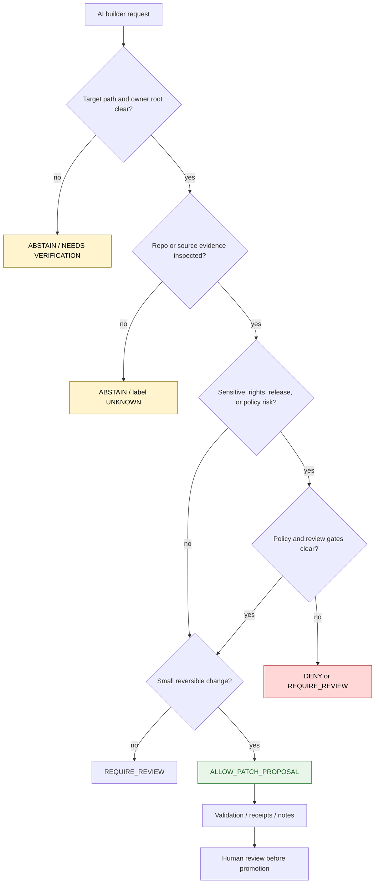

<!-- [KFM_META_BLOCK_V2]
doc_id: kfm://policy/ai-builder
title: AI Builder Policy README
type: policy-readme
version: v0.1
status: draft
owners: OWNER_TBD — AI surface steward · Policy steward · Docs steward · Security steward
created: 2026-06-15
updated: 2026-06-15
policy_label: restricted
related:
  - ../README.md
  - ../access/README.md
  - ../../docs/doctrine/ai-build-operating-contract.md
  - ../../docs/doctrine/ai-as-assistant.md
  - ../../docs/architecture/governed-ai/BOUNDARIES.md
  - ../../docs/doctrine/trust-membrane.md
  - ../../docs/doctrine/truth-posture.md
  - ../../docs/doctrine/directory-rules.md
  - ../../packages/policy-runtime/README.md
  - ../../apps/governed-api/README.md
tags: [kfm, policy, ai-builder, governed-ai, ai-assistant, evidence, receipts, prompt-injection, deny-by-default]
notes:
  - "Initial README for the policy/ai_builder lane."
  - "This file documents policy posture for AI-assisted repository building; it is not itself a runtime policy bundle, prompt secret, credential, or AI authority."
  - "The requested underscore path is preserved; slug normalization against repo convention remains NEEDS VERIFICATION."
  - "Implementation depth is UNKNOWN until policy modules, fixtures, tests, AI receipts, prompt registries, and CI enforcement are inspected."
[/KFM_META_BLOCK_V2] -->

<a id="top"></a>

<div align="center">

# AI Builder Policy

`policy/ai_builder/`

**Policy lane for AI-assisted repository building: what AI builders may propose, what they must refuse, and what evidence, review, receipts, and rollback controls must surround AI-authored changes.**


[Scope](#1-scope) · [Repo fit](#2-repo-fit) · [Inputs](#5-inputs) · [Exclusions](#6-exclusions) · [Decision model](#7-decision-model) · [Diagram](#8-diagram) · [Definition of done](#14-definition-of-done)

</div>

---

> [!IMPORTANT]
> **Status:** draft / `NEEDS VERIFICATION`  
> **Owners:** `OWNER_TBD` — AI surface steward · Policy steward · Docs steward · Security steward  
> **Path:** `policy/ai_builder/README.md`  
> **Responsibility root:** `policy/` — policy-as-code and policy documentation  
> **Truth posture:** CONFIRMED file path / PROPOSED AI-builder policy-lane contract / UNKNOWN runtime or CI enforcement

> [!CAUTION]
> AI builder output is never repository truth by itself. Generated code, Markdown, schemas, fixtures, and plans remain proposed until reviewed, validated, and accepted through governed repository practice.

---

## Quick jump

- [1. Scope](#1-scope)
- [2. Repo fit](#2-repo-fit)
- [3. Policy boundary](#3-policy-boundary)
- [4. Default posture](#4-default-posture)
- [5. Inputs](#5-inputs)
- [6. Exclusions](#6-exclusions)
- [7. Decision model](#7-decision-model)
- [8. Diagram](#8-diagram)
- [9. Allowed builder activities](#9-allowed-builder-activities)
- [10. Denied builder activities](#10-denied-builder-activities)
- [11. Receipt and review expectations](#11-receipt-and-review-expectations)
- [12. Inspection path](#12-inspection-path)
- [13. Validation expectations](#13-validation-expectations)
- [14. Definition of done](#14-definition-of-done)
- [15. Open verification items](#15-open-verification-items)

---

## 1. Scope

`policy/ai_builder/` is the policy lane for AI-assisted repository-building activity.

It should describe and eventually bind the checks that decide whether an AI builder action is allowed, denied, abstained, or requires human review before it can affect KFM repository content.

In scope:

- AI-assisted Markdown, code, schema, fixture, prompt, and patch proposals
- evidence and repository-inspection requirements before claiming implementation status
- policy gates for sensitive domains, publication, rights, and release-adjacent work
- generated-receipt and review expectations
- prompt-injection and untrusted-source handling posture
- fail-closed behavior for unsupported claims, unknown paths, missing owners, or unavailable tests

Out of scope:

- model-provider credentials
- secret prompts or private keys
- runtime answer generation for public users
- release approval
- source acquisition
- canonical data mutation
- direct publication
- bypassing human review for trust-bearing changes

[Back to top](#top)

---

## 2. Repo fit

| Concern | Owning root | Expected relationship |
|---|---|---|
| AI-builder policy lane | `policy/ai_builder/` | This README and future policy modules, fixtures, or bundle files |
| General policy root | `policy/` | Singular policy authority root for allow / deny / restrict / abstain / redaction / release posture |
| AI builder doctrine | `docs/doctrine/ai-build-operating-contract.md` | Governs AI authoring behavior and Markdown discipline |
| AI authority doctrine | `docs/doctrine/ai-as-assistant.md` | States AI is assistant, not authority |
| Governed-AI architecture | `docs/architecture/governed-ai/BOUNDARIES.md` | Architectural boundary view for builder and runtime AI surfaces |
| Runtime policy evaluation | `packages/policy-runtime/` or verified runtime package | Implementation home remains `NEEDS VERIFICATION` |
| Tests and fixtures | `tests/policy/`, `fixtures/policy/`, or verified equivalents | Required before promotion beyond draft |

> [!NOTE]
> The requested path uses `ai_builder`. Slug normalization against existing repo naming conventions remains `NEEDS VERIFICATION`; do not create a parallel `policy/ai-builder/` lane without an ADR or migration note.

## 3. Policy boundary

This lane may define what an AI builder may do in the repository. It must not make AI a truth source, policy authority, release authority, schema authority, or publication gate.

Short rule:

```text
policy/ai_builder/          = AI-assisted build/action policy
policy/access/              = who may use bounded capabilities
contracts/                  = object meaning
schemas/contracts/v1/        = machine-readable shape
docs/doctrine/              = governing doctrine
release/                    = publication, correction, rollback control
data/                       = lifecycle state, proofs, receipts, artifacts
```

## 4. Default posture

AI builder actions should fail closed when support is insufficient.

Return `DENY`, `ABSTAIN`, or require review when any of these are unresolved:

- target path authority
- existing file state
- owner or reviewer
- source evidence
- rights or sensitivity posture
- schema or contract authority
- tests or validation path
- release impact
- rollback target
- implementation depth
- conflict with KFM invariants

## 5. Inputs

| Input family | Examples | Required posture |
|---|---|---|
| User request | target path, task, change intent | Interpreted narrowly and checked against policy |
| Repo evidence | files, READMEs, schemas, tests, workflows, manifests | Preferred source for current implementation claims |
| Doctrine evidence | AI build contract, trust membrane, truth posture, Directory Rules | Governs intended behavior and placement |
| Source material | uploaded docs, pasted text, external sources when required | Treated as evidence with limits and source status |
| Risk context | sensitive domain, rights uncertainty, release impact, public exposure | Fail closed when unresolved |
| Proposed change | patch, Markdown, schema, fixture, prompt, code | Reviewable, reversible, and truth-labeled |
| Validation context | tests, lint, schema validation, generated receipts | Required before stronger readiness claims |

## 6. Exclusions

| Does not belong here | Correct home |
|---|---|
| Model credentials, API keys, tokens, private prompts | Secret manager / deployment configuration, not repo docs |
| Generated code or docs themselves | Target responsibility root, after path review |
| Runtime answer generation policy | Governed AI runtime policy or architecture lane |
| Contract meaning | `contracts/` |
| Machine-readable schemas | `schemas/contracts/v1/` |
| Release approval and rollback authority | `release/` |
| Lifecycle data and artifacts | `data/` |
| General AI doctrine | `docs/doctrine/` |
| Deployable AI service code | `apps/` or verified app home |
| Reusable AI runtime package code | `packages/` after placement review |

## 7. Decision model

| Outcome | Meaning | Required behavior |
|---|---|---|
| `ALLOW_DRAFT` | AI may draft or revise content for review | Label uncertainty and preserve evidence boundaries |
| `ALLOW_PATCH_PROPOSAL` | AI may propose a patch or make a reversible docs/code change | Use smallest safe change and record validation gaps |
| `REQUIRE_REVIEW` | Human review is required before promotion or publication | Name reviewer class and evidence needed |
| `ABSTAIN` | Support is insufficient to act or claim authority | Do not generate unsupported implementation claims |
| `DENY` | The requested action would violate policy, safety, rights, sensitivity, or trust membrane | Refuse or redirect to safer bounded plan |
| `ERROR` | Tool, repository, validation, or runtime failure | Stop and report the failure honestly |

> [!IMPORTANT]
> `ALLOW_DRAFT` and `ALLOW_PATCH_PROPOSAL` do not mean `APPROVED`, `PUBLISHED`, `RELEASED`, or `CANONICAL`.

## 8. Diagram



## 9. Allowed builder activities

AI builder activity may be allowed when it remains evidence-bound, reviewable, and reversible.

| Activity | Allowed posture | Notes |
|---|---|---|
| Draft Markdown | `ALLOW_DRAFT` | Must label unknowns and preserve source hierarchy |
| Update README files | `ALLOW_PATCH_PROPOSAL` | Must inspect current file and avoid overclaiming |
| Propose schemas/contracts | `REQUIRE_REVIEW` | Must not create parallel authority |
| Generate fixtures | `ALLOW_PATCH_PROPOSAL` or `REQUIRE_REVIEW` | Synthetic-only unless source-cleared |
| Refactor docs | `ALLOW_PATCH_PROPOSAL` | Preserve no-loss doctrine and stable anchors where practical |
| Write code helpers | `REQUIRE_REVIEW` when trust-bearing | Tests and rollback path required |
| Create prompts | `ALLOW_DRAFT` | Must not encode secrets or bypass policy |

## 10. Denied builder activities

| Activity | Required response | Reason |
|---|---|---|
| Publish unsupported claims as confirmed | `DENY` | Violates cite-or-abstain posture |
| Treat AI output as evidence | `DENY` | AI is interpretive, not root truth |
| Bypass RAW / WORK / QUARANTINE / PROCESSED / CATALOG / PUBLISHED lifecycle | `DENY` | Violates trust membrane |
| Expose sensitive exact locations without policy clearance | `DENY` | Sensitive domain fail-closed rule |
| Create parallel schema, contract, policy, or release authority | `DENY` or `REQUIRE_REVIEW` | Requires ADR or migration plan |
| Store secrets or credentials in repo docs | `DENY` | Security boundary |
| Claim CI, tests, deployment, or runtime behavior without evidence | `ABSTAIN` | Implementation depth unknown |
| Collapse generation and approval into one step | `DENY` | Review and release separation required |

## 11. Receipt and review expectations

AI-authored or AI-assisted changes should leave a reviewable trail appropriate to the risk of the change.

| Change type | Expected record | Status |
|---|---|---|
| Markdown-only update | commit message plus verification notes | CONFIRMED practice in current session |
| Schema or contract change | validation output plus reviewer approval | NEEDS VERIFICATION |
| Policy change | policy fixtures, tests, reviewer approval, rollback target | NEEDS VERIFICATION |
| Sensitive-domain change | steward review plus deny-by-default check | NEEDS VERIFICATION |
| Release-adjacent change | ReleaseManifest / correction / rollback linkage | NEEDS VERIFICATION |
| AI-generated artifact | generated receipt or equivalent provenance record | NEEDS VERIFICATION |

## 12. Inspection path

Policy language, fixtures, tests, and AI-generated receipt tooling are `NEEDS VERIFICATION`. Use these local inspection commands before treating this lane as implemented.

```bash
# From the repository root, inspect this policy lane.
find policy/ai_builder -maxdepth 4 -type f | sort

# Inspect AI doctrine and architecture docs.
find docs/doctrine docs/architecture -maxdepth 4 -type f | grep -Ei 'ai|governed|truth|trust|directory' | sort

# Inspect likely policy tests and fixtures.
find tests fixtures -maxdepth 5 -type f 2>/dev/null | grep -E 'ai|builder|policy|receipt' | sort
```

## 13. Validation expectations

Useful validation for this lane should cover:

- unknown target path returns `ABSTAIN`
- missing repo evidence keeps implementation claims `UNKNOWN`
- sensitive-domain public exposure returns `DENY`
- schema/contract/policy authority conflicts require review or ADR
- generated Markdown includes meta block, repo fit, inputs, exclusions, and verification gaps where required
- AI builder cannot mark its own output as released, confirmed, or canonical without evidence
- prompt-injection content from sources is treated as untrusted input
- policy fixtures cover `ALLOW_DRAFT`, `ALLOW_PATCH_PROPOSAL`, `REQUIRE_REVIEW`, `ABSTAIN`, `DENY`, and `ERROR`

## 14. Definition of done

- [ ] Owners are confirmed and `OWNER_TBD` is replaced.
- [ ] The underscore path `policy/ai_builder/` is accepted or migrated with ADR/migration notes.
- [ ] Runtime policy language and bundle location are confirmed.
- [ ] AI-builder decision outcomes are represented in fixtures.
- [ ] Tests cover allowed, denied, abstained, and review-required paths.
- [ ] GENERATED_RECEIPT or equivalent provenance record is defined or linked.
- [ ] Prompt-injection and untrusted-source handling are documented or linked.
- [ ] Review requirements are mapped to docs, code, schema, contract, policy, and release-adjacent changes.
- [ ] Rollback target is documented for policy changes.

## 15. Open verification items

| Item | Why it matters |
|---|---|
| Confirm accepted slug: `ai_builder` vs `ai-builder` | Prevents duplicate policy lanes |
| Confirm policy runtime language | Prevents non-runnable policy examples |
| Confirm AI-generated receipt object family | Makes AI provenance auditable |
| Confirm tests and fixtures | Required before promotion beyond draft |
| Confirm CI enforcement | Avoids claiming gates that do not exist |
| Confirm prompt registry home, if any | Prevents prompt sprawl |
| Confirm review requirements by change type | Keeps AI builder actions reviewable |
| Confirm sensitive-domain denial fixtures | Prevents unsafe public exposure |

<details>
<summary>Appendix A — illustrative AI-builder policy input shape</summary>

This example is illustrative. It is not a verified schema.

```json
{
  "subject": {
    "actor_type": "ai_builder",
    "tool": "TOOL_TBD",
    "human_requester": "REQUESTER_TBD"
  },
  "action": "update_markdown",
  "target": {
    "path": "policy/ai_builder/README.md",
    "owner_root": "policy/",
    "change_type": "documentation"
  },
  "context": {
    "repo_evidence_inspected": true,
    "sensitive_domain": false,
    "release_adjacent": false,
    "rollback_target": "GIT_COMMIT_TBD"
  }
}
```

</details>

<details>
<summary>Appendix B — no-loss preservation note</summary>

The target file was an empty placeholder. This README adds a bounded AI-builder policy-lane contract without claiming runtime enforcement, policy tests, prompt registry implementation, generated-receipt implementation, or CI coverage.

The document preserves KFM doctrine by keeping AI subordinate to evidence, policy, review, release, correction, rollback, contracts, schemas, and repository evidence.

</details>

## Status summary

`policy/ai_builder/` should define the policy boundary for AI-assisted repository-building actions.

It should let AI help draft, revise, inspect, and propose while preventing generated language from becoming truth, policy, release, schema authority, source authority, or a bypass around governed review.

<p align="right"><a href="#top">Back to top</a></p>
