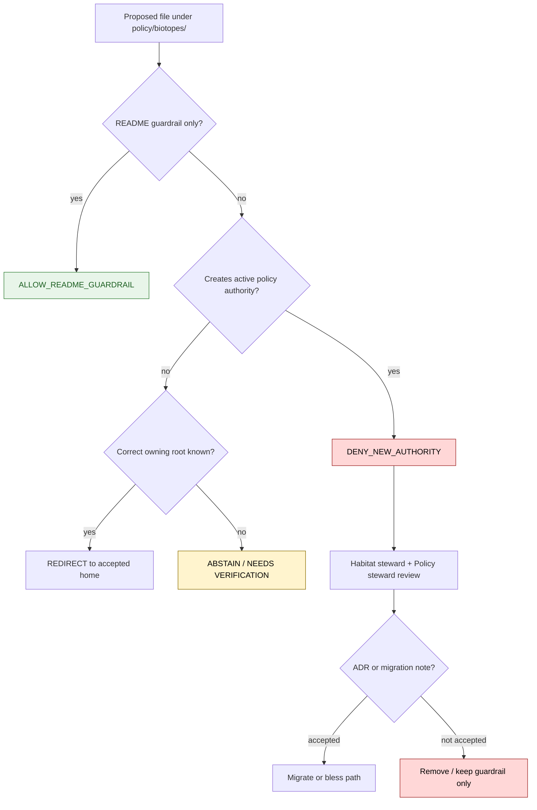

<!-- [KFM_META_BLOCK_V2]
doc_id: kfm://policy/biotopes
title: Biotopes Policy README
type: policy-readme
version: v0.1
status: draft
owners: OWNER_TBD — Habitat steward · Policy steward · Docs steward · Sensitivity steward
created: 2026-06-15
updated: 2026-06-15
policy_label: restricted
related:
  - ../README.md
  - ../sensitivity/flora/README.md
  - ../../docs/domains/habitat/sublanes/biotopes.md
  - ../../docs/domains/habitat/README.md
  - ../../docs/domains/flora/README.md
  - ../../docs/domains/fauna/README.md
  - ../../docs/doctrine/trust-membrane.md
  - ../../docs/doctrine/directory-rules.md
  - ../../packages/policy-runtime/README.md
tags: [kfm, policy, biotopes, habitat, sensitivity, crosswalk, guardrail, conflicted]
notes:
  - "Initial README for policy/biotopes."
  - "This path is a guarded compatibility / parking-lane README because the Habitat biotopes sublane states that biotopes must not become a parallel policy authority."
  - "No policy decisions, policy modules, schemas, contracts, releases, or lifecycle data should be placed here until the owning root is resolved by steward review or ADR."
  - "Implementation depth is UNKNOWN until policy modules, fixtures, tests, and accepted domain-policy placement are inspected."
[/KFM_META_BLOCK_V2] -->

<a id="top"></a>

<div align="center">

# Biotopes Policy Guardrail

`policy/biotopes/`

**Guardrail README for the requested Biotopes policy path. This directory must not become a parallel policy authority for Habitat, Flora, Fauna, schemas, contracts, release, or lifecycle data.**


[Scope](#1-scope) · [Repo fit](#2-repo-fit) · [Inputs](#5-inputs) · [Exclusions](#6-exclusions) · [Decision posture](#7-decision-posture) · [Diagram](#8-diagram) · [Definition of done](#14-definition-of-done)

</div>

---

> [!WARNING]
> **CONFLICTED / NEEDS VERIFICATION:** the Habitat Biotopes sublane states that `Biotope` is not KFM ubiquitous language and that the biotopes grouping must not create parallel `schemas/biotopes/`, `policy/biotopes/`, `contracts/biotopes/`, or `data/.../biotopes/` authority. This README therefore treats `policy/biotopes/` as a **guardrail / parking lane**, not an active policy home.

> [!IMPORTANT]
> **Status:** draft / `CONFLICTED` / `NEEDS VERIFICATION`  
> **Owners:** `OWNER_TBD` — Habitat steward · Policy steward · Docs steward · Sensitivity steward  
> **Path:** `policy/biotopes/README.md`  
> **Responsibility root:** `policy/` — policy-as-code and policy documentation  
> **Truth posture:** CONFIRMED file path / CONFIRMED conflict with Habitat Biotopes guidance / UNKNOWN accepted policy placement

---

## Quick jump

- [1. Scope](#1-scope)
- [2. Repo fit](#2-repo-fit)
- [3. Authority boundary](#3-authority-boundary)
- [4. Default posture](#4-default-posture)
- [5. Inputs](#5-inputs)
- [6. Exclusions](#6-exclusions)
- [7. Decision posture](#7-decision-posture)
- [8. Diagram](#8-diagram)
- [9. Allowed uses](#9-allowed-uses)
- [10. Denied uses](#10-denied-uses)
- [11. Placement resolution path](#11-placement-resolution-path)
- [12. Inspection path](#12-inspection-path)
- [13. Validation expectations](#13-validation-expectations)
- [14. Definition of done](#14-definition-of-done)
- [15. Open verification items](#15-open-verification-items)

---

## 1. Scope

`policy/biotopes/` is currently a **guardrail README path** for a contested policy location.

It exists to prevent accidental hardening of a topic-name folder into policy authority. Until reviewed, this directory should only explain why policy decisions for habitat-type / biotope-like concerns belong under the accepted Habitat, sensitivity, domain-policy, contract, schema, release, or lifecycle roots.

In scope:

- documenting the placement conflict
- preventing parallel authority drift
- routing policy questions to the correct owner root
- naming required review before activation
- capturing validation and rollback expectations if this path is later migrated or accepted

Out of scope:

- active policy modules
- OPA/Rego rules or equivalent executable policies
- sensitive-species exposure decisions
- habitat object-family contracts
- schema definitions
- release approval
- lifecycle data
- source records
- public API behavior

[Back to top](#top)

---

## 2. Repo fit

| Concern | Correct or likely owning root | Status | Notes |
|---|---|---|---|
| Human Biotopes sublane explanation | `docs/domains/habitat/sublanes/biotopes.md` | CONFIRMED doc exists | Treats biotopes as a docs-layer grouping, not new authority |
| Habitat policy | `policy/domains/habitat/` or verified habitat policy home | NEEDS VERIFICATION | Better home for Habitat-owned object policy if present |
| Sensitivity / geoprivacy policy | `policy/sensitivity/` domain lane | NEEDS VERIFICATION | Exact habitat sensitivity path needs repo inspection |
| Flora-owned vegetation community policy | Flora policy / sensitivity lanes | NEEDS VERIFICATION | Biotopes may cite Flora, not own Flora policy |
| Fauna occurrence / sensitive join policy | Fauna or habitat-fauna policy lanes | NEEDS VERIFICATION | Sensitive joins must fail closed |
| Contract meaning | `contracts/` | CONFIRMED root responsibility | No contracts belong in this directory |
| Machine-readable schema shape | `schemas/contracts/v1/` | CONFIRMED root responsibility | No schema authority belongs in this directory |
| Release decisions | `release/` | CONFIRMED root responsibility | No publication approval belongs here |

> [!CAUTION]
> Do not add active policy files under `policy/biotopes/` until the Habitat steward and Policy steward decide whether this path is accepted, redirected, or removed.

## 3. Authority boundary

This directory must not create a new domain, subdomain, object family, source family, contract family, schema family, policy family, release lane, or lifecycle lane named `biotopes`.

Short rule:

```text
policy/biotopes/                 = guardrail / contested path until reviewed
policy/domains/habitat/           = likely Habitat policy home, if accepted by repo convention
policy/sensitivity/<domain>/      = sensitivity and geoprivacy policy, if accepted by repo convention
contracts/                        = object meaning
schemas/contracts/v1/             = machine-readable shape
docs/domains/habitat/sublanes/    = documentation grouping only
release/                          = publication, correction, rollback control
data/                             = lifecycle state, proofs, receipts, artifacts
```

## 4. Default posture

The default decision for new authority in this path is `DENY_NEW_AUTHORITY` until review.

A change under this directory should be blocked or redirected when it attempts to add:

- executable policy modules
- policy bundle manifests
- schema files
- contract files
- release manifests
- source data
- lifecycle artifacts
- public API behavior
- direct sensitivity downgrades
- cross-domain join decisions

## 5. Inputs

Allowed inputs for this README lane are limited to review and placement evidence.

| Input family | Examples | Required posture |
|---|---|---|
| Placement evidence | Directory Rules, Habitat Biotopes doc, policy root README | Must be cited or verified |
| Review decision | ADR, steward note, migration note | Required before accepting active policy files |
| Inventory evidence | current child files under `policy/biotopes/` | Must be inspected before migration |
| Routing target | accepted Habitat or sensitivity policy home | Must be verified before moving content |
| Risk context | sensitive species, rare habitats, join-induced exposure | Fail closed until policy owner resolves |

## 6. Exclusions

| Does not belong here | Correct home |
|---|---|
| Active executable policy modules | Accepted policy lane after steward review |
| Habitat object contracts | `contracts/` |
| Machine-readable schemas | `schemas/contracts/v1/` |
| Sensitive-location release decisions | `policy/sensitivity/` plus release policy |
| Flora vegetation-community policy | Flora policy lane, not `policy/biotopes/` |
| Fauna occurrence sensitivity | Fauna or habitat-fauna policy lane |
| Source records and raw observations | `data/` lifecycle roots |
| Published artifacts | `release/` and governed publication surfaces |
| Human domain explanation | `docs/domains/habitat/sublanes/biotopes.md` |

## 7. Decision posture

| Outcome | Meaning | Required behavior |
|---|---|---|
| `DENY_NEW_AUTHORITY` | A proposed file would make `policy/biotopes/` a parallel policy home | Block and route to steward review |
| `ALLOW_README_GUARDRAIL` | Documentation clarifies that this path is non-authoritative | Allowed |
| `REQUIRE_ADR_OR_MIGRATION` | Active policy content is proposed for this path | Require owner decision before merge |
| `REDIRECT` | Content belongs in Habitat, sensitivity, Flora, Fauna, release, schema, or contract root | Move by reviewed migration |
| `ABSTAIN` | Correct home cannot be determined | Do not create authority; record verification gap |
| `ERROR` | Tool, repository, or validation failure | Stop and report honestly |

## 8. Diagram



## 9. Allowed uses

| Use | Status | Notes |
|---|---|---|
| Guardrail README | Allowed | Prevents accidental authority drift |
| Placement notes | Allowed | Must cite source or repo evidence |
| Migration checklist | Allowed | Should route to accepted policy home |
| Drift register pointer | Allowed | Useful if this path is rejected |
| Temporary inventory note | Allowed with caution | Must not contain active policy logic |

## 10. Denied uses

| Use | Required response | Reason |
|---|---|---|
| Add active policy module | `DENY_NEW_AUTHORITY` | Parallel policy home risk |
| Add schema or contract | `DENY_NEW_AUTHORITY` | Wrong responsibility root |
| Publish derived biotope layer | `DENY_NEW_AUTHORITY` | Release authority belongs elsewhere |
| Downgrade sensitive habitat or species join | `DENY_NEW_AUTHORITY` | Requires sensitivity policy and review |
| Treat `Biotope` as canonical object family | `DENY_NEW_AUTHORITY` | Habitat doc says it is not KFM ubiquitous language |
| Store source data | `DENY_NEW_AUTHORITY` | Data belongs in lifecycle roots |

## 11. Placement resolution path

Before this directory can contain anything beyond a guardrail README, complete one of these actions:

1. **Redirect:** move proposed policy content to the accepted Habitat or sensitivity policy home.
2. **ADR:** explicitly accept `policy/biotopes/` as a policy lane and explain why it does not violate domain placement rules.
3. **Migration note:** preserve this README as a guardrail and remove or redirect all other content.
4. **Drift register:** record the path as rejected, deprecated, or compatibility-only.

## 12. Inspection path

Policy runtime, fixtures, tests, and accepted placement remain `NEEDS VERIFICATION`. Use these local inspection commands before treating this directory as active.

```bash
# From the repository root, inspect this contested path.
find policy/biotopes -maxdepth 4 -type f | sort

# Inspect neighboring policy homes.
find policy -maxdepth 4 -type f | sort

# Inspect Habitat biotopes documentation and potential policy references.
find docs/domains/habitat -maxdepth 5 -type f | grep -Ei 'biotope|sensitivity|policy|habitat' | sort
```

## 13. Validation expectations

Useful validation for this guardrail should cover:

- only this README exists under `policy/biotopes/` until placement is resolved
- any additional file triggers steward review
- active policy files are rejected or migrated
- links to Habitat Biotopes documentation remain valid
- no schema, contract, release, or data files are placed here
- sensitive joins fail closed until accepted policy homes handle them
- no public UI or API path relies on `policy/biotopes/` as authority

## 14. Definition of done

- [ ] Habitat steward and Policy steward review this path.
- [ ] Accepted policy home for Habitat biotope-like concerns is confirmed.
- [ ] `policy/biotopes/` is either accepted by ADR, redirected, or kept as guardrail-only.
- [ ] Any active policy content is migrated to the accepted home.
- [ ] Tests or fixtures prevent reintroducing parallel authority.
- [ ] Related docs are updated to point to the accepted policy home.
- [ ] Rollback target is documented for any migration.

## 15. Open verification items

| Item | Why it matters |
|---|---|
| Confirm whether `policy/biotopes/` is planned, accidental, or compatibility-only | Determines whether to remove, redirect, or bless the path |
| Confirm Habitat policy home | Prevents future policy sprawl |
| Confirm sensitivity policy home for habitat joins | Needed for sensitive habitat / species exposure |
| Confirm whether `Biotope` remains docs-only | Prevents object-family drift |
| Confirm tests and fixtures | Required before enforcement claims |
| Confirm ADR or drift-register decision | Required before treating this path as resolved |

<details>
<summary>Appendix A — no-loss preservation note</summary>

The target file was an empty placeholder. This README adds a guardrail instead of active policy content because the Habitat Biotopes documentation explicitly warns that biotopes must not become parallel policy, schema, contract, or data authority.

This preserves the user-requested path while preventing the path from silently hardening into a policy authority that conflicts with KFM directory governance.

</details>

## Status summary

`policy/biotopes/` is currently a contested policy path and should remain guardrail-only until steward review resolves placement.

Do not place active policy decisions here unless an ADR or migration note explicitly accepts the path and proves it does not create parallel authority.

<p align="right"><a href="#top">Back to top</a></p>
