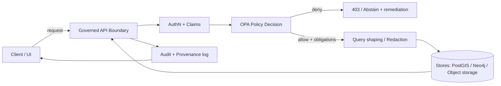

# KFM Policy Bundles (OPA/Rego)


> [!IMPORTANT]
> This directory is **production-critical**.
> A policy change can: block publication, deny access, force redaction/generalization, or require Focus Mode to abstain.
> Treat changes here like security & governance changes.

---

## What lives here

`policy/bundles/` is the home for **OPA policy bundles** (Rego + policy data + tests) that enforce KFM governance at three choke points:

1. **Runtime** — API trust membrane decisions (authorization, redaction obligations, audit obligations).
2. **CI / PR gates** — merge-blocking checks when required artifacts/metadata/provenance/citations are missing.
3. **Pipeline promotion** — block “raw → work → processed → published” promotions unless contracts are satisfied.

> [!NOTE]
> KFM uses “bundle” in other contexts (e.g., PROV bundles / OCI evidence bundles).
> This folder is specifically for **OPA bundles** (policy-as-code).

---

## Non-negotiables (must not regress)

These invariants **must** be enforced by policy bundles. If a change weakens any item below, it requires explicit governance approval.

- **Trust membrane**: reads/writes across the boundary must go through  
  **authentication → policy evaluation → query shaping/redaction → audit/provenance logging**.
- **Fail closed**: missing/ambiguous input must evaluate to **deny** (no implicit allows).
- **Promotion contract**: publication requires boundary artifacts (STAC/DCAT/PROV + receipts/attestations as applicable) and passing policy checks.
- **Evidence-first narrative**: Story Nodes and Focus Mode must **cite evidence or abstain** (no unsourced narrative).
- **Sovereignty & classification propagation**: derivatives cannot be less restricted than inputs; sensitive locations/fields must be generalized or withheld unless explicitly granted.

> [!WARNING]
> “Just make it work” is not an acceptable policy strategy. When in doubt, **deny** and return a remediation reason.

---

## Bundle registry

This table is the **human index** of policy bundles. Keep it accurate when adding/removing bundles.

| Bundle ID | Used in | Primary responsibility | Key packages / entrypoints (examples) | Owners / reviewers |
|---|---|---|---|---|
| `kfm-core` | runtime + CI | Baseline authz + AI output gating | `data.kfm.data.allow`, `data.kfm.ai.allow` | Security + Governance |
| `promotion-contract` | CI + pipelines | Block promotion unless required artifacts exist | `data.kfm.promotion.allow` | Data Governance |
| `provenance-guard` | CI + pipelines | Fail when provenance is missing/incomplete | `data.kfm.prov.allow` | Data Governance |
| `materiality-rules` | CI + pipelines | Versioned update triggers & thresholds | `data.kfm.materiality.should_promote` | Domain stewards |
| `supply-chain-gates` | CI | Attestation/SBOM + version pinning gates | `data.kfm.supplychain.allow` | Security |

> [!TIP]
> Bundle IDs should be stable, kebab-case, and treated as contract identifiers.

---

## Standard bundle layout

Each bundle is self-contained and follows this structure:

```text
policy/bundles/
├── README.md
├── <bundle_id>/
│   ├── bundle.yaml                 # bundle metadata (KFM-specific)
│   ├── rego/                       # Rego source
│   │   └── kfm/                    # package namespace root
│   │       ├── *.rego
│   │       └── *_test.rego         # OPA unit tests
│   ├── data/                       # policy data (JSON/YAML): vocabularies, allowlists, thresholds, flags
│   ├── schemas/                    # JSON Schemas for policy input + policy data (contract-first)
│   ├── fixtures/                   # deterministic test fixtures for CI regression
│   └── docs/                       # optional: bundle-specific rationale & governance notes
└── _shared/                        # optional shared modules/data (avoid cyclic deps)
    ├── rego/
    └── data/
```

### `bundle.yaml` (required)

`bundle.yaml` is the minimum metadata needed to treat policy as a governed artifact.

```yaml
bundle_id: kfm-core
version: 1.0.0
description: Baseline KFM policies (default deny).
owners:
  - team: governance
  - team: security
entrypoints:
  - data.kfm.data.allow
  - data.kfm.ai.allow
inputs:
  - schema: schemas/input/authz.schema.json
  - schema: schemas/input/focus_mode.schema.json
policy_data:
  - data/taxonomy/sensitivity_levels.json
  - data/taxonomy/roles.json
review:
  cadence: quarterly_or_on_toolchain_change
  required_approvals: 2
```

> [!NOTE]
> Keep `bundle.yaml` small and reviewable. Put large rationales in `docs/`.

---

## Repo touch points (what policies evaluate)

Policy bundles commonly gate the following repo artifacts (paths are illustrative; use the project’s canonical layout):

| Artifact type | Typical repo location | Why policy cares |
|---|---|---|
| STAC Items/Collections | `data/stac/...` | catalog completeness + distribution links |
| DCAT datasets | `data/catalog/dcat/...` | discoverability + license/rights |
| PROV bundles | `data/prov/...` | provenance-first enforcement |
| Story Nodes | `docs/reports/story_nodes/...` | citation/claim contract + safety |
| Pipeline receipts/manifests | `data/...` or `releases/...` | promotion contract + audit |
| Policy vocabularies | `policy/bundles/**/data/...` | prevent drift + enforce controlled terms |

---

## Decision contracts

KFM policy decisions should be **deterministic, explainable, and machine-actionable**.

### Canonical input envelope

All entrypoints should accept a consistent top-level `input` shape, even if some fields are unused.

```json
{
  "actor": {
    "subject_id": "user:123",
    "role": "public|reviewer|admin",
    "claims": { "scopes": ["..."], "custodian_grants": ["..."] }
  },
  "resource": {
    "kind": "dataset|layer|story_node|bundle|endpoint",
    "id": "kfm.dataset:...",
    "sensitivity": "public|restricted|sensitive-location|aggregate-only",
    "policy_labels": ["..."]
  },
  "request": {
    "action": "read|write|promote|publish|focus_answer",
    "path": "/api/...",
    "query": { "bbox": [0,0,0,0], "time": "..." }
  },
  "context": {
    "environment": "dev|staging|prod",
    "pipeline_stage": "raw|work|processed|published",
    "source_refs": ["..."]
  },
  "answer": {
    "answer_markdown": "...",
    "citations": [{ "id": "c1", "ref": "..." }],
    "sensitivity_ok": true
  },
  "trace": { "request_id": "..." }
}
```

### Canonical output (decision object)

Prefer returning an object so enforcement code can redact, log, and explain consistently.

```json
{
  "allow": false,
  "deny_reasons": [
    { "code": "MISSING_PROV", "message": "PROV bundle required for promotion." }
  ],
  "obligations": [
    { "type": "audit_log", "event_type": "policy.deny" }
  ],
  "redactions": [
    { "path": "resource.geometry", "method": "generalize", "precision_meters": 1000 }
  ]
}
```

> [!IMPORTANT]
> “Fail closed” means:
> - missing required keys → deny
> - unknown sensitivity/label → deny
> - evaluation error → deny (caller treats errors as deny)

---

## Where these bundles are enforced

### Runtime: trust membrane enforcement

All user-facing reads/writes should cross the same policy boundary.



### CI: policy gates (merge-blocking)

CI should enforce (at minimum):

- STAC/DCAT/PROV presence + schema validity
- promotion contract / provenance completeness
- **“No Source, No Answer”** for narratives/AI: missing license, missing catalogs/provenance, missing citations → fail
- Story Node + Focus Mode cite-or-abstain rules
- supply-chain gates for toolchain volatility (pinned versions + regression tests)

> [!TIP]
> CI policy checks should be fast and deterministic. Use small fixtures in `fixtures/`.

### Pipeline: promotion gates (raw → work → processed → published)

Promotion policies should prevent publication unless the dataset has:

- required metadata (license, rights, citations, temporal/spatial extents)
- required catalogs (STAC/DCAT)
- required provenance (PROV bundle)
- required QA evidence (when applicable)
- required signatures/attestations (when applicable)

---

## Sensitivity, sovereignty, and redaction

### Controlled vocabularies (required)

To prevent policy drift, keep these as versioned policy data:

- `sensitivity` levels (e.g., `public`, `restricted`, `sensitive-location`, `aggregate-only`)
- policy labels (CARE/FAIR tags, tribal sensitivity flags, redistribution rules)
- role/claims model (including custodian grants where applicable)
- allowed redaction methods (generalize, remove field, aggregate, tile-threshold)

> [!WARNING]
> Introducing a new sensitivity level or policy label requires:
> - updating policy data + schemas
> - adding regression tests
> - documenting governance rationale in `docs/`
> - governance approval

### Redaction is a first-class outcome

If access is allowed only in generalized form, policy must return explicit `redactions[]` instructions.
Redaction must be recorded in audit/provenance logs as a transformation.

---

## Focus Mode and Story Nodes: cite-or-abstain gate

Bundles governing narratives must enforce:

- **Citations present** for non-trivial claims/answers
- **Citation references resolvable** to an evidence view (clickable proof contract)
- **Sensitivity OK**: do not leak restricted content
- **Abstain** when the above cannot be satisfied

Recommended pattern: treat “abstain” as a deny with a remediation reason and an `audit_ref` obligation.

---

## Testing

### OPA unit tests (required)

All Rego modules must have unit tests (`*_test.rego`) runnable with:

```bash
opa test ./policy/bundles/<bundle_id>/rego -v
```

### Conftest / integration tests (recommended)

Use Conftest to evaluate policy against repo artifacts:

```bash
conftest test \
  --policy ./policy/bundles/<bundle_id>/rego \
  --all-namespaces \
  ./data ./docs
```

> [!NOTE]
> Keep Conftest targets explicit and deterministic; avoid scanning giant directories in CI.

### Regression suite (required for high-risk bundles)

Maintain fixtures that cover:

- “golden allow” cases for known-good inputs
- “golden deny” cases for missing provenance/license/citations
- known leakage patterns (e.g., sensitive geometry in outputs)
- compatibility tests for policy engine upgrades (Rego version defaults, syntax changes)

---

## Building and publishing bundles

Build bundles from source in CI and reference by digest/version.

```bash
# Build an OPA bundle artifact
opa build -b ./policy/bundles/<bundle_id> -o ./dist/<bundle_id>.tar.gz
```

Recommended: attach bundle digest/version to runtime audit logs so decisions remain explainable historically.

---

## Versioning & change management

- Use **SemVer** per bundle (`bundle.yaml.version`).
- Bump **MAJOR** for any behavior change that could widen access, relax promotion gates, or weaken cite-or-abstain.
- Every policy decision should be traceable to:
  - bundle ID + version
  - commit hash / artifact digest (where available)
  - audit reference (for user-visible outcomes)

---

## Toolchain volatility (pinning + upgrades)

Policy tooling is part of the security boundary:

- **Pin** OPA/Conftest versions in CI.
- Maintain **compatibility tests** for Rego language defaults (e.g., Rego v1 default changes).
- Treat security advisories as merge-blocking when they affect verification steps or policy correctness.

---

## Emergency deny / kill switch

Bundles should support an emergency “deny switch” that can:

- disable a risky endpoint
- disable Focus Mode answering (force abstain)
- tighten access for a sensitivity level

Implementation guidance:
- model as policy data (`data/emergency.json`) with timestamp + reason
- ensure enabling the switch is auditable
- keep default state “off”

---

## PR checklist for policy changes

- [ ] Default-deny preserved (no implicit allows)
- [ ] Input schema updated (if contract changes)
- [ ] Policy data vocabularies updated + documented (if changed)
- [ ] Unit tests added/updated (`opa test` passes)
- [ ] Regression fixtures added for any new deny/allow path
- [ ] CI conftest targets updated (if new artifact types are gated)
- [ ] Audit obligations preserved (decisions remain traceable)
- [ ] Governance review requested when:
  - [ ] access is widened
  - [ ] sensitivity levels/labels change
  - [ ] redaction/generalization rules change
  - [ ] promotion requirements change

---

## Troubleshooting

<details>
<summary>Common issues</summary>

- **“Everything is denied” after a change**
  - Confirm input schema keys match what callers send.
  - Confirm policy data files are packaged into the bundle.
  - Ensure allow rules aren’t shadowed by missing keys.

- **CI passes locally but fails in GitHub Actions**
  - Confirm pinned versions match.
  - Confirm Rego defaults are consistent (explicit flags if needed).

- **Focus Mode starts abstaining unexpectedly**
  - Check citation extraction and the “resolvable evidence ref” contract.
  - Confirm sensitivity labels on referenced datasets are correct.

</details>

---

### Want to add a new bundle?

Create `policy/bundles/<bundle_id>/` using the standard layout, add it to the **Bundle registry** table, and wire it into CI/runtime via the governed integration layers (never by direct DB access).

