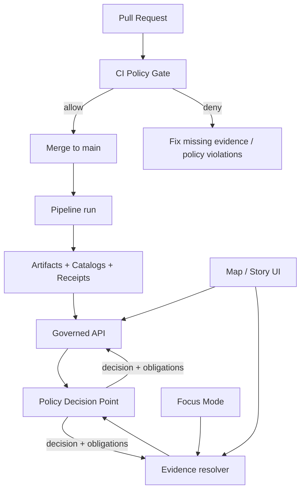

<!-- [KFM_META_BLOCK_V2]
doc_id: kfm://doc/9b0a6f4e-4b0a-4bd6-9f71-0f4a2b8c3c9a
title: Policy Bundles
type: standard
version: v1
status: draft
owners: TBD
created: 2026-02-22
updated: 2026-02-22
policy_label: public
related: []
tags: [kfm, policy, bundles]
notes:
  - This README defines what a “policy bundle” is in KFM and how it is tested, versioned, and enforced.
  - Treat this file as an interface contract: CI + runtime must evaluate the same policy semantics.
[/KFM_META_BLOCK_V2] -->

# Policy Bundles
Versioned, testable policy-as-code bundles that enforce KFM governance across CI, runtime APIs, evidence resolution, and Focus Mode.


**Owners:** TBD  
**Scope:** `policy/bundles/` (this directory)

**Quick nav**
- [What lives here](#what-lives-here)
- [How policy is enforced](#how-policy-is-enforced)
- [Bundle contract](#bundle-contract)
- [Policy labels](#policy-labels)
- [Licensing and rights](#licensing-and-rights)
- [Sensitivity and safe outputs](#sensitivity-and-safe-outputs)
- [Running policy tests](#running-policy-tests)
- [Change management](#change-management)
- [Bundle registry](#bundle-registry)
- [FAQ](#faq)

---

## What lives here

This directory is the home for **policy bundles**: packaged rule sets that produce deterministic **allow/deny** decisions and **obligations** (e.g., “show a notice”, “generalize geometry”, “block publishing”) used across KFM surfaces.

> **Trust posture**
>
> **Fail closed**: if a request cannot be evaluated deterministically, or required evidence is missing, treat it as **deny**.

### Directory tree

> The precise substructure below is a **recommended** pattern and may not match the current repo until aligned. Update the tree as the directory evolves.

```text
policy/
  bundles/
    README.md
    <bundle_id>/                 # bundle source (recommended)
      rego/                      # policy modules
      data/                      # static data inputs (allowlists, rubrics)
      fixtures/                  # JSON fixtures for decisions
      tests/                     # *_test.rego unit tests
      bundle.yaml                # bundle metadata (id/version/surfaces) (optional)
    _published/                  # built artifacts by digest (optional)
      <bundle_id>@sha256-....tgz
```

---

## How policy is enforced

KFM’s policy-as-code model is intentionally **shared across CI and runtime**.

- A **Policy Decision Point** evaluates the bundle and returns a decision.
- Multiple **Policy Enforcement Points** call the PDP (CI, runtime API, evidence resolver, etc.).
- The **UI must never make policy decisions**; it only displays outcomes, badges, and obligations.

### Enforcement surfaces

| Surface | Purpose | Typical decision inputs | Expected outputs |
|---|---|---|---|
| CI policy gate | Block merges that violate governance | PR artifacts, catalogs, fixtures, manifests/receipts | deny messages that point to remediation |
| Runtime API | Prevent unauthorized access and unsafe exports | user/principal + resource metadata + action | allow/deny + obligations + policy-safe errors |
| Evidence resolver | Only resolve citations/evidence if allowed | EvidenceRef + caller + resource policy label | allow/deny + obligations + bundle/cards |
| Focus Mode | Enforce cite-or-abstain and policy-safe outputs | question + resolved evidence + user role | allow answer / deny / redact/generalize + citations |
| UI | Communicate decisions | decision + obligations | badges, notices, blocked states |

### Policy flow diagram



---

## Bundle contract

A bundle is expected to support a small set of **stable entrypoints** and return:

- a **decision** (allow/deny),
- a **policy label** (for the resource/result),
- **obligations** (structured actions required by downstream systems).

### Minimal input shape

A common minimal input shape is:

- `input.user.role`
- `input.action`
- `input.resource.policy_label`

Example request payload shape:

```json
{
  "user": { "role": "public" },
  "action": "read",
  "resource": { "policy_label": "public" }
}
```

### Minimal output shape

Downstream callers should expect a structure like:

```json
{
  "decision": "allow",
  "policy_label": "public",
  "obligations": []
}
```

### Obligations

Obligations are how policy communicates required behavior to callers.

Example obligation:

```json
{ "type": "show_notice", "message": "Geometry generalized due to policy." }
```

> **Important:** obligations are not “optional hints.” If an obligation is returned, the caller must either **satisfy it** or **deny the operation**.

---

## Policy labels

Policy labels classify access + sensitivity. This list should be treated as a controlled vocabulary.

| policy_label | Meaning |
|---|---|
| `public` | Safe to show publicly |
| `public_generalized` | Public-safe version derived from sensitive data (generalized geometry) |
| `restricted` | Authorization required; not public |
| `restricted_sensitive_location` | Precise locations protected; default deny |
| `internal` | Operators/stewards only |
| `embargoed` | Time-limited restriction pending release |
| `quarantine` | Not promoted (validation or rights unresolved) |

---

## Licensing and rights

Licensing is a first-class policy input.

Minimum enforcement expectations:
- Promotion should be blocked unless **license and rights holder** are present for each distribution.
- “Metadata-only reference” should be supported when mirroring is not permitted.
- Exports should include **attribution and license text** automatically.
- Story publishing should be blocked if rights are unclear for included media.

---

## Sensitivity and safe outputs

Defaults should be aligned to KFM posture:

- Default deny for sensitive-location and restricted datasets.
- If any public representation is allowed, produce a separate `public_generalized` dataset version.
- Do not embed precise coordinates in Story Nodes or Focus Mode outputs unless explicitly allowed.
- Treat redaction/generalization as a first-class transform recorded in provenance.

Operational safety requirements:
- Use **policy-safe error responses** and avoid leaking restricted existence via 403/404 differences.
- Consider receipts/logs sensitive; apply redaction and retention policies.

---

## Running policy tests

Policy must be continuously tested and must block merges when it fails.

Recommended testing layers:
1. **OPA unit tests** (`*_test.rego`) using golden allow/deny fixtures.
2. **Conftest** checks over JSON artifacts (receipts, manifests, STAC/DCAT/PROV, etc.).
3. Link/check invariants where policy depends on cross-document relationships.

Example Conftest invocation pattern:

```bash
conftest test <input.json> -p <path-to-policy>
```

---

## Change management

Policy changes are governed changes. Treat them like production code.

### Required in every policy change PR

- [ ] Clear scope: which surface(s) does this affect? CI, runtime API, evidence resolver, Focus Mode, UI?
- [ ] Deny-by-default preserved (or explicitly justified if not)
- [ ] New/updated fixtures for allow and deny cases
- [ ] Unit tests added/updated to prevent silent drift
- [ ] Deny messages are explainable and include remediation guidance
- [ ] Bundle versioning updated (and referenced by receipts/manifests where applicable)
- [ ] Steward review completed for licensing + sensitivity implications

> **Rule:** If CI and runtime semantics diverge, CI guarantees are meaningless. Keep bundle semantics shared.

---

## Bundle registry

Maintain a lightweight registry of bundles for discoverability and audit.

| bundle_id | Surfaces | Status | Version | Digest | Owners | Notes |
|---|---|---|---|---|---|---|
| `<bundle_id>` | CI / API / Resolver / Focus | draft | `<v>` | `<sha256:...>` | `<owner>` | `<notes>` |

---

## FAQ

### Why does the UI not make policy decisions?
Because policy must be evaluated consistently (and auditable) across CI and runtime. The UI should display outcomes and obligations, not invent authorization logic.

### What’s the difference between policy bundles and evidence bundles?
Policy bundles evaluate decisions. Evidence bundles package datasets/catalogs/receipts/attestations for reproducible citation and audit. They are complementary but not the same artifact.

### What happens when policy is uncertain?
Fail closed. If required evidence is missing or policy cannot be evaluated deterministically, return **deny** with an explainable message.

---

<a href="#policy-bundles">Back to top</a>
