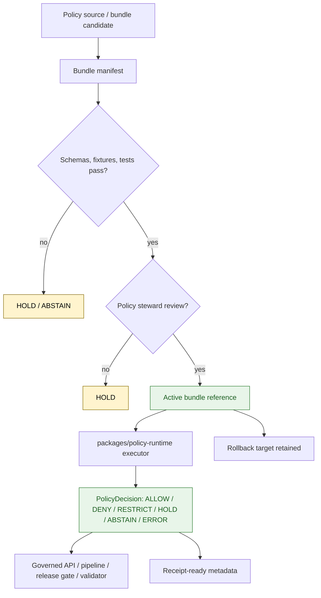

<!-- [KFM_META_BLOCK_V2]
doc_id: kfm://policy/bundles
title: Policy Bundles README
type: policy-readme
version: v0.1
status: draft
owners: OWNER_TBD — Policy steward · Security steward · Release steward · Docs steward
created: 2026-06-15
updated: 2026-06-15
policy_label: restricted
related:
  - ../README.md
  - ../access/README.md
  - ../ai_builder/README.md
  - ../../packages/policy-runtime/README.md
  - ../../apps/governed-api/README.md
  - ../../docs/doctrine/trust-membrane.md
  - ../../docs/doctrine/directory-rules.md
  - ../../docs/doctrine/lifecycle-law.md
  - ../../docs/architecture/contract-schema-policy-split.md
  - ../../schemas/contracts/v1/
  - ../../contracts/
  - ../../release/
tags: [kfm, policy, bundles, policy-runtime, opa, rego, finite-decisions, deny-by-default, receipts]
notes:
  - "Replaces the greenfield bundle stub with a governed policy-bundle README."
  - "policy/bundles/ may hold reviewed policy bundles or bundle manifests only if it remains subordinate to policy/, contracts/, schemas/, release/, and runtime validation."
  - "Policy runtime helper code belongs in packages/policy-runtime/; this lane is not executable application code and not a package."
  - "Implementation depth is UNKNOWN until bundle files, manifests, tests, fixtures, validators, CI workflows, and release gates are inspected."
[/KFM_META_BLOCK_V2] -->

<a id="top"></a>

<div align="center">

# Policy Bundles

`policy/bundles/`

**Governed home for reviewed policy bundle artifacts, bundle manifests, and policy-bundle documentation used by KFM policy runtimes and gates.**


[Scope](#1-scope) · [Repo fit](#2-repo-fit) · [Inputs](#5-inputs) · [Exclusions](#6-exclusions) · [Bundle lifecycle](#7-bundle-lifecycle) · [Diagram](#8-diagram) · [Definition of done](#14-definition-of-done)

</div>

---

> [!IMPORTANT]
> **Status:** draft / `NEEDS VERIFICATION`  
> **Owners:** `OWNER_TBD` — Policy steward · Security steward · Release steward · Docs steward  
> **Path:** `policy/bundles/README.md`  
> **Responsibility root:** `policy/` — policy-as-code and policy documentation  
> **Truth posture:** CONFIRMED file path / PROPOSED bundle-lane contract / UNKNOWN runtime enforcement

> [!CAUTION]
> A policy bundle is not release approval. A bundle may produce or support `ALLOW`, `DENY`, `RESTRICT`, `HOLD`, `ABSTAIN`, or `ERROR` decisions, but publication still requires evidence, rights, sensitivity, validation, review state, release state, correction path, and rollback support appropriate to the surface.

---

## Quick jump

- [1. Scope](#1-scope)
- [2. Repo fit](#2-repo-fit)
- [3. Bundle authority boundary](#3-bundle-authority-boundary)
- [4. Default posture](#4-default-posture)
- [5. Inputs](#5-inputs)
- [6. Exclusions](#6-exclusions)
- [7. Bundle lifecycle](#7-bundle-lifecycle)
- [8. Diagram](#8-diagram)
- [9. Bundle manifest expectations](#9-bundle-manifest-expectations)
- [10. Decision vocabulary](#10-decision-vocabulary)
- [11. Runtime handoff](#11-runtime-handoff)
- [12. Inspection path](#12-inspection-path)
- [13. Validation expectations](#13-validation-expectations)
- [14. Definition of done](#14-definition-of-done)
- [15. Open verification items](#15-open-verification-items)

---

## 1. Scope

`policy/bundles/` is the policy-root lane for reviewed policy bundles and bundle manifests.

It may eventually contain policy bundle artifacts or metadata that governed runtimes, validators, release gates, map builders, AI adapters, and tests can reference explicitly.

In scope:

- policy bundle identity and manifest conventions
- reviewed bundle metadata
- bundle hash / version / evaluator compatibility posture
- finite policy decision expectations
- obligations such as redaction, generalization, review-required, delayed release, citation-required, or rollback-required flags
- validation and replay expectations
- routing to policy-runtime helper code without making the runtime package the policy authority

Out of scope:

- reusable policy-runtime implementation code
- deployable API routes
- schema definitions
- semantic contracts
- lifecycle data
- receipts and proofs as stored artifacts
- release approval
- source acquisition
- public UI display logic
- secrets or private source material

[Back to top](#top)

---

## 2. Repo fit

| Concern | Owning root | Expected relationship |
|---|---|---|
| Policy bundles and bundle metadata | `policy/bundles/` | This README and future reviewed bundle files, if accepted |
| Policy source rules | `policy/` child lanes | Exact rule homes remain `NEEDS VERIFICATION` |
| Runtime execution helpers | `packages/policy-runtime/` | Executes approved bundles; does not own policy authority |
| Public API enforcement | `apps/governed-api/` | Uses governed policy decisions through explicit interfaces |
| Machine-readable schemas | `schemas/contracts/v1/` | Defines bundle manifest, input, output, and decision shape when present |
| Contract meaning | `contracts/` | Defines semantic obligations and decision meaning |
| Receipts and proofs | `data/receipts/`, `data/proofs/`, or verified homes | Stores auditable outputs; exact homes `NEEDS VERIFICATION` |
| Release decisions | `release/` | Owns promotion, publication, correction, supersession, rollback |
| Tests and fixtures | `tests/policy/`, `fixtures/policy/`, or verified equivalents | Required before promotion beyond draft |

> [!NOTE]
> The policy runtime package README states that policy rules and bundles belong under `policy/`, while `packages/policy-runtime/` is executor-only helper code. This README preserves that split.

## 3. Bundle authority boundary

This lane may hold approved or candidate policy bundles. It must not become a substitute for schemas, contracts, release manifests, receipts, source truth, EvidenceBundles, or deployable application code.

Short rule:

```text
policy/bundles/           = policy bundle artifacts and bundle manifests, if reviewed
packages/policy-runtime/  = reusable evaluator helpers and runtime adapters
schemas/contracts/v1/     = machine-readable input/output/manifest shape
contracts/                = meaning and obligations
release/                  = publication, correction, rollback control
data/                     = lifecycle state, receipts, proofs, artifacts
apps/governed-api/        = executable public trust membrane
```

## 4. Default posture

Policy bundle evaluation should fail closed.

A bundle should not be considered active or safe when any of these are unresolved:

- owner and reviewer
- bundle ID
- version
- hash
- source rule lineage
- evaluator compatibility
- input schema version
- decision vocabulary
- obligation vocabulary
- test coverage
- fixture coverage
- rollback target
- release or deployment path

## 5. Inputs

| Input family | Examples | Required posture |
|---|---|---|
| Bundle source | policy modules, compiled bundle, manifest, rule set | Reviewed, versioned, hashable |
| Bundle metadata | bundle ID, version, owner, reviewer, status, created/updated timestamps | Explicit and auditable |
| Evaluation contract | input schema, output schema, evaluator profile, timeout, fail-closed mode | Version-pinned or marked `NEEDS VERIFICATION` |
| Policy context | audience, operation, object refs, lifecycle phase, source role, rights, sensitivity | Supplied by caller; bundle should not fetch missing facts |
| Evidence context | EvidenceRef, EvidenceBundle status, citation validation status | Consumed as input; not fabricated |
| Validation context | fixtures, tests, golden decisions, reason-code coverage | Required before active use |
| Release context | active, candidate, deprecated, superseded, rollback target | Explicit; never inferred from file location alone |

## 6. Exclusions

| Does not belong here | Correct home |
|---|---|
| Runtime evaluator implementation | `packages/policy-runtime/` |
| Public API routes or middleware | `apps/governed-api/` or verified app home |
| Contract meaning | `contracts/` |
| JSON Schemas or other machine-readable schema authority | `schemas/contracts/v1/` |
| Lifecycle data | `data/` lifecycle roots |
| Stored receipts and proofs | `data/receipts/`, `data/proofs/`, or verified homes |
| Release manifests and rollback authority | `release/` |
| Source descriptors and registries | verified source/catalog/registry homes |
| Secrets, credentials, private keys, tokens | secret manager / deployment config, not repo docs |
| Public UI components | `apps/` or `packages/ui/` |
| AI-generated claims | governed AI runtime outputs with evidence-subordinate handling |

## 7. Bundle lifecycle

Policy bundle promotion should be explicit and reversible.

| State | Meaning | Public/runtime posture |
|---|---|---|
| `draft` | Bundle or manifest is being authored | Not active |
| `candidate` | Bundle is review-ready and testable | May run in validation only |
| `reviewed` | Required stewards approved the bundle | Eligible for staged activation |
| `active` | Bundle may be referenced by governed runtime | Requires manifest, hash, tests, rollback target |
| `deprecated` | Bundle is retained but should not be newly selected | Runtime should prefer newer bundle |
| `superseded` | Bundle replaced by newer approved bundle | Retain for replay and audit |
| `withdrawn` | Bundle must not be used | Runtime should fail closed or route to replacement |

## 8. Diagram


```mermaid
flowchart TD
    author["Policy source / bundle candidate"] --> manifest["Bundle manifest"]
    manifest --> validate{"Schemas, fixtures, tests pass?"}
    validate -->|no| hold["HOLD / ABSTAIN"]
    validate -->|yes| review{"Policy steward review?"}
    review -->|no| hold2["HOLD"]
    review -->|yes| active["Active bundle reference"]
    active --> runtime["packages/policy-runtime executor"]
    runtime --> decision["PolicyDecision: ALLOW / DENY / RESTRICT / HOLD / ABSTAIN / ERROR"]
    decision --> caller["Governed API / pipeline / release gate / validator"]

    active --> rollback["Rollback target retained"]
    decision --> receipt["Receipt-ready metadata"]

    classDef stop fill:#fff4ce,stroke:#8a6d00,color:#000;
    classDef ok fill:#e8f5e9,stroke:#2e7d32,color:#1b5e20;
    class hold,hold2 stop;
    class active,decision ok;
```

## 9. Bundle manifest expectations

A bundle manifest should make replay and audit practical.

| Field | Purpose | Status |
|---|---|---|
| `bundle_id` | Stable identifier for this bundle family | PROPOSED |
| `bundle_version` | Version used by runtime and receipts | PROPOSED |
| `status` | draft / candidate / reviewed / active / deprecated / superseded / withdrawn | PROPOSED |
| `owners` | Steward accountability | NEEDS VERIFICATION |
| `source_paths` | Rule or module lineage | PROPOSED |
| `bundle_hash` | Integrity and replay | PROPOSED |
| `input_schema_ref` | Machine shape of accepted inputs | NEEDS VERIFICATION |
| `decision_schema_ref` | Machine shape of outputs | NEEDS VERIFICATION |
| `evaluator_profile` | OPA/WASM/equivalent runtime expectations | NEEDS VERIFICATION |
| `reason_codes` | Finite decision explanations | PROPOSED |
| `obligations` | Redaction, review, generalization, citation, delayed release, rollback | PROPOSED |
| `tests` | Required validation coverage | NEEDS VERIFICATION |
| `rollback_target` | Safe reversion path | PROPOSED |

## 10. Decision vocabulary

Bundles should return finite, inspectable decisions.

| Decision | Meaning | Required posture |
|---|---|---|
| `ALLOW` | Operation may proceed under stated obligations | Must be scoped and auditable |
| `DENY` | Operation is blocked | Safe reason code required |
| `RESTRICT` | Operation may proceed only under constrained audience, precision, or obligation | Must name constraint |
| `HOLD` | Operation pauses for review, validation, or missing approval | Must name reviewer or gate when safe |
| `ABSTAIN` | Policy cannot decide because required support is missing | Must name missing support where safe |
| `ERROR` | Evaluator, schema, runtime, or bundle failure | Fail closed and record failure |

## 11. Runtime handoff

A runtime caller should pass explicit bundle context to evaluator helpers.

The bundle lane should provide authority-bearing bundle metadata; the runtime package should execute and normalize results without owning policy meaning.

```text
policy/bundles/ manifest + bundle hash
        ↓
packages/policy-runtime evaluator helper
        ↓
finite PolicyDecision + receipt-ready metadata
        ↓
governed API / pipeline / validator / release gate
```

## 12. Inspection path

Bundle format, policy language, tests, fixtures, validators, and CI enforcement remain `NEEDS VERIFICATION`. Use these local inspection commands before treating this lane as active.

```bash
# From the repository root, inspect policy bundles.
find policy/bundles -maxdepth 4 -type f | sort

# Inspect policy roots for rule and bundle candidates.
find policy -maxdepth 4 -type f | sort

# Inspect likely policy-bundle tests and fixtures.
find tests fixtures -maxdepth 5 -type f 2>/dev/null | grep -E 'policy|bundle|rego|opa|decision' | sort
```

## 13. Validation expectations

Useful validation for this lane should cover:

- every active bundle has a manifest
- manifest has stable ID, version, status, owner, hash, evaluator profile, and rollback target
- bundle hash is reproducible
- stale or missing bundle returns `HOLD`, `ABSTAIN`, `DENY`, or `ERROR`, never implicit allow
- decision vocabulary is finite and schema-aligned
- obligations are represented and tested
- sensitive-domain fixtures fail closed by default
- runtime helper can replay a decision from bundle hash, input hash, evaluator profile, and version
- deprecated, superseded, and withdrawn bundles remain auditable but are not newly selected

## 14. Definition of done

- [ ] Owners are confirmed and `OWNER_TBD` is replaced.
- [ ] Accepted bundle format is documented.
- [ ] Bundle manifest schema is created or linked.
- [ ] Policy runtime handoff is verified.
- [ ] Active bundle selection rules are documented.
- [ ] Tests and fixtures cover positive, denied, restricted, held, abstained, stale, withdrawn, and error paths.
- [ ] Bundle integrity hash is reproducible.
- [ ] Rollback target is documented for every active bundle.
- [ ] Release or deployment process records the active bundle version.
- [ ] Public clients cannot select arbitrary unreviewed bundles.

## 15. Open verification items

| Item | Why it matters |
|---|---|
| Confirm policy language and bundle format | Prevents non-runnable bundle guidance |
| Confirm manifest schema home | Keeps machine shape under `schemas/contracts/v1/` |
| Confirm active bundle selection mechanism | Prevents arbitrary runtime selection |
| Confirm tests and fixtures | Required before active use |
| Confirm CI or validator coverage | Avoids claiming enforcement that does not exist |
| Confirm receipt/proof linkage | Required for audit and replay |
| Confirm rollback process | Required for safe policy changes |
| Confirm whether OPA, WASM, or another evaluator is used | Prevents engine-specific overclaiming |

<details>
<summary>Appendix A — illustrative bundle manifest shape</summary>

This example is illustrative. It is not a verified schema.

```json
{
  "bundle_id": "policy-bundle-id-tbd",
  "bundle_version": "0.0.0-draft",
  "status": "candidate",
  "owners": ["OWNER_TBD"],
  "source_paths": ["policy/path/to/rules"],
  "bundle_hash": "HASH_TBD",
  "input_schema_ref": "schemas/contracts/v1/policy/policy_input_bundle.schema.json",
  "decision_schema_ref": "schemas/contracts/v1/policy/policy_decision.schema.json",
  "evaluator_profile": "EVALUATOR_TBD",
  "reason_codes": ["REASON_CODE_TBD"],
  "obligations": ["OBLIGATION_TBD"],
  "rollback_target": "ROLLBACK_TARGET_TBD"
}
```

</details>

<details>
<summary>Appendix B — no-loss preservation note</summary>

The previous file was a short greenfield bundle stub. This README preserves the bundle-root intent and expands it into a governed policy-bundle contract with explicit boundaries, inputs, exclusions, lifecycle states, manifest expectations, validation expectations, and rollback requirements.

</details>

## Status summary

`policy/bundles/` should hold reviewed policy bundle artifacts and bundle manifests only when they remain subordinate to KFM policy, schema, contract, runtime, receipt, proof, release, and lifecycle boundaries.

It should make policy evaluation auditable and replayable without becoming a deployable runtime, schema authority, release authority, source of truth, or public bypass around governed interfaces.

<p align="right"><a href="#top">Back to top</a></p>
