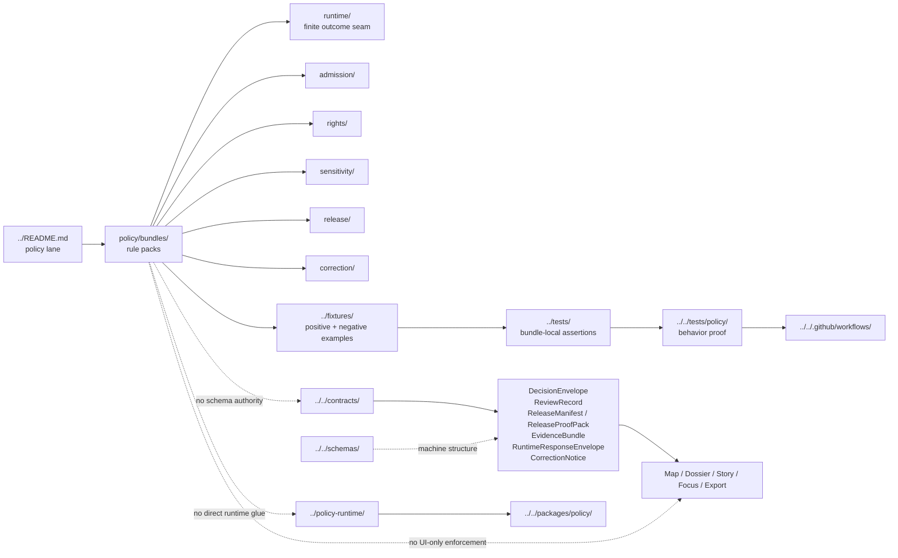

<!-- [KFM_META_BLOCK_V2]
doc_id: kfm://doc/NEEDS_VERIFICATION__assign_uuid
title: Policy Bundles
type: standard
version: v1
status: draft
owners: @bartytime4life
created: NEEDS_VERIFICATION__file_history
updated: 2026-04-23
policy_label: public
related: [../README.md, ./runtime/README.md, ../fixtures/README.md, ../tests/README.md, ../policy-runtime/README.md, ../../contracts/README.md, ../../schemas/README.md, ../../packages/policy/README.md, ../../tests/policy/README.md, ../../tests/validators/README.md, ../../.github/workflows/README.md]
tags: [kfm, policy, bundles, governance, runtime]
notes: [doc_id and created date require repo-backed verification before merge, updated reflects this 2026-04-23 Markdown revision, owner and related links follow adjacent policy README drafts and still need active-branch verification, executable bundle inventory remains NEEDS VERIFICATION until rule files manifests fixtures tests and workflow wiring are inspected]
[/KFM_META_BLOCK_V2] -->

<a id="top"></a>

# Policy Bundles

Executable bundle lane for KFM deny-by-default policy, finite outcome grammar, and reviewable trust seams.

> [!IMPORTANT]
> **Status:** `experimental` · **Doc status:** `draft` · **Owners:** `@bartytime4life` *(verify against active `CODEOWNERS` before merge)* · **Path:** `policy/bundles/README.md`  
>        
> **Quick jump:** [Scope](#scope) · [Repo fit](#repo-fit) · [Accepted inputs](#accepted-inputs) · [Exclusions](#exclusions) · [Directory tree](#directory-tree) · [Quickstart](#quickstart) · [Usage](#usage) · [Diagram](#diagram) · [Reference tables](#reference-tables) · [Task list](#task-list--definition-of-done) · [FAQ](#faq) · [Appendix](#appendix)

---

## Scope

`policy/bundles/` is where KFM policy becomes small, typed, reviewable, and executable.

A policy bundle is not just “some governance code.” In KFM, a bundle should name one trust seam—or one tightly related seam family—and make its result visible enough that reviewers can answer three questions quickly:

1. **What decision does this bundle own?**
2. **What sibling fixtures and tests prove it?**
3. **What downstream trust objects must reflect its result?**

### Status markers used here

| Marker | Meaning in this README |
|---|---|
| **CONFIRMED** | Directly supported by mounted repo evidence or adjacent current repo documentation. |
| **INFERRED** | Strongly supported by current KFM documentation, but not independently proven here as mounted implementation. |
| **PROPOSED** | Repo-native starter structure or maintenance guidance consistent with KFM doctrine. |
| **UNKNOWN** | Not verified strongly enough to state as current repo reality. |
| **NEEDS VERIFICATION** | A branch, path, engine, token, workflow, or ownership detail that should be checked before merge. |

> [!NOTE]
> A subtree can reserve responsibility without proving executable policy maturity. Do not treat a `README.md`, child folder, or future-looking tree as proof of `.rego` files, bundle manifests, fixtures, tests, CI entrypoints, or runtime enforcement.

[Back to top](#top)

---

## Repo fit

This directory sits below the parent `policy/` lane and beside sibling fixture, test, and runtime-coordination surfaces. It should stay close to those surfaces without absorbing their responsibilities.

| Relationship | Surface | Role |
|---|---|---|
| Path | `policy/bundles/README.md` | This directory contract. |
| Parent policy lane | [`../README.md`](../README.md) | Defines policy as the governed executable decision surface. |
| Documented child scaffold | [`./runtime/README.md`](./runtime/README.md) | Runtime-focused bundle subtree placeholder; **not** proof of a mounted executable rule pack by itself. |
| Sibling fixtures | [`../fixtures/README.md`](../fixtures/README.md) | Holds reusable positive, negative, review, and edge examples paired to bundles. |
| Sibling local tests | [`../tests/README.md`](../tests/README.md) | Holds bundle-local assertions and import/path checks. |
| Runtime coordination | [`../policy-runtime/README.md`](../policy-runtime/README.md) | Explains how runtime consumers coordinate with policy without becoming bundle authorship. |
| Contract boundary | [`../../contracts/README.md`](../../contracts/README.md) | Human-readable semantics for trust-bearing objects. |
| Schema boundary | [`../../schemas/README.md`](../../schemas/README.md) | Machine-readable structure; schema-home authority must remain visible. |
| Shared support package | [`../../packages/policy/README.md`](../../packages/policy/README.md) | Loader/helper/adaptor seam, not a second policy authority. |
| Repo-facing proof | [`../../tests/policy/README.md`](../../tests/policy/README.md) | Proves policy behavior under runtime, release, and correction pressure. |
| Validator proof | [`../../tests/validators/README.md`](../../tests/validators/README.md) | Proves checked-in policy data and narrow decision bundles validate and fail closed. |
| Workflow guardrails | [`../../.github/workflows/README.md`](../../.github/workflows/README.md) | Documents automation expectations; checked-in blocking YAML still requires branch verification. |

### Repo-fit rule

`policy/bundles/` owns **decision grammar and rule packs**. It does not own canonical schemas, generic fixtures, generic tests, runtime glue, UI conditionals, secrets, or lifecycle data stores.

[Back to top](#top)

---

## Accepted inputs

The following belong in `policy/bundles/` when they are scoped to a policy seam and paired with fixtures/tests.

| Accepted input | Examples | Conditions |
|---|---|---|
| Bundle manifests | `bundle.yaml`, `bundle.json` | Must name seam, version, owner, rule files, result grammar, fixtures, tests, and downstream trust objects. |
| Machine-readable policy bodies | `*.rego` or repo-approved equivalent | Must be deny-by-default or explicitly explain why not. |
| Bundle-local README/rationale | `runtime/README.md`, `release/README.md` | Should explain what decision the bundle owns and what changed when semantics move. |
| Policy-owned result vocab references | reason codes, obligation codes, review states | Should reference shared registries; avoid local shadow vocabularies. |
| Narrow policy data | small checked-in decision tables where approved | Must remain schema-validated, reviewable, and fail-closed when malformed. |
| Version and migration notes | `CHANGELOG.md`, compatibility notes | Required when a bundle changes result meaning or downstream obligations. |

[Back to top](#top)

---

## Exclusions

`policy/bundles/` should stay narrow. When in doubt, keep authorship, proof, runtime, and data roles separated.

| Does **not** belong here | Put it instead | Why |
|---|---|---|
| Canonical JSON Schema, OpenAPI, or shared object definitions | [`../../contracts/`](../../contracts/) and [`../../schemas/`](../../schemas/) | Shared object shape should not drift into bundle logic. |
| Generic positive/negative examples | [`../fixtures/`](../fixtures/) | Fixtures should be reusable across policy seams. |
| Generic policy tests or runner harnesses | [`../tests/`](../tests/) or [`../../tests/policy/`](../../tests/policy/) | Tests are proof surfaces, not bundle authorship. |
| Runtime loaders, API adapters, decision assemblers, or request mediators | [`../policy-runtime/`](../policy-runtime/) or the verified runtime package/app seam | Execution glue is adjacent to bundles, not inside them. |
| Public API route logic | the verified app/API package | A bundle may inform runtime behavior without becoming route code. |
| Secrets, signing keys, `.env`, or live credentials | secret manager / host configuration | Sensitive operational material must never live in a public rule lane. |
| RAW, WORK, QUARANTINE, PROCESSED, CATALOG, TRIPLET, or PUBLISHED artifacts | [`../../data/README.md`](../../data/README.md) and governed lifecycle stores | Policy governs lifecycle movement; it is not the canonical store. |
| UI-only conditionals treated as policy | nowhere | KFM rejects policy theater in presentation code. |
| Workflow YAML or branch protection rules | [`../../.github/workflows/`](../../.github/workflows/) and platform settings | Workflow orchestration should not hide policy law. |

[Back to top](#top)

---

## Directory tree

### Documented current snapshot — NEEDS VERIFICATION in mounted checkout

```text
policy/
├── README.md
├── bundles/
│   ├── README.md
│   └── runtime/
│       └── README.md
├── fixtures/
│   └── README.md
├── policy-runtime/
│   └── README.md
└── tests/
    └── README.md
```

### This directory’s minimum documented shape

```text
policy/bundles/
├── README.md
└── runtime/
    └── README.md
```

### Smallest useful executable fill — PROPOSED

```text
policy/bundles/
├── README.md
├── runtime/
│   ├── README.md
│   ├── bundle.yaml
│   └── finite_outcomes.rego
├── admission/
│   ├── bundle.yaml
│   └── source_admission.rego
├── rights/
│   ├── bundle.yaml
│   └── access_rights.rego
├── sensitivity/
│   ├── bundle.yaml
│   ├── generalize_or_restrict.rego
│   └── transforms.rego
├── review/
│   ├── bundle.yaml
│   └── steward_review_required.rego
├── release/
│   ├── bundle.yaml
│   └── publication_gate.rego
├── export/
│   ├── bundle.yaml
│   └── export_scope.rego
└── correction/
    ├── bundle.yaml
    └── correction_propagation.rego
```

> [!CAUTION]
> The proposed tree is a buildable starter pattern, not a claim about active branch inventory. Keep documented branch facts and future executable shape visibly separate.

[Back to top](#top)

---

## Quickstart

Run these from the repository root after mounting the real checkout.

### 1. Inspect the bundle lane exactly as it exists

```bash
find policy/bundles -maxdepth 4 -type f 2>/dev/null | sort
find policy/bundles -maxdepth 4 -type d 2>/dev/null | sort
```

### 2. Discover executable bundle artifacts

```bash
find policy/bundles -type f \
  \( -name '*.rego' -o -name 'bundle.*' -o -name '*.yaml' -o -name '*.yml' -o -name '*.json' -o -name '*.md' \) \
  | sort
```

### 3. Trace policy outcomes and trust-object references

```bash
grep -RInE \
  'DecisionEnvelope|ReviewRecord|ReleaseManifest|ReleaseProofPack|EvidenceBundle|RuntimeResponseEnvelope|CorrectionNotice|ANSWER|ABSTAIN|DENY|ERROR|reason_codes|obligation_codes|rights_class|sensitivity_class' \
  policy contracts schemas tests docs apps packages 2>/dev/null || true
```

### 4. Check whether local policy tooling is available

```bash
command -v opa >/dev/null && opa version || echo "opa not found"
command -v conftest >/dev/null && conftest --version || echo "conftest not found"
```

### 5. Run bundle checks only after a runner is verified

```bash
# Example only: adapt to the repo's verified runner and package manager.
if command -v conftest >/dev/null; then
  conftest test policy/bundles
else
  echo "NEEDS VERIFICATION: no conftest runner found on PATH"
fi
```

[Back to top](#top)

---

## Usage

### Add or change a policy bundle

1. Start with the seam, not the filename: `admission`, `rights`, `sensitivity`, `review`, `release`, `runtime`, `export`, or `correction`.
2. Name the decision the bundle owns.
3. Add or update the bundle manifest.
4. Keep result grammar finite.
5. Pair bundle changes with sibling fixtures under [`../fixtures/`](../fixtures/).
6. Pair bundle changes with local assertions under [`../tests/`](../tests/).
7. Escalate runtime, release, or correction behavior proof into [`../../tests/policy/`](../../tests/policy/) or the relevant end-to-end proof lane.
8. Document which downstream trust objects must reflect the decision.

### Minimum bar for calling a bundle executable

A bundle is not “present” merely because a file exists.

| Required element | Why it matters |
|---|---|
| Named trust seam | Reviewers can tell what decision the bundle owns. |
| Explicit version | Semantics can change without invisible drift. |
| Rule file or equivalent machine-readable policy body | The bundle can be executed or evaluated. |
| Finite result grammar | Downstream clients do not invent fifth outcomes. |
| Paired fixtures | Positive and negative paths stay inspectable. |
| Paired tests | Rule behavior is proved, not implied. |
| Downstream trust-object mapping | `DecisionEnvelope`, `RuntimeResponseEnvelope`, `ReleaseManifest`, `EvidenceBundle`, and correction surfaces can carry the result. |
| Rationale or README | Humans can review intent, caveats, and migration impact. |

### Illustrative bundle manifest — PROPOSED

```yaml
bundle_id: kfm.policy.runtime.finite_outcomes
version: v0.1.0
status: proposed
seam: runtime
owner: "@bartytime4life"
engine: opa-rego-starter
result_grammar:
  - allow
  - deny
  - needs-review
runtime_outcomes:
  - ANSWER
  - ABSTAIN
  - DENY
  - ERROR
rule_files:
  - finite_outcomes.rego
fixtures:
  valid:
    - ../../fixtures/runtime/valid/public_answer.yaml
  invalid:
    - ../../fixtures/runtime/invalid/uncited_answer.yaml
tests:
  local:
    - ../../tests/runtime/test_finite_outcomes.md
  repo_facing:
    - ../../../tests/policy/runtime_outcomes/
downstream_trust_objects:
  - RuntimeResponseEnvelope
  - DecisionEnvelope
  - EvidenceBundle
  - AIReceipt
notes:
  - "Illustrative only until active branch runner and schema conventions are verified."
```

[Back to top](#top)

---

## Diagram


```mermaid
flowchart LR
  Policy["../README.md<br/>policy lane"] --> Bundles["policy/bundles/<br/>rule packs"]
  Bundles --> Runtime["runtime/<br/>finite outcome seam"]
  Bundles --> Admission["admission/"]
  Bundles --> Rights["rights/"]
  Bundles --> Sensitivity["sensitivity/"]
  Bundles --> Release["release/"]
  Bundles --> Correction["correction/"]

  Bundles --> Fixtures["../fixtures/<br/>positive + negative examples"]
  Fixtures --> LocalTests["../tests/<br/>bundle-local assertions"]
  LocalTests --> RepoProof["../../tests/policy/<br/>behavior proof"]

  Contracts["../../contracts/"] --> TrustObjects["DecisionEnvelope<br/>ReviewRecord<br/>ReleaseManifest / ReleaseProofPack<br/>EvidenceBundle<br/>RuntimeResponseEnvelope<br/>CorrectionNotice"]
  Schemas["../../schemas/"] -. machine structure .-> TrustObjects

  PolicyRuntime["../policy-runtime/"] --> PackageSupport["../../packages/policy/"]
  RepoProof --> Workflows["../../.github/workflows/"]
  TrustObjects --> Surfaces["Map / Dossier / Story / Focus / Export"]

  Bundles -. "no direct runtime glue" .-> PolicyRuntime
  Bundles -. "no schema authority" .-> Contracts
  Bundles -. "no UI-only enforcement" .-> Surfaces
```

The diagram shows responsibility boundaries, not runtime maturity. A policy bundle can shape downstream behavior only through governed interfaces, proofs, and trust-bearing objects.

[Back to top](#top)

---

## Reference tables

### Policy seam families

| Seam | Bundle responsibility | First thing to prove |
|---|---|---|
| Admission | Whether a source, packet, or candidate artifact may enter a governed path | Unknown source role fails closed. |
| Rights | Whether use, redistribution, export, or public display is permitted | Missing rights block public release. |
| Sensitivity | Whether exact location, personal, cultural, ecological, infrastructure, or restricted data must be held, generalized, or restricted | Sensitive exact geometry does not cross public surfaces by default. |
| Review | Whether a machine decision is enough or steward/human review is required | `needs-review` is visible, not silently allowed. |
| Release | Whether publication can proceed | Release requires evidence, validation, policy, review, and rollback target. |
| Runtime | Whether a public or UI request can answer, abstain, deny, or error | No uncited fifth outcome. |
| Export | Whether a package, download, or derivative may leave the governed surface | Export scope follows rights, sensitivity, and release posture. |
| Correction | Whether withdrawal, supersession, or correction must propagate | `withdrawn` and `superseded` survive downstream. |

### Policy result grammar

| Result / state | Meaning | Expected consequence |
|---|---|---|
| `allow` | Request or release is policy-safe as scoped | Continue with named obligations. |
| `deny` | Rights, sensitivity, actor, evidence, or release posture blocks the action | Explicit denial with stable reason. |
| `generalize` | Exposure is allowed only after masking, aggregation, or geometry reduction | Visible transform state and receipt linkage. |
| `restrict` | Surface is limited to a narrower actor, role, or mode | Role-aware exposure; no quiet public fallback. |
| `needs-review` / `STEWARD_REVIEW` | Machine gate cannot safely resolve the case alone | Route to steward review with reason and audit references. |
| `withdrawn` / `superseded` | Trust state changed after release | Preserve lineage and correction visibility. |

### Runtime envelope outcomes

| Outcome | Meaning | Surface behavior |
|---|---|---|
| `ANSWER` | Support is sufficient and policy-safe | Return response with evidence and trust cues. |
| `ABSTAIN` | Evidence is weak, partial, stale, conflicted, or unresolved | Narrow scope or decline with inspectable reason. |
| `DENY` | Policy blocks the request | Calm refusal with accountable reason. |
| `ERROR` | Technical failure prevented reliable governed handling | Explicit failure without pretending policy or evidence passed. |

### Boundary responsibilities

| Surface | Owns what | Should stay out of |
|---|---|---|
| `policy/bundles/` | Rule families, finite decision grammar, and bundle manifests | Generic fixtures, generic tests, schema authority, and app glue. |
| `policy/fixtures/` | Small positive/negative examples | Canonical contracts or runtime code. |
| `policy/tests/` | Bundle-local assertions | Broader repo-facing proof responsibilities. |
| `policy/policy-runtime/` | Runtime-policy coordination notes | Claiming runtime implementation before branch proof. |
| `packages/policy/` | Shared internal policy support code | Replacing top-level policy authority. |
| `tests/policy/` | Behavior proof under runtime/release/correction pressure | Becoming a second bundle tree. |
| `tests/validators/` | Validator proof for machine policy data and narrow decision bundles | Becoming policy authorship. |
| `.github/workflows/` | Workflow orchestration and required-check documentation | Becoming hidden policy law. |

[Back to top](#top)

---

## Task list / definition of done

Before a change to this lane is merged:

- [ ] `doc_id`, `created`, and ownership metadata are replaced with repo-backed values.
- [ ] Relative links are rechecked from `policy/bundles/README.md`.
- [ ] Current branch inventory is inspected and reflected without overstating executable depth.
- [ ] Every executable bundle has a manifest, explicit version, rule body, finite result grammar, fixtures, and tests.
- [ ] Negative paths are present for rights, sensitivity, missing evidence, malformed input, and unsupported runtime outcomes where applicable.
- [ ] New policy law changes pair with sibling fixtures and local assertions.
- [ ] Runtime, release, export, or correction consequences extend [`../../tests/policy/`](../../tests/policy/) or the relevant end-to-end proof lane.
- [ ] No second authoritative contract or schema home grows inside `policy/bundles/`.
- [ ] Runtime glue claims point to the verified package or app seam that actually owns them.
- [ ] Workflow claims stay bounded to what the branch proves in `.github/workflows/`.
- [ ] `OPA/Rego` or any other engine mention remains starter-direction unless checked-in adoption and runner coverage are verified.
- [ ] Correction, review, and denial states remain visible and audit-bearing.
- [ ] Rollback is simple: revert the bundle files, fixtures, tests, and documentation added by the PR; no public release should depend on an unproven starter bundle.

[Back to top](#top)

---

## FAQ

### Is `runtime/README.md` an executable runtime bundle?

No. A subtree README can reserve responsibility, but it does not prove rule semantics, manifests, fixtures, tests, CI entrypoints, or runtime enforcement.

### Are `policy/tests/` and `tests/policy/` the same thing?

No. `policy/tests/` is the bundle-local assertion lane. `tests/policy/` is the broader repo-facing proof lane for behavior under runtime, release, correction, and CI pressure.

### Should bundle fixtures live beside each bundle?

Only if the active repo has intentionally adopted that pattern. The safer default is to keep reusable examples in [`../fixtures/`](../fixtures/) and local assertions in [`../tests/`](../tests/), while each bundle manifest points to both.

### Is OPA/Rego confirmed as the only policy engine?

No. KFM documentation repeatedly treats OPA/Rego as a strong starter direction for deny-by-default policy-as-code, but this README should not overclaim mounted adoption, runner wiring, or merge-blocking enforcement without branch evidence.

### Can policy bundles read RAW, WORK, or QUARANTINE data directly?

No. Bundles evaluate structured inputs and governed metadata. They must not become a bypass around lifecycle, validation, evidence resolution, or source-right controls.

### Can UI conditionals replace a bundle?

No. UI trust cues should reflect backend, review, release, and runtime policy decisions. Presentation logic is not policy enforcement.

[Back to top](#top)

---

## Appendix

<details>
<summary><strong>Lowest-friction next executable fill — PROPOSED</strong></summary>

| Lane | First evidence-bearing addition | Why it is the smallest useful move |
|---|---|---|
| `policy/bundles/runtime/` | `bundle.yaml` plus one finite-outcome rule body | Converts the documented child scaffold into a testable decision seam. |
| `policy/fixtures/runtime/` | One valid public answer case and one uncited/unsafe negative case | Makes deny-by-default behavior inspectable. |
| `policy/tests/runtime/` | One local assertion pack | Proves the bundle does what the README says. |
| `tests/policy/runtime-outcomes/` | One repo-facing proof pack | Proves local bundle semantics survive broader runtime pressure. |
| `tests/validators/` | One validator-focused proof for manifest shape | Proves checked-in policy metadata stays machine-valid and fail-closed. |
| `policy/policy-runtime/` | One coordination note pointing to the real consuming package/app seam | Prevents runtime from staying abstract. |
| `packages/policy/` | One loader or adapter boundary, if the repo has that package | Lets runtime consumers use bundles without relocating policy authority. |

### Starter family order

1. Runtime finite outcomes.
2. Rights and sensitivity denial.
3. Review and release gate.
4. Correction propagation.
5. Export scope.

### Practical reminder

Touch [`../../contracts/README.md`](../../contracts/README.md) and [`../../schemas/README.md`](../../schemas/README.md) whenever a policy change:

- introduces a new trust-bearing object family,
- changes who owns a shared vocabulary,
- or starts sounding like a second authoritative schema home.

</details>

[Back to top](#top)
