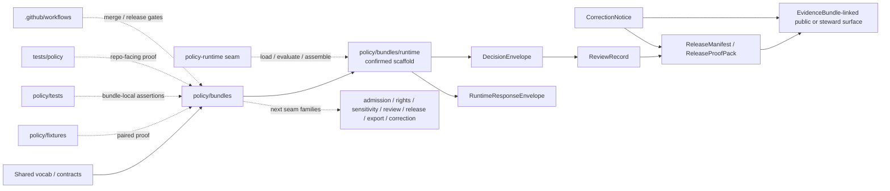

<!-- [KFM_META_BLOCK_V2]
doc_id: kfm://doc/NEEDS_VERIFICATION__assign_uuid
title: Policy Bundles
type: standard
version: v1
status: draft
owners: @bartytime4life
created: NEEDS_VERIFICATION__file_history_shows_recreate_cycles
updated: 2026-04-05
policy_label: public
related: [../README.md, ./runtime/README.md, ../fixtures/README.md, ../tests/README.md, ../policy-runtime/README.md, ../../contracts/README.md, ../../schemas/README.md, ../../packages/policy/README.md, ../../tests/policy/README.md, ../../.github/workflows/README.md]
tags: [kfm, policy, bundles, runtime]
notes: [doc_id placeholder pending UUID assignment, created date still needs branch-level history verification, updated in the current session after public-main reinspection including the confirmed policy/bundles/runtime/README.md scaffold, status remains draft because checked-in rule files manifests fixtures and tests are not yet proven in this lane]
[/KFM_META_BLOCK_V2] -->

# Policy Bundles

Executable bundle lane for KFM deny-by-default policy, finite outcome grammar, and reviewable trust seams.

> **Status:** `experimental`  
> **Owners:** `@bartytime4life`  
> **Path:** `policy/bundles/README.md`  
>        
> **Repo fit:** parent [`../README.md`](../README.md) · confirmed child scaffold [`./runtime/README.md`](./runtime/README.md) · sibling fixtures [`../fixtures/README.md`](../fixtures/README.md) · sibling tests [`../tests/README.md`](../tests/README.md) · runtime coordination [`../policy-runtime/README.md`](../policy-runtime/README.md) · contract boundary [`../../contracts/README.md`](../../contracts/README.md) · schema boundary [`../../schemas/README.md`](../../schemas/README.md) · shared package boundary [`../../packages/policy/README.md`](../../packages/policy/README.md) · repo-facing proof lane [`../../tests/policy/README.md`](../../tests/policy/README.md) · workflow guardrails [`../../.github/workflows/README.md`](../../.github/workflows/README.md)  
> **Quick jump:** [Scope](#scope) · [Current public delta](#current-public-delta) · [Repo fit](#repo-fit) · [Accepted inputs](#accepted-inputs) · [Exclusions](#exclusions) · [Directory tree](#directory-tree) · [Quickstart](#quickstart) · [Usage](#usage) · [Diagram](#diagram) · [Tables](#tables) · [Task list](#task-list--definition-of-done) · [FAQ](#faq) · [Appendix](#appendix)

> [!IMPORTANT]
> Current public `main` no longer supports the literal claim that `policy/bundles/` is `README.md` only. The lane now includes a confirmed child scaffold at `policy/bundles/runtime/README.md`. That is a real structural change, but it still falls short of mounted executable bundles: no checked-in `.rego` files, bundle manifests, fixture payloads, or bundle-local assertion packs are evidenced here yet.

## Scope

`policy/bundles/` is where KFM policy should become small, typed, reviewable, and executable.

The bundle lane is not a generic place for “any governance file.” Its job is narrower and more consequential: hold the rule packs that shape admission, rights, sensitivity, review, release, runtime, export, and correction behavior under KFM’s default-deny posture. These bundles should explain why a result happened, what obligations follow, and which downstream trust objects must carry the decision.

### Status markers used here

| Marker | Meaning in this README |
|---|---|
| **CONFIRMED** | Visible in the current public repo tree or directly stated by adjacent current repo docs |
| **INFERRED** | Strongly supported by the current repo docs, but not established here as a mounted implementation fact |
| **PROPOSED** | Repo-native starter structure or maintenance guidance consistent with KFM doctrine |
| **UNKNOWN** | Not verified strongly enough to state as current repo reality |
| **NEEDS VERIFICATION** | A path, engine detail, token, or workflow behavior that should be checked before merge |

### Working rule

One bundle should map to one trust seam—or to one tightly related seam family—so reviewers can answer three questions quickly:

1. What decision does this bundle own?
2. What sibling fixtures and tests prove it?
3. What downstream trust objects must reflect its result?

[Back to top](#policy-bundles)

## Current public delta

This revision preserves the current README’s strongest structure, but it corrects one repo-visible inventory detail and makes the consequence explicit.

| Earlier wording to retire | Current public reading | Why the correction matters | Status |
|---|---|---|---|
| “`policy/bundles/` currently shows `README.md` only” | `policy/bundles/runtime/README.md` is publicly reachable on `main` | Root inventory language should not erase a confirmed child scaffold | **CONFIRMED** |
| runtime seam treated only as a future starter shape inside this directory | `runtime/` is now a real subtree, but its checked-in content is still a one-line scaffold README | The lane is more explicit structurally, not more executable semantically | **CONFIRMED** |
| parent-lane shorthand can stand in for leaf-lane reality | this leaf README should carry the fresher subtree fact even if adjacent docs lag | Local README truth should follow the checked-out branch, not inherited shorthand | **INFERRED** |

> [!NOTE]
> Treat the confirmed `runtime/` subtree as a placement signal, not as proof of a mounted runtime policy pack. A subtree README can reserve responsibility without proving rule bodies, fixtures, tests, or CI entrypoints.

[Back to top](#policy-bundles)

## Repo fit

This directory sits below the parent `policy/` lane and beside sibling `fixtures/`, `tests/`, and runtime-coordination docs. It should stay close to those surfaces, but it should not absorb their responsibilities.

| Item | What to treat as current |
|---|---|
| Path | `policy/bundles/README.md` |
| Confirmed current snapshot | `policy/bundles/` contains `README.md` and `runtime/README.md` |
| Confirmed child scaffold | [`./runtime/README.md`](./runtime/README.md) exists as a runtime-focused subtree placeholder, not a proven rule pack |
| Parent lane | [`../README.md`](../README.md) defines `policy/` as the governed executable policy surface |
| Sibling verification lanes | [`../fixtures/README.md`](../fixtures/README.md) and [`../tests/README.md`](../tests/README.md) should carry paired proof, not hidden bundle-local drift |
| Runtime coordination seam | [`../policy-runtime/README.md`](../policy-runtime/README.md) explains runtime-policy boundaries and coordination expectations |
| Package boundary | [`../../packages/policy/README.md`](../../packages/policy/README.md) is the shared internal support seam; it should not become a second policy authority |
| Repo-facing proof lane | [`../../tests/policy/README.md`](../../tests/policy/README.md) is the broader policy-behavior proof surface for runtime, release, and correction pressure |
| Schema / contract boundary | [`../../contracts/README.md`](../../contracts/README.md) remains the stronger current machine-contract lane; [`../../schemas/README.md`](../../schemas/README.md) keeps schema-home authority visibly unresolved |
| Workflow guardrails | [`../../.github/workflows/README.md`](../../.github/workflows/README.md) is the current automation lane; on public `main` it still documents expectations more clearly than it proves checked-in YAML gate coverage |
| Ownership | `/policy/` routes to `@bartytime4life` in `CODEOWNERS` |

> [!CAUTION]
> `policy/bundles/` is not the place to resolve `contracts/` versus `schemas/` authority by accident. If a bundle depends on shared reason, obligation, rights, or sensitivity vocabularies, reference the chosen shared home or document the interim ownership explicitly. Do not let a second authoritative registry quietly grow here.

### Why this README exists

The lane no longer needs only a “directory exists” placeholder. It needs a narrow contract a maintainer can use to answer:

- what belongs in a bundle,
- what must stay out,
- how this directory relates to fixtures, tests, and runtime mediation,
- how a subtree scaffold differs from an executable bundle,
- and what “done” looks like for a policy-significant change.

[Back to top](#policy-bundles)

## Accepted inputs

Only content that helps `policy/bundles/` behave like an executable, reviewable rule lane belongs here.

| Input class | What belongs here | Examples |
|---|---|---|
| Bundle rule files | Rule packs that decide a bounded trust seam | `*.rego`, seam-local helper modules, machine-readable rule files |
| Bundle manifests / indexes | Files that identify seam, version, dependencies, and paired verification | `bundle.yaml`, `bundle.json`, manifest notes |
| Seam-local subtree READMEs | Minimal boundary notes for a specific bundle family that already has a checked-in subtree | `runtime/README.md` |
| Bundle-local glossary notes | Minimal human-readable notes that keep review practical | `glossary.md`, outcome notes, steward-facing seam notes |
| Shared imports used by multiple bundle families | Helper modules that stay inside the bundle lane and do not replace runtime code | `shared/imports.rego`, common predicates, result helpers |
| Bundle-local reference maps | Explicit references to sibling fixtures, tests, and shared vocabularies | fixture index, test index, dependency notes |

### Distinguish a subtree from an executable bundle

A subtree can be present without the bundle being executable.

| Shape | What it proves | What it does **not** prove |
|---|---|---|
| subtree README only | responsibility has been reserved visibly in the tree | rule semantics, manifests, fixtures, tests, or CI entrypoints |
| executable bundle | machine-readable rule body plus explicit verification coupling | repo-wide runtime adoption or release enforcement by itself |

### Minimum bar for calling a bundle executable

A bundle is not “present” merely because a file exists. The minimum useful bar is:

- the trust seam is named,
- the bundle version is explicit,
- at least one rule file or equivalent machine-readable policy body exists,
- the result grammar is finite,
- paired fixtures exist,
- paired tests exist,
- downstream trust objects affected by the bundle are named,
- and the README or rationale explains what changed if semantics move.

[Back to top](#policy-bundles)

## Exclusions

`policy/bundles/` should stay narrow.

| Does **not** belong here | Put it instead | Why |
|---|---|---|
| Canonical JSON Schema / OpenAPI definitions | [`../../contracts/`](../../contracts/) | Shared object shape should not drift into bundle logic |
| A second authoritative schema home | [`../../schemas/README.md`](../../schemas/README.md) boundary guidance | Parallel contract law is risk, not resilience |
| Generic policy fixtures | [`../fixtures/`](../fixtures/) | Bundle verification should stay inspectable and reusable across seams |
| Generic policy tests | [`../tests/`](../tests/) | Tests should remain a sibling proof surface |
| Runtime bundle loaders, API adapters, decision assemblers | runtime coordination [`../policy-runtime/README.md`](../policy-runtime/README.md) or the verified runtime package | Execution glue is adjacent to the bundle lane, not the bundle lane |
| Public API enforcement code or request-time route logic | the verified app or package seam that owns outward behavior | A bundle may inform runtime behavior without becoming runtime code |
| Secrets, signing keys, `.env`, live credentials | secret manager / host config | Sensitive operational material must not live in a public rule lane |
| RAW / WORK / QUARANTINE / PROCESSED / CATALOG / PUBLISHED artifacts | [`../../data/README.md`](../../data/README.md) | Policy governs these artifacts; it is not their canonical store |
| UI-only conditionals treated as the only policy surface | nowhere | KFM rejects policy theater in presentation code |

[Back to top](#policy-bundles)

## Directory tree

### Current public snapshot (**CONFIRMED**)

```text
policy/
├── README.md
├── bundles/
│   ├── README.md
│   └── runtime/
│       └── README.md
├── fixtures/
│   └── README.md
├── policy-runtime/
│   └── README.md
└── tests/
    └── README.md
```

### This directory today (**CONFIRMED**)

```text
policy/bundles/
├── README.md
└── runtime/
    └── README.md
```

### Smallest next executable fill after the current runtime scaffold (**PROPOSED**)

```text
policy/bundles/
├── README.md
├── runtime/
│   ├── README.md
│   ├── bundle.yaml
│   └── finite_outcomes.rego
├── admission/
│   ├── bundle.yaml
│   └── source_admission.rego
├── rights/
│   ├── bundle.yaml
│   └── access_rights.rego
├── sensitivity/
│   ├── bundle.yaml
│   ├── generalize_or_restrict.rego
│   └── transforms.rego
├── review/
│   ├── bundle.yaml
│   └── steward_review_required.rego
├── release/
│   ├── bundle.yaml
│   └── publication_gate.rego
├── export/
│   ├── bundle.yaml
│   └── export_scope.rego
└── correction/
    ├── bundle.yaml
    └── correction_propagation.rego
```

> [!NOTE]
> The tree above is a buildable starter pattern, not a claim about the mounted branch. Keep the current public snapshot and the proposed target shape visibly separate.

[Back to top](#policy-bundles)

## Quickstart

### 1) Confirm the root and child scaffolds that are actually checked in

```bash
find policy/bundles -maxdepth 2 -type f 2>/dev/null | sort
```

### 2) Discover real bundle artifacts

```bash
find policy/bundles -type f \
  \( -name '*.rego' -o -name 'bundle.*' -o -name '*.yaml' -o -name '*.yml' -o -name '*.json' -o -name '*.md' \) \
  | sort
```

### 3) Trace current runtime-subtree references

```bash
grep -R -n 'policy/bundles/runtime' policy docs packages tests .github 2>/dev/null || true
```

### 4) Trace trust-bearing joins

```bash
grep -R -nE \
  'DecisionEnvelope|ReviewRecord|ReleaseManifest|ReleaseProofPack|EvidenceBundle|RuntimeResponseEnvelope|CorrectionNotice|reason_codes|obligation_codes|rights_class|sensitivity_class' \
  policy contracts tests docs apps packages 2>/dev/null || true
```

### 5) Check paired verification

```bash
find policy/fixtures policy/tests -maxdepth 4 -type f 2>/dev/null | sort

grep -R -nE \
  'allow|deny|generalize|restrict|review|required|withdraw|supersede|ANSWER|ABSTAIN|DENY|ERROR' \
  policy/fixtures policy/tests 2>/dev/null || true
```

### 6) Inspect workflow references

```bash
find .github/workflows -maxdepth 2 -type f 2>/dev/null | sort

grep -R -nE 'opa|rego|conftest|policy|DecisionEnvelope|RuntimeResponseEnvelope|CorrectionNotice' \
  .github/workflows policy tests docs 2>/dev/null || true
```

### 7) Optional local policy check

```bash
# Illustrative only — verify the real entrypoint before relying on it in CI.
conftest test policy/bundles
```

> [!TIP]
> These commands are discovery tools, not proof by themselves. Update this README to match the checked-out branch after inspection; do not let the README drift ahead of the lane it describes.

[Back to top](#policy-bundles)

## Usage

### Extend the confirmed `runtime/` scaffold safely

1. Keep `./runtime/README.md` as the subtree contract until real rule files land.
2. Add one explicit bundle manifest and one finite-outcomes rule file before widening the runtime seam further.
3. Add paired fixtures in `../fixtures/` and paired tests in `../tests/` in the same PR.
4. Name the downstream trust objects the bundle is expected to emit or constrain.
5. Record rollback posture if the change can affect outward runtime, release, export, or correction behavior.

### Add a new bundle family

1. Start from the trust seam, not the filename.
2. Decide whether the new rule belongs in an existing seam family or needs its own family.
3. Name the bundle so a reviewer can infer its responsibility quickly.
4. Reference the shared vocabulary that explains its reasons and obligations.
5. Add paired fixtures in `../fixtures/`.
6. Add paired tests in `../tests/`.
7. Document which downstream trust objects must reflect the result.

### Change a bundle safely

1. Keep semantic changes explicit.
2. Bump the bundle version when the meaning of a result changes.
3. Do not rename or repurpose reason or obligation semantics casually.
4. Re-check sibling fixtures and tests in the same PR.
5. Update steward notes when a changed rule alters public or reviewer-visible behavior.
6. Record rollback posture if the change touches release, runtime, export, or correction seams.

### Keep the bundle lane singular

- A bundle may **reference** contracts, fixtures, tests, and runtime mediation.
- A bundle may **not** silently replace them.
- If a helper starts behaving like runtime code, move it to the verified runtime seam.
- If a bundle starts collecting canonical schemas or duplicated registries, stop and resolve authority first.

### Change review expectation

A policy-significant PR should remain small, reversible, and additive where possible. For this lane, that normally means:

- one seam-focused change,
- explicit fixtures and tests,
- steward rationale where semantics matter,
- no hidden widening of trust scope,
- and inventory language that matches the checked-out branch exactly.

[Back to top](#policy-bundles)

## Diagram


```mermaid
flowchart LR
    V[Shared vocab / contracts] --> B[policy/bundles]
    B --> RT[policy/bundles/runtime<br/>confirmed scaffold]
    B -. next seam families .-> NX[admission / rights / sensitivity / review / release / export / correction]

    RT --> D[DecisionEnvelope]
    RT --> RR[RuntimeResponseEnvelope]
    D --> R[ReviewRecord]
    R --> M[ReleaseManifest / ReleaseProofPack]
    M --> E[EvidenceBundle-linked public or steward surface]
    C[CorrectionNotice] --> M
    C --> E

    F[policy/fixtures] -. paired proof .-> B
    T[policy/tests] -. bundle-local assertions .-> B
    TP[tests/policy] -. repo-facing proof .-> B
    W[.github/workflows] -. merge / release gates .-> B
    PR[policy-runtime seam] -. load / evaluate / assemble .-> RT
```

Above: `policy/bundles/` is the executable rule lane between shared vocab and contracts and the trust-bearing artifacts that make review, release, runtime, and correction reconstructable. The confirmed `runtime/` subtree makes the lane more explicit structurally, but it does not by itself prove executable rule content.

[Back to top](#policy-bundles)

## Tables

### Current confirmed surfaces inside `policy/bundles/`

| Surface | Current status | What it proves | What it does **not** prove |
|---|---|---|---|
| `README.md` | **CONFIRMED** | the root lane has a checked-in boundary contract and inventory guide | executable bundles by itself |
| `runtime/README.md` | **CONFIRMED** scaffold-only | a runtime-focused child seam has been reserved in the public tree | checked-in `.rego`, `bundle.yaml`, fixtures, tests, or CI wiring |

### Core bundle seams (**PROPOSED starter grouping**)

| Bundle seam | Primary question | Typical downstream consequence | Must coordinate with |
|---|---|---|---|
| admission | Can candidate material enter the governed path? | allow / hold / deny | source descriptors, validation, review |
| rights | Does this actor or surface have permitted use? | deny / restrict | rights vocab, release scope, exports |
| sensitivity | Must detail be generalized, withheld, or narrowed? | generalize / restrict / hold | transform receipts, release scope, EvidenceBundle |
| review | Does steward approval become mandatory here? | review-required | ReviewRecord, queue semantics |
| release | May candidate material become publishable? | allow / deny / hold | DecisionEnvelope, ReleaseManifest / proof pack |
| runtime | May a claim-bearing surface answer or export now? | finite outcome behavior | RuntimeResponseEnvelope, EvidenceBundle |
| export | May an outward artifact leave the governed surface? | allow / deny / transform | release scope, rights, sensitivity |
| correction | How do withdrawal and supersession propagate? | withdrawn / superseded / correction-pending | CorrectionNotice, visible state cues |

### Result grammar to keep explicit

| Result / state | Meaning | Expected visible consequence |
|---|---|---|
| `allow` | Action is permitted as scoped | Continue with named obligations |
| `deny` | Rights, sensitivity, actor, or scope blocks the action | Stable denial with explicit reason |
| `generalize` | Release is allowed only after narrowing or masking | Visible transform state and receipt linkage |
| `restrict` | Action is allowed only for a narrower actor or mode | No quiet fallback to public |
| `review-required` | Machine policy alone is insufficient | Review queue plus explicit waiting reason |
| `withdrawn` | Prior surface must no longer present as current | Visible withdrawal state plus lineage |
| `superseded` | Prior surface remains inspectable but no longer current | Visible supersession pointer |
| `ANSWER` / `ABSTAIN` / `DENY` / `ERROR` | Finite runtime outcomes for claim-bearing response paths | No silent fifth outcome |

### What should trigger a bundle version bump

| Change type | Bump? | Why |
|---|---|---|
| comment-only clarification | usually no | semantics unchanged |
| helper refactor with identical semantics | maybe not | prove with unchanged fixtures and tests |
| new reason or obligation meaning | yes | public and reviewer-visible interpretation changed |
| `allow` → `generalize` / `restrict` / `deny` change | yes | trust behavior changed |
| new review-required path | yes | workflow burden changed |
| correction propagation change | yes | downstream lineage behavior changed |

[Back to top](#policy-bundles)

## Task list — definition of done

- [ ] The trust seam is named clearly.
- [ ] The bundle has an explicit version.
- [ ] Shared vocab dependencies are referenced without quietly duplicating authority.
- [ ] Paired fixtures exist for at least one happy path and one negative path.
- [ ] Paired tests exist for the same seam.
- [ ] The bundle’s downstream trust objects are named (`DecisionEnvelope`, `ReviewRecord`, `RuntimeResponseEnvelope`, `CorrectionNotice`, or release artifacts as relevant).
- [ ] Result grammar stays finite and explicit.
- [ ] Public or steward-visible state changes are documented.
- [ ] Rollback or correction expectations are noted when semantics affect release or runtime trust.
- [ ] Current inventory language matches the checked-out branch, including confirmed child scaffolds.
- [ ] This README still distinguishes **CONFIRMED** current repo state from **PROPOSED** starter structure.

[Back to top](#policy-bundles)

## FAQ

### Why does this README no longer say `policy/bundles/` is `README.md` only?

Because current public `main` also exposes `./runtime/README.md`. The earlier wording was useful when the lane was flatter, but it is now too stale to keep repeating.

### Why is the lane still called scaffold-level if `runtime/` exists?

Because subtree placement is not the same thing as executable policy content. A scaffold can reserve responsibility visibly while still lacking rule files, manifests, paired fixtures, paired tests, and mounted runtime adoption.

### Why should bundles stay separate from `policy-runtime`?

Because rule definition and rule execution are different seams. Keeping them separate makes review clearer and prevents runtime glue from silently becoming authoritative policy law.

### Why not put canonical reason or obligation registries directly here?

Because the repo already keeps contract and schema authority visibly unresolved between `contracts/` and `schemas/`. This leaf should not make that decision accidentally.

### Why does this README emphasize negative paths so heavily?

Because KFM treats fail-closed behavior as trust-preserving behavior. Denial, restriction, abstention, generalization, withdrawal, supersession, and visible error handling are not edge cases to hide.

[Back to top](#policy-bundles)

## Appendix

<details>
<summary>Illustrative starter runtime bundle manifest (PROPOSED)</summary>

This example is illustrative only. It is a starter shape for discussion, not a claim about the mounted branch.

```yaml
bundle_id: policy.runtime.v1
bundle_version: 0.1.0
seam: runtime
status: draft
depends_on:
  - NEEDS_VERIFICATION__authoritative_reason_codes_path
  - NEEDS_VERIFICATION__authoritative_obligation_codes_path
rules:
  - finite_outcomes.rego
  - citation_required.rego
paired_fixtures:
  - ../fixtures/runtime/allow_answer.json
  - ../fixtures/runtime/deny_missing_rights.json
paired_tests:
  - ../tests/runtime/test_finite_outcomes.rego
emits:
  - DecisionEnvelope
  - RuntimeResponseEnvelope
review_notes:
  - "Use when claim-bearing runtime behavior must remain finite and cite-or-abstain."
```

</details>

[Back to top](#policy-bundles)
