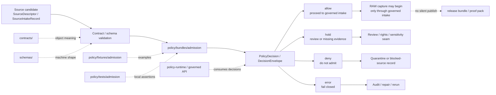

<!-- [KFM_META_BLOCK_V2]
doc_id: kfm://doc/NEEDS_VERIFICATION__policy_bundles_admission_readme
title: Admission Policy Bundle
type: standard
version: v1
status: draft
owners: NEEDS_VERIFICATION__policy_owners
created: 2026-04-23
updated: 2026-04-23
policy_label: NEEDS_VERIFICATION__public_or_internal
related: [../README.md, ../runtime/README.md, ../../README.md, ../../fixtures/README.md, ../../tests/README.md, ../../policy-runtime/README.md, ../../../contracts/README.md, ../../../schemas/README.md, ../../../tests/policy/README.md, ../../../tests/validators/README.md, ../../../tools/validators/README.md, ../../../.github/workflows/README.md]
tags: [kfm, policy, bundles, admission, source-admission]
notes: [Leaf path, owner, doc_id, policy label, bundle runner, companion rule files, CODEOWNERS coverage, and workflow enforcement remain active-branch verification items; this README is grounded in KFM policy-bundle doctrine and surfaced adjacent README patterns.]
[/KFM_META_BLOCK_V2] -->

<a id="top"></a>

# Admission Policy Bundle

Source-admission policy lane for deciding whether a candidate source may enter governed KFM intake, must be held for review, or must fail closed before fetch or publication.

> [!IMPORTANT]
> **Status:** `experimental`  
> **Owners:** `NEEDS_VERIFICATION__policy_owners`  
> **Path:** `policy/bundles/admission/README.md`  
> **Repo fit:** child policy-bundle README under [`../README.md`](../README.md), downstream of [`../../README.md`](../../README.md), and adjacent to fixture, test, runtime, contract, and schema authority surfaces.  
> **Quick jumps:** [Scope](#scope) · [Repo fit](#repo-fit) · [Accepted inputs](#accepted-inputs) · [Exclusions](#exclusions) · [Directory tree](#directory-tree) · [Quickstart](#quickstart) · [Usage](#usage) · [Diagram](#diagram) · [Operating tables](#operating-tables) · [Task list](#task-list--definition-of-done) · [FAQ](#faq) · [Appendix](#appendix)


> [!WARNING]
> Admission is not ingestion. Admission is not publication. Admission is the preflight policy seam that prevents unclear source identity, rights, sensitivity, cadence, or support from quietly entering the KFM truth path.

---

## Scope

`policy/bundles/admission/` is the policy-bundle seam for **source admission**.

Its job is to answer one narrow question:

> Is this source candidate eligible to proceed toward governed intake, or must KFM hold, deny, quarantine, or escalate it before any normal fetch, processing, release, runtime answer, map layer, or export can rely on it?

### What this bundle governs

**CONFIRMED doctrine / PROPOSED leaf implementation.** Source admission should evaluate the source candidate before the project treats it as fetchable or publishable. The admission check should preserve:

- source identity and steward / owner context
- source role and authority class
- rights, license, attribution, reuse, and automation posture
- spatial and temporal support
- freshness, update cadence, and expected mutability
- schema / shape expectations
- CRS, datum, unit, and normalization expectations where applicable
- sensitivity or exact-location risk flags
- intended KFM use and publication intent
- expected QA and validation plan
- explicit reason and obligation codes for any result

### What this bundle does not govern

Admission does **not** replace sibling or downstream seams.

It does not decide final public release, perform rights analysis for every asset, apply exact-location redaction, generate MapLibre layers, emit runtime answers, or overwrite review state. Those responsibilities stay with rights, sensitivity, review, release, runtime, correction, contracts, schemas, validators, tests, and governed API surfaces.

[Back to top](#top)

---

## Repo fit

| Direction | Surface | Why it matters |
|---|---|---|
| Parent bundle lane | [`../README.md`](../README.md) | Defines the policy-bundle family and sibling seams such as rights, sensitivity, review, release, runtime, export, and correction. |
| Policy root | [`../../README.md`](../../README.md) | Owns top-level policy posture, seam routing, deny-by-default expectations, and reason / obligation discipline. |
| Runtime bundle sibling | [`../runtime/README.md`](../runtime/README.md) | Keeps outward finite runtime outcomes separate from source admission. |
| Local fixtures | [`../../fixtures/README.md`](../../fixtures/README.md) | Admission fixtures should prove positive and negative source-candidate cases without copying live source payloads. |
| Local policy tests | [`../../tests/README.md`](../../tests/README.md) | Bundle-local assertions belong near policy, but do not replace repo-wide proof. |
| Runtime coordination | [`../../policy-runtime/README.md`](../../policy-runtime/README.md) | Runtime loaders or request mediators should consume bundle decisions without becoming the bundle. |
| Contract authority | [`../../../contracts/README.md`](../../../contracts/README.md) | Trust-bearing object meaning belongs upstream from this bundle. |
| Schema authority | [`../../../schemas/README.md`](../../../schemas/README.md) | Machine shape belongs in the repo-confirmed schema home, not in policy prose. |
| Broader proof lane | [`../../../tests/policy/README.md`](../../../tests/policy/README.md) | Proves policy behavior survives beyond the local bundle lane. |
| Validator proof lane | [`../../../tests/validators/README.md`](../../../tests/validators/README.md) | Proves checked-in policy and policy-evaluated artifacts remain machine-valid and fail closed. |
| Validator helpers | [`../../../tools/validators/README.md`](../../../tools/validators/README.md) | Shape and linkage validation should happen before policy decision logic is trusted. |
| Workflow guardrails | [`../../../.github/workflows/README.md`](../../../.github/workflows/README.md) | Documents gate expectations without implying active branch enforcement from this README alone. |

> [!NOTE]
> This README intentionally treats `contracts/` and `schemas/` as upstream authority surfaces. A source-admission bundle may reference `SourceDescriptor`, `SourceIntakeRecord`, `IngestReceipt`, `ValidationReport`, `DecisionEnvelope`, or `PolicyDecision`; it should not fork their canonical definitions.

[Back to top](#top)

---

## Accepted inputs

### Input classes

| Input class | What belongs here | Notes |
|---|---|---|
| `SourceDescriptor` candidate | identity, steward, source role, access mode, rights posture, support, cadence, validation plan, publication intent | The preferred admission subject. Exact schema path remains `NEEDS VERIFICATION`. |
| `SourceIntakeRecord` candidate | intake request metadata, proposer, intended KFM lane, intended lifecycle action, scope notes | Useful where the repo distinguishes source definition from intake request. |
| Preflight / probe receipt | bounded process memory proving a documented source check occurred | Must not become a hidden fetch or ungoverned scraper. |
| Validation summary | schema-shape result, required-field checks, source-role check, URL / endpoint check, cadence check | Validation should run before policy grants normal movement. |
| Rights / terms summary | license class, attribution rule, redistribution posture, automation constraints, unknowns | Unknown rights should not be treated as public-safe by default. |
| Sensitivity preflight | exact-location risk, living-person risk, cultural / steward review risk, infrastructure risk, rare-species risk | Admission can require downstream sensitivity review; it should not silently waive it. |
| Source-role evidence | direct observation, statutory / regulatory record, operational context, discovery mirror, modeled surface, documentary evidence, crosswalk system | Roles are not interchangeable. |
| Fixture examples | tiny valid and invalid candidate payloads | Keep fixtures synthetic, public-safe, and reviewable. |
| Expected decisions | `allow`, `hold`, `deny`, or `error` examples with reason and obligation codes | Exact casing and enum source remain repo-verification items. |

### Input rules

1. Keep source identity explicit.
2. Keep source role explicit.
3. Keep rights, attribution, reuse, and automation posture explicit.
4. Keep spatial and temporal support explicit.
5. Keep freshness and cadence explicit.
6. Keep expected schema and validation basis explicit.
7. Keep unresolved sensitivity visible.
8. Keep decision, reason, and obligation separate.
9. Keep admission result separate from receipt, proof, catalog, release, and runtime response.
10. Treat missing required context as a fail-closed condition.

[Back to top](#top)

---

## Exclusions

| Does not belong here | Put it here instead | Why |
|---|---|---|
| RAW source payloads, downloaded archives, copied CSVs, tiles, rasters, API responses, or scans | `data/` lifecycle lanes after repo-confirmed routing | Admission decides whether movement may begin; it is not the canonical data store. |
| Live credentials, tokens, cookies, API keys, `.env` files, or signing secrets | secret manager / host configuration | Secrets must not live in a public policy-bundle lane. |
| Connector, watcher, scraper, harvester, crawler, ETL, or API-client code | `tools/`, `pipelines/`, `apps/`, or repo-confirmed source-connector seam | Policy may decide; source acquisition code executes elsewhere. |
| Canonical JSON Schema, OpenAPI, DTO, or shared object definitions | [`../../../contracts/README.md`](../../../contracts/README.md) and [`../../../schemas/README.md`](../../../schemas/README.md) | Machine shape and shared vocabulary should remain singular. |
| Full rights adjudication after intake | sibling rights bundle or reviewed rights registry | Admission can block on missing rights, but broader rights logic belongs in its own seam. |
| Exact-location redaction or public geometry generalization | sibling sensitivity bundle and transform receipts | Admission can require sensitivity review; transforms must be visible downstream. |
| Human approval, steward approval, or cultural review records | review bundle and `ReviewRecord` surfaces | Review state must remain durable and auditable. |
| Release, promotion, proof-pack, rollback, or correction decisions | release and correction seams | Admission is pre-publication and cannot silently promote. |
| Runtime answer envelopes or UI-only conditionals | runtime bundle, policy-runtime, governed API, and UI shell surfaces | KFM rejects policy theater where presentation code is the only policy surface. |
| Test-only shadow copies of reason, obligation, rights, or sensitivity vocabularies | repo-confirmed policy / contract registry | Local tests should consume shared vocabulary, not fork it. |

[Back to top](#top)

---

## Directory tree

### Target leaf shape for this README

```text
policy/
└── bundles/
    └── admission/
        └── README.md
```

### Companion bundle artifacts to add only after branch verification

```text
policy/
└── bundles/
    └── admission/
        ├── README.md
        ├── bundle.yaml                 # PROPOSED: version, package name, inputs, outputs, reason registry refs
        ├── source_admission.rego        # PROPOSED: if OPA/Rego remains the repo-confirmed bundle runner
        └── reason_obligation_codes.yml  # PROPOSED: only if the repo chooses local code registration here
```

### Adjacent proof shape

```text
policy/
├── fixtures/
│   └── admission/
│       ├── source_descriptor.valid.json       # PROPOSED
│       ├── rights_unknown.hold.json           # PROPOSED
│       └── malformed_source.deny.json         # PROPOSED
└── tests/
    └── admission/
        └── README.md                          # PROPOSED
```

> [!CAUTION]
> Companion files above are a safe growth shape, not a claim that the active branch already contains them. Before merge, inspect the checked-out branch and update this README if the repo standardizes a different policy runner, fixture home, or schema home.

[Back to top](#top)

---

## Quickstart

### 1) Inspect the admission lane and nearby policy seams

```bash
find policy/bundles/admission policy/fixtures/admission policy/tests/admission \
  -maxdepth 4 -type f 2>/dev/null | sort
```

### 2) Inspect source-admission references across the repo

```bash
grep -RInE \
  'SourceDescriptor|SourceIntakeRecord|source_admission|source admission|IngestReceipt|ValidationReport|rights_class|source_role|cadence|publication_intent' \
  policy contracts schemas tests tools docs data apps packages 2>/dev/null || true
```

### 3) Inspect contract and schema authority before adding fields

```bash
find contracts schemas -maxdepth 5 -type f 2>/dev/null | sort
```

### 4) Run local bundle tests only when the runner is present

```bash
if command -v opa >/dev/null 2>&1 && [ -f policy/bundles/admission/source_admission.rego ]; then
  opa test policy/bundles/admission policy/tests/admission
else
  echo "NEEDS VERIFICATION: OPA/Rego runner or admission rule file not present on this branch."
fi
```

### 5) Confirm workflow claims before assuming merge enforcement

```bash
find .github/workflows -maxdepth 2 -type f 2>/dev/null | sort
sed -n '1,220p' .github/workflows/README.md 2>/dev/null || true
```

> [!NOTE]
> These commands are discovery and validation helpers. They do not prove active merge gates, runtime enforcement, or production source activation by themselves.

[Back to top](#top)

---

## Usage

### Admission flow

1. Create or update a source candidate in the repo-confirmed contract / schema shape.
2. Validate the candidate shape and required fields before policy evaluation.
3. Evaluate this admission bundle against the validated candidate and declared action.
4. Emit a policy-significant decision record using the repo-confirmed `PolicyDecision` or `DecisionEnvelope` shape.
5. Route the result explicitly:
   - `allow` permits the candidate to proceed to the next governed intake step.
   - `hold` blocks normal movement until missing evidence, rights, steward, or sensitivity context is resolved.
   - `deny` blocks admission and should preserve reason / obligation context.
   - `error` fails closed and must not silently advance.
6. Store or link the result where the repo’s receipt / proof / policy convention requires.
7. Pair the change with fixtures and local assertions.

### Result-name caution

`allow`, `hold`, `deny`, and `error` are descriptive result families in this README. Exact casing, enum names, and whether `hold` is represented as a decision result or an obligation remain `NEEDS VERIFICATION` against the repo-confirmed decision grammar.

### Minimum admission rule

Do not fetch, normalize, publish, summarize, map, export, or answer from a source candidate when any of these remain unresolved:

- source identity
- source role
- rights and reuse posture
- access / automation permission
- spatial or temporal support
- freshness / cadence expectation
- expected schema / validation plan
- relevant sensitivity preflight
- intended KFM lifecycle use
- reason and obligation handling for failures

[Back to top](#top)

---

## Diagram



[Back to top](#top)

---

## Operating tables

### Minimum gate matrix

| Gate | Admission should require | Fail-closed trigger | Likely routing |
|---|---|---|---|
| Source identity | stable name, source URL or reference, steward / owner where known | missing source identity | `hold` or `deny` |
| Source role | declared role and authority class | ambiguous or unsupported role | `hold` |
| Rights posture | license / terms / attribution / redistribution / automation posture | unknown rights, blocked redistribution, or unsupported automation | `hold` or `deny` |
| Access mode | documented API, portal, file, archive, or manual review path | scraping, credential leakage, or undocumented acquisition | `deny` |
| Spatial support | area, geometry basis, support scale, precision expectations | false precision, unsupported geometry, or missing support | `hold` |
| Temporal support | observed time, valid time, publication time, update cadence | ambiguous clocks or unsupported freshness claim | `hold` |
| CRS / datum / units | declared normalization needs where applicable | missing datum / unit on datum-sensitive lanes | `hold` |
| Expected schema | candidate shape, required fields, validation path | no validation plan | `hold` |
| QA plan | checks, severity, quarantine handling, remediation path | validation treated as optional prose | `hold` |
| Sensitivity preflight | public-safe class or review requirement | exact-location, living-person, cultural, or critical-infrastructure risk with no review path | `hold` or `deny` |
| Publication intent | intended KFM use and outward scope | source intended for public use with unresolved rights / sensitivity | `deny` |
| Receipt discipline | linked run / probe / policy decision where applicable | decision cannot be reconstructed | `hold` |

### Starter reason codes

| Code | Meaning | Typical obligation |
|---|---|---|
| `SOURCE_IDENTITY_MISSING` | Candidate does not identify the source clearly enough. | `COMPLETE_SOURCE_DESCRIPTOR` |
| `SOURCE_ROLE_UNSUPPORTED` | Candidate role is ambiguous or not accepted for the requested action. | `DECLARE_SOURCE_ROLE` |
| `RIGHTS_POSTURE_UNKNOWN` | Rights, reuse, attribution, or automation terms are unresolved. | `REQUIRE_RIGHTS_REVIEW` |
| `ACCESS_MODE_UNDOCUMENTED` | Acquisition path is not documented or reviewable. | `USE_DOCUMENTED_ACCESS_PATH` |
| `TEMPORAL_SUPPORT_AMBIGUOUS` | Time basis, cadence, or freshness is unclear. | `DECLARE_TEMPORAL_BASIS` |
| `SPATIAL_SUPPORT_AMBIGUOUS` | Geometry support or precision basis is unclear. | `DECLARE_SPATIAL_SUPPORT` |
| `SENSITIVITY_REVIEW_REQUIRED` | Candidate may expose sensitive location, person, cultural, or infrastructure context. | `ROUTE_TO_SENSITIVITY_REVIEW` |
| `VALIDATION_PLAN_MISSING` | Candidate has no concrete shape / QA plan. | `ADD_VALIDATION_PLAN` |
| `PUBLICATION_INTENT_UNSAFE` | Intended public use is not justified by source posture. | `BLOCK_PUBLIC_USE` |
| `POLICY_EVALUATION_ERROR` | Bundle or validator failed. | `FAIL_CLOSED_AND_RERUN` |

> [!TIP]
> Keep reason and obligation codes stable. If a code’s meaning changes, version the bundle or update the repo-confirmed registry instead of silently changing interpretation.

[Back to top](#top)

---

## Task list / definition of done

Use this checklist before treating the admission bundle as more than a README.

- [ ] Branch inspection confirms whether `policy/bundles/admission/` already exists.
- [ ] Owner and policy label are verified from `CODEOWNERS`, docs standards, or review assignment.
- [ ] Repo-confirmed contract / schema home is linked and not forked.
- [ ] Bundle manifest exists or the README clearly states that it is not yet present.
- [ ] Runner choice is confirmed, or runner-dependent claims remain `NEEDS VERIFICATION`.
- [ ] At least one valid source-candidate fixture exists.
- [ ] At least one invalid / fail-closed fixture exists.
- [ ] Local assertion coverage proves allow and failure paths.
- [ ] Unknown rights, ambiguous source role, and missing validation plan fail closed.
- [ ] No secrets, live credentials, RAW payloads, or copied external datasets live in this folder.
- [ ] Reason and obligation codes are registered or explicitly marked as proposed.
- [ ] Broader `tests/policy/` or `tests/validators/` coverage exists for any behavior that crosses this leaf.
- [ ] README links remain valid from `policy/bundles/admission/README.md`.
- [ ] Rollback is simple: remove the leaf and related fixtures/tests without data migration or public release impact.

[Back to top](#top)

---

## FAQ

### Is this a source connector?

No. This is a policy-bundle README. Connector, watcher, ETL, scraper, or API-client code belongs in the repo-confirmed implementation lane.

### Does `allow` mean publish?

No. Admission only permits movement toward governed intake. Publication still requires validation, catalog closure, policy / review, release assembly, proof objects, and correction / rollback posture.

### Does this README prove OPA/Rego adoption?

No. OPA/Rego is a documented starter direction in adjacent policy materials, but runner adoption is a branch-level verification item unless the active checkout surfaces the relevant rule files, tests, and workflow gates.

### Should rights and sensitivity live here?

Only as admission-blocking preflight signals. Detailed rights adjudication and public-safe sensitivity transforms belong in sibling policy seams and their review / receipt surfaces.

### Can admission consume `IngestReceipt`?

Sometimes, but carefully. Source admission is primarily prefetch. If the repo admits a later-stage re-admission or refresh check, it may evaluate an `IngestReceipt` or `ValidationReport`; that should be documented as a refresh / re-admission path, not the normal first fetch path.

### What is the safest first executable addition?

A tiny bundle manifest, one public-safe valid fixture, one invalid fixture with unknown rights, and one local assertion pack proving that unknown rights fail closed.

[Back to top](#top)

---

## Appendix

<details>
<summary><strong>Illustrative admission input and decision — PROPOSED</strong></summary>

This example is intentionally small. It is a documentation fixture shape, not a canonical schema.

```yaml
input:
  action: admit_source_candidate
  candidate:
    source_id: src.example.hydrology.demo
    title: Example Hydrology Source
    source_role: direct_observation
    steward: Example Agency
    access_mode: documented_api
    rights_class: public_with_citation
    redistribution_allowed: NEEDS_VERIFICATION
    automation_allowed: NEEDS_VERIFICATION
    spatial_support:
      scope: Kansas example watershed
      precision_class: public_safe_example
    temporal_support:
      observed_time_basis: event_time
      update_cadence: daily
      freshness_basis: source_published_timestamp
    validation_plan:
      required_fields:
        - source_id
        - source_role
        - rights_class
        - access_mode
      geometry_check: required_when_geometry_present
      time_check: required
    publication_intent: candidate_only

decision:
  result: hold
  reason_codes:
    - RIGHTS_POSTURE_UNKNOWN
  obligation_codes:
    - REQUIRE_RIGHTS_REVIEW
    - DO_NOT_FETCH_RAW
    - RECORD_POLICY_DECISION
```

</details>

<details>
<summary><strong>Review prompts for maintainers</strong></summary>

Use these questions during review:

1. Can a reviewer reconstruct why the source was admitted, held, denied, or failed?
2. Are source role, rights posture, and automation posture explicit?
3. Is the decision separate from receipts, proofs, catalog records, and runtime envelopes?
4. Does unknown rights or sensitivity fail closed?
5. Are fixtures synthetic and public-safe?
6. Did the change avoid creating a second schema home?
7. Did any downstream runtime, release, or correction behavior change? If yes, did broader proof lanes change too?

</details>

[Back to top](#top)
