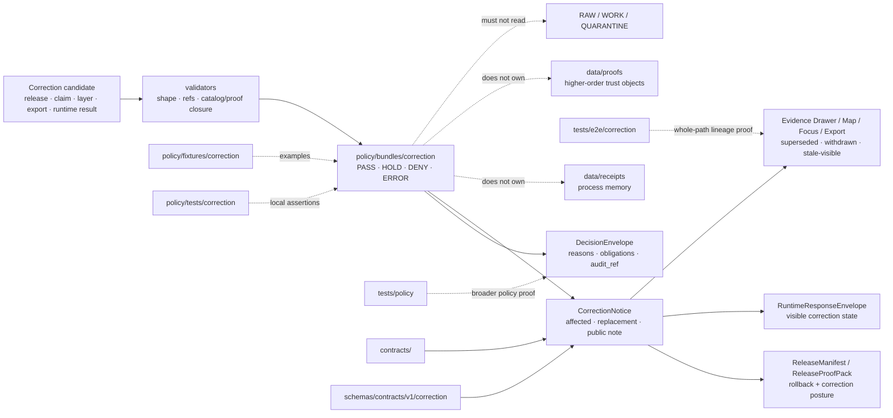

<!-- [KFM_META_BLOCK_V2]
doc_id: kfm://doc/NEEDS-VERIFICATION
title: Correction
type: standard
version: v1
status: draft
owners: @bartytime4life
created: NEEDS-VERIFICATION
updated: 2026-04-23
policy_label: NEEDS_VERIFICATION
related: [../README.md, ../runtime/README.md, ../../README.md, ../../fixtures/README.md, ../../tests/README.md, ../../policy-runtime/README.md, ../../../contracts/README.md, ../../../schemas/README.md, ../../../schemas/contracts/v1/correction/correction_notice.schema.json, ../../../tests/policy/README.md, ../../../tests/e2e/correction/README.md, ../../../.github/CODEOWNERS]
tags: [kfm, policy, bundles, correction, supersession, withdrawal, rollback, correction-notice, deny-by-default]
notes: [doc_id, created date, policy_label, executable bundle inventory, workflow enforcement, and branch protection remain NEEDS_VERIFICATION; owner follows current broad CODEOWNERS fallback for /policy/; this README expands the existing correction bundle placeholder without claiming rule files, manifests, fixtures, tests, or CI enforcement already exist.]
[/KFM_META_BLOCK_V2] -->

<a id="top"></a>

# Correction

Policy-bundle seam for visible KFM correction, supersession, withdrawal, rollback, and stale-safe trust outcomes.

> [!IMPORTANT]
> **Status:** `experimental`  
> **Owners:** `@bartytime4life`  
> **Path:** `policy/bundles/correction/README.md`  
> **Repo fit:** child correction seam under [`../README.md`](../README.md), inside the parent policy lane [`../../README.md`](../../README.md); paired with policy fixtures in [`../../fixtures/README.md`](../../fixtures/README.md), bundle-local assertions in [`../../tests/README.md`](../../tests/README.md), runtime coordination in [`../../policy-runtime/README.md`](../../policy-runtime/README.md), contract meaning in [`../../../contracts/README.md`](../../../contracts/README.md), schema shape in [`../../../schemas/README.md`](../../../schemas/README.md), correction schema placeholder at [`../../../schemas/contracts/v1/correction/correction_notice.schema.json`](../../../schemas/contracts/v1/correction/correction_notice.schema.json), repo-facing policy proof in [`../../../tests/policy/README.md`](../../../tests/policy/README.md), and whole-path correction proof in [`../../../tests/e2e/correction/README.md`](../../../tests/e2e/correction/README.md).  
> **Quick jumps:** [Scope](#scope) · [Repo fit](#repo-fit) · [Accepted inputs](#accepted-inputs) · [Exclusions](#exclusions) · [Directory tree](#directory-tree) · [Quickstart](#quickstart) · [Usage](#usage) · [Correction grammar](#correction-grammar) · [Proof matrix](#proof-matrix) · [Diagram](#diagram) · [Task list](#task-list--definition-of-done) · [FAQ](#faq) · [Appendix](#appendix)  
> 
> 
> 
> 
> 
> 

> [!NOTE]
> The baseline public file for this leaf was a reserved placeholder. This revision turns the placeholder into a maintainer-facing lane contract. It still does **not** claim executable `.rego` rule files, bundle manifests, paired fixtures, policy tests, CI wiring, or branch protection until the active checkout proves them.

---

## Scope

`policy/bundles/correction/` owns the policy bundle family that decides whether a correction-bearing change may proceed, must hold for review, must be denied, or must fail visibly.

This seam exists because KFM correction is not a cosmetic edit. A correction can change public meaning, release linkage, Evidence Drawer state, Focus behavior, export posture, or map trust cues. The bundle’s job is to stop silent overwrite and force correction lineage to remain visible.

### This bundle should help decide

| Correction pressure | Bundle responsibility |
|---|---|
| Published result is wrong | Require affected release refs, replacement refs or explicit absence, reason codes, and visible public state. |
| Published result must be withdrawn | Require withdrawal reason, public note posture, affected surfaces, and safe replacement or explicit no-replacement state. |
| Derived surface is stale after correction | Require `stale-visible`, rebuild, repoint, or hold behavior instead of silent drift. |
| Correction narrows precision or generalizes geometry | Require transform reason, public-safe state, and linkage to evidence/review. |
| Correction lacks lineage | Deny promotion or runtime-visible change until lineage is reconstructable. |
| Correction affects runtime answers | Require downstream runtime and EvidenceBundle visibility rather than stale `ANSWER` behavior. |

### Status markers used here

| Marker | Meaning in this README |
|---|---|
| **CONFIRMED** | Visible in current public repo surfaces, current workspace inspection, or attached KFM doctrine. |
| **INFERRED** | Strongly supported by adjacent repo docs and KFM doctrine, but not proven as executable branch behavior here. |
| **PROPOSED** | Buildable guidance that fits KFM doctrine without claiming current implementation. |
| **UNKNOWN** | Not verified strongly enough to state as active repo reality. |
| **NEEDS VERIFICATION** | Must be checked in the active branch before merge or release claims. |

[Back to top](#top)

---

## Repo fit

This directory is a child seam under `policy/bundles/`. It should stay narrow: correction policy lives here; correction proof, correction schemas, correction runtime rendering, and emitted correction artifacts live in adjacent lanes.

| Direction | Surface | Role |
|---|---|---|
| Parent bundle lane | [`../README.md`](../README.md) | Defines seam-local executable bundle expectations and keeps bundle work separate from fixtures, tests, validators, and renderer summaries. |
| Sibling runtime bundle | [`../runtime/README.md`](../runtime/README.md) | Runtime policy seam for `ANSWER`, `ABSTAIN`, `DENY`, and `ERROR`; correction may affect runtime state but should not absorb runtime policy. |
| Parent policy lane | [`../../README.md`](../../README.md) | Deny-by-default policy surface for rights, sensitivity, review, release, runtime, export, and correction seams. |
| Policy fixtures | [`../../fixtures/README.md`](../../fixtures/README.md) | Paired examples for allow, hold, deny, withdraw, supersede, and stale-visible behavior. |
| Bundle-local assertions | [`../../tests/README.md`](../../tests/README.md) | Local policy assertions for this seam once rule files land. |
| Runtime-policy coordination | [`../../policy-runtime/README.md`](../../policy-runtime/README.md) | Explains how runtime consumers use policy without moving authority into apps. |
| Contract meaning | [`../../../contracts/README.md`](../../../contracts/README.md) | Owns semantic meaning for `CorrectionNotice`, `DecisionEnvelope`, `ReleaseManifest`, `EvidenceBundle`, and related objects. |
| Schema shape | [`../../../schemas/README.md`](../../../schemas/README.md) | Owns machine-checkable shape; this bundle must not fork schema authority. |
| Correction schema | [`../../../schemas/contracts/v1/correction/correction_notice.schema.json`](../../../schemas/contracts/v1/correction/correction_notice.schema.json) | Current schema-side correction placeholder; do not treat it as complete contract coverage. |
| Repo-facing policy proof | [`../../../tests/policy/README.md`](../../../tests/policy/README.md) | Broader policy behavior proof for deny-by-default, finite outcomes, and correction-aware governance. |
| Whole-path correction proof | [`../../../tests/e2e/correction/README.md`](../../../tests/e2e/correction/README.md) | Proves correction lineage across affected runtime, release, receipt, proof, and outward trust surfaces. |
| Ownership | [`../../../.github/CODEOWNERS`](../../../.github/CODEOWNERS) | Broad fallback ownership for `/policy/`; specialized correction ownership remains proposed. |

> [!CAUTION]
> This directory should **reference** correction schemas, release manifests, proof packs, receipts, EvidenceBundles, and runtime envelopes. It must not become their canonical store.

[Back to top](#top)

---

## Accepted inputs

Only content that helps the correction seam make finite, reviewable, executable policy decisions belongs here.

| Input class | What belongs here | Examples |
|---|---|---|
| Correction rule files | Machine-readable policy that decides correction, supersession, withdrawal, stale-visible, or rollback requirements. | `correction_propagation.rego`, `supersession_visibility.rego`, `withdrawal_denials.rego` |
| Bundle manifest | Versioned description of seam, imports, result grammar, paired fixtures, and downstream trust objects. | `bundle.yaml`, `bundle.json` |
| Result helpers | Small predicates that keep correction outcomes consistent. | `has_affected_release`, `has_replacement_ref`, `requires_public_notice`, `blocks_silent_overwrite` |
| Reason and obligation references | Pointers to shared reason/obligation vocabulary; do not duplicate canonical registries here. | `correction.missing_lineage`, `release.superseded`, `obligation.emit_public_note` |
| Bundle-local rationale | Human-facing explanation of correction policy behavior. | this README, small rationale notes |
| Fixture and test references | Links to sibling proof surfaces. | `../../fixtures/correction/`, `../../tests/correction/` |

### Minimum bar before calling this bundle executable

A correction bundle is not executable merely because this README exists. Minimum useful maturity requires:

- [ ] a named trust seam and bundle version
- [ ] at least one machine-readable rule body
- [ ] finite gate result grammar
- [ ] stable reason and obligation references
- [ ] paired positive and negative fixtures
- [ ] bundle-local policy assertions
- [ ] repo-facing policy proof where outward behavior changes
- [ ] whole-path correction proof where public meaning, release state, or runtime state changes
- [ ] rollback or disable path for policy-significant changes

[Back to top](#top)

---

## Exclusions

| Does **not** belong here | Put it instead | Why |
|---|---|---|
| `CorrectionNotice` schema bodies | [`../../../schemas/README.md`](../../../schemas/README.md) and schema-side correction lane | Shape authority belongs in schemas. |
| Full semantic contract for `CorrectionNotice` or `ReleaseManifest` | [`../../../contracts/README.md`](../../../contracts/README.md) | Object meaning belongs in contracts. |
| Generic policy fixtures | [`../../fixtures/README.md`](../../fixtures/README.md) | Fixtures should stay reusable and visible. |
| Generic bundle-local tests | [`../../tests/README.md`](../../tests/README.md) | Tests should not be hidden in rule folders. |
| Whole-path correction drills | [`../../../tests/e2e/correction/README.md`](../../../tests/e2e/correction/README.md) | E2E proof owns cross-surface lineage, not local bundle law. |
| Repo-wide policy behavior proof | [`../../../tests/policy/README.md`](../../../tests/policy/README.md) | Broader policy behavior belongs in repo-facing tests. |
| Runtime envelope schemas or API route behavior | `schemas/`, `contracts/`, and verified app/runtime seams | Policy constrains runtime; it is not the runtime. |
| Release manifests, receipts, proof packs, signed bundles, or emitted correction artifacts | `data/receipts/`, `data/proofs/`, `data/releases/`, or release/proof lanes after verification | Policy decides; emitted artifacts prove specific events. |
| UI-only trust cues | verified app/UI surfaces | UI reflects policy and evidence; it must not replace them. |
| Secrets, signing keys, `.env`, live credentials | secret manager or verified infra path | Sensitive operational material must never live in a public policy bundle. |
| RAW, WORK, QUARANTINE, PROCESSED, CATALOG, or PUBLISHED data | `data/` lifecycle lanes | Policy governs lifecycle movement; it is not canonical storage. |

[Back to top](#top)

---

## Directory tree

### Baseline leaf shape before this revision

```text
policy/
└── bundles/
    └── correction/
        └── README.md
```

### Smallest executable fill pattern — PROPOSED

```text
policy/
└── bundles/
    └── correction/
        ├── README.md
        ├── bundle.yaml
        ├── correction_propagation.rego
        ├── supersession_visibility.rego
        ├── withdrawal_denials.rego
        └── rollback_requirements.rego
```

### Required sibling proof once rules land — PROPOSED

```text
policy/
├── fixtures/
│   └── correction/
│       ├── allow_supersession_public_safe.json
│       ├── hold_missing_reviewer.json
│       ├── deny_silent_overwrite.json
│       ├── deny_missing_lineage.json
│       └── error_malformed_correction_notice.json
└── tests/
    └── correction/
        ├── README.md
        └── correction_policy_test.rego

tests/
├── policy/
│   └── correction/
│       └── README.md
└── e2e/
    └── correction/
        └── README.md
```

> [!NOTE]
> The target shape is intentionally small. Land one correction seam, one manifest, one rule family, and paired proof before widening the bundle.

[Back to top](#top)

---

## Quickstart

Run these from the repository root after checking out the active branch.

### 1) Confirm this leaf and nearby policy surfaces

```bash
git status --short
git branch --show-current
git rev-parse --show-toplevel

find policy/bundles/correction -maxdepth 3 -type f 2>/dev/null | sort
find policy/bundles policy/fixtures policy/tests policy/policy-runtime -maxdepth 4 -type f 2>/dev/null | sort
```

### 2) Discover correction rule files, manifests, and proof neighbors

```bash
find policy/bundles/correction -type f \
  \( -name '*.rego' -o -name 'bundle.*' -o -name '*.yaml' -o -name '*.yml' -o -name '*.json' -o -name '*.md' \) \
  2>/dev/null | sort

find policy/fixtures/correction policy/tests/correction tests/policy tests/e2e/correction \
  -maxdepth 5 -type f 2>/dev/null | sort
```

### 3) Trace correction vocabulary and trust-bearing joins

```bash
grep -RInE \
  'CorrectionNotice|Supersession|Rollback|withdrawn|superseded|stale-visible|correction-pending|ReleaseManifest|ReleaseProofPack|EvidenceBundle|DecisionEnvelope|RuntimeResponseEnvelope|reason_codes|obligation_codes' \
  policy contracts schemas tests docs apps packages data tools 2>/dev/null || true
```

### 4) Check whether policy tooling is actually present

```bash
command -v opa >/dev/null && opa version || echo "OPA not installed or not on PATH"
command -v conftest >/dev/null && conftest --version || echo "Conftest not installed or not on PATH"

find policy -type f \
  \( -name '*.rego' -o -name 'bundle.yaml' -o -name 'bundle.yml' -o -name '*policy*.json' \) \
  2>/dev/null | sort
```

### 5) Optional local policy check

```bash
# Illustrative only — verify the repo-native entrypoint and fixture path before relying on this in CI.
conftest test policy/fixtures/correction --policy policy/bundles/correction
```

> [!TIP]
> A command that finds files is discovery evidence, not enforcement evidence. Treat workflow YAML, CI output, branch protection, and required-check behavior as separate verification items.

[Back to top](#top)

---

## Usage

### Add a correction policy rule safely

1. Start with the correction seam, not the filename.
2. Name the exact state transition being constrained.
3. Keep the gate grammar finite.
4. Add at least one positive fixture and one negative fixture in `../../fixtures/`.
5. Add bundle-local assertions in `../../tests/`.
6. Update `../../../tests/policy/` if the change affects general policy behavior.
7. Update `../../../tests/e2e/correction/` if public meaning, release state, runtime state, or evidence visibility changes.
8. Link affected `CorrectionNotice`, `DecisionEnvelope`, `ReleaseManifest`, `EvidenceBundle`, receipt, proof, and audit surfaces.
9. Record rollback or disable posture in the PR notes.

### Change correction semantics safely

Changing a correction reason, obligation, or state mapping is policy-significant.

- Version the bundle or manifest.
- Keep old and new semantics visible in review.
- Re-run local bundle assertions and broader correction proof.
- Update contract/schema references when object shape or field meaning changes.
- Never hide denial, withdrawal, supersession, stale evidence, or correction-pending state behind generic UI copy.
- Never replace a release-backed trust surface without a correction lineage object.

### Keep correction policy subordinate to evidence

Correction policy may decide whether a correction may proceed. It may not make an unsupported replacement true.

A safe correction path stays downstream of this order:

1. identify affected release, artifact, claim, layer, runtime result, or export
2. resolve admissible evidence and review context
3. validate candidate `CorrectionNotice` shape and refs
4. apply correction policy
5. emit or update `DecisionEnvelope`
6. preserve receipts as process memory
7. preserve proofs as higher-order trust objects
8. update runtime/release/public trust cues only through governed interfaces
9. keep supersession, withdrawal, stale-visible, or replacement linkage visible

[Back to top](#top)

---

## Correction grammar

### Gate outcomes

| Outcome | Use when | Required behavior |
|---|---|---|
| `PASS` | Correction is evidence-backed, policy-safe, reviewed where required, and lineage is complete. | Permit the next governed transition; emit decision refs and obligations. |
| `HOLD` | Correction may be valid but requires steward, policy, release, or sensitivity review. | Preserve candidate state; do not publish or silently update outward surfaces. |
| `DENY` | Correction would hide lineage, expose restricted data, overwrite public meaning silently, or lacks required evidence/review. | Block transition and emit stable reason codes without leaking protected detail. |
| `ERROR` | A malformed object, policy-engine failure, missing schema, or unresolved dependency prevents reliable evaluation. | Fail visibly; do not imply approval or evidence support. |

### Visible correction states

| State | Meaning |
|---|---|
| `superseded` | Older result is no longer primary and has a linked replacement or explicit no-replacement explanation. |
| `withdrawn` | Prior result should not be used; public and steward surfaces must show withdrawal posture. |
| `stale-visible` | Surface remains visible but is known stale until rebuild, repoint, or replacement completes. |
| `correction-pending` | Correction exists but has not fully propagated across release/runtime/public surfaces. |
| `generalized` | Replacement is deliberately less precise and must carry the reason and transform posture. |
| `replacement-linked` | Corrected surface points to the replacement release, artifact, or evidence bundle. |

> [!WARNING]
> A correction that changes user meaning but leaves the old surface looking authoritative is a policy failure, not a documentation gap.

[Back to top](#top)

---

## Proof matrix

| Correction pressure | Local bundle responsibility | Paired proof surface | Downstream trust object |
|---|---|---|---|
| Missing affected release ref | Emit `DENY` or `ERROR` | `../../fixtures/correction/` + `../../tests/correction/` | `DecisionEnvelope` |
| Missing replacement ref or explicit no-replacement note | Emit `HOLD` or `DENY` | bundle-local negative fixtures | `CorrectionNotice`, `ReleaseManifest` |
| Silent overwrite attempt | Emit `DENY` | policy tests + e2e correction drill | `CorrectionNotice`, public trust state |
| Withdrawal of unsafe release | Require visible `withdrawn` posture | repo-facing policy proof | `ReleaseManifest`, `RuntimeResponseEnvelope` |
| Stale derived public layer | Require `stale-visible`, rebuild, or repoint obligation | e2e correction proof | `ProjectionBuildReceipt`, `LayerManifest`, `EvidenceBundle` |
| Correction requires precision narrowing | Require generalization or redaction obligation | policy + sensitivity fixtures | `CorrectionNotice`, transform receipt |
| Runtime answer affected by correction | Avoid stale `ANSWER`; require visible correction state | runtime proof + correction proof | `RuntimeResponseEnvelope`, `EvidenceBundle` |
| Policy engine unavailable | Emit `ERROR` or fail closed | bundle-local error fixture | audit ref, receipt |

[Back to top](#top)

---

## Diagram



[Back to top](#top)

---

## Task list / definition of done

- [ ] `doc_id`, `created`, `updated`, and `policy_label` were verified from repo history, document registry, or governance records.
- [ ] Active branch inventory confirms whether this directory is README-only or contains executable rule files.
- [ ] Any `*.rego` or equivalent rule body has a bundle manifest.
- [ ] Gate outcome grammar is limited to `PASS`, `HOLD`, `DENY`, and `ERROR`.
- [ ] Correction visible states are explicit where user meaning changes.
- [ ] Positive and negative correction fixtures exist outside this directory in the sibling fixture lane.
- [ ] Bundle-local assertions exist outside this directory in the sibling policy-test lane.
- [ ] Repo-facing policy proof is updated if reason, obligation, or deny behavior changes.
- [ ] Whole-path correction proof is updated if release, runtime, map, dossier, story, Focus, export, or Evidence Drawer behavior changes.
- [ ] Contract/schema links are references only; this directory does not fork object definitions.
- [ ] No rule file reads RAW, WORK, QUARANTINE, unpublished candidates, secrets, or live credentials.
- [ ] No correction can silently overwrite a release-backed trust surface.
- [ ] Receipts remain process memory; proofs remain higher-order trust objects.
- [ ] Rollback or disable instructions are documented for policy-significant bundle changes.
- [ ] Adjacent docs are updated when case placement or family boundaries change.

[Back to top](#top)

---

## FAQ

### Does this directory own `CorrectionNotice`?

No. This directory may require a valid `CorrectionNotice`, but object meaning belongs in `contracts/` and machine shape belongs in `schemas/`.

### Can a correction bundle return `ANSWER` or `ABSTAIN`?

Not as its primary gate grammar. `ANSWER` and `ABSTAIN` belong to runtime/public response semantics. This bundle should use gate-style outcomes such as `PASS`, `HOLD`, `DENY`, and `ERROR`, then let runtime surfaces reflect the correction state through governed envelopes.

### What should happen when a correction lacks evidence?

Deny or hold the correction. Do not publish a replacement, do not hide the previous state, and do not let UI copy imply the issue is resolved.

### What should happen when a release must be withdrawn?

Emit or require visible withdrawal posture, link the affected release, preserve reason and audit refs, and keep public/steward surfaces from presenting the withdrawn release as current.

### Is a README enough to prove policy enforcement?

No. A README can reserve and explain the seam. Enforcement requires rule bodies, manifests, paired fixtures, tests, CI or runner evidence, and branch/workflow verification.

### What is the safest first executable case?

One synthetic, public-safe correction drill:

1. an outward result changes,
2. the correction becomes visible,
3. lineage survives,
4. no silent overwrite occurs,
5. runtime/release trust cues do not stay stale without a visible state.

[Back to top](#top)

---

## Appendix

<details>
<summary><strong>Illustrative bundle manifest starter — PROPOSED</strong></summary>

```yaml
schema_version: kfm.policy_bundle.v1
bundle_id: kfm.policy.bundles.correction
bundle_version: 0.1.0
surface_class: correction
owned_gate_outcomes:
  - PASS
  - HOLD
  - DENY
  - ERROR
visible_states:
  - superseded
  - withdrawn
  - stale-visible
  - correction-pending
  - generalized
  - replacement-linked
rule_files:
  - correction_propagation.rego
  - supersession_visibility.rego
  - withdrawal_denials.rego
  - rollback_requirements.rego
paired_fixtures:
  - ../../fixtures/correction/allow_supersession_public_safe.json
  - ../../fixtures/correction/hold_missing_reviewer.json
  - ../../fixtures/correction/deny_silent_overwrite.json
  - ../../fixtures/correction/deny_missing_lineage.json
  - ../../fixtures/correction/error_malformed_correction_notice.json
paired_tests:
  - ../../tests/correction/correction_policy_test.rego
downstream_objects:
  - CorrectionNotice
  - DecisionEnvelope
  - ReleaseManifest
  - ReleaseProofPack
  - EvidenceBundle
  - RuntimeResponseEnvelope
  - run_receipt
  - audit_ref
notes:
  - Shape starter only.
  - Verify repo-native manifest schema before committing.
  - Do not treat this manifest as proof that executable rules already exist.
```

</details>

<details>
<summary><strong>Illustrative correction decision input — PROPOSED</strong></summary>

```yaml
input:
  correction_id: corr.example.0001
  actor_role: steward
  surface_class: release.correction
  action: supersede
  affected_release_ref: rel.example.public.v1
  replacement_release_ref: rel.example.public.v2
  evidence:
    evidence_bundle_resolved: true
    citations_valid: true
    affected_release_exists: true
    replacement_release_exists: true
  review:
    review_required: true
    review_record_present: true
  policy:
    rights_class: public
    sensitivity_class: public
    public_note_required: true
    silent_overwrite_attempted: false
decision:
  outcome: PASS
  reason_codes:
    - CORRECTION_LINEAGE_COMPLETE
    - REPLACEMENT_RELEASE_LINKED
    - REVIEW_RECORD_PRESENT
  obligation_codes:
    - EMIT_CORRECTION_NOTICE
    - UPDATE_RELEASE_MANIFEST_CORRECTION_POSTURE
    - SURFACE_SUPERSEDED_STATE
    - INCLUDE_AUDIT_REF
```

</details>

<details>
<summary><strong>Terms to keep stable</strong></summary>

| Term | Working meaning in this lane |
|---|---|
| `CorrectionNotice` | Primary correction-lineage object for affected/replacement release state, cause, public note, and affected surfaces. |
| `DecisionEnvelope` | Policy-result carrier with finite outcome, reason codes, obligation codes, policy basis, and audit reference. |
| `ReleaseManifest` / `ReleaseProofPack` | Release-bearing scope and proof objects that must show rollback/correction posture when public meaning changes. |
| `EvidenceBundle` | Inspectable support object; corrected claims must remain evidence-resolvable. |
| `RuntimeResponseEnvelope` | Governed runtime response; stale answers must reflect correction state where relevant. |
| `run_receipt` | Process-memory carrier for one run or correction evaluation. |
| `stale-visible` | Surface remains visible but must not appear current or authoritative. |
| `silent overwrite` | Replacing a trust-bearing result without visible correction lineage; forbidden by this lane. |

</details>

[Back to top](#top)
