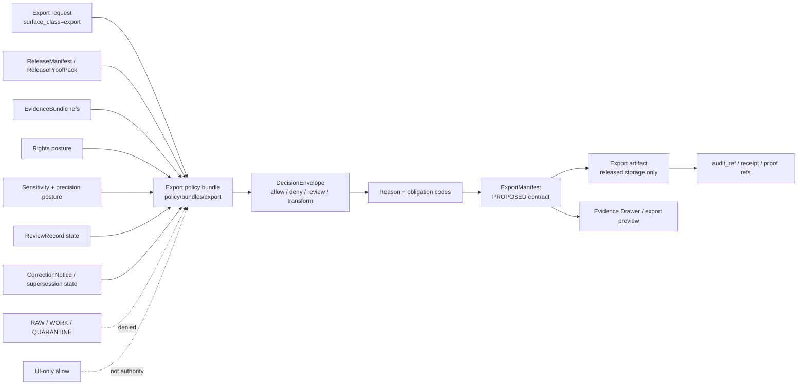

<!-- [KFM_META_BLOCK_V2]
doc_id: kfm://doc/NEEDS_VERIFICATION__assign_uuid
title: Export Policy Bundle
type: standard
version: v1
status: draft
owners: NEEDS_VERIFICATION__policy_owner
created: NEEDS_VERIFICATION__file_creation_date
updated: 2026-04-23
policy_label: public
related: [../README.md, ../runtime/README.md, ../../README.md, ../../fixtures/README.md, ../../tests/README.md, ../../policy-runtime/README.md, ../../../contracts/README.md, ../../../schemas/README.md, ../../../data/README.md, ../../../packages/policy/README.md, ../../../tests/policy/README.md, ../../../tests/validators/README.md, ../../../.github/workflows/README.md]
tags: [kfm, policy, bundles, export, governance]
notes: [doc_id placeholder pending UUID assignment, owners and created date require branch or CODEOWNERS verification, export bundle files are PROPOSED until bundle.yaml rules fixtures tests and workflow wiring are checked in, this README is a leaf-lane guide for policy/bundles/export]
[/KFM_META_BLOCK_V2] -->

# Export Policy Bundle

Governed export-scope rules for release-bound, evidence-resolved, rights-aware KFM outputs.


> [!IMPORTANT]
> **Status:** experimental  
> **Owners:** `NEEDS_VERIFICATION__policy_owner`  
> **Path:** `policy/bundles/export/README.md`  
> **Current implementation claim:** `NEEDS VERIFICATION` — this README defines the export bundle lane; it does not prove executable export policy files are already present.  
> **Quick jumps:** [Scope](#scope) · [Repo fit](#repo-fit) · [Accepted inputs](#accepted-inputs) · [Exclusions](#exclusions) · [Directory tree](#directory-tree) · [Quickstart](#quickstart) · [Usage](#usage) · [Diagram](#diagram) · [Tables](#tables) · [Task list](#task-list--definition-of-done) · [FAQ](#faq) · [Appendix](#appendix)

> [!WARNING]
> Export is not a shortcut around publication governance. An export request must stay inside released scope, resolve evidence, honor rights and sensitivity decisions, preserve correction lineage, and emit reviewable reasons and obligations before it can become an outward artifact.

---

## Scope

`policy/bundles/export/` is the policy bundle lane for deciding whether a requested KFM export may proceed, must be transformed, requires review, or must be denied.

The export bundle is responsible for the **decision seam**, not for the export artifact itself. It should constrain export requests using release state, EvidenceBundle closure, rights posture, sensitivity posture, review state, requested audience, requested format, requested geometry precision, correction state, and audit requirements.

### What this lane should protect

| Export pressure | Guardrail |
|---|---|
| “Just download the layer” | Only released, policy-safe, evidence-resolved scope can leave the governed boundary |
| “Give me exact geometry” | Sensitivity and geoprivacy rules decide precision, redaction, or denial |
| “Use this unpublished candidate” | RAW, WORK, QUARANTINE, and unpromoted candidate data are not export sources |
| “Export without citations” | Claim-bearing export previews and packages must carry EvidenceBundle / evidence reference closure |
| “Ignore prior corrections” | Withdrawn, superseded, stale, or review-pending material must remain visible in downstream state |
| “Let the UI handle it” | UI cues may reflect policy; they do not replace backend policy enforcement |

[Back to top](#export-policy-bundle)

---

## Repo fit

This README is the leaf guide for `policy/bundles/export/`.

### Upstream, sibling, and downstream surfaces

| Direction | Surface | Role |
|---|---|---|
| Upstream | [`../README.md`](../README.md) | Parent policy bundle lane; explains seam-local bundles and paired proof expectations |
| Upstream | [`../../README.md`](../../README.md) | Parent policy lane; keeps policy law, fixtures, tests, and runtime coordination separated |
| Sibling | [`../runtime/README.md`](../runtime/README.md) | Runtime bundle scaffold and finite-outcome policy seam |
| Sibling | [`../../fixtures/README.md`](../../fixtures/README.md) | Positive and negative policy examples that should prove export behavior |
| Sibling | [`../../tests/README.md`](../../tests/README.md) | Bundle-local assertions for export policy behavior |
| Sibling | [`../../policy-runtime/README.md`](../../policy-runtime/README.md) | Runtime-policy coordination; does not own export rule bodies |
| Lateral | [`../../../contracts/README.md`](../../../contracts/README.md) | Human-readable meaning for trust-bearing objects and export-facing contract semantics |
| Lateral | [`../../../schemas/README.md`](../../../schemas/README.md) | Machine-readable schema home or mirror status; schema authority remains a verification item |
| Lateral | [`../../../data/README.md`](../../../data/README.md) | Lifecycle zones and release-adjacent data surfaces policy governs but does not own |
| Lateral | [`../../../packages/policy/README.md`](../../../packages/policy/README.md) | Shared loaders/adapters/helpers; not a second policy authority |
| Downstream | [`../../../tests/policy/README.md`](../../../tests/policy/README.md) | Broader repo-facing proof that export semantics survive runtime/release pressure |
| Downstream | [`../../../tests/validators/README.md`](../../../tests/validators/README.md) | Validator proof for schema-valid inputs and fail-closed checked-in policy data |
| Downstream | [`../../../.github/workflows/README.md`](../../../.github/workflows/README.md) | Workflow guardrails and future merge-gate documentation |

### Boundary statement

`policy/bundles/export/` may define or host export-policy rule files and a bundle manifest. It should not own:

- export artifact storage,
- export route handlers,
- export schemas,
- canonical data,
- source descriptors,
- signing keys,
- UI-only gates,
- or generated release packages.

[Back to top](#export-policy-bundle)

---

## Accepted inputs

### Directory inputs

Files that belong in this directory are narrow and policy-bearing:

| Input | Status | Belongs here when |
|---|---:|---|
| `README.md` | **CONFIRMED by this file** | It explains the export bundle seam and review expectations |
| `bundle.yaml` / `bundle.yml` | **PROPOSED** | It declares the export bundle entrypoints, version, package names, dependencies, and companion fixtures |
| `export_scope.rego` | **PROPOSED** | It evaluates release scope, audience, rights, sensitivity, correction, review, and evidence requirements |
| Small bundle-local notes | **PROPOSED** | They explain rule intent without becoming contract or schema authority |

### Policy evaluation inputs

The export bundle should evaluate only inputs supplied by the verified consuming runtime, validator, or release/export assembly seam.

| Evaluation input | Expected use |
|---|---|
| `actor_role` / requester class | Determines whether the requester is public, steward, reviewer, maintainer, or another verified role |
| `surface_class` | Should be `export` for export-specific decisions |
| `release_id` / release scope | Ensures the requested export is tied to a governed release |
| `requested_format` | Applies rules for PMTiles, GeoParquet, COG, CSV, PDF, story export, or other artifact classes |
| `requested_precision` | Determines whether exact, generalized, redacted, or aggregated geometry is allowed |
| `rights_class` | Blocks or narrows output when rights are unknown, restricted, or incompatible |
| `sensitivity_class` | Blocks, generalizes, redacts, or routes for review |
| `review_state` | Distinguishes approved, pending, escalated, denied, or steward-required cases |
| `correction_state` | Prevents silent export of withdrawn, superseded, stale, or review-pending material |
| `evidence_refs` / `evidence_bundle_refs` | Supports cite-or-abstain and export-preview trust display |
| `manifest_refs` / `proof_refs` | Links export scope to release, catalog, proof, and rollback posture |

> [!NOTE]
> Exact field names belong in contracts and schemas. This README names the review burden and seam intent; it does not create a second schema authority.

[Back to top](#export-policy-bundle)

---

## Exclusions

Keep these out of `policy/bundles/export/`.

| Excluded item | Correct home or handling |
|---|---|
| Export archives, generated files, downloaded packages, PMTiles, GeoParquet, COGs, CSVs, PDFs | Released artifact or export storage under the verified `data/`, `release/`, or artifact-store convention |
| RAW, WORK, QUARANTINE, PROCESSED, CATALOG, or PUBLISHED data objects | [`../../../data/README.md`](../../../data/README.md) and verified lifecycle folders |
| Export request API handlers or route logic | Verified app/API seam |
| UI buttons, panels, popovers, or conditional rendering | Verified UI shell; policy result should be consumed, not redefined there |
| `ExportManifest`, `DecisionEnvelope`, `EvidenceBundle`, or `ReleaseManifest` schemas | [`../../../schemas/README.md`](../../../schemas/README.md) or verified schema home |
| Human-readable contract definitions for export objects | [`../../../contracts/README.md`](../../../contracts/README.md) |
| Generic fixtures | [`../../fixtures/README.md`](../../fixtures/README.md) |
| Generic or repo-facing tests | [`../../tests/README.md`](../../tests/README.md), [`../../../tests/policy/README.md`](../../../tests/policy/README.md), or [`../../../tests/validators/README.md`](../../../tests/validators/README.md) |
| Secrets, signing keys, access tokens, `.env` files | Secret manager / host configuration; never checked in here |
| Source descriptors or source-rights registries | Verified data/source registry surface |
| Policy-support loaders and adapters | [`../../../packages/policy/README.md`](../../../packages/policy/README.md) or verified runtime package seam |

[Back to top](#export-policy-bundle)

---

## Directory tree

### Current leaf target

```text
policy/bundles/export/
└── README.md
```

### First executable fill (`PROPOSED`)

```text
policy/bundles/export/
├── README.md
├── bundle.yaml
└── export_scope.rego
```

### Paired proof surfaces (`PROPOSED`)

```text
policy/
├── fixtures/
│   └── export/
│       ├── allow_public_released_scope.yaml
│       ├── deny_unreleased_scope.yaml
│       ├── deny_unknown_rights.yaml
│       ├── require_generalization_sensitive_geometry.yaml
│       └── deny_superseded_release.yaml
└── tests/
    └── export/
        └── README.md

tests/
├── policy/
│   └── export/
│       └── README.md
└── validators/
    └── export/
        └── README.md
```

> [!NOTE]
> The executable fill and paired proof surfaces are starter shapes, not current-branch facts. Keep this README experimental until the bundle manifest, rule file, fixtures, tests, and workflow references are verified.

[Back to top](#export-policy-bundle)

---

## Quickstart

### Inspect the lane

```bash
find policy/bundles/export -maxdepth 3 -type f 2>/dev/null | sort
```

### Inspect companion proof surfaces

```bash
find policy/fixtures policy/tests tests/policy tests/validators -maxdepth 5 -type f 2>/dev/null \
  | grep -Ei 'export|Export|DecisionEnvelope|EvidenceBundle|ReleaseManifest|CorrectionNotice' \
  | sort || true
```

### Trace export-facing trust objects

```bash
grep -RInE \
  'ExportManifest|export_scope|surface_class.*export|DecisionEnvelope|EvidenceBundle|ReleaseManifest|ReleaseProofPack|CorrectionNotice|rights_class|sensitivity_class|requested_precision' \
  policy contracts schemas tests docs apps packages data 2>/dev/null || true
```

### Optional policy check after toolchain verification

```bash
# Illustrative only. Verify the repo's actual OPA/Conftest entrypoint before relying on this in CI.
conftest test --policy policy/bundles/export policy/fixtures/export
```

### First review pass

```bash
# README and metadata review
grep -n 'KFM_META_BLOCK_V2\|# Export Policy Bundle\|Quick jumps\|NEEDS_VERIFICATION' \
  policy/bundles/export/README.md

# Link review, using the repo's real documentation checker when available
python tools/docs/check_doc_structure.py policy/bundles/export/README.md 2>/dev/null || true
```

[Back to top](#export-policy-bundle)

---

## Usage

### Add the first export bundle

1. Confirm the repo’s policy runner and bundle manifest convention.
2. Add `bundle.yaml` with a stable package path and explicit dependencies.
3. Add one rule file, preferably `export_scope.rego`, with one narrow responsibility: export scope eligibility.
4. Add paired positive and negative fixtures under `policy/fixtures/export/`.
5. Add bundle-local assertions under `policy/tests/export/`.
6. Add broader proof under `tests/policy/export/` when behavior affects runtime, release, correction, or UI-visible export state.
7. Update contract/schema docs only by reference; do not duplicate field definitions in this directory.
8. Keep denial and review reasons stable through shared reason/obligation vocabularies.

### Change export behavior safely

Before changing an export rule, identify which downstream trust object must change with it.

| Behavior change | Also inspect or update |
|---|---|
| Allowed audience changes | `DecisionEnvelope`, review burden, reason codes, access posture |
| Geometry precision changes | sensitivity policy, transform receipt expectations, Evidence Drawer caveats |
| Rights treatment changes | source-rights registry, release gate, obligation codes |
| Export format changes | `ExportManifest` / release artifact schema, validators, proof pack requirements |
| Correction handling changes | `CorrectionNotice`, rollback posture, supersession display |
| Reviewer burden changes | `ReviewRecord`, workflow guardrails, owner/CODEOWNERS coverage |

> [!CAUTION]
> Export policy changes can widen public access. Treat them as policy-significant even when the diff looks like a small rule edit.

[Back to top](#export-policy-bundle)

---

## Diagram



The bundle sits between an export request and outward artifact assembly. It consumes released scope and trust objects; it does not fetch raw data, assemble artifacts, or replace contract/schema authority.

[Back to top](#export-policy-bundle)

---

## Tables

### Export decision effects

| Effect | Meaning | Minimum downstream consequence |
|---|---|---|
| `allow` | Export may proceed for the requested scope | Decision and obligations attach to export manifest / audit refs |
| `deny` | Export must not proceed | Reason codes are visible to the caller or reviewer where safe |
| `review_required` | Human/steward review is required before export | ReviewRecord or review task reference is created by the owning workflow |
| `transform_required` | Export may proceed only after generalization, redaction, aggregation, or other transform | Transform receipt and visible caveat are required |
| `hold` | Export cannot proceed because state is stale, superseded, incomplete, or awaiting proof | Release/correction/evidence gap stays visible |

> [!NOTE]
> The exact enum belongs in `DecisionEnvelope` schema or policy vocabulary. This table documents the intended export-bundle semantics.

### Minimum fixture matrix

| Fixture case | Expected posture | Why it matters |
|---|---|---|
| Public export of released public-safe layer | allow | Proves the happy path without bypassing release evidence |
| Public export of unpromoted candidate data | deny | Protects RAW/WORK/QUARANTINE/PROCESSED boundaries |
| Unknown rights class | deny or hold | Prevents rights ambiguity from becoming public release |
| Sensitive exact geometry requested | transform_required, review_required, or deny | Protects geoprivacy and steward obligations |
| Superseded release requested | hold or deny | Prevents stale lineage from becoming new outward truth |
| EvidenceBundle missing | deny or hold | Enforces cite-or-abstain behavior for claim-bearing exports |
| Review pending | review_required or hold | Prevents silent release before burden is satisfied |

### Companion surfaces

| Surface | Expected relationship |
|---|---|
| `policy/bundles/export/` | Rule bundle and manifest |
| `policy/fixtures/export/` | Small positive/negative policy inputs |
| `policy/tests/export/` | Bundle-local assertions |
| `tests/policy/export/` | Broader runtime/release/correction proof |
| `tests/validators/export/` | Shape, linkage, and fail-closed proof |
| `contracts/` | Human-readable meaning of export trust objects |
| `schemas/` | Machine-readable contract shape |
| `data/` / release storage | Export artifacts and lifecycle records |
| `.github/workflows/` | Gate documentation and future CI enforcement |

[Back to top](#export-policy-bundle)

---

## Task list / definition of done

### First commit

- [ ] Add this README with KFM Meta Block V2.
- [ ] Verify owner and created date from `CODEOWNERS`, git history, or repo governance.
- [ ] Confirm relative links from `policy/bundles/export/README.md`.
- [ ] Decide whether `bundle.yaml` or another manifest naming convention is repo-standard.
- [ ] Leave executable claims marked `PROPOSED` until rule files and tests land.

### First executable bundle

- [ ] Add a versioned export bundle manifest.
- [ ] Add one narrow export-scope rule file.
- [ ] Add at least one allow fixture and three deny/hold fixtures.
- [ ] Add bundle-local tests.
- [ ] Add broader repo-facing policy proof if export behavior is consumed by runtime or release assembly.
- [ ] Confirm the consuming API/export assembler receives a `DecisionEnvelope` or verified equivalent.
- [ ] Confirm sensitive geometry and unknown-rights cases fail closed.
- [ ] Confirm stale/superseded/corrected release cases cannot export silently.

### Review gates

- [ ] Policy reviewer confirms default-deny behavior.
- [ ] Data/source reviewer confirms rights and source-role assumptions.
- [ ] Contract/schema reviewer confirms this README did not create schema authority.
- [ ] Runtime/export reviewer confirms no UI-only or route-only bypass.
- [ ] Documentation reviewer confirms metadata, links, truth labels, and placeholders are intentional.

[Back to top](#export-policy-bundle)

---

## FAQ

### Can this bundle export data?

No. It can decide or constrain whether an export request may proceed. Artifact creation belongs to the verified export assembly, release, or artifact-storage seam.

### Can this bundle read RAW, WORK, or QUARANTINE?

No. Export policy should evaluate released scope and governed trust objects. It should deny or hold requests that depend on unpublished lifecycle zones.

### Is `OPA/Rego` already confirmed for this exact leaf?

`NEEDS VERIFICATION`. The parent bundle docs use Rego-flavored starter shapes, but this README should not claim mounted rule execution until the active branch proves the toolchain and entrypoint.

### Does an export preview count as a release?

Not by itself. A preview may be a trust-visible UI state, but outward artifact delivery still needs release scope, policy decision, evidence closure, and audit/proof linkage.

### What happens when rights are unknown?

Fail closed. The decision should be deny, hold, or review-required depending on the verified policy vocabulary and review burden.

### What happens when exact geometry is sensitive?

Do not export exact geometry by default. Apply the verified sensitivity policy: generalize, redact, aggregate, route for steward review, or deny.

### Can the UI override an export denial?

No. UI affordances can display a denial or review state; they must not replace backend policy or silently allow the export.

[Back to top](#export-policy-bundle)

---

## Appendix

<details>
<summary><strong>Illustrative export policy input shape</strong></summary>

This shape is illustrative and must be aligned to the verified `DecisionEnvelope`, export request, and export manifest contracts before becoming a fixture.

```yaml
input:
  surface_class: export
  actor_role: public
  action: create_export
  release_id: rel.example.public.v1
  requested_format: pmtiles
  requested_precision: generalized
  rights_class: open
  sensitivity_class: public
  review_state: approved
  correction_state: current
  evidence_bundle_refs:
    - eb.example.layer.v1
  manifest_refs:
    release_manifest: rm.example.public.v1
    release_proof_pack: rpp.example.public.v1

decision:
  result: allow
  reason_codes:
    - EXPORT_SCOPE_RELEASED
    - PUBLIC_SAFE
  obligation_codes:
    - REQUIRE_EVIDENCE_BUNDLE_REFS
    - RECORD_EXPORT_AUDIT
```

</details>

<details>
<summary><strong>Fail-closed examples to keep near the first fixture set</strong></summary>

| Input pressure | Safer expected result |
|---|---|
| `release_id` missing | deny or hold |
| `rights_class: unknown` | deny or review-required |
| `sensitivity_class: restricted` with `requested_precision: exact` | deny, transform_required, or steward review |
| `correction_state: superseded` | hold or deny |
| `evidence_bundle_refs: []` for claim-bearing export | deny or hold |
| `actor_role: public` requesting internal-only format | deny |
| requested scope wider than release manifest | deny |

</details>

<details>
<summary><strong>Open verification items</strong></summary>

- Confirm whether `policy/bundles/export/` already exists on the active branch.
- Confirm actual owner from `CODEOWNERS` or policy governance.
- Confirm whether `bundle.yaml`, `bundle.yml`, or another manifest name is the repo convention.
- Confirm exact policy runner and syntax version before adding executable rule files.
- Confirm `DecisionEnvelope` result enum and reason/obligation vocabulary.
- Confirm whether `ExportManifest` is already defined, proposed, or named differently.
- Confirm whether export proof belongs under `tests/policy/`, `tests/validators/`, `tests/e2e/release_assembly/`, or another verified proof lane.
- Confirm release-artifact storage and audit-ref conventions.
- Confirm source-rights and sensitivity registries before allowing public export decisions.

</details>

---

Keep export boring to abuse and useful to reviewers: released scope in, explicit decision out, no silent path around evidence.

[Back to top](#export-policy-bundle)
