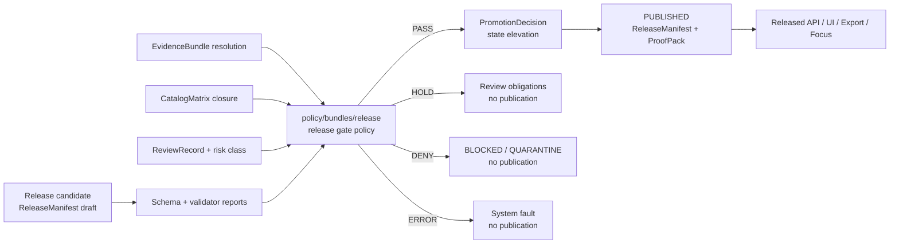

<!-- [KFM_META_BLOCK_V2]
doc_id: kfm://doc/TODO-assign-uuid-after-repo-registration
title: Release Policy Bundle
type: standard
version: v1
status: draft
owners: TODO: confirm release-policy steward / policy steward
created: 2026-04-23
updated: 2026-04-23
policy_label: TODO: confirm public|restricted
related: [../../README.md, ../README.md, ../../fixtures/README.md, ../../tests/README.md, ../../../contracts/README.md, ../../../schemas/README.md, ../../../data/README.md, ../../../docs/runbooks/PROMOTION_GATE.md]
tags: [kfm, policy, release, promotion, proof, governance]
notes: [README-like directory doc for policy/bundles/release; active branch inventory, owners, policy engine, and runner wiring need verification before merge; created/updated reflect this drafted Markdown response and should be checked against git history if revising an existing file]
[/KFM_META_BLOCK_V2] -->

<a id="top"></a>

# Release Policy Bundle

Rules for deciding whether a release candidate may become `PUBLISHED` without bypassing evidence, catalog closure, proof, rights, sensitivity, review, correction, or rollback gates.

<div align="left">


</div>

| Field | Value |
|---|---|
| **Status** | `experimental` / `draft` — active branch contents **NEED VERIFICATION** |
| **Owners** | `TODO: confirm release-policy steward / policy steward` |
| **Path** | `policy/bundles/release/README.md` |
| **Primary role** | Release-gate policy bundle guide |
| **Upstream** | [`policy/README.md`](../../README.md), [`policy/bundles/README.md`](../README.md) |
| **Downstream / proof lanes** | [`policy/tests/`](../../tests/), [`tests/policy/`](../../../tests/policy/), [`tests/validators/`](../../../tests/validators/), [`data/receipts/`](../../../data/receipts/), [`data/proofs/`](../../../data/proofs/), [`data/releases/`](../../../data/releases/) |
| **Contract neighbors** | [`contracts/README.md`](../../../contracts/README.md), [`schemas/README.md`](../../../schemas/README.md) |
| **Quick jumps** | [Scope](#scope) · [Repo fit](#repo-fit) · [Inputs](#accepted-inputs) · [Exclusions](#exclusions) · [Decision flow](#decision-flow) · [Decision matrix](#decision-matrix) · [Directory tree](#directory-tree) · [Quickstart](#quickstart) · [Definition of done](#definition-of-done) · [Verification backlog](#verification-backlog) |

> [!IMPORTANT]
> This bundle is a release gate, not a release actor. It should evaluate whether a candidate can advance; it should not fetch sources, mutate canonical records, publish artifacts, rewrite aliases, or hide policy decisions inside workflow YAML.

---

## Scope

This README documents the intended role of `policy/bundles/release/`: the policy bundle lane for release-candidate evaluation.

**CONFIRMED doctrine:** KFM treats publication as a governed state transition, not as a file move. Public-safe artifacts become publishable only after evidence, validation, policy, review, catalog, proof, and rollback conditions are satisfied.

**NEEDS VERIFICATION:** The active branch inventory for this directory, the exact policy engine, runnable bundle filenames, fixture paths, CI wiring, and CODEOWNERS review burden are not verified in this draft.

This bundle should answer one narrow question:

> Can this release candidate advance toward `PUBLISHED`, and if not, what exact reason codes and obligations explain the result?

[Back to top](#top)

---

## Repo fit

`policy/bundles/release/` sits inside the policy lane and consumes evidence from adjacent lanes. It does not own contracts, schemas, source data, validators, receipts, proof packs, or release storage.

| Direction | Surface | Release-bundle relationship |
|---|---|---|
| Upstream | [`policy/README.md`](../../README.md) | Parent policy lane; defines policy authority and boundaries. |
| Upstream | [`policy/bundles/README.md`](../README.md) | Bundle-family index; should route to release, runtime, receipt, or other bundle families. |
| Lateral | [`policy/fixtures/`](../../fixtures/) | Positive/negative policy examples. This bundle may consume fixture cases, but should not become fixture storage. |
| Lateral | [`policy/tests/`](../../tests/) | Bundle-local assertions. Broader release proof belongs in repo-level tests. |
| Lateral | [`contracts/`](../../../contracts/) | Trust-bearing object contracts such as `EvidenceBundle`, `DecisionEnvelope`, `ReleaseManifest`, `CatalogMatrix`, `PromotionDecision`, and `PolicyDecision`. |
| Lateral | [`schemas/`](../../../schemas/) | Schema validation surface. Authority between `contracts/` and `schemas/` remains branch-specific until verified. |
| Lateral | [`tools/validators/`](../../../tools/validators/) | Shape, linkage, digest, citation, geo, temporal, and catalog validators. Validators do not decide allow/deny meaning. |
| Downstream | [`data/receipts/`](../../../data/receipts/) | Process memory such as `RunReceipt`, `TransformReceipt`, and policy-decision receipts. Receipts are not proof substitutes. |
| Downstream | [`data/proofs/`](../../../data/proofs/) | Proof-bearing release support such as `ProofPack`, `EvidenceBundle`, and catalog-closure evidence. |
| Downstream | [`data/releases/`](../../../data/releases/) | Release manifests, promotion records, public aliases, rollback references, and withdrawal/correction records. |
| Downstream | [`tests/policy/`](../../../tests/policy/) | Repo-facing proof that policy behavior survives real release pressure. |
| Downstream | [`tests/validators/`](../../../tests/validators/) | Proof that policy inputs and adjacent validation artifacts are machine-valid and fail closed. |
| Orchestration | [`.github/workflows/`](../../../.github/workflows/) | Workflows may call this bundle, but workflow YAML must not become hidden policy law. |

[Back to top](#top)

---

## Accepted inputs

A release policy decision may consume references to these objects after they have been created by upstream validators, processors, reviewers, or proof builders.

| Input | Required posture | Why it matters |
|---|---|---|
| `PromotionRequest` or equivalent candidate envelope | **NEEDS VERIFICATION** contract name | Gives the policy engine a single request object instead of scattered CLI flags. |
| `ReleaseManifest` draft | Candidate release identity, artifacts, digests, aliases, `spec_hash`, and supersession target | Prevents “publish this folder” from becoming the release model. |
| `EvidenceBundle` refs | Resolved or explicitly unresolved | Consequential claims must not advance on naked URLs or unresolved evidence tokens. |
| `CatalogMatrix` / catalog-closure report | STAC/DCAT/PROV/internal closure where applicable | Confirms discovery, distribution, provenance, and release digests agree or explain divergence. |
| `SourceDescriptor` summaries | Source role, rights, sensitivity, access posture, activation state | Keeps source authority and release permission visible. |
| Validation reports | Schema, source-role, rights, sensitivity, citation, geospatial, temporal, digest, and release checks | Policy decides after validation; it does not replace validators. |
| `ReviewRecord` refs | Risk-class-appropriate review state | Ensures publication burden matches source sensitivity and public consequence. |
| Receipt refs | `RunReceipt`, `TransformReceipt`, `PolicyDecision`, `AIReceipt` where relevant | Preserves process memory without treating receipts as release proof. |
| Correction / rollback refs | Required when superseding, withdrawing, or repointing release surfaces | Makes correction visible and reversible. |

[Back to top](#top)

---

## Exclusions

These do **not** belong in `policy/bundles/release/`.

| Excluded item | Where it should live instead | Reason |
|---|---|---|
| Raw source payloads | `data/raw/` or repo-native intake storage | Release policy must never evaluate unpublished raw material as public truth. |
| `WORK` / `QUARANTINE` artifacts | `data/work/`, `data/quarantine/`, or repo-native equivalents | Unresolved or invalid material must not leak into release decisions as if it were publishable. |
| Canonical records | Canonical data stores / processed stores | Policy evaluates release candidates; it does not own canonical truth. |
| Contract or schema definitions | `contracts/` and/or `schemas/` after branch authority is resolved | Prevents bundle-local shadow contracts. |
| Validator implementation | `tools/validators/` or repo-native validator package | Validators shape-check and produce reports; release policy interprets whether reports allow advancement. |
| CI orchestration | `.github/workflows/`, `tools/ci/`, or repo-native CI lane | Workflows call policy; they must not become the hidden policy source. |
| UI trust text | UI shell / Evidence Drawer / Focus Mode contracts | UI reflects policy state; it does not decide release eligibility. |
| Secrets, tokens, credentials | Secret manager / deployment configuration | Release policy should consume safe metadata only. |
| Model runtime outputs without citation validation | Governed AI receipt/proof lanes | AI output is interpretive and cannot promote itself. |

[Back to top](#top)

---

## Decision flow



The release policy bundle should be boring in the best way: deterministic, reviewable, finite, and explicit about why a release candidate did or did not advance.

[Back to top](#top)

---

## Decision matrix

KFM runtime-facing surfaces often use `ANSWER | ABSTAIN | DENY | ERROR`. A release gate should use a release-review grammar that stays separate from user-facing answer envelopes.

| Outcome | Meaning | Public release consequence |
|---|---|---|
| `PASS` | Evidence, validation, rights, sensitivity, review, catalog closure, proof, and rollback checks support advancement. | Candidate may proceed to `PromotionDecision`; publication is still a governed state transition. |
| `HOLD` | A required review, obligation, citation, catalog link, source-role determination, or branch-specific verification is incomplete. | No publication. Candidate may return after obligations are satisfied. |
| `DENY` | Policy blocks the release: missing rights, unresolved sensitivity, unsupported exact location exposure, unresolved evidence, stale operational state, or forbidden release surface. | No publication. Candidate must be corrected, quarantined, withdrawn, or superseded. |
| `ERROR` | The gate cannot evaluate cleanly because inputs are malformed, required reports are missing, the policy engine failed, or the request is inconsistent. | No publication. Treat as system fault, not a soft allow. |

> [!NOTE]
> If the active branch already uses different names, preserve existing behavior and add an ADR or compatibility note rather than silently renaming outcomes.

[Back to top](#top)

---

## Directory tree

**NEEDS VERIFICATION:** No active-branch inventory is confirmed in this draft. Replace this section with the actual tree after mounting the repo.

```text
policy/bundles/release/
├── README.md                  # this guide
├── release.rego               # NEEDS VERIFICATION: policy-as-code bundle, if OPA/Rego is repo-native
├── reason_codes.yaml          # NEEDS VERIFICATION: release gate reason vocabulary, if stored here
├── obligations.yaml           # NEEDS VERIFICATION: release obligations vocabulary, if stored here
└── CHANGELOG.md               # PROPOSED: bundle-local change lineage, only if repo convention supports it
```

The only file this README can safely assume is itself. Additional files should be inventoried before this table is treated as current implementation fact.

[Back to top](#top)

---

## Quickstart

Use these checks from the repository root during review. They are non-destructive and intended to replace guessing with branch evidence.

```bash
# Confirm the target README and bundle inventory.
test -f policy/bundles/release/README.md
find policy/bundles/release -maxdepth 2 -type f | sort

# Inspect adjacent policy and proof lanes without assuming they exist.
find policy/fixtures policy/tests tests/policy tests/validators \
  -maxdepth 3 -type f 2>/dev/null | sort

# Locate release-bearing object names in contracts, schemas, policy, tests, tools, and docs.
grep -RInE \
  "ReleaseManifest|PromotionDecision|PolicyDecision|CatalogMatrix|EvidenceBundle|ProofPack|Rollback|WithdrawalNotice" \
  contracts schemas policy tests tools docs 2>/dev/null | head -100
```

Engine-specific commands remain **NEEDS VERIFICATION** until the active branch confirms its policy runner.

```bash
# Example only — confirm policy engine, bundle names, and fixture paths before using.
conftest test --policy policy/bundles/release policy/fixtures/release
```

[Back to top](#top)

---

## Rule authorship notes

Release policy should stay small, explicit, and hostile to silent success.

| Rule principle | Practical authoring pattern |
|---|---|
| Policy decides after validation | Require validator report refs; do not duplicate every validator in policy rules. |
| Missing evidence fails closed | Missing `EvidenceBundle`, unresolved `EvidenceRef`, or absent source descriptor should produce `HOLD`, `DENY`, or `ERROR`, never `PASS`. |
| Reasons are stable | Emit stable `reason_codes[]`; prose explanations can change, reason codes should not drift casually. |
| Obligations are explicit | Use `obligations[]` for next steps: `resolve_evidence_bundle`, `add_review_record`, `rerun_catalog_closure`, `attach_rollback_ref`. |
| Receipts are not proof | A `RunReceipt` can support audit/replay, but cannot replace release evidence, catalog closure, or review state. |
| Catalog closure is release-significant | Mismatched STAC/DCAT/PROV/internal digests should block or hold unless divergence is explicitly explained and reviewed. |
| Correction remains visible | Supersession, withdrawal, alias repointing, and rollback must retain public lineage where release significance requires it. |
| Workflow YAML is not policy | CI can call the bundle; the bundle should remain the reviewable policy source. |

[Back to top](#top)

---

## Release gate checklist

Use this as the minimum review checklist until the branch provides a machine-enforced equivalent.

- [ ] Candidate has a stable `release_id` or candidate id.
- [ ] Candidate carries a `spec_hash` or equivalent deterministic identity.
- [ ] Candidate declares artifact refs, digests, media types, byte sizes, and public aliases where applicable.
- [ ] EvidenceRefs resolve to EvidenceBundles or the decision is not `PASS`.
- [ ] SourceDescriptor refs identify source role, rights, sensitivity, and activation state.
- [ ] Required validation reports are present and passing.
- [ ] CatalogMatrix closure is present, passing, or explicitly reviewed with obligations.
- [ ] Review state matches the candidate risk class.
- [ ] Policy label is present and compatible with the requested release surface.
- [ ] Correction, supersession, rollback, or withdrawal refs are present when needed.
- [ ] Receipts are linked for audit without being treated as proof substitutes.
- [ ] Decision emits one finite outcome and stable reason codes.
- [ ] No rule grants publication because a field is absent, malformed, or unrecognized.

[Back to top](#top)

---

## Illustrative input shape

<details>
<summary>Show a compact illustrative release-gate input</summary>

This is an **illustrative example**, not a confirmed contract schema.

```json
{
  "request_id": "kfm://release-request/example",
  "candidate_ref": "kfm://release-candidate/example",
  "release_manifest_ref": "kfm://release-manifest/example",
  "spec_hash": "sha256:example",
  "policy_label": "public",
  "evidence_bundle_refs": ["kfm://evidence-bundle/example"],
  "catalog_matrix_ref": "kfm://catalog-matrix/example",
  "validation_report_refs": [
    "kfm://validation/schema/example",
    "kfm://validation/source-role/example",
    "kfm://validation/rights/example",
    "kfm://validation/sensitivity/example",
    "kfm://validation/citation/example",
    "kfm://validation/geo/example",
    "kfm://validation/temporal/example"
  ],
  "review_record_refs": ["kfm://review/example"],
  "receipt_refs": ["kfm://receipt/run/example"],
  "rollback_ref": "kfm://rollback/example",
  "requested_action": "promote"
}
```

</details>

[Back to top](#top)

---

## Definition of done

This README is ready to merge only when the reviewer can confirm the following against the active branch.

- [ ] `policy/bundles/release/` inventory is accurate.
- [ ] Owners are confirmed or intentionally marked `TODO`.
- [ ] Existing policy engine and runner are identified, or the unknown is preserved.
- [ ] Links resolve from `policy/bundles/release/README.md`.
- [ ] Accepted inputs and exclusions match adjacent policy, contract, schema, validator, data, and test lanes.
- [ ] Release outcomes match repo convention or are marked as proposed.
- [ ] Fixtures and tests are linked without claiming unverified runner maturity.
- [ ] No statement implies that release policy publishes, signs, aliases, or mutates artifacts directly.
- [ ] No statement claims current implementation behavior without branch evidence.

[Back to top](#top)

---

## FAQ

### Is this bundle the same thing as the promotion gate?

No. This bundle is the policy decision surface. A promotion gate may call it along with validators, catalog closure checks, review checks, signing checks, and release-manifest checks. Promotion remains a governed state transition.

### Can this bundle read `RAW`, `WORK`, or `QUARANTINE`?

No. Release policy should evaluate candidate envelopes and reports derived from governed upstream stages. Direct raw/work/quarantine access would weaken the trust membrane.

### Can `HOLD` become `ABSTAIN`?

Maybe. That is a repo-wide grammar decision. Until confirmed, keep release-review outcomes separate from runtime answer outcomes.

### Does a successful validator report mean `PASS`?

No. Validators establish shape and linkage. Policy decides whether the validated candidate is allowed to advance.

[Back to top](#top)

---

## Verification backlog

| Item | Status | Review action |
|---|---|---|
| Active branch file inventory for `policy/bundles/release/` | **NEEDS VERIFICATION** | Replace the proposed directory tree with actual files. |
| Policy engine and runner | **UNKNOWN** | Confirm OPA/Rego, Conftest, Python parity tests, or repo-native alternative. |
| Release outcome vocabulary | **NEEDS VERIFICATION** | Confirm `PASS/HOLD/DENY/ERROR` or map to existing branch grammar. |
| Reason-code registry home | **UNKNOWN** | Confirm whether reason codes live in this bundle, shared policy registry, contracts, or schemas. |
| Contract/schema authority | **CONFLICTED / NEEDS VERIFICATION** | Confirm whether trust-bearing objects are canonical in `contracts/`, `schemas/`, or both with a documented split. |
| Promotion runbook link | **NEEDS VERIFICATION** | Confirm `docs/runbooks/PROMOTION_GATE.md` or update the related path. |
| Fixture home | **NEEDS VERIFICATION** | Confirm `policy/fixtures/release`, `tests/fixtures`, or repo-native fixture layout. |
| CI wiring | **UNKNOWN** | Confirm workflows call validators before policy and policy before release action. |
| CODEOWNERS / review burden | **UNKNOWN** | Confirm required reviewers for policy-significant release bundle changes. |
| Rollback and withdrawal artifacts | **NEEDS VERIFICATION** | Confirm object names and storage homes before documenting as implementation fact. |

[Back to top](#top)
