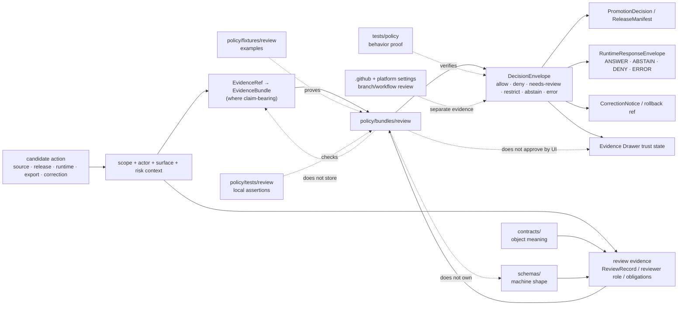

<!-- [KFM_META_BLOCK_V2]
doc_id: kfm://doc/NEEDS_VERIFICATION_UUID
title: Review Policy Bundle
type: standard
version: v1
status: review
owners: @bartytime4life (policy-scope owner; leaf ownership NEEDS_VERIFICATION)
created: 2026-04-23
updated: 2026-04-23
policy_label: public
related: ["../README.md", "../../README.md", "../runtime/README.md", "../../fixtures/README.md", "../../tests/README.md", "../../policy-runtime/README.md", "../../../contracts/README.md", "../../../schemas/README.md", "../../../packages/policy/README.md", "../../../tests/policy/README.md", "../../../tests/validators/README.md", "../../../.github/workflows/README.md"]
tags: [kfm, policy, policy-bundles, review, review-record, steward-review, deny-by-default]
notes: ["doc_id requires repo-backed UUID before publication", "leaf-specific ownership must be verified against CODEOWNERS or governance records before merge", "this README upgrades the current review-bundle reservation into a bounded seam contract without claiming executable rule maturity", "paths to proposed rule files, fixtures, tests, and schemas remain NEEDS VERIFICATION until active-branch inventory confirms them"]
[/KFM_META_BLOCK_V2] -->

<a id="top"></a>

# Review Policy Bundle

Executable-policy seam for deciding when KFM artifacts, claims, releases, corrections, exports, and runtime surfaces require human, steward, or separation-of-duty review.

> [!IMPORTANT]
> **Status:** `experimental` · **Doc status:** `review` · **Owners:** `@bartytime4life` *(policy-scope owner signal; leaf-specific ownership still needs active-branch verification)* · **Path:** `policy/bundles/review/README.md`  
>         
> **Repo fit:** child seam under [`../README.md`](../README.md), inside the top-level policy lane [`../../README.md`](../../README.md); paired with reusable examples in [`../../fixtures/README.md`](../../fixtures/README.md), sibling bundle-local assertions in [`../../tests/README.md`](../../tests/README.md), runtime coordination in [`../../policy-runtime/README.md`](../../policy-runtime/README.md), contract/schema boundaries in [`../../../contracts/README.md`](../../../contracts/README.md) and [`../../../schemas/README.md`](../../../schemas/README.md), shared support in [`../../../packages/policy/README.md`](../../../packages/policy/README.md), broader proof in [`../../../tests/policy/README.md`](../../../tests/policy/README.md), validator proof in [`../../../tests/validators/README.md`](../../../tests/validators/README.md), and workflow guardrails in [`../../../.github/workflows/README.md`](../../../.github/workflows/README.md).  
> **Quick jump:** [Scope](#scope) · [Current evidence posture](#current-evidence-posture) · [Repo fit](#repo-fit) · [Accepted inputs](#accepted-inputs) · [Exclusions](#exclusions) · [Directory tree](#directory-tree) · [Quickstart](#quickstart) · [Usage](#usage) · [Review grammar](#review-grammar) · [Reference tables](#reference-tables) · [Diagram](#diagram) · [Task list](#task-list--definition-of-done) · [FAQ](#faq) · [Appendix](#appendix)

---

## Scope

`policy/bundles/review/` owns the **review-decision seam** for KFM policy.

Its job is narrow: decide whether a candidate action has adequate review posture for the surface being requested. It should help policy, release, runtime, and steward reviewers answer:

1. Is review required for this artifact, claim, release, correction, export, or runtime response?
2. Does the supplied `ReviewRecord` or equivalent review evidence match the exact scope?
3. Is the reviewer role authorized for the risk class and policy seam?
4. Are obligations, corrections, restrictions, and rollback references visible downstream?
5. Should the policy outcome be `allow`, `deny`, `needs-review`, `restrict`, `abstain`, or `error`?

This directory does **not** own the `ReviewRecord` contract, the schema shape, the review queue UI, steward identity management, workflow branch protection, release manifests, or proof stores. It consumes those surfaces through governed inputs and emits review-aware decisions.

### Status markers used here

| Marker | Meaning in this README |
|---|---|
| **CONFIRMED** | Directly supported by current public repo evidence, mounted repo evidence, or adjacent KFM documentation. |
| **INFERRED** | Strongly supported by KFM doctrine and adjacent repo-facing documents, but not independently proven as mounted executable implementation. |
| **PROPOSED** | Repo-native starter structure or maintenance guidance consistent with KFM doctrine. |
| **UNKNOWN** | Not verified strongly enough to state as current repo reality. |
| **NEEDS VERIFICATION** | A branch, path, engine, owner, workflow, or executable detail that must be checked before merge. |

> [!CAUTION]
> A review bundle can block or route a candidate. It cannot make review happen by itself. Actual review evidence must come from typed review records, governance process, release/correction receipts, CODEOWNERS or steward rules, and branch/workflow evidence where applicable.

[Back to top](#top)

---

## Current evidence posture

| Surface or claim | Status | Current reading |
|---|---:|---|
| `policy/bundles/review/README.md` path | **CONFIRMED from public raw file** | Current public content is a one-line reservation. This revision replaces it with a full seam contract. |
| This leaf as an executable rule pack | **NEEDS VERIFICATION** | A README does not prove `.rego` files, manifests, fixtures, tests, CI entrypoints, or enforcement. |
| Parent `policy/bundles/` lane | **CONFIRMED from current public docs** | Parent lane defines bundles as small, typed, reviewable executable rule packs for trust seams. |
| `review` as a first-class seam family | **CONFIRMED doctrine / PROPOSED enforcement** | Parent bundle docs list `review/` as a smallest useful executable fill and describe review as a policy seam. |
| `ReviewRecord` object family | **INFERRED / PROPOSED schema surface** | Review state, notes, decisions, release/correction references, and steward obligations are repeatedly identified as required trust-bearing objects. |
| OPA/Rego adoption for this leaf | **PROPOSED / NEEDS VERIFICATION** | Use as the starter policy-as-code direction only after branch inventory confirms runner and import conventions. |
| Workflow or branch enforcement | **UNKNOWN** | Workflow docs and branch protections require direct verification; this README must not claim merge-blocking enforcement. |

[Back to top](#top)

---

## Repo fit

This leaf sits below the parent bundle lane and beside sibling policy proof surfaces. It should stay close to review fixtures and tests without absorbing their responsibilities.

| Direction | Surface | Why it matters |
|---|---|---|
| Parent | [`../README.md`](../README.md) | Defines `policy/bundles/` as the seam-local executable rule-pack lane. |
| Parent | [`../../README.md`](../../README.md) | Defines `policy/` as the broader deny-by-default decision surface for publication, runtime trust, rights, sensitivity, review, correction, and release admissibility. |
| Sibling proof | [`../../fixtures/README.md`](../../fixtures/README.md) | Holds positive and negative examples such as complete review, missing review, wrong scope, unauthorized reviewer, stale review, and correction-review cases. |
| Sibling proof | [`../../tests/README.md`](../../tests/README.md) | Holds bundle-local assertions and import/path checks. |
| Runtime coordination | [`../../policy-runtime/README.md`](../../policy-runtime/README.md) | Explains how consumers should evaluate policy without relocating policy authority. |
| Contract boundary | [`../../../contracts/README.md`](../../../contracts/README.md) | Owns semantic definitions for `ReviewRecord`, `DecisionEnvelope`, `PromotionDecision`, `CorrectionNotice`, `ReleaseManifest`, and related objects. |
| Schema boundary | [`../../../schemas/README.md`](../../../schemas/README.md) | Owns machine-checkable shape; this bundle must not fork schema authority. |
| Shared support | [`../../../packages/policy/README.md`](../../../packages/policy/README.md) | Suitable place for loaders/adapters/helpers; not a second policy authority. |
| Repo-facing proof | [`../../../tests/policy/README.md`](../../../tests/policy/README.md) | Proves review policy behavior under runtime, release, export, rollback, and correction pressure. |
| Validator proof | [`../../../tests/validators/README.md`](../../../tests/validators/README.md) | Proves checked-in policy data and bundle manifests validate and fail closed. |
| Workflow guardrails | [`../../../.github/workflows/README.md`](../../../.github/workflows/README.md) | Documents gate expectations; active blocking behavior remains branch/platform evidence. |

### Working rule

`policy/bundles/review/` owns **review admissibility logic**. It must not become the review database, review queue, workflow approval system, schema registry, or UI trust cue layer.

[Back to top](#top)

---

## Accepted inputs

Only content that helps the review seam make finite, inspectable policy decisions belongs here.

| Accepted input | Examples | Conditions |
|---|---|---|
| Review rule files | `review_required.rego`, `review_record_scope.rego`, `reviewer_role.rego`, `separation_of_duty.rego` | Must consume typed inputs and fail closed on missing or malformed review evidence. |
| Bundle manifest / index | `bundle.yaml`, `bundle.json` | Must name seam, version, owner, rule files, result grammar, fixtures, tests, and downstream trust objects. |
| Review-state helpers | `is_review_required`, `review_scope_matches`, `review_is_stale`, `reviewer_is_authorized` | Must avoid duplicating canonical schema or role registries. |
| Reason / obligation references | `review_required`, `review_record_missing`, `steward_review_missing`, `review_scope_mismatch`, `reviewer_role_missing` | Should point to shared reason/obligation vocabularies when a shared registry exists. |
| Leaf README and rationale | this README, concise migration notes | Must keep active branch facts separate from proposed rule maturity. |
| Fixture/test references | links to `../../fixtures/review/` and `../../tests/review/` once created | References are allowed here; reusable examples and assertions should stay in sibling proof lanes. |

### Minimum bar before calling this bundle executable

A review bundle should not be called executable until it has all of the following:

- [ ] A named review seam and explicit bundle version.
- [ ] At least one machine-readable rule body.
- [ ] A finite result grammar.
- [ ] Stable reason and obligation references.
- [ ] Paired positive and negative fixtures.
- [ ] Bundle-local assertions.
- [ ] Broader policy or e2e proof when outward release/runtime/correction behavior changes.
- [ ] Downstream trust objects named explicitly.
- [ ] Rollback or disable path for policy-significant changes.

[Back to top](#top)

---

## Exclusions

| Does **not** belong here | Put it instead | Why |
|---|---|---|
| `ReviewRecord` schema bodies | [`../../../schemas/README.md`](../../../schemas/README.md) and the repo’s verified review schema home | Shape authority belongs in schemas, not policy bundle code. |
| Semantic object contracts | [`../../../contracts/README.md`](../../../contracts/README.md) | This bundle consumes object meaning; it does not define all object semantics. |
| Review record instances | governed `data/` review/receipt/proof surfaces, once verified | Review evidence is process/release memory, not bundle source. |
| Review queue UI, steward console, or approval forms | verified app/UI seam | UI review ergonomics must reflect policy; it must not replace policy. |
| CODEOWNERS, branch protections, or workflow approvals | [`../../../.github/workflows/README.md`](../../../.github/workflows/README.md) and platform settings | Review enforcement evidence may live outside repo files. |
| Generic fixtures | [`../../fixtures/README.md`](../../fixtures/README.md) | Keep examples reusable and reviewable across seams. |
| Generic bundle-local tests | [`../../tests/README.md`](../../tests/README.md) | Keep assertions as sibling proof, not hidden inside rule folders. |
| Runtime loaders, API adapters, decision assemblers | [`../../policy-runtime/README.md`](../../policy-runtime/README.md) or verified runtime package/app seam | Execution glue is adjacent to policy law, not the law itself. |
| Secrets, signing keys, `.env`, live credentials | secret manager / deployment configuration | Sensitive operational material must never live in a public policy bundle. |
| RAW, WORK, QUARANTINE, PROCESSED, CATALOG, TRIPLET, or PUBLISHED artifacts | [`../../../data/README.md`](../../../data/README.md) and governed lifecycle stores | Policy governs lifecycle movement; it is not canonical storage. |
| UI-only conditionals treated as policy | nowhere | KFM rejects policy theater in presentation code. |

[Back to top](#top)

---

## Directory tree

### Current public leaf posture — CONFIRMED, active checkout still needs verification

```text
policy/
└── bundles/
    └── review/
        └── README.md
```

### Smallest executable fill pattern — PROPOSED

```text
policy/
└── bundles/
    └── review/
        ├── README.md
        ├── bundle.yaml
        ├── review_required.rego
        ├── review_record_scope.rego
        ├── reviewer_role.rego
        └── separation_of_duty.rego
```

### Required sibling proof once rules land — PROPOSED

```text
policy/
├── fixtures/
│   └── review/
│       ├── allow_review_complete.json
│       ├── needs_review_missing_record.json
│       ├── deny_wrong_scope.json
│       ├── deny_unauthorized_reviewer.json
│       ├── deny_steward_review_missing.json
│       └── deny_correction_without_review.json
└── tests/
    └── review/
        ├── README.md
        └── review_bundle_test.rego

tests/
└── policy/
    └── review/
        └── README.md
```

> [!NOTE]
> The proposed tree is intentionally small. Add one seam, one manifest, one rule family, and paired proof before expanding.

[Back to top](#top)

---

## Quickstart

Run these commands from the repository root after checking out the active branch.

### 1. Confirm this leaf and nearest policy siblings

```bash
find policy/bundles/review -maxdepth 4 -type f 2>/dev/null | sort
find policy/bundles policy/fixtures policy/tests policy/policy-runtime -maxdepth 4 -type f 2>/dev/null | sort
```

### 2. Discover executable bundle artifacts

```bash
find policy/bundles/review -type f \
  \( -name '*.rego' -o -name 'bundle.*' -o -name '*.yaml' -o -name '*.yml' -o -name '*.json' -o -name '*.md' \) \
  | sort
```

### 3. Trace review vocabulary and trust-object references

```bash
grep -RInE \
  'ReviewRecord|review_required|steward_review_missing|review_scope_mismatch|reviewer_role|separation_of_duty|DecisionEnvelope|PromotionDecision|CorrectionNotice|ReleaseManifest|EvidenceBundle|needs-review|STEWARD_REVIEW|review_pending' \
  policy contracts schemas tests docs apps packages data 2>/dev/null || true
```

### 4. Inspect paired proof before trusting the bundle

```bash
find policy/fixtures/review policy/tests/review tests/policy tests/e2e/release_assembly tests/e2e/correction \
  -maxdepth 5 -type f 2>/dev/null | sort
```

### 5. Check local policy tooling without assuming it exists

```bash
command -v opa >/dev/null && opa version || echo "opa not found"
command -v conftest >/dev/null && conftest --version || echo "conftest not found"
```

### 6. Run bundle checks only after a runner is verified

```bash
# Example only — adapt to the repo's verified runner, imports, and fixture layout.
if command -v conftest >/dev/null; then
  conftest test policy/fixtures/review --policy policy/bundles/review
else
  echo "NEEDS VERIFICATION: no conftest runner found on PATH"
fi
```

> [!TIP]
> A command that finds a review file is not proof of enforcement. Treat workflow YAML, branch protections, CODEOWNERS, emitted review records, and CI outputs as separate verification items.

[Back to top](#top)

---

## Usage

### Add a review policy rule safely

1. Start with the review seam, not the filename.
2. Name the decision being constrained.
3. Identify the candidate surface: source admission, promotion, release, correction, export, runtime answer, Evidence Drawer payload, or Story Node publication.
4. Reference the typed review object or review evidence field supplied to policy.
5. Add one positive fixture and at least one negative fixture in [`../../fixtures/`](../../fixtures/README.md).
6. Add bundle-local assertions in [`../../tests/`](../../tests/README.md).
7. Extend [`../../../tests/policy/`](../../../tests/policy/README.md) or the relevant end-to-end proof lane when outward behavior changes.
8. Link affected trust objects: `ReviewRecord`, `DecisionEnvelope`, `PromotionDecision`, `ReleaseManifest`, `CorrectionNotice`, `EvidenceBundle`, and audit/receipt references.
9. Record rollback posture in the PR notes.

### Change review semantics safely

Changing review requirements is policy-significant.

- Version the bundle or manifest.
- Keep old/new semantics visible in the review summary.
- Re-run local bundle assertions and broader policy proof.
- Update contracts/schema references only through their owning lanes.
- Do not hide a missing review as a generic denial.
- Do not allow UI review cues to substitute for backend review policy.

### Keep review policy subordinate to evidence

A review bundle may decide whether a candidate has enough review support. It may not make unsupported evidence true or publishable.

A safe review-aware flow remains:

1. Define scope and candidate surface.
2. Resolve source, actor, rights, sensitivity, and release context.
3. Resolve `EvidenceRef` to `EvidenceBundle` where needed.
4. Validate schema and catalog/proof closure where needed.
5. Evaluate review policy.
6. Emit a finite decision with reasons and obligations.
7. Preserve audit, receipt, review, and rollback references.

[Back to top](#top)

---

## Review grammar

### Review policy results

| Result / state | Use when | Required behavior |
|---|---|---|
| `allow` | Review is not required, or required review is complete, scoped, current, and authorized. | Continue with named obligations and review references where applicable. |
| `needs-review` | Machine policy cannot safely resolve the candidate without human or steward review. | Route to review with stable reason codes; do not silently allow. |
| `deny` | Review is required but missing, wrong-scope, unauthorized, stale, conflicted, or forbidden by separation-of-duty rules. | Block the candidate and preserve accountable reasons. |
| `restrict` | Review allows a narrower actor, audience, precision, time window, or release surface only. | Carry obligations into downstream trust objects. |
| `abstain` | Runtime-facing policy lacks enough review facts to make a claim-bearing response. | Do not substitute model or UI speculation for missing review evidence. |
| `error` | Input is malformed, schema validation fails, review state cannot be interpreted, or policy engine fails. | Fail visibly; do not imply policy approval. |

### Review-state vocabulary — PROPOSED unless shared registry confirms otherwise

| State | Meaning | Common consequence |
|---|---|---|
| `not_required` | Review burden does not apply to the scoped surface. | May continue if other gates pass. |
| `required` | Review burden applies but no reviewed state is supplied yet. | `needs-review` or `deny`, depending on surface. |
| `pending` | Review is underway but not complete. | Hold promotion; runtime should abstain or deny when claim-bearing. |
| `approved` | Reviewer approved the scoped candidate. | May continue if policy, evidence, catalog, and proof gates pass. |
| `approved_with_obligations` | Reviewer approved with restrictions or required display/handling obligations. | Carry obligations downstream. |
| `rejected` | Reviewer rejected the candidate. | Deny promotion or release. |
| `conflicted` | Review records disagree or scope cannot be reconciled. | Deny or hold until resolved. |
| `expired` | Review is stale for the current release/source/correction scope. | Re-review required. |
| `superseded` | Review has been replaced by a newer decision. | Use current review only; keep lineage visible. |
| `withdrawn` | Review support was withdrawn. | Block or correct affected public surfaces. |

### Representative reason codes — PROPOSED

| Reason code | Trigger | Typical result |
|---|---|---|
| `review_required` | Risk class or policy seam requires review. | `needs-review` |
| `review_record_missing` | Required review evidence is absent. | `deny` for release; `abstain` or `deny` for runtime depending on surface. |
| `steward_review_missing` | Steward or domain-specific review is required but absent. | `deny` |
| `review_scope_mismatch` | Review does not match artifact, claim, release, correction, actor, geography, or time scope. | `deny` |
| `reviewer_role_missing` | Reviewer role is absent or not authorized for the seam. | `deny` |
| `separation_of_duty_violation` | Same actor proposes and approves a policy-significant release where separation is required. | `deny` |
| `review_stale` | Review predates material source, schema, policy, correction, or release change. | `needs-review` or `deny` |
| `review_conflicted` | Multiple review records conflict. | `deny` |
| `correction_review_missing` | Correction, withdrawal, or rollback lacks review. | `deny` |
| `review_input_malformed` | Policy input cannot be interpreted reliably. | `error` |

[Back to top](#top)

---

## Reference tables

### Review seam responsibilities

| Pressure | Local bundle responsibility | Paired proof surface | Downstream trust object |
|---|---|---|---|
| Missing review | Emit `needs-review` or `deny` according to surface class. | `../../fixtures/review/` + `../../tests/review/` | `DecisionEnvelope`, `PromotionDecision` |
| Wrong review scope | Deny candidate until review matches artifact/release/claim/correction scope. | Review negative fixture | `ReviewRecord`, `ReleaseManifest`, audit ref |
| Unauthorized reviewer | Deny or route to authorized reviewer. | Reviewer-role fixture and assertion | `DecisionEnvelope`, obligations |
| Steward-only review | Deny public promotion without steward review. | Steward-review negative fixture | `EvidenceBundle`, release state |
| Separation-of-duty burden | Deny self-approval where policy class requires separation. | Actor-role fixture | `PromotionDecision`, audit ref |
| Review-stale after material change | Hold or deny until review refreshes. | Supersession/correction fixture | `CorrectionNotice`, `ReleaseManifest` |
| Correction or rollback | Require explicit review and visible lineage. | Correction/rollback fixture | `CorrectionNotice`, rollback reference |
| Runtime answer with incomplete review | Force `ABSTAIN` or `DENY`, not a fluent answer. | Runtime parity proof | `RuntimeResponseEnvelope` |

### Surface classes

| Surface class | Review burden | Safe outcome when review is missing |
|---|---|---|
| Source admission | Source steward or policy review may be required before use. | `needs-review` or `deny` |
| Promotion / release | Review must match release scope and risk class. | `deny` |
| Runtime answer | Review state must support the claim-bearing result. | `ABSTAIN` or `DENY` downstream |
| Evidence Drawer | Review state must be visible when it affects trust. | Do not render hidden trust state |
| Story publication | Review must cover narrative claims and sidecar evidence. | Hold publication |
| Export | Review must cover audience, rights, sensitivity, and scope. | `deny` |
| Correction / withdrawal | Review must cover target artifact and public consequence. | Hold correction publication until reviewed, unless emergency withdrawal policy says otherwise |

### Boundary responsibilities

| Surface | Owns what | Should stay out of |
|---|---|---|
| `policy/bundles/review/` | Review rule family, finite decision grammar, and bundle manifest. | Generic fixtures, schema authority, review UI, and workflow approval settings. |
| `policy/fixtures/review/` | Small review examples for pass/fail paths. | Policy law and canonical object definitions. |
| `policy/tests/review/` | Bundle-local assertions. | Broader runtime/release behavior proof. |
| `policy/policy-runtime/` | Runtime-policy coordination notes. | Review object definition or executable rule authorship. |
| `contracts/` | Review object meaning and field intent. | Executable policy logic. |
| `schemas/` | Machine-checkable review object shape. | Review semantics as sole authority. |
| `data/` review/receipt/proof surfaces | Review instances and emitted process/release memory. | Policy source code. |
| `.github/` and platform settings | Workflow and branch review controls. | Hidden policy law. |

[Back to top](#top)

---

## Diagram



The diagram shows responsibility boundaries, not runtime maturity. A review bundle can shape downstream behavior only through governed interfaces, typed inputs, proofs, and trust-bearing objects.

[Back to top](#top)

---

## Task list / definition of done

Before a change to this leaf is merged:

- [ ] `doc_id`, leaf owner, and CODEOWNERS signals are verified from repo history or governance records.
- [ ] Active branch inventory confirms whether this directory is README-only or contains executable rule files.
- [ ] Any `*.rego` or equivalent rule body has a bundle manifest.
- [ ] Review result grammar is finite and documented.
- [ ] Reason and obligation references do not fork shared vocabularies.
- [ ] Positive and negative review fixtures exist outside this directory in the sibling fixture lane.
- [ ] Bundle-local assertions exist outside this directory in the sibling policy-test lane.
- [ ] Broader policy or e2e proof is updated when release, runtime, export, correction, or public UI behavior changes.
- [ ] Contract/schema links are references only; this directory does not fork object definitions.
- [ ] Review rules do not read RAW, WORK, QUARANTINE, unpublished candidates, secrets, credentials, or private data stores directly.
- [ ] Review state remains visible in downstream trust objects when it affects public, semi-public, steward, or runtime behavior.
- [ ] Separation-of-duty requirements are tested where the input model supports actor/reviewer identity.
- [ ] Rollback or disable instructions are documented for policy-significant bundle changes.

[Back to top](#top)

---

## FAQ

### Does this directory own the review process?

No. It owns a review-policy seam. Review workflows, steward assignment, CODEOWNERS, branch protections, and review records live in their verified homes.

### Does this directory own `ReviewRecord`?

No. Contract meaning and machine shape belong under the contract and schema authority surfaces. This bundle only evaluates review evidence supplied to it.

### Can a README-only review directory be called executable?

No. A README can reserve responsibility and document boundaries. It does not prove executable rules, manifests, fixtures, tests, CI entrypoints, or runtime/release enforcement.

### What should happen when review is required but missing?

A release or public publication path should fail closed with a stable review reason. A runtime path should abstain or deny according to the surface and risk class. It must not produce a fluent answer that hides missing review.

### What should happen when review exists but is out of scope?

Treat it as missing for the current candidate. A review for one artifact, release, source version, geography, time window, audience, or correction does not silently approve another.

### Can UI trust badges replace this bundle?

No. UI badges and Evidence Drawer states should reflect backend policy decisions. Presentation logic is not policy enforcement.

### What is the smallest useful next implementation?

Add one `bundle.yaml`, one `review_required` rule, one scope-match helper, one valid fixture, three negative fixtures, one local assertion pack, and one broader policy proof case. Stop there until the branch proves the full seam.

[Back to top](#top)

---

## Appendix

<details>
<summary><strong>Illustrative review bundle manifest — PROPOSED</strong></summary>

```yaml
schema_version: kfm.policy_bundle.v1
bundle_id: kfm.policy.bundles.review
bundle_version: 0.1.0
status: proposed
surface_class: review
owner: "@bartytime4life"
engine: opa-rego-starter

owned_results:
  - allow
  - deny
  - needs-review
  - restrict
  - abstain
  - error

rule_files:
  - review_required.rego
  - review_record_scope.rego
  - reviewer_role.rego
  - separation_of_duty.rego

paired_fixtures:
  valid:
    - ../../fixtures/review/allow_review_complete.json
  invalid:
    - ../../fixtures/review/needs_review_missing_record.json
    - ../../fixtures/review/deny_wrong_scope.json
    - ../../fixtures/review/deny_unauthorized_reviewer.json
    - ../../fixtures/review/deny_steward_review_missing.json
    - ../../fixtures/review/deny_correction_without_review.json

paired_tests:
  local:
    - ../../tests/review/review_bundle_test.rego
  repo_facing:
    - ../../../tests/policy/review/

downstream_trust_objects:
  - ReviewRecord
  - DecisionEnvelope
  - PromotionDecision
  - ReleaseManifest
  - EvidenceBundle
  - RuntimeResponseEnvelope
  - CorrectionNotice
  - audit_ref
  - rollback_ref

notes:
  - "Illustrative only until active branch runner and schema conventions are verified."
  - "Do not fork schema or contract authority inside this bundle."
```

</details>

<details>
<summary><strong>Illustrative review decision input — PROPOSED</strong></summary>

```yaml
input:
  candidate:
    candidate_id: rel.example.hydrology.0001
    surface_class: release
    action: promote
    risk_class: public_release
    evidence_bundle_ref: eb.example.0001
    release_manifest_ref: rm.example.0001

  actor:
    proposer_id: user.example.submitter
    workload_identity: null

  review:
    required: true
    records:
      - review_record_id: rr.example.0001
        subject_ref: rel.example.hydrology.0001
        reviewer_id: user.example.reviewer
        reviewer_role: release_steward
        state: approved_with_obligations
        valid_for_surface: release
        valid_for_release_ref: rm.example.0001
        obligations:
          - include_evidence_drawer_refs
          - preserve_correction_visibility

  policy_context:
    rights_class: public
    sensitivity_class: public
    separation_of_duty_required: true

expected_decision:
  result: allow
  reason_codes:
    - REVIEW_REQUIRED
    - REVIEW_RECORD_SCOPE_MATCHED
    - REVIEWER_ROLE_AUTHORIZED
    - SEPARATION_OF_DUTY_SATISFIED
  obligation_codes:
    - INCLUDE_REVIEW_REF
    - CARRY_OBLIGATIONS_DOWNSTREAM
```

</details>

[Back to top](#top)
