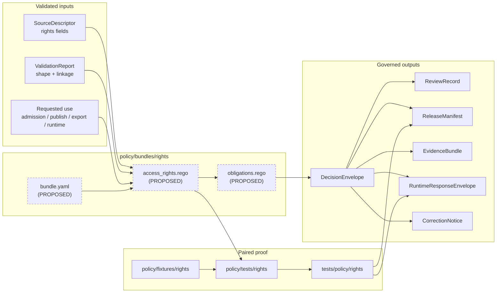

<!-- [KFM_META_BLOCK_V2]
doc_id: kfm://doc/NEEDS_VERIFICATION_UUID
title: Rights Policy Bundle
type: standard
version: v1
status: draft
owners: @bartytime4life (NEEDS VERIFICATION on active branch)
created: 2026-04-23
updated: 2026-04-23
policy_label: public
related: ["../README.md", "../../README.md", "../../fixtures/README.md", "../../tests/README.md", "../../policy-runtime/README.md", "../../../contracts/README.md", "../../../schemas/README.md", "../../../tests/policy/README.md", "../../../data/README.md", "../../../data/receipts/README.md", "../../../.github/workflows/README.md"]
tags: [kfm, policy, bundles, rights, governance, deny-by-default]
notes: ["doc_id remains a review placeholder until the repo document registry assigns a UUID", "owner follows documented policy-lane ownership but needs active-branch verification", "this README is created for policy/bundles/rights/README.md; executable bundle files remain PROPOSED unless the branch surfaces them", "relative links are computed from policy/bundles/rights/ and should be verified before merge"]
[/KFM_META_BLOCK_V2] -->

<a id="top"></a>

# Rights Policy Bundle

_Governs whether KFM data, claims, releases, exports, and runtime answers may proceed when rights, reuse, attribution, license, permission, embargo, or source-term conditions are present._

<div align="left">


</div>

| Field | Value |
|---|---|
| **Path** | `policy/bundles/rights/README.md` |
| **Status** | `experimental` |
| **Owners** | `@bartytime4life` — **NEEDS VERIFICATION** against active `CODEOWNERS` |
| **Primary job** | Decide rights admissibility and rights obligations after validation has established the input shape |
| **Not this lane** | Legal advice, source onboarding, schema ownership, sensitivity generalization, runtime adapters, release manifests, or fixture/test ownership |
| **Quick jump** | [Scope](#scope) · [Repo fit](#repo-fit) · [Accepted inputs](#accepted-inputs) · [Exclusions](#exclusions) · [Directory tree](#directory-tree) · [Quickstart](#quickstart) · [Usage](#usage) · [Decision model](#decision-model) · [Diagram](#diagram) · [Definition of done](#definition-of-done) · [FAQ](#faq) · [Appendix](#appendix) |

> [!IMPORTANT]
> Rights uncertainty is not a soft warning in KFM. Missing, conflicting, expired, prohibited, or unreviewed rights posture should block promotion, narrow scope, require review, or force a governed negative runtime outcome rather than silently publishing.

---

## Scope

This bundle is the rights seam inside `policy/bundles/`.

It should answer one narrow question:

> Given a validated source, artifact, claim, release candidate, export request, or runtime answer, does the rights posture allow the requested use, and what obligations must travel downstream?

### Evidence posture used here

| Label | Meaning in this README |
|---|---|
| **CONFIRMED** | Supported by attached KFM doctrine or adjacent repo-facing documentation surfaced in this session |
| **INFERRED** | Strongly implied by KFM doctrine and surrounding policy documentation, but not proven as mounted implementation |
| **PROPOSED** | Repo-ready structure or practice that fits KFM doctrine but is not asserted as current branch reality |
| **UNKNOWN** | Not supported strongly enough to present as current branch or runtime fact |
| **NEEDS VERIFICATION** | Requires active-branch inspection before merge |

### Rights bundle responsibilities

| Responsibility | Rights bundle posture |
|---|---|
| Source admission | Require explicit rights posture before a source can become release-relevant |
| Publication | Deny or hold public release when rights are unknown, prohibited, expired, or review-required |
| Runtime answers | Force `ABSTAIN` or `DENY` when a claim-bearing answer cannot use policy-allowed evidence |
| Exports | Carry attribution, reuse, derivative, redistribution, embargo, and audience obligations forward |
| Review | Escalate permissioned, steward-controlled, culturally sensitive, proprietary, or ambiguous rights cases |
| Correction | Preserve withdrawal, supersession, and rights-change consequences after publication |

### What this bundle does **not** decide

- whether geometry is sensitive enough to generalize — use the sibling sensitivity bundle
- whether a source is authoritative for a domain claim — use source admission and source-role policy
- whether a schema is valid — use `schemas/` and validator lanes
- whether a release is complete — use release/promotion policy and proof-pack checks
- whether an app may bypass policy — no normal public path may bypass governed policy

[Back to top](#top)

---

## Repo fit

This README is the child-lane guide for the rights bundle under the policy bundle family.

| Direction | Surface | Why it matters |
|---|---|---|
| Parent bundle lane | [`../README.md`](../README.md) | Defines what counts as an executable, reviewable policy bundle |
| Parent policy lane | [`../../README.md`](../../README.md) | Defines policy as the decision layer for rights, sensitivity, release, runtime, and correction |
| Sibling fixtures | [`../../fixtures/README.md`](../../fixtures/README.md) | Holds positive and negative cases for this bundle |
| Sibling bundle tests | [`../../tests/README.md`](../../tests/README.md) | Holds bundle-local assertions close to policy |
| Runtime coordination | [`../../policy-runtime/README.md`](../../policy-runtime/README.md) | Explains how runtime consumers should use policy without relocating authority |
| Contracts | [`../../../contracts/README.md`](../../../contracts/README.md) | Owns semantic meaning for trust objects and shared fields |
| Schemas | [`../../../schemas/README.md`](../../../schemas/README.md) | Owns executable shape and validation boundaries |
| Data lifecycle | [`../../../data/README.md`](../../../data/README.md) | Holds lifecycle zones policy governs but does not own |
| Receipts | [`../../../data/receipts/README.md`](../../../data/receipts/README.md) | Holds process-memory records that may support rights decisions |
| Repo-facing proof | [`../../../tests/policy/README.md`](../../../tests/policy/README.md) | Proves rights behavior survives release, runtime, export, and correction surfaces |
| Workflow guardrails | [`../../../.github/workflows/README.md`](../../../.github/workflows/README.md) | Documents merge-gate expectations; active workflow YAML still needs verification |

> [!WARNING]
> Do not let `policy/bundles/rights/` become a second authoritative vocabulary, schema, or legal archive. This bundle should reference shared reason, obligation, rights, sensitivity, and trust-object homes rather than forking them.

[Back to top](#top)

---

## Accepted inputs

Only content that makes the rights decision seam executable, reviewable, or easier to maintain belongs here.

| Input class | What belongs here | Typical shape |
|---|---|---|
| Rights bundle README | Boundary, review rules, minimal examples, and definition of done | `README.md` |
| Bundle manifest | Bundle name, version, dependencies, paired fixtures/tests, affected trust objects | `bundle.yaml` or `bundle.json` |
| Rights policy body | Machine-readable allow/deny/restrict/review logic for this seam | `access_rights.rego` or repo-native equivalent |
| Rights obligation helpers | Local helpers for attribution, embargo, export restriction, permission, or review obligations | `obligations.rego` if the branch uses Rego |
| Local rationale notes | Short notes that explain a rights rule without becoming a legal memorandum | `notes.md`, `rationale.md` |
| Dependency references | Links to canonical vocabularies, schemas, fixtures, tests, and proof lanes | manifest fields, README links |

### Required input fields to look for

The exact schema home is **NEEDS VERIFICATION**, but a rights decision normally needs these field families somewhere in the validated input.

| Field family | Why it matters |
|---|---|
| `source_ref` / `source_id` | Rights cannot be detached from source identity |
| `rights_class` / `rights_status` | Determines whether the use is open, restricted, permissioned, unknown, embargoed, or prohibited |
| `license_or_terms_ref` | Keeps source terms inspectable without pasting legal text into the bundle |
| `public_release_allowed` | Explicitly separates internal use from public publication |
| `redistribution_allowed` | Prevents public package/export drift |
| `derivative_allowed` | Prevents transformed artifacts from inheriting permission by convenience |
| `attribution_required` / `attribution_text_ref` | Ensures outward surfaces carry required credit |
| `permission_ref` | Links permissioned use to reviewable evidence |
| `embargo_until` | Blocks premature release |
| `review_state` / `review_record_ref` | Keeps rights-sensitive exceptions review-bearing |
| `requested_use` | Distinguishes source admission, publication, export, runtime answer, or correction use |

[Back to top](#top)

---

## Exclusions

`policy/bundles/rights/` should stay narrow.

| Does **not** belong here | Put it instead | Why |
|---|---|---|
| Canonical JSON Schema, OpenAPI, or DTO definitions | [`../../../schemas/`](../../../schemas/) and [`../../../contracts/`](../../../contracts/) | Policy consumes validated shape; it does not own shape |
| Shared rights vocabulary as a second registry | Verified `contracts/` or `schemas/` vocabulary home | Duplicate vocabularies create drift |
| Source onboarding records | Source registry / source onboarding docs | Rights policy should decide from source descriptors, not replace them |
| Full license text or legal memoranda | Source records, governance docs, or legal review archive | This bundle is a decision seam, not legal storage |
| Sensitivity redaction or geoprivacy transform rules | Sibling sensitivity bundle | Rights and sensitivity often interact but are not identical |
| Generic fixtures | [`../../fixtures/`](../../fixtures/) | Fixtures must remain reusable and reviewable |
| Generic tests | [`../../tests/`](../../tests/) or [`../../../tests/policy/`](../../../tests/policy/) | Tests should remain sibling or repo-facing proof lanes |
| Runtime loaders, adapters, or API middleware | [`../../policy-runtime/`](../../policy-runtime/) or verified app/package seam | Runtime code must not become hidden policy authority |
| RAW, WORK, QUARANTINE, PROCESSED, CATALOG, or PUBLISHED artifacts | [`../../../data/`](../../../data/) | Policy governs movement and exposure; it is not canonical storage |
| Secrets, keys, credentials, private tokens | Secret manager / host configuration | Sensitive operational material must not live in a public policy bundle |

[Back to top](#top)

---

## Directory tree

### Target file for this task

```text
policy/
└── bundles/
    └── rights/
        └── README.md
```

### Smallest executable fill (**PROPOSED**)

```text
policy/
└── bundles/
    └── rights/
        ├── README.md
        ├── bundle.yaml
        ├── access_rights.rego
        └── obligations.rego
```

### Paired proof surfaces (**PROPOSED / NEEDS VERIFICATION**)

```text
policy/
├── fixtures/
│   └── rights/
│       ├── allow/
│       ├── deny/
│       ├── restrict/
│       └── needs-review/
└── tests/
    └── rights/

tests/
└── policy/
    └── rights/
```

> [!NOTE]
> A subtree is not an executable bundle by itself. The bundle becomes executable only when rule body, manifest, finite result grammar, paired fixtures, paired tests, and downstream trust-object effects are all reviewable.

[Back to top](#top)

---

## Quickstart

Run these from the repository root after the real checkout is mounted.

### 1. Inspect the rights bundle lane

```bash
find policy/bundles/rights -maxdepth 3 -type f 2>/dev/null | sort
```

### 2. Inspect paired fixtures and bundle-local assertions

```bash
find policy/fixtures/rights policy/tests/rights -maxdepth 4 -type f 2>/dev/null | sort
```

### 3. Inspect repo-facing proof for release/runtime/export/correction impact

```bash
find tests/policy tests/e2e -maxdepth 5 -type f 2>/dev/null | sort
```

### 4. Trace rights-bearing vocabulary and trust objects

```bash
grep -RInE \
  'rights_class|rights_status|license|license_or_terms_ref|public_release_allowed|redistribution_allowed|derivative_allowed|attribution_required|permission_ref|embargo_until|DecisionEnvelope|ReviewRecord|ReleaseManifest|EvidenceBundle|RuntimeResponseEnvelope|CorrectionNotice|reason_codes|obligation_codes' \
  policy contracts schemas tests docs data apps packages tools 2>/dev/null || true
```

### 5. Verify policy tool adoption before claiming executable coverage

```bash
command -v opa || true
command -v conftest || true

find policy/bundles -type f \
  \( -name '*.rego' -o -name 'bundle.*' -o -name '*.json' -o -name '*.yaml' -o -name '*.yml' \) \
  | sort
```

> [!CAUTION]
> These commands prove presence, not enforcement. Merge-gate, runtime, release, and export behavior still require tests, workflows, branch settings, and emitted proof objects.

[Back to top](#top)

---

## Usage

### Add or change a rights rule

1. Start with the requested use: source admission, processing, publication, export, runtime answer, correction, or withdrawal.
2. Confirm the input has already passed shape and linkage validation.
3. Keep shared rights, reason, and obligation vocabularies in their canonical home.
4. Add or update the rights bundle rule body.
5. Pair every semantic change with at least one allow case and one deny/restrict/review case.
6. Record affected downstream trust objects.
7. Escalate to repo-facing proof when behavior affects release, runtime, export, or correction.

### Keep reasons and obligations stable

Rights decisions should emit explicit reason and obligation codes.

| Term | Meaning |
|---|---|
| **Reason** | Why the policy decision happened |
| **Obligation** | What must happen next or travel downstream |
| **Restriction** | A narrowing condition that may permit non-public or limited use |
| **Review requirement** | A hold state that needs a reviewer or steward decision before proceeding |

Semantically changing a reason or obligation code should version the bundle, update fixtures, and update downstream proof.

[Back to top](#top)

---

## Decision model

The exact executable grammar is **NEEDS VERIFICATION**. The model below is the recommended rights-bundle shape.

### Result grammar (**PROPOSED**)

| Result | Meaning | Typical downstream effect |
|---|---|---|
| `allow` | Rights support the requested use, subject to obligations | Continue to next gate |
| `deny` | Rights prohibit the requested use | Block promotion/export/runtime release path |
| `restrict` | Rights allow only a narrower use | Narrow audience, surface, export, or attribute set |
| `needs_review` | Rights may allow use, but reviewer/steward/legal review is required | Hold until `ReviewRecord` exists |
| `abstain` | Rights context is insufficient to decide claim-bearing runtime behavior | Runtime should emit `ABSTAIN` or narrow scope |

### Starter rights matrix (**PROPOSED**)

| Condition | Bundle result | Required obligations | Affected trust objects |
|---|---|---|---|
| Rights fields missing | `deny` for promotion; `abstain` for runtime | `REQUIRE_RIGHTS_REVIEW`, `RECORD_DECISION` | `DecisionEnvelope`, `ReviewRecord` |
| License or terms unknown | `deny` public release | `RESOLVE_SOURCE_TERMS`, `HOLD_PUBLICATION` | `SourceDescriptor`, `ReleaseManifest` |
| Public release explicitly disallowed | `deny` public release | `RESTRICT_TO_ALLOWED_AUDIENCE` | `DecisionEnvelope`, `RuntimeResponseEnvelope` |
| Attribution required and present | `allow` with obligations | `CARRY_ATTRIBUTION`, `SURFACE_RIGHTS_NOTICE` | `EvidenceBundle`, layer/export payload |
| Attribution required but missing | `deny` or `needs_review` | `ADD_ATTRIBUTION_TEXT`, `REVIEW_REQUIRED` | `ReviewRecord`, `ReleaseManifest` |
| Derivative use not allowed | `restrict` or `deny` | `DISALLOW_DERIVATIVE_EXPORT`, `REVIEW_TRANSFORM` | `TransformReceipt`, `ReleaseManifest` |
| Redistribution not allowed | `restrict` | `NO_PUBLIC_PACKAGE_EXPORT`, `NO_REHOSTING` | Export payload, release gate |
| Embargo active | `deny` public release until date | `HOLD_UNTIL_EMBARGO_EXPIRES` | `DecisionEnvelope`, `ReleaseManifest` |
| Permissioned source without permission record | `deny` | `REQUIRE_PERMISSION_REF` | `ReviewRecord`, `SourceDescriptor` |
| Steward-controlled rights | `needs_review` | `REQUIRE_STEWARD_REVIEW` | `ReviewRecord`, Evidence Drawer payload |
| Rights changed after publication | `needs_review` or `deny` | `EVALUATE_WITHDRAWAL`, `PROPAGATE_CORRECTION` | `CorrectionNotice`, release refs |

> [!TIP]
> The rights bundle should decide rights admissibility. It should not silently decide sensitivity, source authority, evidence sufficiency, or catalog closure.

[Back to top](#top)

---

## Diagram



[Back to top](#top)

---

## Definition of done

Treat the rights bundle as healthy only when these review checks pass.

- [ ] `policy/bundles/rights/` inventory matches this README or this README is updated.
- [ ] The bundle manifest names the seam, version, dependencies, paired fixtures, paired tests, and affected trust objects.
- [ ] The result grammar is finite and documented.
- [ ] Unknown or missing rights deny promotion and produce governed runtime narrowing or abstention.
- [ ] Rights decisions emit stable reason and obligation codes.
- [ ] Attribution, embargo, redistribution, derivative, permission, and public-release constraints are represented.
- [ ] Positive and negative fixtures exist for every rule family.
- [ ] Bundle-local assertions exist under `policy/tests/rights/` or the repo’s verified equivalent.
- [ ] Release/runtime/export/correction changes are also proven in `tests/policy/` or the appropriate end-to-end proof lane.
- [ ] No canonical schema, rights vocabulary, or legal archive is duplicated inside this bundle.
- [ ] Evidence Drawer, layer, export, and Focus payloads carry rights obligations where the decision requires it.
- [ ] Correction and withdrawal paths stay visible when rights posture changes after publication.
- [ ] Workflow or CI claims are backed by checked-in workflow files, branch settings, and test output.

[Back to top](#top)

---

## FAQ

### Is this bundle legal advice?

No. It is a governed decision seam for KFM. It should encode project-adopted rights rules, explicit obligations, and review holds from admissible source metadata and review records. Legal interpretation or external permission handling belongs in governance or source-review records.

### Can the rights bundle allow a public release by itself?

No. Rights admissibility is necessary, not sufficient. Public release also needs evidence, validation, sensitivity, review, catalog/proof closure, release manifest, rollback posture, and governed publication state.

### Does an executable rights bundle prove runtime enforcement?

No. A bundle proves only local rule semantics until runtime, release, export, and correction proof lanes demonstrate that the same result survives outward surfaces.

### Should unknown rights ever pass as “best effort”?

No. In KFM, unknown rights should block promotion or force a governed negative runtime outcome until resolved.

[Back to top](#top)

---

## Appendix

<details>
<summary><strong>Illustrative fixture shape — not a canonical schema</strong></summary>

```yaml
# policy/fixtures/rights/deny/unknown-rights.yaml
# PROPOSED illustrative fixture only.
input:
  source_ref: "src.example.unknown"
  requested_use: "publish"
  surface_class: "public"
  artifact_ref: "artifact.example.v1"
  rights_status: "unknown"
  license_or_terms_ref: null
  public_release_allowed: null
  attribution_required: null
  review_record_ref: null

expected_decision:
  result: "deny"
  reason_codes:
    - "UNKNOWN_RIGHTS"
  obligation_codes:
    - "REQUIRE_RIGHTS_REVIEW"
    - "HOLD_PUBLICATION"
    - "RECORD_DECISION"

affected_objects:
  - "DecisionEnvelope"
  - "ReviewRecord"
  - "ReleaseManifest"
```

```yaml
# policy/fixtures/rights/allow/attribution-required.yaml
# PROPOSED illustrative fixture only.
input:
  source_ref: "src.example.open-with-attribution"
  requested_use: "publish"
  surface_class: "public"
  artifact_ref: "artifact.example.v1"
  rights_status: "open_with_obligations"
  license_or_terms_ref: "terms.example.open-attribution"
  public_release_allowed: true
  attribution_required: true
  attribution_text_ref: "attribution.example.v1"
  review_record_ref: "review.example.rights.v1"

expected_decision:
  result: "allow"
  reason_codes:
    - "RIGHTS_ALLOWED_WITH_ATTRIBUTION"
  obligation_codes:
    - "CARRY_ATTRIBUTION"
    - "SURFACE_RIGHTS_NOTICE"
    - "RECORD_DECISION"

affected_objects:
  - "DecisionEnvelope"
  - "EvidenceBundle"
  - "ReleaseManifest"
```

</details>

<details>
<summary><strong>Review prompts for maintainers</strong></summary>

- Does this change alter who may see, reuse, export, or republish an artifact?
- Does it introduce a new rights code or obligation that belongs in a shared vocabulary?
- Does it require downstream attribution in Evidence Drawer, map popups, exports, or Story nodes?
- Does it affect runtime answers, not just release assembly?
- Does it create a new review-required exception path?
- Does it need a `CorrectionNotice` or withdrawal path for existing releases?
- Does the fixture set include a denial path, not only an allowed path?
- Does CI prove the bundle result, or only that files exist?

</details>

[Back to top](#top)
