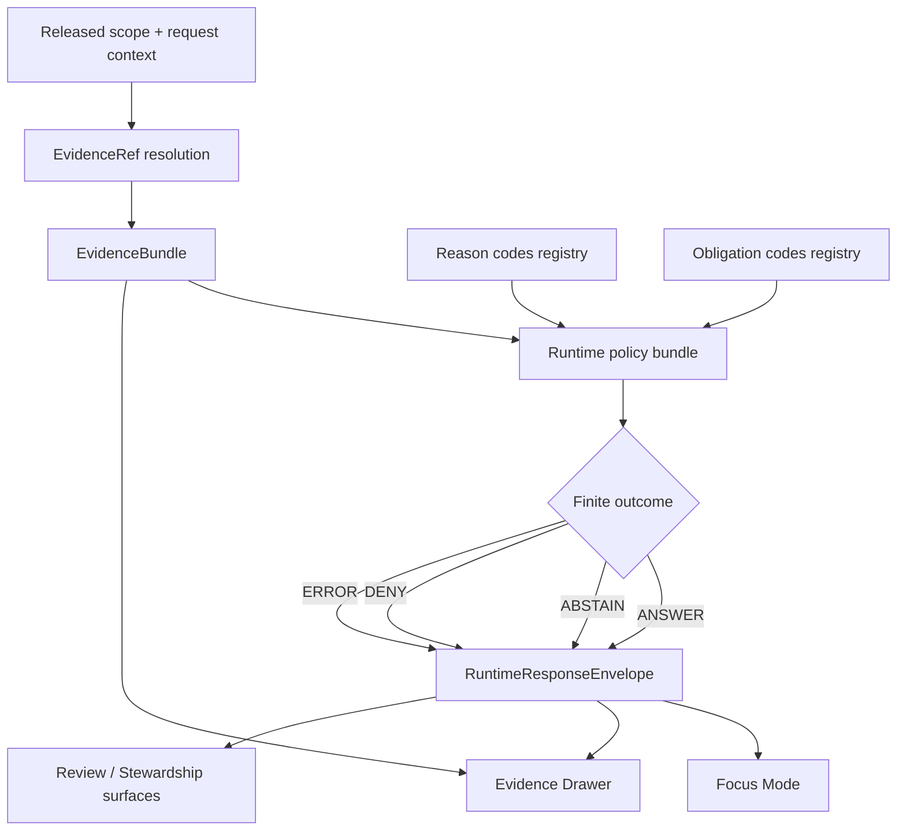

<!-- [KFM_META_BLOCK_V2]
doc_id: kfm://doc/<NEEDS-VERIFICATION-UUID>
title: Runtime Policy Bundles
type: standard
version: v1
status: draft
owners: <OWNER(S) NEEDS VERIFICATION>
created: <YYYY-MM-DD NEEDS VERIFICATION>
updated: <YYYY-MM-DD NEEDS VERIFICATION>
policy_label: <public|restricted NEEDS VERIFICATION>
related: [policy/reason_codes.json (PROPOSED), policy/obligation_codes.json (PROPOSED), contracts/runtime/evidence_bundle.schema.json (PROPOSED), contracts/runtime/runtime_response_envelope.schema.json (PROPOSED)]
tags: [kfm, policy, runtime, evidence, focus]
notes: [Direct repo tree for this lane was not surfaced in this session.; Directory inventory below mixes CONFIRMED doctrine with PROPOSED starter structure.; Replace placeholders after mounted repo verification.]
[/KFM_META_BLOCK_V2] -->

# Runtime Policy Bundles

Deny-by-default routing and validation lane for KFM runtime trust-surface outcomes, especially `EvidenceBundle` resolution and `RuntimeResponseEnvelope` evaluation.

> [!NOTE]
> **Status:** experimental  
> **Owners:** NEEDS VERIFICATION  
>        
> **Quick jumps:** [Scope](#scope) · [Repo fit](#repo-fit) · [Accepted inputs](#accepted-inputs) · [Exclusions](#exclusions) · [Current verified snapshot](#current-verified-snapshot) · [Quickstart](#quickstart) · [Usage](#usage) · [Diagram](#diagram) · [Tables](#tables) · [Task list](#task-list--definition-of-done) · [FAQ](#faq)  
> **Repo fit:** `policy/bundles/runtime/` → upstream: `policy/` (**NEEDS VERIFICATION**) · doctrinal counterparts: `contracts/runtime/evidence_bundle.schema.json` (**PROPOSED**), `contracts/runtime/runtime_response_envelope.schema.json` (**PROPOSED**), `policy/reason_codes.json` (**PROPOSED**), `policy/obligation_codes.json` (**PROPOSED**) · downstream: runtime golden packs, resolver traces, and policy tests in this lane (**PROPOSED**)

> [!IMPORTANT]
> This directory should function as the **runtime trust-policy lane**, not as a second release manual, not as a generic security bundle dump, and not as a substitute for canonical evidence contracts. Its job is to evaluate runtime trust-surface outcomes after scope, evidence, and policy context are known.

> [!WARNING]
> Current-session evidence did **not** directly surface the mounted repository tree for `policy/bundles/runtime/`. Treat the inventory and starter file map below as a mix of **CONFIRMED doctrine**, **INFERRED structure**, and **PROPOSED bootstrapping** until the mounted lane is directly inspected.

## Scope

This directory exists to hold the policy logic that governs **runtime trust surfaces** in KFM.

That includes policy concerned with:

- `EvidenceRef -> EvidenceBundle` resolution at runtime
- `RuntimeResponseEnvelope` outcome shaping
- finite runtime outcomes such as `ANSWER`, `ABSTAIN`, `DENY`, and `ERROR`
- negative-path visibility such as stale-visible, generalized, partial, withheld, or conflict-bearing states
- trust-surface obligations for **Focus Mode**, **Evidence Drawer**, and related governed runtime panes
- reason and obligation code use at runtime
- policy checks that must fail closed when evidence, rights, sensitivity, or citation conditions are not satisfied

This directory is **not** the owner of release assembly, source admission, canonical write policy, or broad subsystem doctrine.

### What this lane owns

| Concern | Owned here? | Why |
| --- | --- | --- |
| Runtime outcome policy | Yes | This lane decides how runtime trust surfaces may answer, abstain, deny, or error |
| Evidence resolution gating | Yes | Runtime bundles must only resolve admissible published scope |
| Negative-path visibility rules | Yes | Runtime failure and narrowing states are part of the product contract |
| Release manifest assembly | No | That belongs to release/proof lanes, not runtime evaluation |
| Source onboarding contracts | No | Source admission belongs upstream of runtime |
| Canonical dataset mutation | No | Runtime services should not perform canonical writes |

[Back to top](#runtime-policy-bundles)

## Repo fit

The exact mounted inventory for this lane is **UNKNOWN** in this session, so the table below separates role from verification status.

| Path | Role | Relationship | Status |
| --- | --- | --- | --- |
| `policy/bundles/runtime/README.md` | directory README | this file | CONFIRMED target path |
| `policy/reason_codes.json` | shared reason registry | likely upstream input to runtime decisions | PROPOSED |
| `policy/obligation_codes.json` | shared obligation registry | likely upstream input to runtime decisions | PROPOSED |
| `policy/reviewer_roles.json` | review-role vocabulary | adjacent control-plane support, not runtime-only | PROPOSED |
| `contracts/runtime/evidence_bundle.schema.json` | runtime evidence contract | doctrinal counterpart for bundle evaluation | PROPOSED |
| `contracts/runtime/runtime_response_envelope.schema.json` | runtime outcome contract | doctrinal counterpart for finite runtime outcomes | PROPOSED |
| `fixtures/valid/` | positive examples | expected to prove passing runtime states | PROPOSED |
| `fixtures/invalid/` | negative examples | expected to prove fail-closed behavior | PROPOSED |
| `tests/policy/` | policy test lane | expected home for bundle and outcome tests | PROPOSED |
| `examples/thin_slice/hydrology/` | first proof slice examples | likely downstream consumer of this bundle family | PROPOSED |

### Local naming intent

Use names here that stay aligned with KFM doctrine:

- `runtime`
- `evidence_bundle`
- `runtime_response_envelope`
- `reason_codes`
- `obligation_codes`
- `resolver trace`
- `golden pack`

Avoid replacing those with looser generic terms unless the mounted repo already does so.

[Back to top](#runtime-policy-bundles)

## Accepted inputs

Place materials here when they are primarily about **runtime trust-surface policy**:

- Rego or equivalent policy bundles that shape runtime outcomes
- runtime-scoped reason and obligation mappings
- example `EvidenceBundle` traces
- example `RuntimeResponseEnvelope` payloads
- valid and invalid fixtures for runtime denial, abstention, narrowing, stale-visible, and answer paths
- thin-slice policy examples tied to one released lane, especially hydrology
- runtime policy tests that prove citation checks, rights checks, and negative-path visibility

## Exclusions

Do **not** place the following here:

- source admission logic for fetch/ingest lanes → keep with source or intake policy owners
- release assembly, proof-pack construction, or outward publication manifests → keep with release/promotion lanes
- broad UI doctrine → keep with the shell or UX doctrine owner
- canonical schema ownership for non-runtime objects → keep with `contracts/` or the owning lane
- free-floating security notes that do not govern runtime trust behavior
- runtime code that mutates canonical truth
- undocumented “helpful” bypasses around evidence resolution, rights checks, or citation verification

## Status vocabulary used in this directory

| Label | Use here |
| --- | --- |
| **CONFIRMED** | Directly supported by attached or project-visible material in this session |
| **INFERRED** | Small structural completion strongly implied by KFM doctrine |
| **PROPOSED** | Recommended starter shape, bundle split, or file placement not yet directly verified |
| **UNKNOWN** | Not verified strongly enough in this session |
| **NEEDS VERIFICATION** | Explicit review flag for mounted inventory, ownership, wiring, or enforcement state |

## Current verified snapshot

The strongest directly grounded facts for this lane are doctrinal, not inventory-level.

| Verified item | State | Notes |
| --- | --- | --- |
| `EvidenceBundle` is a first-class runtime object | CONFIRMED | It is the runtime support package for a claim, feature, story, export preview, or answer |
| `RuntimeResponseEnvelope` is a first-class runtime object | CONFIRMED | It is the accountable runtime outcome carrier for trust surfaces |
| Runtime outcomes are finite and visible | CONFIRMED | KFM doctrine explicitly names answer / abstain / deny / error behavior and requires negative outcomes to remain first-class |
| Runtime verification needs policy tests and example packs | CONFIRMED | The corpus calls for positive/negative traces, golden packs, and policy/fixture discipline |
| A deny-by-default runtime bundle inspecting reason/obligation codes is part of the next artifact plan | PROPOSED | Called for in the successor working edition, but not directly surfaced as mounted repo inventory |
| Actual files under `policy/bundles/runtime/` were surfaced in this session | UNKNOWN | The mounted lane inventory was not directly visible |

### Why that matters

This README should prioritize **runtime doctrine, bundle boundaries, routing, and verification shape** over claims about mature lane inventory.

[Back to top](#runtime-policy-bundles)

## Directory tree

The tree below is a **review-first starter shape**, not a claim that all files already exist.

```text
policy/
├── reason_codes.json                       # PROPOSED shared registry
├── obligation_codes.json                   # PROPOSED shared registry
├── reviewer_roles.json                     # PROPOSED shared registry
└── bundles/
    └── runtime/
        ├── README.md                       # this file
        ├── pack.rego                       # PROPOSED aggregate runtime bundle
        ├── evidence_resolution.rego        # PROPOSED EvidenceRef -> EvidenceBundle gating
        ├── outcomes.rego                   # PROPOSED finite runtime outcomes
        ├── citations.rego                  # PROPOSED citation / empty-scope checks
        ├── rights_sensitivity.rego         # PROPOSED public-safe / generalized / withheld rules
        ├── stale_state.rego                # PROPOSED stale-visible / tolerance rules
        ├── data/
        │   └── bundle.manifest.json        # NEEDS VERIFICATION / PROPOSED
        ├── examples/
        │   ├── evidence_bundle.pass.json   # PROPOSED positive trace
        │   ├── evidence_bundle.deny.json   # PROPOSED negative trace
        │   ├── runtime_response.answer.json# PROPOSED golden pack
        │   └── runtime_response.deny.json  # PROPOSED golden pack
        └── tests/
            └── runtime_policy_test.rego    # PROPOSED policy tests
```

## Quickstart

Use this sequence when bootstrapping or tightening this lane.

1. Start with the **finite outcome contract**, not with a giant bundle.
2. Add one `EvidenceBundle` positive trace and one negative trace.
3. Add one `RuntimeResponseEnvelope` answer case and one deny case.
4. Wire reason and obligation codes before adding more outcome branches.
5. Fail closed on empty scope, unresolved rights, exact-location sensitivity, schema failure, or citation mismatch.
6. Keep examples tied to one real lane before broadening coverage.

### Minimal bootstrap shape

```bash
# PSEUDOCODE — adapt after mounted repo verification

# 1) define shared registries
touch policy/reason_codes.json
touch policy/obligation_codes.json

# 2) add runtime examples
mkdir -p policy/bundles/runtime/examples

# 3) add bundle tests
mkdir -p policy/bundles/runtime/tests

# 4) run policy checks against positive and negative examples
conftest test policy/bundles/runtime/examples -p policy/bundles/runtime

# 5) fail closed if negative examples do not deny, narrow, abstain, or error as expected
```

### First proof target

The most useful first proof target for this lane is a **hydrology-backed runtime slice** where the same released scope drives:

- one `EvidenceBundle`
- one `RuntimeResponseEnvelope`
- one Focus outcome
- one Evidence Drawer payload
- one visible deny or abstain path

[Back to top](#runtime-policy-bundles)

## Usage

### Add or tighten a runtime rule

1. Decide which runtime concern the rule belongs to: scope, citations, rights, sensitivity, stale state, or finite outcomes.
2. Add or update the policy in the narrowest file that fits the concern.
3. Add one passing example and one failing example.
4. Add or update reason and obligation codes if the rule introduces a new visible runtime state.
5. Update this README if the lane boundary or starter inventory changed.

### Add a golden pack

A golden pack here should prove a visible runtime state, not just a syntactically valid JSON blob.

Use one pack per consequential outcome:

- answer
- abstain
- deny
- error
- stale-visible
- generalized / withheld, when applicable

### Review a negative-path change

When a deny, abstain, or narrowing path changes:

1. inspect the reason code change
2. inspect the obligation code change
3. inspect the example trace
4. confirm the UI-facing outcome remains trust-visible
5. confirm no hidden approval or silent downgrade was introduced

## Diagram



## Tables

### Bundle concern matrix

| Runtime concern | Primary object | What the bundle must inspect | Typical visible result |
| --- | --- | --- | --- |
| Scope resolution | `EvidenceBundle` | release window, lane, role, place/time scope | answer, abstain, deny |
| Citation integrity | `RuntimeResponseEnvelope` | citation check, evidence refs, audit linkage | answer or deny |
| Rights and sensitivity | both | public-safe / generalized / withheld state, obligations | answer, narrow, deny |
| Freshness / stale state | both | stale-after basis, projection tolerance, visible freshness | answer, stale-visible, abstain |
| Partial or conflicted support | `EvidenceBundle` | evidence members, lineage summary, negative-path trace | partial, abstain, deny |
| Runtime auditability | `RuntimeResponseEnvelope` | request id, evaluated time, audit ref, surface class/state | any finite outcome |

### Finite outcome matrix

| Outcome | When it fits | Must carry at minimum |
| --- | --- | --- |
| `ANSWER` | admissible released scope resolves cleanly and citations verify | evidence refs, citation check, audit ref |
| `ABSTAIN` | support is insufficient, partial, or out of scope | reason codes, scope echo, audit ref |
| `DENY` | policy, rights, sensitivity, or admissibility blocks release to the caller | reason codes, obligations if any, audit ref |
| `ERROR` | runtime processing failed without a valid answer/abstain/deny path | error reason, audit ref, surface state |
| `stale-visible` | stale output may still be shown under declared policy | freshness basis, stale-visible marker, audit ref |
| `generalized` / `withheld` | public-safe handling requires narrowing or suppression | sensitivity reason, obligation state, audit ref |

### Route-family touchpoints

| Route family | Why this lane matters |
| --- | --- |
| Evidence resolution | Every bundle must resolve to admissible published scope with visible rights/sensitivity state and audit linkage |
| Focus / governed assistance | Scope, citations, policy, and audit linkage must stay visible in the same pane |
| Review / stewardship | Runtime policy changes must not create hidden approvals or invisible narrowing |
| Export / report | Runtime-visible obligations must not be lost when outward artifacts are generated |

[Back to top](#runtime-policy-bundles)

## Task list / Definition of done

- [ ] The lane enforces **finite runtime outcomes only**
- [ ] Every deny, abstain, stale-visible, generalized, or conflict state emits explicit reason codes
- [ ] Obligation codes are machine-readable where runtime narrowing or withholding occurs
- [ ] One positive and one negative `EvidenceBundle` trace exist
- [ ] One positive and one negative `RuntimeResponseEnvelope` golden pack exist
- [ ] Policy tests fail closed on unresolved rights, exact-location sensitivity, schema failure, empty scope, or citation mismatch
- [ ] Runtime examples are tied to at least one released thin slice rather than doctrine-only prose
- [ ] This README is updated when lane boundaries, file inventory, or decision grammar change

## FAQ

### Is this lane the owner of release or promotion policy?

No. This lane governs **runtime trust-surface behavior**. Release and promotion remain separate control-plane concerns.

### Does a passing runtime bundle prove the release itself is valid?

No. Runtime policy depends on prior release/canonical/catalog state. It should not be mistaken for a replacement of release proof.

### Can this lane bypass `EvidenceBundle` resolution if the UI already has enough context?

No. Runtime trust surfaces must remain one hop away from evidence, not from hidden store access.

### Are the file names in the tree authoritative?

Not yet. They are starter names chosen to stay aligned with KFM doctrine until the mounted repo is directly verified.

## Appendix

<details>
<summary><strong>Appendix A — Suggested starter responsibilities</strong></summary>

| File | Suggested responsibility | Status |
| --- | --- | --- |
| `pack.rego` | aggregate runtime bundle entrypoint | PROPOSED |
| `evidence_resolution.rego` | published-scope and bundle-resolution checks | PROPOSED |
| `outcomes.rego` | finite outcome grammar | PROPOSED |
| `citations.rego` | citation and empty-scope checks | PROPOSED |
| `rights_sensitivity.rego` | public-safe/generalized/withheld runtime rules | PROPOSED |
| `stale_state.rego` | stale-visible behavior | PROPOSED |
| `tests/runtime_policy_test.rego` | negative-path and regression checks | PROPOSED |

</details>

<details>
<summary><strong>Appendix B — Minimal runtime example shape</strong></summary>

```json
{
  "result": "DENY",
  "surface_state": "withheld",
  "reason_codes": ["rights.unknown"],
  "obligation_codes": [],
  "audit_ref": "NEEDS-VERIFICATION",
  "citations_check": "not_applicable"
}
```

Use this only as a starter shape. The mounted schema, if already present, should outrank this example.

</details>

<details>
<summary><strong>Appendix C — Review questions for this lane</strong></summary>

1. Does the rule change a public-visible outcome?
2. Does it introduce or retire a reason/obligation code?
3. Does it narrow, generalize, or withhold previously visible material?
4. Does it require a new fixture, golden pack, or resolver trace?
5. Does it alter Focus, Evidence Drawer, or review-surface behavior enough to require a docs update?

</details>

[Back to top](#runtime-policy-bundles)
