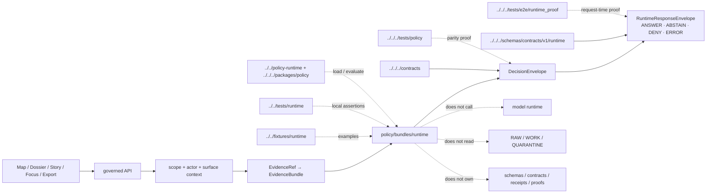

<!-- [KFM_META_BLOCK_V2]
doc_id: kfm://doc/NEEDS_VERIFICATION__policy_bundles_runtime_readme
title: Runtime Policy Bundle
type: standard
version: v1
status: draft
owners: @bartytime4life
created: NEEDS_VERIFICATION__git_history
updated: NEEDS_VERIFICATION__at_merge
policy_label: public
related: [../README.md, ../../README.md, ../../fixtures/README.md, ../../tests/README.md, ../../policy-runtime/README.md, ../../../contracts/README.md, ../../../schemas/README.md, ../../../schemas/contracts/v1/runtime/README.md, ../../../packages/policy/README.md, ../../../tests/policy/README.md, ../../../tests/e2e/runtime_proof/README.md, ../../../.github/workflows/README.md]
tags: [kfm, policy, bundles, runtime, runtime-response-envelope, decision-envelope]
notes: [doc_id created and updated require repo-backed verification before merge, this README upgrades the runtime scaffold into a governed leaf contract without claiming executable rule files, owners are inherited from surfaced policy-scope documentation and still need active-branch verification]
[/KFM_META_BLOCK_V2] -->

<a id="top"></a>

# Runtime Policy Bundle

Executable-policy seam for finite KFM runtime outcomes, request-time denial logic, and trust-visible `RuntimeResponseEnvelope` behavior.

> **Status:** `experimental`  
> **Owners:** `@bartytime4life` *(policy-scope owner signal; leaf-specific ownership still needs active-branch verification)*  
> **Path:** `policy/bundles/runtime/README.md`  
>        
> **Repo fit:** child seam under [`../README.md`](../README.md), inside the top-level policy lane [`../../README.md`](../../README.md); paired with sibling examples in [`../../fixtures/README.md`](../../fixtures/README.md) and sibling bundle-local assertions in [`../../tests/README.md`](../../tests/README.md); coordinated with runtime mediation notes in [`../../policy-runtime/README.md`](../../policy-runtime/README.md); bounded by contract and schema authority in [`../../../contracts/README.md`](../../../contracts/README.md), [`../../../schemas/README.md`](../../../schemas/README.md), and [`../../../schemas/contracts/v1/runtime/README.md`](../../../schemas/contracts/v1/runtime/README.md); consumed only through verified runtime support such as [`../../../packages/policy/README.md`](../../../packages/policy/README.md), repo-facing proof in [`../../../tests/policy/README.md`](../../../tests/policy/README.md), e2e runtime proof in [`../../../tests/e2e/runtime_proof/README.md`](../../../tests/e2e/runtime_proof/README.md), and workflow guardrails in [`../../../.github/workflows/README.md`](../../../.github/workflows/README.md).  
> **Quick jump:** [Scope](#scope) · [Current evidence posture](#current-evidence-posture) · [Repo fit](#repo-fit) · [Accepted inputs](#accepted-inputs) · [Exclusions](#exclusions) · [Directory tree](#directory-tree) · [Quickstart](#quickstart) · [Usage](#usage) · [Runtime grammar](#runtime-grammar) · [Proof matrix](#proof-matrix) · [Diagram](#diagram) · [Task list](#task-list--definition-of-done) · [FAQ](#faq) · [Appendix](#appendix)

> [!IMPORTANT]
> This directory is a **runtime policy bundle seam**, not the runtime itself.
>
> It may define request-time policy decisions and finite outcome grammar. It must not become a model adapter, API route, schema registry, raw-data reader, proof store, or UI-only trust shortcut.

---

## Scope

`policy/bundles/runtime/` owns the policy bundle family that constrains request-time KFM answers.

Its job is narrow and consequential: make sure a runtime-facing surface such as Focus Mode, the Evidence Drawer, a map popup, an export preview, or a governed API response can only return one of the approved runtime outcomes:

| Runtime outcome | Meaning |
|---|---|
| `ANSWER` | Evidence support is sufficient, policy-safe, citation-valid, and scoped. |
| `ABSTAIN` | Evidence is missing, weak, stale, conflicted, unresolved, or citation support fails. |
| `DENY` | Policy blocks the request because of rights, sensitivity, actor scope, release state, or forbidden access path. |
| `ERROR` | A technical failure prevents reliable governed handling; the system must not pretend evidence or policy passed. |

This bundle should help reviewers answer:

1. What runtime decision did policy make?
2. Why was that decision made?
3. What obligations follow?
4. Which trust objects must carry the result?
5. Which fixtures and tests prove the negative paths?

[Back to top](#top)

---

## Current evidence posture

| Surface or claim | Status | Current reading |
|---|---:|---|
| `policy/bundles/runtime/README.md` path | **CONFIRMED from surfaced repo-facing docs** | The runtime child scaffold is documented as publicly reachable. |
| This file as an executable rule pack | **NEEDS VERIFICATION** | A README alone does not prove rule bodies, manifests, fixtures, tests, or CI entrypoints. |
| `proof_quartet.rego` or equivalent runtime rule file | **CONFLICTED / NEEDS VERIFICATION** | Later documentation reports a runtime proof-quartet rule; earlier bundle docs describe the runtime subtree as scaffold-only. Verify the active checkout before claiming executable status. |
| Runtime outcome grammar | **CONFIRMED doctrine / PROPOSED enforcement** | Runtime/public responses should use `ANSWER`, `ABSTAIN`, `DENY`, `ERROR`; gate and release-state grammars are separate. |
| OPA/Rego as the broad engine | **PROPOSED / NEEDS VERIFICATION** | Strong starter direction, but broad mounted adoption must be proven by branch files and runnable checks. |
| Workflow merge gates | **UNKNOWN** | Workflow docs are guardrails; active YAML and branch protections require direct verification. |

> [!CAUTION]
> Do not let path presence become maturity language. A subtree can reserve responsibility without proving executable policy, tests, fixture coverage, or production runtime adoption.

[Back to top](#top)

---

## Repo fit

This leaf sits between policy law and runtime consumption.

| Direction | Surface | Why it matters |
|---|---|---|
| Parent | [`../README.md`](../README.md) | Defines `policy/bundles/` as the seam-local executable rule-pack lane. |
| Parent | [`../../README.md`](../../README.md) | Defines `policy/` as the broader deny-by-default policy surface. |
| Sibling proof | [`../../fixtures/README.md`](../../fixtures/README.md) | Holds positive and negative examples for this bundle. |
| Sibling proof | [`../../tests/README.md`](../../tests/README.md) | Holds bundle-local assertions close to policy law. |
| Runtime coordination | [`../../policy-runtime/README.md`](../../policy-runtime/README.md) | Explains how runtime consumers should load/evaluate policy without relocating authority. |
| Contract boundary | [`../../../contracts/README.md`](../../../contracts/README.md) | Owns semantic definitions for `DecisionEnvelope`, `RuntimeResponseEnvelope`, `EvidenceBundle`, receipts, and related trust objects. |
| Schema boundary | [`../../../schemas/README.md`](../../../schemas/README.md) | Owns machine-checkable shape; this bundle must not fork schema authority. |
| Runtime schemas | [`../../../schemas/contracts/v1/runtime/README.md`](../../../schemas/contracts/v1/runtime/README.md) | Expected home for runtime response schema surfaces, pending active-branch verification. |
| Support package | [`../../../packages/policy/README.md`](../../../packages/policy/README.md) | Suitable place for loaders/adapters/helpers; not a second policy authority. |
| Repo-facing proof | [`../../../tests/policy/README.md`](../../../tests/policy/README.md) | Proves runtime/release/correction policy behavior under wider pressure. |
| E2E runtime proof | [`../../../tests/e2e/runtime_proof/README.md`](../../../tests/e2e/runtime_proof/README.md) | Proves request-time behavior beyond local bundle assertions. |
| Workflow guardrail | [`../../../.github/workflows/README.md`](../../../.github/workflows/README.md) | Documents gate expectations; active merge-blocking behavior still needs direct verification. |

[Back to top](#top)

---

## Accepted inputs

Only content that helps the runtime seam make finite, reviewable, executable policy decisions belongs here.

| Input class | What belongs here | Examples |
|---|---|---|
| Runtime rule files | Machine-readable policy that decides or constrains request-time outcomes | `finite_outcomes.rego`, `runtime_denials.rego`, `proof_quartet.rego` |
| Bundle manifest | Versioned description of seam, imports, result grammar, and paired proof | `bundle.yaml`, `bundle.json` |
| Result helpers | Small shared predicates that keep outcome generation consistent | `is_answerable`, `must_abstain`, `must_deny`, `engine_error` |
| Reason/obligation references | Pointers to shared reason and obligation vocabularies | citation-required, policy-denied, evidence-missing, review-required |
| Leaf README and rationale | Human-facing seam contract for maintainers and reviewers | this README, short rationale notes |
| Fixture/test references | Links to sibling fixture and assertion homes | `../../fixtures/runtime/`, `../../tests/runtime/` |

### Minimum bar before calling this bundle executable

A runtime bundle should not be called executable until it has all of the following:

- [ ] A named trust seam and bundle version.
- [ ] At least one machine-readable rule body.
- [ ] Finite result grammar: `ANSWER`, `ABSTAIN`, `DENY`, `ERROR`.
- [ ] Stable reason and obligation references.
- [ ] Paired positive and negative fixtures.
- [ ] Bundle-local assertions.
- [ ] Broader runtime-proof coverage when outward behavior changes.
- [ ] Downstream trust objects named explicitly.
- [ ] Rollback or disable path for policy-significant changes.

[Back to top](#top)

---

## Exclusions

| Does **not** belong here | Put it instead | Why |
|---|---|---|
| `RuntimeResponseEnvelope` schema bodies | [`../../../schemas/contracts/v1/runtime/README.md`](../../../schemas/contracts/v1/runtime/README.md) | Shape authority belongs in schemas, not in policy bundle code. |
| Semantic object contracts | [`../../../contracts/README.md`](../../../contracts/README.md) | This bundle consumes object meaning; it does not define all object semantics. |
| API routes, route middleware, app services | Verified app/API package seam | Runtime enforcement code is not the same artifact as the policy pack. |
| Model adapters, prompts, direct model clients | Governed API/runtime packages | KFM forbids direct public model-runtime access. |
| Raw, work, quarantine, processed, catalog, or published data artifacts | [`../../../data/README.md`](../../../data/README.md) | Policy governs movement and exposure; it is not canonical storage. |
| Generic fixtures | [`../../fixtures/README.md`](../../fixtures/README.md) | Keep examples reusable and reviewable. |
| Generic bundle-local tests | [`../../tests/README.md`](../../tests/README.md) | Keep assertions as sibling proof, not hidden inside rule folders. |
| Repo-wide runtime, release, rollback, or correction proof | [`../../../tests/policy/README.md`](../../../tests/policy/README.md), [`../../../tests/e2e/runtime_proof/README.md`](../../../tests/e2e/runtime_proof/README.md) | Local policy tests are necessary but not sufficient. |
| Workflow YAML or required-check settings | [`../../../.github/workflows/README.md`](../../../.github/workflows/README.md) and platform settings | Policy docs are not proof of branch protection or merge gates. |
| Secrets, keys, `.env`, live credentials | Secret manager / deployment configuration | Sensitive operational material must never live in a public policy bundle. |

[Back to top](#top)

---

## Directory tree

### Current documented leaf posture

```text
policy/
└── bundles/
    ├── README.md
    └── runtime/
        └── README.md
```

### Smallest executable fill pattern (**PROPOSED**)

```text
policy/
└── bundles/
    └── runtime/
        ├── README.md
        ├── bundle.yaml
        ├── finite_outcomes.rego
        ├── runtime_denials.rego
        └── proof_quartet.rego        # only if verified or added with paired proof
```

### Required sibling proof once rules land (**PROPOSED**)

```text
policy/
├── fixtures/
│   └── runtime/
│       ├── answer_public_safe.json
│       ├── abstain_missing_evidence.json
│       ├── deny_restricted_support.json
│       └── error_policy_engine_unavailable.json
└── tests/
    └── runtime/
        ├── README.md
        └── finite_outcomes_test.rego

tests/
├── policy/
│   └── runtime_parity/
│       └── README.md
└── e2e/
    └── runtime_proof/
        └── README.md
```

> [!NOTE]
> The target shape is intentionally small. Add one seam, one manifest, one rule family, and paired proof before expanding.

[Back to top](#top)

---

## Quickstart

Run these from the repository root after checking out the active branch.

### 1) Confirm this leaf and its nearest siblings

```bash
find policy/bundles/runtime -maxdepth 3 -type f 2>/dev/null | sort
find policy/bundles policy/fixtures policy/tests policy/policy-runtime -maxdepth 4 -type f 2>/dev/null | sort
```

### 2) Trace runtime outcome grammar and trust objects

```bash
grep -R -nE \
  'ANSWER|ABSTAIN|DENY|ERROR|RuntimeResponseEnvelope|DecisionEnvelope|EvidenceBundle|EvidenceRef|proof_quartet|run_receipt|ai_receipt|attestation' \
  policy contracts schemas tests apps packages docs tools 2>/dev/null || true
```

### 3) Check whether runtime bundle files are real or only proposed

```bash
find policy/bundles/runtime -type f \
  \( -name '*.rego' -o -name 'bundle.*' -o -name '*.yaml' -o -name '*.yml' -o -name '*.json' -o -name '*.md' \) \
  | sort
```

### 4) Inspect paired proof before trusting the bundle

```bash
find policy/fixtures/runtime policy/tests/runtime tests/policy tests/e2e/runtime_proof \
  -maxdepth 5 -type f 2>/dev/null | sort
```

### 5) Optional local policy check

```bash
# Illustrative only — verify the real policy entrypoint and runner before relying on this in CI.
conftest test policy/fixtures/runtime --policy policy/bundles/runtime
```

> [!TIP]
> A command that finds files is not the same as proof they are enforced. Treat workflow YAML, CI outputs, and branch protection as separate verification items.

[Back to top](#top)

---

## Usage

### Add a runtime policy rule safely

1. Start with the runtime seam, not the filename.
2. Name the exact runtime behavior being constrained.
3. Keep the outcome grammar finite: `ANSWER`, `ABSTAIN`, `DENY`, `ERROR`.
4. Add one valid fixture and at least one negative fixture in [`../../fixtures/`](../../fixtures/README.md).
5. Add bundle-local assertions in [`../../tests/`](../../tests/README.md).
6. Extend [`../../../tests/policy/`](../../../tests/policy/README.md) or [`../../../tests/e2e/runtime_proof/`](../../../tests/e2e/runtime_proof/README.md) if outward runtime behavior changes.
7. Link the affected `DecisionEnvelope`, `RuntimeResponseEnvelope`, `EvidenceBundle`, receipt, and audit-ref surfaces.
8. Record rollback posture in the PR notes.

### Change outcome semantics safely

Changing a reason, obligation, or outcome mapping is policy-significant.

- Version the bundle or manifest.
- Keep old/new semantics visible in the review summary.
- Re-run local bundle assertions and broader runtime proof.
- Update contract/schema references when shape or semantics drift.
- Never hide a denial, abstention, or citation failure behind generic UI copy.

### Keep runtime policy subordinate to evidence

Runtime policy may decide whether an answer can be released. It may not make unsupported claims true.

A runtime answer must stay downstream of this order:

1. Define scope.
2. Resolve policy and actor context.
3. Retrieve admissible released evidence.
4. Resolve `EvidenceRef` to `EvidenceBundle`.
5. Validate citations and evidence support.
6. Apply runtime policy.
7. Emit a finite `RuntimeResponseEnvelope`.
8. Preserve audit/receipt references.

[Back to top](#top)

---

## Runtime grammar

### Runtime outcomes

| Outcome | Use when | Required behavior |
|---|---|---|
| `ANSWER` | Evidence support is sufficient and policy allows the scoped response. | Include citations, policy decision, audit ref, and evidence-bundle linkage. |
| `ABSTAIN` | Evidence is insufficient, stale, unresolved, conflicted, or citation support fails. | Explain the limitation without filling the gap with model or UI speculation. |
| `DENY` | Rights, sensitivity, actor, release scope, or access path blocks the request. | Return a stable reason without leaking protected details. |
| `ERROR` | A system, adapter, validator, or policy-engine failure prevents reliable handling. | Fail visibly and do not imply policy approval or evidence support. |

### Keep surface classes separate

| Surface class | Finite grammar | This bundle’s role |
|---|---|---|
| Runtime / public response | `ANSWER`, `ABSTAIN`, `DENY`, `ERROR` | **Owns or constrains this grammar.** |
| Gate / review evaluation | `PASS`, `HOLD`, `DENY`, `ERROR` | References only; do not emit as user-facing runtime outcome. |
| Release-state receipt | `PROMOTED`, `BLOCKED`, `REVERTED`, `NO_CHANGE` *(where adopted)* | References only; do not substitute for runtime outcome. |

> [!WARNING]
> A runtime envelope that says `PASS` is underspecified. A gate result that says `ANSWER` is semantically odd. Keep the grammars separate or reviewers lose the ability to reconstruct what happened.

[Back to top](#top)

---

## Proof matrix

| Runtime pressure | Local bundle responsibility | Paired proof surface | Downstream trust object |
|---|---|---|---|
| Missing evidence | Emit or force `ABSTAIN` | `../../fixtures/runtime/` + `../../tests/runtime/` | `RuntimeResponseEnvelope`, `DecisionEnvelope` |
| Restricted support | Emit or force `DENY` | `../../fixtures/runtime/` + `../../../tests/policy/` | `DecisionEnvelope`, `EvidenceBundle` summary |
| Unsupported citation | Convert claim-bearing result to `ABSTAIN` | runtime proof / citation validation tests | `RuntimeResponseEnvelope`, citation report |
| Policy engine unavailable | Emit `ERROR` or fail closed | bundle-local negative test | audit ref, runtime receipt |
| Proof quartet missing or mismatched | Deny, abstain, or block the unsafe handoff according to surface class | promotion/runtime proof tests | `run_receipt`, `ai_receipt`, `ReleaseManifest`, attestation refs |
| Sensitive exact detail | `DENY` or require generalized output with explicit obligation | policy + e2e runtime proof | `DecisionEnvelope`, transform/receipt ref |
| Correction or supersession visible | Avoid stale `ANSWER`; require visible correction state | correction/e2e proof | `CorrectionNotice`, runtime response state |

[Back to top](#top)

---

## Diagram



[Back to top](#top)

---

## Task list / definition of done

- [ ] `doc_id`, `created`, `updated`, and leaf-level owner were verified from repo history or governance records.
- [ ] Active branch inventory confirms whether this directory is README-only or contains executable rule files.
- [ ] Any `*.rego` or equivalent rule body has a bundle manifest.
- [ ] Runtime outcome grammar is limited to `ANSWER`, `ABSTAIN`, `DENY`, `ERROR`.
- [ ] Gate/review and release-state vocabularies are not used as runtime outcomes.
- [ ] Positive and negative runtime fixtures exist outside this directory in the sibling fixture lane.
- [ ] Bundle-local assertions exist outside this directory in the sibling policy-test lane.
- [ ] Broader policy or e2e runtime proof is updated if outward behavior changes.
- [ ] Contract/schema links are references only; this directory does not fork object definitions.
- [ ] No rule file reads RAW, WORK, QUARANTINE, unpublished candidates, secrets, or live credentials.
- [ ] No public/client path can call a model runtime directly through this bundle.
- [ ] Denial, abstention, citation failure, stale evidence, and error states remain visible to downstream surfaces.
- [ ] Rollback or disable instructions are documented for policy-significant bundle changes.

[Back to top](#top)

---

## FAQ

### Does this directory own the runtime?

No. It owns a runtime-policy seam. Runtime loaders, API adapters, and decision assembly belong in verified runtime or package surfaces such as [`../../policy-runtime/README.md`](../../policy-runtime/README.md) and [`../../../packages/policy/README.md`](../../../packages/policy/README.md).

### Does this directory own `RuntimeResponseEnvelope`?

No. It constrains when and why that envelope can emit `ANSWER`, `ABSTAIN`, `DENY`, or `ERROR`. Contract meaning and machine shape stay under [`../../../contracts/README.md`](../../../contracts/README.md) and [`../../../schemas/README.md`](../../../schemas/README.md).

### Can a bundle return `PASS`?

Not as a runtime response. `PASS` belongs to gate or review evaluation, not to user-facing runtime response. Use `ANSWER` when the runtime path can safely answer.

### What should happen when evidence is missing?

Return `ABSTAIN` with stable reasons and visible obligations. Do not invent support, summarize around the gap, or downgrade the missing-evidence state into a generic failure.

### What should happen when policy blocks access?

Return `DENY` with an accountable reason and no protected detail leakage.

### What is the smallest useful next implementation?

Add one manifest, one finite-outcomes rule file, one positive fixture, two negative fixtures, one bundle-local assertion pack, and one broader runtime-parity test. Stop there until the branch proves the full seam.

[Back to top](#top)

---

## Appendix

<details>
<summary><strong>Illustrative bundle manifest starter — PROPOSED</strong></summary>

```yaml
schema_version: kfm.policy_bundle.v1
bundle_id: kfm.policy.bundles.runtime
bundle_version: 0.1.0
surface_class: runtime
owned_outcomes:
  - ANSWER
  - ABSTAIN
  - DENY
  - ERROR
rule_files:
  - finite_outcomes.rego
  - runtime_denials.rego
  - proof_quartet.rego
paired_fixtures:
  - ../../fixtures/runtime/answer_public_safe.json
  - ../../fixtures/runtime/abstain_missing_evidence.json
  - ../../fixtures/runtime/deny_restricted_support.json
  - ../../fixtures/runtime/error_policy_engine_unavailable.json
paired_tests:
  - ../../tests/runtime/finite_outcomes_test.rego
downstream_objects:
  - DecisionEnvelope
  - RuntimeResponseEnvelope
  - EvidenceBundle
  - run_receipt
  - ai_receipt
  - audit_ref
notes:
  - Shape starter only. Verify repo-native manifest schema before committing.
```

</details>

<details>
<summary><strong>Illustrative runtime decision input — PROPOSED</strong></summary>

```yaml
input:
  request_id: req.example.runtime.0001
  actor_role: public
  surface_class: focus.read
  action: answer
  release_scope:
    - rel.example.public.v1
  evidence:
    evidence_bundle_resolved: true
    citations_valid: true
    evidence_is_released: true
    freshness_state: current
  policy:
    rights_class: public
    sensitivity_class: public
    restricted_support_present: false

decision:
  outcome: ANSWER
  reason_codes:
    - EVIDENCE_RESOLVED
    - CITATIONS_VALID
    - POLICY_PUBLIC_SAFE
  obligation_codes:
    - INCLUDE_EVIDENCE_REFS
    - EMIT_AUDIT_REF
```

</details>

[Back to top](#top)
