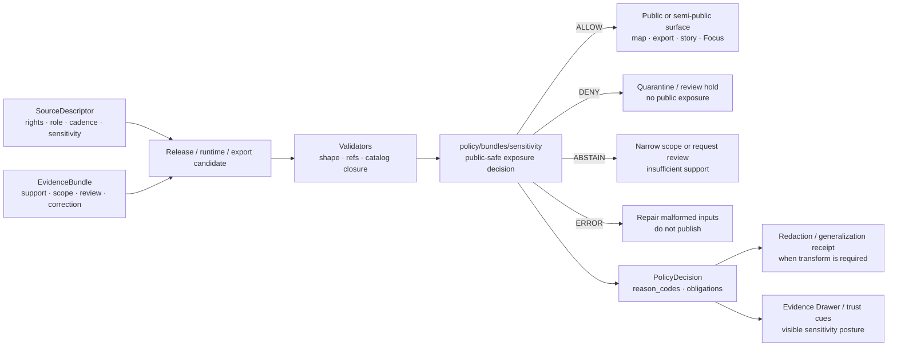

<!-- [KFM_META_BLOCK_V2]
doc_id: kfm://doc/NEEDS_VERIFICATION__assign_uuid
title: Sensitivity Policy Bundle
type: standard
version: v1
status: draft
owners: NEEDS_VERIFICATION__policy_owner
created: NEEDS_VERIFICATION__file_history
updated: 2026-04-24
policy_label: public
related: [../README.md, ../runtime/README.md, ../../README.md, ../../fixtures/README.md, ../../tests/README.md, ../../policy-runtime/README.md, ../../../contracts/README.md, ../../../schemas/README.md, ../../../packages/policy/README.md, ../../../tests/policy/README.md, ../../../.github/workflows/README.md]
tags: [kfm, policy, bundles, sensitivity, geoprivacy, redaction, public-safety]
notes: [doc_id owner and created date need branch-level verification; updated date reflects this draft generation; target child bundle path was requested but current checked-in inventory and executable rule files remain NEEDS VERIFICATION]
[/KFM_META_BLOCK_V2] -->

<a id="top"></a>

# Sensitivity Policy Bundle

Sensitivity rule lane for KFM public-safe exposure, exact-location protection, redaction/generalization obligations, and review-aware release decisions.

> **Status:** `experimental`  
> **Owners:** `NEEDS_VERIFICATION__policy_owner`  
> **Path:** `policy/bundles/sensitivity/README.md`  
>       
> **Quick jump:** [Scope](#scope) · [Repo fit](#repo-fit) · [Accepted inputs](#accepted-inputs) · [Exclusions](#exclusions) · [Directory tree](#directory-tree) · [Quickstart](#quickstart) · [Usage](#usage) · [Diagram](#diagram) · [Tables](#tables) · [Task list](#task-list--definition-of-done) · [FAQ](#faq) · [Appendix](#appendix)

> [!IMPORTANT]
> This README documents the **sensitivity trust seam**. It does not prove that executable `.rego`, bundle manifests, paired fixtures, workflow gates, or runtime enforcement are already present on the active branch. Treat executable depth as **NEEDS VERIFICATION** until the checked-out repository and policy runner are inspected.

---

## Scope

`policy/bundles/sensitivity/` is the policy-bundle home for deciding whether a candidate public or semi-public KFM surface may expose, generalize, restrict, review-hold, or deny sensitive material.

In KFM terms, sensitivity is not a vague label. It affects whether a map layer, export, Evidence Drawer payload, Focus response, story node, release candidate, or catalog item can safely move toward public consequence.

This bundle should answer four questions consistently:

1. Is the requested exposure safe for the intended audience?
2. Is the geometry, identity, source role, or attribute precision too revealing?
3. Does release require generalization, redaction, steward review, or a transform receipt?
4. Should the outcome be `ALLOW`, `DENY`, `ABSTAIN`, or `ERROR`?

### Evidence posture used here

| Label | Meaning in this README |
|---|---|
| **CONFIRMED** | Supported by supplied KFM doctrine or by target path requested in this task |
| **INFERRED** | Strongly implied by adjacent policy bundle docs and KFM doctrine, but not proven as current branch inventory |
| **PROPOSED** | Repo-ready starter guidance that fits KFM doctrine but is not asserted as current implementation |
| **UNKNOWN** | Not verified strongly enough because the mounted target repository was not available |
| **NEEDS VERIFICATION** | Requires branch, history, runner, owner, fixture, workflow, or schema inspection before merge |

### Working rule

Sensitivity policy should fail closed when it cannot prove safety.

Missing rights, missing source descriptors, unresolved sensitivity, exact public geometry for protected material, missing redaction receipts, or missing steward review should produce a governed negative outcome rather than a quiet public allow.

[Back to top](#top)

---

## Repo fit

This README belongs under the policy-bundle lane. It should stay narrow: rule-pack boundary, decision posture, sibling fixture/test expectations, and downstream obligations.

### Path

```text
policy/bundles/sensitivity/README.md
```

### Upstream / downstream map

| Neighbor | Relationship | How this README should use it |
|---|---|---|
| [`../README.md`](../README.md) | Parent bundle-lane contract | Defines what a policy bundle is and what executable depth must prove |
| [`../../README.md`](../../README.md) | Parent policy lane | Owns policy posture, routing, and lane-wide vocabulary |
| [`../../fixtures/README.md`](../../fixtures/README.md) | Sibling fixture lane | Holds public-safe positive and negative examples for this bundle |
| [`../../tests/README.md`](../../tests/README.md) | Bundle-local verifier lane | Holds seam-local assertions for sensitivity outcomes |
| [`../../policy-runtime/README.md`](../../policy-runtime/README.md) | Runtime coordination lane | Documents consuming runtime seams without moving runtime code into this bundle |
| [`../runtime/README.md`](../runtime/README.md) | Adjacent runtime bundle | Ensures runtime outward outcomes do not bypass sensitivity decisions |
| [`../../../contracts/README.md`](../../../contracts/README.md) | Contract boundary | Owns shared object meaning such as `PolicyDecision`, `RuntimeResponseEnvelope`, `EvidenceBundle`, and release objects |
| [`../../../schemas/README.md`](../../../schemas/README.md) | Schema boundary | Owns canonical machine schemas when the repo proves the schema home |
| [`../../../packages/policy/README.md`](../../../packages/policy/README.md) | Shared support-code boundary | Loader/helper/adaptor code belongs there, not in this bundle |
| [`../../../tests/policy/README.md`](../../../tests/policy/README.md) | Repo-facing proof lane | Proves policy behavior survives broader release/runtime/correction pressure |
| [`../../../.github/workflows/README.md`](../../../.github/workflows/README.md) | Workflow guardrail lane | Documents CI burden; checked-in YAML coverage remains branch-specific |

> [!CAUTION]
> Do not let this directory become a second schema registry, a data store, a runtime adapter, or a UI-only condition system. KFM policy can inform those surfaces, but this bundle should remain a reviewable rule lane with finite outcomes, reasons, obligations, and paired proof.

[Back to top](#top)

---

## Accepted inputs

Only content that helps this bundle make sensitivity decisions belongs here.

| Input class | What belongs here | Status |
|---|---|---|
| Bundle manifest | Seam name, version, dependencies, runner assumptions, fixture/test pointers | **PROPOSED** |
| Sensitivity rule files | Machine-readable policy body for public-safe exposure decisions | **PROPOSED** |
| Generalization / restriction rules | Rules that require redaction, precision reduction, role-gating, or review | **PROPOSED** |
| Transform obligation notes | Small notes describing required redaction/generalization receipts | **PROPOSED** |
| Shared bundle imports | Bundle-local helpers that do not replace runtime code or shared schemas | **PROPOSED** |
| Bundle README / rationale | Human-readable boundary, examples, review expectations, and “done” criteria | **CONFIRMED by this file after commit** |
| Reason / obligation references | References to shared reason-code and obligation-code registries, when verified | **NEEDS VERIFICATION** |

### Appropriate sensitivity triggers

This bundle may evaluate inputs that describe:

- exact or high-precision geometry,
- protected or rare species locations,
- archaeological, sacred, burial, or culturally sensitive places,
- living-person, genealogy, DNA, or household-level identity exposure,
- private property, farm/operator, proprietary yield, or business-sensitive attributes,
- critical infrastructure or security-relevant facilities,
- restricted source identifiers, internal references, or steward-only attributes,
- public exports that could amplify sensitive location or identity risk.

### Minimum bar for calling this bundle executable

A sensitivity bundle is not executable merely because this README exists.

The minimum useful bar is:

- a bundle manifest exists,
- the sensitivity seam is named and versioned,
- at least one rule file or equivalent machine-readable policy body exists,
- decisions are finite: `ALLOW`, `DENY`, `ABSTAIN`, or `ERROR`,
- every negative outcome has `reason_code`, `reason`, and explicit `obligations`,
- paired fixtures exist for allow, deny, abstain, error, and generalization cases,
- paired tests prove the bundle fails closed,
- affected downstream trust objects are named,
- and any new shared vocabulary is routed through the verified contract/schema home.

[Back to top](#top)

---

## Exclusions

`policy/bundles/sensitivity/` should stay deliberately small.

| Does **not** belong here | Put it instead | Why |
|---|---|---|
| Raw sensitive coordinates, real protected locations, secret endpoints, or credentials | Secret manager, steward-only restricted store, or governed data lifecycle | A public policy bundle must not become the leak it prevents |
| RAW / WORK / QUARANTINE / PROCESSED / CATALOG / PUBLISHED artifacts | `../../../data/` lifecycle lanes | Policy governs movement and exposure; it is not the canonical store |
| Canonical JSON Schema / OpenAPI definitions | [`../../../contracts/`](../../../contracts/) and [`../../../schemas/`](../../../schemas/) | Shared object shape should not drift into policy logic |
| Runtime loaders, route handlers, request mediators, or API adapters | [`../../policy-runtime/README.md`](../../policy-runtime/README.md), [`../../../packages/policy/README.md`](../../../packages/policy/README.md), or verified app/package seam | Execution glue is adjacent to the bundle, not the bundle itself |
| Generic policy fixtures | [`../../fixtures/README.md`](../../fixtures/README.md) | Fixtures should stay reusable across seams |
| Generic policy tests | [`../../tests/README.md`](../../tests/README.md) and [`../../../tests/policy/README.md`](../../../tests/policy/README.md) | Tests should remain visible proof surfaces |
| Source descriptors and source-rights records | Source registry / contract lane verified by the repo | A source descriptor may carry sensitivity fields; this bundle evaluates them |
| UI-only hide/show conditionals | Nowhere as authority | KFM rejects policy theater in presentation code |
| Real steward deliberation records with private details | Restricted review records | Public README material must not expose sensitive review content |

[Back to top](#top)

---

## Directory tree

### Target directory after this README lands

```text
policy/
└── bundles/
    └── sensitivity/
        └── README.md
```

### Smallest useful executable fill (**PROPOSED**)

```text
policy/
└── bundles/
    └── sensitivity/
        ├── README.md
        ├── bundle.yaml
        ├── generalize_or_restrict.rego
        ├── public_surface_safety.rego
        ├── transforms.rego
        └── glossary.md
```

### Paired proof surface (**PROPOSED / NEEDS VERIFICATION**)

```text
policy/
├── fixtures/
│   └── sensitivity/
│       ├── allow-public-generalized.json
│       ├── deny-exact-sensitive-location.json
│       ├── abstain-unresolved-sensitivity.json
│       └── error-malformed-policy-input.json
└── tests/
    └── sensitivity/
        ├── README.md
        └── sensitivity_bundle_test.rego
```

> [!NOTE]
> The proposed tree is a starter pattern, not a claim about current branch inventory. Keep path presence, executable maturity, CI wiring, and production enforcement separate during review.

[Back to top](#top)

---

## Quickstart

### 1) Confirm what is actually checked in

Run from the repository root after the real checkout is mounted.

```bash
find policy/bundles/sensitivity -maxdepth 3 -type f 2>/dev/null | sort
```

### 2) Discover executable policy files

```bash
find policy/bundles/sensitivity -type f \
  \( -name '*.rego' -o -name 'bundle.*' -o -name '*.yaml' -o -name '*.yml' -o -name '*.json' -o -name '*.md' \) \
  | sort
```

### 3) Trace sensitivity vocabulary across policy-facing surfaces

```bash
grep -RIn \
  'sensitivity\|precision_class\|geoprivacy\|redaction\|generaliz\|restricted\|steward_review\|public_surface' \
  policy contracts schemas tests docs packages 2>/dev/null || true
```

### 4) Run policy tests only after the runner is verified

```bash
# NEEDS VERIFICATION: command depends on checked-in OPA/Conftest convention.
conftest test policy/fixtures/sensitivity \
  -p policy/bundles/sensitivity \
  -p policy/bundles/shared
```

> [!WARNING]
> Do not add live sensitive fixtures just to make tests realistic. Use synthetic or already-public-safe fixtures, and test leak prevention through structure rather than through real protected coordinates.

[Back to top](#top)

---

## Usage

### Expected evaluation shape (**illustrative only**)

This bundle should evaluate a narrow candidate object assembled by upstream validators, source descriptors, and release/runtime mediators. It should not scrape sources, mutate data stores, or perform heavy geospatial processing.

```json
{
  "version": "v1",
  "request_id": "example-public-map-release-001",
  "intent": "publish",
  "surface": "public_map",
  "artifact": {
    "lifecycle_state": "PROCESSED",
    "artifact_ref": "urn:kfm:artifact:example",
    "source_refs": ["urn:kfm:source:example"],
    "evidence_refs": ["urn:kfm:evidence:example"],
    "geometry": {
      "geometry_role": "public_candidate",
      "precision_class": "exact",
      "public_safe_transform_ref": null
    }
  },
  "rights": {
    "status": "resolved",
    "public_release_allowed": true
  },
  "sensitivity": {
    "class": "protected_species_location",
    "status": "confirmed_sensitive",
    "review_state": "pending"
  }
}
```

### Expected decision shape (**illustrative only**)

```json
{
  "version": "v1",
  "decision": "DENY",
  "reason_code": "precise_sensitive_location_denied",
  "reason": "Exact public geometry is incompatible with the declared sensitivity class and pending review state.",
  "obligations": [
    "generalize_geometry",
    "emit_redaction_receipt",
    "steward_review_required"
  ],
  "policy_package": "policy/bundles/sensitivity",
  "policy_version": "NEEDS_VERIFICATION",
  "evidence_refs": ["urn:kfm:evidence:example"],
  "transform_required": true
}
```

### Bundle manifest sketch (**PROPOSED**)

```yaml
bundle:
  id: kfm.policy.bundle.sensitivity
  version: v1
  status: draft
  seam: sensitivity
  default_decision: DENY
  finite_decisions:
    - ALLOW
    - DENY
    - ABSTAIN
    - ERROR
  rule_files:
    - generalize_or_restrict.rego
    - public_surface_safety.rego
    - transforms.rego
  paired_fixtures:
    - ../../fixtures/sensitivity/
  paired_tests:
    - ../../tests/sensitivity/
  downstream_trust_objects:
    - PolicyDecision
    - EvidenceBundle
    - RuntimeResponseEnvelope
    - ReleaseManifest
    - CorrectionNotice
    - RedactionReceipt
```

[Back to top](#top)

---

## Diagram



The diagram shows intended responsibility boundaries. It does not prove that the bundle, fixtures, runner, or CI gates already exist.

[Back to top](#top)

---

## Tables

### Sensitivity decision matrix

| Candidate condition | Typical decision | Required obligation / downstream cue |
|---|---|---|
| Public surface requests exact geometry for protected species, archaeology, sacred site, or similar sensitive class | `DENY` | `generalize_geometry`, `emit_redaction_receipt`, `steward_review_required` |
| Sensitivity status is missing or unresolved | `DENY` for publication; `ABSTAIN` for runtime answer | `resolve_sensitivity`, `review_required` |
| Rights are unresolved even if sensitivity appears low | `DENY` for publication; `ABSTAIN` for runtime answer | `resolve_rights`; route to rights policy if separate |
| Internal RAW / WORK / QUARANTINE reference appears in a public payload | `DENY` | `remove_internal_ref`, `repair_public_payload` |
| Public candidate has approved generalized geometry and transform receipt | `ALLOW` when other gates pass | `show_generalization_notice` |
| Restricted steward-review surface requests exact detail with authorized audience | `ALLOW` or `DENY`, depending on role and review state | `restrict_audience`, `audit_access` |
| Malformed policy input prevents a safe decision | `ERROR` | `repair_policy_input`, `do_not_publish` |
| Modeled, inferred, or narrative-sensitive surface is presented as observed fact | `DENY` | `correct_knowledge_character`, `update_drawer_payload` |

### Starter reason codes (**PROPOSED**)

| Reason code | Meaning |
|---|---|
| `sensitivity_unresolved` | Sensitivity status is missing, stale, or not reviewable |
| `precise_sensitive_location_denied` | Exact or high-precision geometry is unsafe for the requested surface |
| `geoprivacy_required` | A public-safe transform is required before outward release |
| `redaction_receipt_missing` | Transform is claimed but no receipt is linked |
| `steward_review_required` | Release requires review by a qualified steward |
| `public_payload_exposes_internal_ref` | Public payload exposes RAW / WORK / QUARANTINE or restricted references |
| `restricted_attribute_leak` | Sensitive non-geometry attributes would be exposed |
| `knowledge_character_mismatch` | Modeled, inferred, generalized, or narrative context is being presented as direct observation |
| `malformed_sensitivity_input` | The bundle cannot evaluate because required fields are invalid or missing |

### Starter obligations (**PROPOSED**)

| Obligation | Purpose |
|---|---|
| `generalize_geometry` | Reduce precision or publish only aggregate/public-safe geometry |
| `redact_attribute` | Remove or transform restricted attributes before publication |
| `emit_redaction_receipt` | Preserve why and how a public-safe transform happened |
| `restrict_audience` | Keep the object internal, steward-only, or role-gated |
| `steward_review_required` | Require named review class before release |
| `show_generalization_notice` | Surface public-safe precision reduction in UI/export trust cues |
| `repair_public_payload` | Remove internal refs, restricted identifiers, or unsafe fields |
| `update_evidence_drawer_payload` | Keep sensitivity/review/correction state visible at point of use |

[Back to top](#top)

---

## Task list / Definition of Done

A sensitivity-bundle PR is not done when prose looks convincing. It is done when the rule seam is small, executable, fixture-backed, and reviewable.

- [ ] KFM Meta Block v2 is present and branch-specific placeholders are resolved or intentionally retained with notes.
- [ ] Owner, reviewer class, and created date are verified from branch history or CODEOWNERS.
- [ ] `bundle.yaml` or equivalent manifest names the sensitivity seam, version, dependencies, and paired proof surfaces.
- [ ] Rule files use finite decisions only: `ALLOW`, `DENY`, `ABSTAIN`, `ERROR`.
- [ ] Every negative decision emits stable `reason_code`, human-readable `reason`, and explicit `obligations`.
- [ ] Fixtures include at least one allow, deny, abstain, error, and generalization-required case.
- [ ] Fixtures are synthetic or already public-safe; no exact protected coordinates or sensitive identifiers are checked in.
- [ ] Tests prove default-deny behavior for missing rights, unresolved sensitivity, exact sensitive geometry, missing redaction receipt, and public internal-reference leakage.
- [ ] The bundle references shared reason/obligation vocabularies only after the shared home is verified.
- [ ] Any new trust-bearing object family is routed through contracts/schemas rather than invented locally.
- [ ] Evidence Drawer, export, runtime, and release downstream obligations are named.
- [ ] CI runner assumptions are documented as **CONFIRMED** or **NEEDS VERIFICATION**.
- [ ] Rollback plan is explicit: disable bundle or revert PR, fail closed, preserve denied receipts and review notes.

[Back to top](#top)

---

## FAQ

### Is this directory the source of truth for all sensitivity vocabulary?

No. This bundle may use sensitivity vocabulary, but shared vocabularies and canonical object shape belong in the verified contract/schema boundary. Keep any local vocabulary small and temporary unless the repo explicitly makes policy the owner.

### Can this bundle allow exact sensitive locations for internal users?

Only if the input proves authorized audience, review state, rights, and access posture. Public or semi-public surfaces should not receive exact sensitive locations by default.

### Is OPA/Rego required?

OPA/Rego-style policy-as-code is the strongest documented starter direction, but active-branch adoption, version, syntax, and CI runner remain **NEEDS VERIFICATION** unless the mounted repo proves them. If the repo uses another policy engine, preserve the same finite decisions, fixtures, reasons, obligations, and fail-closed semantics.

### Can the UI hide sensitive details instead of backend policy denying them?

No. UI trust cues are important, but UI-only policy is not enforcement. Backend/release/runtime gates must make the decision, and the UI should reflect it visibly.

### What happens when sensitivity and rights disagree?

The stricter gate wins. Sensitivity approval does not grant rights, and rights approval does not make sensitive exposure safe.

[Back to top](#top)

---

## Appendix

<details>
<summary><strong>Starter file cards (PROPOSED)</strong></summary>

| File | Purpose | Minimum contents |
|---|---|---|
| `bundle.yaml` | Bundle identity and review metadata | seam, version, default decision, rule files, paired fixtures/tests, downstream trust objects |
| `generalize_or_restrict.rego` | Public-safe exposure decision rules | exact-location deny, precision reduction requirements, review obligations |
| `public_surface_safety.rego` | Public payload leak checks | no RAW/WORK/QUARANTINE refs, no restricted IDs, no unreviewed exact geometry |
| `transforms.rego` | Transform obligation checks | redaction/generalization receipt required when public-safe derivative differs from internal support |
| `glossary.md` | Review-friendly local terms | only bundle-local terms; link shared vocabulary once verified |

</details>

<details>
<summary><strong>Review questions for maintainers</strong></summary>

1. Does this bundle decide one trust seam, or has it become a generic governance catch-all?
2. Are negative outcomes stable enough for downstream UI, release, and runtime tests?
3. Do fixtures prove public-safe behavior without leaking sensitive facts?
4. Are generalization and redaction visible through receipts instead of silent field stripping?
5. Does any rule here secretly duplicate schema, source-descriptor, runtime, or release-manifest authority?
6. Can a reviewer trace from decision to reason, obligation, evidence, review state, and rollback consequence?

</details>

[Back to top](#top)