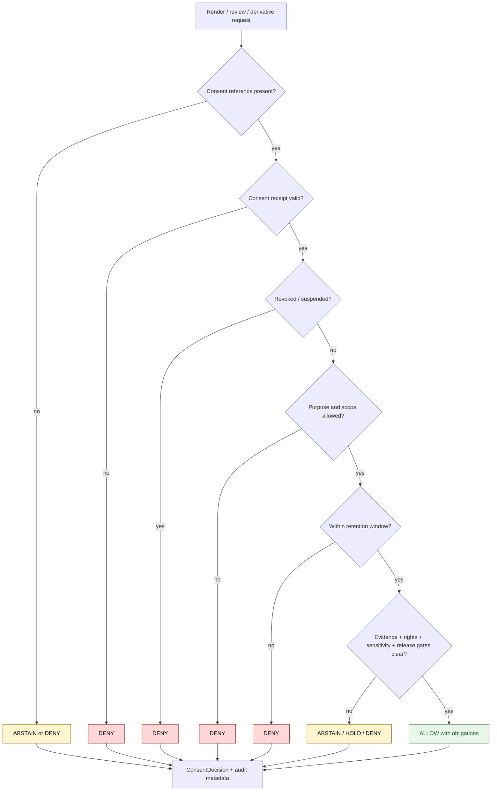

<!-- [KFM_META_BLOCK_V2]
doc_id: kfm://policy/consent
title: Consent Policy README
type: policy-readme
version: v0.1
status: draft
owners: OWNER_TBD — Consent steward · Privacy steward · Policy steward · People-DNA-Land steward · Docs steward
created: 2026-06-15
updated: 2026-06-15
policy_label: restricted
related:
  - ../README.md
  - ../access/README.md
  - ../bundles/README.md
  - ../../docs/domains/people-dna-land/CONSENT.md
  - ../../docs/domains/people-dna-land/CONSENT_MODEL.md
  - ../../docs/domains/people-dna-land/CONSENT_REGISTER.md
  - ../../docs/domains/people-dna-land/DNA_HANDLING.md
  - ../../docs/domains/people-dna-land/SENSITIVITY_PROFILE.md
  - ../../docs/doctrine/trust-membrane.md
  - ../../docs/doctrine/directory-rules.md
  - ../../packages/policy-runtime/README.md
  - ../../apps/governed-api/README.md
tags: [kfm, policy, consent, privacy, people-dna-land, dna, living-person, revocation, render-gate, fail-closed]
notes:
  - "Initial README for the policy/consent lane."
  - "Consent constrains rendering; it does not publish data and does not replace evidence, rights, sensitivity, review, release, correction, or rollback gates."
  - "Placement is PROPOSED because existing People-DNA-Land consent doctrine notes an open ADR between top-level policy/consent/ and domain-scoped consent policy placement."
  - "Runtime enforcement, consent schemas, fixtures, tests, revocation status-list machinery, and consent-decision receipts remain NEEDS VERIFICATION."
[/KFM_META_BLOCK_V2] -->

<a id="top"></a>

<div align="center">

# Consent Policy

`policy/consent/`

**Policy lane for consent-aware render gates, revocation checks, purpose-bound use, retention windows, and fail-closed handling of living-person and DNA-derived material.**


[Scope](#1-scope) · [Repo fit](#2-repo-fit) · [Inputs](#5-inputs) · [Exclusions](#6-exclusions) · [Consent lifecycle](#7-consent-lifecycle) · [Diagram](#8-diagram) · [Definition of done](#14-definition-of-done)

</div>

---

> [!IMPORTANT]
> **Status:** draft / `NEEDS VERIFICATION`  
> **Owners:** `OWNER_TBD` — Consent steward · Privacy steward · Policy steward · People-DNA-Land steward · Docs steward  
> **Path:** `policy/consent/README.md`  
> **Responsibility root:** `policy/` — policy-as-code and policy documentation  
> **Truth posture:** CONFIRMED file path / PROPOSED consent-policy lane / UNKNOWN runtime enforcement

> [!CAUTION]
> **Consent does not publish data.** A consent grant can only constrain what a governed render gate may show. Publication still requires evidence closure, rights and sensitivity checks, validation, review state, release state, correction path, and rollback support.

---

## Quick jump

- [1. Scope](#1-scope)
- [2. Repo fit](#2-repo-fit)
- [3. Consent boundary](#3-consent-boundary)
- [4. Default posture](#4-default-posture)
- [5. Inputs](#5-inputs)
- [6. Exclusions](#6-exclusions)
- [7. Consent lifecycle](#7-consent-lifecycle)
- [8. Diagram](#8-diagram)
- [9. Decision vocabulary](#9-decision-vocabulary)
- [10. Render-gate obligations](#10-render-gate-obligations)
- [11. Revocation and cache posture](#11-revocation-and-cache-posture)
- [12. Inspection path](#12-inspection-path)
- [13. Validation expectations](#13-validation-expectations)
- [14. Definition of done](#14-definition-of-done)
- [15. Open verification items](#15-open-verification-items)

---

## 1. Scope

`policy/consent/` is a proposed consent-policy lane for KFM.

It should describe and eventually bind the policy checks that decide whether a governed render, review, export, or derivative operation is allowed under the consent status of the relevant subject, holder, source, or sidecar.

In scope:

- consent-grant evaluation posture
- revocation receipt and status-list handling posture
- purpose-bound and scope-bound render checks
- retention and expiration checks
- living-person and DNA-derived material defaults
- finite consent decisions: `ALLOW`, `DENY`, `ABSTAIN`, and `ERROR`
- consent obligations such as redact, generalize, restrict, review-required, or withhold
- audit and receipt expectations for consequential consent decisions

Out of scope:

- legal advice
- model-provider or identity-provider credentials
- raw DNA kit identifiers
- source acquisition
- schema definitions
- release approval
- rights clearance
- sensitivity downgrades
- public UI implementation
- lifecycle data storage

[Back to top](#top)

---

## 2. Repo fit

| Concern | Owning root | Expected relationship |
|---|---|---|
| Consent policy lane | `policy/consent/` | This README; active policy files remain `NEEDS VERIFICATION` |
| People / DNA / Land consent doctrine | `docs/domains/people-dna-land/CONSENT.md` | Human-facing consent model and domain guidance |
| Consent model / register docs | `docs/domains/people-dna-land/` | Domain docs; not executable policy authority |
| Runtime policy evaluation | `packages/policy-runtime/` or governed API policy runtime | Implementation home remains `NEEDS VERIFICATION` |
| Public / reviewer API boundary | `apps/governed-api/` | Consent checks should be enforced through governed interfaces |
| Consent schemas | `schemas/contracts/v1/` or verified consent schema home | Machine shape remains `NEEDS VERIFICATION` |
| Stored receipts and proofs | `data/receipts/`, `data/proofs/`, or verified homes | Exact homes remain `NEEDS VERIFICATION` |
| Release decisions | `release/` | Consent does not replace release authority |

> [!WARNING]
> Existing People-DNA-Land consent doctrine records consent-lane placement as an open ADR between top-level `policy/consent/` and a domain-scoped consent policy home. Treat this path as PROPOSED until that placement is resolved.

## 3. Consent boundary

Consent is one independent gate. It is not rights, sensitivity, evidence closure, review, release, correction, or rollback.

Short rule:

```text
policy/consent/          = consent gate and revocation policy, if accepted
policy/rights/           = rights/licensing posture, if present and accepted
policy/sensitivity/      = sensitivity, geoprivacy, and exposure policy
contracts/               = object meaning
schemas/contracts/v1/     = machine-readable shape
release/                 = publication, correction, rollback control
data/                    = lifecycle state, receipts, proofs, artifacts
```

## 4. Default posture

Consent policy should fail closed.

A render, review, export, or derivative request should return `DENY` or `ABSTAIN` when any of these are missing, stale, ambiguous, expired, revoked, or unsupported:

- consent grant reference
- consent subject / holder binding
- requested purpose
- requested scope
- audience
- retention window
- revocation status
- evidence reference
- sensitivity context
- rights context
- release or candidate state
- audit context

## 5. Inputs

| Input family | Examples | Required posture |
|---|---|---|
| Consent record | ConsentGrant, ConsentSidecar, consent receipt, status-list reference | Verified, scoped, and revocation-checkable |
| Revocation state | RevocationReceipt, status-list bit, tombstone, invalidation event | Checked on every render where consent applies |
| Subject / holder context | subject pseudonym, rights holder, data subject, family relation claim | Minimized and privacy-preserving |
| Request context | actor, audience, requested purpose, requested scope, requested precision, timestamp | Explicit and auditable |
| Evidence context | EvidenceRef, EvidenceBundle status, citation validation | Required for consequential render or publication-adjacent action |
| Sensitivity context | living-person, DNA/genomic, private property, cultural or family-sensitive flags | Fail closed when unresolved |
| Release context | candidate, released, superseded, withdrawn, rollback requested | Explicit; consent never substitutes for release |
| Audit context | decision ID, policy version, evaluator profile, reason code | Required for replay and accountability |

## 6. Exclusions

| Does not belong here | Correct home |
|---|---|
| Consent schemas | `schemas/contracts/v1/` |
| Consent object semantic contracts | `contracts/` |
| Raw DNA records, kit IDs, or living-person source records | `data/` lifecycle roots with policy controls |
| Consent receipts and proof storage | `data/receipts/`, `data/proofs/`, or verified homes |
| Release manifests and rollback authority | `release/` |
| Rights/licensing policy | `policy/rights/` or accepted rights lane |
| Sensitivity and geoprivacy policy | `policy/sensitivity/` |
| Public UI or API implementation | `apps/` or governed API/UI packages |
| Runtime helper code | `packages/policy-runtime/` |
| Legal advice | Outside repository policy docs |
| Secrets, tokens, credentials, private keys | Secret manager / deployment config, not repo docs |

## 7. Consent lifecycle

Consent state must be explicit, replayable, and revocation-aware.

| State | Meaning | Runtime posture |
|---|---|---|
| `draft` | Consent object is being prepared | Not enforceable for public render |
| `granted` | Consent grant exists and can be evaluated | Check scope, purpose, retention, revocation, and obligations |
| `limited` | Consent allows only constrained scope, audience, precision, or purpose | Enforce obligations and restrictions |
| `expired` | Retention or validity window has ended | `DENY` unless renewed and verified |
| `revoked` | Consent grant was withdrawn | `DENY` and invalidate dependent caches |
| `suspended` | Consent is temporarily blocked or under dispute | `DENY` or `HOLD` pending review |
| `unknown` | Consent cannot be verified | `ABSTAIN` or `DENY`, never implicit allow |

## 8. Diagram



## 9. Decision vocabulary

| Decision | Meaning | Required behavior |
|---|---|---|
| `ALLOW` | Consent permits the requested action within the stated scope | Enforce obligations and still require other gates |
| `DENY` | Consent blocks the requested action | Do not reveal protected details beyond safe denial text |
| `ABSTAIN` | Consent cannot be evaluated due to missing support | Block action and name missing support where safe |
| `HOLD` | Human review or dispute resolution is required | Do not render publicly |
| `ERROR` | Runtime, schema, signature, status-list, or evaluator failure | Fail closed and record failure |

> [!IMPORTANT]
> `ALLOW` from consent means only “consent does not block this scoped action.” It does not mean public release, publication approval, rights clearance, sensitivity clearance, evidence closure, or truth confirmation.

## 10. Render-gate obligations

Consent decisions may carry obligations that downstream renderers and APIs must preserve.

| Obligation | Example effect |
|---|---|
| `redact` | Withhold a field or relation |
| `generalize` | Reduce precision, detail, or location specificity |
| `restrict_audience` | Limit to reviewer, steward, named party, or authenticated surface |
| `purpose_limit` | Allow only the requested purpose |
| `retention_limit` | Stop rendering after an expiration time |
| `citation_required` | Display required source/consent attribution where safe |
| `review_required` | Route to steward or privacy review before materialization |
| `cache_invalidate` | Remove or refresh cached derivative after revocation |

## 11. Revocation and cache posture

Revocation must take effect at render time and must not wait for a public release cycle.

Required posture:

- check revocation status before consequential render
- treat unavailable revocation state as fail-closed
- invalidate derived caches when consent is revoked or suspended
- retain audit records without leaking sensitive subject details
- preserve rollback and correction path for prior releases or derivatives
- never expose raw DNA kit/vendor identifiers in logs, URLs, UI, or public artifacts

## 12. Inspection path

Consent runtime, policy modules, fixtures, schemas, receipts, and tests remain `NEEDS VERIFICATION`. Use these local inspection commands before treating this lane as implemented.

```bash
# From the repository root, inspect the consent policy lane.
find policy/consent -maxdepth 4 -type f | sort

# Inspect People-DNA-Land consent docs.
find docs/domains/people-dna-land -maxdepth 3 -type f | grep -Ei 'consent|dna|sensitivity|release' | sort

# Inspect likely consent tests and fixtures.
find tests fixtures -maxdepth 5 -type f 2>/dev/null | grep -E 'consent|revocation|people|dna|privacy' | sort
```

## 13. Validation expectations

Useful validation for this lane should cover:

- missing consent returns `DENY` or `ABSTAIN`
- expired consent returns `DENY`
- revoked consent returns `DENY`
- invalid or unverifiable consent receipt returns `DENY` or `ERROR`
- requested purpose outside scope returns `DENY`
- requested audience outside scope returns `DENY`
- unresolved rights, sensitivity, evidence, or release state still blocks render even when consent is valid
- obligations are preserved in the output decision
- revocation invalidates dependent caches or derivatives
- raw DNA kit/vendor IDs are never logged or exposed

## 14. Definition of done

- [ ] Owners are confirmed and `OWNER_TBD` is replaced.
- [ ] Placement ADR resolves top-level `policy/consent/` versus domain-scoped consent policy placement.
- [ ] Consent policy runtime language and bundle location are confirmed.
- [ ] ConsentGrant / ConsentSidecar / ConsentDecision schemas are created or linked where accepted.
- [ ] RevocationReceipt and status-list handling are documented or linked.
- [ ] Tests and fixtures cover allow, deny, abstain, hold, error, expired, revoked, and invalid paths.
- [ ] Consent decisions are auditable and replayable without leaking sensitive details.
- [ ] Public renders use governed interfaces and check consent every time.
- [ ] Release approval remains separate from consent decisions.
- [ ] Rollback and cache invalidation path is documented.

## 15. Open verification items

| Item | Why it matters |
|---|---|
| Resolve consent-policy placement ADR | Prevents duplicate policy homes |
| Confirm consent policy runtime language | Prevents non-runnable policy guidance |
| Confirm schemas and contracts | Required for machine-checkable consent decisions |
| Confirm revocation status-list mechanism | Required for runtime revocation |
| Confirm tests and fixtures | Required before active enforcement |
| Confirm audit event shape | Required for accountability and replay |
| Confirm cache invalidation path | Required for revocation effectiveness |
| Confirm consent/right/sensitivity gate order | Prevents one gate from replacing another |
| Confirm raw DNA identifier handling | Prevents privacy leakage |

<details>
<summary>Appendix A — illustrative consent policy input shape</summary>

This example is illustrative. It is not a verified schema.

```json
{
  "subject": {
    "subject_ref": "SUBJECT_REF_TBD",
    "holder_ref": "HOLDER_REF_TBD"
  },
  "request": {
    "actor": "ACTOR_REF_TBD",
    "audience": "restricted_review",
    "purpose": "genealogy_review",
    "scope": "restricted_render",
    "now": "2026-06-15T00:00:00Z"
  },
  "consent": {
    "grant_ref": "CONSENT_GRANT_REF_TBD",
    "status": "granted",
    "expires_at": "EXPIRY_TBD",
    "revocation_status": "not_revoked"
  },
  "context": {
    "evidence_ref": "EVIDENCE_REF_TBD",
    "rights_status": "RIGHTS_STATUS_TBD",
    "sensitivity_tier": "SENSITIVITY_TIER_TBD",
    "release_state": "candidate"
  }
}
```

</details>

<details>
<summary>Appendix B — no-loss preservation note</summary>

The target file was an empty placeholder. This README adds a bounded consent-policy lane contract without claiming runtime enforcement, legal sufficiency, schemas, fixtures, tests, revocation infrastructure, consent receipts, or CI coverage.

The document preserves the People-DNA-Land consent doctrine's keystone rule: consent constrains render-time materialization and does not publish data.

</details>

## Status summary

`policy/consent/` should define consent-gate policy only if the placement ADR accepts this top-level lane.

It should enforce purpose-bound, revocable, retention-aware, fail-closed consent checks while preserving separate rights, sensitivity, evidence, review, release, correction, rollback, schema, contract, and lifecycle boundaries.

<p align="right"><a href="#top">Back to top</a></p>
