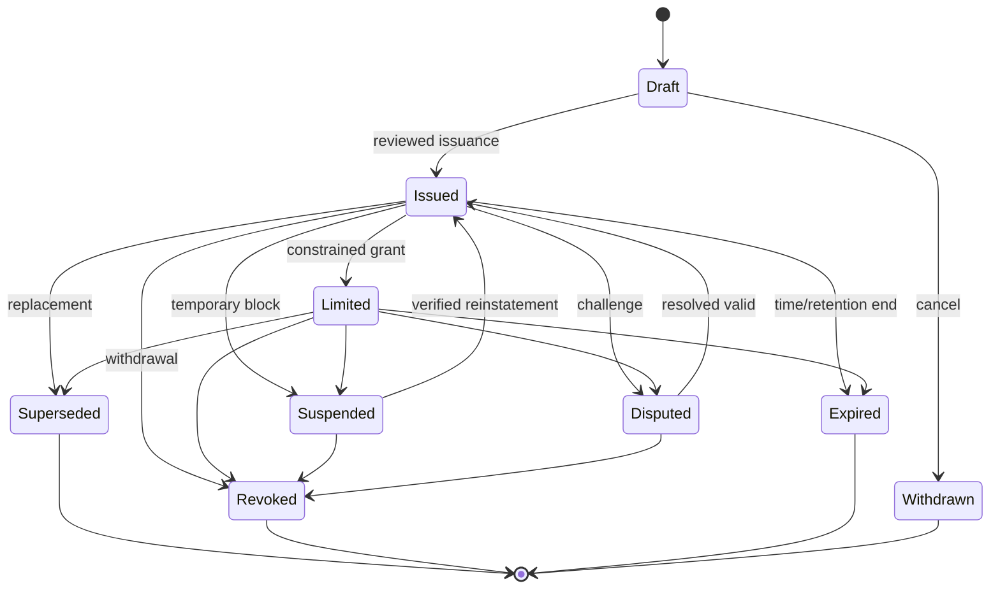
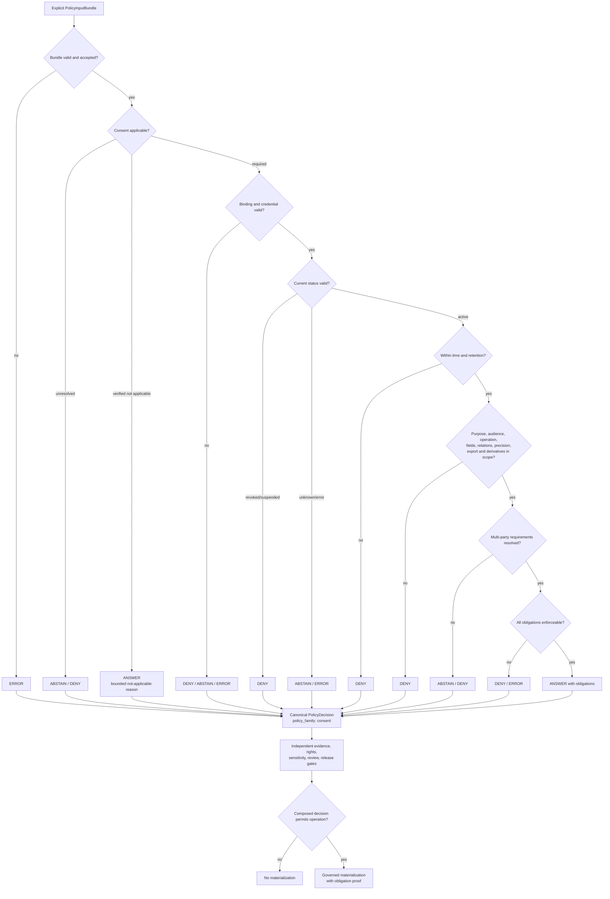

<!-- [KFM_META_BLOCK_V2]
doc_id: kfm://policy/consent
title: policy/consent/ — Consent Policy Boundary and Evaluation Contract
type: policy-readme
version: v0.3
status: draft; repository-grounded; lane-local-documentation-only; adjacent-fixture-evidence; evaluator-unbound; non-release; non-publication
owners: OWNER_TBD — Consent steward · Privacy steward · Policy steward · Policy-runtime steward · People-DNA-Land domain steward · Evidence steward · Rights steward · Sensitivity steward · Release steward · Docs steward
created: 2026-06-15
updated: 2026-08-13
policy_label: "restricted-review; consent; cross-cutting-policy; purpose-bound; audience-bound; subject-bound; revocable; explicit-applicability; finite-outcomes; explicit-inputs; no-hidden-fetches; fail-closed; obligations; evidence-aware; rights-aware; sensitivity-aware; release-independent; governed-api; cache-invalidation; replayable; correctable; rollback-aware; no-reidentification; no-secrets"
current_path: policy/consent/README.md
owning_root: policy/
responsibility: Define the shared consent-policy boundary, exact lane inventory, current candidate-evidence map, non-ownership seams, activation requirements, correction posture, and rollback contract without becoming consent credential, evidence, schema, runtime, decision-instance, release, or publication authority.
truth_posture: CONFIRMED exact lane contains this README and two documentation-only child lanes; domain-nested consent Rego files are PROPOSED scaffolds with no substantive rule bodies, native tests, accepted bundle, evaluator, or activation; the permissive PolicyInputBundle parent plus inactive explicit-context profile, closed PolicyDecision shape plus inactive vocabulary/semantics profiles, synthetic People-DNA-Land consent-overlay and revocation-propagation validators, strict fixture-first Explorer consent-card projection, and focused workflows are repository-present / PROPOSED shared cross-cutting consent semantics, applicability profile, child inheritance, active rule bundle, native-to-canonical normalization, broader reason/obligation registry, credential binding, current-status service, production dependency invalidation, governed consumer integration, and decision receipt mapping / CONFLICTED top-level policy/consent placement versus domain-nested consent placement, duplicate consent doctrine carriers, people versus people-dna-land segment conventions, and domain assessment SATISFIED versus canonical PolicyDecision ANSWER vocabulary / UNKNOWN accepted owners, active evaluator and bundle selector, authenticated decisions, production consent store, representative authority, multi-party enforcement, deployed revocation service, complete cache/derivative cleanup, receipt authenticity, release integration, branch-protection enforcement, and public operational health
repository: bartytime4life/Kansas-Frontier-Matrix
repository_id: "1059091169"
visibility: public
base_ref: main
base_commit: 1a61d3fbdc111bb3292086a30a53ccc50ed1bb8a
base_tree: e5bc55373378f4310c1b4573fa4d1879e4720cd3
prior_blob: 5c56e988cbfa7b613fa39feec3c8f7f5bb44ce1b
bounded_path_search: exact consent lane and children, policy root and domain policy scaffolds, People-DNA-Land doctrine and contracts, policy input/decision profiles and registries, consent and revocation schemas, fixtures, validators, tests, workflows, Explorer projection, policy-runtime package, generated receipts, and current-main history
related:
  - ../README.md
  - ./people/README.md
  - ./people-dna-land/README.md
  - ../access/README.md
  - ../bundles/README.md
  - ../domains/README.md
  - ../../docs/domains/people-dna-land/CONSENT_MODEL.md
  - ../../docs/domains/people-dna-land/CONSENT.md
  - ../../docs/domains/people-dna-land/CONSENT_REGISTER.md
  - ../../docs/domains/people-dna-land/CANONICAL_PATHS.md
  - ../../docs/domains/people-dna-land/SENSITIVITY_PROFILE.md
  - ../../docs/domains/people-dna-land/API_CONTRACTS.md
  - ../../docs/standards/CONSENT_TOKENS.md
  - ../../contracts/policy/policy_input_bundle.md
  - ../../contracts/policy/policy_input_bundle_profile_v1.md
  - ../../contracts/policy/policy_decision.md
  - ../../contracts/policy/policy_decision_vocabulary.md
  - ../../contracts/policy/policy_decision_semantics_profile_v1.md
  - ../../contracts/domains/people-dna-land/consented_genealogy_overlay.md
  - ../../contracts/domains/people-dna-land/consent_revocation_propagation_assessment.md
  - ../decision/vocabulary.v1.json
  - ../../schemas/contracts/v1/policy/policy_input_bundle.schema.json
  - ../../schemas/contracts/v1/policy/policy_input_bundle_profile_v1.schema.json
  - ../../schemas/contracts/v1/policy/policy_decision.schema.json
  - ../../schemas/contracts/v1/policy/policy_decision_vocabulary.schema.json
  - ../../schemas/contracts/v1/domains/people-dna-land/consented_genealogy_overlay.schema.json
  - ../../schemas/contracts/v1/domains/people-dna-land/consent_revocation_propagation_assessment.schema.json
  - ../../policy/domains/people-dna-land/consent_validator.rego
  - ../../policy/domains/people-dna-land/consent/dna_consent_revocation.rego
  - ../../fixtures/domains/people-dna-land/consent_overlay/README.md
  - ../../fixtures/domains/people-dna-land/consent_revocation_propagation/README.md
  - ../../tools/validators/domains/people-dna-land/validate_consent_overlay.py
  - ../../tools/validators/domains/people-dna-land/validate_consent_revocation_propagation_assessment.py
  - ../../tests/domains/people-dna-land/consent/revocation/README.md
  - ../../apps/explorer-web/src/features/consent_card/README.md
  - ../../fixtures/ui/consent_card_projection/README.md
  - ../../packages/policy-runtime/README.md
  - ../../packages/policy-runtime/pyproject.toml
  - ../../apps/governed-api/README.md
  - ../../docs/doctrine/directory-rules.md
  - ../../docs/doctrine/trust-membrane.md
  - ../../docs/registers/DRIFT_REGISTER.md
  - ../../docs/registers/VERIFICATION_BACKLOG.md
  - ../../.github/workflows/policy-test.yml
  - ../../.github/workflows/policy-input-bundle-profile-v1.yml
  - ../../.github/workflows/policy-decision-vocabulary.yml
  - ../../.github/workflows/policy-decision-semantics-v1.yml
  - ../../.github/workflows/consent-revocation-propagation.yml
tags: [kfm, policy, consent, privacy, people, people-dna-land, living-person, genealogy, dna, genomics, revocation, applicability, render-gate, policy-input-bundle, policy-decision, obligations, reason-codes, fail-closed, governed-api, rollback]
notes:
  - "This documentation-only revision changes policy/consent/README.md plus one hash-bound generated authoring receipt."
  - "The path is CONFIRMED repository-present, but its authority remains CONFLICTED because current People-DNA-Land path doctrine says the placement ADR is unresolved and prefers domain-nested consent rules pending that ADR."
  - "The parent lane defines shared consent semantics and inheritance boundaries; child lanes may tighten controls but must not weaken the parent invariants."
  - "Two domain-nested consent Rego scaffolds are present: consent_validator.rego defaults deny to false and has only a commented example; dna_consent_revocation.rego defaults allow to false and has no operative rule body. Neither is lane-local, native-tested, bundled, evaluator-bound, or active."
  - "PolicyInputBundle remains permissive at its parent schema, while a separate PROPOSED_INACTIVE explicit-context profile now validates a bounded generic input subset without evaluating policy."
  - "PolicyDecision retains canonical outcomes ANSWER, ABSTAIN, DENY, and ERROR and policy_family consent; inactive vocabulary and semantics profiles validate candidate reason/obligation coherence but do not authenticate a decision."
  - "Synthetic consent-overlay, revocation-propagation, and Explorer consent-card profiles provide bounded fixture evidence. They do not establish a general consent evaluator, live grant/status service, completed cleanup, release approval, or publication."
  - "The policy runtime remains version 0.0.0 and comment-only; policy-test is now a static readiness guard, while focused profile workflows run deterministic validators rather than a repository-wide evaluator."
[/KFM_META_BLOCK_V2] -->

<a id="top"></a>

# Consent Policy Boundary and Evaluation Contract

`policy/consent/`

> Cross-cutting policy boundary for explicit, purpose-bound, audience-bound, subject-bound, revocable consent evaluation. This lane defines shared consent invariants and child-lane expectations only if its placement is accepted; it cannot establish identity truth, relationship truth, evidence closure, source authority, rights clearance, sensitivity clearance, review approval, release approval, or publication.


**Quick links:** [Purpose](#purpose) · [Authority](#authority-level) · [Status](#status-and-evidence) · [Evidence map](#current-implementation-evidence-map) · [Scope](#scope-and-bounded-context) · [Invariants](#keystone-invariants) · [Repo fit](#repository-fit-and-directory-rules-basis) · [Child lanes](#child-lane-contract) · [Belongs](#what-belongs-here) · [Exclusions](#what-does-not-belong-here) · [Inputs](#explicit-policy-input) · [Applicability](#consent-applicability) · [Decisions](#decision-vocabulary-and-normalization) · [Lifecycle](#consent-lifecycle) · [Evaluation](#evaluation-order) · [Composition](#independent-policy-family-composition) · [Revocation](#revocation-correction-and-cache-invalidation) · [Audit](#audit-replay-and-data-minimization) · [Threats](#threat-model) · [Validation](#validation-and-test-matrix) · [Implementation](#smallest-sound-implementation-sequence) · [Done](#definition-of-done) · [Open](#open-verification-register) · [Rollback](#rollback-correction-and-supersession)

> [!IMPORTANT]
> **Consent is a constraint, not a publication permission.** A consent result may only say whether consent blocks the exact operation, audience, purpose, subject or holder binding, field or relation, precision, export, temporal window, and derivative that were evaluated. Evidence, source role, rights, sensitivity, review, release, correction, and rollback remain independent gates.

> [!CAUTION]
> **Repository presence is not policy activation.** Current main contains domain Rego scaffolds and several deterministic, fixture-first consent-adjacent profiles. None establishes an accepted cross-cutting consent bundle, substantive lane-local rule set, evaluator binding, authenticated decision, live grant/status service, executed cleanup, governed API producer, release approval, or production enforcement.

---

## Purpose

This README defines the shared consent-policy boundary for KFM.

It is intended to keep consent evaluation:

- explicit rather than inferred;
- operation-specific;
- purpose-bound;
- audience-bound;
- subject-, holder-, or authorized-representative-bound;
- field-, relation-, derivative-, precision-, and export-specific;
- time-bounded;
- revocation-, suspension-, dispute-, correction-, and supersession-aware;
- finite in outcome;
- obligation-bearing;
- auditable and replayable;
- privacy-preserving;
- correctable and reversible;
- fail-closed.

The parent lane exists to define common semantics that child consent lanes can specialize. It must prevent any consent record, access grant, public record, data-license term, source availability, prior release, model output, or human assumption from being misused as:

- a general publication license;
- a substitute for a `PolicyInputBundle`;
- a substitute for a `PolicyDecision`;
- proof of identity, living status, relationship, occupancy, ownership, title, or boundary;
- source-rights clearance;
- a sensitivity downgrade;
- release approval;
- evidence closure;
- a waiver of citation;
- permission to reconstruct revoked, redacted, generalized, or withheld information;
- permission for secondary use outside the evaluated purpose;
- permission to bypass governed APIs;
- permission to silently reuse a stale decision.

[Back to top](#top)

---

## Authority level

This lane is **policy-authoritative only after placement, ownership, review, bundle, activation, and rollback controls are accepted**.

| Concern | Authority in this lane |
|---|---|
| Shared consent invariants | Potential authority after the placement ADR and executable-rule review. |
| Consent applicability semantics | Potential authority after an accepted applicability profile, schema, fixtures, and tests exist. |
| Child-lane inheritance rules | Potential parent authority if this lane is accepted as the cross-cutting consent home. |
| Domain-specific consent conditions | Child/domain policy authority, not this parent README. |
| Policy input meaning | None. `contracts/policy/policy_input_bundle.md` owns meaning. |
| Policy decision meaning | None. `contracts/policy/policy_decision.md` owns the canonical result. |
| Machine shape | None. `schemas/contracts/v1/` owns shape. |
| Runtime execution | None. `packages/policy-runtime/` is the executor boundary. |
| Consent credential issuance | None. Issuance and identity/holder proof require separate governed systems. |
| Evidence and source role | None. Evidence and source registries remain independent. |
| Rights and sensitivity | None. Independent policy families retain authority. |
| Review and release | None. Review artifacts and `release/` retain authority. |
| Receipts and proofs | None. Emitted trust artifacts live outside this lane. |
| Public API/UI behavior | None. Governed applications consume normalized decisions and enforce obligations. |

A consent rule can block or constrain an operation. It cannot publish, prove, or authorize beyond that exact gate.

[Back to top](#top)

---

## Status and evidence

### Current repository state

| Surface | Status | Safe conclusion |
|---|---:|---|
| `policy/consent/README.md` | **CONFIRMED v0.2 baseline** | This v0.3 revision preserves its boundary contract while reconciling implementation added after the prior evidence snapshot. |
| Exact `policy/consent/` inventory | **CONFIRMED documentation-only** | The lane contains this README, two child READMEs, and two `.gitkeep` files—no Rego, bundle, manifest, registry, fixture, test, or runtime payload. |
| `policy/consent/people/README.md` | **CONFIRMED v0.2** | People/living-person specialization remains a README-only boundary. |
| `policy/consent/people-dna-land/README.md` | **CONFIRMED v0.2** | Restricted-domain specialization remains README-only inside this lane; adjacent domain fixture profiles now exist elsewhere. |
| `policy/README.md` | **CONFIRMED canonical responsibility root** | Accepted Directory Rules place policy source under singular `policy/`; the root records mixed maturity and no general evaluator. |
| Placement | **CONFLICTED** | The top-level parent exists and is indexed, while current People-DNA-Land path doctrine still prefers domain-nested consent rules pending an ADR. |
| Domain consent doctrine | **CONFIRMED DRAFT DOCS** | `CONSENT_MODEL.md` and `CONSENT.md` both remain; the former says it supersedes the latter, but the duplicate carrier has not been retired. |
| Domain-nested Rego | **CONFIRMED PROPOSED scaffolds** | `consent_validator.rego` defaults `deny := false` with only a commented example; `dna_consent_revocation.rego` defaults `allow := false` with no operative rule body. Neither is native-tested, bundled, evaluator-bound, or active. |
| `PolicyInputBundle` parent | **CONFIRMED semantic contract + permissive schema** | The parent schema still requires only `id`; rich consent context is not enforced there. |
| Explicit input profile v1 | **CONFIRMED `PROPOSED_INACTIVE`** | A separate closed profile, validator, fixtures, tests, and focused workflow now check bounded generic exposure/release-adjacent context without evaluating policy or defining consent-specific grant fields. |
| `PolicyDecision` shape | **CONFIRMED PROPOSED shape** | Canonical outcomes remain `ANSWER`, `ABSTAIN`, `DENY`, and `ERROR`; `policy_family` includes `consent`. |
| Decision vocabulary/semantics | **CONFIRMED `PROPOSED_INACTIVE`** | Machine-checkable registry and semantic validators cover bounded reason/obligation coherence. They emit and authenticate no decision. |
| Consent-overlay profile | **CONFIRMED synthetic fixture-only** | Closed domain schemas, 2 valid and 13 invalid fixtures, a deterministic validator, 16 no-network tests, and workflow wiring exercise bounded consent/revocation/privacy/non-release rules. |
| Revocation-propagation assessment | **CONFIRMED synthetic fixture-only** | A closed seven-surface profile, 17 exact cases, deterministic validator, 9 tests, and focused workflow assess declared consistency; they execute no invalidation or cleanup. |
| Explorer consent card | **CONFIRMED fixture-first; not production-wired** | A strict app-local adapter and tests consume an already governed public-safe projection, preserve finite negative states, and never issue or revoke subject consent. |
| Consent grant/receipt schemas | **CONFIRMED empty permissive scaffolds** | Runtime `consent_grant` and governance `consent_receipt` schemas declare no properties; the genealogy receipt validator is docstring-only. |
| Policy runtime package | **CONFIRMED PLACEHOLDER** | `kfm-policy-runtime` remains version `0.0.0`, with an empty initializer and comment-only core. |
| Broad `policy-test` workflow | **CONFIRMED static readiness hold** | It inventories policy evidence and PolicyDecision shape fixtures but evaluates no repository-wide policy and emits no decision. |
| Focused workflows | **CONFIRMED deterministic candidate validation** | Input, vocabulary, semantics, consent-overlay, and revocation-propagation checks run bounded fixtures; workflow presence is not runtime activation or required-check proof. |
| Governed API integration | **UNKNOWN** | No accepted consent evaluator binding, normalized decision composer, obligation interpreter, or production consent-card producer was established. |
| Live receipts, dependency invalidation, cleanup, release integration | **UNKNOWN / NEEDS VERIFICATION** | Synthetic refs and authoring receipts exist; no authenticated decision receipt, production dependency index, executed invalidation, or public correction completion is proved. |

### Evidence boundary

This README may describe inspected repository facts and bounded doctrine. It must not claim:

- active consent enforcement;
- legal sufficiency;
- accepted consent-token or credential format;
- live holder, representative, or subject verification;
- deployed revocation or suspension service;
- complete derivative dependency tracking;
- cache invalidation performance;
- production policy selection;
- authenticated decision, action-receipt, or proof emission;
- cleanup, purge, invalidation, withdrawal, or recall completion;
- public-release safety;
- complete test coverage;
- branch-protection enforcement.

Those remain `UNKNOWN` or `NEEDS VERIFICATION` until implementation evidence proves them.

[Back to top](#top)

---

## Current implementation evidence map

The repository now contains several consent-related surfaces, but they answer different questions and must not be collapsed into one “consent system.”

| Surface | What it proves | What it does **not** prove |
|---|---|---|
| This parent and its two child READMEs | Shared and specialized boundary intent, current uncertainty, and review obligations. | Executable policy, accepted placement, or activation. |
| Domain Rego scaffolds | Proposed packages and fail-open/fail-closed defaults are inspectable as source bytes. | Substantive consent evaluation, bundle selection, native test coverage, or enforcement. |
| `PolicyInputBundleProfileV1` | One explicit generic context subset is closed, deterministic, and fail-closed under its validator. | Consent applicability, grant validity, evaluator execution, or a `PolicyDecision`. |
| Inactive decision vocabulary and semantics profiles | Candidate reason/obligation codes and canonical outcome coherence are machine-checkable. | Adoption, decision authenticity, native-result normalization, or consumer enforcement. |
| `ConsentedGenealogyOverlayCandidate` profile | Synthetic restricted/internal candidates reject revoked, expired, identifying, raw-genomic, over-precise, weak-evidence, and public-release cases. | Real consent, identity, kinship, DNA support, rights, policy approval, release, or publication. |
| `ConsentRevocationPropagationAssessment` | A deterministic assessment can require exact `READ`, `ANSWER`, `EXPORT`, `TILE`, `GRAPH`, `INDEX`, and `CACHE` declarations with fail-closed outcomes and receipt references. | That any dependency was actually blocked, invalidated, purged, recalled, or authenticated. |
| Explorer consent-card projection | The browser can parse a strict public-safe projection, display bounded `ANSWER` details, hide on `ABSTAIN`, `DENY`, or `ERROR`, and keep viewer choice separate from subject consent. | A governed producer, subject-consent mutation, policy evaluation, release, or public wiring. |
| Generated authoring receipts | Repository-artifact provenance and final-byte binding for authored changes. | A consent decision, consent grant, policy approval, action execution, or release authority. |

The dependency direction remains:

```text
evidence / rights / sensitivity / review / release status
  -> explicit policy input
  -> accepted consent policy + evaluator
  -> canonical PolicyDecision
  -> obligation enforcement
  -> minimized decision/action receipts
  -> governed materialization or fail-closed response
```

Only the bounded candidate-validation and UI-projection pieces are currently evidenced. The accepted policy/evaluator/consumer chain remains unbound.

[Back to top](#top)

---

## Scope and bounded context

### In scope

This parent lane may define shared consent behavior for:

- render, answer, review, query, join, export, download, derivative, training, promotion-adjacent, correction, and rollback operations;
- consent applicability;
- grant, holder, subject, representative, purpose, audience, scope, retention, expiry, suspension, dispute, revocation, and supersession checks;
- finite engine-result normalization into canonical `PolicyDecision`;
- shared reason-code and obligation semantics;
- child-lane inheritance and precedence;
- decision freshness and replay;
- consent-decision receipts and supersession expectations;
- revocation-triggered derivative and cache invalidation;
- safe public explanations;
- governed API and AI boundaries;
- no-hidden-fetch behavior.

### Out of scope

This lane does not own:

- legal advice or jurisdiction-specific legal conclusions;
- identity proofing, authentication, or authorization credentials;
- subject or holder identity truth;
- person, relationship, land, title, parcel, or DNA truth;
- source acquisition;
- raw sensitive data storage;
- source licensing or rights determinations;
- sensitivity-tier assignment;
- schema definitions;
- application code;
- release approval;
- publication;
- correction adjudication;
- lifecycle storage;
- secret management;
- model training infrastructure;
- public UI design.

### The independent-gate rule

```text
consent decision       != rights decision
consent decision       != sensitivity decision
consent decision       != evidence closure
consent decision       != review approval
consent decision       != release approval
consent decision       != publication
consent ANSWER          != unrestricted use
```

All required gates must remain separately inspectable. A combined caller may compose outcomes, but it must preserve the originating policy family, reasons, obligations, timestamps, and decision references.

[Back to top](#top)

---

## Keystone invariants

1. **Consent does not publish.** A valid consent result never substitutes for release governance.
2. **Consent is exact-scope only.** No decision extends beyond the evaluated operation, purpose, audience, subject binding, fields, relations, precision, export, retention, and time.
3. **Applicability is explicit.** Missing consent and verified non-applicability are different states.
4. **Unknown fails closed.** Missing or unverifiable support cannot become implicit permission.
5. **Revocation is render-time relevant.** A stale grant or stale decision cannot authorize a consequential operation.
6. **Obligations are mandatory.** A caller that cannot enforce an obligation must not proceed.
7. **No hidden fetches.** The evaluator uses an explicit `PolicyInputBundle`; it does not silently retrieve missing facts.
8. **Canonical outcomes are finite.** Governed callers consume `ANSWER`, `ABSTAIN`, `DENY`, or `ERROR`.
9. **Engine vocabulary is not the public contract.** `ALLOW`, `RESTRICT`, `LIMITED`, `HOLD`, or equivalent internal results require normalization.
10. **Child lanes may tighten, not weaken.** A specialization cannot relax parent invariants or another applicable stronger restriction.
11. **Consent is not transferable by inference.** Consent by one person does not authorize exposure of another person, relation, household, family, community, or group.
12. **Public availability is not consent.** A public record, website, obituary, tree, directory, social post, map, or prior release is not a consent grant.
13. **Evidence outranks assertion.** A consent object cannot prove identity, relationships, living status, or claim truth.
14. **No reidentification.** Redacted, generalized, aggregated, or withheld information must not be reconstructed through joins, search, AI, or repeated queries.
15. **Audit without leakage.** Decision records must remain replayable without carrying raw sensitive identifiers or protected facts.
16. **Correction and rollback remain available.** Consent changes must propagate through decisions, derivatives, caches, and release/correction records.
17. **Repository presence is not activation.** A README, schema, or workflow stub is not proof of enforcement.

[Back to top](#top)

---

## Repository fit and Directory Rules basis

### Owning root

The responsibility is policy admissibility, so the owning root is `policy/`.

That root owns policy-as-code and policy documentation. It does not own:

- semantic object meaning (`contracts/`);
- machine shape (`schemas/`);
- runtime helper code (`packages/`);
- fixtures or tests (`fixtures/`, `tests/`);
- evidence, receipts, proofs, or lifecycle data (`data/`);
- release decisions (`release/`);
- governed application code (`apps/`).

### Exact lane map

Current `main` contains:

```text
policy/consent/
├── README.md
├── people/
│   ├── .gitkeep
│   └── README.md
└── people-dna-land/
    ├── .gitkeep
    └── README.md
```

This tree is authoritative only as an inventory. It confirms that the exact lane is documentation-only; it does not settle the placement conflict or imply that domain-nested Rego belongs here.

### Placement conflict

The current repository contains `policy/consent/`, but the People-DNA-Land canonical-path document records a genuine unresolved placement question:

- top-level cross-cutting `policy/consent/`; or
- domain-nested `policy/domains/people-dna-land/consent/`.

The same path doctrine says creating a new top-level lane is ADR-class and prefers the domain-nested form until an ADR decides.

Therefore:

- this path is **CONFIRMED repository-present**;
- this same-path README correction is **PLACE / EDITORIAL-ADDITIVE** under the adopted README contract and changes no authority;
- its long-term authority is **CONFLICTED**;
- existing domain Rego scaffolds must not be copied here or treated as active;
- substantive executable activation must wait for the placement decision and one canonical rule home;
- any move must include a migration map, supersession record, compatibility period where required, validation, and rollback plan.

### Responsibility matrix

| Concern | Owning root | Relationship to this README |
|---|---|---|
| Shared consent policy | `policy/` | Potential authority after placement and activation. |
| Domain consent specialization | accepted domain policy lane | Tightens shared rules for a bounded context. |
| Human-facing consent doctrine | `docs/` | Explains models and governance; not executable policy. |
| Policy input meaning | `contracts/` | Owns `PolicyInputBundle` semantics. |
| Policy decision meaning | `contracts/` | Owns `PolicyDecision` semantics. |
| Machine shape | `schemas/` | Owns JSON Schema and compatibility. |
| Runtime execution | `packages/` and governed applications | Executes accepted bundles; cannot redefine semantics. |
| Fixtures and tests | `fixtures/`, `tests/` | Prove expected behavior with synthetic data. |
| Receipts and proofs | `data/receipts/`, `data/proofs/`, or accepted homes | Record trust artifacts; exact mapping remains verification-sensitive. |
| Review and release | review artifacts and `release/` | Independent approval and publication authority. |
| Public access | `apps/governed-api/` | Trust membrane for public and restricted clients. |

[Back to top](#top)

---

## Child-lane contract

The parent lane defines shared consent semantics. Child lanes define stricter bounded-context rules.

### Current child lanes

| Child lane | Intended specialization | Current maturity |
|---|---|---|
| `policy/consent/people/` | People and living-person attributes, relations, residence/events, genealogy-adjacent claims, collateral-person protection. | Lane-local README-only v0.2; no people-specific executable rule, input profile, fixture family, evaluator, or consumer binding was established. |
| `policy/consent/people-dna-land/` | Restricted People / Genealogy / DNA / Land operations, DNA/genomic derivatives, land-linked people, sensitive joins. | Lane-local README-only v0.2. Related domain-nested Rego scaffolds and fixture-first validators exist outside this path, but placement, policy execution, and runtime enforcement remain unproved. |

### Inheritance rules

1. A child lane inherits every parent invariant.
2. A child lane may add stricter applicability, scope, revocation, review, precision, export, or obligation rules.
3. A child lane must not broaden a parent permission.
4. A child lane must not treat `ANSWER` as publication or unrestricted use.
5. A child lane must emit the canonical decision vocabulary before a governed caller consumes it.
6. A child lane must preserve its policy/bundle version and reason/obligation provenance.
7. If more than one child lane applies, the caller evaluates all applicable lanes rather than choosing the least restrictive one.
8. Conflicting or ambiguous applicability yields `ABSTAIN` or `DENY`, not an inferred allow.
9. A domain README, schema-valid fixture, Python validator, UI projection, or workflow cannot activate policy; activation requires accepted executable rules, bundle identity, runtime binding, fixtures, native tests, review, and rollback.
10. Until the placement ADR resolves the authority home, the existing domain-nested scaffolds must not be duplicated as a top-level executable bundle.

### Strongest-safe composition

When multiple consent rules apply, the safe posture is:

- any applicable `DENY` blocks the operation;
- any applicable `ERROR` fails closed;
- any unresolved required rule yields `ABSTAIN`;
- `ANSWER` is possible only when every required consent rule returns `ANSWER` and every obligation is enforceable;
- obligations are unioned unless they conflict;
- conflicting obligations fail closed and require review.

This composition is **PROPOSED** until a canonical policy-decision composer and fixtures are accepted.

[Back to top](#top)

---

## What belongs here

If the placement ADR accepts this parent lane, it may hold:

- shared consent-policy documentation;
- cross-cutting consent rule modules or bundle manifests;
- consent applicability rules;
- engine-to-canonical outcome normalization rules;
- shared reason-code definitions;
- shared obligation definitions;
- child-lane inheritance/precedence rules;
- revocation, suspension, expiry, dispute, and supersession policy;
- consent decision freshness rules;
- safe public explanation policy;
- policy bundle metadata and compatibility notes;
- references to validators, fixtures, tests, receipts, and runtime integration;
- migration and rollback documentation for policy changes.

Every trust-bearing file must identify:

- authority and owner;
- status and version;
- input contract;
- output contract;
- policy family;
- default posture;
- reason-code and obligation semantics;
- review burden;
- validation coverage;
- correction and rollback path;
- activation state.

[Back to top](#top)

---

## What does not belong here

| Does not belong | Correct responsibility |
|---|---|
| Raw consent records, identities, DNA values, private relationships, or living-person source data | Governed `data/` lifecycle and restricted stores |
| Consent semantic contracts | `contracts/` |
| JSON Schema | `schemas/` |
| Runtime helper/library code | `packages/` |
| API or UI implementation | `apps/` |
| Tests and fixtures | `tests/`, `fixtures/` |
| Evidence bundles or source descriptors | Evidence/source responsibility roots |
| Consent receipts or proofs | Accepted `data/receipts/` or `data/proofs/` homes |
| Release manifests, correction notices, rollback cards | `release/` |
| Rights/licensing policy | Accepted rights policy lane |
| Sensitivity/geoprivacy policy | `policy/sensitivity/` |
| Credentials, private keys, secrets, raw tokens | Secret manager or deployment security boundary |
| Legal advice | Outside repository policy documentation |
| Generated claims or AI summaries presented as authority | Governed AI/runtime surfaces backed by evidence |

[Back to top](#top)

---

## Explicit policy input

The evaluator must consume an explicit `PolicyInputBundle` or an accepted consent-specific profile of that contract.

The parent schema still requires only `id` and permits additional properties. A separate `PolicyInputBundleProfileV1` now closes and validates a generic exposure/release-adjacent subset—operation, audience, subject, evidence, source, rights, sensitivity, review, release, evaluator, and explicit false-authority flags—but it is `PROPOSED_INACTIVE`, fixture-only, and non-evaluator. It does not model consent applicability, grant binding, holder/representative authority, status lookup, or revocation freshness.

Therefore the consent-specific fields below remain **PROPOSED semantic requirements**, not accepted machine-enforced facts.

### Shared consent input profile

| Input family | Minimum semantic content | Fail-closed condition |
|---|---|---|
| Bundle identity | bundle id, version, optional deterministic `spec_hash`, canonicalization profile | Missing or mutable identity |
| Requested operation | render, answer, review, query, join, export, download, derive, train, correct, rollback, or other explicit operation | Missing or generic operation |
| Audience | public, restricted reviewer, steward, named partner, internal service, governed AI, export recipient | Unknown audience |
| Policy selection | `policy_family: consent`, parent/child rule family, bundle id/hash/version, evaluator profile | Missing, stale, or ambiguous bundle |
| Applicability | required, verified not applicable, unresolved; basis/evidence refs | Applicability inferred from absence |
| Subject/holder binding | minimized subject ref, holder ref, representative ref and authority basis where applicable | Binding mismatch or unverifiable authority |
| Consent record | grant/sidecar/receipt ref, issuer, issue time, validity window, status pointer | Missing when required, invalid, or unresolvable |
| Purpose and scope | requested purpose, allowed purpose, operation scope, field/relation/derivative scope | Requested use outside scope |
| Precision and export | coordinate/detail precision, generalization/redaction state, export/download/training flags | Precision or secondary use not covered |
| Time | evaluation time, not-before, expiry, retention deadline, decision freshness window | Missing, stale, expired, or not yet valid |
| Revocation state | status ref, checked-at time, suspended/revoked/disputed/superseded state | Status unavailable or stale |
| Object context | object, claim, dataset, layer, release, relation, derivative, or cache dependency refs | Raw sensitive values embedded or target ambiguous |
| Evidence context | EvidenceRef/EvidenceBundle refs and resolver status needed for binding/applicability | Missing support for identity/binding/applicability |
| Rights context | source rights and redistribution/export posture | Unknown rights when operation depends on them |
| Sensitivity context | sensitivity labels, living-person/DNA/private-join flags, redaction/generalization state | Unknown sensitivity |
| Review context | review state, required reviewer, ReviewRecord refs | Required review missing |
| Release context | candidate/released/withdrawn/superseded state, ReleaseManifest and rollback refs | Caller treats consent as release |
| Prior decisions | prior PolicyDecision refs, supersession, stale/degraded flags | Stale decision reused as current |
| Dependency context | derivative, tile, cache, index, export, model, or summary dependencies | Revocation impact cannot be bounded |
| Audit context | request id, actor/service ref, correlation id, safe logging profile | Raw sensitive data would enter logs |

### No-hidden-fetch rule

A consent evaluator must not silently fetch missing facts from:

- RAW or canonical stores;
- source systems;
- browser/session state;
- UI state;
- vector indexes;
- search history;
- operator memory;
- AI prompts or generated text;
- stale cached decisions;
- undocumented external services.

A governed fetch must produce a new explicit input bundle or a separately traceable receipt. Otherwise the evaluator returns `ABSTAIN`, `DENY`, or `ERROR` according to the failure.

[Back to top](#top)

---

## Consent applicability

Consent applicability must be evaluated explicitly before grant validity.

### Proposed applicability states

| State | Meaning | Canonical posture |
|---|---|---|
| `required` | Policy says this operation requires consent. | Continue to grant/status/scope evaluation. |
| `verified_not_applicable` | An accepted rule and evidence establish that consent is not required for this exact operation. | Consent family may return `ANSWER` with a bounded not-applicable reason; other gates still apply. |
| `unresolved` | Available context cannot establish whether consent is required. | `ABSTAIN` or `DENY`; never infer not-applicable. |
| `error` | Applicability evaluator, shape, integrity, or bundle selection failed. | `ERROR`; fail closed. |

### Applicability must not be inferred from

- absence of a consent record;
- public availability;
- age of a source;
- a record being historical;
- a person being presumed deceased;
- a family member’s consent;
- a source provider’s terms;
- a previous release;
- a prior `ANSWER`;
- a reviewer’s informal approval;
- a model-generated classification;
- the caller being internal;
- the data being “only metadata”;
- a generalized output without a verified transform receipt.

### Required distinction

```text
consent required + no valid grant          -> DENY or ABSTAIN
consent applicability unresolved           -> ABSTAIN or DENY
consent verified not applicable            -> ANSWER for consent family only
consent valid and in scope                  -> ANSWER with obligations
```

A `verified_not_applicable` result must carry the accepted applicability rule, relevant evidence or policy references, evaluator version, and evaluation time. It is not a permanent exemption.

[Back to top](#top)

---

## Decision vocabulary and normalization

The repository-present `PolicyDecision` schema requires:

```text
ANSWER | ABSTAIN | DENY | ERROR
```

The parent consent lane must not expose `ALLOW`, `RESTRICT`, `LIMITED`, `HOLD`, or `ACCEPTED` as canonical `PolicyDecision.outcome` values.

### Proposed normalization table

| Engine-native result | Canonical `PolicyDecision.outcome` | Required behavior |
|---|---|---|
| `ALLOW` | `ANSWER` | Only for the evaluated consent gate; propagate all obligations. |
| `RESTRICT` / `LIMITED` | `ANSWER` | Only if every restriction is represented as an enforceable obligation. |
| `RESTRICT` / `LIMITED` with unsupported obligation | `DENY`, `ABSTAIN`, or `ERROR` | Choose based on whether policy blocks, support is unresolved, or enforcement failed. |
| `HOLD` / `REVIEW` | `ABSTAIN` | Add `require_steward_review`; do not materialize publicly. |
| `DENY` | `DENY` | Block the operation; provide safe reason codes. |
| `ABSTAIN` | `ABSTAIN` | Do not manufacture support or infer permission. |
| `ERROR` | `ERROR` | Fail closed; preserve error provenance. |
| unknown value | `ERROR` | Reject unrecognized engine output. |

### Canonical decision requirements

Every consent `PolicyDecision` must include:

- unique `decision_id`;
- `outcome`;
- `policy_family: consent`;
- reasons;
- obligations;
- `evaluated_at`.

The current canonical schema does not include input-bundle ref, bundle version, supersession, public/internal reason separation, or decision expiry. Those links remain **PROPOSED** and require schema/contract review rather than being smuggled into additional properties, because the schema disallows them.

### `ANSWER` boundary

`ANSWER` from the consent policy family means only:

> Consent does not block the evaluated action under the evaluated context, provided every obligation is enforced.

It does not mean:

- the claim is true;
- the source is authoritative;
- the evidence closes;
- rights permit use;
- sensitivity allows exposure;
- review is complete;
- release is approved;
- publication is safe;
- future operations are allowed.

[Back to top](#top)

---

## Proposed shared reason codes

No **accepted active** consent reason-code registry was verified.

Current main does contain an inactive machine-checkable registry at `policy/decision/vocabulary.v1.json`. Its consent-applicable reason set is deliberately small:

| Inactive registry code | Canonical outcome | Current meaning |
|---|---:|---|
| `CONSENT_REQUIRED` | `DENY` | Required consent is absent, expired, revoked, or outside the requested use. |
| `POLICY_BUNDLE_UNAVAILABLE` | `ERROR` | The selected bundle/evaluator context is missing, stale, or unverifiable. |
| `POLICY_INPUT_INCOMPLETE` | `ERROR` | The explicit input lacks required governed context. |

The registry is `PROPOSED_INACTIVE`, declares `policy_evaluation=false` and `decision_emitted=false`, and is validated only for candidate coherence. The dotted namespace below remains **PROPOSED design detail**; it is not an alias set, active runtime vocabulary, or compatibility promise.

| Reason code | Typical outcome | Meaning |
|---|---|---|
| `consent.applicability.required` | informational | Consent is required for this operation. |
| `consent.applicability.not_applicable_verified` | `ANSWER` | Accepted rule establishes consent is not required for this exact operation. |
| `consent.applicability.unresolved` | `ABSTAIN` | Applicability cannot be established. |
| `consent.grant.missing` | `DENY` / `ABSTAIN` | Required consent record is absent. |
| `consent.grant.invalid` | `DENY` / `ERROR` | Integrity, signature, shape, or issuer validation failed. |
| `consent.binding.subject_mismatch` | `DENY` | Grant does not bind the evaluated subject. |
| `consent.binding.holder_mismatch` | `DENY` | Holder binding is inconsistent. |
| `consent.binding.representative_unverified` | `ABSTAIN` / `DENY` | Representative authority is not established. |
| `consent.status.revoked` | `DENY` | Grant has been revoked. |
| `consent.status.suspended` | `DENY` / `ABSTAIN` | Grant is suspended. |
| `consent.status.disputed` | `ABSTAIN` | Human review or correction is required. |
| `consent.status.unknown` | `ABSTAIN` / `ERROR` | Current status cannot be resolved. |
| `consent.time.not_yet_valid` | `DENY` | Validity has not begun. |
| `consent.time.expired` | `DENY` | Validity or retention window has ended. |
| `consent.time.decision_stale` | `ABSTAIN` / `ERROR` | Prior decision is not fresh enough for reuse. |
| `consent.scope.purpose_outside` | `DENY` | Requested purpose is not allowed. |
| `consent.scope.audience_outside` | `DENY` | Requested audience is not allowed. |
| `consent.scope.operation_outside` | `DENY` | Requested operation is not allowed. |
| `consent.scope.field_outside` | `DENY` | Requested field is not allowed. |
| `consent.scope.relation_outside` | `DENY` | Requested relation or join is not allowed. |
| `consent.scope.precision_outside` | `DENY` | Requested precision/detail is not allowed. |
| `consent.scope.export_outside` | `DENY` | Export/download/secondary use is not allowed. |
| `consent.scope.derivative_outside` | `DENY` | Requested derivative or model use is not allowed. |
| `consent.multi_party.unresolved` | `ABSTAIN` / `DENY` | Required consent for another affected subject is unresolved. |
| `consent.obligation.unsupported` | `DENY` / `ERROR` | Caller cannot enforce a required obligation. |
| `consent.bundle.unknown` | `ERROR` | Accepted policy bundle cannot be selected. |
| `consent.evaluator.unavailable` | `ERROR` | Evaluator failed or timed out. |
| `consent.input.hidden_fetch_forbidden` | `ERROR` | Evaluation attempted an ungoverned external fetch. |
| `consent.review.required` | `ABSTAIN` | Steward/privacy review is required. |

Public explanations must not reveal whether a protected person, relationship, DNA record, private location, or consent record exists unless policy explicitly permits that disclosure.

[Back to top](#top)

---

## Proposed shared obligations

No accepted consent obligation registry or interpreter was verified. The inactive v1 registry currently exposes only `REQUIRE_STEWARD_REVIEW` to the consent family, and only on `ANSWER`. That entry is candidate vocabulary, not enforcement.

The more complete obligations below remain **PROPOSED design detail**. A future active registry must reconcile names, versioning, aliases, consumer support, and rollback instead of silently treating this list as adopted.

| Obligation | Required effect |
|---|---|
| `redact_fields` | Remove named protected fields before materialization. |
| `withhold_relation` | Suppress a protected relationship or join. |
| `generalize_precision` | Reduce spatial, temporal, demographic, or attribute detail. |
| `withhold_exact_location` | Prevent precise residence, parcel, or sensitive location exposure. |
| `restrict_audience` | Limit access to the evaluated audience. |
| `purpose_limit` | Prevent reuse outside the evaluated purpose. |
| `retention_limit` | Stop use and begin governed cleanup at expiry. |
| `block_export` | Disallow download, bulk export, or external transfer. |
| `block_secondary_use` | Disallow use for another analysis, matching, or enrichment purpose. |
| `block_model_training` | Disallow model training, fine-tuning, embedding retention, or benchmark reuse. |
| `no_public_ai_inference` | Prevent public AI reasoning over restricted material. |
| `no_reidentification` | Prevent joins, repeated queries, or inference intended to recover withheld identity. |
| `require_steward_review` | Route to named review before materialization. |
| `require_fresh_status_check` | Re-evaluate revocation/suspension before each consequential use. |
| `attach_safe_notice` | Attach a non-sensitive consent/use notice where required. |
| `log_minimized` | Record only minimized references and safe reason codes. |
| `propagate_to_derivatives` | Carry restrictions to derived datasets, indexes, tiles, summaries, models, and exports. |
| `invalidate_dependencies_on_change` | Invalidate affected caches and derivatives after revocation/correction. |
| `rollback_check_required` | Evaluate whether a prior release or derivative must be withdrawn or superseded. |

### Enforcement rule

Obligations are not advisory metadata.

A caller must:

1. recognize every obligation;
2. prove the obligation was applied;
3. preserve the obligation in downstream envelopes/receipts;
4. fail closed if an obligation is unknown, unsupported, contradictory, or partially applied.

Dropping an obligation during API, UI, map, AI, export, cache, or release processing is a policy failure.

[Back to top](#top)

---

## Consent lifecycle

Consent state must be explicit, immutable once issued where practical, supersession-aware, and revocable.

| State | Meaning | Consent-family posture |
|---|---|---|
| `draft` | Record is being prepared and is not valid for evaluation. | `DENY` / `ABSTAIN` if consent is required. |
| `issued` / `granted` | Grant exists and may be evaluated. | Check binding, integrity, status, time, scope, and obligations. |
| `limited` | Grant permits only constrained purpose, audience, fields, relations, precision, export, or time. | `ANSWER` only with enforceable obligations. |
| `suspended` | Grant is temporarily inactive. | `DENY` or `ABSTAIN`; do not materialize. |
| `disputed` | Binding, authority, scope, or validity is challenged. | `ABSTAIN` and require review. |
| `expired` | Validity or retention window ended. | `DENY`; evaluate cleanup and rollback. |
| `revoked` | Holder or authorized process withdrew consent. | `DENY`; invalidate dependent decisions, caches, and derivatives. |
| `superseded` | A newer grant or correction replaces this record. | Do not evaluate as current; resolve the successor. |
| `withdrawn` | Draft or unactivated record was withdrawn. | Not usable. |
| `unknown` | Current state cannot be verified. | `ABSTAIN`, `DENY`, or `ERROR`; never implicit allow. |

Current fixture profiles use narrower local vocabularies:

- the genealogy-overlay candidate uses `active`, `revoked`, `expired`, or `not_required`;
- the revocation-propagation assessment uses `ACTIVE`, `REVOKED`, `EXPIRED`, `UNKNOWN`, or `ERROR`;
- the Explorer projection uses `RECORDED`, `NOT_APPLICABLE`, `WITHHELD`, or `UNRESOLVED` for upstream subject-inclusion state.

These are profile-local fields, not one accepted consent-state registry. A future active policy must version and normalize them explicitly; matching English words do not create semantic equivalence.

### Transition rules

- Issued records should not be silently mutated.
- Changes create a new version, successor, status event, or receipt.
- Revocation and suspension are evaluated against the current status source.
- Supersession must preserve lineage to prior grants and decisions.
- State transitions must be time-stamped and auditable.
- A stale cache or copied token must not override current status.
- Expiry and retention cleanup are distinct from deletion of minimized audit records.
- Correction of subject, holder, representative, relation, or scope binding may invalidate prior decisions even when the grant itself is not revoked.


```mermaid
stateDiagram-v2
    [*] --> Draft
    Draft --> Issued: reviewed issuance
    Draft --> Withdrawn: cancel
    Issued --> Limited: constrained grant
    Issued --> Suspended: temporary block
    Issued --> Disputed: challenge
    Issued --> Expired: time/retention end
    Issued --> Revoked: withdrawal
    Issued --> Superseded: replacement
    Limited --> Suspended
    Limited --> Disputed
    Limited --> Expired
    Limited --> Revoked
    Limited --> Superseded
    Suspended --> Issued: verified reinstatement
    Suspended --> Revoked
    Disputed --> Issued: resolved valid
    Disputed --> Revoked
    Superseded --> [*]
    Revoked --> [*]
    Expired --> [*]
    Withdrawn --> [*]
```

[Back to top](#top)

---

## Evaluation order

The consent evaluator should be deterministic and side-effect free until it emits a decision/receipt request.

### Proposed sequence

1. Validate the input bundle identity and shape.
2. Select the accepted consent policy bundle and applicable child lanes.
3. Determine consent applicability.
4. If verified not applicable, emit a bounded consent-family `ANSWER`.
5. Verify subject, holder, and representative binding.
6. Verify consent-record integrity and issuer/credential profile.
7. Resolve current revocation, suspension, dispute, and supersession state.
8. Check not-before, expiry, retention, and decision freshness.
9. Check purpose, audience, and operation.
10. Check fields, relations, derivatives, precision, export, download, training, and secondary use.
11. Resolve multi-party or collateral-subject requirements.
12. Expand required obligations.
13. Verify the caller can enforce every obligation.
14. Normalize the engine result into canonical `PolicyDecision`.
15. Emit minimized audit/receipt references if configured.
16. Return the consent-family decision to the governed decision composer.
17. Let independent evidence, rights, sensitivity, review, and release gates run.
18. Materialize only if the composed decision permits it and all obligations are proved.


```mermaid
flowchart TD
    A["Explicit PolicyInputBundle"] --> B{"Bundle valid and accepted?"}
    B -->|no| E1["ERROR"]
    B -->|yes| C{"Consent applicable?"}
    C -->|unresolved| A1["ABSTAIN / DENY"]
    C -->|verified not applicable| N1["ANSWER<br/>bounded not-applicable reason"]
    C -->|required| D{"Binding and credential valid?"}
    D -->|no| D1["DENY / ABSTAIN / ERROR"]
    D -->|yes| S{"Current status valid?"}
    S -->|revoked/suspended| D2["DENY"]
    S -->|unknown/error| E2["ABSTAIN / ERROR"]
    S -->|active| T{"Within time and retention?"}
    T -->|no| D3["DENY"]
    T -->|yes| Q{"Purpose, audience, operation,<br/>fields, relations, precision,<br/>export and derivatives in scope?"}
    Q -->|no| D4["DENY"]
    Q -->|yes| M{"Multi-party requirements resolved?"}
    M -->|no| A2["ABSTAIN / DENY"]
    M -->|yes| O{"All obligations enforceable?"}
    O -->|no| E3["DENY / ERROR"]
    O -->|yes| Y["ANSWER with obligations"]

    N1 --> P["Canonical PolicyDecision<br/>policy_family: consent"]
    D1 --> P
    D2 --> P
    D3 --> P
    D4 --> P
    A1 --> P
    A2 --> P
    E1 --> P
    E2 --> P
    E3 --> P
    Y --> P

    P --> G["Independent evidence, rights,<br/>sensitivity, review, release gates"]
    G --> H{"Composed decision permits operation?"}
    H -->|no| X["No materialization"]
    H -->|yes| R["Governed materialization<br/>with obligation proof"]
```

### Side-effect boundary

The evaluator must not:

- publish;
- mutate consent state;
- fetch hidden facts;
- write directly to lifecycle stores;
- purge caches itself without a governed command/receipt;
- issue release approval;
- modify evidence;
- silently repair malformed input.

It may emit a decision and a request for downstream governed actions.

[Back to top](#top)

---

## Independent policy-family composition

Consent is one policy family. A governed caller should preserve one decision per required family rather than merging them into an untraceable boolean.

### Proposed composition precedence

| Condition | Composed posture |
|---|---|
| Any required family returns `DENY` | `DENY` |
| Any required family returns `ERROR` | `ERROR` and fail closed |
| No `DENY`/`ERROR`, but any required family returns `ABSTAIN` | `ABSTAIN` |
| All required families return `ANSWER`, but an obligation is unsupported | `DENY` or `ERROR` |
| All required families return `ANSWER` and obligations are enforceable | Candidate to proceed; release/runtime gates must still pass |

### Composition requirements

The composed envelope should preserve:

- each source `decision_id`;
- each `policy_family`;
- reasons and obligations by family;
- evaluation times;
- policy bundle/evaluator versions where the accepted contract permits;
- stale or superseded status;
- obligation enforcement evidence;
- final composed outcome.

This composition behavior is **PROPOSED**. The current `PolicyDecision` schema represents one family decision and does not itself define a multi-family envelope.

[Back to top](#top)

---

## Revocation, correction, and cache invalidation

Revocation and correction must affect current materialization, not wait for the next publication cycle.

### Required posture

- Check current status before every consequential render, answer, export, join, download, derivative, or restricted review.
- Treat unavailable or stale status as fail-closed.
- Do not reuse a prior `ANSWER` beyond its freshness/context boundary.
- Link decisions and derivatives to the grant/status references used.
- Record revocation, suspension, dispute, correction, and supersession as auditable events.
- Invalidate dependent API caches, map tiles, indexes, search documents, graph projections, summaries, generated artifacts, model context stores, exports under KFM control, and release candidates as applicable.
- Re-run independent rights, sensitivity, evidence, review, and release gates after material consent changes.
- Preserve a correction/withdrawal path for prior public or restricted releases.
- Record what could not be recalled, such as an already delivered external export, without pretending cleanup is complete.
- Keep minimized audit lineage even when data content must be removed.
- Never log raw DNA kit/vendor identifiers, direct living-person identifiers, private relation details, or secret credential material.

### Current fixture-only propagation seam

`ConsentRevocationPropagationAssessment` now models one closed seven-surface inventory:

```text
READ | ANSWER | EXPORT | TILE | GRAPH | INDEX | CACHE
```

Its 17 synthetic cases prove deterministic local consistency for active in-scope, scope-mismatch, revoked, expired, unknown, and evaluation-error conditions. Revoked or expired cases must declare next-use blocks and derivative invalidation/purge actions with receipt references.

That profile remains **inactive and non-executing**. Its action and receipt references are fixture assertions; the validator does not resolve them, authenticate them, mutate a cache, remove an index, purge a graph, withdraw an export, or prove cleanup.

### Dependency-aware invalidation

A viable implementation needs a dependency graph or equivalent index that can answer:

- which `PolicyDecision` objects relied on this grant/status;
- which rendered objects, tiles, features, summaries, indexes, exports, and releases relied on those decisions;
- which caches contain affected material;
- which downstream systems received copies;
- which correction, withdrawal, or rollback artifact governs each action;
- whether invalidation completed, partially completed, failed, or remains unknown.

A blanket “cache cleared” statement without dependency evidence is insufficient.

### Revocation outcome classes

| Situation | Required handling |
|---|---|
| Grant revoked before use | `DENY`; no materialization. |
| Grant revoked after cached render | `DENY`; invalidate cache and dependent derivative; record action. |
| Grant revoked after public release | Begin correction/withdrawal/rollback assessment; do not claim automatic recall. |
| Status service unavailable | `ABSTAIN` or `ERROR`; fail closed. |
| Subject/holder binding corrected | Supersede prior decisions; reevaluate dependent outputs. |
| Scope narrowed | Invalidate uses outside the new scope; reevaluate remaining uses. |
| Multi-party consent withdrawn | Invalidate the affected relation/join/derivative even if another party still consents. |
| Decision stale but grant active | Re-evaluate; do not reuse stale decision. |

[Back to top](#top)

---

## Audit, replay, and data minimization

A consequential consent decision should be replayable from governed references without exposing raw sensitive material.

### Minimum audit properties

- request/correlation identifier;
- decision identifier;
- consent policy family;
- input bundle identifier and digest where accepted;
- selected parent/child bundle identifiers and versions;
- minimized subject/holder/representative references;
- operation, purpose, audience, scope, precision, and export class;
- consent applicability result;
- grant/status references and checked-at time;
- outcome;
- safe reason codes;
- obligations;
- evaluator identity/version;
- evaluation time;
- superseded decision reference where applicable;
- receipt/proof references;
- dependency/invalidation references where applicable.

### Data-minimization rules

Audit and logs must not contain:

- raw consent credentials;
- signatures or private keys;
- raw DNA identifiers or segments;
- direct contact information;
- exact private residences;
- protected relationship facts;
- private land-person joins;
- unrestricted free-text explanations containing sensitive facts;
- full source documents;
- secrets or access tokens.

Internal reason detail and public explanation should be separable. Public denial text should avoid confirming the existence of a protected person, relationship, record, grant, DNA match, or location.

### Replay boundary

Replay means:

- reconstructing the evaluated context from authorized references;
- verifying policy/bundle versions;
- comparing the current status with the historical status;
- explaining why the historical decision was produced.

Replay does not mean:

- reactivating a revoked grant;
- exposing historical sensitive payloads to a new audience;
- treating an old decision as current;
- bypassing current policy.

[Back to top](#top)

---

## Governed API, UI, map, AI, and export boundary

Standard clients must use governed interfaces.

### Public and restricted clients

Clients must not read consent-protected canonical/internal stores directly. The governed boundary should:

1. assemble or receive an explicit policy input;
2. evaluate required consent lanes;
3. normalize decisions;
4. compose independent policy families;
5. enforce obligations;
6. emit a safe response and receipt references;
7. preserve correction and rollback hooks.

### Safe denial

Public and low-trust surfaces should prefer bounded language such as:

> This information cannot be provided under the current policy and evidence context.

They should not say:

- “the person revoked consent”;
- “a DNA record exists”;
- “the household relationship is disputed”;
- “the address is private”;
- “the subject is living”;

unless a separate policy decision permits revealing that fact.

### Current Explorer projection boundary

The fixture-first Explorer consent card is the only bounded consent-related UI projection surfaced in this review. Its strict adapter accepts one public-safe profile with:

- finite `ANSWER`, `ABSTAIN`, `DENY`, and `ERROR` outcomes;
- an exact outcome-to-reason mapping;
- bounded basis, scope, expiration, and subject-consent state for `ANSWER`;
- no actionable details for negative outcomes;
- references to an upstream obligation set and policy decision only on a valid `ANSWER`;
- local viewer opt-in/withdrawal that explicitly does **not** grant or revoke a subject's consent.

The feature is not production-wired. It performs no fetch, evidence resolution, policy evaluation, consent issuance, revocation, lifecycle read, release, or publication. A future governed producer must be reviewed independently and must not send canonical consent records to the browser.

### Governed AI

AI may interpret released and authorized context. It must not:

- infer consent from tone, source availability, or prior publication;
- invent missing grant fields;
- determine holder authority from resemblance or narrative;
- reconstruct withheld identities or relations;
- use restricted content for training or memory unless explicitly permitted;
- convert `ABSTAIN`, `DENY`, or `ERROR` into a helpful-seeming answer;
- summarize raw consent credentials into public text;
- bypass the evidence or policy gates.

EvidenceBundle and policy decisions outrank generated language.

### Search, graph, vector, and map derivatives

Consent obligations must propagate to:

- search indexes;
- knowledge-graph edges;
- vector embeddings and retrieval stores;
- map tiles and feature caches;
- generated summaries;
- exports and downloads;
- AI context caches;
- derived datasets.

Derived surfaces are not sovereign truth and do not escape revocation because they are “only an index,” “only an embedding,” or “only a tile.”

[Back to top](#top)

---

## Threat model

| Threat | Failure mode | Required defense |
|---|---|---|
| Consent laundering | Treating consent as release, rights, or truth | Independent gates and explicit composition |
| Applicability collapse | Missing consent interpreted as not required | Explicit applicability state and evidence |
| Stale replay | Reusing an old `ANSWER` after revocation or scope change | Fresh status check and decision expiry/freshness |
| Subject confusion | Grant applied to the wrong person/object | Deterministic minimized refs and binding validation |
| Representative overreach | Unverified agent/guardian/relative authorizes use | Governed authority evidence and review |
| Multi-party leakage | One party’s consent exposes another | Per-subject applicability and strongest-safe composition |
| Scope creep | Grant for review reused for public render/export/training | Operation/purpose/audience/field-specific evaluation |
| Obligation dropping | API/UI ignores redaction or audience restriction | Typed obligations, interpreter, enforcement proof |
| Hidden fetch | Evaluator silently looks up missing facts | Explicit input bundle and no-hidden-fetch enforcement |
| Public-source fallacy | Public record or website treated as consent | Separate source, rights, sensitivity, and consent gates |
| Reidentification | Joins or repeated queries recover withheld identity | No-reidentification policy and query/derivative controls |
| Cache persistence | Revoked content remains in tiles, search, or summaries | Dependency-aware invalidation and receipts |
| Log leakage | Reasons or identifiers reveal protected facts | Minimized refs and safe public/internal reason split |
| Bundle drift | Different runtimes use different untracked rules | Bundle digest/version and activation records |
| Fail-open outage | Revocation/evaluator failure becomes allow | Canonical `ERROR`/`ABSTAIN`, fail closed |
| AI reconstruction | Model infers withheld relations or identity | Governed retrieval, deny/abstain preservation, no public inference |
| Secondary use | Data reused for training, matching, enrichment, or export | Explicit purpose and secondary-use obligations |
| Supersession ambiguity | Old and new grants both appear active | Immutable lineage and current-status resolution |
| Timing leakage | Response differences reveal protected existence | Safe denial profiles and response normalization |

[Back to top](#top)

---

## Validation and test matrix

Current repository evidence establishes several **bounded candidate-validation suites**, not a general consent-policy test suite.

### Current executable validation evidence

| Profile | Current deterministic evidence | Boundary |
|---|---|---|
| Explicit policy input v1 | Closed schema, valid/invalid fixtures, dedicated validator tests, schema polarity, focused workflow. | Input coherence only; no consent-specific grant/status fields and no evaluation. |
| Decision vocabulary v1 | Closed registry schema, valid/invalid fixtures, validator tests, schema polarity, focused workflow. | `PROPOSED_INACTIVE`; no adopted codes or emitted decision. |
| Decision semantics v1 | Existing PolicyDecision schema plus inactive registry, synthetic decision fixture, semantic negative cases, focused workflow. | Coherence only; no evaluator or authentication. |
| Consent-safe genealogy overlay | 2 valid and 13 exact-invalid fixtures, deterministic manifest/hash checks, 16 no-network tests, domain workflow wiring. | Restricted synthetic candidate validation; not policy evaluation or release. |
| Revocation propagation assessment | 17 exact cases across six positive, eight expected-denial, and three expected-error validator outcomes; 9 tests; focused workflow. | Declared seven-surface consistency only; no action execution or receipt authentication. |
| Explorer consent card | 4 finite-state valid fixtures, 4 invalid fixtures, strict adapter, unit/browser tests, no-leak assertions. | Fixture-first app projection; no production producer or subject-consent mutation. |
| Broad `policy-test` | Static readiness and shape-fixture drift guards. | No repository-wide Rego evaluation, accepted bundle, runtime, or decision emission. |

Representative no-network commands:

```bash
python -m unittest discover \
  --start-directory tests/validators \
  --pattern 'test_validate_policy_input_bundle_profile_v1.py' \
  --verbose

python -m unittest discover \
  --start-directory tests/validators \
  --pattern 'test_validate_policy_decision_vocabulary.py' \
  --verbose

python -m unittest discover \
  --start-directory tests/validators \
  --pattern 'test_validate_policy_decision_semantics_v1.py' \
  --verbose

python tests/domains/people-dna-land/consent/revocation/test_consent_overlay_safety.py --verbose
python tools/validators/domains/people-dna-land/validate_consent_overlay.py \
  --revocation-manifest \
  fixtures/domains/people-dna-land/consent_overlay/revocation_manifest.json \
  fixtures/domains/people-dna-land/consent_overlay/valid/*.json

python tests/domains/people-dna-land/consent/revocation/test_consent_revocation_propagation_assessment.py --verbose
python tools/validators/domains/people-dna-land/validate_consent_revocation_propagation_assessment.py --fixtures

pnpm --filter explorer-web exec vitest run tests/consent-card.test.ts
```

Passing these commands proves only the named profile boundaries. It does not prove active consent policy, real consent, legal sufficiency, current revocation service behavior, executed cleanup, policy-family composition, release eligibility, or publication.

The matrices below remain **PROPOSED active-policy acceptance targets**. Existing fixture coverage satisfies selected rows only within its narrower profiles.

### Contract and shape tests

| Case | Expected result |
|---|---|
| Missing input bundle id | Schema/validator failure; `ERROR` |
| Missing operation | `ABSTAIN` or `ERROR`; no evaluation by inference |
| Missing audience | `ABSTAIN` or `ERROR` |
| Unknown policy bundle/version | `ERROR` |
| Unrecognized engine outcome | `ERROR` |
| Canonical decision missing required field | Schema failure |
| Canonical decision contains extra field | Schema failure under current `PolicyDecision` schema |
| Hidden-fetch attempt | `ERROR`; audit event |
| Raw sensitive value embedded where refs required | Validation failure |

### Applicability tests

| Case | Expected result |
|---|---|
| Consent required and grant missing | `DENY` or `ABSTAIN` |
| Applicability unresolved | `ABSTAIN` or `DENY` |
| Verified not applicable with accepted rule/evidence | Consent-family `ANSWER`; other gates still required |
| Not-applicable inferred only from public availability | `DENY` / `ABSTAIN` |
| Presumed deceased without admissible support | `ABSTAIN` / `DENY` |
| Internal actor assumes exemption | `DENY` / `ABSTAIN` unless rule verifies exemption |

### Grant, binding, and lifecycle tests

| Case | Expected result |
|---|---|
| Valid grant, correct subject, in scope, current status | `ANSWER` with obligations |
| Invalid signature/integrity | `DENY` or `ERROR` |
| Subject mismatch | `DENY` |
| Holder mismatch | `DENY` |
| Representative authority unresolved | `ABSTAIN` / `DENY` |
| Not-yet-valid grant | `DENY` |
| Expired grant | `DENY` |
| Revoked grant | `DENY` and invalidation request |
| Suspended grant | `DENY` / `ABSTAIN` |
| Disputed grant | `ABSTAIN` and review obligation |
| Superseded grant | Resolve successor; old grant not current |
| Status service unavailable | `ABSTAIN` or `ERROR`; never `ANSWER` |
| Stale prior decision with active grant | Re-evaluate; no reuse |

### Scope and obligation tests

| Case | Expected result |
|---|---|
| Purpose outside scope | `DENY` |
| Audience outside scope | `DENY` |
| Operation outside scope | `DENY` |
| Requested field/relation outside scope | `DENY` |
| Precision above allowed level | `DENY` or `ANSWER` with enforceable generalization |
| Export not allowed | `DENY` with `block_export` |
| Training/embedding use not allowed | `DENY` |
| Secondary use not allowed | `DENY` |
| Obligation unknown to caller | `DENY` or `ERROR` |
| Obligation partially applied | `DENY` / `ERROR`; no materialization |
| Conflicting obligations | `ABSTAIN` / `ERROR` and review |
| Child rule stricter than parent | Stricter rule preserved |
| Two child lanes apply and one denies | `DENY` |
| Multi-party relation with one unresolved subject | `ABSTAIN` / `DENY` |

### Revocation and derivative tests

| Case | Expected result |
|---|---|
| Revocation after API cache population | Cache invalidated; future request denied |
| Revocation after tile generation | Tile/manifest dependency invalidated |
| Revocation after search indexing | Search document removed/restricted |
| Revocation after graph edge creation | Edge withdrawn/restricted with correction lineage |
| Revocation after summary generation | Summary invalidated and not served |
| Revocation after export under KFM control | Revoke access/delete where governed; record result |
| External copy cannot be recalled | Record limitation; initiate correction/notification if governed |
| Binding correction changes affected subject | Supersede decisions and reevaluate dependencies |
| Invalidation partially fails | Fail closed; status remains incomplete/unknown; alert/review |

### Privacy and no-leak tests

| Case | Expected result |
|---|---|
| Public denial attempts to reveal grant existence | Redacted safe denial |
| Logs include direct identifier | Test failure |
| Logs include raw token/signature | Test failure |
| Repeated queries reconstruct withheld relation | Rate/query/derivative policy denies |
| AI prompt requests inference from withheld evidence | `DENY` / `ABSTAIN` |
| Public record used to bypass consent | `DENY` / `ABSTAIN` |
| Prior release used as proof of current consent | `DENY` / `ABSTAIN` |

### Workflow acceptance

A green workflow is meaningful only when it executes:

- actual policy tests;
- fixture coverage;
- contract/schema validation;
- obligation-interpreter tests;
- revocation and dependency-invalidation tests;
- no-leak tests;
- child-lane precedence tests;
- bundle compatibility tests.

The focused workflows satisfy selected validator and fixture rows. The broad `policy-test` workflow remains a static readiness hold, the root `make policy` target still prints a TODO command, the two domain consent Rego scaffolds have no native tests, and no accepted general evaluator executes this full matrix.

[Back to top](#top)

---

## Smallest sound implementation sequence

The smallest governed implementation should build on current bounded evidence without treating it as adopted runtime policy.

1. **Resolve placement and authority.**
   - Accept an ADR for top-level versus domain-nested consent policy.
   - Name owners, reviewers, activators, and rollback authority.
   - Designate one canonical executable home and record migration/supersession for the losing scaffold path.
2. **Reconcile existing candidate vocabularies.**
   - Map the overlay, revocation-assessment, Explorer, and inactive decision-profile vocabularies.
   - Decide which names are canonical, profile-local, aliased, deprecated, or rejected.
   - Preserve `ANSWER`, `ABSTAIN`, `DENY`, and `ERROR` at the outward `PolicyDecision` boundary.
3. **Accept a consent-specific input profile.**
   - Add explicit applicability, grant, subject/holder/representative binding, purpose, audience, operation, field/relation, precision, time, status, and freshness semantics.
   - Decide whether the generic inactive input profile is extended, versioned, or only referenced.
   - Keep hidden fetches forbidden.
4. **Review contract/schema impacts.**
   - Decide how input refs, bundle/evaluator identity, decision freshness, supersession, and public/internal reasons are represented.
   - Replace or deliberately retain the empty consent-grant and consent-receipt scaffolds.
   - Do not add undeclared fields to the closed `PolicyDecision` schema.
5. **Graduate one substantive rule family.**
   - Replace the selected scaffold with reviewed rules in the ADR-approved home.
   - Preserve fail-closed defaults and exact operation scope.
   - Add native positive, deny, abstain, error, malformed-input, and no-leak tests.
6. **Connect existing synthetic evidence without overclaim.**
   - Retain overlay and revocation-propagation suites as domain candidate evidence.
   - Add evaluator-bound fixtures for applicability, representative authority, multi-party consent, status freshness, obligation failure, and child precedence.
   - Keep all fixtures synthetic, no-network, non-release, and non-public.
7. **Implement the runtime adapter.**
   - Explicit input assembly.
   - Accepted bundle selection and digest/version capture.
   - Deterministic native-to-canonical normalization.
   - Bounded timeout/error handling and replay metadata.
8. **Implement obligation enforcement.**
   - Versioned typed interpreter.
   - Enforcement proof or authenticated receipt.
   - Unknown, contradictory, or partially applied obligation failure.
9. **Implement current-status and dependency handling.**
   - Governed revocation/suspension lookup.
   - Decision freshness.
   - Production dependency index.
   - Executing invalidation commands with completion, partial, failure, and unknown states.
10. **Integrate governed callers.**
    - Governed API producer first; then map, search, graph, AI, export, correction, and rollback consumers.
    - Preserve independent policy-family decisions.
    - Keep the Explorer card on its public-safe projection; never send raw consent records to the browser.
11. **Graduate CI deliberately.**
    - Add a repository-native evaluator command and bundle selector.
    - Run native rules plus evaluator-bound fixtures.
    - Fail on uncovered outcomes, unsupported obligations, stale status, incomplete propagation, and leaked sensitive fields.
    - Retire only the readiness holds that the new evidence actually satisfies.
12. **Document activation, correction, and rollback.**
    - Bundle activation record, compatibility window, decision/receipt migration, rollback target, correction path, and residual unknowns.
    - Update the placement, drift, and verification registers without claiming release or publication.

### Implementation stop conditions

Stop activation and keep the lane documentation-only when:

- placement is unresolved;
- owners are unassigned;
- input/output contracts are ambiguous;
- schema compatibility is unreviewed;
- current-status checks fail open;
- obligations are not enforceable;
- fixtures do not cover negative paths;
- revocation dependencies cannot be identified;
- public denial leaks protected facts;
- rollback is not defined.

[Back to top](#top)

---

## Definition of done

### Bounded repository evidence already present

- [x] Exact parent/child lane inventory is documented.
- [x] Canonical `PolicyDecision` outcome and family enums are machine-shaped.
- [x] Inactive explicit-input, reason/obligation, and decision-semantics profiles have deterministic validators and focused workflows.
- [x] Synthetic domain consent-overlay fixtures cover active, not-required, expired, revoked, identifying, raw-genomic, precision, evidence, hash, and non-release cases.
- [x] A synthetic seven-surface revocation-propagation assessment covers active, mismatch, revoked, expired, unknown, and error postures.
- [x] A fixture-first Explorer projection preserves finite negative states and separates viewer choice from subject consent.
- [x] Every current candidate surface explicitly denies policy, release, publication, or action-execution authority.

These completed items are inputs to review, not evidence that the operational definition below is satisfied.

### Governance

- [ ] Placement ADR is accepted.
- [ ] Parent and child authority is explicit.
- [ ] Owners and required reviewers are assigned.
- [ ] Duplicate doctrine carrier (`CONSENT.md` versus `CONSENT_MODEL.md`) is superseded through a recorded process.
- [ ] No parallel executable consent-policy home exists.
- [ ] Activation and rollback authority are documented.

### Contracts and schemas

- [ ] Consent applicability semantics are accepted.
- [ ] Consent input profile is represented in an accepted contract/schema strategy.
- [ ] Canonical outcomes remain `ANSWER`, `ABSTAIN`, `DENY`, and `ERROR`.
- [ ] Reason-code registry is accepted.
- [ ] Obligation registry and interpreter contract are accepted.
- [ ] Bundle identity/version/digest are representable.
- [ ] Decision freshness and supersession are representable.
- [ ] Contract/schema compatibility tests pass.

### Policy and runtime

- [ ] Executable consent rules exist in the accepted home.
- [ ] Default posture is fail-closed.
- [ ] No-hidden-fetch behavior is enforced.
- [ ] Child-lane inheritance and strongest-safe composition are implemented.
- [ ] Engine-native outcomes normalize deterministically.
- [ ] Unknown engine values fail with `ERROR`.
- [ ] Current revocation/suspension status is checked.
- [ ] Multi-party/collateral-subject behavior is defined.
- [ ] Authorized-representative behavior is defined.
- [ ] Every obligation is enforceable or causes failure.
- [ ] Runtime package is no longer merely a `0.0.0` placeholder for this behavior.

### Evidence, rights, sensitivity, review, and release

- [ ] Consent remains an independent policy family.
- [ ] EvidenceRef resolves to EvidenceBundle where claim support is required.
- [ ] Source-role anti-collapse remains enforced.
- [ ] Rights and sensitivity decisions remain separate.
- [ ] Review requirements are explicit.
- [ ] Release approval remains separate.
- [ ] Public clients use governed interfaces only.

### Revocation, correction, and rollback

- [ ] Consent changes supersede prior decisions.
- [ ] Dependency tracking covers relevant caches and derivatives.
- [ ] Invalidation completion/failure is auditable.
- [ ] Correction and withdrawal paths exist.
- [ ] Prior releases can be assessed for rollback.
- [ ] External copies that cannot be recalled are recorded honestly.
- [ ] Minimized audit lineage is preserved.

### Tests and CI

- [ ] Evaluator-bound consent fixtures—not only domain validators or UI projections—cover all four canonical outcomes.
- [ ] Applicability tests distinguish missing from not applicable.
- [ ] Binding, expiry, suspension, dispute, revocation, and supersession tests pass.
- [ ] Scope and obligation tests pass.
- [ ] Child-lane precedence tests pass.
- [ ] Multi-party tests pass.
- [ ] No-leak and no-reidentification tests pass.
- [ ] Dependency-invalidation tests pass.
- [ ] CI runs substantive consent-policy rules and evaluator-bound fixtures rather than only readiness/static/candidate-profile checks.
- [ ] Documentation and links validate.

[Back to top](#top)

---

## Open verification register

| ID | Item | Status | Why it matters |
|---|---|---:|---|
| CONSENT-OPEN-001 | Resolve top-level versus domain-nested policy placement | **CONFLICTED** | Prevents parallel authority and bundle drift. |
| CONSENT-OPEN-002 | Assign parent/child consent owners | **NEEDS VERIFICATION** | Required for review and activation. |
| CONSENT-OPEN-003 | Retire or supersede duplicate consent doctrine carrier | **NEEDS VERIFICATION** | Prevents doctrine drift. |
| CONSENT-OPEN-004 | Replace or accept consent grant/receipt/credential profile | **CONFIRMED SCAFFOLD-ONLY / NEEDS VERIFICATION** | Empty permissive grant/receipt schemas and a docstring-only validator are not interoperable validation. |
| CONSENT-OPEN-005 | Define consent applicability contract | **PROPOSED** | Prevents missing-grant/not-applicable collapse. |
| CONSENT-OPEN-006 | Accept a consent-specific PolicyInputBundle profile | **CONFIRMED INACTIVE PROFILE / NEEDS VERIFICATION** | The parent schema requires only `id`; the generic explicit profile omits consent applicability, grant, binding, and status semantics. |
| CONSENT-OPEN-007 | Decide how decision input ref/bundle version/freshness is represented | **OPEN** | Current closed decision schema lacks these links. |
| CONSENT-OPEN-008 | Accept and complete consent reason-code registry | **CONFIRMED `PROPOSED_INACTIVE` / NEEDS VERIFICATION** | Three consent-applicable candidate reasons exist; broader semantics, aliases, versioning, and activation remain unresolved. |
| CONSENT-OPEN-009 | Accept obligation registry and interpreter | **CONFIRMED `PROPOSED_INACTIVE` / NEEDS VERIFICATION** | One consent-applicable candidate obligation exists; no runtime interpreter or enforcement proof is established. |
| CONSENT-OPEN-010 | Define child-lane inheritance and precedence | **PROPOSED** | Prevents least-restrictive rule selection. |
| CONSENT-OPEN-011 | Define multi-party/collateral-subject consent | **UNKNOWN** | One person cannot authorize another person’s exposure. |
| CONSENT-OPEN-012 | Define authorized-representative evidence and review | **UNKNOWN** | Prevents authority overreach. |
| CONSENT-OPEN-013 | Define living/deceased applicability evidence | **UNKNOWN** | Prevents unsafe presumption. |
| CONSENT-OPEN-014 | Implement accepted executable consent bundle | **CONFIRMED SCAFFOLD-ONLY / NEEDS VERIFICATION** | Two domain Rego scaffolds exist, but neither contains substantive tested rules or an accepted activation binding. |
| CONSENT-OPEN-015 | Implement runtime evaluator/normalizer | **NOT VERIFIED** | Canonical decisions require deterministic mapping. |
| CONSENT-OPEN-016 | Implement current-status service binding | **UNKNOWN** | Revocation must be current. |
| CONSENT-OPEN-017 | Define decision freshness/reuse policy | **PROPOSED** | Prevents stale replay. |
| CONSENT-OPEN-018 | Implement decision/derivative dependency index | **CONFIRMED FIXTURE-ONLY / UNKNOWN PRODUCTION** | The seven-surface assessment validates declarations; no production dependency index or executing invalidator is proved. |
| CONSENT-OPEN-019 | Define cache invalidation SLO and failure state | **UNKNOWN** | Avoids false cleanup claims. |
| CONSENT-OPEN-020 | Define consent decision/action receipt and proof mapping | **CONFIRMED SYNTHETIC REFS / UNKNOWN AUTHENTICATED FLOW** | Authoring receipts and synthetic action refs exist; no authenticated consent decision or cleanup receipt flow is established. |
| CONSENT-OPEN-021 | Define retention, purge, and audit-minimization rules | **UNKNOWN** | Balances revocation with accountability. |
| CONSENT-OPEN-022 | Define policy-family decision composer | **PROPOSED** | Preserves independent gate provenance. |
| CONSENT-OPEN-023 | Integrate governed API/map/search/graph/AI/export callers | **CONFIRMED UI FIXTURE-ONLY / UNKNOWN PRODUCTION** | The Explorer projection is not production-wired; no governed producer or wider consumer enforcement is proved. |
| CONSENT-OPEN-024 | Graduate policy CI from readiness/candidate checks | **CONFIRMED PARTIAL CANDIDATE CI / NEEDS VERIFICATION** | Focused validators run, but no substantive consent Rego/native test/evaluator matrix executes. |
| CONSENT-OPEN-025 | Establish evaluator-bound consent fixture/test family | **CONFIRMED PARTIAL FIXTURE EVIDENCE / NEEDS VERIFICATION** | Domain, decision-profile, and UI fixtures exist; general consent policy evaluation, precedence, representative, and multi-party cases remain. |
| CONSENT-OPEN-026 | Verify branch-protection and required-check enforcement | **UNKNOWN** | CI only governs when required. |
| CONSENT-OPEN-027 | Define incident response for consent leakage | **UNKNOWN** | Required for correction and notification. |
| CONSENT-OPEN-028 | Define migration/rollback if this parent lane moves | **PROPOSED** | Placement remains conflicted. |

Open items must not be converted into implied implementation claims.

[Back to top](#top)

---

## Review burden and change discipline

Consent changes are trust-bearing and can alter access to living-person, relationship, DNA/genomic, land-linked, cultural, or otherwise restricted information.

### Minimum review

A material change should include:

- policy steward review;
- privacy/consent steward review;
- affected domain steward review;
- contracts/schema review when interfaces change;
- runtime review when execution changes;
- evidence/source review when binding or applicability changes;
- rights/sensitivity review where relevant;
- release/correction/rollback review when published derivatives may be affected;
- security review for credentials, signatures, status services, logs, or secrets.

### Separation of duties

As maturity increases, separate:

- rule author;
- policy reviewer;
- bundle activator;
- runtime deployer;
- release approver;
- correction/rollback approver.

A single unreviewed path must not author, activate, evaluate, approve, and publish consequential consent changes.

### Smallest reversible change

Prefer:

- adding one tested reason code;
- adding one typed obligation;
- adding one synthetic fixture family;
- hardening one schema surface;
- adding one runtime adapter;
- graduating one readiness hold with the substantive rule/test evidence it requires;
- adding one dependency/invalidation proof;
- documenting one migration/rollback target.

Avoid broad rewrites that obscure policy provenance or activate multiple unverified surfaces at once.

[Back to top](#top)

---

## Rollback, correction, and supersession

### Documentation rollback

This revision can be reverted by restoring prior blob:

```text
5c56e988cbfa7b613fa39feec3c8f7f5bb44ce1b
```

A documentation rollback should also remove or supersede this revision's generated authoring receipt. It does not roll back executable policy, runtime behavior, decisions, caches, derivatives, or releases.

### Policy rollback

An executable consent-policy rollback should identify:

- prior bundle id/hash/version;
- current bundle id/hash/version;
- compatibility assumptions;
- reason-code and obligation changes;
- affected child lanes;
- affected runtime adapters;
- decisions requiring reevaluation;
- affected caches and derivatives;
- activation and rollback receipts;
- public/restricted correction actions;
- validation evidence.

Rollback must not reactivate a revoked grant or restore data that current policy denies.

### Placement migration

If the ADR moves consent policy:

1. designate the canonical destination;
2. freeze new executable work in the losing home;
3. inventory all parent/child rules and references;
4. create a migration and compatibility map;
5. update bundle identifiers without losing lineage;
6. update runtime selection and tests;
7. emit supersession records;
8. validate no parallel active authority remains;
9. preserve rollback to the pre-migration state;
10. update Directory Rules/ADR/register/docs references as required.

### Correction priority

A restrictive correction or revocation should take effect before documentation or release-polish work. Honest partial invalidation is better than claiming complete cleanup without evidence.

[Back to top](#top)

---

<details>
<summary><strong>Appendix A — illustrative consent input profile</strong></summary>

This example is illustrative. It is not a verified schema and must not be treated as an accepted runtime payload.

```json
{
  "id": "policy-input:consent:example",
  "version": "PROPOSED",
  "operation": {
    "type": "render",
    "purpose": "restricted_review",
    "audience": "named_reviewer",
    "requested_fields": ["relationship_summary"],
    "requested_relations": [],
    "precision": "generalized",
    "export": false,
    "secondary_use": false
  },
  "policy": {
    "family": "consent",
    "parent_bundle_ref": "CONSENT_PARENT_BUNDLE_REF_TBD",
    "child_bundle_refs": ["CONSENT_CHILD_BUNDLE_REF_TBD"],
    "evaluator_profile": "EVALUATOR_PROFILE_TBD"
  },
  "applicability": {
    "state": "required",
    "basis_refs": ["POLICY_OR_EVIDENCE_REF_TBD"]
  },
  "binding": {
    "subject_ref": "MINIMIZED_SUBJECT_REF_TBD",
    "holder_ref": "MINIMIZED_HOLDER_REF_TBD",
    "representative_ref": null
  },
  "consent": {
    "grant_ref": "CONSENT_GRANT_REF_TBD",
    "status_ref": "STATUS_REF_TBD",
    "status_checked_at": "2026-07-14T00:00:00Z",
    "not_before": "TIME_TBD",
    "expires_at": "TIME_TBD"
  },
  "context": {
    "object_refs": ["OBJECT_REF_TBD"],
    "evidence_refs": ["EVIDENCE_REF_TBD"],
    "rights_decision_refs": ["RIGHTS_DECISION_REF_TBD"],
    "sensitivity_decision_refs": ["SENSITIVITY_DECISION_REF_TBD"],
    "review_refs": ["REVIEW_REF_TBD"],
    "release_refs": ["RELEASE_REF_TBD"],
    "dependency_refs": ["DEPENDENCY_REF_TBD"]
  },
  "evaluated_at": "2026-07-14T00:00:00Z"
}
```

</details>

<details>
<summary><strong>Appendix B — illustrative canonical consent decision</strong></summary>

This example conforms conceptually to the current `PolicyDecision` field surface but uses illustrative values.

```json
{
  "decision_id": "poldec:20260714:consent:restricted_review",
  "outcome": "ANSWER",
  "policy_family": "consent",
  "reasons": [
    "consent.applicability.required"
  ],
  "obligations": [
    "restrict_audience",
    "purpose_limit",
    "log_minimized",
    "require_fresh_status_check"
  ],
  "evaluated_at": "2026-07-14T00:00:00Z"
}
```

The current schema has no field for input-bundle reference, bundle hash/version, decision expiry, or supersession. Those additions require contract/schema governance.

</details>

<details>
<summary><strong>Appendix C — parent/child specialization example</strong></summary>

```text
Parent rule:
  consent decisions are exact-scope, revocable, obligation-bearing,
  canonicalized, and fail-closed.

People child:
  adds living-status, collateral-person, relationship, residence,
  safe-denial, and authorized-representative controls.

People-DNA-Land child:
  adds DNA/genomic, derivative-relationship, land-linked-person,
  private-join, no-public-inference, and restricted-export controls.

Composed consent result:
  evaluate every applicable child;
  preserve the strongest safe outcome and union of enforceable obligations;
  do not choose the least restrictive child;
  do not convert consent ANSWER into publication.
```

</details>

<details>
<summary><strong>Appendix D — no-loss preservation note</strong></summary>

The v0.2 README established these important boundaries, all preserved here:

- consent constrains rendering and does not publish;
- consent is separate from evidence, rights, sensitivity, review, release, correction, and rollback;
- consent is purpose-, audience-, scope-, retention-, and revocation-aware;
- missing or unverifiable consent fails closed;
- revocation affects caches and derivatives;
- raw DNA identifiers and sensitive subject data must not leak;
- placement remained open.

This revision repairs stale evidence claims without weakening those boundaries:

- the exact parent lane remains documentation-only;
- two domain Rego files are now surfaced accurately as non-substantive scaffolds;
- the permissive parent input schema is distinguished from its separate inactive explicit-context profile;
- inactive reason/obligation and decision-semantics profiles are distinguished from accepted policy;
- domain consent-overlay and revocation-propagation validators are recorded as synthetic candidate evidence, not policy execution;
- the Explorer consent card is recorded as a strict fixture-first projection, not a consent issuer or governed producer;
- authoring receipts and synthetic action refs are separated from authenticated decision/action receipts;
- the static broad policy hold is separated from focused deterministic profile workflows;
- production evaluator, status service, dependency invalidation, cleanup, release, and publication claims remain unproved.

</details>

## Status summary

`policy/consent/` is a repository-present, lane-local documentation-only, placement-conflicted parent consent lane.

Current main also contains bounded, synthetic consent-adjacent contracts, schemas, validators, tests, workflows, a strict Explorer projection, and two domain Rego scaffolds. Those surfaces materially improve reviewability and fail-closed fixture coverage, but they do not create an accepted cross-cutting consent rule family, active bundle, evaluator, live status service, authenticated decision/receipt flow, executing invalidation system, governed producer, release approval, or publication.

If accepted as the cross-cutting consent authority, this lane should define shared applicability, exact-scope evaluation, finite decision normalization, child-lane inheritance, mandatory obligations, revocation/correction propagation, safe denial, audit/replay, and rollback behavior. It must remain subordinate to canonical input/decision contracts, independent evidence/rights/sensitivity/review/release gates, the trust membrane, and the unresolved placement ADR.

<p align="right"><a href="#top">Back to top</a></p>
