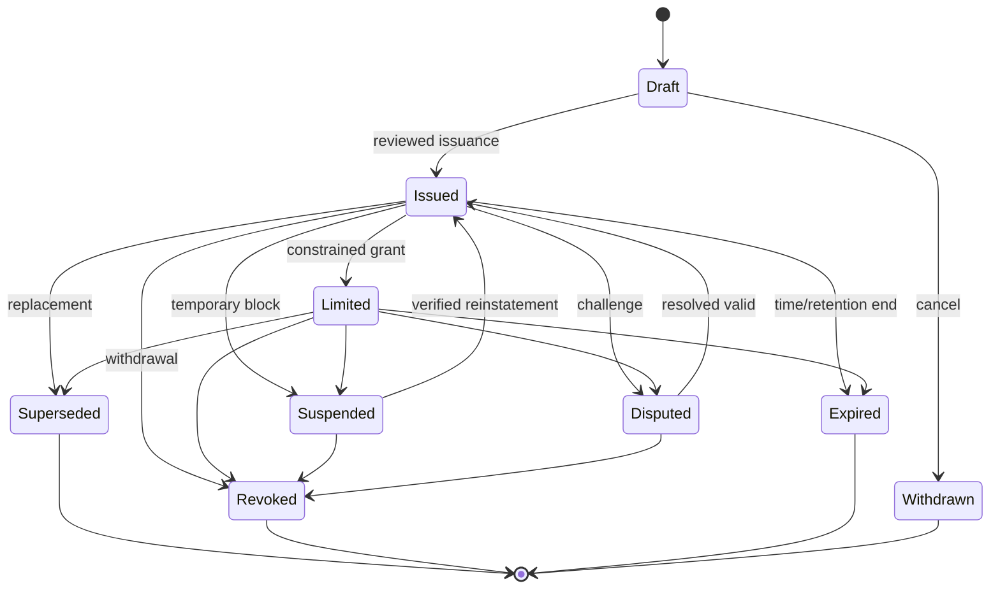
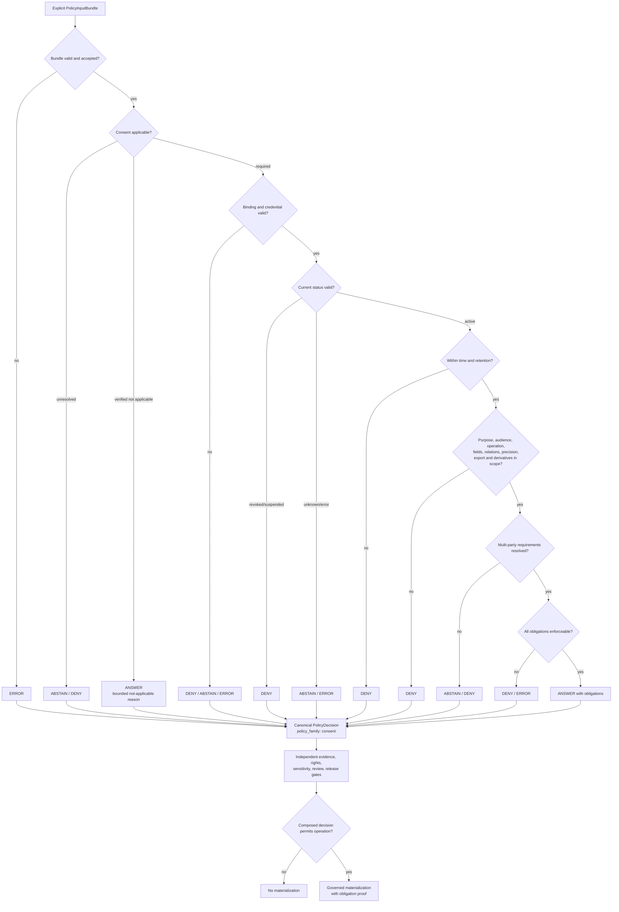

<!-- [KFM_META_BLOCK_V2]
doc_id: kfm://policy/consent
title: policy/consent/ — Consent Policy Boundary and Evaluation Contract
type: policy-readme; directory-readme; boundary-compact; consent-policy-boundary
version: v0.3
status: draft; repository-grounded; current-state-reconciled; documentation-only-parent; bounded-domain-fixture-profiles; proposed-domain-rego-scaffolds; fixture-first-ui-projection; evaluator-unbound; fail-closed; non-release; non-publication
owner: NEEDS VERIFICATION — .github/CODEOWNERS routes /policy/ to @bartytime4life; accepted consent stewardship, separation of duties, and independent approval controls remain unproved
created: 2026-06-15; initial empty path confirmed before v0.1
updated: 2026-08-13
policy_label: repository-facing; consent; cross-cutting-policy-candidate; purpose-bound; audience-bound; subject-bound; revocable; explicit-applicability; finite-outcomes; explicit-inputs; no-hidden-fetches; fail-closed; obligations; evidence-aware; rights-aware; sensitivity-aware; release-independent; cache-invalidation; replayable; correctable; no-reidentification; no-secrets
current_path: policy/consent/README.md
owning_root: policy/
canonical_relationship: PROPOSED shared consent-policy parent; accepted ADR-0029 confirms policy/ as the singular policy-source root, but exact family ownership between this parent lane and domain-nested consent rule homes remains unresolved
directory_governance: accepted ADR-0029 adopts Directory Rules v2; this same-path BOUNDARY_COMPACT README documents a lane inside policy/ and does not activate policy
evidence_snapshot:
  repository: bartytime4life/Kansas-Frontier-Matrix
  visibility: public
  base_ref: main
  base_commit: 1a61d3fbdc111bb3292086a30a53ccc50ed1bb8a
  target_baseline_blob: 5c56e988cbfa7b613fa39feec3c8f7f5bb44ce1b
  target_v0_1_blob: 1a98fadf0105908800a2dd57d5f66d62c1aaf970
  target_initial_empty_blob: 8b137891791fe96927ad78e64b0aad7bded08bdc
  policy_root_blob: 6c5021f9d92778581a4e9331a9dd6ddb7efc5e35
  people_child_readme_blob: 82bbe2795f96213f6c31c41a49542f1ff8a98f46
  people_dna_land_child_readme_blob: fa7ea7c95a473a7fd498053536ca0b72b17461f6
  people_dna_land_policy_root_blob: 571a4a6d5c8ba7cf6c1fa9fcdd63da88bc05eb2a
  dna_revocation_rego_blob: bb4400e4995bb2381bcb88782a3ff97ea272ebd0
  domain_consent_validator_rego_blob: 820daa2199be24f0f651404367d89576f96a825f
  consent_tokens_standard_blob: 954efe37bb02e88bae79008950fe6481c98ac58e
  policy_input_contract_blob: 545c352681dd0db0cd4d169a5d2f9c364356457c
  policy_input_schema_blob: b89db4b1730c61258441e0eed037276b910b1990
  policy_decision_contract_blob: ebfe97f98263e6309db6d2772cb2c5e548819650
  policy_decision_schema_blob: 1472d26a42c73f17545b4464a275412ffa1d098e
  consent_schema_index_blob: f3df7888166287e4a86c3696204b64799b995eab
  consent_grant_schema_blob: 90309ad224271ded87c4f66be68be1e67bcc199f
  consent_receipt_schema_blob: a178b759fa19922f8d6c6adf1ec13402f9784e75
  consent_overlay_contract_blob: d548e5eb93efe0b48accfa497de90dd924f753eb
  consent_overlay_schema_blob: dbb3d8cd6310ee4534c4180dafc288f941e82dfd
  consent_overlay_fixture_readme_blob: 36b755321d0a4d05a72476ba075993967fd446f0
  consent_overlay_validator_blob: b2ff0e5037de0f1c22486743ab5e20926c68474d
  consent_overlay_test_blob: 4f529582d961ed2b87df20a7f158e03d52eccbc8
  revocation_assessment_contract_blob: dbf1fdff6585f3db4213c17d8f18bfc81ecec04d
  revocation_assessment_schema_blob: e976211d1bf536b2aae7901842474dbcb1c3a484
  revocation_assessment_fixture_readme_blob: 17644ee9aca193682687cccdb0030a6146c77eae
  revocation_assessment_validator_blob: 76c7805428f253a7a711c7bc68a27e9cbcce40e7
  revocation_assessment_test_blob: bceeef36e5c4e456e6f8a3fc192cd1c349d34fb5
  people_dna_land_workflow_blob: bcf64c3e3b6653b9543489fc5a6031805ae3ef48
  revocation_assessment_workflow_blob: 49351ddcd05ab21f3d964ca35b86e007f5022138
  explorer_consent_card_readme_blob: e8e285c6f63f492b13d8cfa0a0eee2299613938d
  explorer_consent_projection_blob: 8f919bb124f21b432ccbceb0c4efc17ddd8b6ab1
  explorer_consent_card_test_blob: 9b48541a1a16188e82596286774dfce1b4cdf08f
  policy_runtime_metadata_blob: ebb6725ad9a00d77df06f779a603814027abe084
  policy_runtime_core_blob: e7e14cf39ae6919fbbc80f1b471de6b907292edb
  policy_test_workflow_blob: ac8f125e8a4d3634d86f66836d2aa2c0e3925e75
  directory_rules_blob: fd49a0b83e55cef52c1124281f093e263526898d
  adr_0029_blob: b01322ef64f8c2b1ecb41de7ef4685b97cfa2a62
  root_registry_blob: 024f668b5f0a9239bafa4f8b09e2afd86300ff8c
  codeowners_blob: dd2a84aa514d8ecd9208bc347f90f9a2ed37dd61
  contributing_blob: de5bf143e601e36a794e6e5442ae8f91c6f75aad
  pull_request_template_blob: c5624d7dbc2b83055421b4fb4542794bafa10bee
  open_pull_requests_inspected: "2706, 2707, 2708"
  open_overlapping_pull_requests_found: "0 at preflight"
  inventory_method: authenticated GitHub reads of the exact target history and complete direct tree, accepted directory governance, current consent doctrine and standards, parent and child policy lanes, domain Rego scaffolds, contracts, schemas, fixtures, validators, tests, workflows, UI projection, policy runtime, ownership routing, and pull-request controls
  direct_lane_files_confirmed:
    - policy/consent/README.md
    - policy/consent/people/.gitkeep
    - policy/consent/people/README.md
    - policy/consent/people-dna-land/.gitkeep
    - policy/consent/people-dna-land/README.md
  bounded_inventory_note: the complete direct lane is documentation and keepfiles only; no accepted parent consent rule, native parent policy test, bundle membership, evaluator binding, emitted consent PolicyDecision, governed producer, release integration, or production enforcement was established
related:
  - ../README.md
  - ./people/README.md
  - ./people-dna-land/README.md
  - ../domains/people-dna-land/README.md
  - ../domains/people-dna-land/consent/dna_consent_revocation.rego
  - ../domains/people-dna-land/consent_validator.rego
  - ../decision/README.md
  - ../bundles/README.md
  - ../../docs/domains/people-dna-land/CONSENT_MODEL.md
  - ../../docs/domains/people-dna-land/CONSENT.md
  - ../../docs/domains/people-dna-land/CONSENT_REGISTER.md
  - ../../docs/domains/people-dna-land/CANONICAL_PATHS.md
  - ../../docs/standards/CONSENT_TOKENS.md
  - ../../contracts/policy/policy_input_bundle.md
  - ../../contracts/policy/policy_decision.md
  - ../../schemas/contracts/v1/policy/policy_input_bundle.schema.json
  - ../../schemas/contracts/v1/policy/policy_decision.schema.json
  - ../../schemas/contracts/v1/consent/README.md
  - ../../schemas/contracts/v1/runtime/consent_grant.schema.json
  - ../../schemas/governance/consent_receipt.schema.json
  - ../../contracts/domains/people-dna-land/consented_genealogy_overlay.md
  - ../../contracts/domains/people-dna-land/consent_revocation_propagation_assessment.md
  - ../../fixtures/domains/people-dna-land/consent_overlay/README.md
  - ../../fixtures/domains/people-dna-land/consent_revocation_propagation/README.md
  - ../../tools/validators/domains/people-dna-land/validate_consent_overlay.py
  - ../../tools/validators/domains/people-dna-land/validate_consent_revocation_propagation_assessment.py
  - ../../tests/domains/people-dna-land/consent/revocation/README.md
  - ../../apps/explorer-web/src/features/consent_card/README.md
  - ../../apps/explorer-web/src/adapters/ConsentCardProjection.ts
  - ../../fixtures/ui/consent_card_projection/README.md
  - ../../packages/policy-runtime/README.md
  - ../../docs/doctrine/directory-rules.md
  - ../../docs/adr/ADR-0029-adopt-directory-governance-standard-v2.md
  - ../../control_plane/root_registry.yaml
  - ../../.github/workflows/domain-people-dna-land.yml
  - ../../.github/workflows/consent-revocation-propagation.yml
  - ../../.github/workflows/policy-test.yml
  - ../../.github/CODEOWNERS
  - ../../CONTRIBUTING.md
  - ../../.github/PULL_REQUEST_TEMPLATE.md
tags: [kfm, policy, consent, privacy, people, people-dna-land, living-person, genealogy, dna, genomics, revocation, applicability, synthetic-fixtures, ui-projection, policy-input-bundle, policy-decision, obligations, fail-closed, governed-api, rollback]
truth_posture: CONFIRMED substantive v0.2 baseline, exact five-file documentation-only direct lane, accepted ADR-0029 singular policy root, two domain consent Rego scaffolds with no native consent-policy evaluation, draft consent-token standard, placeholder general consent schemas, bounded closed People-DNA-Land overlay and revocation-assessment profiles with validators, synthetic fixtures, tests, and executable read-only workflows, fixture-first Explorer consent-card projection with tests, closed PROPOSED PolicyDecision outcomes including consent, permissive PolicyInputBundle schema, placeholder policy runtime, and static policy readiness workflow / PROPOSED shared parent semantics, family-lane convergence, applicability profile, reason and obligation registries, engine-result normalization, composer, accepted executable rules, bundle/evaluator binding, governed producer integration, receipt flow, dependency invalidation, and activation / CONFLICTED current top-level parent versus domain-nested executable-rule topology, duplicate consent doctrine carriers, draft token vocabulary versus absent accepted machine profile, and revocation assessment SATISFIED versus canonical PolicyDecision ANSWER / UNKNOWN production consent issuer or verifier, live status service, actual cleanup, active bundle, runtime enforcement, required-check significance, independent approval, release integration, and publication safety / NEEDS VERIFICATION accepted owners, topology disposition, schema hardening, multi-party and representative rules, retention, invalidation SLOs, incident response, and rollback automation
notes:
  - "v0.3 reconciles the existing v0.2 doctrine with current main and preserves every substantive consent boundary."
  - "The bounded People-DNA-Land profiles validate synthetic declarations only; they do not issue consent, authenticate people, evaluate the parent policy, execute cleanup, approve release, or publish."
  - "The Explorer card records a viewer-local display choice; it does not grant, revoke, or prove a subject's consent."
  - "This revision changes only policy/consent/README.md and creates no executable rule, contract, schema, fixture, validator, test, workflow, UI behavior, decision, receipt, release object, deployment, or publication state."
[/KFM_META_BLOCK_V2] -->


<a id="top"></a>

# Consent Policy Boundary and Evaluation Contract

`policy/consent/`

> **One-line purpose.** Define the proposed shared, fail-closed consent-policy boundary for exact operation, purpose, audience, subject, scope, time, derivative, and revocation evaluation—without issuing consent, proving identity or evidence, approving release, or publishing.

[](#status-and-evidence)
[](#current-directory-map)
[](#validation-and-test-matrix)
[](#status-and-evidence)
[](#decision-vocabulary-and-normalization)
[](#authority-level)

**Quick navigation:** [Purpose](#purpose) · [Authority](#authority-level) · [Status](#status-and-evidence) · [Scope](#scope-and-bounded-context) · [Invariants](#keystone-invariants) · [Repo fit](#repository-fit-and-directory-rules-basis) · [Child lanes](#child-lane-contract) · [Belongs](#what-belongs-here) · [Exclusions](#what-does-not-belong-here) · [Inputs](#explicit-policy-input) · [Applicability](#consent-applicability) · [Decisions](#decision-vocabulary-and-normalization) · [Lifecycle](#consent-lifecycle) · [Evaluation](#evaluation-order) · [Composition](#independent-policy-family-composition) · [Revocation](#revocation-correction-and-cache-invalidation) · [Audit](#audit-replay-and-data-minimization) · [Surfaces](#governed-api-ui-map-ai-and-export-boundary) · [Threats](#threat-model) · [Validation](#validation-and-test-matrix) · [Implementation](#smallest-sound-implementation-sequence) · [Done](#definition-of-done) · [Open](#open-verification-register) · [Evidence](#evidence-ledger) · [Changelog](#changelog) · [Rollback](#rollback-correction-and-supersession)

> [!IMPORTANT]
> **Safe current conclusion:** the direct `policy/consent/` lane is documentation-only. KFM separately has two executable, synthetic People–DNA-Land fixture profiles for a consent-safe overlay candidate and consent-revocation propagation assessment, plus a fixture-first Explorer consent-card projection. Those bounded implementations explicitly carry no consent, identity, evidence, policy, cleanup, release, or publication authority and do not activate this parent lane.

> [!CAUTION]
> **Consent is a constraint, not publication permission.** A consent result can address only the exact evaluated operation, audience, purpose, subject or holder binding, field or relation, precision, export, temporal window, and derivative. Evidence, source role, rights, sensitivity, review, release, correction, and rollback remain independent gates.

> [!WARNING]
> The domain-nested files [`dna_consent_revocation.rego`](../domains/people-dna-land/consent/dna_consent_revocation.rego) and [`consent_validator.rego`](../domains/people-dna-land/consent_validator.rego) are proposed scaffolds. The former only declares `default allow := false`; the latter only declares `default deny := false` with a commented example. Neither is an accepted parent rule, a complete fail-closed evaluator, bundle activation, `PolicyDecision`, or implicit permission.

> [!NOTE]
> The Explorer consent card records whether one viewer wants a layer shown in the current browser session. It does not issue, grant, alter, revoke, or prove a subject's consent to inclusion.

---

## Purpose

This README defines the shared consent-policy boundary for KFM.

It is intended to keep consent evaluation:

- explicit rather than inferred;
- operation-specific;
- purpose-bound;
- audience-bound;
- subject-, holder-, or authorized-representative-bound;
- field-, relation-, derivative-, precision-, and export-specific;
- time-bounded;
- revocation-, suspension-, dispute-, correction-, and supersession-aware;
- finite in outcome;
- obligation-bearing;
- auditable and replayable;
- privacy-preserving;
- correctable and reversible;
- fail-closed.

The parent lane exists to define common semantics that child consent lanes can specialize. It must prevent any consent record, access grant, public record, data-license term, source availability, prior release, model output, or human assumption from being misused as:

- a general publication license;
- a substitute for a `PolicyInputBundle`;
- a substitute for a `PolicyDecision`;
- proof of identity, living status, relationship, occupancy, ownership, title, or boundary;
- source-rights clearance;
- a sensitivity downgrade;
- release approval;
- evidence closure;
- a waiver of citation;
- permission to reconstruct revoked, redacted, generalized, or withheld information;
- permission for secondary use outside the evaluated purpose;
- permission to bypass governed APIs;
- permission to silently reuse a stale decision.

[Back to top](#top)

---

## Authority level

`policy/` is the accepted singular root for normative decision rules under [ADR-0029](../../docs/adr/ADR-0029-adopt-directory-governance-standard-v2.md) and Directory Rules v2. This README is therefore correctly located inside the policy root, but the direct lane remains documentation-only.

The parent lane becomes policy-authoritative only after its shared rule semantics, family topology, ownership, independent review, fixtures, native tests, bundle membership, evaluator binding, activation, and rollback controls are accepted. Repository presence, a README, a Rego default, a validator result, a green workflow, a UI projection, or a generated receipt does not activate it.

| Concern | Current authority in this lane |
|---|---|
| Shared consent invariants | **PROPOSED parent semantics.** Preserved here; no accepted executable parent rule was established. |
| Consent applicability semantics | **PROPOSED.** No accepted machine profile distinguishes required, verified-not-applicable, and unresolved states. |
| Parent/child inheritance | **PROPOSED.** Child lanes may tighten controls; accepted executable precedence is not established. |
| Domain-specific consent conditions | Domain policy/contracts/validators may specialize bounded contexts; they do not inherit parent authority merely by reference. |
| Policy input meaning | None. [`PolicyInputBundle`](../../contracts/policy/policy_input_bundle.md) owns semantic meaning; its current schema remains permissive. |
| Policy decision meaning | None. [`PolicyDecision`](../../contracts/policy/policy_decision.md) owns `ANSWER | ABSTAIN | DENY | ERROR`. |
| Machine shape | None. `schemas/` owns accepted shapes; the general consent shapes inspected here remain placeholders. |
| Runtime execution | None. [`packages/policy-runtime/`](../../packages/policy-runtime/README.md) remains a `0.0.0` metadata stub with a comment-only core. |
| Consent issuance or holder proof | None. No accepted issuer, verifier, representative-authority service, or credential binding was established. |
| Evidence, rights, and sensitivity | None. Independent authorities and policy families retain their own provenance and decisions. |
| Review and release | None. Review artifacts and `release/` retain separate authority. |
| Receipts and proofs | None. A fixture result or authoring receipt is not a consent decision, cleanup proof, or approval. |
| Public API, UI, map, AI, and export | None. Governed producers must supply already-resolved, released, policy-safe projections and enforce obligations. |

A consent rule may block or constrain an operation. It cannot create identity truth, relationship truth, evidence closure, legal sufficiency, rights clearance, review approval, release approval, or publication.

[Back to top](#top)

---

## Status and evidence

Evidence snapshot: `main@1a61d3fbdc111bb3292086a30a53ccc50ed1bb8a`; target v0.2 baseline blob `5c56e988cbfa7b613fa39feec3c8f7f5bb44ce1b`.

### Current repository state

| Surface | Current evidence | Safe conclusion |
|---|---|---|
| `policy/consent/README.md` | **CONFIRMED substantive v0.2 baseline** | v0.3 reconciles the existing doctrine in place; it creates no executable behavior. |
| Direct parent lane | **CONFIRMED five tracked files: three READMEs and two `.gitkeep` files** | No direct Rego, bundle manifest, fixture, test, evaluator configuration, decision, or release record exists in this lane. |
| Directory governance | **CONFIRMED accepted ADR-0029 / Directory Rules v2** | `policy/` is the singular policy-source root; this lane is a BOUNDARY_COMPACT child, not a new repository root. |
| Consent-family topology | **CONFLICTED / NEEDS DECISION** | The repository has this cross-cutting parent and domain-nested rule scaffolds; older domain path doctrine prefers the nested form. Accepted root placement does not settle family ownership or activation. |
| Child READMEs | **CONFIRMED v0.2, documentation-only** | `people/` and `people-dna-land/` preserve proposed specializations; both predate current bounded domain implementation evidence. |
| Domain consent Rego | **CONFIRMED two proposed scaffolds** | `dna_consent_revocation.rego` defaults `allow` to false; `consent_validator.rego` defaults `deny` to false and has no operative rule. Neither has a native consent-policy test or accepted bundle/evaluator binding. |
| Consent token standard | **CONFIRMED draft documentation** | `CONSENT_TOKENS.md` documents JWT/GA4GH-style wire forms and claims, but several names and homes remain proposed; no accepted paired token contract/schema/issuer/verifier/runtime binding was established. |
| General consent shapes | **CONFIRMED placeholders** | `schemas/contracts/v1/consent/` is index-only; `consent_grant` and `consent_receipt` schemas are open, property-empty proposed scaffolds. |
| `PolicyInputBundle` | **CONFIRMED semantic contract / permissive proposed schema** | The schema requires only `id` and allows additional properties; rich consent context is not machine-enforced. |
| `PolicyDecision` | **CONFIRMED closed proposed shape** | Required outcomes are `ANSWER | ABSTAIN | DENY | ERROR` and `policy_family` includes `consent`; no consent evaluator was established. |
| People–DNA–Land consent-overlay profile | **CONFIRMED bounded executable fixture profile** | Closed schema, synthetic fixtures, validator, and tests exercise active/expired/revoked/scope/privacy/non-release cases. The contract is proposed, restricted, fixture-only, and not released. |
| Revocation-propagation assessment | **CONFIRMED bounded executable fixture profile** | Closed inactive schema, synthetic cases, validator, tests, and focused workflow check seven declared surfaces. They do not execute deletion, purge, invalidation, notification, or release. |
| People–DNA–Land workflow | **CONFIRMED executable read-only definition** | It runs both bounded validators and test modules with explicit no-network and authority holds; broader policy/runtime/proof/release capability remains held. |
| Policy-test workflow | **CONFIRMED static readiness guard plus one separate release-gate Rego lane** | It inventories policy files and validates PolicyDecision shape evidence but performs no general OPA evaluation and emits no consent PolicyDecision. |
| Explorer consent card | **CONFIRMED fixture-first, not production-wired** | The strict app-local projection and tests preserve finite outcomes and viewer/subject distinction; the card changes only local display preference. |
| Policy runtime | **CONFIRMED greenfield placeholder** | Package version is `0.0.0` and `core.py` is comment-only; no functional consent evaluator or consumer import was established. |
| Production consent enforcement | **NOT ESTABLISHED** | No accepted parent rules, active bundle, evaluator binding, live issuer/verifier, current-status service, governed producer, dependency cleanup, release integration, or production operation was verified. |
| Ownership | **PARTIAL / NEEDS VERIFICATION** | CODEOWNERS routes `/policy/` to `@bartytime4life`; consent stewardship, separation of duties, and independent approval remain unproved. |
| Current CI results and required-check status | **NEEDS VERIFICATION / UNKNOWN** | Exact-head runs can be observed on the resulting pull request; branch-protection and production significance remain separate. |

### Current directory map

Verified from the pinned complete recursive tree and direct reads:

```text
policy/consent/
├── README.md
├── people/
│   ├── .gitkeep
│   └── README.md
└── people-dna-land/
    ├── .gitkeep
    └── README.md
```

The executable synthetic profiles, validators, tests, workflows, UI projection, and proposed domain Rego scaffolds live in their own responsibility roots outside this direct parent lane.

### Evidence limits and truth labels

- **CONFIRMED** — verified from the pinned repository state.
- **PROPOSED** — designed or documented, but not established as accepted active behavior.
- **PARTIAL** — a bounded implementation or routing surface exists without complete authority or control.
- **UNKNOWN** — available evidence is insufficient for a current-state claim.
- **NEEDS VERIFICATION** — a concrete repository, runtime, policy, ownership, review, release, or ruleset check is required.
- **CONFLICTED** — inspected authorities, paths, or vocabularies disagree and must remain visible.
- **NOT ESTABLISHED** — inspected evidence does not support treating the capability as active.

A bounded non-observation is not proof of permanent absence. Later branches, bundles, rulesets, services, caches, releases, or deployments must be verified at their own exact revisions.

### Evidence boundary

This README must not claim:

- legal sufficiency or valid real-world consent;
- identity, holder, subject, representative, or relationship truth;
- an accepted token/credential implementation merely because a draft standard exists;
- parent-policy activation from domain Rego defaults or fixture validators;
- actual revocation, deletion, purge, cache invalidation, notification, or recall from a synthetic propagation assessment;
- an emitted consent `PolicyDecision`, evaluation receipt, cleanup proof, review approval, release, or publication;
- production wiring from a fixture-first UI component;
- a successful workflow until its exact-head run is observed;
- required-check or branch-protection significance without ruleset evidence.

[Back to top](#top)

---

## Scope and bounded context

### In scope

This parent lane may define shared consent behavior for:

- render, answer, review, query, join, export, download, derivative, training, promotion-adjacent, correction, and rollback operations;
- consent applicability;
- grant, holder, subject, representative, purpose, audience, scope, retention, expiry, suspension, dispute, revocation, and supersession checks;
- finite engine-result normalization into canonical `PolicyDecision`;
- shared reason-code and obligation semantics;
- child-lane inheritance and precedence;
- decision freshness and replay;
- consent-decision receipts and supersession expectations;
- revocation-triggered derivative and cache invalidation;
- safe public explanations;
- governed API and AI boundaries;
- no-hidden-fetch behavior.

### Out of scope

This lane does not own:

- legal advice or jurisdiction-specific legal conclusions;
- identity proofing, authentication, or authorization credentials;
- subject or holder identity truth;
- person, relationship, land, title, parcel, or DNA truth;
- source acquisition;
- raw sensitive data storage;
- source licensing or rights determinations;
- sensitivity-tier assignment;
- schema definitions;
- application code;
- release approval;
- publication;
- correction adjudication;
- lifecycle storage;
- secret management;
- model training infrastructure;
- public UI design.

### The independent-gate rule

```text
consent decision       != rights decision
consent decision       != sensitivity decision
consent decision       != evidence closure
consent decision       != review approval
consent decision       != release approval
consent decision       != publication
consent ANSWER          != unrestricted use
```

All required gates must remain separately inspectable. A combined caller may compose outcomes, but it must preserve the originating policy family, reasons, obligations, timestamps, and decision references.

[Back to top](#top)

---

## Keystone invariants

1. **Consent does not publish.** A valid consent result never substitutes for release governance.
2. **Consent is exact-scope only.** No decision extends beyond the evaluated operation, purpose, audience, subject binding, fields, relations, precision, export, retention, and time.
3. **Applicability is explicit.** Missing consent and verified non-applicability are different states.
4. **Unknown fails closed.** Missing or unverifiable support cannot become implicit permission.
5. **Revocation is render-time relevant.** A stale grant or stale decision cannot authorize a consequential operation.
6. **Obligations are mandatory.** A caller that cannot enforce an obligation must not proceed.
7. **No hidden fetches.** The evaluator uses an explicit `PolicyInputBundle`; it does not silently retrieve missing facts.
8. **Canonical outcomes are finite.** Governed callers consume `ANSWER | ABSTAIN | DENY | ERROR`.
9. **Engine vocabulary is not the public contract.** `ALLOW`, `RESTRICT`, `LIMITED`, `HOLD`, or equivalent internal results require normalization.
10. **Child lanes may tighten, not weaken.** A specialization cannot relax parent invariants or another applicable stronger restriction.
11. **Consent is not transferable by inference.** Consent by one person does not authorize exposure of another person, relation, household, family, community, or group.
12. **Public availability is not consent.** A public record, website, obituary, tree, directory, social post, map, or prior release is not a consent grant.
13. **Evidence outranks assertion.** A consent object cannot prove identity, relationships, living status, or claim truth.
14. **No reidentification.** Redacted, generalized, aggregated, or withheld information must not be reconstructed through joins, search, AI, or repeated queries.
15. **Audit without leakage.** Decision records must remain replayable without carrying raw sensitive identifiers or protected facts.
16. **Correction and rollback remain available.** Consent changes must propagate through decisions, derivatives, caches, and release/correction records.
17. **Repository presence is not activation.** A README, schema, scaffold, fixture, validator, workflow, green result, projection, or receipt is not proof of parent-policy enforcement.

[Back to top](#top)

---

## Repository fit and Directory Rules basis

### Accepted owning root

[Directory Rules v2](../../docs/doctrine/directory-rules.md), adopted by [ADR-0029](../../docs/adr/ADR-0029-adopt-directory-governance-standard-v2.md), assigns normative allow, deny, hold, restrict, and abstain rules to the singular `policy/` root. This lane is therefore correctly located inside the policy responsibility root.

That accepted root placement does **not** decide which consent family lane owns executable shared versus domain-specific rules, activate a bundle, assign subject-matter stewardship, or convert this README into policy code.

### Responsibility matrix

| Concern | Owning surface | Relationship to this README |
|---|---|---|
| Shared consent-policy source | accepted lane under `policy/` | Proposed responsibility of this parent; executable topology remains unresolved. |
| Domain consent specialization | accepted domain policy lane | May tighten a shared rule; cannot silently create parallel or broader authority. |
| Human-facing consent doctrine and standards | `docs/` | Explain models, token vocabulary, governance, and open questions; not execution proof. |
| Policy input meaning | [`contracts/policy/`](../../contracts/policy/policy_input_bundle.md) | Owns `PolicyInputBundle` semantics. |
| Policy decision meaning | [`contracts/policy/`](../../contracts/policy/policy_decision.md) | Owns `PolicyDecision` and finite result meaning. |
| Machine shape | `schemas/` | Owns JSON Schema and compatibility; placeholder shapes do not enforce rich semantics. |
| Bounded domain candidate meaning | [domain contracts](../../contracts/domains/people-dna-land/consented_genealogy_overlay.md) | Define fixture-only object meaning; no parent-policy authority. |
| Validators and tests | `tools/`, `tests/`, `fixtures/` | Prove bounded synthetic behavior; do not issue consent or approve release. |
| Runtime execution | `packages/` and governed applications | Execute accepted rules and obligations; cannot redefine policy semantics. |
| Viewer-local UI behavior | [Explorer consent card](../../apps/explorer-web/src/features/consent_card/README.md) | Consumes a public-safe projection; cannot evaluate or change subject consent. |
| Receipts and proofs | accepted `data/receipts/` and `data/proofs/` profiles | Record bounded activity; do not become consent, policy, cleanup, or release authority. |
| Review and release | review records and `release/` | Independent approval, correction, withdrawal, rollback, and publication authority. |
| Public access | governed application/API surfaces | Consume only released, policy-filtered projections through the trust membrane. |

### BOUNDARY_COMPACT responsibility signature

| Field | Current boundary |
|---|---|
| Purpose and parent | Document the proposed shared consent-policy family under the singular `policy/` root. |
| Local owner | **NEEDS VERIFICATION.** CODEOWNERS routes `/policy/` to `@bartytime4life`; consent stewardship and independent approval are not proved. |
| Belongs here | Shared exact-scope consent invariants, applicability posture, parent/child tightening rules, finite normalization expectations, safe reason/obligation semantics, and links to accepted rules, fixtures, tests, bundles, and consumers when they exist. |
| Prohibited here | Contract/schema authority, credentials, raw identifiers, real people or DNA payloads, hidden lookup, mutable status stores, evidence, receipts, proofs, review records, release records, deployment state, or publication. |
| Inputs | Explicit operation, purpose, audience, subject/holder binding, consent reference and current status, scope, time, precision, derivative/export posture, independent gate refs, bundle/evaluator identity, and correction lineage. |
| Outputs | Future normalized `PolicyDecision` plus enforceable obligations through accepted contracts; this README currently emits nothing. |
| Exposure | Repository-facing governance documentation. Consent credentials, living-person context, raw DNA, precise locations, and protected diagnostics remain outside public surfaces. |
| Mutation and retention | None. Evaluation should be deterministic over explicit input; persistence belongs to accepted decision, receipt, review, status, proof, or release lanes. |
| Validation | Native policy fixtures/tests, schema and contract compatibility, bundle/evaluator parity, obligation enforcement, status freshness, derivative invalidation, governed consumer tests, and release/correction evidence. Only bounded domain and UI fixture layers are established. |
| Related authority | Contracts define meaning; schemas define shape; policy/decision normalizes accepted outcomes; bundles package reviewed policy; runtime evaluates; release owns publication-facing decisions. |
| Status and open work | Documentation is current-state reconciled. Family topology, ownership, token/profile acceptance, general schemas, rules, bundle/evaluator binding, consumers, receipts, actual cleanup, and release enforcement remain open. |

### Placement and convergence status

The prior v0.2 README correctly surfaced a real conflict, but current governance narrows it:

- **Resolved:** `policy/` is an accepted canonical responsibility root. `policy/consent/` is a lane inside that root, not a second repository root.
- **Still conflicted:** current repository topology contains this cross-cutting parent plus `policy/domains/people-dna-land/` scaffolds, while the older `CANONICAL_PATHS.md` draft prefers domain nesting pending a decision.
- **Not implied:** accepted root placement does not make either family layout authoritative, nor does a `default allow := false` or `default deny := false` statement activate a policy.
- **Required:** choose one authoritative executable source topology, record shared-versus-domain ownership and migration, update stale doctrine, prevent duplicate active rule IDs/bundles, and preserve rollback.

### Document authority and supersession

- v0.3 supersedes v0.2 at this same path and preserves its substantive consent doctrine.
- v0.2 superseded v0.1; the initial empty blob and v0.1 remain provenance, not normal rollback targets.
- Current contracts, schemas, accepted rules, native tests, bundle records, runtime decisions, receipts, proofs, reviews, and release records outrank this README for implementation claims.
- CODEOWNERS is review routing, not proof of consent stewardship, policy acceptance, independent approval, or production enforcement.
- Conflicts must remain visible in an accepted ADR, register, or migration record; prose must not silently normalize them.

[Back to top](#top)

---

## Child-lane contract

The parent lane documents proposed shared consent semantics. Child and domain lanes may define stricter bounded-context rules only after their own authority, scope, fixtures, tests, bundle membership, evaluator binding, and activation are accepted.

### Current child and domain surfaces

| Surface | Intended specialization | Current maturity and authority limit |
|---|---|---|
| `policy/consent/people/` | People and living-person attributes, relations, events, genealogy-adjacent claims, and collateral-person protection. | README-only v0.2 direct child; no accepted executable people-consent rule was established. |
| `policy/consent/people-dna-land/` | Restricted People / Genealogy / DNA / Land operations, derivatives, joins, and export controls. | README-only v0.2 direct child; current bounded implementation evidence lives elsewhere and does not activate this child. |
| `policy/domains/people-dna-land/consent/dna_consent_revocation.rego` | Domain revocation rule candidate. | Proposed three-line scaffold with `default allow := false`; no native test, bundle, evaluator, or consumer binding. |
| `policy/domains/people-dna-land/consent_validator.rego` | Domain validator rule candidate. | Proposed stub with `default deny := false` and commented example; absence of a deny reason is not permission. |
| People–DNA–Land overlay and revocation-assessment profiles | Synthetic, restricted fixture validation of narrow domain declarations. | Executable validators/tests and workflows; no parent-policy, real-consent, cleanup, release, or publication authority. |

### Proposed inheritance rules

1. A child inherits every accepted parent invariant.
2. A child may add stricter applicability, binding, scope, revocation, review, precision, export, retention, or obligation rules.
3. A child must not broaden a parent permission or weaken a denial.
4. A child must not treat `ANSWER`, `SATISFIED`, a clean finding set, or a UI `ANSWER` projection as publication.
5. A child must normalize to the accepted canonical decision contract before a governed caller consumes it.
6. A child must preserve rule, bundle, evaluator, reason, obligation, and input provenance.
7. When more than one lane applies, the caller evaluates all applicable lanes; it must not choose the least restrictive result.
8. Conflicting or ambiguous applicability fails closed as `ABSTAIN`, `DENY`, or `ERROR` according to the accepted cause mapping.
9. A README, scaffold, fixture profile, validator, workflow, or generated receipt cannot activate policy.
10. Parallel executable rule homes, duplicate rule IDs, or conflicting bundle membership are prohibited without an accepted migration/supersession record.

### Strongest-safe composition

For accepted, independently evaluated consent rules:

- machinery failure or incompatible obligations remains `ERROR`;
- any applicable policy prohibition remains `DENY`;
- unresolved required support remains `ABSTAIN`;
- `ANSWER` is possible only when every required rule answers and every obligation is enforceable;
- allowed scopes intersect; obligations union unless they conflict;
- any conflict or unsupported obligation fails closed and preserves review/correction context.

This order is **PROPOSED** until the canonical composer and cause mapping are accepted and tested. The bounded revocation assessment's `SATISFIED` value is dimension-local and must not be silently treated as `PolicyDecision.outcome = ANSWER`.

[Back to top](#top)

---

## What belongs here

If accepted as the shared consent source lane, it may hold:

- shared consent-policy documentation;
- reviewed cross-cutting consent rule modules in the single accepted source topology;
- references to immutable bundle manifests owned by `policy/bundles/`;
- consent applicability rules;
- engine-to-canonical outcome normalization rules;
- shared reason-code definitions;
- shared obligation definitions;
- child-lane inheritance/precedence rules;
- revocation, suspension, expiry, dispute, and supersession policy;
- consent decision freshness rules;
- safe public explanation policy;
- policy bundle metadata and compatibility notes;
- references to validators, fixtures, tests, receipts, and runtime integration;
- migration and rollback documentation for policy changes.

Every trust-bearing file must identify:

- authority and owner;
- status and version;
- input contract;
- output contract;
- policy family;
- default posture;
- reason-code and obligation semantics;
- review burden;
- validation coverage;
- correction and rollback path;
- activation state.

[Back to top](#top)

---

## What does not belong here

| Does not belong | Correct responsibility |
|---|---|
| Raw consent records, identities, DNA values, private relationships, or living-person source data | Governed `data/` lifecycle and restricted stores |
| Consent semantic contracts | `contracts/` |
| JSON Schema | `schemas/` |
| Runtime helper/library code | `packages/` |
| API or UI implementation | `apps/` |
| Tests and fixtures | `tests/`, `fixtures/` |
| Evidence bundles or source descriptors | Evidence/source responsibility roots |
| Consent receipts or proofs | Accepted `data/receipts/` or `data/proofs/` homes |
| Release manifests, correction notices, rollback cards | `release/` |
| Rights/licensing policy | Accepted rights policy lane |
| Sensitivity/geoprivacy policy | `policy/sensitivity/` |
| Credentials, private keys, secrets, raw tokens | Secret manager or deployment security boundary |
| Legal advice | Outside repository policy documentation |
| Generated claims or AI summaries presented as authority | Governed AI/runtime surfaces backed by evidence |

[Back to top](#top)

---

## Explicit policy input

The evaluator must consume an explicit `PolicyInputBundle` or an accepted consent-specific profile of that contract.

The current paired schema requires only `id` and permits additional properties. Therefore the fields below are **PROPOSED semantic requirements**, not machine-enforced facts.

### Shared consent input profile

| Input family | Minimum semantic content | Fail-closed condition |
|---|---|---|
| Bundle identity | bundle id, version, optional deterministic `spec_hash`, canonicalization profile | Missing or mutable identity |
| Requested operation | render, answer, review, query, join, export, download, derive, train, correct, rollback, or other explicit operation | Missing or generic operation |
| Audience | public, restricted reviewer, steward, named partner, internal service, governed AI, export recipient | Unknown audience |
| Policy selection | `policy_family: consent`, parent/child rule family, bundle id/hash/version, evaluator profile | Missing, stale, or ambiguous bundle |
| Applicability | required, verified not applicable, unresolved; basis/evidence refs | Applicability inferred from absence |
| Subject/holder binding | minimized subject ref, holder ref, representative ref and authority basis where applicable | Binding mismatch or unverifiable authority |
| Consent record | grant/sidecar/receipt ref, issuer, issue time, validity window, status pointer | Missing when required, invalid, or unresolvable |
| Purpose and scope | requested purpose, allowed purpose, operation scope, field/relation/derivative scope | Requested use outside scope |
| Precision and export | coordinate/detail precision, generalization/redaction state, export/download/training flags | Precision or secondary use not covered |
| Time | evaluation time, not-before, expiry, retention deadline, decision freshness window | Missing, stale, expired, or not yet valid |
| Revocation state | status ref, checked-at time, suspended/revoked/disputed/superseded state | Status unavailable or stale |
| Object context | object, claim, dataset, layer, release, relation, derivative, or cache dependency refs | Raw sensitive values embedded or target ambiguous |
| Evidence context | EvidenceRef/EvidenceBundle refs and resolver status needed for binding/applicability | Missing support for identity/binding/applicability |
| Rights context | source rights and redistribution/export posture | Unknown rights when operation depends on them |
| Sensitivity context | sensitivity labels, living-person/DNA/private-join flags, redaction/generalization state | Unknown sensitivity |
| Review context | review state, required reviewer, ReviewRecord refs | Required review missing |
| Release context | candidate/released/withdrawn/superseded state, ReleaseManifest and rollback refs | Caller treats consent as release |
| Prior decisions | prior PolicyDecision refs, supersession, stale/degraded flags | Stale decision reused as current |
| Dependency context | derivative, tile, cache, index, export, model, or summary dependencies | Revocation impact cannot be bounded |
| Audit context | request id, actor/service ref, correlation id, safe logging profile | Raw sensitive data would enter logs |

### No-hidden-fetch rule

A consent evaluator must not silently fetch missing facts from:

- RAW or canonical stores;
- source systems;
- browser/session state;
- UI state;
- vector indexes;
- search history;
- operator memory;
- AI prompts or generated text;
- stale cached decisions;
- undocumented external services.

A governed fetch must produce a new explicit input bundle or a separately traceable receipt. Otherwise the evaluator returns `ABSTAIN`, `DENY`, or `ERROR` according to the failure.

[Back to top](#top)

---

## Consent applicability

Consent applicability must be evaluated explicitly before grant validity.

### Proposed applicability states

| State | Meaning | Canonical posture |
|---|---|---|
| `required` | Policy says this operation requires consent. | Continue to grant/status/scope evaluation. |
| `verified_not_applicable` | An accepted rule and evidence establish that consent is not required for this exact operation. | Consent family may return `ANSWER` with a bounded not-applicable reason; other gates still apply. |
| `unresolved` | Available context cannot establish whether consent is required. | `ABSTAIN` or `DENY`; never infer not-applicable. |
| `error` | Applicability evaluator, shape, integrity, or bundle selection failed. | `ERROR`; fail closed. |

### Applicability must not be inferred from

- absence of a consent record;
- public availability;
- age of a source;
- a record being historical;
- a person being presumed deceased;
- a family member’s consent;
- a source provider’s terms;
- a previous release;
- a prior `ANSWER`;
- a reviewer’s informal approval;
- a model-generated classification;
- the caller being internal;
- the data being “only metadata”;
- a generalized output without a verified transform receipt.

### Required distinction

```text
consent required + no valid grant          -> DENY or ABSTAIN
consent applicability unresolved           -> ABSTAIN or DENY
consent verified not applicable            -> ANSWER for consent family only
consent valid and in scope                  -> ANSWER with obligations
```

A `verified_not_applicable` result must carry the accepted applicability rule, relevant evidence or policy references, evaluator version, and evaluation time. It is not a permanent exemption.

[Back to top](#top)

---

## Decision vocabulary and normalization

The repository-present `PolicyDecision` schema requires:

```text
ANSWER | ABSTAIN | DENY | ERROR
```

The parent consent lane must not expose `ALLOW`, `RESTRICT`, `LIMITED`, `HOLD`, or `ACCEPTED` as canonical `PolicyDecision.outcome` values.

### Proposed normalization table

| Engine-native result | Canonical `PolicyDecision.outcome` | Required behavior |
|---|---|---|
| `ALLOW` | `ANSWER` | Only for the evaluated consent gate; propagate all obligations. |
| `RESTRICT` / `LIMITED` | `ANSWER` | Only if every restriction is represented as an enforceable obligation. |
| `RESTRICT` / `LIMITED` with unsupported obligation | `DENY`, `ABSTAIN`, or `ERROR` | Choose based on whether policy blocks, support is unresolved, or enforcement failed. |
| `HOLD` / `REVIEW` | `ABSTAIN` | Add `require_steward_review`; do not materialize publicly. |
| `DENY` | `DENY` | Block the operation; provide safe reason codes. |
| `ABSTAIN` | `ABSTAIN` | Do not manufacture support or infer permission. |
| `ERROR` | `ERROR` | Fail closed; preserve error provenance. |
| unknown value | `ERROR` | Reject unrecognized engine output. |

### Canonical decision requirements

Every consent `PolicyDecision` must include:

- unique `decision_id`;
- `outcome`;
- `policy_family: consent`;
- reasons;
- obligations;
- `evaluated_at`.

The current canonical schema does not include input-bundle ref, bundle version, supersession, public/internal reason separation, or decision expiry. Those links remain **PROPOSED** and require schema/contract review rather than being smuggled into additional properties, because the schema disallows them.

### `ANSWER` boundary

`ANSWER` from the consent policy family means only:

> Consent does not block the evaluated action under the evaluated context, provided every obligation is enforced.

It does not mean:

- the claim is true;
- the source is authoritative;
- the evidence closes;
- rights permit use;
- sensitivity allows exposure;
- review is complete;
- release is approved;
- publication is safe;
- future operations are allowed.

[Back to top](#top)

---

## Proposed shared reason codes

No accepted consent reason-code registry was verified. The following namespace is **PROPOSED**.

| Reason code | Typical outcome | Meaning |
|---|---|---|
| `consent.applicability.required` | informational | Consent is required for this operation. |
| `consent.applicability.not_applicable_verified` | `ANSWER` | Accepted rule establishes consent is not required for this exact operation. |
| `consent.applicability.unresolved` | `ABSTAIN` | Applicability cannot be established. |
| `consent.grant.missing` | `DENY` / `ABSTAIN` | Required consent record is absent. |
| `consent.grant.invalid` | `DENY` / `ERROR` | Integrity, signature, shape, or issuer validation failed. |
| `consent.binding.subject_mismatch` | `DENY` | Grant does not bind the evaluated subject. |
| `consent.binding.holder_mismatch` | `DENY` | Holder binding is inconsistent. |
| `consent.binding.representative_unverified` | `ABSTAIN` / `DENY` | Representative authority is not established. |
| `consent.status.revoked` | `DENY` | Grant has been revoked. |
| `consent.status.suspended` | `DENY` / `ABSTAIN` | Grant is suspended. |
| `consent.status.disputed` | `ABSTAIN` | Human review or correction is required. |
| `consent.status.unknown` | `ABSTAIN` / `ERROR` | Current status cannot be resolved. |
| `consent.time.not_yet_valid` | `DENY` | Validity has not begun. |
| `consent.time.expired` | `DENY` | Validity or retention window has ended. |
| `consent.time.decision_stale` | `ABSTAIN` / `ERROR` | Prior decision is not fresh enough for reuse. |
| `consent.scope.purpose_outside` | `DENY` | Requested purpose is not allowed. |
| `consent.scope.audience_outside` | `DENY` | Requested audience is not allowed. |
| `consent.scope.operation_outside` | `DENY` | Requested operation is not allowed. |
| `consent.scope.field_outside` | `DENY` | Requested field is not allowed. |
| `consent.scope.relation_outside` | `DENY` | Requested relation or join is not allowed. |
| `consent.scope.precision_outside` | `DENY` | Requested precision/detail is not allowed. |
| `consent.scope.export_outside` | `DENY` | Export/download/secondary use is not allowed. |
| `consent.scope.derivative_outside` | `DENY` | Requested derivative or model use is not allowed. |
| `consent.multi_party.unresolved` | `ABSTAIN` / `DENY` | Required consent for another affected subject is unresolved. |
| `consent.obligation.unsupported` | `DENY` / `ERROR` | Caller cannot enforce a required obligation. |
| `consent.bundle.unknown` | `ERROR` | Accepted policy bundle cannot be selected. |
| `consent.evaluator.unavailable` | `ERROR` | Evaluator failed or timed out. |
| `consent.input.hidden_fetch_forbidden` | `ERROR` | Evaluation attempted an ungoverned external fetch. |
| `consent.review.required` | `ABSTAIN` | Steward/privacy review is required. |

Public explanations must not reveal whether a protected person, relationship, DNA record, private location, or consent record exists unless policy explicitly permits that disclosure.

[Back to top](#top)

---

## Proposed shared obligations

No accepted consent obligation registry or interpreter was verified. The following obligations are **PROPOSED**.

| Obligation | Required effect |
|---|---|
| `redact_fields` | Remove named protected fields before materialization. |
| `withhold_relation` | Suppress a protected relationship or join. |
| `generalize_precision` | Reduce spatial, temporal, demographic, or attribute detail. |
| `withhold_exact_location` | Prevent precise residence, parcel, or sensitive location exposure. |
| `restrict_audience` | Limit access to the evaluated audience. |
| `purpose_limit` | Prevent reuse outside the evaluated purpose. |
| `retention_limit` | Stop use and begin governed cleanup at expiry. |
| `block_export` | Disallow download, bulk export, or external transfer. |
| `block_secondary_use` | Disallow use for another analysis, matching, or enrichment purpose. |
| `block_model_training` | Disallow model training, fine-tuning, embedding retention, or benchmark reuse. |
| `no_public_ai_inference` | Prevent public AI reasoning over restricted material. |
| `no_reidentification` | Prevent joins, repeated queries, or inference intended to recover withheld identity. |
| `require_steward_review` | Route to named review before materialization. |
| `require_fresh_status_check` | Re-evaluate revocation/suspension before each consequential use. |
| `attach_safe_notice` | Attach a non-sensitive consent/use notice where required. |
| `log_minimized` | Record only minimized references and safe reason codes. |
| `propagate_to_derivatives` | Carry restrictions to derived datasets, indexes, tiles, summaries, models, and exports. |
| `invalidate_dependencies_on_change` | Invalidate affected caches and derivatives after revocation/correction. |
| `rollback_check_required` | Evaluate whether a prior release or derivative must be withdrawn or superseded. |

### Enforcement rule

Obligations are not advisory metadata.

A caller must:

1. recognize every obligation;
2. prove the obligation was applied;
3. preserve the obligation in downstream envelopes/receipts;
4. fail closed if an obligation is unknown, unsupported, contradictory, or partially applied.

Dropping an obligation during API, UI, map, AI, export, cache, or release processing is a policy failure.

[Back to top](#top)

---

## Consent lifecycle

Consent state must be explicit, immutable once issued where practical, supersession-aware, and revocable.

| State | Meaning | Consent-family posture |
|---|---|---|
| `draft` | Record is being prepared and is not valid for evaluation. | `DENY` / `ABSTAIN` if consent is required. |
| `issued` / `granted` | Grant exists and may be evaluated. | Check binding, integrity, status, time, scope, and obligations. |
| `limited` | Grant permits only constrained purpose, audience, fields, relations, precision, export, or time. | `ANSWER` only with enforceable obligations. |
| `suspended` | Grant is temporarily inactive. | `DENY` or `ABSTAIN`; do not materialize. |
| `disputed` | Binding, authority, scope, or validity is challenged. | `ABSTAIN` and require review. |
| `expired` | Validity or retention window ended. | `DENY`; evaluate cleanup and rollback. |
| `revoked` | Holder or authorized process withdrew consent. | `DENY`; invalidate dependent decisions, caches, and derivatives. |
| `superseded` | A newer grant or correction replaces this record. | Do not evaluate as current; resolve the successor. |
| `withdrawn` | Draft or unactivated record was withdrawn. | Not usable. |
| `unknown` | Current state cannot be verified. | `ABSTAIN`, `DENY`, or `ERROR`; never implicit allow. |

### Transition rules

- Issued records should not be silently mutated.
- Changes create a new version, successor, status event, or receipt.
- Revocation and suspension are evaluated against the current status source.
- Supersession must preserve lineage to prior grants and decisions.
- State transitions must be time-stamped and auditable.
- A stale cache or copied token must not override current status.
- Expiry and retention cleanup are distinct from deletion of minimized audit records.
- Correction of subject, holder, representative, relation, or scope binding may invalidate prior decisions even when the grant itself is not revoked.


```mermaid
stateDiagram-v2
    [*] --> Draft
    Draft --> Issued: reviewed issuance
    Draft --> Withdrawn: cancel
    Issued --> Limited: constrained grant
    Issued --> Suspended: temporary block
    Issued --> Disputed: challenge
    Issued --> Expired: time/retention end
    Issued --> Revoked: withdrawal
    Issued --> Superseded: replacement
    Limited --> Suspended
    Limited --> Disputed
    Limited --> Expired
    Limited --> Revoked
    Limited --> Superseded
    Suspended --> Issued: verified reinstatement
    Suspended --> Revoked
    Disputed --> Issued: resolved valid
    Disputed --> Revoked
    Superseded --> [*]
    Revoked --> [*]
    Expired --> [*]
    Withdrawn --> [*]
```

[Back to top](#top)

---

## Evaluation order

The consent evaluator should be deterministic and side-effect free until it emits a decision/receipt request.

### Proposed sequence

1. Validate the input bundle identity and shape.
2. Select the accepted consent policy bundle and applicable child lanes.
3. Determine consent applicability.
4. If verified not applicable, emit a bounded consent-family `ANSWER`.
5. Verify subject, holder, and representative binding.
6. Verify consent-record integrity and issuer/credential profile.
7. Resolve current revocation, suspension, dispute, and supersession state.
8. Check not-before, expiry, retention, and decision freshness.
9. Check purpose, audience, and operation.
10. Check fields, relations, derivatives, precision, export, download, training, and secondary use.
11. Resolve multi-party or collateral-subject requirements.
12. Expand required obligations.
13. Verify the caller can enforce every obligation.
14. Normalize the engine result into canonical `PolicyDecision`.
15. Emit minimized audit/receipt references if configured.
16. Return the consent-family decision to the governed decision composer.
17. Let independent evidence, rights, sensitivity, review, and release gates run.
18. Materialize only if the composed decision permits it and all obligations are proved.


```mermaid
flowchart TD
    A["Explicit PolicyInputBundle"] --> B{"Bundle valid and accepted?"}
    B -->|no| E1["ERROR"]
    B -->|yes| C{"Consent applicable?"}
    C -->|unresolved| A1["ABSTAIN / DENY"]
    C -->|verified not applicable| N1["ANSWER<br/>bounded not-applicable reason"]
    C -->|required| D{"Binding and credential valid?"}
    D -->|no| D1["DENY / ABSTAIN / ERROR"]
    D -->|yes| S{"Current status valid?"}
    S -->|revoked/suspended| D2["DENY"]
    S -->|unknown/error| E2["ABSTAIN / ERROR"]
    S -->|active| T{"Within time and retention?"}
    T -->|no| D3["DENY"]
    T -->|yes| Q{"Purpose, audience, operation,<br/>fields, relations, precision,<br/>export and derivatives in scope?"}
    Q -->|no| D4["DENY"]
    Q -->|yes| M{"Multi-party requirements resolved?"}
    M -->|no| A2["ABSTAIN / DENY"]
    M -->|yes| O{"All obligations enforceable?"}
    O -->|no| E3["DENY / ERROR"]
    O -->|yes| Y["ANSWER with obligations"]

    N1 --> P["Canonical PolicyDecision<br/>policy_family: consent"]
    D1 --> P
    D2 --> P
    D3 --> P
    D4 --> P
    A1 --> P
    A2 --> P
    E1 --> P
    E2 --> P
    E3 --> P
    Y --> P

    P --> G["Independent evidence, rights,<br/>sensitivity, review, release gates"]
    G --> H{"Composed decision permits operation?"}
    H -->|no| X["No materialization"]
    H -->|yes| R["Governed materialization<br/>with obligation proof"]
```

### Side-effect boundary

The evaluator must not:

- publish;
- mutate consent state;
- fetch hidden facts;
- write directly to lifecycle stores;
- purge caches itself without a governed command/receipt;
- issue release approval;
- modify evidence;
- silently repair malformed input.

It may emit a decision and a request for downstream governed actions.

[Back to top](#top)

---

## Independent policy-family composition

Consent is one policy family. A governed caller should preserve one decision per required family rather than merging them into an untraceable boolean.

### Proposed composition precedence

| Condition | Composed posture |
|---|---|
| Any required family returns `DENY` | `DENY` |
| Any required family returns `ERROR` | `ERROR` and fail closed |
| No `DENY`/`ERROR`, but any required family returns `ABSTAIN` | `ABSTAIN` |
| All required families return `ANSWER`, but an obligation is unsupported | `DENY` or `ERROR` |
| All required families return `ANSWER` and obligations are enforceable | Candidate to proceed; release/runtime gates must still pass |

### Composition requirements

The composed envelope should preserve:

- each source `decision_id`;
- each `policy_family`;
- reasons and obligations by family;
- evaluation times;
- policy bundle/evaluator versions where the accepted contract permits;
- stale or superseded status;
- obligation enforcement evidence;
- final composed outcome.

This composition behavior is **PROPOSED**. The current `PolicyDecision` schema represents one family decision and does not itself define a multi-family envelope.

[Back to top](#top)

---

## Revocation, correction, and cache invalidation

Revocation and correction must affect current materialization, not wait for the next publication cycle.

### Required posture

- Check current status before every consequential render, answer, export, join, download, derivative, or restricted review.
- Treat unavailable or stale status as fail-closed.
- Do not reuse a prior `ANSWER` beyond its freshness/context boundary.
- Link decisions and derivatives to the grant/status references used.
- Record revocation, suspension, dispute, correction, and supersession as auditable events.
- Invalidate dependent API caches, map tiles, indexes, search documents, graph projections, summaries, generated artifacts, model context stores, exports under KFM control, and release candidates as applicable.
- Re-run independent rights, sensitivity, evidence, review, and release gates after material consent changes.
- Preserve a correction/withdrawal path for prior public or restricted releases.
- Record what could not be recalled, such as an already delivered external export, without pretending cleanup is complete.
- Keep minimized audit lineage even when data content must be removed.
- Never log raw DNA kit/vendor identifiers, direct living-person identifiers, private relation details, or secret credential material.

### Dependency-aware invalidation

A viable implementation needs a dependency graph or equivalent index that can answer:

- which `PolicyDecision` objects relied on this grant/status;
- which rendered objects, tiles, features, summaries, indexes, exports, and releases relied on those decisions;
- which caches contain affected material;
- which downstream systems received copies;
- which correction, withdrawal, or rollback artifact governs each action;
- whether invalidation completed, partially completed, failed, or remains unknown.

A blanket “cache cleared” statement without dependency evidence is insufficient.

### Revocation outcome classes

| Situation | Required handling |
|---|---|
| Grant revoked before use | `DENY`; no materialization. |
| Grant revoked after cached render | `DENY`; invalidate cache and dependent derivative; record action. |
| Grant revoked after public release | Begin correction/withdrawal/rollback assessment; do not claim automatic recall. |
| Status service unavailable | `ABSTAIN` or `ERROR`; fail closed. |
| Subject/holder binding corrected | Supersede prior decisions; reevaluate dependent outputs. |
| Scope narrowed | Invalidate uses outside the new scope; reevaluate remaining uses. |
| Multi-party consent withdrawn | Invalidate the affected relation/join/derivative even if another party still consents. |
| Decision stale but grant active | Re-evaluate; do not reuse stale decision. |

[Back to top](#top)

---

## Audit, replay, and data minimization

A consequential consent decision should be replayable from governed references without exposing raw sensitive material.

### Minimum audit properties

- request/correlation identifier;
- decision identifier;
- consent policy family;
- input bundle identifier and digest where accepted;
- selected parent/child bundle identifiers and versions;
- minimized subject/holder/representative references;
- operation, purpose, audience, scope, precision, and export class;
- consent applicability result;
- grant/status references and checked-at time;
- outcome;
- safe reason codes;
- obligations;
- evaluator identity/version;
- evaluation time;
- superseded decision reference where applicable;
- receipt/proof references;
- dependency/invalidation references where applicable.

### Data-minimization rules

Audit and logs must not contain:

- raw consent credentials;
- signatures or private keys;
- raw DNA identifiers or segments;
- direct contact information;
- exact private residences;
- protected relationship facts;
- private land-person joins;
- unrestricted free-text explanations containing sensitive facts;
- full source documents;
- secrets or access tokens.

Internal reason detail and public explanation should be separable. Public denial text should avoid confirming the existence of a protected person, relationship, record, grant, DNA match, or location.

### Replay boundary

Replay means:

- reconstructing the evaluated context from authorized references;
- verifying policy/bundle versions;
- comparing the current status with the historical status;
- explaining why the historical decision was produced.

Replay does not mean:

- reactivating a revoked grant;
- exposing historical sensitive payloads to a new audience;
- treating an old decision as current;
- bypassing current policy.

[Back to top](#top)

---

## Governed API, UI, map, AI, and export boundary

Standard clients must use governed interfaces.

### Public and restricted clients

Clients must not read consent-protected canonical/internal stores directly. The governed boundary should:

1. assemble or receive an explicit policy input;
2. evaluate required consent lanes;
3. normalize decisions;
4. compose independent policy families;
5. enforce obligations;
6. emit a safe response and receipt references;
7. preserve correction and rollback hooks.

### Safe denial

Public and low-trust surfaces should prefer bounded language such as:

> This information cannot be provided under the current policy and evidence context.

They should not say:

- “the person revoked consent”;
- “a DNA record exists”;
- “the household relationship is disputed”;
- “the address is private”;
- “the subject is living”;

unless a separate policy decision permits revealing that fact.

### Governed AI

AI may interpret released and authorized context. It must not:

- infer consent from tone, source availability, or prior publication;
- invent missing grant fields;
- determine holder authority from resemblance or narrative;
- reconstruct withheld identities or relations;
- use restricted content for training or memory unless explicitly permitted;
- convert `ABSTAIN`, `DENY`, or `ERROR` into a helpful-seeming answer;
- summarize raw consent credentials into public text;
- bypass the evidence or policy gates.

EvidenceBundle and policy decisions outrank generated language.

### Search, graph, vector, and map derivatives

Consent obligations must propagate to:

- search indexes;
- knowledge-graph edges;
- vector embeddings and retrieval stores;
- map tiles and feature caches;
- generated summaries;
- exports and downloads;
- AI context caches;
- derived datasets.

Derived surfaces are not sovereign truth and do not escape revocation because they are “only an index,” “only an embedding,” or “only a tile.”

[Back to top](#top)

---

## Threat model

| Threat | Failure mode | Required defense |
|---|---|---|
| Consent laundering | Treating consent as release, rights, or truth | Independent gates and explicit composition |
| Applicability collapse | Missing consent interpreted as not required | Explicit applicability state and evidence |
| Stale replay | Reusing an old `ANSWER` after revocation or scope change | Fresh status check and decision expiry/freshness |
| Subject confusion | Grant applied to the wrong person/object | Deterministic minimized refs and binding validation |
| Representative overreach | Unverified agent/guardian/relative authorizes use | Governed authority evidence and review |
| Multi-party leakage | One party’s consent exposes another | Per-subject applicability and strongest-safe composition |
| Scope creep | Grant for review reused for public render/export/training | Operation/purpose/audience/field-specific evaluation |
| Obligation dropping | API/UI ignores redaction or audience restriction | Typed obligations, interpreter, enforcement proof |
| Hidden fetch | Evaluator silently looks up missing facts | Explicit input bundle and no-hidden-fetch enforcement |
| Public-source fallacy | Public record or website treated as consent | Separate source, rights, sensitivity, and consent gates |
| Reidentification | Joins or repeated queries recover withheld identity | No-reidentification policy and query/derivative controls |
| Cache persistence | Revoked content remains in tiles, search, or summaries | Dependency-aware invalidation and receipts |
| Log leakage | Reasons or identifiers reveal protected facts | Minimized refs and safe public/internal reason split |
| Bundle drift | Different runtimes use different untracked rules | Bundle digest/version and activation records |
| Fail-open outage | Revocation/evaluator failure becomes allow | Canonical `ERROR`/`ABSTAIN`, fail closed |
| AI reconstruction | Model infers withheld relations or identity | Governed retrieval, deny/abstain preservation, no public inference |
| Secondary use | Data reused for training, matching, enrichment, or export | Explicit purpose and secondary-use obligations |
| Supersession ambiguity | Old and new grants both appear active | Immutable lineage and current-status resolution |
| Timing leakage | Response differences reveal protected existence | Safe denial profiles and response normalization |

[Back to top](#top)

---

## Validation and test matrix

Current repository evidence now establishes bounded consent-adjacent test layers, but not a parent consent-policy evaluator. The existing matrices remain **PROPOSED parent acceptance coverage** and should continue to use synthetic, non-sensitive fixtures.

### Confirmed bounded executable coverage

| Layer | Confirmed execution evidence | Explicit non-effect |
|---|---|---|
| People–DNA–Land consent-overlay candidate | Closed proposed schema; two valid fixtures; frozen invalid cases; deterministic validator; standard-library tests; no-network checks; domain workflow execution. | No real person, DNA, credential, identity, kinship, EvidenceBundle, policy, review, cleanup, release, or publication validation. |
| Consent-revocation propagation assessment | Closed inactive schema; synthetic manifest cases; deterministic validator/tests; exact `READ, ANSWER, EXPORT, TILE, GRAPH, INDEX, CACHE` inventory; focused read-only workflow. | Declares expected dependency posture only; performs no purge, deletion, cache invalidation, withdrawal, notification, or receipt authentication. |
| PolicyDecision shape readiness | Closed proposed schema and baseline positive/negative shape fixtures under the policy-test workflow. | No dedicated evaluator, consent input matrix, reason/obligation semantics, bundle identity, or emitted decision. |
| Domain consent Rego scaffolds | Static repository inventory only. | No native consent Rego test, accepted semantics, bundle activation, evaluator binding, or consumer enforcement. |
| Explorer consent card | Strict app-local projection, valid/invalid synthetic fixtures, unit/browser tests, finite negative states, viewer/subject distinction, and no-fetch posture. | Not production-wired; does not issue or revoke subject consent, evaluate policy, read canonical stores, release, or publish. |

A clean bounded result proves only the profile it names. It must never be promoted to general consent validity, parent-policy `ANSWER`, cleanup completion, release readiness, or public permission.

### Contract and shape tests

| Case | Expected result |
|---|---|
| Missing input bundle id | Schema/validator failure; `ERROR` |
| Missing operation | `ABSTAIN` or `ERROR`; no evaluation by inference |
| Missing audience | `ABSTAIN` or `ERROR` |
| Unknown policy bundle/version | `ERROR` |
| Unrecognized engine outcome | `ERROR` |
| Canonical decision missing required field | Schema failure |
| Canonical decision contains extra field | Schema failure under current `PolicyDecision` schema |
| Hidden-fetch attempt | `ERROR`; audit event |
| Raw sensitive value embedded where refs required | Validation failure |

### Applicability tests

| Case | Expected result |
|---|---|
| Consent required and grant missing | `DENY` or `ABSTAIN` |
| Applicability unresolved | `ABSTAIN` or `DENY` |
| Verified not applicable with accepted rule/evidence | Consent-family `ANSWER`; other gates still required |
| Not-applicable inferred only from public availability | `DENY` / `ABSTAIN` |
| Presumed deceased without admissible support | `ABSTAIN` / `DENY` |
| Internal actor assumes exemption | `DENY` / `ABSTAIN` unless rule verifies exemption |

### Grant, binding, and lifecycle tests

| Case | Expected result |
|---|---|
| Valid grant, correct subject, in scope, current status | `ANSWER` with obligations |
| Invalid signature/integrity | `DENY` or `ERROR` |
| Subject mismatch | `DENY` |
| Holder mismatch | `DENY` |
| Representative authority unresolved | `ABSTAIN` / `DENY` |
| Not-yet-valid grant | `DENY` |
| Expired grant | `DENY` |
| Revoked grant | `DENY` and invalidation request |
| Suspended grant | `DENY` / `ABSTAIN` |
| Disputed grant | `ABSTAIN` and review obligation |
| Superseded grant | Resolve successor; old grant not current |
| Status service unavailable | `ABSTAIN` or `ERROR`; never `ANSWER` |
| Stale prior decision with active grant | Re-evaluate; no reuse |

### Scope and obligation tests

| Case | Expected result |
|---|---|
| Purpose outside scope | `DENY` |
| Audience outside scope | `DENY` |
| Operation outside scope | `DENY` |
| Requested field/relation outside scope | `DENY` |
| Precision above allowed level | `DENY` or `ANSWER` with enforceable generalization |
| Export not allowed | `DENY` with `block_export` |
| Training/embedding use not allowed | `DENY` |
| Secondary use not allowed | `DENY` |
| Obligation unknown to caller | `DENY` or `ERROR` |
| Obligation partially applied | `DENY` / `ERROR`; no materialization |
| Conflicting obligations | `ABSTAIN` / `ERROR` and review |
| Child rule stricter than parent | Stricter rule preserved |
| Two child lanes apply and one denies | `DENY` |
| Multi-party relation with one unresolved subject | `ABSTAIN` / `DENY` |

### Revocation and derivative tests

| Case | Expected result |
|---|---|
| Revocation after API cache population | Cache invalidated; future request denied |
| Revocation after tile generation | Tile/manifest dependency invalidated |
| Revocation after search indexing | Search document removed/restricted |
| Revocation after graph edge creation | Edge withdrawn/restricted with correction lineage |
| Revocation after summary generation | Summary invalidated and not served |
| Revocation after export under KFM control | Revoke access/delete where governed; record result |
| External copy cannot be recalled | Record limitation; initiate correction/notification if governed |
| Binding correction changes affected subject | Supersede decisions and reevaluate dependencies |
| Invalidation partially fails | Fail closed; status remains incomplete/unknown; alert/review |

### Privacy and no-leak tests

| Case | Expected result |
|---|---|
| Public denial attempts to reveal grant existence | Redacted safe denial |
| Logs include direct identifier | Test failure |
| Logs include raw token/signature | Test failure |
| Repeated queries reconstruct withheld relation | Rate/query/derivative policy denies |
| AI prompt requests inference from withheld evidence | `DENY` / `ABSTAIN` |
| Public record used to bypass consent | `DENY` / `ABSTAIN` |
| Prior release used as proof of current consent | `DENY` / `ABSTAIN` |

### Workflow acceptance

A green parent-policy workflow becomes meaningful only when it executes:

- accepted native consent-policy rules in the single authoritative source topology;
- positive, negative, boundary, stale, revoked, multi-party, no-leak, and obligation-failure fixtures;
- `PolicyInputBundle` and `PolicyDecision` compatibility;
- engine-to-canonical normalization, including disposition of dimension-local `SATISFIED`;
- reason-code and obligation-registry enforcement;
- current-status freshness and fail-closed outage behavior;
- derivative dependency and actual invalidation evidence;
- child-lane precedence and bundle/evaluator parity;
- safe governed producer and consumer integration.

Current workflows are narrower:

- `domain-people-dna-land` executes the two frozen synthetic profiles;
- `consent-revocation-propagation` executes the inactive propagation-assessment profile;
- `policy-test` performs static readiness checks and separately recognizes one bounded release-gate Rego lane, but performs no general consent-policy evaluation.

Their green state must remain bounded to those claims.

[Back to top](#top)

---

## Smallest sound implementation sequence

The smallest governed implementation should reuse the bounded evidence already present and remain reversible.

1. **Resolve consent-family topology and authority.**
   - Keep `policy/` as the accepted singular root.
   - Decide shared parent versus domain-nested executable ownership.
   - Name owners, required independent reviewers, rule identifiers, migration, supersession, and rollback.
2. **Disposition the two domain Rego scaffolds.**
   - Retire, replace, or graduate each explicitly.
   - Do not infer permission from `default deny := false`.
   - Add native format/compile/semantic tests before bundle admission.
3. **Accept semantic profiles.**
   - Consent applicability.
   - Subject/holder/representative and multi-party binding.
   - Token/grant/receipt/sidecar vocabulary and verification.
   - Reason codes, obligations, freshness, retention, and revocation status.
4. **Strengthen contracts and schemas.**
   - Represent the explicit consent input profile in an accepted `PolicyInputBundle` strategy.
   - Preserve the closed `PolicyDecision` contract.
   - Resolve `SATISFIED` versus `ANSWER` and other native-result normalization without inventing a fifth canonical outcome.
5. **Reuse and graduate bounded fixtures deliberately.**
   - Keep the People–DNA–Land profiles synthetic and non-authoritative unless their contracts are separately accepted.
   - Add parent applicability, binding, lifecycle, scope, obligation, composition, and no-leak fixtures.
6. **Implement one accepted executable consent bundle.**
   - One authoritative source topology only.
   - Explicit inputs, default fail-closed behavior, no hidden fetches, deterministic outputs, immutable bundle identity.
7. **Implement the runtime adapter and composer.**
   - Validate input, select a pinned bundle, capture evaluator identity, normalize native results, compose independent policy families, and emit schema-valid decision candidates.
8. **Implement obligation enforcement.**
   - Typed interpreter, consumer capability declaration, enforcement evidence, and unknown-obligation failure.
9. **Implement current status and actual dependency handling.**
   - Governed revocation/suspension lookup, decision freshness, dependency index, invalidation commands, completion/failure states, receipts, and honest limitations.
10. **Integrate governed producers and consumers.**
    - API, map, search, graph, AI, export, correction, rollback, and the Explorer card's reviewed public-safe producer.
11. **Graduate CI and activation controls.**
    - Native policy tests, fixture coverage, bundle/evaluator parity, consumer tests, exact-head checks, activation record, rollback target, and ruleset verification.
12. **Update doctrine and registers.**
    - Reconcile stale canonical-path guidance, duplicate `CONSENT.md` / `CONSENT_MODEL.md` lineage, open verification items, and remaining unknowns.

### Implementation stop conditions

Stop activation and retain the documentation-only parent when:

- family topology or ownership is unresolved;
- a scaffold's operative default or rule meaning is ambiguous;
- input/output contracts or native-result normalization are unaccepted;
- token/holder/status verification is not governed;
- current-status failure can become permission;
- obligations cannot be interpreted and proved enforced;
- fixtures omit negative, no-leak, or multi-party paths;
- dependencies cannot be identified or invalidation cannot report partial failure honestly;
- a public producer leaks protected facts or gives the UI raw consent records;
- bundle identity, evaluator parity, independent review, activation, or rollback is missing.

[Back to top](#top)

---

## Definition of done

Checked items below record current repository facts only. They are not policy activation.

### Governance and topology

- [x] `policy/` is the accepted singular policy-source root under ADR-0029.
- [x] The exact five-file direct parent lane is inventoried.
- [x] This README carries the BOUNDARY_COMPACT responsibility signature.
- [ ] Shared parent versus domain-nested executable ownership is accepted.
- [ ] Consent owners and required independent reviewers are assigned.
- [ ] Duplicate/stale consent doctrine carriers are reconciled through recorded supersession.
- [ ] No parallel executable consent authority or duplicate active bundle membership exists.
- [ ] Activation, correction, withdrawal, migration, and rollback authority are documented.

### Contracts, schemas, and vocabularies

- [x] Canonical `PolicyDecision` outcomes remain `ANSWER | ABSTAIN | DENY | ERROR` and `policy_family` includes `consent`.
- [x] Current placeholder general consent shapes and permissive `PolicyInputBundle` shape are explicitly bounded.
- [ ] Consent applicability semantics are accepted.
- [ ] Token, grant, receipt, sidecar, issuer, verifier, status, and representative semantics are accepted and paired with machine shapes.
- [ ] The consent input profile is machine-enforced.
- [ ] Native `SATISFIED` / `ALLOW` / `RESTRICT` / `HOLD` results normalize deterministically.
- [ ] Reason-code registry, obligation registry, and interpreter contract are accepted.
- [ ] Bundle identity, evaluator identity, freshness, input reference, and supersession are representable and tested.

### Policy and runtime

- [x] The two existing domain Rego files are classified as proposed scaffolds, not active rules.
- [ ] Each scaffold is retired or graduated with accepted semantics and native tests.
- [ ] Executable shared and specialized rules exist in the accepted source topology.
- [ ] Rules consume explicit input, perform no hidden fetch, and fail closed.
- [ ] Parent/child inheritance and strongest-safe composition are implemented.
- [ ] Current revocation/suspension status and authorized-representative rules are implemented.
- [ ] Multi-party/collateral-subject behavior is implemented.
- [ ] Every obligation is enforceable or causes a safe failure.
- [ ] Policy runtime is functional, versioned, tested, and bound to accepted bundles and consumers.

### Bounded domain and UI evidence

- [x] The synthetic consent-overlay and revocation-assessment profiles have closed proposed schemas, validators, fixtures, and tests.
- [x] Read-only workflows execute both bounded profiles with explicit authority holds.
- [x] The Explorer card preserves viewer-local choice versus subject consent and finite fail-closed states.
- [ ] Bounded profile outcomes are mapped to accepted parent-policy inputs/outputs without authority laundering.
- [ ] The Explorer card has a reviewed governed producer and remains unable to read raw consent or canonical stores.
- [ ] No test, validator, workflow, projection, or authoring receipt is represented as consent, cleanup, release, or publication proof.

### Independent gates and lifecycle

- [ ] Consent remains independently composed with evidence, source role, rights, sensitivity, review, and release.
- [ ] Dependency tracking covers every governed derivative under KFM control.
- [ ] Actual invalidation, purge, withdrawal, notification, and partial-failure states are auditable.
- [ ] Decision reuse is freshness-bound and consent changes supersede prior decisions.
- [ ] Retention, erasure, minimized audit lineage, and unrecalled external-copy limits are accepted.
- [ ] Release approval remains separate and public clients use governed interfaces only.

### Tests, CI, and operations

- [ ] Parent fixtures cover all four canonical outcomes and required applicability states.
- [ ] Binding, expiry, suspension, dispute, revocation, supersession, multi-party, scope, and obligation cases pass.
- [ ] No-leak, no-reidentification, safe-denial, hidden-fetch, and outage tests pass.
- [ ] Native consent-policy tests and bundle/evaluator parity run in CI.
- [ ] Governed producer/consumer and actual invalidation tests pass.
- [ ] Exact-head checks are green and their required-check/ruleset significance is verified.
- [ ] Incident response and rollback drills are documented and tested.
- [ ] Documentation, anchors, links, tables, and metadata validate.

[Back to top](#top)

---

## Open verification register

| ID | Item | Status | Evidence or decision needed |
|---|---|---|---|
| CONSENT-OPEN-001 | Choose shared-parent versus domain-nested executable rule topology | **CONFLICTED** | Accepted ADR/register entry, rule inventory, migration, and no-parallel-authority proof. |
| CONSENT-OPEN-002 | Assign consent owners and independent reviewers | **NEEDS VERIFICATION** | Stewardship and separation-of-duties records beyond CODEOWNERS routing. |
| CONSENT-OPEN-003 | Reconcile `CANONICAL_PATHS.md` and duplicate `CONSENT.md` / `CONSENT_MODEL.md` lineage | **NEEDS VERIFICATION** | Reviewed doctrine correction and supersession record. |
| CONSENT-OPEN-004 | Graduate or replace draft token/grant/receipt/sidecar vocabulary | **PROPOSED / CONFLICTED** | Accepted contracts, schemas, namespace, issuer/verifier profile, status method, and migration. |
| CONSENT-OPEN-005 | Define consent applicability contract | **PROPOSED** | Machine profile distinguishing required, verified-not-applicable, and unresolved. |
| CONSENT-OPEN-006 | Strengthen `PolicyInputBundle` for consent | **NEEDS VERIFICATION** | Accepted schema/profile, validator, fixtures, compatibility, and consumer tests. |
| CONSENT-OPEN-007 | Represent decision input, bundle/evaluator identity, freshness, and supersession | **OPEN** | Contract/schema strategy and replay tests. |
| CONSENT-OPEN-008 | Normalize `SATISFIED`, `ALLOW`, `RESTRICT`, and `HOLD` | **CONFLICTED** | Accepted cause-sensitive mapping to four canonical outcomes. |
| CONSENT-OPEN-009 | Accept safe reason-code registry | **PROPOSED** | Versioned registry, disclosure classes, validator, and fixtures. |
| CONSENT-OPEN-010 | Accept obligation registry and interpreter | **PROPOSED** | Typed registry, consumer capability handshake, enforcement evidence, and failure behavior. |
| CONSENT-OPEN-011 | Accept parent/child applicability, inheritance, and precedence | **PROPOSED** | Composer contract, intersection/obligation rules, and multi-lane fixtures. |
| CONSENT-OPEN-012 | Define multi-party and collateral-subject consent | **UNKNOWN** | Subject-scoped rules, evidence, privacy review, and negative fixtures. |
| CONSENT-OPEN-013 | Define authorized-representative authority | **UNKNOWN** | Accepted evidence and review profile; expiry, dispute, and revocation behavior. |
| CONSENT-OPEN-014 | Define living/deceased/historical applicability evidence | **UNKNOWN** | Accepted evidence sources, freshness, uncertainty, and safe fallback. |
| CONSENT-OPEN-015 | Disposition `dna_consent_revocation.rego` | **PROPOSED SCAFFOLD** | Retire or add accepted semantics, native tests, bundle membership, and evaluator binding. |
| CONSENT-OPEN-016 | Disposition `consent_validator.rego` and permissive `default deny := false` | **PROPOSED SCAFFOLD** | Retire or replace with reviewed fail-closed semantics and native tests. |
| CONSENT-OPEN-017 | Implement accepted parent and specialized consent bundle | **NOT ESTABLISHED** | Immutable source/bundle manifests, selection, activation, rollback, and parity evidence. |
| CONSENT-OPEN-018 | Implement runtime evaluator, normalizer, and composer | **NOT ESTABLISHED** | Functional package, API, tests, failure handling, and first governed consumer. |
| CONSENT-OPEN-019 | Bind a governed current-status service | **UNKNOWN** | Issuer/status authority, authenticity, freshness, outage, privacy, and audit evidence. |
| CONSENT-OPEN-020 | Define decision freshness and reuse | **PROPOSED** | TTL/expiry rules, status dependencies, replay, and supersession tests. |
| CONSENT-OPEN-021 | Implement derivative dependency index | **PARTIAL FIXTURE MODEL ONLY** | Production inventory, provenance, affected-surface discovery, and access controls. |
| CONSENT-OPEN-022 | Define invalidation SLOs and actual cleanup proof | **UNKNOWN** | Executed purge/invalidation tests, completion/failure receipts, and honest external-copy limits. |
| CONSENT-OPEN-023 | Define consent decision, status, cleanup receipt, and proof mapping | **UNKNOWN** | Accepted object families, storage, retention, access, signing, and replay profile. |
| CONSENT-OPEN-024 | Define retention, erasure, tombstone, and minimized audit rules | **UNKNOWN** | Privacy/legal/steward review and tested lifecycle behavior. |
| CONSENT-OPEN-025 | Integrate governed API/map/search/graph/AI/export producers and consumers | **UNKNOWN** | Reviewed adapters, obligation enforcement, no-leak tests, and independent gate composition. |
| CONSENT-OPEN-026 | Production-wire the Explorer consent card | **HOLD** | Governed public-safe producer, release proof, policy-safe projection, and browser boundary review. |
| CONSENT-OPEN-027 | Graduate native consent-policy CI and ruleset enforcement | **NEEDS VERIFICATION** | Native tests, exact-head runs, required checks, branch rules, and activation controls. |
| CONSENT-OPEN-028 | Define consent leakage incident response and rollback drills | **UNKNOWN** | Runbook, notification, correction, withdrawal, invalidation, and exercise evidence. |

Open items, bounded fixtures, and scaffold defaults must not be converted into implied implementation claims.

[Back to top](#top)

---

## Review burden and change discipline

Consent changes are trust-bearing and can alter access to living-person, relationship, DNA/genomic, land-linked, cultural, or otherwise restricted information.

### Current ownership evidence

[CODEOWNERS](../../.github/CODEOWNERS) routes `/policy/` changes to `@bartytime4life`. That routing is **PARTIAL** evidence only. It does not prove subject-matter stewardship, independent review, separation of duties, policy acceptance, bundle activation, runtime ownership, release authority, or production enforcement.

### Minimum review for a material change

A material change should include:

- policy and consent/privacy steward review;
- affected domain steward review;
- contracts/schema review when meaning or shape changes;
- runtime and consumer review when execution or obligation enforcement changes;
- evidence/source/identity review when binding or applicability changes;
- rights/sensitivity review where relevant;
- security review for credentials, signatures, status services, caches, logs, or secrets;
- release/correction/withdrawal/rollback review when derivatives or prior disclosures may be affected;
- validation/CI review for negative paths, exact-head evidence, and ruleset implications.

### Separation of duties

As maturity increases, separate:

- rule author;
- consent/privacy reviewer;
- affected-domain reviewer;
- bundle activator;
- runtime deployer;
- release approver;
- correction/withdrawal/rollback approver.

A single unreviewed path must not author, activate, evaluate, approve, and publish consequential consent changes. CODEOWNERS routing alone does not satisfy this separation.

### Smallest reversible change

Prefer one evidence-backed change at a time:

- disposition one scaffold;
- accept one semantic profile or registry;
- add one synthetic negative family;
- harden one schema surface;
- implement one normalizer or obligation;
- wire one governed producer/consumer pair;
- add one actual invalidation proof;
- document one migration or rollback target.

Do not mix documentation reconciliation with rule activation, credential handling, runtime deployment, cleanup claims, or release changes unless the expanded authority and review burden is explicit.

[Back to top](#top)

---

## Evidence ledger

Evidence was read from `bartytime4life/Kansas-Frontier-Matrix@1a61d3fbdc111bb3292086a30a53ccc50ed1bb8a` unless a historical revision is named explicitly.

### No-loss ledger

| v0.2 asset | v0.3 disposition |
|---|---|
| Consent as an exact-scope, revocable constraint—not publication | **Preserved and strengthened.** Bounded domain profiles and the UI projection are explicitly prevented from laundering authority. |
| Separation from identity, evidence, source role, rights, sensitivity, review, release, correction, and rollback | **Preserved.** Current responsibility roots and independent gates are named. |
| Explicit input, no-hidden-fetch, applicability, binding, purpose, audience, scope, time, precision, export, and derivative posture | **Preserved.** Current `PolicyInputBundle` and general consent schema limits remain visible. |
| Four canonical `PolicyDecision` outcomes | **Preserved.** The new `SATISFIED` conflict is surfaced rather than silently normalized. |
| Child-lane tightening and strongest-safe composition | **Preserved as proposed semantics.** Current direct children and domain scaffolds are distinguished from accepted execution. |
| Revocation, correction, dependency invalidation, cache safety, receipts, replay, and audit minimization | **Preserved.** Synthetic propagation declarations are not misreported as actual cleanup. |
| Safe API/UI/map/search/graph/AI/export behavior and no-reidentification | **Preserved.** The Explorer card is accurately bounded as viewer-local and fixture-first. |
| Threat model and complete proposed validation matrix | **Preserved.** Confirmed bounded executable coverage is added ahead of the parent acceptance matrix. |
| Implementation sequence, definition of done, open register, review, and rollback | **Preserved and updated** to reflect completed documentation evidence and remaining activation work. |
| Placement conflict | **Narrowed without erasure.** Accepted ADR-0029 resolves the singular root; executable family topology remains conflicted. |
| Historical v0.1 and empty-path lineage | **Retained** as provenance; v0.2 is now the correct documentation rollback target. |

### Repository evidence

| Evidence | Status | Supports | Does not prove |
|---|---|---|---|
| Target baseline blob `5c56e988cbfa7b613fa39feec3c8f7f5bb44ce1b` | **CONFIRMED v0.2** | The target was already a substantive 1,582-line parent boundary. | That every July maturity claim remained current. |
| Historical v0.1 blob `1a98fadf0105908800a2dd57d5f66d62c1aaf970` and empty blob `8b137891791fe96927ad78e64b0aad7bded08bdc` | **CONFIRMED lineage** | Path evolution from empty to v0.1 to v0.2. | Current maturity or the normal v0.3 rollback target. |
| Direct tree and child blobs `82bbe279…` / `fa7ea7c9…` | **CONFIRMED documentation-only lane** | Exact README/keepfile inventory and v0.2 child boundaries. | Accepted child rules, tests, bundles, or runtime enforcement. |
| [Directory Rules v2](../../docs/doctrine/directory-rules.md), blob `fd49a0b…`, [ADR-0029](../../docs/adr/ADR-0029-adopt-directory-governance-standard-v2.md), blob `b01322e…`, and root registry blob `024f668…` | **CONFIRMED doctrine / accepted decision / projection** | `policy/` is the singular policy-source root; BOUNDARY_COMPACT applies. | Consent-family topology, ownership, activation, or implementation. |
| Domain Rego blobs `bb4400e…` and `820daa2…` | **CONFIRMED proposed scaffolds** | Exact package/default posture and absence of operative consent logic beyond defaults. | Accepted consent semantics, native tests, bundle activation, or permission. |
| [Consent token standard](../../docs/standards/CONSENT_TOKENS.md), blob `954efe3…` | **CONFIRMED draft standard** | Documented token/receipt/sidecar vocabulary, wire-form intent, and fail-closed doctrine. | Accepted KFM claim namespace, paired token schema, issuer/verifier, live status service, or runtime support. |
| `PolicyInputBundle` contract/schema blobs `545c352…` / `b89db4b…` | **CONFIRMED semantic contract / permissive proposed shape** | Explicit-input and no-hidden-fetch doctrine; `id`-only required field. | Machine enforcement of the consent input profile. |
| `PolicyDecision` contract/schema blobs `ebfe97f…` / `1472d26…` | **CONFIRMED semantic contract / closed proposed shape** | Six required fields, four outcomes, and `policy_family: consent`. | An accepted evaluator, emitted decision, reason/obligation registry, or release. |
| General consent schema index/grant/receipt blobs `f3df788…` / `90309ad…` / `a178b75…` | **CONFIRMED placeholders** | Current compatibility/index and proposed open scaffold status. | Credential, grant, receipt, signature, status, or semantic validation. |
| Consent-overlay contract/schema/fixture/validator/test blobs `d548e5e…` / `dbb3d8c…` / `36b7553…` / `b2ff0e5…` / `4f52958…` | **CONFIRMED bounded executable profile** | Synthetic active/expired/revoked/scope/privacy/non-release validation, deterministic findings, and no-network tests. | Real consent, identity, kinship, DNA validity, EvidenceBundle closure, policy approval, cleanup, release, or publication. |
| Revocation-assessment contract/schema/fixture/validator/test blobs `dbf1fdf…` / `e976211…` / `17644ee…` / `76c7805…` / `bceeef3…` | **CONFIRMED bounded executable profile** | Synthetic status/scope/dependency declarations across seven closed surfaces and deterministic outcomes. | Actual purge, deletion, invalidation, notification, receipt authentication, policy evaluation, or release. |
| [People–DNA–Land workflow](../../.github/workflows/domain-people-dna-land.yml), blob `bcf64c3…`, and [focused propagation workflow](../../.github/workflows/consent-revocation-propagation.yml), blob `49351dd…` | **CONFIRMED read-only executable definitions** | Commands that execute the bounded tests/validators and explicit authority holds. | A successful exact-head run, required-check status, parent-policy enforcement, cleanup, or production operation. |
| Explorer consent-card README/adapter/test blobs `e8e285c…` / `8f919bb…` / `9b48541…` | **CONFIRMED fixture-first UI implementation** | Strict projection, viewer-local choice, finite negative states, and test evidence. | Subject consent, policy evaluation, canonical-store access, governed producer readiness, release, or publication. |
| Policy-runtime metadata/core blobs `ebb6725…` / `e7e14cf…` | **CONFIRMED placeholder** | Package `0.0.0` and comment-only core. | Installable distribution, evaluator, bundle selection, consumers, receipts, or deployment. |
| [Policy-test workflow](../../.github/workflows/policy-test.yml), blob `ac8f125…` | **CONFIRMED static readiness guard** | Rego inventory, PolicyDecision shape checks, broader hold, and a separately governed release-gate lane. | General consent Rego evaluation, parent fixtures, emitted decisions, or runtime binding. |
| [CODEOWNERS](../../.github/CODEOWNERS), blob `dd2a84a…` | **CONFIRMED review route** | `/policy/` routes to `@bartytime4life`. | Consent stewardship, independent review, acceptance, activation, or enforcement. |
| [CONTRIBUTING.md](../../CONTRIBUTING.md), blob `de5bf14…`, and [pull-request template](../../.github/PULL_REQUEST_TEMPLATE.md), blob `c5624d7…` | **CONFIRMED governance surfaces** | Evidence-backed, reviewable, reversible change expectations. | That every control is required or enforced on `main`. |

[Back to top](#top)

---

## Changelog

### v0.3 — 2026-08-13

- reconciled v0.2 against `main@1a61d3fbdc111bb3292086a30a53ccc50ed1bb8a`;
- recorded the exact five-file documentation-only parent lane;
- applied accepted Directory Rules v2 / ADR-0029 root placement and the BOUNDARY_COMPACT signature while retaining the unresolved executable family-topology conflict;
- replaced stale absence claims with the two proposed domain Rego scaffolds, bounded People–DNA–Land overlay and revocation-assessment profiles, executable workflows, and fixture-first Explorer consent-card projection;
- corrected `policy-test` from echo-only to static readiness evidence with a broader evaluator hold;
- surfaced the draft token standard, placeholder general consent shapes, dimension-local `SATISFIED` conflict, placeholder policy runtime, ownership limits, and production holds;
- added a no-loss ledger, refreshed evidence ledger, updated definition of done and open register, and advanced rollback to the v0.2 baseline;
- preserved all substantive v0.2 consent doctrine and created no executable behavior.

### v0.2 — 2026-07-14

- expanded the parent into a repository-grounded consent boundary;
- established shared purpose, applicability, explicit input, child-lane inheritance, canonical outcome normalization, lifecycle, revocation, audit, public-surface, threat, validation, implementation, review, and rollback doctrine.

### v0.1 — 2026-06-15

- introduced the first substantive consent-policy README.

### Earlier lineage

- initial empty blob: `8b137891791fe96927ad78e64b0aad7bded08bdc`.

[Back to top](#top)

---

## Rollback, correction, and supersession

Correct this README when the direct lane, family topology, rule defaults, token/profile status, schemas, contracts, bounded fixtures, validators, tests, workflows, UI projection, bundle/evaluator binding, consumers, receipts, cleanup behavior, release integration, ownership, or ruleset evidence changes.

Correction must preserve the superseded statement, why it changed, supporting evidence, downstream impact, migration or invalidation need, and rollback target. Do not erase historical uncertainty by rewriting it as if it never existed.

### Documentation rollback

Rollback target for this documentation revision:

```text
prior v0.2 blob: 5c56e988cbfa7b613fa39feec3c8f7f5bb44ce1b
historical v0.1 blob: 1a98fadf0105908800a2dd57d5f66d62c1aaf970
initial empty blob: 8b137891791fe96927ad78e64b0aad7bded08bdc
```

The v0.1 and empty blobs are provenance only, not normal rollback targets.

Before merge, rollback means leaving or closing the draft pull request; branch deletion is a separate operation requiring authorization. After merge, create a transparent revert of the documentation commit through review and re-run applicable checks.

Reverting this README changes documentation only. It does not alter domain Rego scaffolds, contracts, schemas, fixtures, validators, tests, workflows, UI behavior, policy-runtime files, status services, decisions, receipts, proofs, caches, release state, deployments, or publication.

### Future policy rollback

An executable consent-policy rollback must identify:

- prior and current bundle IDs, versions, digests, source closure, evaluator requirements, and activation records;
- native-result normalization, reason-code, obligation, applicability, and schema changes;
- affected parent/domain rules, consumers, decisions, caches, derivatives, receipts, reviews, and releases;
- current consent/status posture and decisions requiring reevaluation;
- invalidation, withdrawal, correction, and external-copy limitations;
- independently reviewed rollback authority and post-rollback validation.

Rollback must never reactivate a revoked grant, accept an expired or unverifiable status, restore data current policy denies, or report cleanup that was not proved.

### Family-topology migration

If accepted governance changes the executable consent home:

1. designate the canonical shared and domain-specific source topology;
2. freeze new executable work in losing or duplicate homes;
3. inventory all rules, identifiers, fixtures, bundles, evaluators, consumers, and references;
4. disposition both current scaffolds explicitly;
5. create a migration, compatibility, supersession, and rollback map;
6. update bundle selection, rule IDs, native tests, runtime adapters, and governed consumers;
7. verify no parallel active authority or duplicate bundle membership remains;
8. correct stale doctrine and registry entries without erasing lineage;
9. preserve exact pre-migration rollback and reevaluation targets;
10. record independent review and activation evidence.

### Correction priority

A restrictive correction, suspension, dispute, or revocation takes priority over documentation or release-polish work. Honest partial invalidation is safer than claiming complete cleanup without evidence.

[Back to top](#top)

---

<details>
<summary><strong>Appendix A — illustrative consent input profile</strong></summary>

This example is illustrative. It is not a verified schema and must not be treated as an accepted runtime payload.

```json
{
  "id": "policy-input:consent:example",
  "version": "PROPOSED",
  "operation": {
    "type": "render",
    "purpose": "restricted_review",
    "audience": "named_reviewer",
    "requested_fields": ["relationship_summary"],
    "requested_relations": [],
    "precision": "generalized",
    "export": false,
    "secondary_use": false
  },
  "policy": {
    "family": "consent",
    "parent_bundle_ref": "CONSENT_PARENT_BUNDLE_REF_TBD",
    "child_bundle_refs": ["CONSENT_CHILD_BUNDLE_REF_TBD"],
    "evaluator_profile": "EVALUATOR_PROFILE_TBD"
  },
  "applicability": {
    "state": "required",
    "basis_refs": ["POLICY_OR_EVIDENCE_REF_TBD"]
  },
  "binding": {
    "subject_ref": "MINIMIZED_SUBJECT_REF_TBD",
    "holder_ref": "MINIMIZED_HOLDER_REF_TBD",
    "representative_ref": null
  },
  "consent": {
    "grant_ref": "CONSENT_GRANT_REF_TBD",
    "status_ref": "STATUS_REF_TBD",
    "status_checked_at": "2026-08-13T00:00:00Z",
    "not_before": "TIME_TBD",
    "expires_at": "TIME_TBD"
  },
  "context": {
    "object_refs": ["OBJECT_REF_TBD"],
    "evidence_refs": ["EVIDENCE_REF_TBD"],
    "rights_decision_refs": ["RIGHTS_DECISION_REF_TBD"],
    "sensitivity_decision_refs": ["SENSITIVITY_DECISION_REF_TBD"],
    "review_refs": ["REVIEW_REF_TBD"],
    "release_refs": ["RELEASE_REF_TBD"],
    "dependency_refs": ["DEPENDENCY_REF_TBD"]
  },
  "evaluated_at": "2026-08-13T00:00:00Z"
}
```

</details>

<details>
<summary><strong>Appendix B — illustrative canonical consent decision</strong></summary>

This example conforms conceptually to the current `PolicyDecision` field surface but uses illustrative values.

```json
{
  "decision_id": "poldec:20260813:consent:restricted_review",
  "outcome": "ANSWER",
  "policy_family": "consent",
  "reasons": [
    "consent.applicability.required"
  ],
  "obligations": [
    "restrict_audience",
    "purpose_limit",
    "log_minimized",
    "require_fresh_status_check"
  ],
  "evaluated_at": "2026-08-13T00:00:00Z"
}
```

The current schema has no field for input-bundle reference, bundle hash/version, decision expiry, or supersession. Those additions require contract/schema governance.

</details>

<details>
<summary><strong>Appendix C — parent/child specialization example</strong></summary>

```text
Parent rule:
  consent decisions are exact-scope, revocable, obligation-bearing,
  canonicalized, and fail-closed.

People child:
  adds living-status, collateral-person, relationship, residence,
  safe-denial, and authorized-representative controls.

People-DNA-Land child:
  adds DNA/genomic, derivative-relationship, land-linked-person,
  private-join, no-public-inference, and restricted-export controls.

Composed consent result:
  evaluate every applicable child;
  preserve the strongest safe outcome and union of enforceable obligations;
  do not choose the least restrictive child;
  do not convert consent ANSWER into publication.
```

</details>

<details>
<summary><strong>Appendix D — no-loss preservation note</strong></summary>

The v0.2 README established these boundaries, all preserved in v0.3:

- consent constrains exact operations and does not publish;
- consent remains separate from identity, evidence, source role, rights, sensitivity, review, release, correction, and rollback;
- consent is applicability-, purpose-, audience-, subject-, scope-, retention-, derivative-, and revocation-aware;
- missing, stale, ambiguous, or unverifiable required support fails closed;
- revocation and correction affect decisions, caches, indexes, tiles, graphs, AI context, summaries, and exports;
- raw DNA identifiers, credentials, secrets, and sensitive subject data must not leak;
- children may tighten but never weaken accepted parent rules;
- canonical caller-facing outcomes remain `ANSWER | ABSTAIN | DENY | ERROR`;
- runtime, activation, receipts, production cleanup, release integration, and publication were not proved.

v0.3 adds current repository evidence without weakening those rules. It confirms accepted root governance, records the exact parent lane, classifies the domain Rego defaults as scaffolds, recognizes the two bounded synthetic People–DNA–Land validation profiles and the fixture-first Explorer UI, surfaces the `SATISFIED` normalization conflict, and keeps the parent evaluator, actual cleanup, governed producer, release, and production state explicitly unestablished.

</details>

## Status summary

`policy/consent/` is a repository-present, documentation-only proposed parent inside the accepted singular `policy/` root.

Current KFM evidence includes two domain-nested Rego scaffolds, two bounded synthetic People–DNA–Land consent/revocation validation profiles with executable workflows, a draft token standard, placeholder general consent shapes, a closed proposed `PolicyDecision` shape, and a fixture-first Explorer consent card. None of those surfaces activates the parent, issues or proves real consent, executes cleanup, supplies release authority, or establishes production enforcement.

The next trustworthy step is to settle shared-versus-domain executable ownership and graduate one explicit, tested, bundle-bound, evaluator-bound, reversible consent path. Until then, independent evidence, source-role, rights, sensitivity, review, release, correction, and rollback gates remain mandatory, and public behavior must use governed, released, policy-safe projections only.

<p align="right"><a href="#top">Back to top</a></p>

