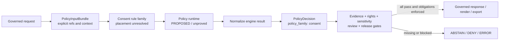
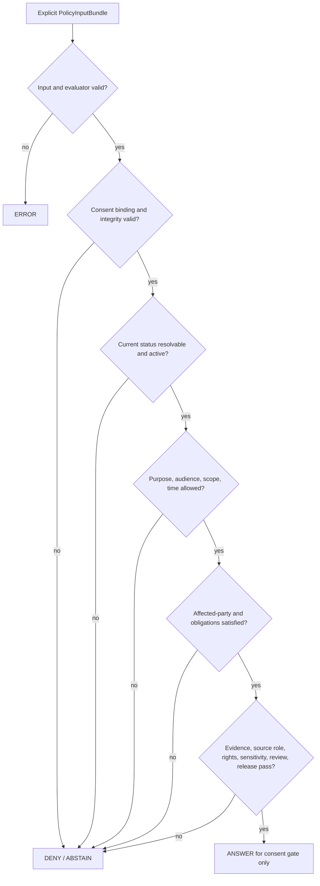

<!-- [KFM_META_BLOCK_V2]
doc_id: kfm://policy/consent/people-dna-land
title: policy/consent/people-dna-land/ — Restricted-Domain Consent Gate
type: policy-readme
version: v0.2
status: draft
owners: OWNER_TBD — Consent steward · Privacy steward · People-DNA-Land domain steward · Policy steward · Policy-runtime steward · Evidence steward · Release steward · Docs steward
created: 2026-06-15
updated: 2026-07-14
policy_label: "restricted-review; consent; living-person; genealogy; dna-genomic; land-linked-person; purpose-bound; revocable; finite-outcomes; explicit-inputs; no-hidden-fetches; fail-closed; evidence-aware; rights-aware; sensitivity-aware; release-gated; cache-invalidation; replayable; rollback-aware; no-reidentification; no-secrets"
current_path: policy/consent/people-dna-land/README.md
truth_posture: CONFIRMED repository path, parent and sibling consent READMEs, People-DNA-Land consent doctrine, PolicyInputBundle and PolicyDecision semantic contracts, paired policy schemas, canonical PolicyDecision outcome and policy-family enums, policy-runtime package placeholder version, and TODO-only policy workflow / PROPOSED restricted-domain consent rule family, engine-result normalization, reason-code registry, obligation registry, consent token or sidecar binding, revocation introspection, multi-party consent, receipt emission, cache invalidation, and governed API integration / CONFLICTED top-level policy/consent placement versus domain-nested consent placement, duplicate CONSENT.md versus CONSENT_MODEL.md doctrine carriers, and engine-native ALLOW-RESTRICT-HOLD vocabulary versus canonical ANSWER-ABSTAIN-DENY-ERROR PolicyDecision vocabulary / UNKNOWN executable consent policy modules, accepted credential format, evaluator binding, active policy bundle, runtime enforcement, deployed revocation service, production caches, release integration, and branch-protection enforcement / NEEDS VERIFICATION accepted owners, placement ADR, supersession records, schema hardening, validators, fixtures, tests, CI, reason codes, obligation interpreter, receipt/proof links, retention and purge rules, multi-party consent, death-of-holder handling, and rollback automation
evidence_snapshot:
  repository: bartytime4life/Kansas-Frontier-Matrix
  repository_id: "1059091169"
  visibility: public
  base_ref: main
  base_commit: 8bb1d0b8b288781169e5592d60962cd7537fc37c
  prior_blob: cdf3795f1c9c0a467084d078bb6b039ae52bc506
  bounded_path_search: target lane, parent and sibling consent lanes, People-DNA-Land consent doctrine, policy contracts and schemas, policy runtime package, policy workflow, Directory Rules, and drift/verification registers
related:
  - ../README.md
  - ../people/README.md
  - ../../../docs/domains/people-dna-land/CONSENT_MODEL.md
  - ../../../docs/domains/people-dna-land/CONSENT.md
  - ../../../docs/domains/people-dna-land/CONSENT_REGISTER.md
  - ../../../docs/domains/people-dna-land/CANONICAL_PATHS.md
  - ../../../docs/domains/people-dna-land/SENSITIVITY_PROFILE.md
  - ../../../docs/domains/people-dna-land/API_CONTRACTS.md
  - ../../../docs/standards/CONSENT_TOKENS.md
  - ../../../docs/standards/DUO_PROFILE.md
  - ../../../contracts/policy/policy_input_bundle.md
  - ../../../contracts/policy/policy_decision.md
  - ../../../schemas/contracts/v1/policy/policy_input_bundle.schema.json
  - ../../../schemas/contracts/v1/policy/policy_decision.schema.json
  - ../../../packages/policy-runtime/README.md
  - ../../../packages/policy-runtime/pyproject.toml
  - ../../../apps/governed-api/README.md
  - ../../../docs/doctrine/directory-rules.md
  - ../../../docs/doctrine/trust-membrane.md
  - ../../../docs/registers/DRIFT_REGISTER.md
  - ../../../docs/registers/VERIFICATION_BACKLOG.md
  - ../../../.github/workflows/policy-test.yml
tags: [kfm, policy, consent, people-dna-land, living-person, genealogy, dna, genomics, land, privacy, revocation, render-gate, policy-input-bundle, policy-decision, obligations, reason-codes, fail-closed, rollback]
notes:
  - "This revision changes only policy/consent/people-dna-land/README.md."
  - "The path is CONFIRMED repository-present, but its authority remains CONFLICTED because current People-DNA-Land path doctrine says the placement ADR is unresolved and prefers domain-nested consent rules pending that ADR."
  - "Bounded repository search did not surface executable consent Rego, a ConsentSidecar schema, domain consent fixtures, or domain consent tests. This is search-limited and not proof of permanent absence."
  - "PolicyDecision is repository-present with canonical outcomes ANSWER, ABSTAIN, DENY, and ERROR and policy_family consent. Engine-native ALLOW, RESTRICT, and HOLD require explicit normalization before public or runtime use."
  - "PolicyInputBundle is repository-present, but its paired schema remains a permissive placeholder requiring only id; the consent context described here is not yet machine-enforced."
  - "The policy runtime package is version 0.0.0 and the policy-test workflow currently contains TODO echo steps, so runtime and CI enforcement remain unproved."
[/KFM_META_BLOCK_V2] -->

<a id="top"></a>

# Restricted-Domain Consent Gate

`policy/consent/people-dna-land/`

> Consent-policy boundary for living-person, genealogy, DNA/genomic, derivative-relationship, and land-linked person operations. This lane may decide whether consent blocks a precisely scoped action; it cannot establish identity truth, relationship truth, land-title truth, evidence closure, rights clearance, sensitivity clearance, review approval, release approval, or publication.


**Quick links:** [Purpose](#purpose) · [Authority](#authority-level) · [Status](#status-and-evidence) · [Scope](#scope-and-bounded-context) · [Invariants](#keystone-invariants) · [Repo fit](#repository-fit-and-directory-rules-basis) · [Belongs](#what-belongs-here) · [Exclusions](#what-does-not-belong-here) · [Inputs](#explicit-policy-input) · [Decisions](#decision-vocabulary-and-normalization) · [Lifecycle](#consent-lifecycle) · [Evaluation](#evaluation-order) · [Revocation](#revocation-correction-and-cache-invalidation) · [Validation](#validation-and-test-matrix) · [Implementation](#smallest-sound-implementation-sequence) · [Done](#definition-of-done) · [Open](#open-verification-register) · [Rollback](#rollback-correction-and-supersession)

> [!IMPORTANT]
> **Consent is necessary where policy requires it, but never sufficient.** A consent result may only say that consent does or does not block the exact operation, audience, purpose, field or relation, temporal window, precision, and subject binding that were evaluated. Public or restricted materialization still requires evidence, source-role, rights, sensitivity, review, release, correction, and rollback gates.

> [!CAUTION]
> **Repository presence is not policy activation.** This README exists, but current evidence does not establish executable rules, an accepted bundle, evaluator wiring, consent schemas, domain fixtures, tests, receipt emission, deployed revocation introspection, cache invalidation, or production enforcement.

---

## Purpose

This lane documents the restricted-domain consent gate for People / Genealogy / DNA / Land operations.

It exists to make consent decisions:

- purpose-bound;
- audience-bound;
- subject- or holder-bound;
- field-, relation-, derivative-, precision-, export-, and operation-specific;
- time-bounded;
- revocation- and dispute-aware;
- finite in outcome;
- obligation-bearing;
- auditable and replayable;
- correctable;
- fail-closed.

The lane must prevent a valid consent record from being misused as:

- a general publication license;
- an identity, relationship, occupancy, ownership, title, or boundary proof;
- a source-rights grant;
- a sensitivity downgrade;
- a release approval;
- a waiver of citation;
- permission to reconstruct revoked or withheld information;
- permission to expose raw DNA kit/vendor identifiers or segments;
- permission to bypass governed APIs.

[Back to top](#top)

---

## Authority level

This lane is **policy-authoritative only after placement, ownership, review, bundle, and activation controls are accepted**.

| Concern | Authority in this lane |
|---|---|
| Consent admissibility | Potential authority after accepted executable rules and review. |
| Policy input meaning | None. `contracts/policy/policy_input_bundle.md` owns meaning. |
| Policy decision meaning | None. `contracts/policy/policy_decision.md` owns the canonical result. |
| Machine shape | None. `schemas/contracts/v1/` owns shape. |
| Runtime execution | None. `packages/policy-runtime/` is the executor boundary. |
| Evidence or source authority | None. Evidence and source registries remain independent. |
| Rights and sensitivity | None. Independent policy families must also pass. |
| Identity, relationship, or land truth | None. Consent cannot prove a claim. |
| Review and release | None. `release/` and review artifacts retain authority. |
| Receipts and proofs | None. Emitted trust artifacts live outside this lane. |
| Public API/UI behavior | None. Governed applications consume normalized decisions. |

A consent rule can block an operation. It cannot publish, prove, or authorize beyond its exact gate.

[Back to top](#top)

---

## Status and evidence

### Current repository state

| Surface | Status | Safe conclusion |
|---|---:|---|
| This README | **CONFIRMED** | The target lane exists and previously documented a draft consent boundary. |
| Parent and sibling consent READMEs | **CONFIRMED** | `policy/consent/README.md` and `policy/consent/people/README.md` exist. |
| Placement | **CONFLICTED** | `CANONICAL_PATHS.md` records an open ADR and prefers domain-nested rules pending resolution. |
| Domain consent doctrine | **CONFIRMED DRAFT DOCS** | `CONSENT_MODEL.md` and `CONSENT.md` exist; the model says it supersedes the older filename, but both remain. |
| `PolicyInputBundle` contract/schema | **CONFIRMED / PLACEHOLDER SHAPE** | Meaning is documented; the paired schema requires only `id` and permits additional properties. |
| `PolicyDecision` contract/schema | **CONFIRMED / PROPOSED SHAPE** | Canonical outcomes are `ANSWER`, `ABSTAIN`, `DENY`, `ERROR`; `policy_family` includes `consent`. |
| Consent executable modules | **NOT SURFACED IN BOUNDED SEARCH** | No consent Rego or equivalent evaluator was established. |
| Consent-specific schema, fixtures, tests | **NOT SURFACED IN BOUNDED SEARCH** | No `ConsentSidecar` schema or domain consent test suite was established. |
| Policy runtime package | **CONFIRMED PLACEHOLDER** | Package version is `0.0.0`; runtime behavior remains unproved. |
| Policy workflow | **CONFIRMED TODO-ONLY** | OPA and fixture-coverage jobs currently echo TODO. Green CI would not prove policy behavior. |
| Deployment, receipts, cache invalidation | **UNKNOWN** | No runtime or operational evidence was inspected. |

### Evidence boundary

This README may confidently describe verified paths, files, and schema surfaces. It must not claim:

- active consent enforcement;
- legal sufficiency;
- accepted VC/token format;
- current revocation service availability;
- complete cache invalidation;
- public-safe deployment;
- release integration;
- receipt emission;
- complete test coverage;
- branch-protection enforcement.

Those remain `UNKNOWN` or `NEEDS VERIFICATION` until implementation evidence proves them.

[Back to top](#top)

---

## Scope and bounded context

### In scope

- consent checks for living-person records;
- genealogy and family/household relations;
- DNA/genomic source use and DNA-derived relationships;
- person-to-land, residence, occupancy, and property-linked operations;
- purpose, audience, precision, retention, and export scope;
- suspension, revocation, dispute, correction, and supersession;
- obligation propagation;
- finite consent decision normalization;
- fail-closed handling of unavailable support;
- audit and replay metadata requirements;
- cache/derivative invalidation requirements.

### Out of scope

- legal advice;
- identity resolution or personhood truth;
- relationship or title adjudication;
- source acquisition;
- raw DNA/genotype storage;
- rights and licensing decisions;
- sensitivity classification;
- evidence closure;
- semantic contracts or JSON Schemas;
- runtime adapters;
- release approval;
- public UI implementation;
- secrets, credentials, private keys, access tokens, or real sensitive fixtures.

[Back to top](#top)

---

## Keystone invariants

1. **Consent does not publish data.**
2. **Consent is one independent gate; every other required gate still runs.**
3. **Missing, stale, unverifiable, expired, suspended, revoked, disputed, or ambiguous consent fails closed.**
4. **Consent is checked for every consequential render, answer, export, join, derivation, or release-adjacent action.**
5. **Consent is operation-, purpose-, audience-, field/relation-, precision-, export-, and time-specific.**
6. **Consent by one person does not automatically authorize disclosure about another living person.**
7. **Consent to source data does not automatically authorize a new inference, aggregate, relationship, map layer, or export.**
8. **Consent cannot convert assessor/tax records into title truth or parcel geometry into title-boundary proof.**
9. **Raw DNA kit/vendor identifiers, raw genotype, segments, credentials, and private status material never appear in public artifacts, logs, URLs, screenshots, or fixtures.**
10. **A caller must enforce every returned obligation or fail closed.**
11. **Consent decisions are immutable events; later decisions supersede rather than rewrite prior decisions.**
12. **Public clients use governed interfaces and released artifacts, never direct canonical stores or policy internals.**
13. **Inputs are explicit; hidden fetches, model inference, operator memory, or UI state cannot silently fill missing policy facts.**
14. **Correction and rollback remain available even after an allow-like evaluation.**
15. **The lifecycle remains `RAW -> WORK / QUARANTINE -> PROCESSED -> CATALOG / TRIPLET -> PUBLISHED`; consent may gate a step but does not move artifacts.**

[Back to top](#top)

---

## Repository fit and Directory Rules basis

The primary responsibility is policy admissibility, so the owning root is `policy/`. The unresolved issue is the lane shape:

```text
current repository path:
policy/consent/people-dna-land/

domain-nested alternative preferred by current CANONICAL_PATHS.md pending ADR:
policy/domains/people-dna-land/consent/
```

Until an accepted ADR resolves this conflict:

- do not create duplicate executable rule families in both homes;
- do not treat file presence as final authority;
- do not copy rules between lanes without migration and supersession records;
- keep implementation work bounded behind the placement decision;
- record a future move as a governed, reversible migration.

| Responsibility | Owning path or authority |
|---|---|
| Human consent doctrine | `docs/domains/people-dna-land/CONSENT_MODEL.md` |
| Consent register guidance | `docs/domains/people-dna-land/CONSENT_REGISTER.md` |
| Path governance | Directory Rules, `CANONICAL_PATHS.md`, accepted ADRs |
| Policy input meaning | `contracts/policy/policy_input_bundle.md` |
| Policy decision meaning | `contracts/policy/policy_decision.md` |
| Policy shapes | `schemas/contracts/v1/policy/` |
| Token/credential standards | `docs/standards/CONSENT_TOKENS.md`, `DUO_PROFILE.md` |
| Policy execution | `packages/policy-runtime/` |
| Governed boundary | `apps/governed-api/` |
| Receipts and proofs | `data/receipts/`, `data/proofs/`, or accepted homes |
| Release and rollback | `release/` |
| Tests and fixtures | `tests/`, `fixtures/` |
| Drift and verification | `docs/registers/DRIFT_REGISTER.md`, `VERIFICATION_BACKLOG.md` |



[Back to top](#top)

---

## What belongs here

After placement acceptance, this lane may contain:

- restricted-domain consent rule modules;
- consent reason-code and obligation definitions owned by policy;
- safe, non-secret, reviewed policy data documents;
- policy bundle source references;
- rule-level documentation;
- migration and compatibility notes;
- synthetic, generalized, or redacted examples.

Potential rule families include:

- consent reference presence and integrity;
- pseudonymous subject/holder binding;
- purpose and audience matching;
- field, relation, derivative, precision, operation, and export scope;
- retention and expiration;
- suspension and revocation;
- status availability and freshness;
- multi-party or affected-party review;
- dispute and correction hold;
- no-reidentification;
- obligation enforcement capability;
- cache invalidation;
- consent-does-not-publish separation.

[Back to top](#top)

---

## What does not belong here

| Do not put here | Correct owner |
|---|---|
| Semantic contracts | `contracts/` |
| JSON Schemas | `schemas/contracts/v1/` |
| Runtime adapters | `packages/policy-runtime/` |
| Lifecycle records | `data/<phase>/` |
| Consent/evaluation receipts and proof packs | `data/receipts/`, `data/proofs/`, or accepted homes |
| Release manifests, correction notices, withdrawal decisions, rollback cards | `release/` |
| Public routes, serializers, UI/map code | `apps/` or accepted implementation roots |
| Rights or sensitivity rules | Independent accepted policy lanes |
| Real identifiers, DNA data, tokens, credentials, keys, status-list secrets | Never in public docs or fixtures |
| AI-generated relationship claims | Governed AI/evidence surfaces |
| Duplicate executable rules in both possible consent homes | Nowhere without ADR/migration |

[Back to top](#top)

---

## Explicit policy input

Consent evaluation should consume an explicit `PolicyInputBundle` snapshot and must not fetch missing facts from source systems, RAW stores, hidden globals, model context, UI state, operator memory, or network services without a separately governed and recorded resolution step.

| Input family | Minimum content | Fail-closed condition |
|---|---|---|
| Bundle identity | id, version/profile, `spec_hash` when accepted | Missing stable identity |
| Operation | render, review, answer, export, join, derive, correct, withdraw, rollback | Unknown or generic operation |
| Actor and audience | actor/ref, role, public/restricted/steward/partner/export surface | Unknown audience |
| Subject/holder binding | pseudonymous refs, binding method/status | Raw PII, ambiguous binding |
| Consent reference | grant/token/receipt/sidecar refs, issuer, integrity status | Missing or unverifiable |
| Scope | purpose, audience, field/relation, derivative, precision, export class | Request exceeds grant |
| Time | issued, not-before, expiry, retention, evaluation time | Missing/inconsistent/expired |
| Revocation/status | status pointer, purpose, freshness, current result | Revoked, stale, unreachable |
| Multi-party context | affected-party refs or review status where required | Required party unresolved |
| Evidence | EvidenceRef/EvidenceBundle refs and resolver state | Consequential claim unsupported |
| Source role | descriptor refs, authority role, caveats | Role missing or collapsed |
| Rights | terms, redistribution/export limits, embargo | Rights unresolved |
| Sensitivity | living-person, genomic, family, land, location, cultural/safety flags | Posture unknown |
| Release/review | release state, review refs, rollback target | Required support absent |
| Evaluator | bundle id/hash/version and evaluator profile | Missing, stale, unapproved |
| Obligation capability | proof caller can enforce each obligation | Obligation cannot be enforced |
| Prior decisions | supersession, dispute/correction refs, cache state | Stale decision treated as current |

> [!WARNING]
> The repository-present `PolicyInputBundle` schema does not enforce these fields today. A syntactically valid placeholder bundle is not proof that a request is consent-ready.

Policy inputs should use references and minimized state. Do not embed raw names, addresses, DNA segments, kit IDs, access tokens, credentials, or private notes.

[Back to top](#top)

---

## Decision vocabulary and normalization

### Canonical repository-facing decision

The repository-present `PolicyDecision` schema defines:

```text
outcome = ANSWER | ABSTAIN | DENY | ERROR
policy_family = consent
```

A consent evaluator may use lower-level engine results, but governed callers should consume the canonical surface.

| Engine/native result | Canonical outcome | Required posture |
|---|---|---|
| `ALLOW` | `ANSWER` only for the evaluated consent gate | Preserve obligations; all non-consent gates still run. |
| `RESTRICT` or `LIMITED` | `ANSWER` only when every restriction is machine-enforceable | Emit every obligation; otherwise `DENY` or `ERROR`. |
| `HOLD` | `ABSTAIN` | Add `review_required`; public materialization stays blocked. |
| `ABSTAIN` | `ABSTAIN` | Name missing support safely. |
| `DENY` | `DENY` | Block without leaking protected detail. |
| `ERROR` | `ERROR` | Fail closed and preserve process failure. |

> [!IMPORTANT]
> `ANSWER` with `policy_family: consent` means only that consent did not block this exact request and every obligation can be enforced. It is not evidence closure, rights clearance, sensitivity clearance, review approval, or release approval.

Illustrative schema-aligned decision:

```json
{
  "decision_id": "poldec:20260714:consent:restricted-render",
  "outcome": "DENY",
  "policy_family": "consent",
  "reasons": ["consent.revoked"],
  "obligations": ["cache_invalidate"],
  "evaluated_at": "2026-07-14T17:00:00Z"
}
```

### Proposed reason codes

- `consent.missing`
- `consent.subject_binding_unresolved`
- `consent.integrity_invalid`
- `consent.status_unavailable`
- `consent.revoked`
- `consent.suspended`
- `consent.expired`
- `consent.not_yet_valid`
- `consent.purpose_mismatch`
- `consent.audience_mismatch`
- `consent.scope_exceeded`
- `consent.no_reidentification_required`
- `consent.multiparty_unresolved`
- `consent.relationship_disputed`
- `consent.land_link_disputed`
- `consent.obligation_unenforceable`
- `consent.evidence_unresolved`
- `consent.rights_unresolved`
- `consent.sensitivity_unresolved`
- `consent.release_unavailable`
- `consent.evaluator_error`

### Proposed obligations

- `redact_person_attribute`
- `redact_relation`
- `suppress_sensitive_derivative`
- `generalize_person`
- `generalize_land_link`
- `generalize_geometry`
- `restrict_audience`
- `purpose_limit`
- `retention_limit`
- `review_required`
- `attach_citation`
- `attach_consent_notice`
- `block_export`
- `no_reidentification`
- `cache_invalidate`
- `rollback_check_required`

A caller that cannot prove it applied every obligation must fail closed.

[Back to top](#top)

---

## Consent lifecycle

Consent state must remain explicit and event-based.

| State | Meaning | Runtime posture |
|---|---|---|
| `draft` | Being prepared; not enforceable | Block consequential use |
| `granted` | Grant exists and may be evaluated | Evaluate complete scope/status |
| `limited` | Only constrained use is permitted | Apply all obligations |
| `suspended` | Temporarily blocked | `DENY` or `ABSTAIN`; require review |
| `disputed` | Binding, relation, land link, or grant is challenged | `ABSTAIN`; no public materialization |
| `expired` | Validity/retention ended | `DENY` |
| `revoked` | Grant withdrawn | `DENY`; invalidate and assess prior releases |
| `superseded` | New grant replaces prior grant | Evaluate new immutable grant |
| `unknown` | State cannot be verified | `ABSTAIN` or `ERROR`, never allow |

Rules:

- transitions create new events/receipts; do not mutate audit history;
- revocation is checked at every consequential access;
- unavailable status fails closed;
- suspension and dispute remain distinct from final revocation;
- renewal or supersession creates a new grant identity;
- affected caches and derivatives are tracked by dependency references, not guessed.

[Back to top](#top)

---

## Evaluation order

The evaluator should use a deterministic, inspectable order:

1. validate input shape and evaluator/bundle identity;
2. confirm requested operation and audience;
3. confirm pseudonymous subject/holder binding;
4. verify consent reference integrity;
5. resolve current suspension/revocation status;
6. check validity and retention windows;
7. compare purpose, audience, field, relation, derivative, precision, export, and operation scope;
8. evaluate multi-party/affected-party requirements;
9. verify caller obligation capability;
10. evaluate independent evidence, source-role, rights, sensitivity, review, and release context;
11. normalize engine result into `PolicyDecision`;
12. emit or reference receipt-ready metadata;
13. materialize only after every independent gate and obligation passes.



[Back to top](#top)

---

## Joins, derivatives, and land-linked claims

Consent policy must preserve these anti-collapse rules:

- one person’s consent does not authorize disclosure about another living person;
- consent to a DNA source does not establish a derived relationship;
- relationship hypotheses remain hypotheses until evidence/review supports stronger status;
- source consent does not automatically authorize an aggregate, score, model, or AI inference;
- render consent does not imply export consent;
- assessor/tax records remain administrative context, not title truth;
- parcel geometry remains a carrier, not title-boundary proof;
- consent cannot cure unresolved title, occupancy, ownership, or boundary evidence;
- historical deceased-person material may still affect living persons and can remain restricted;
- public AI must not reconstruct revoked, withheld, or consent-limited information from other sources.

[Back to top](#top)

---

## Revocation, correction, and cache invalidation

Revocation and correction must take effect at runtime and must not wait for a release cycle.

A complete revocation path should:

1. verify the revocation event and affected grant;
2. issue an immutable `RevocationReceipt` or accepted equivalent;
3. make the current status observable to the evaluator;
4. deny the next consequential operation;
5. invalidate response, search, graph, tile, export, and model-context caches that depend on the grant;
6. block recomputation from revoked inputs;
7. create tombstone or withdrawal pointers where silent deletion would break lineage;
8. identify affected published releases;
9. trigger correction, withdrawal, or rollback review;
10. preserve minimized audit evidence without retaining prohibited payloads.

> [!CAUTION]
> A revocation implementation that changes a status bit but leaves derived caches, exports, tiles, indexes, or AI retrieval material available is incomplete.

Open operational questions include status-cache TTL, purge versus tombstone, downstream export recall, multi-party withdrawal, holder death, and emergency invalidation.

[Back to top](#top)

---

## Audit, replay, and data minimization

A consequential evaluation should be replayable from minimized metadata:

- decision ID and evaluation time;
- policy family;
- canonical outcome;
- stable reason codes and obligations;
- policy bundle id/hash/version;
- evaluator profile/version;
- input bundle id/hash;
- pseudonymous subject/holder refs;
- grant/token/receipt/sidecar refs or digests;
- revocation/status result and freshness;
- operation, purpose, audience, and scope;
- EvidenceRef/EvidenceBundle refs;
- source-role, rights, sensitivity, review, and release states;
- superseded decision refs;
- correction/withdrawal/rollback refs.

Do not log or receipt raw names, addresses, emails, phone numbers, DNA kit/vendor IDs, genotype/segments, credentials, bearer tokens, private keys, unrestricted status credentials, exact private location, or steward-only narrative.

[Back to top](#top)

---

## Threat model

| Threat | Required control |
|---|---|
| Missing consent treated as allow | Default deny/abstain/error; explicit input requirement |
| Stale revocation state | Freshness policy, bounded cache, fail closed |
| Token/receipt forgery | Signature, issuer, audience, expiry, status, digest verification |
| Scope escalation | Operation/purpose/audience/field/relation/precision/export matching |
| Hidden facts fetched during evaluation | No-hidden-fetch contract and receipt-visible resolution |
| Obligation dropped downstream | Typed obligations and consumer conformance tests |
| Reidentification by joins | No-reidentification and join-policy denial |
| Consent used as evidence or release | Independent-gate tests |
| DNA/PII leakage in logs or fixtures | Synthetic fixtures and leak scans |
| Cache survives revocation | Dependency index, invalidation receipts, bounded SLO |
| AI reconstructs withheld facts | Evidence/release-only retrieval plus consent gate |
| Parallel policy homes drift | ADR, migration plan, no duplicate authority |
| Workflow passes without tests | Replace TODO workflow with executable checks |

[Back to top](#top)

---

## Validation and test matrix

| Test | Expected result |
|---|---|
| README/meta/link/code-fence validation | PASS |
| Missing consent | `ABSTAIN` or `DENY`, never answer |
| Invalid integrity/signature/digest | `DENY` or `ERROR` |
| Revoked consent | `DENY` + `cache_invalidate` |
| Status unavailable/stale | `ABSTAIN` or `ERROR` |
| Expired/not-yet-valid | `DENY` |
| Purpose/audience/scope mismatch | `DENY` |
| Multi-party requirement unresolved | `ABSTAIN` + review obligation |
| Valid consent but missing evidence | `ABSTAIN` |
| Valid consent but rights/sensitivity blocked | `DENY` or `ABSTAIN` |
| Valid consent but no release | no public materialization |
| Restriction with unsupported obligation | `DENY` or `ERROR` |
| Relation/land-link disputed | `ABSTAIN` |
| Assessor used as title proof | `DENY` |
| Parcel geometry used as boundary proof | `DENY` |
| Raw DNA/PII in logs/fixtures | FAIL |
| Revocation invalidates all dependent caches | PASS within accepted SLO |
| Old decision replay after supersession | rejected as stale |
| Engine `ALLOW/RESTRICT/HOLD` normalization | canonical outcome + obligations |
| Evaluator timeout/error | `ERROR`, fail closed |
| Public client bypasses governed API | FAIL |

> [!WARNING]
> `.github/workflows/policy-test.yml` currently contains TODO echo steps. Workflow success is not evidence for these behaviors until executable policy and fixture checks replace those stubs.

Fixtures must be synthetic, generalized, or redacted. Do not choose a final fixture path until the placement ADR and repository test convention are verified.

[Back to top](#top)

---

## Smallest sound implementation sequence

### PR 1 — Authority and vocabulary

- resolve consent-lane placement by ADR;
- record migration/supersession for the losing path;
- resolve `CONSENT.md` versus `CONSENT_MODEL.md`;
- define accepted owners and reviewers;
- accept canonical reason-code and obligation registries;
- accept engine-to-`PolicyDecision` normalization.

### PR 2 — Contracts, schemas, fixtures

- harden `PolicyInputBundle` shape;
- define or link consent-specific object shapes;
- add synthetic positive and negative fixtures;
- add schema and semantic validators;
- add no-PII/no-DNA leak checks.

### PR 3 — Executable policy and CI

- implement rules in the accepted lane;
- bind an approved evaluator and immutable policy bundle;
- replace TODO workflow steps with real tests;
- verify fail-closed behavior and normalization.

### PR 4 — Revocation and governed integration

- implement status/revocation resolution;
- emit receipt-ready evaluation metadata;
- implement dependency-aware cache invalidation;
- integrate governed API, review, correction, withdrawal, and rollback;
- run a revocation drill before activation.

No PR should activate public behavior merely because a README, schema, policy file, or green workflow exists.

[Back to top](#top)

---

## Definition of done

- [ ] Owners and CODEOWNERS coverage are confirmed.
- [ ] Placement ADR is accepted.
- [ ] Losing path has migration, deprecation, and rollback records.
- [ ] `CONSENT_MODEL.md` supersession is reconciled with remaining `CONSENT.md`.
- [ ] Canonical input and decision contracts are accepted.
- [ ] Schema enforces required consent context.
- [ ] Reason-code and obligation registries are accepted.
- [ ] Engine results normalize to canonical outcomes.
- [ ] Policy rules are implemented in one authoritative lane.
- [ ] Policy bundle and evaluator identities are immutable and reviewable.
- [ ] Synthetic fixtures cover positive and negative paths.
- [ ] Validators and executable CI checks pass.
- [ ] No raw DNA, PII, secrets, or credentials appear in logs/fixtures.
- [ ] Governed callers enforce every obligation.
- [ ] Revocation/status checks are fail-closed.
- [ ] Cache invalidation is dependency-aware and drill-tested.
- [ ] Receipts support replay without leaking protected data.
- [ ] Evidence, rights, sensitivity, review, and release remain independent.
- [ ] Correction, withdrawal, supersession, and rollback paths are verified.
- [ ] Public clients cannot bypass governed interfaces.
- [ ] Runtime/deployment evidence is attached before activation claims.

[Back to top](#top)

---

## Open verification register

| ID | Item | Evidence that would settle it |
|---|---|---|
| `CONSENT-PDL-01` | Top-level versus domain-nested consent home | Accepted ADR |
| `CONSENT-PDL-02` | Parent/sibling lane ownership and overlap | ADR + policy inventory |
| `CONSENT-PDL-03` | `CONSENT_MODEL.md` supersession completion | Drift/supersession record |
| `CONSENT-PDL-04` | Accepted consent object vocabulary and schema home | Contracts/schema ADR or review |
| `CONSENT-PDL-05` | `PolicyInputBundle` hardening | Schema + fixtures + validator |
| `CONSENT-PDL-06` | Engine-result normalization | Contract + tests |
| `CONSENT-PDL-07` | Reason-code registry | Accepted registry + messages |
| `CONSENT-PDL-08` | Obligation interpreter | Consumer contract + conformance tests |
| `CONSENT-PDL-09` | VC/token/receipt/sidecar format | Standards decision + implementation |
| `CONSENT-PDL-10` | Status-list/introspection architecture | ADR + runtime evidence |
| `CONSENT-PDL-11` | Multi-party consent | Contract/schema/policy decision |
| `CONSENT-PDL-12` | Holder death and consent ambiguity | Policy/ADR |
| `CONSENT-PDL-13` | Retention after revocation | Rights/privacy policy + drill |
| `CONSENT-PDL-14` | Purge versus tombstone | ADR + lifecycle tests |
| `CONSENT-PDL-15` | Cache dependency index and invalidation SLO | Runtime tests/receipts |
| `CONSENT-PDL-16` | Evaluation receipt/proof linkage | Accepted object/path + replay test |
| `CONSENT-PDL-17` | Governed API integration | Code/tests/runtime traces |
| `CONSENT-PDL-18` | Policy workflow replacement | Executable CI logs |
| `CONSENT-PDL-19` | Separation of duties and review authority | CODEOWNERS + review evidence |
| `CONSENT-PDL-20` | Production enforcement | Deployment config, logs, receipts, drill |

[Back to top](#top)

---

## Review burden and change discipline

Trust-bearing changes require consent/privacy/domain/policy review. Also require:

- contracts/schema reviewers for object or field changes;
- security/runtime reviewers for token, signature, evaluator, or status changes;
- evidence/source reviewers for evidence or source-role inputs;
- release reviewers for correction, withdrawal, or rollback behavior;
- an ADR before creating parallel policy, schema, contract, receipt, proof, or release authority;
- synthetic fixtures only;
- explicit change budget and rollback plan;
- no merge based solely on documentation completeness.

[Back to top](#top)

---

## Rollback, correction, and supersession

### Documentation rollback

This change is one-file and can be reverted by restoring the prior blob:

```text
cdf3795f1c9c0a467084d078bb6b039ae52bc506
```

### Future policy rollback

A future active consent policy must support:

- immutable versioned bundles;
- prior known-good bundle reference;
- decision/input/bundle hash linkage;
- evaluator compatibility checks;
- withdrawal of unsafe versions;
- replay comparison;
- correction notice when public behavior was affected;
- dependency-aware cache invalidation;
- no mutation of historical decisions.

### Supersession

Later changes should issue a new version, preserve lineage, identify what is superseded, and never erase evidence needed to explain prior decisions. A path move must preserve history and leave a clear forward pointer.

[Back to top](#top)

---

## Status summary

`policy/consent/people-dna-land/` is a **CONFIRMED repository-present but placement-CONFLICTED README-only policy lane**.

Its safe current role is to document the restricted-domain consent boundary and the evidence required before activation. It must not be presented as proof of executable consent enforcement.

The next smallest governed step is not more policy prose. It is an ADR-backed placement and vocabulary decision, followed by hardened schemas, synthetic fixtures, executable policy tests, fail-closed runtime wiring, revocation/cache drills, receipt/replay support, and release/rollback integration.

<p align="right"><a href="#top">Back to top</a></p>
