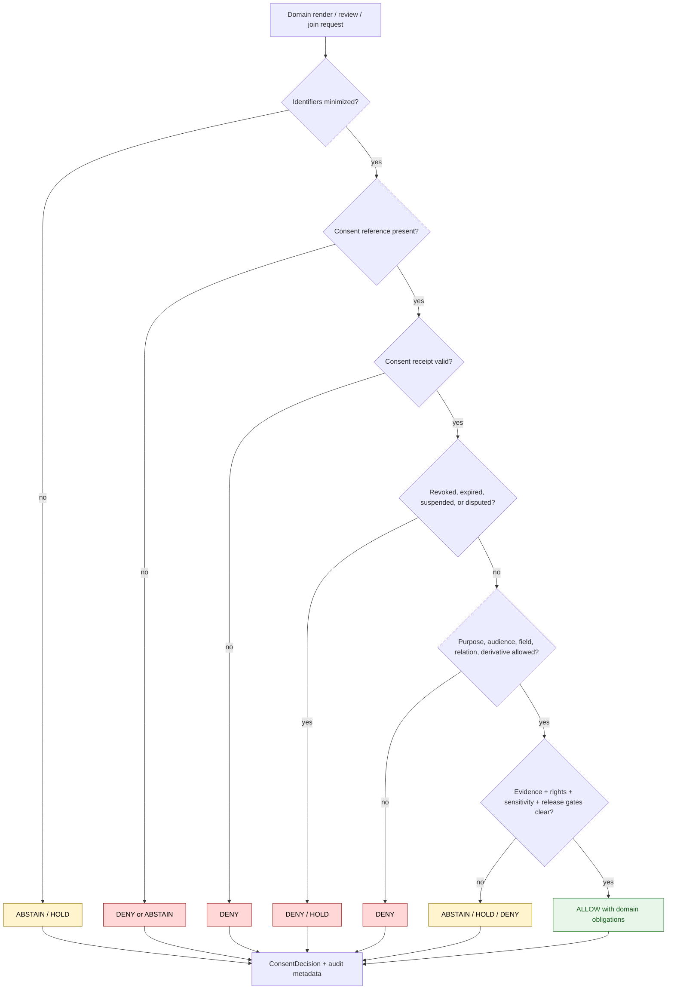

<!-- [KFM_META_BLOCK_V2]
doc_id: kfm://policy/consent/people-dna-land
title: People-DNA-Land Consent Policy README
type: policy-readme
version: v0.1
status: draft
owners: OWNER_TBD — Consent steward · Privacy steward · Domain steward · Policy steward · Docs steward
created: 2026-06-15
updated: 2026-06-15
policy_label: restricted
related:
  - ../README.md
  - ../people/README.md
  - ../../../docs/domains/people-dna-land/CONSENT_MODEL.md
  - ../../../docs/domains/people-dna-land/CONSENT_REGISTER.md
  - ../../../docs/domains/people-dna-land/SENSITIVITY_PROFILE.md
  - ../../../docs/doctrine/trust-membrane.md
  - ../../../docs/doctrine/directory-rules.md
  - ../../../packages/policy-runtime/README.md
  - ../../../apps/governed-api/README.md
tags: [kfm, policy, consent, restricted-domain, privacy, revocation, render-gate, fail-closed]
notes:
  - "Initial README for this domain consent policy lane."
  - "Consent constrains render-time materialization; it does not publish data and does not replace rights, sensitivity, evidence, review, release, correction, or rollback gates."
  - "Placement remains PROPOSED until the consent-policy placement ADR resolves top-level and domain-scoped consent homes."
  - "Runtime enforcement, schemas, fixtures, tests, revocation infrastructure, consent-decision receipts, and consent-register binding remain NEEDS VERIFICATION."
[/KFM_META_BLOCK_V2] -->

<a id="top"></a>

<div align="center">

# People-DNA-Land Consent Policy

`policy/consent/people-dna-land/`

**Consent-policy lane for a restricted KFM domain where person-linked records and derived relationships require purpose-bound, revocable, fail-closed consent checks.**


[Scope](#1-scope) · [Repo fit](#2-repo-fit) · [Inputs](#5-inputs) · [Exclusions](#6-exclusions) · [Lifecycle](#7-consent-lifecycle) · [Diagram](#8-diagram) · [Definition of done](#14-definition-of-done)

</div>

---

> [!IMPORTANT]
> **Status:** draft / `NEEDS VERIFICATION`  
> **Owners:** `OWNER_TBD` — Consent steward · Privacy steward · Domain steward · Policy steward · Docs steward  
> **Path:** `policy/consent/people-dna-land/README.md`  
> **Responsibility root:** `policy/` — policy-as-code and policy documentation  
> **Truth posture:** CONFIRMED file path / PROPOSED domain consent policy lane / UNKNOWN runtime enforcement

> [!CAUTION]
> **Consent does not publish data.** A consent decision only says whether consent blocks a scoped render or review. It never substitutes for evidence closure, rights, sensitivity, validation, review state, release state, correction path, or rollback support.

---

## Quick jump

- [1. Scope](#1-scope)
- [2. Repo fit](#2-repo-fit)
- [3. Consent boundary](#3-consent-boundary)
- [4. Default posture](#4-default-posture)
- [5. Inputs](#5-inputs)
- [6. Exclusions](#6-exclusions)
- [7. Consent lifecycle](#7-consent-lifecycle)
- [8. Diagram](#8-diagram)
- [9. Decision vocabulary](#9-decision-vocabulary)
- [10. Domain obligations](#10-domain-obligations)
- [11. Revocation and correction posture](#11-revocation-and-correction-posture)
- [12. Inspection path](#12-inspection-path)
- [13. Validation expectations](#13-validation-expectations)
- [14. Definition of done](#14-definition-of-done)
- [15. Open verification items](#15-open-verification-items)

---

## 1. Scope

`policy/consent/people-dna-land/` is a proposed consent-policy lane for a restricted domain that combines person-linked, relationship-linked, derivative, and land-linked records.

It should describe and eventually bind consent checks for whether a governed render, review, export, join, relationship display, derivative summary, or land-linked person claim may be materialized under a valid consent grant and within its purpose, audience, retention, precision, and revocation constraints.

In scope:

- consent posture for person-linked records
- consent posture for relationship and derivative summaries
- land-linked person claim consent posture
- consent-register and consent-decision expectations
- purpose, audience, retention, and revocation checks
- obligations such as redact, generalize, restrict audience, withhold relation, suppress derivative detail, or require review
- audit and receipt expectations for consequential consent decisions

Out of scope:

- legal advice
- source acquisition
- rights/licensing policy
- sensitivity tier policy
- schema definitions
- contract meaning
- release approval
- public UI implementation
- lifecycle data storage
- identity-provider credentials or secrets

[Back to top](#top)

---

## 2. Repo fit

| Concern | Owning root | Expected relationship |
|---|---|---|
| Domain consent policy lane | `policy/consent/people-dna-land/` | This README; active policy files remain `NEEDS VERIFICATION` |
| Consent policy parent | `policy/consent/` | Parent consent posture and shared gate vocabulary |
| People consent sublane | `policy/consent/people/` | Narrow person-linked consent posture |
| Domain consent doctrine | `docs/domains/people-dna-land/CONSENT_MODEL.md` | Human-facing consent model and domain guidance |
| Consent register docs | `docs/domains/people-dna-land/CONSENT_REGISTER.md` | Human-facing register guidance; not executable policy authority |
| Runtime policy evaluation | `packages/policy-runtime/` or governed API policy runtime | Implementation home remains `NEEDS VERIFICATION` |
| Public / reviewer API boundary | `apps/governed-api/` | Consent checks should be enforced through governed interfaces |
| Consent schemas | `schemas/contracts/v1/` or verified consent schema home | Machine shape remains `NEEDS VERIFICATION` |
| Stored receipts and proofs | `data/receipts/`, `data/proofs/`, or verified homes | Exact homes remain `NEEDS VERIFICATION` |

> [!WARNING]
> Existing domain consent doctrine records consent-lane placement as an open ADR between top-level `policy/consent/` and a domain-scoped consent policy home. This sublane must remain draft until that placement is resolved.

## 3. Consent boundary

Consent is one independent gate. It is not identity truth, relationship truth, land-title truth, rights clearance, sensitivity clearance, evidence closure, review approval, release approval, correction, or rollback.

Short rule:

```text
policy/consent/people-dna-land/ = domain-scoped consent gate, if accepted
policy/consent/                 = shared consent gate posture
policy/sensitivity/             = sensitivity, geoprivacy, and exposure policy
contracts/                      = object meaning
schemas/contracts/v1/            = machine-readable shape
release/                        = publication, correction, rollback control
data/                           = lifecycle state, receipts, proofs, artifacts
```

## 4. Default posture

Consent policy should fail closed.

A render, review, export, join, relationship display, derivative summary, or land-linked person request should return `DENY`, `ABSTAIN`, or `HOLD` when any of these are missing, stale, ambiguous, expired, revoked, disputed, or unsupported:

- consent grant reference
- subject or holder binding
- requested purpose
- requested audience
- requested field, relationship, derivative, or land-linked claim
- retention window
- revocation status
- evidence reference
- sensitivity context
- rights context
- release or candidate state
- audit context

## 5. Inputs

| Input family | Examples | Required posture |
|---|---|---|
| Consent record | ConsentGrant, ConsentSidecar reference, consent receipt, status-list reference | Verified, scoped, revocation-checkable |
| Subject context | subject pseudonym, holder reference, record reference | Minimized and privacy-preserving |
| Domain derivative context | derived relationship, inferred link, sensitive derivative flag | Opaque and minimized |
| Land context | parcel/person relation, chain-of-title relation, ownership/occupancy claim | Evidence-backed and purpose-bound |
| Request context | actor, audience, purpose, scope, field/relation requested, timestamp | Explicit and auditable |
| Revocation state | RevocationReceipt, tombstone, status-list bit, invalidation event | Checked before consequential render |
| Evidence / release context | EvidenceRef, EvidenceBundle status, release state, citation validation | Required for consequential claim display |
| Sensitivity / rights context | domain-sensitive flags and rights status | Fail closed when unresolved |

## 6. Exclusions

| Does not belong here | Correct home |
|---|---|
| Consent schemas | `schemas/contracts/v1/` |
| Domain object semantic contracts | `contracts/` |
| Protected source data | `data/` lifecycle roots with policy controls |
| Sensitive external identifiers or secrets | Secret manager / deployment config, not repo docs |
| Consent receipts and proof storage | `data/receipts/`, `data/proofs/`, or verified homes |
| Release manifests and rollback authority | `release/` |
| Rights/licensing policy | accepted rights policy lane |
| Sensitivity and geoprivacy policy | `policy/sensitivity/` |
| Public UI or API implementation | `apps/` or governed UI/API packages |
| Runtime helper code | `packages/policy-runtime/` |
| Legal advice | Outside repository policy docs |

## 7. Consent lifecycle

Domain consent state must remain explicit, revocable, auditable, purpose-bound, and join-aware.

| State | Meaning | Runtime posture |
|---|---|---|
| `draft` | Consent record is being prepared | Not usable for public or reviewer materialization |
| `granted` | Consent grant exists and can be evaluated | Check purpose, scope, audience, retention, revocation, and obligations |
| `limited` | Consent allows constrained fields, relations, derivatives, purpose, or audience only | Enforce obligations and restrictions |
| `disputed` | Consent, relation, or identity binding is challenged | `HOLD` for review; do not render publicly |
| `expired` | Retention or validity window has ended | `DENY` unless renewed and verified |
| `revoked` | Consent was withdrawn | `DENY` and invalidate dependent caches |
| `unknown` | Consent cannot be verified | `ABSTAIN` or `DENY`, never implicit allow |

## 8. Diagram



## 9. Decision vocabulary

| Decision | Meaning | Required behavior |
|---|---|---|
| `ALLOW` | Consent permits this scoped domain action | Enforce obligations and still require other gates |
| `DENY` | Consent blocks the action | Do not reveal protected details beyond safe denial text |
| `ABSTAIN` | Consent cannot be evaluated due to missing support | Block action and name missing support where safe |
| `HOLD` | Human review, dispute resolution, or steward check is required | Do not render publicly |
| `ERROR` | Runtime, schema, signature, status-list, or evaluator failure | Fail closed and record failure |

## 10. Domain obligations

| Obligation | Example effect |
|---|---|
| `redact_attribute` | Withhold protected field or private note |
| `redact_relation` | Withhold family, household, derivative, or property relation |
| `suppress_sensitive_derivative` | Suppress derivative inference or relation until consent clears |
| `generalize_land_link` | Show non-identifying land-linked summary only |
| `restrict_audience` | Limit to steward, reviewer, named party, or authenticated surface |
| `purpose_limit` | Permit review but deny public map rendering |
| `review_required` | Route sensitive or disputed material to privacy / domain review |
| `cache_invalidate` | Remove cached derivatives after revocation, correction, or withdrawal |

## 11. Revocation and correction posture

Revocation and correction must take effect at render time.

Required posture:

- check revocation before consequential render
- treat unavailable revocation state as fail-closed
- invalidate derivative, relation, land-link, and summary caches when consent is revoked or disputed
- preserve correction lineage when a relationship, land link, or derived assertion is withdrawn or corrected
- avoid logging direct identifiers or sensitive relationship details
- retain audit records with minimized subject references

## 12. Inspection path

Policy modules, schemas, fixtures, receipts, and tests remain `NEEDS VERIFICATION`. Use these local inspection commands before treating this lane as implemented.

```bash
# From the repository root, inspect this policy lane.
find policy/consent/people-dna-land -maxdepth 4 -type f | sort

# Inspect parent consent policy and domain consent docs.
find policy/consent docs/domains/people-dna-land -maxdepth 4 -type f | grep -Ei 'consent|people|land|privacy|sensitivity|release' | sort

# Inspect likely domain-consent tests and fixtures.
find tests fixtures -maxdepth 5 -type f 2>/dev/null | grep -E 'consent|people|land|privacy|revocation' | sort
```

## 13. Validation expectations

Useful validation for this lane should cover:

- missing consent returns `DENY` or `ABSTAIN`
- protected render with no consent returns `DENY`
- sensitive derivative render with no consent returns `DENY`
- expired consent returns `DENY`
- revoked consent returns `DENY`
- disputed relationship, derivative, or land-linked identity claim returns `HOLD`
- requested field, relationship, derivative, or land-linked claim outside scope returns `DENY`
- unresolved rights, sensitivity, evidence, or release state still blocks render even when consent is valid
- obligations are preserved in the output decision
- revocation invalidates dependent caches or derivatives
- direct identifiers and private relation details are not leaked in logs

## 14. Definition of done

- [ ] Owners are confirmed and `OWNER_TBD` is replaced.
- [ ] Parent consent placement ADR is resolved.
- [ ] Domain consent policy runtime language and bundle location are confirmed.
- [ ] Domain-specific ConsentDecision shape is created or linked where accepted.
- [ ] Consent register binding is documented or linked.
- [ ] Revocation, dispute, relation-withdrawal, and cache-invalidation handling are documented or linked.
- [ ] Tests and fixtures cover allow, deny, abstain, hold, error, expired, revoked, disputed, derivative, land-linked, and out-of-scope paths.
- [ ] Consent decisions are auditable and replayable with minimized subject references.
- [ ] Public renders use governed interfaces and check consent every time.
- [ ] Release approval remains separate from consent decisions.

## 15. Open verification items

| Item | Why it matters |
|---|---|
| Confirm accepted placement for `policy/consent/people-dna-land/` | Prevents duplicate consent policy homes |
| Confirm sublane split with `policy/consent/people/` | Keeps overlap controlled and reviewable |
| Confirm schemas and contracts | Required for machine-checkable decisions |
| Confirm consent-register binding | Required for consistent grant lookup and revocation |
| Confirm revocation and dispute handling | Required for effective runtime consent |
| Confirm tests and fixtures | Required before active enforcement |
| Confirm audit event shape | Required for accountability and replay |
| Confirm cache invalidation path | Required for revocation effectiveness |
| Confirm identifier handling | Prevents privacy leakage |

<details>
<summary>Appendix A — no-loss preservation note</summary>

The target file was an empty placeholder. This README adds a bounded domain consent policy lane without claiming runtime enforcement, legal sufficiency, schemas, fixtures, tests, consent-register implementation, revocation infrastructure, consent receipts, or CI coverage.

It preserves the domain consent doctrine's keystone rule: consent constrains render-time materialization and does not publish data.

</details>

## Status summary

`policy/consent/people-dna-land/` should define this restricted domain consent policy only if the parent consent-policy placement is accepted.

It should enforce purpose-bound, revocable, retention-aware, fail-closed consent checks while preserving separate rights, sensitivity, evidence, review, release, correction, rollback, schema, contract, and lifecycle boundaries.

<p align="right"><a href="#top">Back to top</a></p>
